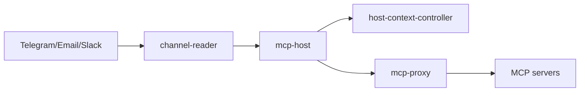

# Architecture

evenfire is a Kubernetes-native platform for LLM orchestration. Configuration is
driven by Custom Resources under the historical API group `clerum.io`
([code names](docs/concepts/code-names.md)).

For the full reference (services, CRDs, message lifecycle, NetworkPolicy model),
start here:

- **[docs/architecture/overview.md](docs/architecture/overview.md)**
- **[docs/architecture/platform-topology.md](docs/architecture/platform-topology.md)**
- **[docs/README.md](docs/README.md)** (index)

## Layers (summary)

- **Core orchestration** — `mcp-host` (agent runtime: LLM loop, MCP tools, state
  machine, approval gate, queue).
- **Control plane** — `host-context-controller` (Context / McpServer /
  NetworkPolicy reconciliation), `control-api`, and the platform CRDs (Host,
  Context, McpServer, CommunicationChannel, WorkflowRecipe,
  WorkflowRecipePolicy, SharedFileSystem, GlobalFileSystem).
- **Channels & surfaces** — `channel-reader` (Telegram / Email / Slack),
  `control-ui`, `profile-ui`, `desktop-app`, `external-rest-api`, `rpc-proxy`,
  `mcp-proxy`.
- **Extensions** — MCP servers and WorkflowRecipes provisioned via CRDs; registry
  client in-repo (registry server may be separate).
- **Commercial (not in this repo)** — managed multi-tenancy and hosted
  registry-as-a-service.

## Swapping LLM providers

Set `CLERUM_MODEL_PROVIDER` to `openai | claude | zai | bailian` and supply the
matching API key. One interface, no code change. See
[mcp-host/README.md](mcp-host/README.md).

## Security

Product-level model: [README security section](README.md#security-model).  
Reporting: [SECURITY.md](SECURITY.md).
