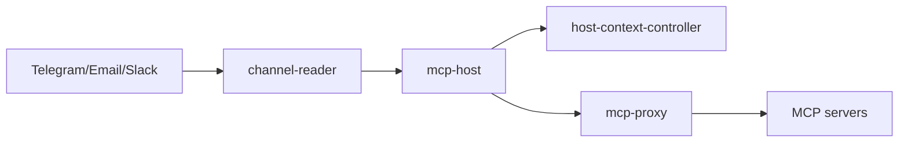

# Architecture

evenfire is a Kubernetes-native platform for LLM orchestration. Everything is
driven by Custom Resources under `clerum.io`.

## Layers

- **Core orchestration** — `mcp-host` (the agent runtime: LLM loop, MCP tool
  calling, state machine, queue).
- **Control plane** — `host-context-controller` (operator for Context/McpServer/
  WorkflowRecipe + NetworkPolicy) and `control-api` + the five CRDs
  (Host, Context, McpServer, CommunicationChannel, WorkflowRecipe).
- **Channels & surfaces** — `channel-reader` (Telegram/Email/Slack), `control-ui`,
  `profile-ui`, `desktop-app`, `external-rest-api`, `rpc-proxy`, `mcp-proxy`.
- **Extensions** — MCP servers and WorkflowRecipes are provisioned declaratively via CRDs. The platform integrates with an external MCP/recipe **registry**; this repo ships the client integration (the registry server is a separate component).
- **Commercial (not in this repo)** — the managed-multitenancy control plane and
  hosted registry-as-a-service are separate, commercial components.

## Swapping LLM providers
Set `CLERUM_MODEL_PROVIDER` to `openai | claude | zai | bailian` and supply the
matching API key. One interface, no code change.
