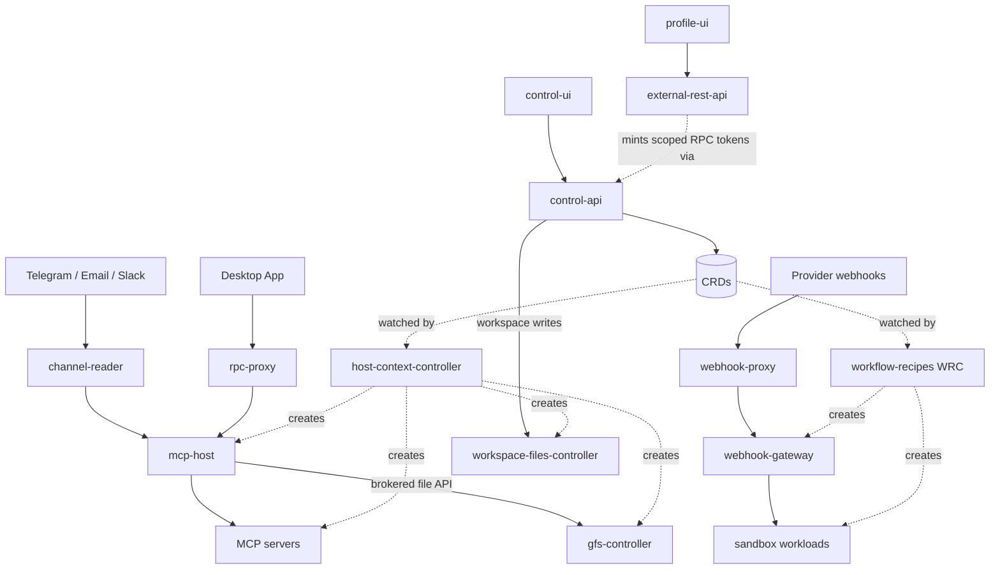

# Architecture

evenfire is a Kubernetes-native platform for LLM orchestration. Configuration is
driven by Custom Resources under the historical API group `clerum.io`
([code names](docs/concepts/code-names.md)).

This page is the map: every service, where it runs, and which controller creates
it. For the authoritative deep reference — namespaces, trust boundaries,
NetworkPolicy layers, data flows — read:

- **[docs/architecture/platform-topology.md](docs/architecture/platform-topology.md)** — the full platform reference (start here)
- **[docs/architecture/overview.md](docs/architecture/overview.md)** — message lifecycle and deep-dives on `channel-reader`, `mcp-host`, `host-context-controller`
- **[docs/crds/](docs/crds/)** — reference page per CRD
- **[docs/README.md](docs/README.md)** — docs index

## The core idea

Two controllers turn Custom Resources into running workloads. Almost nothing in
the platform is deployed by hand:

| Controller                                                    | Watches                                                                | Creates                                                                                                                                                                                   |
| ------------------------------------------------------------- | ---------------------------------------------------------------------- | ----------------------------------------------------------------------------------------------------------------------------------------------------------------------------------------- |
| **[host-context-controller](host-context-controller/)** (HCC) | `Host`, `Context`, `McpServer`, `SharedFileSystem`, `GlobalFileSystem` | `mcp-host` pods, MCP server pods (+ `stdio-bridge` sidecar, `nginx-egress-proxy` for remote servers), `workspace-files-controller`, `gfs-controller`, and the Context/MCP NetworkPolicies |
| **[workflow-recipes](workflow-recipes/)** (WRC)               | `WorkflowRecipe`, `WorkflowRecipePolicy`                               | sandbox workloads (Deployments/StatefulSets/Jobs/CronJobs), per-recipe `webhook-gateway`, derived `McpServer` CRDs, and the recipe runtime NetworkPolicies                                |

Everything else — the UIs, the APIs, the channel readers, the proxies — is
static infrastructure in [`deploy/`](deploy/).

The security posture is **deny-all by default**: every runtime namespace denies
all ingress and egress, and each connection is opened by an explicit
NetworkPolicy owned by whichever component is responsible for that selector.

## Services

### Control plane — `control-plane`

| Service                                             | Role                                                                  |
| --------------------------------------------------- | --------------------------------------------------------------------- |
| [host-context-controller](host-context-controller/) | Reconciles Host / Context / McpServer / SFS / GFS; Discovery REST API |
| [workflow-recipes](workflow-recipes/)               | The WorkflowRecipe controller (WRC) — a separate Deployment and image |
| [control-api](control-api/)                         | CRD lifecycle, resource CRUD, profile mapping                         |
| [control-ui](control-ui/)                           | Platform management UI                                                |

### Identity & profiles — `profiles`

| Service                                 | Role                                                           |
| --------------------------------------- | -------------------------------------------------------------- |
| [external-rest-api](external-rest-api/) | User-facing profile, auth, team, invitation, and RPC-token API |
| [profile-ui](profile-ui/)               | User-facing profile management UI                              |

### Channels — `channels`

| Service                                                               | Role                                                                                  |
| --------------------------------------------------------------------- | ------------------------------------------------------------------------------------- |
| [channel-reader](channel-reader/)                                     | Polls Telegram / Email / Slack, forwards messages to `mcp-host`                       |
| [workflow-approval-request-reader](workflow-approval-request-reader/) | Inbound half of channel approvals — receives provider callbacks and submits decisions |

### Agent runtime — `mcp-host`, `mcp-server` (both deny-all)

| Service                                   | Role                                                                                   |
| ----------------------------------------- | -------------------------------------------------------------------------------------- |
| [mcp-host](mcp-host/)                     | The agent: LLM loop, MCP tool calling, state machine, approval gate, queue             |
| [mcp-proxy](mcp-proxy/)                   | Optional centralized MCP router (`MCP_PROXY_ENABLED`); discovers servers via HCC       |
| [stdio-bridge](stdio-bridge/)             | Sidecar translating stdio MCP transport to StreamableHTTP; injected by HCC             |
| [nginx-egress-proxy](nginx-egress-proxy/) | Image only — the pinned egress path HCC deploys for remote (`spec.remote`) MCP servers |
| [mcp-servers](mcp-servers/)               | First-party MCP servers (Airtable, MongoDB, Playwright, web-search, …)                 |

### Recipes & sandbox — `sandbox-recipes`, `sandbox-ui` (both deny-all)

Workloads here are created by the WRC from `WorkflowRecipe` resources, not by
static manifests. `sandbox-ui` holds untrusted recipe-supplied UIs, reachable
only through `rpc-proxy`.

### Files

Both are brokered HTTP file APIs: nothing else mounts the underlying volume, so
every read and write is an authorized, audited API call rather than a raw mount.

| Service                                                   | Namespace                  | Role                                                                                                |
| --------------------------------------------------------- | -------------------------- | --------------------------------------------------------------------------------------------------- |
| [gfs-controller](gfs-controller/)                         | `gfs` (deny-all)           | The GlobalFileSystem drive API — the only workload that mounts the drive PVC                        |
| [workspace-files-controller](workspace-files-controller/) | the SharedFileSystem's own | Per-SharedFileSystem API; the write path for a team workspace (agents mount the same PVC read-only) |

### Edge — `rpc-proxy`, `webhook-ingress`, `ingress` (all deny-all)

| Service                             | Role                                                                                 |
| ----------------------------------- | ------------------------------------------------------------------------------------ |
| [rpc-proxy](rpc-proxy/)             | Secure RPC path for the Desktop App → MCP servers / agent (RS256 JWT, scoped tokens) |
| [webhook-proxy](webhook-proxy/)     | Cluster-shared public webhook router; validates and streams, holds no secrets        |
| [webhook-gateway](webhook-gateway/) | Per-recipe signature verifier; deployed by WRC, sits behind `webhook-proxy`          |
| cloudflared                         | Public tunnel ingress                                                                |

### Clients & libraries

| Component                   | Role                                                                                                           |
| --------------------------- | -------------------------------------------------------------------------------------------------------------- |
| [desktop-app](desktop-app/) | Electron + React client; authenticates via `external-rest-api`, calls `rpc-proxy`                              |
| [packages/](packages/)      | Shared libraries: `image-policy`, `workflow-recipe-capability-policy`, `workflow-runtime-core`, `workflow-sdk` |

Product-level treatment of `control-ui`, `desktop-app`, and `profile-ui` as the
platform's three human surfaces: [docs/surfaces/README.md](docs/surfaces/README.md).

## CRDs

`Host`, `Context`, `McpServer`, `CommunicationChannel`, `WorkflowRecipe`,
`WorkflowRecipePolicy`, `SharedFileSystem`, `GlobalFileSystem` — one reference
page each under [docs/crds/](docs/crds/), shipped in
[charts/clerum-crds](charts/clerum-crds/).

## Swapping LLM providers

Set `CLERUM_MODEL_PROVIDER` to `openai | claude | zai | bailian` and supply the
matching API key. One interface, no code change. See
[mcp-host/README.md](mcp-host/README.md).

## Security

Product-level model: [README security section](README.md#security-model).  
Reporting: [SECURITY.md](SECURITY.md).
