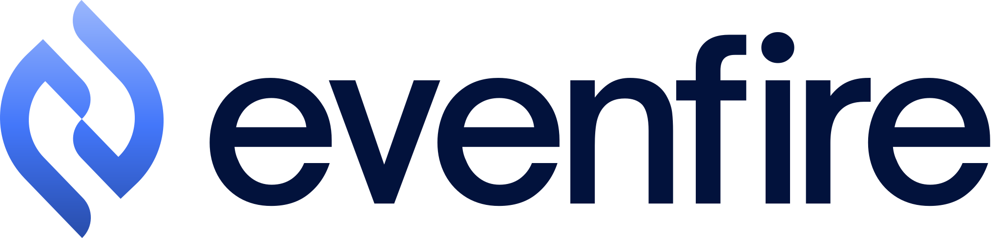
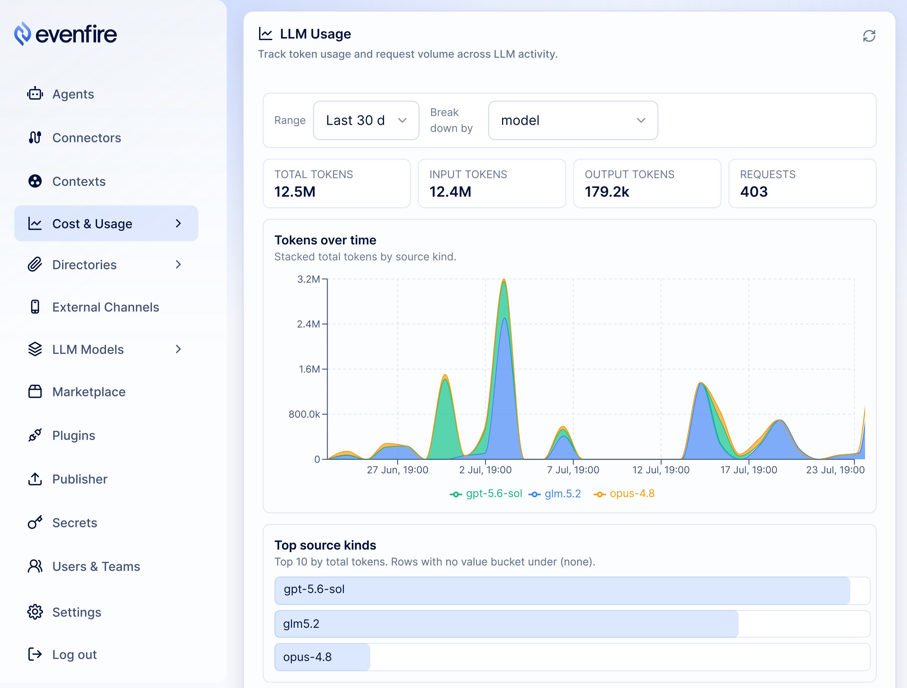

<p align="center">
  <a href="https://evenfire.ai">
    <picture>
      <source media="(prefers-color-scheme: dark)" srcset="docs/assets/evenfire-logo-light.svg">
      <source media="(prefers-color-scheme: light)" srcset="docs/assets/evenfire-logo-dark.svg">
      
    </picture>
  </a>
</p>

<h3 align="center">Build your company's intelligence layer, without losing control.</h3>

<p align="center">
  A complete, self-hosted platform for <b>LLM agents that do real work</b>. Connect tools,<br/>
  compose workflows, manage teams, and govern cost, all declared as Kubernetes resources.<br/>
  Bring your own model keys; every risky action waits for a human "yes."
</p>

<p align="center">
  <a href="LICENSE"></a>
  <a href="https://github.com/evenfire-ai/evenfire/actions"></a>
  <a href="https://github.com/evenfire-ai/evenfire/releases"></a>
  
</p>

<p align="center">
  <a href="#quick-start">Quick start</a> · <a href="#what-is-evenfire">What is Evenfire</a> · <a href="#the-platform">The platform</a> · <a href="#why-evenfire">Why</a> · <a href="#security-model">Security</a> · <a href="#supported-llm-providers">Providers</a> · <a href="docs/README.md">Docs</a> · <a href="#status">Status</a> · <a href="#community-and-license">License</a>
</p>

<p align="center">
  
</p>

<p align="center"><sub>The Control UI's usage dashboard: token consumption per model, over time. <a href="docs/surfaces/README.md">Tour all three UIs →</a></sub></p>

---

## Quick start

Stand up the whole platform on a local cluster with one command. It brings up
every service and a seeded agent named `chatllm`:

```bash
git clone https://github.com/evenfire-ai/evenfire.git && cd evenfire
cp .env.example .env
# edit .env: set ADMIN_PASSWORD (required, no default ships) and ONE LLM key
make minikube-setup     # first run ~5–10 min (image builds dominate); re-run safe
make minikube-status    # wait for every deployment READY
```

Then run the UIs from your workstation and say hello to the `chatllm` agent:

```bash
make install-all && npm --prefix control-ui install
npm run ui              # Control UI + Profile UI + Desktop App
```

The full walkthrough (prerequisites, login, and the pure-API path) is in
[Get started on minikube](docs/get-started/minikube.md).

---

## What is Evenfire

Evenfire is a complete platform for running LLM agents that take **real
actions**, on **your** infrastructure. Agents converse across the native desktop app, Telegram,
and Slack; call tools over the [Model Context Protocol](https://modelcontextprotocol.io) (MCP); compose
multi-step workflows; and draw on teams, shared files, and cost budgets, while
risky actions pause for human review. Every piece of the fleet (agents,
connectors, channels, workflows, policies) is a Kubernetes custom resource, so
your platform is version-controlled, reviewable configuration. You bring your
own model keys, so prompts and data flow only to the model provider you choose,
not through any Evenfire service.

---

## The platform

Evenfire is not just an agent runtime. It is nine first-class capabilities,
each backed by code in this repo and declared as configuration. Each row links
to its deep dive.

| Capability | What you get | Deep dive |
| ---------- | ------------ | --------- |
| **Agents** | Real actions across Telegram / Email / Slack / desktop (`shell_exec`, HTTP, a real browser, files), plus memory and approval gates | [mcp-host](mcp-host/README.md) |
| **Console & client** | An admin **Control UI** console and an Electron **Desktop App**, plus a small Profile UI for invites | [surfaces](docs/surfaces/README.md) |
| **Connectors (MCP)** | Governed MCP servers with per-`Context` allowlists; stdio tools via the bridge; remote SaaS behind a pinned egress proxy | [mcp-servers](mcp-servers/README.md) |
| **Workflows** | Declarative multi-workload `WorkflowRecipe`s with a lifecycle: risk-based approval, shadow testing, rollback | [workflowrecipe](docs/crds/workflowrecipe.md) |
| **Plugins & registry** | Author, publish, and install connectors and recipes through a governed, trust-rated registry | [workflow-sdk](packages/workflow-sdk/README.md) |
| **Teams & access** | Profiles, teams, roles (admin / inviter / member), invitations, and session → scoped-RPC token brokerage | [external-rest-api](external-rest-api/README.md) |
| **Files** | Read-only team workspaces agents can draw on, plus a brokered, audited shared drive where every read and write is checked and logged | [gfs-controller](gfs-controller/README.md) |
| **Cost & governance** | Token budgets per scope (block/warn), usage and LLM-price accounting, and a connector-image allowlist | [token budgets](docs/how-to/token-budgets-and-usage.md) |
| **Config as code** | The whole fleet as eight `clerum.io` ([why that name?](docs/concepts/code-names.md)) CRDs: version-controlled, reviewable, GitOps-friendly | [crds](docs/crds/README.md) |

---

## Why Evenfire

- **vs a hosted assistant**: you own the data and the infrastructure. Evenfire
  adds no vendor to the request path: with your own model keys, prompts and files
  go straight to the model provider you choose. Point an agent at a self-hosted
  or local model and nothing leaves your environment at all.
- **vs an in-process agent framework**: real isolation and governance:
  per-agent pods, default-deny networking, multi-tenant teams and roles, and
  approvals enforced by the platform rather than by the calling application.
- **vs rolling your own**: batteries included. You get channels, approvals, a
  connector registry, shared files, and cost accounting, all declared as
  configuration instead of assembled by hand.
- **vs betting on one provider**: the same agents, tools, and configuration run
  across a growing roster of providers, from frontier labs to local LLMs. Pick
  whichever model gives the best cost/quality tradeoff for each job, and switch
  providers without rebuilding, so your setup and data are never locked to a
  single vendor.

---

## Security model

We never fully trust the model. It can be steered, misled, or simply wrong, so
four layers constrain what it can do:

- **Risky actions wait for a human.** Commands, outbound HTTP, and browser
  control are approval-gated: the task suspends until someone approves from the
  channel, and callbacks are signature-verified.
- **Least privilege.** Each agent reaches only the connectors its `Context`
  grants, through short-lived, scope-narrowed tokens that can't widen
  themselves; container images must match a pinned digest and an allowlist.
- **Deny-all networking.** Runtime namespaces start with no connectivity;
  access is opened per (agent, connector), and outbound traffic is pinned to
  the specific hosts a connector declares, never the open internet.
- **Authenticated internals.** Every service-to-service call carries a
  short-lived, audience-scoped token; shared-file access is re-checked and
  audited on each request, and inbound webhooks are signature-verified.

Report vulnerabilities privately: **[SECURITY.md](SECURITY.md)**.

---

## Supported LLM providers

A broad, growing set of providers behind one interface, from frontier labs to
local models. Keys live in a Kubernetes Secret you create (dev mode: a single
environment variable; setup infers the matching provider).

| Provider          | `provider` value | Integration       |
| ----------------- | ---------------- | ----------------- |
| OpenAI            | `openai`         | Native SDK        |
| Anthropic         | `claude`         | Native SDK        |
| Z.AI              | `zai`            | OpenAI-compatible |
| Bailian           | `bailian`        | OpenAI-compatible |
| Google Vertex AI  | `vertex`         | Native SDK        |
| Amazon Bedrock    | `bedrock`        | Native SDK        |
| OpenRouter        | `openrouter`     | OpenAI-compatible |
| Google Gemini     | `gemini`         | OpenAI-compatible |
| DeepSeek          | `deepseek`       | OpenAI-compatible |
| Groq              | `groq`           | OpenAI-compatible |
| Together AI       | `together`       | OpenAI-compatible |
| Fireworks AI      | `fireworks`      | OpenAI-compatible |
| Mistral AI        | `mistral`        | OpenAI-compatible |
| xAI (Grok)        | `xai`            | OpenAI-compatible |
| Cerebras          | `cerebras`       | OpenAI-compatible |
| DeepInfra         | `deepinfra`      | OpenAI-compatible |
| Perplexity        | `perplexity`     | OpenAI-compatible |
| Moonshot (Kimi)   | `moonshot`       | OpenAI-compatible |
| Nebius            | `nebius`         | OpenAI-compatible |
| Novita AI         | `novita`         | OpenAI-compatible |
| Azure OpenAI      | `azure`          | Light driver      |

Most providers are OpenAI-compatible and plug in as config with no custom code;
only a few (`claude`, `vertex`, `bedrock`, `azure`) need a dedicated integration.
Overview: [docs/llm-providers/README.md](docs/llm-providers/README.md) ·
Configure: [docs/deploy/llm-providers.md](docs/deploy/llm-providers.md) ·
Add one: [docs/llm-providers/adding-a-provider.md](docs/llm-providers/adding-a-provider.md) ·
Details: [mcp-host/README.md](mcp-host/README.md).

---

## Development and testing

Each service is an independent npm package. Run `npm test` in a package, or
`make test-unit-all` after installing deps; `make test-counts` prints the live
unit-test file and case totals: "is it real, is it tested" without a hardcoded
number to drift. E2E suites run against minikube with Calico NetworkPolicies and
the approval flow: [docs/testing/e2e-guide.md](docs/testing/e2e-guide.md).
Contributor loop: [CONTRIBUTING.md](CONTRIBUTING.md).

---

## Docs and components

**Start here**

| Doc                                                                                | For                   |
| ---------------------------------------------------------------------------------- | --------------------- |
| [docs/README.md](docs/README.md)                                                   | Docs index            |
| [docs/get-started/learning-path.md](docs/get-started/learning-path.md)             | Role-based path       |
| [docs/concepts/why-evenfire.md](docs/concepts/why-evenfire.md)                     | Product intent        |
| [docs/concepts/when-to-use-evenfire.md](docs/concepts/when-to-use-evenfire.md)     | Fit by category       |
| [docs/faq.md](docs/faq.md)                                                          | FAQ & troubleshooting |
| [ARCHITECTURE.md](ARCHITECTURE.md)                                                 | Architecture & data flow |
| [docs/crds/README.md](docs/crds/README.md)                                         | Config as code (the 8 CRDs) |
| [docs/llms.txt](docs/llms.txt)                                                      | Map for coding agents |

**Components**: every deployable service has its own README (the deep dive):

| Component                                                                                      | Role                                                  |
| ---------------------------------------------------------------------------------------------- | ----------------------------------------------------- |
| [mcp-host](mcp-host/README.md)                                                                 | Agent runtime: LLM loop, tools, approval gate         |
| [channel-reader](channel-reader/README.md)                                                     | Telegram / Email / Slack ingress                      |
| [control-api](control-api/README.md)                                                           | Control plane: CRDs, secrets, token mint, usage       |
| [control-ui](control-ui/README.md)                                                             | Admin dashboard                                       |
| [profile-ui](profile-ui/README.md)                                                             | End-user profile and invitation confirmation          |
| [desktop-app](desktop-app/README.md)                                                           | Electron + React desktop client                       |
| [external-rest-api](external-rest-api/README.md)                                               | Auth, profiles, teams, RPC-token brokerage            |
| [rpc-proxy](rpc-proxy/README.md)                                                               | External JWT-gated gateway for desktop/tenant traffic |
| [host-context-controller](host-context-controller/README.md)                                  | Operator: CRDs → Deployments + NetworkPolicies        |
| [workflow-recipes](workflow-recipes/README.md)                                                 | Operator: `WorkflowRecipe` lifecycle                  |
| [gfs-controller](gfs-controller/README.md)                                                     | Brokered `GlobalFileSystem` API + audit chain         |
| [workspace-files-controller](workspace-files-controller/README.md)                             | `SharedFileSystem` write path                          |
| [mcp-proxy](mcp-proxy/README.md)                                                               | Optional centralized MCP router                       |
| [mcp-servers](mcp-servers/README.md)                                                           | Connector catalog (MongoDB, Airtable, …)              |
| [stdio-bridge](stdio-bridge/README.md)                                                         | Sidecar: stdio MCP → StreamableHTTP                   |
| [nginx-egress-proxy](nginx-egress-proxy/README.md)                                             | Pinned egress path for remote connectors              |
| [webhook-gateway](webhook-gateway/README.md)                                                   | Per-recipe webhook signature verifier                 |
| [webhook-proxy](webhook-proxy/README.md)                                                       | Stateless public webhook router                       |
| [workflow-approval-request-reader](workflow-approval-request-reader/README.md)                 | Inbound Telegram/Slack approval callbacks             |

Ops & platform directories:

- [monitoring/](monitoring/README.md): optional Grafana + Loki log stack
- [deploy/](deploy/): Kubernetes manifests per namespace

---

## Status

Evenfire is in **beta** and under active development. The whole platform runs
end to end and comes up locally with one command, but some APIs and CRDs may
still change before a 1.0 release; pin a release tag if you need stability.

The code uses the internal name clerum for the same project (`clerum.io` CRDs,
`CLERUM_*` env vars, `clerum-*` packages); see
[code names](docs/concepts/code-names.md).

---

## Community and license

- **[CONTRIBUTING.md](CONTRIBUTING.md)**: dev loop, what we accept
- **[SECURITY.md](SECURITY.md)**: private vulnerability disclosure
- **[GOVERNANCE.md](GOVERNANCE.md)**: project governance
- **[CODE_OF_CONDUCT.md](CODE_OF_CONDUCT.md)**: community standards

Evenfire is **open source** under the [Mozilla Public License 2.0](LICENSE)
(MPL-2.0), an OSI-approved, file-level copyleft license. 
