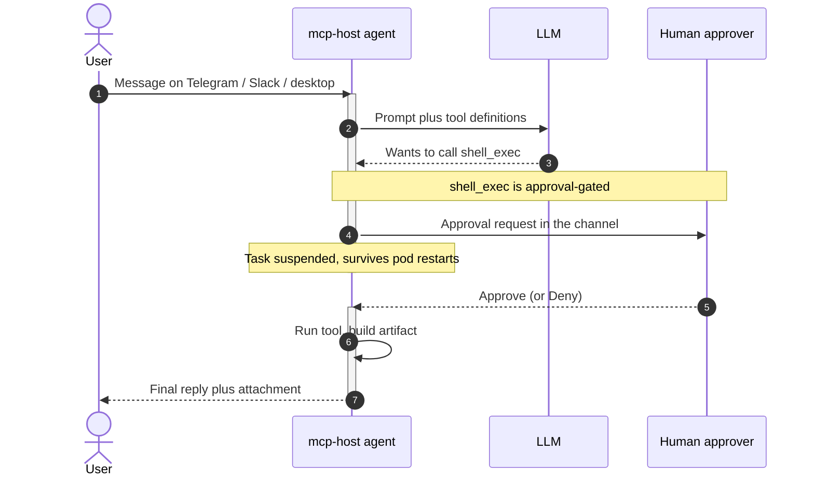
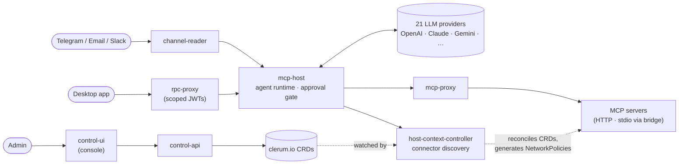

<p align="center">
  <a href="https://evenfire.ai">
    <picture>
      <source media="(prefers-color-scheme: dark)" srcset="docs/assets/evenfire-logo-light.svg">
      <source media="(prefers-color-scheme: light)" srcset="docs/assets/evenfire-logo-dark.svg">
      
    </picture>
  </a>
</p>

<h3 align="center">Build your company's intelligence layer, without losing control.</h3>

<p align="center">
  A complete, self-hosted platform for <b>LLM agents that do real work</b> — connect tools,<br/>
  compose workflows, manage teams, and govern cost, all declared as Kubernetes resources.<br/>
  Bring your own model keys; every risky action waits for a human "yes."
</p>

<p align="center">
  <a href="https://evenfire.ai"><b>Website</b></a>
  ·
  <a href="https://calendar.app.google/Nd21Z6LT99JkPrae7"><b>Book a demo</b></a>
  ·
  <a href="docs/README.md"><b>Docs</b></a>
  ·
  <a href="#quick-start"><b>Quick start</b></a>
</p>

<p align="center">
  <a href="LICENSE"></a>
  <a href="https://github.com/evenfire-ai/evenfire/actions"></a>
  <a href="https://github.com/evenfire-ai/evenfire/releases"></a>
  
</p>

<p align="center">
  <a href="#quick-start">Quick start</a> · <a href="#what-is-evenfire">What is evenfire</a> · <a href="#the-platform">The platform</a> · <a href="#see-it-work">See it work</a> · <a href="#why-evenfire">Why</a> · <a href="#architecture">Architecture</a> · <a href="#security-model">Security</a> · <a href="#supported-llm-providers">Providers</a> · <a href="docs/README.md">Docs</a> · <a href="#community-and-license">License</a>
</p>

<p align="center">
  
</p>

<p align="center"><sub>A plugin renders its own full UI — the LeadForge prospecting app, approval queue and all — inside the Desktop App. <a href="docs/surfaces/README.md">Tour all three UIs →</a></sub></p>

---

## Quick start

Stand up the whole platform on a local cluster with one command — every service,
deny-all NetworkPolicies, the JWT chain, and a seeded agent named `chatllm`:

```bash
git clone https://github.com/evenfire-ai/evenfire.git && cd evenfire
cp .env.example .env
# edit .env: set ADMIN_PASSWORD (required — no default ships) and ONE LLM key
make minikube-setup     # first run ~5–10 min (image builds dominate); re-run safe
make minikube-status    # wait for every deployment READY
```

Then run the UIs from your workstation and say hello to the `chatllm` agent:

```bash
make install-all && npm --prefix control-ui install
npm run ui              # Control UI + Profile UI + Desktop App
```

Full walkthrough — prerequisites, login, and the pure-API path — is in
[Get started](#get-started-minikube) below.

---

## Status

**Beta.** evenfire runs end-to-end today: the whole platform comes up locally
with one command, and every capability below is backed by code and tests in this
repo. It is under active development — some APIs and CRDs may still change before
a 1.0 release, so pin a release tag if you need stability.

<!-- Roadmap is a placeholder — edit to reflect the real plan. -->
_Roadmap (indicative, subject to change):_

- Broader connector registry and more first-party MCP servers
- Additional channels and richer workflow-lifecycle tooling
- Deeper cost governance, reporting, and budget controls

See [releases](https://github.com/evenfire-ai/evenfire/releases) for what has
shipped, and [CONTRIBUTING.md](CONTRIBUTING.md) for what we're accepting.

---

## What is evenfire

evenfire is a complete platform for running LLM agents that take **real
actions** — on **your** infrastructure. Agents converse across Telegram, Email,
Slack, and a desktop app; call tools over the
[Model Context Protocol](https://modelcontextprotocol.io) (MCP); compose
multi-step workflows; and draw on teams, shared files, and cost budgets — while
risky actions pause for human review. Every piece of the fleet — agents,
connectors, channels, workflows, policies — is a Kubernetes custom resource, so
your platform is version-controlled, reviewable configuration. You bring your
own model keys; prompts and data stay in your environment.

One command (`make minikube-setup`) brings the whole platform up locally.

> **Naming:** the code uses the project's internal name **clerum** —
> `clerum.io` CRDs, `CLERUM_*` env vars, `clerum-*` packages. **evenfire** is
> the public name of the same project. Details:
> [docs/concepts/code-names.md](docs/concepts/code-names.md).

---

## The platform

evenfire is not just an agent runtime — it is nine first-class capabilities,
each backed by code in this repo and declared as configuration. Start anywhere;
each pillar links to its depth.

- **Agents** — multi-channel agents (Telegram / Email / Slack / desktop) that
  take real actions: `shell_exec`, `http_request`, a real browser, an X11
  desktop, and workspace files, plus artifact generation, persistent memory, and
  human-in-the-loop approvals on the risky calls. →
  [mcp-host/README.md](mcp-host/README.md)
- **Console & client** — the two surfaces you work in day to day. A **Control UI** console where
  admins govern the fleet: token usage by team, model, agent, and desktop user;
  budgets and model prices; per-tool approval overrides; connector egress
  policy; a trust-rated connector registry. And an Electron **Desktop App**
  where people actually use the agents: chat, a live tool-call view, in-chat
  approvals, and artifacts — no Telegram bot and no curl required. (A third,
  smaller **Profile UI** is where invited members accept an invite and set a
  password on the way in.) →
  [docs/surfaces/README.md](docs/surfaces/README.md)
- **Connectors (MCP)** — governed MCP servers with per-`Context` allowlists
  enforced by NetworkPolicy (not convention); any stdio tool plugs in through
  the bridge; remote SaaS connectors sit behind a pinned egress proxy. →
  [mcp-servers/README.md](mcp-servers/README.md),
  [docs/how-to/add-mcp-server.md](docs/how-to/add-mcp-server.md)
- **Workflows** — declarative, multi-workload `WorkflowRecipe`s with a
  lifecycle state machine: risk-based approval, shadow testing, automatic
  rollback, and multi-step coordinator pods. →
  [docs/crds/workflowrecipe.md](docs/crds/workflowrecipe.md)
- **Plugins & registry** — author and publish connectors and recipes to a
  governed registry (entries carry trust levels and an `author`); build custom
  coordinator images with `@clerum/workflow-sdk`; install through a governed
  flow. →
  [packages/workflow-sdk/README.md](packages/workflow-sdk/README.md),
  [connect to the registry](docs/how-to/connect-to-registry.md),
  [publish a plugin](docs/how-to/publish-plugin-to-registry.md)
- **Teams & access** — profiles, teams, roles (admin / inviter / member),
  invitations, and session → scoped-RPC token brokerage. →
  [external-rest-api/README.md](external-rest-api/README.md),
  [control-api/README.md](control-api/README.md)
- **Files** — `SharedFileSystem` team workspaces (read-only to agents) and a
  brokered, audited `GlobalFileSystem` drive. →
  [gfs-controller/README.md](gfs-controller/README.md),
  [docs/crds/sharedfilesystem.md](docs/crds/sharedfilesystem.md),
  [shared & global files how-to](docs/how-to/shared-and-global-files.md)
- **Cost & governance** — token budgets per scope with block/warn decisions
  (opt-in via `CLERUM_BUDGETS_ENABLED`), usage and LLM-price accounting,
  `WorkflowRecipePolicy`, and a connector-image allowlist. →
  [docs/crds/workflowrecipepolicy.md](docs/crds/workflowrecipepolicy.md),
  [track usage & set budgets](docs/how-to/token-budgets-and-usage.md)
- **Config as code** — the entire fleet is eight `clerum.io` CRDs:
  version-controlled, reviewable, and `kubectl`/GitOps-friendly. →
  [docs/crds/README.md](docs/crds/README.md)

---

## See it work

A user asks an agent to do something with a side effect. The agent picks a tool,
the platform pauses on the risky call for a human decision, then the artifact
comes back to the channel:



A tool call that needs approval suspends the task and tells the caller exactly
what is waiting:

```jsonc
// POST /v1/runtime/messages            → agent decides it needs a tool
{ "success": true, "status": "waiting_approval",
  "approval": { "taskId": "…", "requestId": "…", "userId": "…",
                "notification": "The agent wants to run shell_exec: …" } }

// POST /v1/runtime/approvals/approve   { "userId", "requestId" }
{ "success": true }

// GET /v1/runtime/tasks/{taskId}/result   → poll until done
{ "success": true, "status": "completed",
  "response": "…final answer…", "attachments": [ /* generated files */ ] }
```

The prompt surfaces wherever the user already is — inline Approve/Deny buttons on
Telegram (or `/approve <target>`), a Slack Approve button, or the desktop app's
in-chat gate; pending approvals survive pod restarts.

---

## Why evenfire

- **vs a hosted assistant** — you own the data and the infrastructure. Prompts,
  files, and model keys never leave your environment; there is no vendor in the
  request path.
- **vs an in-process agent framework** — real isolation and governance:
  per-agent pods, default-deny networking, multi-tenant teams and roles, and
  approvals enforced by the platform rather than by the calling application.
- **vs rolling your own** — batteries included: channels, approvals, a connector
  registry, shared files, and cost accounting, all declared as configuration
  instead of assembled by hand.

---

## Get started (minikube)

`make minikube-setup` stands up the whole platform on a local cluster — every
service, deny-all NetworkPolicies, the JWT chain, and a seeded agent named
`chatllm`. It starts with an empty connector context — mcp-host's native tools
(shell, file read/write, HTTP, memory) need no MCP server; install connectors
from the registry when you want more.

**Prerequisites:** Docker Desktop with **≥10 GB RAM / 6 CPUs** · `minikube`
v1.30+ · `kubectl` · `python3` · Node.js 24+.

```bash
git clone https://github.com/evenfire-ai/evenfire.git && cd evenfire
cp .env.example .env
# edit .env: set ADMIN_PASSWORD (required — no default ships) and ONE LLM key
# (setup infers the matching provider)
make minikube-setup     # first run ~5–10 min (image builds dominate); re-run safe
make minikube-status    # wait for every deployment READY
```

**Say hello (desktop app).** The UIs run from your workstation, so install their
dependencies once, then run them against the cluster:

```bash
make install-all && npm --prefix control-ui install
npm run ui              # Control UI + Profile UI + Desktop App
```

Log in as `admin@evenfire.local` using the `ADMIN_PASSWORD` you set in `.env`,
message the `chatllm` agent, and ask it to run a command or generate a PDF —
then approve the tool call from the chat. The same password logs into the
Control UI as `admin`. The Desktop App is the client you just used; Control UI
is the admin console for the same fleet — both are toured in
[docs/surfaces/](docs/surfaces/README.md).

Prefer the API path? The full curl walkthrough exercises the real session →
scoped-RPC → rpc-proxy JWT chain, with troubleshooting notes:
[docs/get-started/quickstart.md](docs/get-started/quickstart.md) ·
[docs/deploy/minikube.md](docs/deploy/minikube.md) · production:
[docs/deploy/production.md](docs/deploy/production.md).

---

## Architecture



Messages arrive through `channel-reader` or the desktop app (via `rpc-proxy`).
`mcp-host` runs the agent state machine, calls your LLM, and executes native and
MCP tools — pausing for human approval when policy requires it.
`host-context-controller` reconciles `Host`, `Context`, and `McpServer` CRDs
into Deployments, Services, and NetworkPolicies; the `workflow-recipes` operator
does the same for multi-step workflow workloads. Admins drive the same CRDs
from the Control UI console through `control-api`, so the declarative substrate
is what the UI writes, not something it bypasses — see
[docs/surfaces/README.md](docs/surfaces/README.md). Ports, token flows, and the
four-layer network model live in the architecture docs:
[ARCHITECTURE.md](ARCHITECTURE.md) ·
[docs/architecture/overview.md](docs/architecture/overview.md) ·
[docs/architecture/platform-topology.md](docs/architecture/platform-topology.md).

---

## Security model

A model can be steered, misled, or simply wrong — so the platform never trusts
it by default. Four enforcement layers, all in this repo:

1. **Human-in-the-loop approvals.** With the gate on (`CLERUM_ENABLE_APPROVAL`,
   default true), approval-gated native tools — `shell_exec`, `http_request`,
   `cron_manage`, `browser_open`, `browser_navigate` — suspend the task until a
   human approves or denies. Approving is "approve once, run all" within a turn;
   cron-fired tasks run without a fresh gate because the human decision happened
   when the job was created. Channel callbacks are signature-verified and
   re-authorized before any decision is honored.
2. **Least privilege.** A `Context` defines which connectors an agent can reach;
   RPC tokens are short-lived and scope-narrowed, with wildcard host bindings
   rejected; custom coordinator images require sha256 digests, and connector
   images are checked against an allowlist (audit-mode by default); workloads
   drop capabilities and secrets are validated key-by-key.
3. **Default-deny networking.** Runtime namespaces start deny-all in both
   directions; connectivity is added back only per (context, server). Connector
   egress resolves declared hostnames to `/32` blocks and rejects any that
   overlap private, link-local, or cloud-metadata ranges, and remote connectors
   are pinned behind a hardened egress proxy. The `http_request` tool is
   governed separately by the `CLERUM_HTTP_ALLOWLIST` domain allowlist (empty by
   default — set it, or every public domain is reachable); that allowlist, not
   IP filtering, is its egress control.
4. **Authenticated internals.** Service-to-service calls use audience-separated
   RS256 tokens with strict scope, down to 60-second single-purpose artifact
   tokens minted per request. Shared-file access treats the JWT as a ceiling,
   re-checks a permission store fail-closed on every operation, and appends to a
   tamper-evident audit log. Inbound webhooks use timing-safe signature checks.
   Direct `mcp-host` ingress is layered: edge trust headers from named platform
   services, restricted by NetworkPolicy in production.

Report vulnerabilities privately: **[SECURITY.md](SECURITY.md)**. Public claim
rules: [docs/meta/claims-guardrails.md](docs/meta/claims-guardrails.md).

---

## Config as code (the 8 CRDs)

The whole fleet is eight `clerum.io` custom resources — the declarative surface
an evaluator reviews, versions, and applies with GitOps:

| Resource                 | Description                                      |
| ------------------------ | ------------------------------------------------ |
| **Host**                 | Agent: model, context, channels, approval policy |
| **Context**              | MCP server allowlist (+ related scope)           |
| **McpServer**            | Connector deployment (HTTP/stdio, auth, egress)  |
| **CommunicationChannel** | Telegram / Email / Slack + allowed identities    |
| **WorkflowRecipe**       | Multi-workload composition with MCP registration |
| **WorkflowRecipePolicy** | Governance policy for recipes                    |
| **SharedFileSystem**     | Per-team workspace (read-only to agents)         |
| **GlobalFileSystem**     | Brokered global drive with audited access        |

```bash
helm install clerum-crds ./charts/clerum-crds
```

Reference: [docs/crds/README.md](docs/crds/README.md).

---

## Supported LLM providers

**21 providers** behind one interface. The set is defined once in the
`@clerum/llm-providers` package — provider ids, credential slots, and display
labels — and given runtime behavior (default model, endpoint, tokenizer) in
`mcp-host`. Keys live in a Kubernetes Secret you create (dev mode: a single
environment variable; setup infers the matching provider).

| Provider          | `provider` value | Default model                       | Integration       |
| ----------------- | ---------------- | ----------------------------------- | ----------------- |
| OpenAI            | `openai`         | `gpt-5.4-mini`                      | Native SDK        |
| Anthropic         | `claude`         | `claude-sonnet-4-6`                 | Native SDK        |
| Z.AI              | `zai`            | `glm-5.1`                           | OpenAI-compatible |
| Bailian           | `bailian`        | `qwen3-coder-plus`                  | OpenAI-compatible |
| Google Vertex AI  | `vertex`         | `gemini-2.5-pro`                    | Native SDK        |
| Amazon Bedrock    | `bedrock`        | `anthropic.claude-sonnet-4-6-v1:0`  | Native SDK        |
| OpenRouter        | `openrouter`     | `anthropic/claude-sonnet-latest`    | OpenAI-compatible |
| Google Gemini     | `gemini`         | `gemini-2.5-flash`                  | OpenAI-compatible |
| DeepSeek          | `deepseek`       | `deepseek-v4-flash`                 | OpenAI-compatible |
| Groq              | `groq`           | `llama-3.3-70b-versatile`           | OpenAI-compatible |
| Together AI       | `together`       | `meta-llama/Llama-3.3-70B-Instruct-Turbo` | OpenAI-compatible |
| Fireworks AI      | `fireworks`      | `llama-v3p3-70b-instruct`           | OpenAI-compatible |
| Mistral AI        | `mistral`        | `mistral-medium-latest`             | OpenAI-compatible |
| xAI (Grok)        | `xai`            | `grok-4.3`                          | OpenAI-compatible |
| Cerebras          | `cerebras`       | `gpt-oss-120b`                      | OpenAI-compatible |
| DeepInfra         | `deepinfra`      | `deepseek-ai/DeepSeek-V3.2`         | OpenAI-compatible |
| Perplexity        | `perplexity`     | `sonar-pro`                         | OpenAI-compatible |
| Moonshot (Kimi)   | `moonshot`       | `kimi-k2.6`                         | OpenAI-compatible |
| Nebius            | `nebius`         | `Qwen/Qwen3-235B-A22B-Instruct-2507` | OpenAI-compatible |
| Novita AI         | `novita`         | `deepseek/deepseek-v3.2`            | OpenAI-compatible |
| Azure OpenAI      | `azure`          | `gpt-4.1`                           | Light driver      |

Most providers expose an OpenAI-compatible endpoint and plug in as pure data (a
credential slot plus a `baseURL`/default-model row) — no driver code. Only
bespoke wire protocols (`claude`, `vertex`, `bedrock`) or non-vanilla auth
(`azure`: per-resource host + `api-key` header) need a dedicated driver arm.
Adding one: [docs/llm-providers/adding-a-provider.md](docs/llm-providers/adding-a-provider.md).
Details: [mcp-host/README.md](mcp-host/README.md).

---

## Development and testing

Each service is an independent npm package. Run `npm test` in a package, or
`make test-unit-all` after installing deps; `make test-counts` prints the live
unit-test file and case totals — "is it real, is it tested" without a hardcoded
number to drift. E2E suites run against minikube with Calico NetworkPolicies and
the approval flow: [docs/testing/e2e-guide.md](docs/testing/e2e-guide.md).
Contributor loop: [CONTRIBUTING.md](CONTRIBUTING.md).

---

## Docs and components

**Start here**

| Doc                                                                                | For                   |
| ---------------------------------------------------------------------------------- | --------------------- |
| [docs/README.md](docs/README.md)                                                   | Docs index            |
| [docs/get-started/learning-path.md](docs/get-started/learning-path.md)             | Role-based path       |
| [docs/concepts/why-evenfire.md](docs/concepts/why-evenfire.md)                     | Product intent        |
| [docs/concepts/when-to-use-evenfire.md](docs/concepts/when-to-use-evenfire.md)     | Fit by category       |
| [docs/faq.md](docs/faq.md)                                                          | FAQ & troubleshooting |
| [docs/llms.txt](docs/llms.txt)                                                      | Map for coding agents |

**Components** — every deployable service has its own README (the deep dive):

| Component                                                                                      | Role                                                  |
| ---------------------------------------------------------------------------------------------- | ----------------------------------------------------- |
| [mcp-host](mcp-host/README.md)                                                                 | Agent runtime: LLM loop, tools, approval gate         |
| [channel-reader](channel-reader/README.md)                                                     | Telegram / Email / Slack ingress                      |
| [control-api](control-api/README.md)                                                           | Control plane: CRDs, secrets, token mint, usage       |
| [control-ui](control-ui/README.md)                                                             | Admin dashboard                                       |
| [profile-ui](profile-ui/README.md)                                                             | End-user profile and invitation confirmation          |
| [desktop-app](desktop-app/README.md)                                                           | Electron + React desktop client                       |
| [external-rest-api](external-rest-api/README.md)                                               | Auth, profiles, teams, RPC-token brokerage            |
| [rpc-proxy](rpc-proxy/README.md)                                                               | External JWT-gated gateway for desktop/tenant traffic |
| [host-context-controller](host-context-controller/README.md)                                  | Operator: CRDs → Deployments + NetworkPolicies        |
| [workflow-recipes](workflow-recipes/README.md)                                                 | Operator: `WorkflowRecipe` lifecycle                  |
| [gfs-controller](gfs-controller/README.md)                                                     | Brokered `GlobalFileSystem` API + audit chain         |
| [workspace-files-controller](workspace-files-controller/README.md)                             | `SharedFileSystem` write path                          |
| [mcp-proxy](mcp-proxy/README.md)                                                               | Optional centralized MCP router                       |
| [mcp-servers](mcp-servers/README.md)                                                           | Connector catalog (MongoDB, Airtable, …)              |
| [stdio-bridge](stdio-bridge/README.md)                                                         | Sidecar: stdio MCP → StreamableHTTP                   |
| [nginx-egress-proxy](nginx-egress-proxy/README.md)                                             | Pinned egress path for remote connectors              |
| [webhook-gateway](webhook-gateway/README.md)                                                   | Per-recipe webhook signature verifier                 |
| [webhook-proxy](webhook-proxy/README.md)                                                       | Stateless public webhook router                       |
| [workflow-approval-request-reader](workflow-approval-request-reader/README.md)                 | Inbound Telegram/Slack approval callbacks             |

Ops & platform directories: [monitoring/](monitoring/README.md) (optional
Grafana + Loki log stack) · [deploy/](deploy/) (Kubernetes manifests per
namespace).

---

## Community and license

- **[CONTRIBUTING.md](CONTRIBUTING.md)** — dev loop, what we accept
- **[SECURITY.md](SECURITY.md)** — private vulnerability disclosure
- **[GOVERNANCE.md](GOVERNANCE.md)** — project governance
- **[CODE_OF_CONDUCT.md](CODE_OF_CONDUCT.md)** — community standards

evenfire is **open source** under the [Mozilla Public License 2.0](LICENSE)
(MPL-2.0) — an OSI-approved, file-level copyleft license. Use it, modify it,
self-host it, and build commercial products on it; changes to MPL-licensed files
must remain under MPL when distributed.
