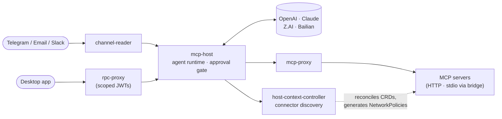

# evenfire

> Self-hostable platform for LLM agents that take real actions — multi-channel
> (Telegram/Email/Slack), first-class MCP, human-in-the-loop approvals, and
> default-deny networking built in. Kubernetes-native, declared entirely as CRDs.

[](LICENSE)
[](https://github.com/evenfire-ai/evenfire/actions)
[](https://github.com/evenfire-ai/evenfire/releases)

[Quickstart](#quickstart) · [How it works](#how-it-works) · [Security model](#security-model) · [Architecture](ARCHITECTURE.md) · [Contributing](CONTRIBUTING.md) · [License](#license)

## What is evenfire

evenfire runs LLM agents on **your** infrastructure. Agents converse over
Telegram, Email, and Slack, call tools through the
[Model Context Protocol](https://modelcontextprotocol.io) (MCP), and execute
multi-step workflows — while every risky action waits for a human "yes."
Agents, connectors, channels, and workflows are declared as Kubernetes custom
resources, so your whole agent fleet is version-controlled, reviewable
configuration. You bring your own model keys; prompts and data stay in your
environment.

Try it in two commands with Docker Compose (no Kubernetes required), then
deploy the full platform to any cluster.

> **Naming:** the code uses the project's internal name **clerum** —
> `clerum.io` CRDs, `CLERUM_*` env vars, `clerum-*` packages. **evenfire** is
> the public name of the same project.

## Features

- **Multi-channel agents** — one agent, reachable over Telegram, Email (IMAP),
  and Slack, with per-channel allowed-sender filters (`CommunicationChannel` CRD).
- **Human-in-the-loop approvals** — every MCP tool call requires an explicit
  approval by default; approve or deny from the desktop app or straight from
  Slack/Telegram. Per-tool policy is configurable on the `Host` CRD, and
  pending approvals survive pod restarts.
- **Governed connectors** — a `Context` lists exactly which MCP servers an
  agent may reach; everything unlisted is unreachable at the network layer.
- **First-class, bidirectional MCP** — provision MCP servers declaratively
  (`McpServer` CRD, HTTP and stdio transports); expose your agents over MCP.
  Not a per-vendor wrapper.
- **Declarative workflow engine** — `WorkflowRecipe` CRDs compose Deployments,
  StatefulSets, and CronJobs with auto-registered MCP servers, per-workload
  security overrides, and scoped runtime tokens.
- **Model-neutral, bring-your-own-keys** — OpenAI, Claude, Z.AI, and Bailian
  (Qwen/GLM/Kimi/MiniMax models) behind one interface; switching provider is a
  config change. Keys live in a Kubernetes Secret you create.
- **Built-in context management** — deterministic pre-pruning and tiered
  compaction keep long conversations inside the model window.
- **Shared file systems** — per-team workspaces mounted **read-only** into
  agent pods, plus a brokered global drive with an append-only, hash-chained
  audit log.
- **Usage & cost visibility** — per-request token accounting (including prompt-
  cache reads/writes), price tables, and token budgets in the control plane.
- **Desktop app** — cross-platform Electron client for chat, live approvals,
  files, and workflow monitoring.

## Quickstart

No Kubernetes required. The quickstart runs `mcp-host` in dev mode — a local
LLM agent you can chat with over HTTP.

```bash
cp .env.quickstart.example .env.quickstart   # add ONE LLM API key
docker compose --env-file .env.quickstart up mcp-host
```

Once running, send a message:

```bash
curl -X POST http://localhost:8080/v1/runtime/messages \
  -H "Content-Type: application/json" \
  -H "x-clerum-edge-caller: channel-reader" \
  -H "x-clerum-edge-host-ref: dev-host" \
  -H "x-clerum-edge-channel-type: telegram" \
  -H "x-clerum-edge-channel-id: dev-channel" \
  -H "x-clerum-edge-sender: 123456789" \
  -d '{"content":"Hello!","channelType":"telegram","channelId":"dev-channel","sender":"123456789","timestamp":"'$(date -u +%Y-%m-%dT%H:%M:%SZ)'","messageId":"msg-1","hostRef":"dev-host"}'
```

**Optional: Telegram surface** — to connect a real Telegram bot, add
`CLERUM_TELEGRAM_BOT_TOKEN` and `TELEGRAM_ALLOWED_USER_ID` to `.env.quickstart`,
then run:

```bash
docker compose --env-file .env.quickstart --profile telegram up
```

> **Quickstart limitations**
>
> - Dev mode authenticates callers with the `x-clerum-edge-*` trust headers
>   shown above (no JWT) — in production these are sent by the platform's own
>   edge services and locked down by NetworkPolicy.
> - No MCP servers are wired by default (the agent answers from its LLM
>   knowledge only). To add tools, set `CLERUM_MCP_SERVERS` in
>   `.env.quickstart` — see `.env.quickstart.example` for the exact shape.

For the full platform — approvals, connectors, workflows, NetworkPolicies —
deploy to Kubernetes: see [Running on Kubernetes](#running-on-kubernetes).

## How it works



Messages arrive through `channel-reader` (Telegram/Email/Slack) or the desktop
app (via `rpc-proxy`, authenticated with short-lived scoped JWTs). `mcp-host`
queues them through an agent state machine, calls your configured LLM, and
executes tools on MCP servers — pausing for human approval before each tool
call. `host-context-controller` reconciles the CRDs into Deployments,
Services, and NetworkPolicies, and tells `mcp-host` which connectors its
`Context` allows. The `workflow-recipes` operator does the same for multi-step
workflow workloads.

Deep dives: [ARCHITECTURE.md](ARCHITECTURE.md) ·
[docs/architecture/overview.md](docs/architecture/overview.md) (services,
CRDs, message lifecycle, NetworkPolicy model).

## Security model

A model can be steered, misled, or simply wrong — so the platform never trusts
it by default. Four enforcement layers, all in this repo:

1. **Human-in-the-loop approvals.** MCP tool calls suspend the task until an
   explicit approve/deny — default-on for every MCP tool, per-tool overrides
   on the `Host` CRD. Approvals arrive in the desktop app or via
   Slack/Telegram, where callbacks are signature-verified and pre-checked
   against an authorization service before any decision is forwarded. Pending
   approvals are persisted and survive pod restarts.

2. **Least privilege.** A `Context` defines which connectors an agent can
   reach; unlisted servers are unreachable. RPC tokens are short-lived,
   scope-narrowed, and bound to specific hosts (wildcard host bindings are
   rejected). Plugin images must be pinned by sha256 digest; workloads drop
   all Linux capabilities and add back only an allowlisted minimum. Referenced
   secrets are validated key-by-key before anything deploys.

3. **Default-deny networking.** Every runtime namespace starts from a
   deny-all NetworkPolicy in both directions; connectivity is added back per
   (context, server) pair. Egress to the Kubernetes API is denied by default.
   External egress excludes private, link-local, and cloud-metadata ranges,
   and remote connectors go through a dedicated egress proxy pinned to a
   single sanitized upstream.

4. **Authenticated internals.** Service-to-service calls use short-lived
   RS256-signed tokens with strict audience and scope separation — down to
   60-second single-purpose artifact tokens. Shared-file access treats the
   token as a ceiling, re-checks a permission store on every operation
   (fail-closed), and appends to a hash-chained audit log. Inbound webhooks
   are verified with timing-safe signature checks; symmetric and unsigned JWT
   algorithms are rejected outright.

Found a vulnerability? Please report it privately — see [SECURITY.md](SECURITY.md).

## Beyond the agent

- **Context management** — before any costly summarization, a deterministic
  pre-prune pass (deduplication, oversized-output trimming) reclaims tokens;
  under pressure, tiered compaction archives, summarizes, or truncates history
  with anti-thrash backoff. Configurable per deployment.
- **Shared file systems** — `SharedFileSystem` gives a team a governed
  workspace that Contexts mount **read-only** into agent pods;
  `GlobalFileSystem` is a brokered drive where every read is authorized
  against a permission store and recorded in a tamper-evident audit chain.
- **Usage & cost** — every LLM call reports authoritative token usage to the
  control plane; dashboards break it down by model and time, with price
  tables and token budgets. (Budgets are cost control, not a security
  boundary.)
- **Governed registry** — publish and install connectors and workflow recipes
  through a trust-labeled registry with publisher keys.
- **Observability** — Prometheus metrics across services, plus a Grafana +
  Loki log-aggregation stack in [monitoring/](monitoring/README.md).

## Running on Kubernetes

### Custom Resource Definitions

| Resource                 | API group | Description                                                                                               |
| ------------------------ | --------- | --------------------------------------------------------------------------------------------------------- |
| **Host**                 | clerum.io | An agent: model provider/name, context, channels, approval policy.                                        |
| **Context**              | clerum.io | Governance scope: which MCP servers an agent may reach, plus secrets and network access.                  |
| **McpServer**            | clerum.io | MCP server deployment spec (image, HTTP/stdio transport, auth, env, security overrides).                  |
| **CommunicationChannel** | clerum.io | Telegram/Email/Slack channels with allowed user identifiers.                                              |
| **WorkflowRecipe**       | clerum.io | Multi-workload composition (Deployments, StatefulSets, CronJobs) with MCP registration and scoped tokens. |
| **WorkflowRecipePolicy** | clerum.io | Cluster-wide governance and detection policy for WorkflowRecipe deployments.                              |
| **SharedFileSystem**     | clerum.io | Per-team shared workspace, mountable read-only into agent pods.                                           |
| **GlobalFileSystem**     | clerum.io | Brokered global drive with permission-store authorization and audited access.                             |

### Install

```bash
# Install all CRDs (Helm)
helm install clerum-crds ./charts/clerum-crds

# Apply sample resources (optional)
kubectl apply -f charts/clerum-crds/examples/
```

See [charts/clerum-crds/README.md](charts/clerum-crds/README.md) for chart
details, and [docs/deploy/minikube.md](docs/deploy/minikube.md) for the full
local-cluster deployment guide (all services, JWT auth chain, NetworkPolicies).

## Supported LLM providers

Configured via the `Host` CRD (`spec.model.provider`) or `CLERUM_MODEL_PROVIDER`:

| Provider         | `provider` value | Default model       | API                                                 |
| ---------------- | ---------------- | ------------------- | --------------------------------------------------- |
| OpenAI           | `openai`         | `gpt-5.4-mini`      | OpenAI Chat Completions                             |
| Anthropic Claude | `claude`         | `claude-sonnet-4-6` | Anthropic Messages                                  |
| Z.AI             | `zai`            | `glm-5.1`           | OpenAI-compatible                                   |
| Alibaba Bailian  | `bailian`        | `qwen3-coder-plus`  | OpenAI-compatible (Qwen, GLM, Kimi, MiniMax models) |

The provider registry is data-driven: OpenAI-compatible endpoints plug in as
single descriptor entries, no new integration code. Keys are read from a
Kubernetes Secret you create (dev mode: environment variables). Details and
per-provider setup: [mcp-host/README.md](mcp-host/README.md).

## Repository layout

| Area                    | Component                                                              | What it does                                                                                                                    |
| ----------------------- | ---------------------------------------------------------------------- | ------------------------------------------------------------------------------------------------------------------------------- |
| **Agent runtime**       | [mcp-host/](mcp-host/README.md)                                        | LLM orchestration, agent state machine, approval gate, MCP tool calling (port 8080).                                            |
|                         | [channel-reader/](channel-reader/README.md)                            | Fetches Telegram/Email/Slack messages, filters allowed senders, forwards to mcp-host.                                           |
|                         | [mcp-proxy/](mcp-proxy/README.md)                                      | Optional centralized HTTP router for MCP servers (port 8083).                                                                   |
|                         | [stdio-bridge/](stdio-bridge/README.md)                                | Sidecar translating stdio MCP transport to StreamableHTTP (port 3000).                                                          |
|                         | [mcp-servers/](mcp-servers/README.md)                                  | Connector deployment specs + test suites (MongoDB, Airtable; upstream images).                                                  |
| **Operators**           | [host-context-controller/](host-context-controller/README.md)          | Reconciles Host/Context/McpServer CRDs into Deployments, Services, and layered NetworkPolicies; discovery REST API (port 8081). |
|                         | [workflow-recipes/](workflow-recipes/README.md)                        | Reconciles WorkflowRecipe CRDs into workloads with policy enforcement and scoped tokens (port 8082).                            |
|                         | [gfs-controller/](gfs-controller/)                                     | Brokered GlobalFileSystem API: permission-store authorization, hash-chained audit log.                                          |
|                         | [workspace-files-controller/](workspace-files-controller/)             | Per-SharedFileSystem file API with path-safety hardening and scoped JWTs.                                                       |
| **Edge & security**     | [rpc-proxy/](rpc-proxy/README.md)                                      | External JWT-gated gateway for desktop/tenant RPC to hosts and MCP servers (port 8094).                                         |
|                         | [external-rest-api/](external-rest-api/README.md)                      | User profiles, teams, invitations, and RPC-token brokerage (port 8091).                                                         |
|                         | [webhook-gateway/](webhook-gateway/)                                   | Per-recipe webhook ingress with timing-safe signature verification (4 schemes).                                                 |
|                         | [webhook-proxy/](webhook-proxy/)                                       | Cluster-shared webhook router with registry validation and traversal-resistant paths.                                           |
|                         | [nginx-egress-proxy/](nginx-egress-proxy/)                             | Pinned-upstream egress path for remote MCP servers (SSRF-hardened, non-root).                                                   |
|                         | [workflow-approval-request-reader/](workflow-approval-request-reader/) | Normalizes Slack/Telegram approval callbacks, signature-verified, into runtime decisions (port 8098).                           |
| **Control plane & UIs** | [control-api/](control-api/README.md)                                  | Control-plane REST backend: CRDs, secrets, token issuance, usage/cost/budgets, registry (port 8090).                            |
|                         | [control-ui/](control-ui/README.md)                                    | Admin dashboard: hosts, connectors, approval policy, egress editor, usage dashboards, registry.                                 |
|                         | [profile-ui/](profile-ui/README.md)                                    | End-user profile, login, invitations, desktop authorization (port 3001).                                                        |
|                         | [desktop-app/](desktop-app/README.md)                                  | Electron client: chat, live approvals, files, workflows.                                                                        |
| **Platform**            | [charts/clerum-crds/](charts/clerum-crds/README.md)                    | Helm chart installing all 8 CRDs (+ [examples/](charts/clerum-crds/examples/)).                                                 |
|                         | [packages/](packages/)                                                 | Shared packages: workflow SDK/runtime-core, image policy, capability policy.                                                    |
|                         | [monitoring/](monitoring/README.md)                                    | Grafana + Loki log aggregation configs.                                                                                         |
|                         | [deploy/](deploy/), [scripts/](scripts/), [tests/](tests/)             | K8s manifests, cluster bootstrap, E2E suites.                                                                                   |

## Development & testing

**Unit tests** — 10,000+ test cases across ~880 test files. Each service is an
independent npm package (no root workspace), so install its dependencies
before running its suite:

```bash
cd mcp-host && npm install && npm test    # same pattern for every service
```

Once dependencies are installed, `make test-unit-all` runs the core service
suites in one shot.

**E2E tests** — 268 tests across 8 suites validate the full pipeline on a real
minikube cluster with Calico-enforced NetworkPolicies: CRD reconciliation,
backend readiness, connector discovery, deny-all enforcement, and LLM
tool-calling **through the approval flow** — no security disabled. The desktop
app adds Playwright E2E driving the real Electron app against a live cluster.
Setup and suites: [docs/testing/e2e-guide.md](docs/testing/e2e-guide.md).

**Git hooks** — tracked in [`.githooks/`](.githooks); root `npm install`
configures them (`pre-commit`: staged version/format checks, `commit-msg`:
commitlint). Manual setup: `npm run install-git-hooks`.

Per-service dev loops: see [CONTRIBUTING.md](CONTRIBUTING.md).

## Documentation

- **[docs/README.md](docs/README.md)** — docs index (architecture, deploy, security, CRD reference, testing, features).
- **[docs/architecture/overview.md](docs/architecture/overview.md)** — full architecture reference (services, CRDs, message lifecycle, NetworkPolicy model).
- **[docs/crds/](docs/crds/README.md)** — per-CRD reference pages.
- **[docs/deploy/minikube.md](docs/deploy/minikube.md)** — local Kubernetes deployment guide.
- **[docs/features/workflow-recipes.md](docs/features/workflow-recipes.md)** — WorkflowRecipes feature hub.
- **[docs/testing/e2e-guide.md](docs/testing/e2e-guide.md)** — E2E testing guide.

## Community

- **[CONTRIBUTING.md](CONTRIBUTING.md)** — dev loop, test requirements, what we accept.
- **[SECURITY.md](SECURITY.md)** — private vulnerability disclosure.
- **[GOVERNANCE.md](GOVERNANCE.md)** — how the project is run.
- **[CODE_OF_CONDUCT.md](CODE_OF_CONDUCT.md)** — community standards.
- **[CLA.md](CLA.md)** — contributor license agreement.

## License

evenfire is licensed under **Apache-2.0 with an additional use grant** (no
operating a competing managed multi-tenant service). It is **source-available**,
not OSI open source. Self-hosting for your own organization and internal
commercial use are permitted. See [LICENSE](LICENSE) and [TRADEMARK.md](TRADEMARK.md).
