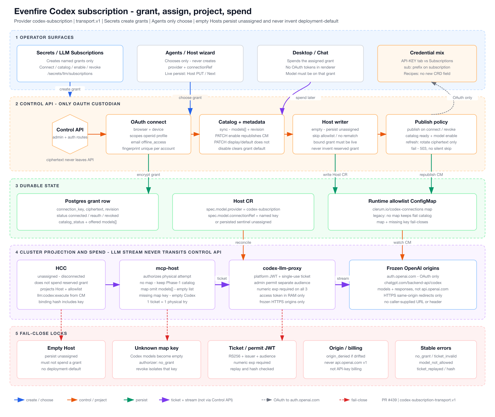

# Codex subscription transport contract

Frozen protocol version: `codex-subscription-transport.v1`.

This document is the Phase 0 architecture freeze for provider `codex-subscription`.
It is not a runtime client and does not authorize API-key billing.

## Ownership

- Control API is the only OAuth custodian.
- `mcp-host` authorizes each physical attempt and streams to `codex-llm-proxy`.
- `codex-llm-proxy` redeems a single-use ticket, holds the access token in
  operation memory only, and talks to the frozen HTTPS origins below.
- The LLM stream never transits Control API or its gateways.

## Origins

Exact HTTPS origins (no caller-supplied URL or header):

- OAuth authorize: `https://auth.openai.com/oauth/authorize`
- OAuth token: `https://auth.openai.com/oauth/token`
- OAuth device prefix: `https://auth.openai.com/api/accounts/deviceauth`
- OAuth device usercode: `https://auth.openai.com/api/accounts/deviceauth/usercode`
- OAuth device token poll: `https://auth.openai.com/api/accounts/deviceauth/token`
- OAuth device callback: `https://auth.openai.com/deviceauth/callback`
- OAuth device verification: `https://auth.openai.com/codex/device`
- OAuth revoke: `https://auth.openai.com/oauth/revoke`
- Catalog: `https://chatgpt.com/backend-api/codex/models?client_version=1.0.0`
- Completions: `https://chatgpt.com/backend-api/codex/responses`

Forbidden examples: `https://api.openai.com/v1/chat/completions` (ordinary API
billing), HTTP, loopback, and link-local/metadata addresses.

Redirects: HTTPS only, same origin as `https://auth.openai.com` or
`https://chatgpt.com`, never private or special-use addresses.

## Operations

`oauth_browser`, `oauth_device`, `oauth_refresh`, `oauth_revoke`,
`oauth_reconnect`, `catalog_list`, `completion_stream`, `completion_cancel`,
`connection_test`.

OAuth scopes: `openid`, `profile`, `email`, `offline_access`.

## Limits

All values are finite and greater than zero. `maxRetriesPerAttempt` is `1`:
one physical execution per ticket. A retry or fallback must mint a new attempt.

| Limit                | Value   |
| -------------------- | ------- |
| maxRequestBodyBytes  | 1048576 |
| maxMessages          | 256     |
| maxToolCalls         | 64      |
| maxOutputTokens      | 16384   |
| maxStreamDurationMs  | 300000  |
| maxDeadlineMs        | 300000  |
| maxConcurrentStreams | 8       |
| maxQueuedRequests    | 16      |
| maxRetriesPerAttempt | 1       |

Tool definitions have no independent count ceiling in the Evenfire request
contract. The entire serialized request, including all definitions, remains
bounded by `maxRequestBodyBytes` (1 MiB). Every definition still undergoes
name, schema, finite-value and unknown-field validation. `maxToolCalls` (64)
bounds calls in each assistant history message and each newly returned
response. The proxy buffers tool calls until successful completion and
validates the bound before publishing any executable call; the Host validates
it again before returning the batch. A response over the bound fails with
`tool_call_limit_exceeded`, which is not retried and does not fail over. It is
not a catalog size limit and does not widen execution concurrency.
`maxMessages` (256) bounds the request history. The Host rejects a longer
history with `request_limit_exceeded` before authorization, so no ticket is
minted for it.

The former `maxTools: 32` definition limit was imposed by Evenfire, not a
verified Codex Subscription limit. Remote endpoint limits remain separately
subject to authorized interoperability testing; local acceptance does not
certify that the endpoint accepts any particular count. Discovery optimizes
which schemas are sent, without changing the approved catalog or permissions.
An oversized explicit direct request fails before authorization rather than
silently truncating tools or changing presentation.

### Compatibility and deployment order

The V1 wire fields and canonical hash projection are unchanged. Previously
accepted requests retain their hashes; every newly advertised definition is
included in the hash. Tickets and receipts keep their existing binding.
This is a validator relaxation, not a new wire format. No version negotiation
or fallback to a truncated catalog is introduced.

| Sender                         | Authorizer     | Proxy                 | Result within all other limits                                                |
| ------------------------------ | -------------- | --------------------- | ----------------------------------------------------------------------------- |
| Old (at most 32 definitions)   | New            | New                   | Accepted; unchanged hash                                                      |
| New (at most 32 definitions)   | Old            | Old                   | Accepted; unchanged hash                                                      |
| New (more than 32 definitions) | Old            | Any                   | Rejected before issuing the execution ticket                                  |
| New (more than 32 definitions) | New            | Old                   | Authorization can succeed, then the proxy rejects the request                 |
| New (more than 32 definitions) | New            | New                   | Accepted locally; upstream capability is tested separately                    |
| New (more than 32 definitions) | Mixed replicas | Mixed or new replicas | Results can vary by serving replica; readiness of one replica is insufficient |

Deploy updated Control API and proxy consumers before the updated MCP Host
sender. Verify that both consumers use the updated shared package; rebuilding
only the sender is insufficient. For rollback, restore the old sender first,
drain outstanding incompatible attempts, then restore older validators. An old
sender reintroduces the known connector exclusion and is not a correction.

### Transport tool names

Canonical Evenfire tool names remain unchanged in authorization, request hashes,
Host dispatch and stored history. At the proxy boundary, names outside
`[A-Za-z0-9_-]{1,64}` receive deterministic, reversible aliases. Compliant names
are reserved first; bounded collision handling also covers legitimate names
that resemble generated aliases. The map includes active definitions and
historical assistant calls, and restores canonical names before emitting calls
to the Host. Call IDs and function-call outputs remain unchanged.

This uses the conservative function-name envelope documented by the
[official OpenAI SDK](https://github.com/openai/openai-python/blob/main/src/openai/types/shared_params/function_definition.py).
It is not evidence of a measured rejection by the ChatGPT Codex endpoint.
The transformation preserves all tools; no name is truncated or omitted.
If an inventory change introduces an alias collision, the request remaps its
entire history consistently. Unknown generated aliases fail explicitly;
ordinary unknown names retain the Host registry's authorization checks.

### Selected MCP argument validation

For interactive task tool loops whose provider chain includes Codex, the Host validates selected MCP
arguments before approval and rechecks the live schema immediately before
dispatch. Other provider chains retain server-side argument validation. Missing `$schema` uses JSON Schema 2020-12;
explicit draft-07 and 2019-09 are also supported, including HTTP/HTTPS URI aliases. Unsupported dialects and
unresolved references fail explicitly. Validation never coerces types, applies
defaults, removes arguments, or loads remote references.

This validation applies to the task adapter path, including resolved discovery
calls. Workflow steps that call MCP directly retain their existing server-side
validation. The adapter checks the manager's registered catalog schema; it does
not claim to validate a distinct schema returned only by a per-user OAuth client.

Compilation and evaluation run in disposable Node workers, outside the Host
event loop. Each operation has a two-second deadline and V8 heap/stack limits;
these are not a total-process RSS guarantee. Inputs are bounded to 256 KiB per
schema/argument document, 10,000 nodes and depth 64. At most four workers may be
active, with a FIFO queue of at most 32 waiting requests. Admission and execution
share the two-second deadline; queue overflow and timeout fail explicitly.
Worker startup adds latency and is not claimed as a quota optimization. A
successful validation waits for worker teardown before releasing its caller.
A single successful schema/argument pair may be reused by the same adapter;
byte-identical live inputs are required, so changes invalidate reuse before
dispatch. Sanitized failure codes distinguish argument/schema errors, resource
limits, saturation, timeout and worker failure.

Deployment readiness checks after a combined apply do not enforce the ordering
above. The infrastructure rollout barrier remains a separate release dependency;
this document alone does not certify mixed-version deployment safety.

### Codex changes shipped with the Grok broker

The Grok subscription broker (see
`docs/architecture/grok-subscription-transport-contract.md`) shares the
contract, authorizer, proxy robustness and recipe-grant code with Codex. The V1
wire and hash projection are unchanged. Operators should know about these Codex
behavior changes:

- **Revoke and reconnect.** Codex connection keys stay reusable after revoke:
  `deployment-default` and named keys can be revoked and then reconnected with
  a new OAuth flow.
  - Revoke also cancels every pending browser and device OAuth state for that
    key, atomically in the same statement.
  - A flow that started before the revoke cannot persist a grant. It fails
    with `state_cancelled`.
  - When two first grants race on the same key, the losing active-key insert
    maps to a stale-revision conflict instead of a 500.
- **Attempt integrity (migration 0114).** A constraint trigger requires a
  non-null `llm_provider_attempts.connection_id` of a Codex attempt to exist in
  `codex_subscription_connections`. This replaces the FK that 0112 dropped.
  Historic rows are not revalidated, and the migration is forward-only.
- **Catalog bounds.** Catalog sync stores at most 256 discovered models, each
  with an id of at most 128 characters.
  - Extra entries are dropped with a count-only warning.
  - The catalog record, row mutations and union rebuild commit in one
    transaction.
  - `codex-llm-proxy` admin catalog and connection-test calls have a 15 s
    deadline and an 8 MiB streamed body cap.
- **Request identity.** `mcp-host` hashes with `hashCanonicalCodexRequest(raw)`
  (parse, then hash the canonical value), so empty `generation`, `tools` or
  `transportHints` objects hash the same as on the server. Contract trees are
  capped at a nesting depth of 64. The authorizer rejects deeper bodies with
  `invalid_request`.
- **Terminal outcomes.** Only `success` is a completion. `canceled`, `error`,
  and `unknown` with partial text or tool calls are errors. The proxy maps an
  unrecognized finalize outcome to `unknown`.
- **Proxy robustness.**
  - `codex-llm-proxy` fails at startup when its control-api URL or service
    token is empty.
  - It respects SSE write backpressure.
  - It drops queued stream-gate waiters on abort and checks the abort signal
    before redeeming a ticket.
  - It requires `maxStreamDurationMs` greater than 0.
  - It logs one `codex_proxy_attempt_finished` event per completion attempt,
    with identifiers and counts only (never the body, ticket, frames, tool
    names or arguments): `providerAttemptId`, `hostRef`, `model`,
    `requestHash`, `outcome`, `deliveredAs`, `toolCalls`, `textChunks` and
    `durationMs`. On a stream that reached the upstream's terminal frame,
    `outcome` is `success`, `canceled`, `error` or `unknown`, with
    `deliveredAs: 'sse_done'` and `usage` when present. On a thrown failure,
    `outcome` is `failed` and the event adds `code`, the transport `reason`,
    `details` (for example `{limit, observed}` on
    `tool_call_limit_exceeded`) and `deliveredAs`: `http_status` with
    `httpStatus` when no SSE byte had been sent, or `sse_error` when the
    failure went out as an SSE error frame.
  - Do not confuse the two `outcome` fields. The finalize receipt sent to
    control-api keeps `success | canceled | error | unknown`. Only the
    `codex_proxy_attempt_finished` log line adds `failed`.
  - It counts failed attempts in `codex_proxy_attempt_failures_total{code}`.
- **Live-target attestation.** Codex authorize attests the live Host or recipe
  target. The allowed providers come only from the spec's model, allowed
  models and fallbacks (Hosts) or agent providers (recipes). A target that
  reached Codex only through a grant annotation or `connectionRef` now gets
  `host_binding_mismatch`.
- **Recipe grant annotations.** control-api now writes both
  `codex-connection-ref` and `subscription-connection-ref` for Codex recipes.
  It rejects explicit disagreeing pairs with 422
  `subscriptionAnnotationsDisagree`. Broker changes that omit the annotations
  return 422 `providerChangeRequiresGrant`.
- **Rollout.** Roll out control-api first, and wait until every pod runs the
  new image. An older control-api rejects the entire workflow-control token
  issue when HCC or WRC request the unknown `llm:grok:execute` scope.
- **Rollback.** Turn the Grok flags off and wait for HCC and WRC to drop
  `llm:grok:execute` before rolling back control-api. While an older
  control-api serves, a reassigned Codex recipe grant updates only
  `codex-connection-ref`. The new WRC then reads the disagreeing pair as
  `unassigned`. After rolling forward again, re-assign those Codex recipe
  grants with explicit annotations.

## Errors

Stable codes: `insufficient_scope`, `no_grant`, `model_not_allowed`,
`budget_denied`, `connection_unavailable`, `provider_unavailable`,
`origin_denied`, `ticket_invalid`, `ticket_replayed`, `request_hash_mismatch`,
`tool_call_limit_exceeded`.

- `tool_call_limit_exceeded`: the upstream response carried more than
  `maxToolCalls` tool calls. The proxy returns HTTP 422, or an SSE error frame
  when text had already been streamed. The Host maps it to
  `LLM_TOOL_CALL_LIMIT_EXCEEDED`. It is not retryable and not
  failover-eligible (failover class `null`), so the task fails with that code
  instead of `LLM_MODEL_OVERLOADED`.
- `request_limit_exceeded` (Host-side only): the request history exceeds
  `maxMessages`. The Host raises it before authorization and maps it to
  `LLM_CONTEXT_LENGTH_EXCEEDED`, not retryable.

## Evidence

Origins are frozen from the public Codex CLI OAuth registration observed at
implementation start against `origin/dev`
`1b845a3d636cc1b766cfcec66bb44a880581014b`. Live account connect / list /
stream / cancel / refresh / revoke is Task 25 (`CODEX_REAL_UPSTREAM_CONFIRM=1`)
and must not weaken this allowlist. Account identifiers stay redacted.

The focused drift from spec SHA `7d56b10849458a67b15f7d9a0991fa62604913a3` to
current `HEAD` did not change credential owner, data path, trust boundary,
namespace/workload shape, gateway count, mTLS stance, or access-token recipient.

Phase 2 grant binding hashes `{ catalogRevision, connectionKey,
credentialRevision, model, provider }` so two named subscriptions with the
same integer revisions do not collide. Host `spec.model.connectionRef` selects
the grant; revoke of one key fail-closes only that assignment.

## Tool presentation in the agent

`CODEX_TOOL_PRESENTATION=auto|direct|discovery` controls presentation, not access.
Direct is the default when the primary or an allowed fallback uses Codex. It
presents all approved definitions without the search/describe/call discovery bridge,
regardless of the discovery thresholds or legacy dynamic-tools flag.
Explicitly selecting auto uses discovery above the existing
`CLERUM_DYNAMIC_TOOLS_THRESHOLD` (60) or `CODEX_TOOL_DISCOVERY_BYTES`
(32768 serialized MCP definition bytes). These
are optimization thresholds; no tools are discarded from the local registry.
Direct retains all definitions subject to the bounded request contract.
Discovery exposes the stable native set and search/describe/call bridge.
The same presentation is usable across a configured failover chain.

All Codex modes emit the structured `tool-presentation` diagnostic when the
presentation counts change, including the first refresh. It reports the mode,
strategy, native/MCP counts and presented/deferred counts without tool definitions.
Direct mode reports `strategy: direct` and `deferredCount: 0`.

Search results contain bounded compact descriptions and no schemas. Follow
`nextOffset` with the same query/filter to continue; explicit `enumerate`
permits full traversal. Describe returns the exact selected schema, never a
truncated schema. Existing output spillover (enabled by default) handles
large results; transport/context limits still apply and no unbounded-schema
support or measured subscription-quota reduction is claimed.
