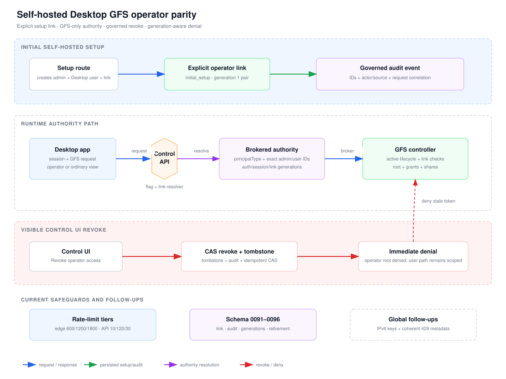

# Self-hosted Desktop GFS operator parity

This page documents the self-hosted boundary that gives the initial Desktop
identity GFS operator parity with its linked Control Admin. The relationship is
created only by supported initial setup, is scoped to GFS, and is resolved from
authoritative lifecycle state on every authorization decision.

- [Executive flow PNG](diagrams/gfs-desktop-operator-parity-overview.png)
- [Executive flow editable source](diagrams/gfs-desktop-operator-parity-overview.json)
- [Detailed architecture SVG](diagrams/gfs-desktop-operator-parity.svg)
- [Detailed architecture PNG](diagrams/gfs-desktop-operator-parity.png)
- [Detailed architecture editable source](diagrams/gfs-desktop-operator-parity.json)

## Security boundary

Operator authority exists only when all of the following are true:

1. The external session is authenticated.
2. The Desktop user is active and its authentication generation matches the
   token.
3. The linked Control Admin is active and its session generation matches.
4. The current immutable link generation is active and matches both exact IDs.

Any missing, stale, retired, malformed, or conflicting state fails closed. A
bare user UUID never implies operator authority. Revoking the link removes only
the operator elevation; the Desktop user may continue using ordinary GFS
permissions while active.

## Lifecycle

- Initial setup creates the Desktop identity, default membership, Control Admin,
  and generation 1 link atomically.
- Control UI revoke records the actor, reason, request ID, idempotency outcome,
  and a retained revoked tombstone.
- Reactivation inserts a new successor generation after an explicit row-version
  check. A revoked generation is never mutated back to active.
- Parent retirement revokes the active generation before marking the parent
  retired. Restrictive foreign keys prevent hard deletion from erasing link
  history.
- Session and authority generations are checked at the data-plane boundary, so
  previously issued tokens cannot continue to authorize a retired user or a
  revoked/stale operator generation.

## Request and rate-limit boundaries

External REST applies the GFS edge backstop in this order:

`token-IP 600/min → authenticated client-IP 1200/min → aggregate 1800/min`

Control API then applies distributed, authority-aware limits:

- token mint: 10/min per Desktop user;
- resource/proxy reads: 120/min per session, trusted client IP, and resolved
  actor class;
- mutations, grants, and shares: 30/min per session, trusted client IP, and
  resolved actor class.

The buckets remain separate. A request rejected by a narrower boundary cannot
consume a broader bucket. IPv6 canonical-key normalization and cross-layer 429
header coherence are tracked as independent global follow-ups:

- [Issue #352](https://github.com/evenfire-ai/evenfire/issues/352)
- [Issue #353](https://github.com/evenfire-ai/evenfire/issues/353)

## Migration sequence

| Migration | Responsibility |
| --- | --- |
| `0091_gfs_desktop_operator_links` | Explicit `initial_setup` Desktop/Admin relationship. |
| `0092_gfs_audit_actor_correlation` | Desktop actor, effective admin, source, and request correlation. |
| `0093_gfs_desktop_operator_link_generations` | Immutable generations, lineage, tombstones, CAS, and restrictive parent FKs. |
| `0094_desktop_user_retirement_lifecycle` | Active/retired Desktop lifecycle, typed retirement actors, and idempotent outcomes. |
| `0095_gfs_lifecycle_authority_projection` | GFSC lifecycle projection, readiness checks, and least-privilege reads. |
| `0096_control_admin_session_version_default` | Safe session-generation defaults for existing Control Admin rows. |

The deployment pre-gate applies migrations in order, reconciles the runtime
roles and ACL manifest, verifies readiness, and only then exposes consumers.
Rollback disables new issuance and mutations; it does not down-migrate or
delete retained lifecycle evidence.

## Validation surface

- Unit and integration suites cover setup, authority resolution, lifecycle
  transitions, token generations, audit attribution, route guards, rate-limit
  bucket separation, migration/readiness contracts, and Desktop/Control UI
  states.
- The browser certificate covers setup-linked operator access, operator root
  CRUD, ordinary-user behavior, grant/share lifecycle, visible Control UI
  revoke, reactivation/revoke generations, and audit correlation.
- The supported branch-owned Minikube profile is reused with local images; the
  pre-gate binds the deployed marker to the exact worktree HEAD and cluster
  fingerprint.
