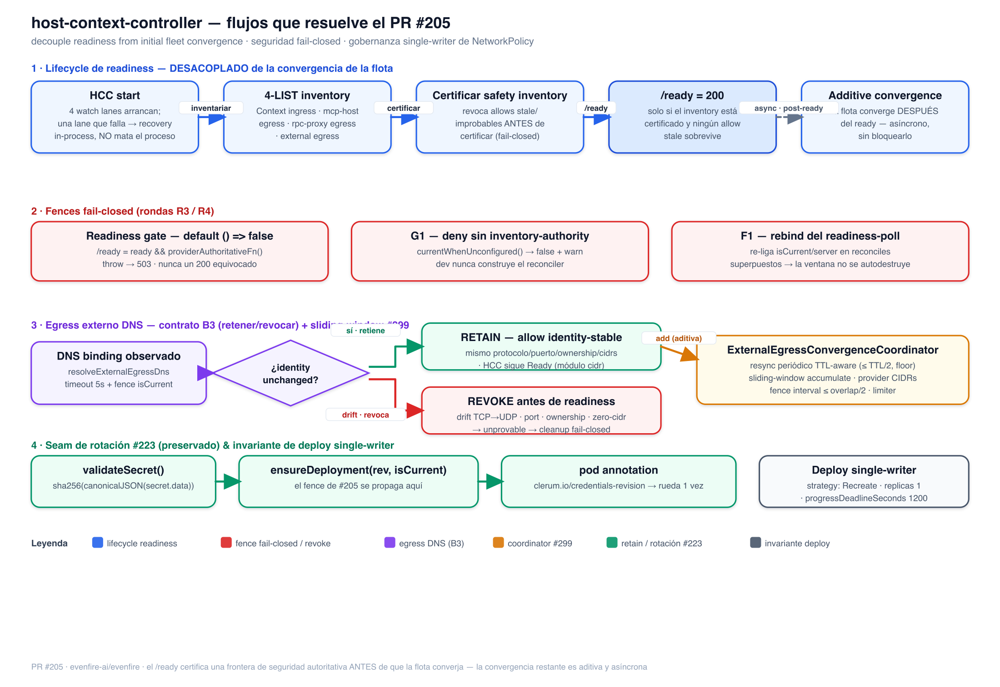

# HCC readiness & external-egress — design note (PR #205)

> Design note for the readiness-decoupling and single-writer NetworkPolicy work in
> `host-context-controller` (HCC). Addresses the "no design/decision doc for the
> 500+-line external-egress coordinator and the certification barrier" review gap.

## 1. Readiness lifecycle — decoupled from initial fleet convergence

Before this work, `McpServerWatcher.start()` awaited full initial fleet
reconciliation, so a large MCP/Context/Host fleet could keep `provider.start()`
and `/ready` unavailable until every individual reconcile finished.

Now readiness is gated on an **authoritative, fail-closed safety boundary**, not on
full convergence:

1. **HCC start** — four watch lanes (Context ingress, mcp-host egress, rpc-proxy
   egress, external egress) start. A transient LIST/WATCH failure on any lane enters
   in-process recovery and **does not kill the process**; HCC simply stays unready.
2. **4-LIST inventory** — bounded inventory across the four lanes.
3. **Certify safety inventory** — the authoritative pass revokes any stale /
   unprovable allow **before** recording a certificate (fail-closed).
4. **`/ready = 200`** — served **only** when the inventory is certified and no stale
   allow survives.
5. **Additive convergence** — the remaining fleet converges **after** ready,
   asynchronously, without blocking it.

## 2. Fail-closed fences

| Fence | Rule | Source |
|-------|------|--------|
| Readiness gate | `/ready = ready && providerAuthoritativeFn()`; constructor default `() => false`; a throwing gate → 503 | `server.ts`, `readinessGate.ts` |
| G1 — unconfigured authority | `currentWhenUnconfigured()` returns `false` + warns once; prod always wires the source, dev never constructs the reconciler | `reconciler.ts` |
| F1 — readiness-poll rebind | rebinds `isCurrent`/`server` on a superseding reconcile so the poll window does not self-destruct on a stale fence | `reconciler.ts` |

The affirmative literal (`() => true`) is reachable only from the dev wiring; every
production path resolves the real authority function.

## 3. DNS external-egress contract (B3) — retain / revoke decision table

A DNS-derived external-egress allow is compared against the desired policy
reconstructed from the **live** resolved CIDRs ("modulo cidr"). The decision:

| Observed change | Classification | Action | Rationale |
|-----------------|----------------|--------|-----------|
| identity unchanged (same protocol, port, selector, ownership; cidrs only) | identity-stable | **RETAIN** while Ready; refresh cidrs in the additive lane | revoking a healthy binding every pass created a guaranteed deny window |
| protocol drift (TCP→UDP) | identity-changed | **REVOKE before readiness** | old allow is unprovable/stale |
| spec-level port drift | identity-changed | **REVOKE before readiness** | " |
| ownership drift | identity-changed | **REVOKE before readiness** | " |
| zero-cidr (deny-in-disguise) | never retained | **REVOKE** | an empty cidr set is never a valid retained allow |

Revocation of an unprovable policy runs immediately (`cleanupExternalEgress`) under
the `isCurrent()` fence, **before** the safety inventory is certified — so `/ready`
never reports 200 with a stale divergent policy present. The unit suite pins both
directions (retain identity-stable; revoke on each drift), and the branch-owned
Minikube gate `e2e-hcc-mcp-context-readiness.sh` exercises both phases live.

## 4. ExternalEgressConvergenceCoordinator

The coordinator is the **single owner** of external-egress reconcile cadence
(replacing an inline timer in `k8sClient`):

- **Per-server FIFO + concurrency limiter** — a slow or never-resolving binding
  cannot head-of-line block the control-plane event loop.
- **Sliding-window CIDR accumulation (#299)** — resolved IPs live for `TTL + overlap`;
  large provider pools are covered by provider CIDRs rather than per-IP `/32`s. A
  failed refresh deletes the allow (fail-closed), never widens it.
- **TTL-aware periodic resync (H2)** — `startPeriodicResync` re-arms after each pass
  with a delay of `min(interval, TTL/2)` bounded below by a floor, so low-TTL hosts
  refresh promptly. The timer is `.unref()`'d and re-programs **only after a pass
  completes** (no overlap).
- **Fence** — startup rejects `interval > overlap/2`, so the accumulated window can
  never lapse regardless of the configured cadence.
- **Observability** — `clerum_hcc_external_egress_retries_at_cap` gauges how many
  servers are stuck retrying at the delay cap (a never-resolving DNS binding is
  otherwise invisible: denied with `/ready` = 200 and no signal).

## 5. Deploy invariant — single writer

The HCC Deployment ships `strategy: Recreate`, `replicas: 1`, and
`progressDeadlineSeconds: 1200`: the stateless single-writer safety model has no
leader election, so two concurrently-running controllers must be impossible during a
rollout. The trade-off (full HCC control-plane downtime per rollout; a rollout whose
new pod never becomes Ready needs a manual `kubectl rollout undo`) is declared in the
manifest and asserted by the bootstrap gate. `validate-postgres-single-writer-strategy.sh`
enforces the invariant on the rendered manifest in CI.
