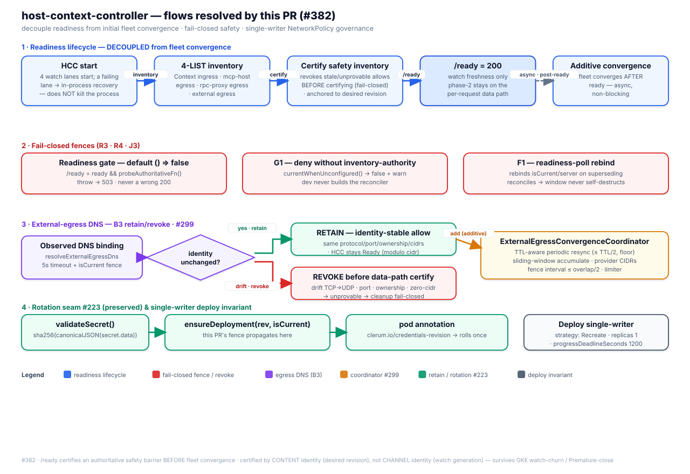

# HCC readiness & external-egress — design note (#382)

> Design note for the readiness-decoupling and single-writer NetworkPolicy work in
> `host-context-controller` (HCC). Addresses the "no design/decision doc for the
> 500+-line external-egress coordinator and the certification barrier" review gap.

## 1. Readiness lifecycle — decoupled from initial fleet convergence

Before this work, `McpServerWatcher.start()` awaited full initial fleet
reconciliation, so a large MCP/Context/Host fleet could keep `provider.start()`
and `/ready` unavailable until every individual reconcile finished.

Readiness is now two lanes. Watch freshness (clauses 1–4) stays fail-closed on
both. Phase-2 certification stays fail-closed on the **data path** and is off
the kubelet probe (#477 A1):

1. **HCC start** — four watch lanes (Context ingress, mcp-host egress, rpc-proxy
   egress, external egress) start. A transient LIST/WATCH failure on any lane enters
   in-process recovery and **does not kill the process**; HCC simply stays unready.
2. **4-LIST inventory** — bounded inventory across the four lanes.
3. **Certify safety inventory** — the authoritative pass revokes any stale /
   unprovable allow **before** recording a certificate (fail-closed).
4. **`/ready = 200`** — served when the process is past warm-up and the three
   watches are synced. Phase-2 certification does **not** hold the probe.
5. **Per-request data path** — inventory, credential, and other API routes stay
   on the 6-clause gate. An uncertified safety pass returns 503 without making
   kubelet evict the Pod.
6. **Additive convergence** — the remaining fleet converges **after** the probe
   is ready, asynchronously, without blocking it.

## 2. Fail-closed fences

| Fence | Rule | Source |
|-------|------|--------|
| Probe gate | `/ready = ready && probeAuthoritativeFn()` (watch freshness). Omit the 10th constructor arg → fall back to the 6-clause gate so omission cannot weaken kubelet readiness. A throwing gate → 503 | `server.ts`, `readinessGate.ts` |
| Per-request gate | data-path 503 unless `ready && providerAuthoritativeFn()` (6 clauses). Constructor default `() => false` | `server.ts`, `readinessGate.ts` |
| G1 — unconfigured authority | `currentWhenUnconfigured()` returns `false` + warns once; prod always wires the source, dev never constructs the reconciler | `reconciler.ts` |
| F1 — readiness-poll rebind | rebinds `isCurrent`/`server` on a superseding reconcile so the poll window does not self-destruct on a stale fence | `reconciler.ts` |
| Authority fence — `isCurrent` | **required** (not an optional/defaulted arg) on all three allow-granting reconcilers — `bindingPolicyReconciler`, `reconcileContext` (L2 context-allow), `reconcileExternalEgress` (L3 external-egress ALLOW). No `?? (() => true)` fail-open default: a caller cannot compile without supplying the fence (TS2554/TS2345) | `networkPolicyReconciler.ts`, `bindingPolicyReconciler.ts` |

The affirmative literal (`() => true`) is reachable only from the dev/test wiring;
every production path resolves the real authority function, and — because the fence
is a **required argument** on every allow-granting reconciler rather than a defaulted
option — no production caller can silently fall back to it.

## 3. DNS external-egress contract (B3) — retain / revoke decision table

A DNS-derived external-egress allow is compared against the desired policy
reconstructed from the **live** resolved CIDRs ("modulo cidr"). The decision:

| Observed change | Classification | Action | Rationale |
|-----------------|----------------|--------|-----------|
| identity unchanged (same protocol, port, selector, ownership; cidrs only) | identity-stable | **RETAIN** while Ready; refresh cidrs in the additive lane | revoking a healthy binding every pass created a guaranteed deny window |
| protocol drift (TCP→UDP) | identity-changed | **REVOKE before certifying the data path** | old allow is unprovable/stale |
| spec-level port drift | identity-changed | **REVOKE before certifying the data path** | " |
| ownership drift | identity-changed | **REVOKE before certifying the data path** | " |
| zero-cidr (deny-in-disguise) | never retained | **REVOKE** | an empty cidr set is never a valid retained allow |

Revocation of an unprovable policy runs immediately (`cleanupExternalEgress`) under
the `isCurrent()` fence, **before** the safety inventory is certified — so the
**data path** never serves 200 with a stale divergent policy present. After A1
the kubelet `/ready` probe may return 200 while that revocation is still in
flight; the cluster gate waits for `/ready` 200 **and** the stale policy to be
absent, and treats `/ready` 200 with the stale allow still present as retryable.
The unit suite pins both directions (retain identity-stable; revoke on each
drift), and the branch-owned Minikube gate `e2e-hcc-mcp-context-readiness.sh`
exercises both phases live.

## 4. ExternalEgressConvergenceCoordinator

The coordinator is the **single owner** of external-egress reconcile cadence
(replacing an inline timer in `k8sClient`):

- **Per-server FIFO + concurrency limiter** — a slow or never-resolving binding
  cannot head-of-line block the control-plane event loop.
- **Sliding-window CIDR accumulation (#299)** — resolved IPs live for `TTL + overlap`;
  large provider pools are covered by provider CIDRs rather than per-IP `/32`s. A
  failed refresh deletes the allow (fail-closed), never widens it.
- **TTL-aware periodic resync (H2)** — `startPeriodicResync` re-arms after each pass
  with a delay of `min(interval, TTL/2)` bounded below by a floor, so low-TTL hosts
  refresh promptly. The timer is `.unref()`'d and re-programs **only after a pass
  completes** (no overlap).
- **Fence** — startup rejects `interval > overlap/2`, so the accumulated window can
  never lapse regardless of the configured cadence.
- **Observability** — `clerum_hcc_external_egress_retries_at_cap` gauges how many
  servers are stuck retrying at the delay cap (a never-resolving DNS binding is
  otherwise invisible: denied with `/ready` = 200 and no signal).

## 5. Deploy invariant — single writer

The HCC Deployment ships `strategy: Recreate`, `replicas: 1`, and
`progressDeadlineSeconds: 1200`: the stateless single-writer safety model has no
leader election, so two concurrently-running controllers must be impossible during a
rollout. The trade-off (full HCC control-plane downtime per rollout; a botched Recreate
leaves `/ready` 503) is declared in the manifest and asserted by the bootstrap
gate. `progressDeadlineSeconds: 1200` is detection-only. Recovery is owned by
the evenfire-infra deploy workflows: they capture the last-known-good revision,
wait 90s for HCC, and run `rollout undo --to-revision` for
`control-plane/host-context-controller` only. The cluster may return to
last-known-good; the deploy job still fails (evenfire#391). Do not treat e2e
`cleanup()` image restore as that pipeline recovery.
`validate-postgres-single-writer-strategy.sh` enforces the Recreate +
replicas:1 invariant on the rendered manifest in CI.
