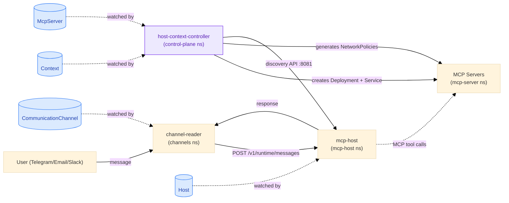
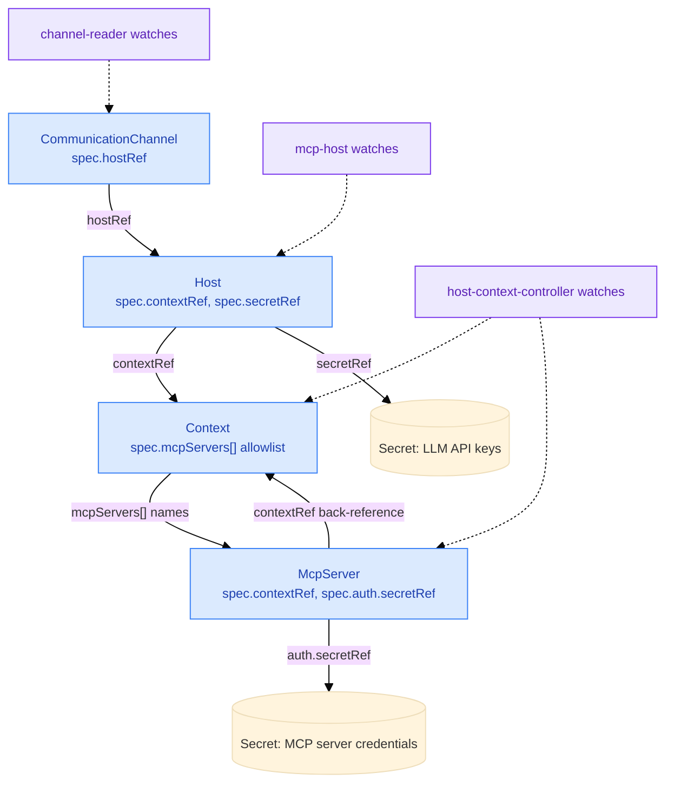
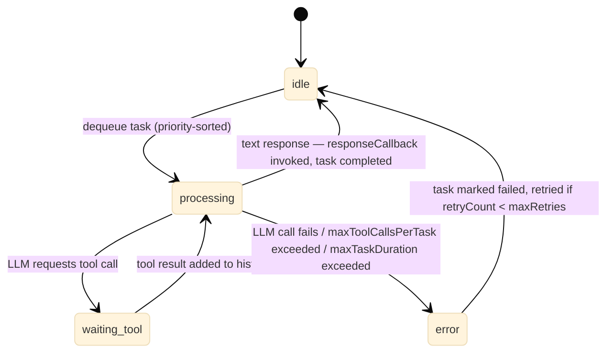
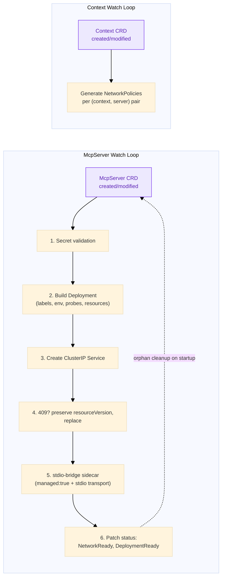
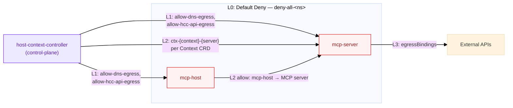
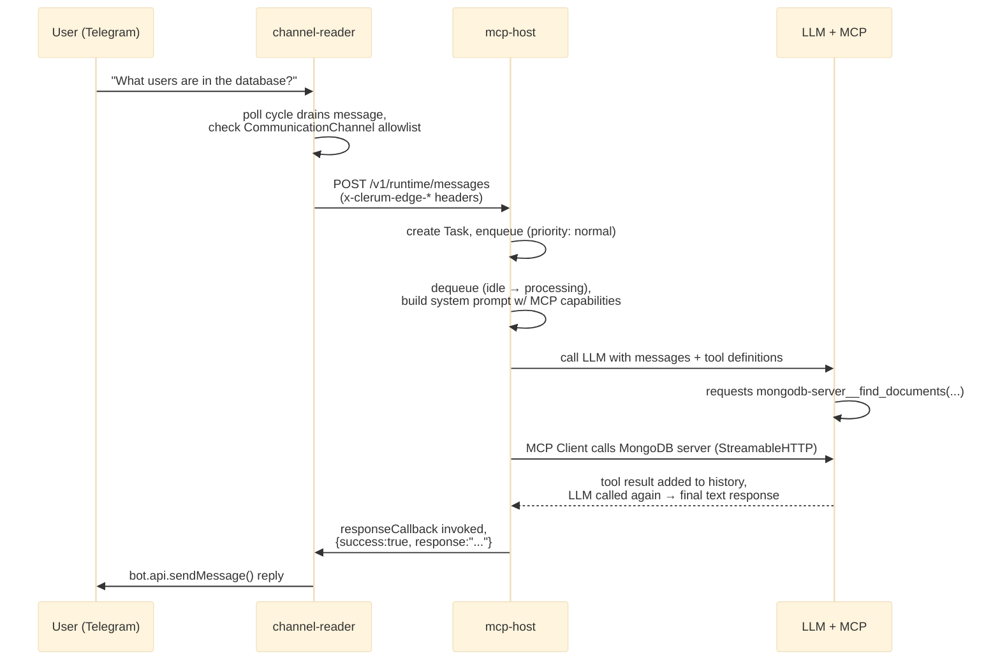

# evenfire Architecture Document

evenfire is a Kubernetes-native platform for LLM orchestration with multi-channel communication and MCP (Model Context Protocol) integration. All configuration is driven by Kubernetes Custom Resources (CRDs) under the historical `clerum.io` API group ([code names](../concepts/code-names.md)).

> Public product name: **evenfire**. Code, CRDs, and many package paths still say **clerum**.

> **Scope of this document.** This is the deep-dive on the **message path** —
> `channel-reader` → `mcp-host` → MCP servers, plus the `host-context-controller`
> that provisions them — and on the end-to-end message lifecycle, dev mode, and
> the tool approval system. It is **not** a complete service reference: the
> platform has ~18 services, and this document details four of them.
>
> - For every service and which controller creates it → [/ARCHITECTURE.md](../../ARCHITECTURE.md)
> - For namespaces, trust boundaries, NetworkPolicy layers and the WRC → [platform-topology.md](platform-topology.md)
> - For all eight CRDs → [docs/crds/](../crds/)

---

## Table of Contents

1. [High-Level Architecture](#1-high-level-architecture)
2. [Custom Resource Definitions (CRDs)](#2-custom-resource-definitions-crds)
3. [Service: channel-reader](#3-service-channel-reader)
4. [Service: mcp-host](#4-service-mcp-host)
5. [Service: host-context-controller](#5-service-host-context-controller)
6. [MCP Servers](#6-mcp-servers)
7. [Networking & Security Model](#7-networking--security-model)
8. [Message Lifecycle (End-to-End)](#8-message-lifecycle-end-to-end)
9. [Dev Mode vs Production Mode](#9-dev-mode-vs-production-mode)
10. [Deployment & Infrastructure](#10-deployment--infrastructure)
11. [Tool Approval System](#11-tool-approval-system)

---

## 1. High-Level Architecture

### System Diagram

Scoped to the four services this document covers — for the full 12-namespace platform (all ~18 services), see [platform-topology.md §1](platform-topology.md#1-platform-architecture-12-namespaces).



### Services covered in this document

These four are the message path. For the control plane, the edge, and the
webhook and file planes, see [/ARCHITECTURE.md](../../ARCHITECTURE.md). For the
three human surfaces — the Control UI console, the Desktop App client, and the
Profile UI — see [docs/surfaces/](../surfaces/README.md).

The self-hosted Desktop GFS authority boundary, lifecycle generations, and
validation flow are documented in [Desktop GFS operator parity](gfs-desktop-operator-parity.md).

| Service                     | Directory                  | Namespace       | Port | Role                                                                                                 |
| --------------------------- | -------------------------- | --------------- | ---- | ---------------------------------------------------------------------------------------------------- |
| **channel-reader**          | `/channel-reader`          | `channels`      | -    | Watches CommunicationChannel CRDs, polls Telegram/Email/Slack, forwards to mcp-host                  |
| **mcp-host**                | `/mcp-host`                | `mcp-host`      | 8080 | Central LLM service with agent state machine, message queue, and MCP tool calling                    |
| **host-context-controller** | `/host-context-controller` | `control-plane` | 8081 | K8s operator managing MCP server Deployments/Services/NetworkPolicies; REST API for server discovery |
| **MCP Servers**             | `/mcp-servers`             | `mcp-server`    | 3000 | First-party MCP servers (airtable, alphavantage, doc-generator, mongodb, playwright, web-search)     |

### Human surfaces

The message path above is one of two ways into the platform. The other is the
Desktop App, which reaches `mcp-host` through `rpc-proxy` with a short-lived,
scope-narrowed JWT — never a `control-api` token (see
[platform-topology.md §9](platform-topology.md#9-rpc-proxy-namespace) for the
rpc-proxy trust boundary and the desktop flow in depth). The Control UI sits on
the other side entirely: it is admin-authenticated, talks only to
`control-api`, and writes the same CRDs this document describes. Neither
surface can act as the other, and channel users (Telegram/Slack/email) never
touch either one — their traffic is the message path above. See
[docs/surfaces/](../surfaces/README.md) for the full persona-to-surface
matrix, including the Profile UI.

### Key Design Principles

- **CRD-driven configuration**: All runtime behavior is declared via Kubernetes Custom Resources
- **Namespace isolation**: Each service runs in its own namespace with strict RBAC
- **Deny-by-default networking**: NetworkPolicies block all ingress to MCP servers; explicit allow rules are generated per Context
- **Dual-mode operation**: Every service supports `CLERUM_DEV_MODE=true` for local development without a cluster
- **Adapter pattern**: Channel communication is abstracted behind a common interface, making new channels easy to add
- **Polling-based**: channel-reader polls channels on a configurable interval (default 2s); mcp-host polls host-context-controller for server changes (default 30s)

---

## 2. Custom Resource Definitions (CRDs)

All CRDs belong to the `clerum.io` API group, version `v1alpha1`. They are installed via the Helm chart at `charts/clerum-crds`.

The platform ships **eight** CRDs. This section covers the four on the message
path in depth. The other four — `WorkflowRecipe`, `WorkflowRecipePolicy`,
`SharedFileSystem`, `GlobalFileSystem` — have reference pages under
[docs/crds/](../crds/), which is the complete set.

### 2.1 CommunicationChannel

Defines which external communication channels (Telegram, Email, Slack) are active and which users are authorized on each.

```yaml
apiVersion: clerum.io/v1alpha1
kind: CommunicationChannel
metadata:
  name: all-channels
  namespace: default
spec:
  hostRef: 'chatllm' # Links this channel config to a Host
  telegram:
    - channelId: 'telegram-general' # Logical channel ID
      userIds: ['123456789', '987654321'] # Authorized Telegram user IDs
  email:
    - channelId: 'INBOX'
      emails: ['alice@example.com'] # Authorized email addresses
  slack:
    - channelId: 'C01234567' # Slack channel ID or name
      userNames: ['@john', '@jane'] # Authorized Slack usernames
```

**Watched by**: channel-reader (filters by `hostRef`)

**Key fields**:

- `hostRef` (required) - Associates this channel with a specific Host CRD
- `telegram[].userIds` - Telegram numeric user IDs allowed to interact
- `email[].emails` - Email addresses allowed to send messages
- `slack[].userNames` - Slack usernames allowed to interact

---

### 2.2 Host

Central entity connecting channels, an LLM provider, and a context scope. Each Host represents one "AI assistant" instance.

```yaml
apiVersion: clerum.io/v1alpha1
kind: Host
metadata:
  name: chatllm
  namespace: mcp-host
spec:
  host: 'chatLLM' # Host identifier
  contextRef: 'context1' # Links to a Context CRD
  secretRef: 'chatllm-api-keys' # K8s Secret with LLM API keys
  channels: # Optional: explicit channel references
    - 'all-channels'
  model:
    provider: 'openai' # "openai", "claude", "zai", or "bailian"
    name: 'gpt-5.4-mini' # Specific model name
```

**Watched by**: mcp-host (reads configuration and API keys)

**Referenced Secret format**:

```yaml
apiVersion: v1
kind: Secret
metadata:
  name: chatllm-api-keys
stringData:
  openai-api-key: 'sk-...'
  claude-api-key: 'sk-ant-...'
  zai-api-key: 'zai-...'
```

---

### 2.3 Context

Logical scope that defines which MCP servers a Host can access. Used by host-context-controller to generate NetworkPolicies and filter server discovery responses.

```yaml
apiVersion: clerum.io/v1alpha1
kind: Context
metadata:
  name: context1
  namespace: mcp-server
spec:
  contextId: 'context1'
  description: 'Context for the chatLLM host'
  mcpServers: # Allowlist of MCP server names
    - 'mongodb-server'
    - 'airtable-server'
```

**Watched by**: host-context-controller (generates NetworkPolicies per context-server pair)

---

### 2.4 McpServer

Declares an MCP server that should be deployed and managed by the host-context-controller operator. When this CRD is created, host-context-controller automatically creates a matching Deployment and Service.

```yaml
apiVersion: clerum.io/v1alpha1
kind: McpServer
metadata:
  name: mongodb-server
  namespace: mcp-server
spec:
  contextRef: 'context1'
  description: 'MongoDB MCP server for database access'
  image: 'mongodb/mongodb-mcp-server:latest'
  imagePullPolicy: 'Always'

  transport:
    type: 'streamableHttp' # "sse", "streamableHttp", or "stdio"
    url: 'http://mongodb-server.mcp-server.svc.cluster.local:3000/mcp'
    port: 3000

  auth:
    type: 'bearer'
    secretRef: 'mcp-mongodb-credentials'
    secretKey: 'connection-string'

  serverConfig:
    readOnly: true
    loggers: 'stderr'
    telemetry: 'disabled'

  envMapping: # Maps structured fields to env vars
    transport: 'MDB_MCP_TRANSPORT'
    httpHost: 'MDB_MCP_HTTP_HOST'
    httpPort: 'MDB_MCP_HTTP_PORT'
    healthCheckHost: 'MDB_MCP_HEALTH_CHECK_HOST'
    healthCheckPort: 'MDB_MCP_HEALTH_CHECK_PORT'
    readOnly: 'MDB_MCP_READ_ONLY'
    loggers: 'MDB_MCP_LOGGERS'
    telemetry: 'MDB_MCP_TELEMETRY'

  env: # Additional plain env vars
    - name: 'EXTRA_VAR'
      value: 'value'

  envSecret: # Secret-backed env vars
    name: 'mcp-mongodb-credentials'
    keys:
      - secretKey: 'connection-string'
        envVar: 'MDB_MCP_CONNECTION_STRING'

  healthCheck:
    port: 3001

  resources:
    requests: { memory: '128Mi', cpu: '100m' }
    limits: { memory: '256Mi', cpu: '500m' }

  enabled: true
```

**Watched by**: host-context-controller (creates Deployment + Service, manages lifecycle)

**Transport Types**:

- `streamableHttp` / `sse`: HTTP-based MCP transport. WRC sets `managed: false` (WRC owns the Deployment).
- `stdio`: stdin/stdout-based MCP transport. WRC sets `managed: true` (HCC creates Deployment with stdio-bridge sidecar). The sidecar translates stdio to HTTP so MCP Proxy can route to it.

**`managed` Field Contract**:

- `managed: false` — WRC owns the Deployment (HTTP transport workloads)
- `managed: true` — HCC owns the Deployment with stdio-bridge sidecar (stdio transport workloads)
- For `managed: false`, WRC also owns runtime NetworkPolicy lifecycle; HCC only publishes discovery/status for the registered server.
- The `managed` field is **immutable** after initial creation (G7 safety check in HCC reconciler)

**Per-Workload Security Overrides** (propagated via McpServer CRD):

- `security.runAsUser`, `security.runAsGroup`, `security.fsGroup` — UID/GID overrides
- `security.addCapabilities` — Linux capabilities to add back after `DROP ALL` (e.g., `CHOWN`, `FOWNER`, `DAC_OVERRIDE` for PostgreSQL)

**Environment Variable Strategy**:

- `envMapping` bridges structured CRD fields to server-specific env var names (e.g., `transport.port` -> `MDB_MCP_HTTP_PORT`)
- `env` provides additional plain key-value pairs
- `envSecret` maps Kubernetes Secret keys to container env vars

---

### CRD Relationship Diagram



---

## 3. Service: channel-reader

### Purpose

Bridges external communication platforms (Telegram, Email, Slack) with the mcp-host service. It watches CommunicationChannel CRDs, polls each configured channel for new messages, filters by authorized senders, and forwards messages to mcp-host via HTTP.

### Source Structure

```
channel-reader/
├── src/
│   ├── main.ts              # Entry point, polling loop, orchestration
│   ├── config.ts            # Environment-based configuration
│   ├── types.ts             # Shared interfaces (Message, ChannelAdapter, etc.)
│   ├── k8sClient.ts         # CommunicationChannel CRD watcher
│   ├── rpcClient.ts         # HTTP client for mcp-host communication
│   └── channels/
│       ├── base.ts          # Shared utilities (sender normalization)
│       ├── telegram.ts      # Telegram adapter (grammY library)
│       ├── email.ts         # Email adapter (ImapFlow + Nodemailer)
│       ├── slack.ts         # Slack adapter (@slack/web-api)
│       └── index.ts         # Channel exports
├── Dockerfile
├── Makefile
└── package.json
```

### Key Interfaces

```typescript
// Unified message from any channel
interface Message {
  channelType: 'telegram' | 'email' | 'slack'
  channelId: string
  sender: string
  content: string
  timestamp: Date
  messageId: string
  rawData?: Record<string, unknown>
}

// Common interface all channel adapters implement
interface ChannelAdapter {
  readonly channelType: 'telegram' | 'email' | 'slack'
  connect(): Promise<void>
  disconnect(): Promise<void>
  fetchMessages(channelId: string, allowedSenders: Set<string>): Promise<Message[]>
  sendMessage(channelId: string, content: string, replyToMessageId?: string): Promise<void>
}
```

### Channel Adapters

| Adapter      | Library               | Connect                                       | Fetch Strategy                                                                         | Send Strategy                                               |
| ------------ | --------------------- | --------------------------------------------- | -------------------------------------------------------------------------------------- | ----------------------------------------------------------- |
| **Telegram** | grammY                | Bot polling via `bot.start()`                 | Buffer incoming messages in `pendingMessages[]`, drain on fetch                        | `bot.api.sendMessage()` with optional `reply_to_message_id` |
| **Email**    | ImapFlow + Nodemailer | IMAP connection (port 993) + SMTP transporter | Lock mailbox, search `unseen`, fetch envelope+source, parse text body                  | `transporter.sendMail()` with threading references          |
| **Slack**    | @slack/web-api        | `auth.test()` to verify token                 | `conversations.history()` since last timestamp, filter bot messages, resolve usernames | `chat.postMessage()` with optional `thread_ts`              |

### Sender Authorization

All adapters use a whitelist model. Each channel group defines allowed senders; messages from unauthorized senders are silently dropped.

```typescript
// Normalization: case-insensitive, strips @ prefix
function isAllowedSender(sender: string, allowedSenders: Set<string>): boolean {
  const normalized = sender.toLowerCase().replace(/^@/, '')
  return [...allowedSenders].some(s => s.toLowerCase().replace(/^@/, '') === normalized)
}
```

### Polling Loop

**Startup sequence** (`ChannelReader.start()`):

1. Initialize K8s watcher (production) or parse env var (dev)
2. Load channel configurations
3. Validate all channel configs (no empty strings/arrays)
4. Initialize channel adapters (connect to Telegram/IMAP/Slack)
5. Enter polling loop

**Main loop** (runs every `CLERUM_POLL_INTERVAL_SECONDS`, default 2):

```typescript
while (running) {
  if (needsRestart)
    // CRD changed (production only)
    restart() // Shutdown adapters, reload CRDs, reinitialize
  if (channels.length > 0) pollCycle() // Fetch and process messages
  sleep(pollIntervalSeconds)
}
```

**Poll cycle** (each iteration):

```
for each CommunicationChannel CRD:
  for each channel group (telegram/email/slack):
    messages = adapter.fetchMessages(channelId, allowedSenders)
    for each message:
      response = rpcClient.sendMessage(message)   // HTTP POST to mcp-host
      if response.success:
        adapter.sendMessage(channelId, response.response, message.messageId)
```

### CRD Watch Behavior (Production)

- Uses `@kubernetes/client-node` Watch API on `communicationchannels.clerum.io/v1alpha1`
- Filters by `hostRef` matching `CLERUM_HOST_REF` env var
- Maintains local map keyed by `namespace/name`
- On ADDED/MODIFIED: JSON diff to detect real changes, sets `needsRestart` flag
- On DELETED: removes from map, sets `needsRestart`
- Auto-reconnect on watch errors (5-second retry)
- Restart gracefully shuts down adapters and reinitializes with new config

### RPC Client (Communication with mcp-host)

- HTTP POST to `{mcpHostUrl}/v1/runtime/messages` (with the `x-clerum-edge-*` caller headers required by mcp-host's runtime edge guard)
- Payload: `OutgoingMessage` with hostRef, channelType, channelId, sender, content, timestamp, messageId, metadata
- Response: `MessageResponse` with success, response text, model name, token usage
- Health check on startup via `GET /v1/runtime/health`
- Default URLs: `http://localhost:8080` (dev) / `http://mcp-host:8080` (production)

### Configuration

| Variable                       | Required  | Default       | Description                              |
| ------------------------------ | --------- | ------------- | ---------------------------------------- |
| `CLERUM_DEV_MODE`              | No        | `false`       | Read config from env vars instead of K8s |
| `CLERUM_CHANNEL`               | Dev only  | -             | Channel config JSON string               |
| `CLERUM_HOST_REF`              | Prod only | -             | Filter CommunicationChannels by hostRef  |
| `CLERUM_NAMESPACE`             | No        | `""` (all)    | K8s namespace to watch                   |
| `CLERUM_MCP_HOST_URL`          | No        | auto          | mcp-host endpoint                        |
| `CLERUM_TELEGRAM_BOT_TOKEN`    | No        | -             | Telegram Bot API token                   |
| `CLERUM_SLACK_BOT_TOKEN`       | No        | -             | Slack Bot token (xoxb-...)               |
| `CLERUM_EMAIL_IMAP_HOST`       | No        | -             | IMAP server hostname                     |
| `CLERUM_EMAIL_IMAP_PORT`       | No        | `993`         | IMAP port (SSL)                          |
| `CLERUM_EMAIL_USERNAME`        | No        | -             | IMAP username                            |
| `CLERUM_EMAIL_PASSWORD`        | No        | -             | IMAP password                            |
| `CLERUM_EMAIL_SMTP_HOST`       | No        | `{IMAP_HOST}` | SMTP server                              |
| `CLERUM_EMAIL_SMTP_PORT`       | No        | `587`         | SMTP port (TLS)                          |
| `CLERUM_POLL_INTERVAL_SECONDS` | No        | `2`           | Seconds between polling cycles           |

### Dependencies

- `@kubernetes/client-node` ^1.0.0 - K8s API interactions
- `grammy` ^1.21.0 - Telegram Bot Framework
- `imapflow` ^1.0.164 - IMAP client for email
- `nodemailer` ^6.9.0 - SMTP client for email
- `@slack/web-api` ^7.0.0 - Slack API client

### Channel-reader scale-on-demand (#281)

A per-Host `channel-reader-<host>` Deployment scales to `replicas: 0` when
no `CommunicationChannel` CRDs reference its Host, and back to `replicas: 1`
when the first CC is created. HCC drives this by watching CommunicationChannel
CRDs in the `channels` namespace; on every event it re-reconciles the matching
Host, which recomputes the Deployment template with `spec.replicas` set from
the live CC count (`countCommunicationChannels(host.name)` in
`McpServerWatcher`).

**Sequencing (R6-bis):** the CC watch's initial LIST runs before
`fullReconcile(initialHosts)` (see `k8sClient.ts:start()`). Without this
ordering, the first per-Host Deployment build would see an empty CC cache and
scale every Host to 0 — including those with live CCs — until the watch event
catches up. Same ordering principle as `sweepLegacyStaticChannelReader` (PR #282 / issue #273).

**Cold-start latency:** when admin adds the first CC for a Host, the
Deployment scales 0→1 and the pod takes ~10–30s to schedule + (cached) image
pull + grammY `getMe`. Acceptable trade-off for ~128Mi RAM saved per idle
Host.

**Race tolerance:** a CC ADDED event whose `spec.hostRef` is not yet in HCC's
Host cache is silently no-op'd (`reconcileHostsReferencingCC` returns
without action). The Host watch will populate the cache later; the periodic
`fullReconcile` recovers within `CONTEXT_MAPPER_HOST_RESYNC_SEC` (default 300s).
`countCommunicationChannels` also returns 0 for unknown hosts.

**MODIFIED with hostRef change:** the CC watch handler tracks the previous
hostRef and reconciles BOTH the old and new Hosts on a `MODIFIED` event
whose `spec.hostRef` differs from the cached value. The deduplication is via
a `Set<string>` so an unchanged hostRef triggers exactly one reconcile.

**RBAC:** HCC's `host-context-controller-channels-runtime` Role grants
`get/list/watch` on `communicationchannels.clerum.io` in the `channels`
namespace. **Applied out-of-band** via `make gcp-dev-bootstrap-rbac` /
`make gcp-prod-bootstrap-rbac` because the CD service account intentionally
cannot grant RBAC (see `deploy/scripts/post-deploy-sync.sh`).

---

## 4. Service: mcp-host

### Purpose

Central LLM orchestration service. Receives messages from channel-reader, queues them, processes them through an agent state machine with LLM function calling, connects to MCP servers for tool execution, and returns responses.

### Source Structure

```
mcp-host/
├── src/
│   ├── main.ts                    # Entry point, startup/shutdown orchestration
│   ├── config.ts                  # Configuration management
│   ├── types.ts                   # Shared type definitions
│   ├── server.ts                  # HTTP RPC server (`/v1/runtime/*` endpoints)
│   ├── k8sClient.ts              # Host CRD watcher, Secret reader
│   ├── contextMapperClient.ts    # HTTP client for host-context-controller
│   ├── agent/
│   │   ├── stateMachine.ts       # Agent state machine (task processing)
│   │   ├── cronScheduler.ts      # Cron job scheduler
│   │   ├── types.ts              # Agent type definitions
│   │   └── index.ts
│   ├── queue/
│   │   ├── messageQueue.ts       # In-memory priority task queue
│   │   ├── types.ts              # Queue type definitions
│   │   └── index.ts
│   ├── llm/
│   │   ├── index.ts              # LLM factory and provider interface
│   │   ├── registryCore.ts       # PROVIDERS descriptor (openai, claude, zai, bailian)
│   │   ├── registry.ts           # Provider factory dispatch
│   │   ├── openai.ts             # OpenAI provider (gpt-5.4-mini default)
│   │   ├── claude.ts             # Claude provider (claude-sonnet-4-6 default)
│   │   └── openaiCompatible.ts   # OpenAI-compatible providers (zai, bailian) via baseURL
│   └── mcp/
│       ├── manager.ts            # MCP server manager (multi-client)
│       ├── client.ts             # Single MCP server client
│       └── index.ts
├── Dockerfile
├── Makefile
└── package.json
```

### HTTP RPC API

All runtime routes are namespaced under `/v1/runtime/*`. Unmatched paths fall through to a catch-all 404.

| Method | Path                            | Description                                                 |
| ------ | ------------------------------- | ----------------------------------------------------------- |
| `GET`  | `/v1/runtime`                   | API information page                                        |
| `GET`  | `/v1/runtime/live`              | Liveness check (`{ status: "live" }`)                       |
| `GET`  | `/v1/runtime/health`            | Readiness check (`{ status: "ok" }`, 503 when degraded)     |
| `POST` | `/v1/runtime/messages`          | Submit a message for LLM processing                         |
| `GET`  | `/v1/runtime/status`            | Agent state, queue stats, cron job count, pending approvals |
| `POST` | `/v1/runtime/approvals/approve` | Approve a pending tool execution                            |
| `POST` | `/v1/runtime/approvals/deny`    | Deny a pending tool execution                               |

Except for the three unauthenticated routes (`/v1/runtime`, `/v1/runtime/live`, `/v1/runtime/health`), these routes are wrapped in a runtime edge guard: callers must send `x-clerum-edge-caller` and `x-clerum-edge-host-ref` (plus `x-clerum-edge-user-id` when the caller is `rpc-proxy`), and the host-ref must match the pod's own `CLERUM_HOST_NAME` (403 otherwise). The accepted caller value is per route: `/v1/runtime/status` accepts only `rpc-proxy`; the approval routes accept `rpc-proxy` or `channel-reader`; `/v1/runtime/messages` also accepts `workflow-approval-request-reader`. An `Authorization` header is rejected with 401 on these routes.

**POST /v1/runtime/messages** request:

```json
{
  "content": "What records are in the users table?",
  "channelType": "telegram",
  "channelId": "-1234567890",
  "sender": "123456789",
  "timestamp": "2024-01-15T10:30:00.000Z",
  "messageId": "msg_12345",
  "hostRef": "chatllm",
  "metadata": {}
}
```

**POST /v1/runtime/messages** response:

```json
{
  "success": true,
  "response": "The users table contains 42 records. Here are the first 5...",
  "model": "gpt-5.4-mini",
  "usage": {
    "promptTokens": 1250,
    "completionTokens": 340,
    "totalTokens": 1590
  }
}
```

### Message Queue

In-memory FIFO queue with priority support. Processes one task at a time.

| Stage             | Description                                                                   |
| ----------------- | ----------------------------------------------------------------------------- |
| **Pending Queue** | Tasks sorted by priority weight (urgent=4, high=3, normal=2, low=1) then FIFO |
| **Processing**    | Max 1 active task at a time, dequeued by the agent                            |
| **History**       | Completed + failed tasks stored for inspection (trimmed to max size)          |

**Task sources**:

- `channel` - From channel-reader HTTP messages (includes response callback)
- `cron` - From cron scheduler (scheduled LLM tasks)
- `internal` - System-generated tasks

**Task lifecycle**: `pending` -> `processing` -> `completed` | `failed`

**Retry logic**: On failure, if `retryCount < maxRetries` (default 3), task is re-enqueued as `pending`.

### Agent State Machine

Processes tasks one at a time from the queue. Supports multi-turn LLM tool calling.



**Task execution flow**:

1. Dequeue next task from queue (priority-sorted)
2. Build system prompt including MCP server capability descriptions
3. Extract conversation history from task
4. If MCP tools available: enter tool calling loop
   - Call LLM with tools
   - If LLM requests tool calls:
     - Parse tool name (`serverName__toolName` format)
     - Execute via MCP client
     - Add tool result to conversation history
     - Loop back to LLM with updated context
   - If no tool calls: extract text response
5. If no MCP tools: simple LLM chat
6. Invoke response callback (resolves HTTP response to channel-reader)
7. Mark task as completed

**Configurable limits**:

- `maxToolCallsPerTask` (default: 50) - Prevents infinite tool calling loops
- `maxTaskDuration` (default: 300000ms / 5 min) - Task timeout
- `taskDelay` (default: 100ms) - Delay between processing tasks

### LLM Providers

All four providers implement the same `LLMProvider` interface:

```typescript
interface LLMProvider {
  chat(messages: ChatMessage[], model?: string): Promise<ChatResponse>
  chatWithTools(
    messages: ChatMessage[],
    tools: any[],
    toolCallHandler: (name: string, args: any) => Promise<ToolCallResult>,
    model?: string
  ): Promise<ChatResponse>
  chatStream(messages: ChatMessage[], model?: string): AsyncGenerator<string>
  getProviderType(): 'openai' | 'claude' | 'zai' | 'bailian'
}
```

#### OpenAI Provider

- SDK: `openai` v4.70.0
- Default model: `gpt-5.4-mini`
- Tool format: OpenAI function calling schema
- Tool responses: `role: "tool"` messages
- System message: included in messages array

#### Claude Provider

- SDK: `@anthropic-ai/sdk` v0.32.0
- Default model: `claude-sonnet-4-6`
- Max tokens per request: 4096
- Tool format: Claude tool_use blocks
- Tool responses: `tool_result` blocks inside `role: "user"` messages
- System message: separate `system` parameter (extracted from messages array)

#### ZAI Provider (z.ai / ZhipuAI)

- SDK: `openai` v4.70.0 (z.ai is OpenAI-compatible, uses the same SDK with `baseURL: "https://api.z.ai/api/coding/paas/v4"`)
- Default model: `glm-5.1`
- Tool format: OpenAI function calling schema (identical to OpenAI provider)
- Tool responses: `role: "tool"` messages (identical to OpenAI provider)
- System message: included in messages array (identical to OpenAI provider)
- Implementation: data-driven `openaiCompatible.ts` provider, configured from the `PROVIDERS` descriptor in `registryCore.ts` (only the client `baseURL` differs)

#### Bailian Provider (Alibaba DashScope)

- SDK: `openai` v4.70.0 (OpenAI-compatible, `baseURL: "https://dashscope-intl.aliyuncs.com/compatible-mode/v1"`)
- Default model: `qwen3-coder-plus`
- API key: `BAILIAN_API_KEY` / Secret key `bailian-api-key`
- Implementation: same data-driven `openaiCompatible.ts` provider as ZAI

**Provider selection**: Auto-detected from available API key (priority order: openai, claude, zai, bailian), or set explicitly via `CLERUM_MODEL_PROVIDER`.

### MCP Integration

#### McpManager

Manages multiple MCP client connections. Provides a unified interface for tool discovery and execution.

**Tool naming**: `serverName__toolName` (double underscore separator prevents collisions across servers)

**Tool format conversion**: Stores generic MCP tool definitions and converts to OpenAI or Claude format depending on the active provider.

**Server capability descriptions**: Built into the LLM system prompt so the model understands what tools are available and what each server does.

#### McpClient

Individual MCP server connection. Supports two transports:

- **SSE** (Server-Sent Events) - Legacy transport
- **StreamableHTTP** - Modern bidirectional transport

Both support Bearer token authentication via `Authorization` header.

#### Server Discovery (Production)

mcp-host polls the host-context-controller REST API with its existing
caller-bound access JWT. HCC resolves the live Host and its Context from that
identity; the caller never supplies a Context selector:

```
mcp-host ──GET /api/v2/hosts/self/mcpservers + Bearer Host JWT──▶ HCC gateway
         ◀──── Host-scoped { servers: McpServerInfo[], timestamp }────
```

When an authenticated McpServer needs a credential, mcp-host posts the server
name to `/api/v2/hosts/self/mcpservers/credential` with the same JWT. HCC
checks the live Host → Context grant before reading the referenced Secret.
The former caller-selected Context and global `/auth` routes are retired with
HTTP 410; the remaining global v1 inventory is metadata-only transitional
surface for the separately reviewed mcp-proxy PR2 and is not used by mcp-host.

Polling interval: 30 seconds (configurable via `CLERUM_CONTEXT_MAPPER_POLL_INTERVAL`)

On each poll, mcp-host compares new server list with previous state and:

- **Adds** new servers (creates MCP client, discovers tools)
- **Updates** modified servers (reconnects if needed)
- **Removes** deleted servers (disconnects MCP client)

### Host CRD Watching (Production)

mcp-host watches its own Host CRD for changes:

- ADDED/MODIFIED: Reloads provider if secretRef changed
- DELETED: Graceful shutdown

### Cron Scheduler

Supports scheduled LLM tasks via cron expressions (`minute hour day month weekday`).

- Parses: `*`, specific values, `*/N` step patterns
- Creates tasks and enqueues them to the message queue
- Jobs can be created, enabled, disabled, deleted, and manually triggered
- Import/export to JSON for persistence

### Message Response Flow

```typescript
// When channel-reader sends a message:
return new Promise<MessageResponse>((resolve) => {
  const responseCallback = async (response: string) => {
    resolve({ success: true, response, model, usage });
  };

  const task = messageQueue.createTaskFromMessage(message, responseCallback);
  messageQueue.enqueue(task);

  // 5-minute timeout safety net
  setTimeout(() => resolve({ success: false, error: "Timeout" }), 5 * 60 * 1000);
});
```

The HTTP response is held open until the agent finishes processing. The response callback is stored in the task and invoked by the state machine when processing completes.

### Configuration

| Variable                              | Default          | Description                                     |
| ------------------------------------- | ---------------- | ----------------------------------------------- |
| `CLERUM_DEV_MODE`                     | `false`          | Enable dev mode                                 |
| `CLERUM_HOST_NAME`                    | -                | Host CRD name (production, required)            |
| `CLERUM_NAMESPACE`                    | `"default"`      | Kubernetes namespace                            |
| `CLERUM_SERVER_PORT`                  | `8080`           | HTTP server port                                |
| `CLERUM_CONTEXT_MAPPER_URL`           | auto             | Context-mapper service URL                      |
| `CLERUM_CONTEXT_MAPPER_POLL_INTERVAL` | `30000`          | Poll interval (ms)                              |
| `CLERUM_MODEL_PROVIDER`               | auto-detected    | `"openai"`, `"claude"`, `"zai"`, or `"bailian"` |
| `CLERUM_MODEL_NAME`                   | provider default | Specific model name                             |
| `OPENAI_API_KEY`                      | -                | OpenAI key (dev mode)                           |
| `CLAUDE_API_KEY`                      | -                | Claude key (dev mode)                           |
| `ZAI_API_KEY`                         | -                | ZAI/z.ai key (dev mode)                         |
| `BAILIAN_API_KEY`                     | -                | Bailian/DashScope key (dev mode)                |
| `CLERUM_HOST_CONFIG`                  | -                | JSON host config (dev mode)                     |
| `CLERUM_MCP_SERVERS`                  | -                | JSON MCP server array (dev mode)                |
| `CLERUM_AGENT_TASK_DELAY`             | `100`            | Delay between tasks (ms)                        |
| `CLERUM_AGENT_MAX_TASK_DURATION`      | `300000`         | Max task duration (ms)                          |
| `CLERUM_AGENT_MAX_TOOL_CALLS`         | `50`             | Max tool calls per task                         |
| `CLERUM_AGENT_MAX_QUEUE_SIZE`         | `100`            | Max pending queue size                          |

### Dependencies

- `openai` ^4.70.0 - OpenAI API client
- `@anthropic-ai/sdk` ^0.32.0 - Anthropic Claude API client
- `@modelcontextprotocol/sdk` ^1.0.0 - MCP protocol SDK
- `@kubernetes/client-node` ^1.0.0 - K8s API access
- `uuid` ^9.0.0 - UUID generation for tasks

---

## 5. Service: host-context-controller

### Purpose

Kubernetes operator that manages the full lifecycle of MCP servers. When an McpServer CRD appears, it creates the corresponding Deployment and Service. When a Context CRD changes, it regenerates NetworkPolicies. Also provides a REST API for mcp-host to discover available servers.

### Source Structure

```
host-context-controller/
├── src/
│   ├── main.ts                      # Entry point, startup/shutdown
│   ├── config.ts                    # Environment-based configuration
│   ├── types.ts                     # Shared types (McpServerCRD, ContextCRD, etc.)
│   ├── k8sClient.ts                 # K8s watcher (McpServerWatcher or DevMcpServerProvider)
│   ├── reconciler.ts                # Deployment + Service reconciler (incl. remote-server egress proxy)
│   ├── networkPolicyReconciler.ts   # NetworkPolicy reconciler
│   ├── hostReconciler.ts            # Host CRD → mcp-host Deployment
│   ├── sharedFileSystemReconciler.ts # SharedFileSystem → PVC + workspace-files-controller
│   ├── gfsReconciler.ts             # GlobalFileSystem → gfs-controller writer/reader roles
│   ├── bindingPolicyReconciler.ts   # Binding policy reconciliation
│   ├── secretFactory.ts             # Secret projection for reconciled workloads
│   ├── metrics.ts                   # Prometheus metrics
│   └── server.ts                    # REST API server (discovery + desktop routes)
├── Dockerfile
├── Makefile
└── package.json
```

> Kubernetes manifests are **not** per-service. They live centrally in
> [`deploy/base/`](../../deploy/base/), grouped by namespace — HCC's are in
> `deploy/base/control-plane/host-context-controller.yaml`.

The controller reconciles five CRDs: `McpServer`, `Context`, `Host`,
`SharedFileSystem`, and `GlobalFileSystem`.

### Operator Reconciliation

Two independent reconciliation loops watch CRDs and manage Kubernetes resources:



### Deployment Reconciliation (McpServerReconciler)

When an McpServer CRD is created or modified:

1. **Secret validation**: If `envSecret` is configured, verify the referenced K8s Secret exists and contains all required keys. If validation fails, deployment is skipped.

2. **Deployment creation**: Builds a Deployment manifest with:
   - Labels: `app=<name>`, `clerum.io/managed-by=host-context-controller`, `clerum.io/mcpserver=<name>`
   - 1 replica
   - Environment variables from `envMapping` + `env` + `envSecret`
   - TCP liveness probe (initial delay 10s, period 15s) and readiness probe (initial delay 5s, period 10s)
   - Resource requests/limits from CRD spec
   - Image pull policy from CRD spec (default: `Always`)

3. **Service creation**: ClusterIP service targeting the Deployment pods, exposing the transport port.

4. **Conflict handling**: If a 409 Conflict occurs during creation, the reconciler reads the existing resource, preserves its `resourceVersion` (and `clusterIP` for Services), then performs a replace.

5. **stdio-bridge sidecar** (for `managed: true` + `transport.type: stdio`):
   - **Init container** (`copy-mcp-app`): Copies the full MCP app from the original image (`/app/*`) to an `emptyDir` volume (`/mcp-bin/`)
   - **Sidecar container** (`stdio-bridge`): Runs the app via stdio and exposes it as StreamableHTTP on port 3000
   - **MCP Proxy** routes HTTP requests to the sidecar transparently
   - Security overrides (`addCapabilities`, `runAsUser`, etc.) are propagated from the McpServer CRD

6. **Status conditions** (G11): After reconciliation, HCC patches McpServer CRD status with `NetworkReady` and `DeploymentReady` conditions for reactive watches.

7. **Orphan cleanup**: On startup, full reconciliation deletes any Deployments with `clerum.io/managed-by=host-context-controller` that no longer have a corresponding McpServer CRD.

### NetworkPolicy Reconciliation (NetworkPolicyReconciler)

This section is the tracked policy taxonomy for HCC runtime-managed policies
versus static base manifests. Before changing NetworkPolicies, also check
[the NetworkPolicy model](platform-topology.md#11-networkpolicy-architecture)
and the target overlay's K8s API CIDR patch.

HCC reconciles NetworkPolicies in two modes:

**A. Infrastructure policies** (created per namespace at startup by `ensureDefaultPolicies`) — HCC loops over the namespaces in `CONTEXT_MAPPER_RUNTIME_NAMESPACES` and creates deny/DNS/HCC gateway policies for the selected platform pod family in each namespace:

- `deny-all-<ns>` (default deny ingress + egress)
- `allow-dns-egress-<ns>` (CoreDNS)
- `allow-hcc-api-egress-<ns>` (only the namespace's platform helper pods → HCC REST API; for example `mcp-proxy`, `rpc-proxy`, or workflow mcp-host pods)
- `allow-k8s-api-egress-<ns>` (K8s API server on 443; created with an explicit opt-in pod selector `clerum.io/k8s-api-egress=true`, so ordinary runtime workloads do not receive API-server egress by default. The CIDR comes from `process.env.KUBERNETES_SERVICE_HOST` injected into HCC's own pod.)

**In production, `CONTEXT_MAPPER_RUNTIME_NAMESPACES` is explicitly set to `mcp-server,sandbox-recipes,rpc-proxy,sandbox-ui` (NOT the `config.ts` default, which is `mcp-server,mcp-host,sandbox-recipes,rpc-proxy` — it includes `mcp-host` and omits `sandbox-ui`). `sandbox-ui` is additionally listed in `CONTEXT_MAPPER_MINIMAL_INFRA_NAMESPACES`, so it receives only deny-all + DNS egress.** The `mcp-host` namespace is intentionally excluded: HCC's deny-all would block mcp-host pods from reaching LLM APIs. mcp-host's NetworkPolicies are statically declared in `deploy/base/mcp-host/networkpolicies.yaml` instead.

HCC does NOT reconcile its own namespace (`control-plane`) either; control-plane policies are statically declared in `deploy/base/control-plane/networkpolicies.yaml` and patched per overlay for the cluster-specific K8s API IP.

**B. Context-specific policies** (created per Context CRD by `reconcileContext`) — for each `(context, server)` pair, HCC creates:

- `ctx-<context>-<server>` in `mcp-server` (ingress allow: mcp-host → MCP server)
- `ctx-<context>-<server>-egress` in `mcp-host` (egress allow: mcp-host pods → MCP server)
- `rpc-egress-<context>-<server>` in `rpc-proxy` (egress allow: rpc-proxy → MCP server)

Static manifests must not grant `rpc-proxy` namespace-wide egress to `mcp-server`; the `rpc-egress-<context>-<server>` policies are the data-plane boundary for this route.
Static manifests must not grant `rpc-proxy` namespace-wide ingress to all HCC-managed pods in `mcp-server`; the `ctx-<context>-<server>` ingress policy is the server-side boundary for the same route.
Static manifests also must not grant `rpc-proxy` namespace-wide egress or ingress to all `mcp-host` pods; HCC creates `rpc-proxy-<host>-egress-mcp-host` and `mcp-host-<host>-ingress-rpc-proxy` so Desktop/App agent traffic is pinned to the selected Host pod.

Note: this is the only category that creates policies in `mcp-host`. Infrastructure policies for mcp-host are NOT created by HCC.

Plus two singleton policies created once at startup: `allow-host-context-controller-api` (ingress to HCC's own API) and the various `context-allow` variants listed below.

None of these HCC-managed policies should be declared in `deploy/base/` — doing so creates drift between git and runtime state.

#### 1. Default-Deny (one per runtime namespace, created at startup)

```yaml
name: deny-all-<ns> # e.g. deny-all-mcp-server
podSelector: {} # All pods in the namespace
policyTypes: ['Ingress', 'Egress']
# No ingress/egress rules = deny all traffic in both directions
```

Blocks all ingress and egress for every pod in each runtime namespace.

#### 2. Allow host-context-controller API (created once at startup)

```yaml
name: allow-host-context-controller-api
podSelector:
  matchLabels:
    app: host-context-controller
policyTypes: ['Ingress']
ingress:
  - from:
      - namespaceSelector:
          matchLabels:
            kubernetes.io/metadata.name: mcp-host
    ports:
      - port: 8081
```

Allows mcp-host to reach host-context-controller's REST API.

#### 3. Context-Specific Allow Policies (per context-server pair)

```yaml
name: ctx-{contextId}-{serverName}
labels:
  clerum.io/managed-by: host-context-controller
  clerum.io/policy-type: context-allow
  clerum.io/context: { contextId }
  clerum.io/mcpserver: { serverName }
podSelector:
  matchLabels:
    clerum.io/mcpserver: { serverName }
policyTypes: ['Ingress']
ingress:
  - from:
      - namespaceSelector:
          matchLabels:
            kubernetes.io/metadata.name: mcp-host
    ports:
      - port: { transport.port }
```

One policy per (context, server) pair. Only allows traffic from the mcp-host namespace to specific MCP server pods on their transport port.

### REST API

| Method | Path                                       | Description                                                                        |
| ------ | ------------------------------------------ | ---------------------------------------------------------------------------------- |
| `GET`  | `/`                                        | API information                                                                    |
| `GET`  | `/health`                                  | Health check                                                                       |
| `GET`  | `/api/v2/hosts/self/mcpservers`            | List MCP servers granted to the authenticated Host                                 |
| `POST` | `/api/v2/hosts/self/mcpservers/credential` | Return a credential only after the live Host → Context → McpServer check           |
| `GET`  | `/api/v1/mcpservers`                       | Transitional metadata-only system inventory; no Secret fields; PR2 review required |
| `GET`  | `/api/v1/mcpservers/context/{contextRef}`  | Retired caller-selected route; HTTP 410                                            |
| `GET`  | `/api/v1/mcpservers/{name}/auth`           | Retired unbound credential route; HTTP 410                                         |

**Server info response**:

```json
{
  "servers": [
    {
      "name": "mongodb-server",
      "description": "MongoDB MCP server",
      "transport": { "type": "streamableHttp", "url": "http://...:3000/mcp" },
      "enabled": true,
      "authRequired": true,
      "credentialRevision": "opaque-revision",
      "status": {
        "deployed": true,
        "ready": true,
        "message": "ready"
      }
    }
  ],
  "timestamp": "2024-01-15T10:30:00.000Z"
}
```

**Host-based authorization**: HCC derives the current Host's Context from the
verified JWT and live Host object, checks the Context's `mcpServers` allowlist,
and returns only the sanitized v2 DTO. Context names, auth selectors, and
Secret references never appear in the Host response.

**Deployment status**: The reconciler checks the actual Deployment status (`readyReplicas`) to populate the `deployed` and `ready` fields.

### Configuration

| Variable                                 | Default           | Description                                       |
| ---------------------------------------- | ----------------- | ------------------------------------------------- |
| `CLERUM_DEV_MODE`                        | `false`           | Enable dev mode                                   |
| `CONTEXT_MAPPER_PORT`                    | `8081`            | HTTP server port                                  |
| `CONTEXT_MAPPER_NAMESPACE`               | `"mcp-server"`    | K8s namespace for MCP servers                     |
| `CONTEXT_MAPPER_HOST_NAMESPACE`          | `"mcp-host"`      | Namespace where mcp-host runs (for NetworkPolicy) |
| `CONTEXT_MAPPER_CONTROL_PLANE_NAMESPACE` | `"control-plane"` | Namespace where the HCC API gateway runs          |
| `CLERUM_MCP_SERVERS`                     | -                 | JSON MCP server array (dev mode)                  |
| `CLERUM_CONTEXTS`                        | -                 | JSON Context array (dev mode)                     |
| `CLERUM_MCP_AUTH`                        | -                 | JSON auth token map (dev mode)                    |

### Dependencies

- `@kubernetes/client-node` ^1.0.0 - K8s API for CRD watching and resource management

---

## 6. MCP Servers

MCP servers are individual services that expose tools via the Model Context Protocol. They are declared as McpServer CRDs and automatically deployed by host-context-controller.

### Current Implementations

`mcp-servers/` ships six first-party servers: **airtable**, **alphavantage**,
**doc-generator**, **mongodb**, **playwright**, and **web-search** — see
[mcp-servers/README.md](../../mcp-servers/README.md) for all of them. Two are
detailed below as representative examples of the two sourcing patterns (built
from an upstream repo, and an official upstream image).

#### Airtable MCP Server

- **Source**: Built from `domdomegg/airtable-mcp-server` (cloned at Docker build time)
- **Image**: `your-registry.example.com/evenfire/airtable-mcp-server:latest`
- **Transport**: StreamableHTTP at `/mcp`
- **Port**: 3000
- **Auth**: Bearer token (Airtable personal access token)
- **Tools exposed**: List bases, query/search/create/update/delete records, manage fields, handle comments

#### MongoDB MCP Server

- **Source**: Official `mongodb/mongodb-mcp-server` image
- **Transport**: StreamableHTTP at `/mcp`
- **Port**: 3000 (health check on 3001)
- **Auth**: Connection string via env var
- **Server config**: Read-only by default
- **Tools exposed**: Query, aggregation, schema inspection, index management, Atlas operations

### Deployment Workflow

Deploying a new MCP server requires only two resources:

```bash
# 1. Create the credentials Secret
kubectl apply -f secret.yaml

# 2. Create the McpServer CRD
kubectl apply -f mcpserver.yaml

# host-context-controller automatically:
#   - Validates the secret
#   - Creates a Deployment
#   - Creates a ClusterIP Service
#   - Generates NetworkPolicy allow rules (if referenced in a Context)
```

### Adding a New MCP Server

To add a new MCP server to the platform:

1. Create a Docker image for the MCP server (or use an existing one)
2. Create an `McpServer` CRD manifest specifying:
   - `image`: The Docker image
   - `transport`: Type (sse/streamableHttp) and URL
   - `envMapping`: Map structured fields to the server's expected env var names
   - `envSecret`: Secret references for credentials
   - `resources`: CPU/memory limits
3. Create a Secret with required credentials
4. Add the server name to a Context CRD's `mcpServers` list
5. Deploy: `kubectl apply -f secret.yaml && kubectl apply -f mcpserver.yaml`

### MCP Server Testing

The MCP servers maintain comprehensive test coverage validating CRD configuration, API interactions, MCP protocol operations, and Kubernetes resource generation.

#### Test Coverage

| Metric               | Value         |
| -------------------- | ------------- |
| **Total Test Files** | 8 files       |
| **Total Unit Tests** | ~110 tests    |
| **Test Framework**   | Vitest 4.0.18 |
| **Environment**      | Node.js 24.x+ |

#### Test Organization

Tests are organized by server type and coverage area:

**Airtable MCP Server (4 test files, ~40 tests)**

- `airtable.config.test.ts` - CRD specification validation
- `airtable.api.test.ts` - Airtable API mocking and interactions
- `airtable.mcp.test.ts` - MCP protocol operations (tools/list, tools/call)
- `airtable.k8s.test.ts` - Kubernetes resource generation

**MongoDB MCP Server (4 test files, ~70 tests)**

- `mongodb.config.test.ts` - CRD specification validation
- `mongodb.connection.test.ts` - MongoDB connection handling
- `mongodb.mcp.test.ts` - MCP protocol operations
- `mongodb.statefulset.test.ts` - StatefulSet resource generation

#### Test Categories

1. **Configuration Tests** - Validate CRD specs, environment mappings, resource requirements, and secret references
2. **API Tests** - Mock external API interactions, error handling, and data transformation
3. **MCP Protocol Tests** - Validate MCP tools/list, tools/call, parameter validation, and response formatting
4. **Kubernetes Tests** - Validate Deployment, Service, and StatefulSet resource generation

#### Running Tests

```bash
# From project root
cd mcp-servers
npm test              # Run all tests
npm run test:airtable # Airtable tests only
npm run test:mongodb  # MongoDB tests only
npm run test:watch    # Watch mode for development
```

#### Testing Infrastructure

- **Vitest** - Test runner with TypeScript support
- **YAML Loader** - Custom utility for loading CRD fixtures
- **Mock Clients** - In-memory mocks for Airtable API and MongoDB connections
- **Fixtures** - CRD specifications and secret templates in each server directory

For comprehensive testing documentation, see [mcp-servers/README.md §Testing](../../mcp-servers/README.md#testing).

---

## 7. Networking & Security Model

### Namespace Layout & NetworkPolicy Strategy

Scoped to the four namespaces on the message path — for the full deny-all model across all 12 namespaces, see [platform-topology.md §2](platform-topology.md#2-security-architecture-deny-all-by-default).



`deploy/base/namespaces.yaml` declares ten namespaces: `channels`, `control-plane`, `mcp-host`, `mcp-server`, `profiles`, `rpc-proxy`, `sandbox-recipes`, `sandbox-ui`, `webhook-ingress`, `gfs`. The core four for the message path are:

- `channels` - channel-reader (no inbound traffic needed)
- `mcp-host` - mcp-host service (receives HTTP from channel-reader)
- `control-plane` - host-context-controller
- `mcp-server` - all MCP server pods + McpServer/Context CRDs (deny-by-default networking)

**Four policy layers** (L0-L3, as reconciled by HCC):

| Layer               | Policy Name                                                                                                            | Effect                                                                                        |
| ------------------- | ---------------------------------------------------------------------------------------------------------------------- | --------------------------------------------------------------------------------------------- |
| L0. Default Deny    | `deny-all-<ns>`                                                                                                        | Block ALL ingress + egress for every pod in each runtime namespace                            |
| L1. Infrastructure  | `allow-dns-egress-<ns>`, `allow-hcc-api-egress-<ns>`, `allow-k8s-api-egress-<ns>`, `allow-host-context-controller-api` | DNS, HCC REST API and K8s API egress; ingress `ns:mcp-host` -> `host-context-controller:8081` |
| L2. Context Allow   | `ctx-{contextId}-{serverName}`                                                                                         | Allow `ns:mcp-host` -> specific MCP server pod on transport port                              |
| L3. External Egress | per McpServer with `egressBindings`                                                                                    | Allow a specific MCP server pod to reach declared external destinations                       |

This ensures that:

- MCP servers are completely isolated by default
- Only mcp-host can reach host-context-controller's API
- Only mcp-host can reach specific MCP servers, and only those listed in the relevant Context CRD
- MCP servers cannot communicate with each other

### RBAC Summary

| Service                     | Namespace       | CRD Permissions                                                        | Resource Permissions                                                                              |
| --------------------------- | --------------- | ---------------------------------------------------------------------- | ------------------------------------------------------------------------------------------------- |
| **channel-reader**          | `channels`      | `list`, `watch` CommunicationChannels                                  | -                                                                                                 |
| **mcp-host**                | `mcp-host`      | `get`, `list`, `watch` Hosts                                           | `get` Secrets                                                                                     |
| **host-context-controller** | `control-plane` | `get`, `list`, `watch` McpServers, Contexts (via RBAC in `mcp-server`) | `get`, `list`, `create`, `update`, `delete` Deployments, Services, NetworkPolicies; `get` Secrets |

### Secret Management

- **LLM API keys**: Stored in mcp-host namespace, referenced by Host CRD's `secretRef`, read by mcp-host via K8s API
- **MCP server credentials**: Stored in mcp-server namespace, referenced by McpServer CRD's `envSecret`, injected as env vars by host-context-controller, validated before deployment
- **Channel credentials**: Stored in channels namespace, injected as env vars into channel-reader pod

### Token Flows

The platform runs three distinct token flows, all RS256-signed:

- **External (session → RPC-token brokerage).** The desktop app and tenant
  callers authenticate to `external-rest-api` (password or Google login → a
  session JWT), then call `POST /api/v1/rpc/token`, which brokers a
  **short-lived, scope-narrowed RPC token** signed by `control-api` (dropped
  scopes are surfaced to the caller, never silently widened). `rpc-proxy`
  verifies RS256 signature, issuer, audience, scopes, and per-host bindings —
  wildcard host bindings are rejected — holding a public key only, so it can
  never mint what it verifies.
- **Internal (audience-separated token families).** Services authenticate to one
  another with RS256 token families keyed by audience, down to **60-second
  single-purpose artifact tokens** minted per request and **never stored**.
  Shared-file access treats the JWT as a **ceiling** (an upper bound on
  authority, never a grant) and re-checks a Postgres permission store on every
  operation, **fail-closed** — an unauthorized or non-existent resource is
  indistinguishable (both 403), and an audit-write failure means the operation
  is not served.
- **Agent ingress (edge trust headers).** Direct ingress to the `mcp-host`
  runtime is authenticated by edge trust headers from named platform edge
  services and restricted by NetworkPolicy; the runtime message route rejects
  bearer tokens by design — JWTs authenticate the hops _into_ the edge, not the
  final agent ingress.

---

## 8. Message Lifecycle (End-to-End)

Complete flow of a user message from Telegram through to an LLM-generated response:



| Step | Actor              | Action                                                                                                                                                                                                                                          |
| ---- | ------------------ | ----------------------------------------------------------------------------------------------------------------------------------------------------------------------------------------------------------------------------------------------- |
| 1    | **User**           | Sends "What users are in the database?" on Telegram                                                                                                                                                                                             |
| 2    | **channel-reader** | grammY bot buffers message, poll cycle drains it, sender checked against CommunicationChannel CRD allowlist, message normalized to unified `Message` interface                                                                                  |
| 3    | **channel-reader** | HTTP POST to `mcp-host:8080/v1/runtime/messages` (with `x-clerum-edge-*` headers) with content, channelType, sender, hostRef                                                                                                                    |
| 4    | **mcp-host**       | Creates Task with conversation history, stores response callback, enqueues to MessageQueue (priority: normal)                                                                                                                                   |
| 5    | **mcp-host**       | Agent dequeues task (idle -> processing), builds system prompt with MCP server capabilities, calls LLM with messages + tool definitions                                                                                                         |
| 6    | **LLM + MCP**      | LLM requests `mongodb-server__find_documents({ collection: "users" })`. Agent parses tool name, MCP Client calls MongoDB server via StreamableHTTP. Tool result added to history. LLM called again with results. Generates final text response. |
| 7    | **mcp-host**       | Agent invokes `responseCallback`, resolves HTTP response promise, returns `{ success: true, response: "..." }` to channel-reader                                                                                                                |
| 8    | **channel-reader** | Telegram adapter calls `bot.api.sendMessage()` with LLM response, replies to original message                                                                                                                                                   |

---

## 9. Dev Mode vs Production Mode

Every service supports `CLERUM_DEV_MODE=true` for local development without a Kubernetes cluster.

### Comparison

| Aspect                    | Dev Mode                                                                        | Production Mode                                |
| ------------------------- | ------------------------------------------------------------------------------- | ---------------------------------------------- |
| **Configuration source**  | Environment variables / JSON strings                                            | Kubernetes CRDs                                |
| **K8s access**            | Not required                                                                    | In-cluster or kubeconfig                       |
| **CRD watching**          | Disabled (static config)                                                        | Active watchers with auto-restart              |
| **Secret management**     | Env vars (`OPENAI_API_KEY`, `CLAUDE_API_KEY`, `ZAI_API_KEY`, `BAILIAN_API_KEY`) | K8s Secrets referenced by CRDs                 |
| **MCP server discovery**  | `CLERUM_MCP_SERVERS` JSON env var                                               | Polls host-context-controller REST API         |
| **MCP server deployment** | Manual (run locally or docker)                                                  | Automatic via host-context-controller operator |
| **NetworkPolicies**       | Not created                                                                     | Automatically managed                          |
| **Typical use**           | Local development, debugging                                                    | Kubernetes cluster deployment                  |

### Dev Mode Example

```bash
# Terminal 1: Run an MCP server locally
cd mcp-servers/airtable && docker run -p 3000:3000 -e AIRTABLE_API_KEY=pat... airtable-server

# Terminal 2: Run mcp-host
cd mcp-host
CLERUM_DEV_MODE=true \
OPENAI_API_KEY=sk-... \
CLERUM_MCP_SERVERS='[{"name":"airtable","transport":{"type":"streamableHttp","url":"http://localhost:3000/mcp"},"enabled":true,"status":{"deployed":true,"ready":true},"contextRef":"dev"}]' \
npm run dev

# Terminal 3: Run channel-reader
cd channel-reader
CLERUM_DEV_MODE=true \
CLERUM_HOST_REF=chatllm \
CLERUM_MCP_HOST_URL=http://localhost:8080 \
CLERUM_TELEGRAM_BOT_TOKEN=123456:ABC... \
CLERUM_CHANNEL='{"hostRef":"chatllm","telegram":[{"channelId":"test","userIds":["123456789"]}]}' \
npm run dev
```

---

## 10. Deployment & Infrastructure

### Helm Chart: clerum-crds

Installs the eight CRDs. Must be installed before deploying any services.

```bash
helm install clerum-crds ./charts/clerum-crds
```

The chart contains:

- `crds/communicationchannel.yaml`
- `crds/context.yaml`
- `crds/globalfilesystem.yaml`
- `crds/host.yaml`
- `crds/mcpserver.yaml`
- `crds/sharedfilesystem.yaml`
- `crds/workflowrecipe.yaml`
- `crds/workflowrecipepolicy.yaml`
- `crds/wrc-trigger-rbac.yaml` (not a CRD — ServiceAccount + Role + RoleBinding for WRC triggers)
- Example resources in `examples/`

### Docker Images

All services use multi-stage builds with `node:24-alpine`:

```dockerfile
# Stage 1: Build
FROM node:24-alpine AS builder
WORKDIR /app
COPY package*.json ./
RUN npm ci
COPY tsconfig.json src/ ./
RUN npm run build

# Stage 2: Runtime
FROM node:24-alpine
WORKDIR /app
COPY --from=builder /app/dist ./dist
COPY package*.json ./
RUN npm ci --only=production
USER node
CMD ["node", "dist/main.js"]
```

### Container Registry

Default: `your-registry.example.com/evenfire/`

### Resource Allocations

| Service                     | Requests            | Limits              |
| --------------------------- | ------------------- | ------------------- |
| **channel-reader**          | 50m CPU, 128Mi RAM  | 200m CPU, 256Mi RAM |
| **mcp-host**                | 100m CPU, 128Mi RAM | 500m CPU, 512Mi RAM |
| **host-context-controller** | 50m CPU, 64Mi RAM   | 200m CPU, 128Mi RAM |
| **MCP servers**             | 100m CPU, 128Mi RAM | 500m CPU, 256Mi RAM |

### Full Production Deployment Sequence

```bash
# 1. Install CRDs
helm install clerum-crds ./charts/clerum-crds

# 2. Deploy host-context-controller (operator must run first)
cd host-context-controller && make deploy

# 3. Deploy MCP server secrets and CRDs
cd mcp-servers && make deploy-all

# 4. Create Context CRD (defines which servers are accessible)
kubectl apply -f charts/clerum-crds/examples/context1.yaml

# 5. Deploy mcp-host
cd mcp-host && make deploy

# 6. Create Host CRD with API keys secret
kubectl apply -f charts/clerum-crds/examples/host-chatllm.yaml

# 7. Deploy channel-reader
cd channel-reader && make deploy

# 8. Create CommunicationChannel CRD
kubectl apply -f charts/clerum-crds/examples/channels.yaml
```

### TypeScript Configuration (all services)

- Target: ES2022
- Module: CommonJS
- Strict mode: enabled
- Source maps: enabled
- Declaration files: generated
- Output: `dist/`

### Graceful Shutdown

All services handle `SIGINT` and `SIGTERM`:

1. Stop CRD watchers
2. Stop polling loops
3. Wait for current task to complete (mcp-host)
4. Disconnect MCP clients
5. Stop HTTP servers
6. Exit with code 0

---

## 11. Tool Approval System

### Overview

The tool approval system adds human-in-the-loop control over tool execution. When a tool declares `requiresApproval() = true`, the agent pauses and waits for explicit user approval before executing the tool. This is critical for dangerous operations (shell commands, database writes, financial transactions).

### Permission Model Hierarchy

```
Host CRD (spec.approval)
    |
    |-- defaultPolicy: "cli_only" | "channel_users" | "designated_approvers"
    |
    |-- channels:
         |-- telegram: { enabled: true, approvers: ["123456789"] }
         |-- email: { enabled: true, approvers: ["admin@example.com"] }
         |-- slack: { enabled: false }
```

**Resolution order**:

1. No config provided -> cli_only (safest default)
2. Policy is `cli_only` -> only the HTTP `/v1/runtime/approvals/approve` and `/v1/runtime/approvals/deny` endpoints work
3. Channel type disabled -> block all users in that channel
4. Policy is `channel_users` -> any authorized channel user can approve
5. Policy is `designated_approvers` -> only users in `approvers[]` can approve

### State Machine Transitions

```
     Idle
       |
       | (start turn)
       v
   Processing
       |
       |-- (text response) --> Idle
       |-- (tool needs approval) --> AwaitingApproval
       |-- (error) --> Idle
       |
   AwaitingApproval
       |
       |-- (approve) --> Processing (loop resumes)
       |-- (deny) --> Idle (denial message sent)
```

### HTTP Endpoints

| Method | Path                               | Description                                                             |
| ------ | ---------------------------------- | ----------------------------------------------------------------------- |
| `POST` | `/v1/runtime/approvals/approve`    | Approve a pending tool execution                                        |
| `POST` | `/v1/runtime/approvals/deny`       | Deny a pending tool execution                                           |
| `GET`  | `/v1/runtime/tasks/:taskId/result` | Poll for final result after channel-based approval (two-phase response) |
| `GET`  | `/v1/runtime/status`               | Includes `pendingApprovals` array                                       |

All four require the `x-clerum-edge-*` caller headers (see [HTTP RPC API](#http-rpc-api)).

**POST /v1/runtime/approvals/approve request**:

```json
{
  "userId": "123456789",
  "requestId": "1709123456789-tc_1",
  "alwaysApprove": true,
  "channelType": "telegram",
  "channelId": "test-channel"
}
```

**POST /v1/runtime/approvals/deny request**:

```json
{
  "userId": "123456789",
  "requestId": "1709123456789-tc_1",
  "channelType": "telegram",
  "channelId": "test-channel"
}
```

**GET /v1/runtime/status response** (when approval pending):

```json
{
  "agent": { "state": "awaiting_approval", "..." },
  "queue": { "..." },
  "pendingApprovals": [
    {
      "requestId": "1709123456789-tc_1",
      "userId": "123456789",
      "toolName": "shell_exec",
      "parameters": { "command": "rm -rf /tmp/old-data" },
      "description": "Tool shell_exec requires approval",
      "since": "2026-02-25T14:00:00.000Z"
    }
  ]
}
```

### Configuration

| Variable                      | Default | Description                              |
| ----------------------------- | ------- | ---------------------------------------- |
| `CLERUM_ENABLE_APPROVAL`      | `true`  | Master switch for approval system        |
| `CLERUM_APPROVAL_CONFIG`      | -       | JSON approval config (dev mode)          |
| `CLERUM_ENABLE_NUDGE`         | `false` | Enable nudge controller                  |
| `CLERUM_NUDGE_MAX_ITERATIONS` | `3`     | Max nudge attempts before accepting text |

**Host CRD spec.approval** (production mode):

```yaml
spec:
  approval:
    defaultPolicy: designated_approvers
    channels:
      telegram:
        enabled: true
        approvers: ['123456789']
```

### Approval Flow Sequence (Channel-Based)

The approval flow happens entirely within the user's communication channel (Telegram, Email, or Slack). No manual API calls required.

```
User (Telegram)          channel-reader              mcp-host
     |                        |                         |
     |-- "query data" ------->|                         |
     |                        |-- POST /v1/runtime/messages -->|
     |                        |                         |-- LLM decides tool call
     |                        |                         |-- tool needs approval
     |                        |                         |-- emits tool:approval_needed
     |                        |<-- HTTP 200 ------------|
     |                        |   { status: "awaiting_approval",
     |                        |     approval: { taskId, requestId,
     |                        |                 userId, notification } }
     |                        |                         |
     |<-- "Tool X requires -->|                         |
     |    approval. Reply     |                         |
     |    /approve or /deny"  |                         |
     |                        |                         |
     |-- "/approve" --------->|                         |
     |                        |-- POST /v1/runtime/approvals/approve -->|
     |                        |<-- { success: true } ---|
     |<-- "Approved." --------|                         |-- resumes agent loop
     |                        |                         |-- tool executes
     |                        |                         |-- stores result in pendingTaskResults
     |                        |-- GET /v1/runtime/tasks/:taskId/result -->|
     |                        |<-- { status: completed, |
     |                        |     response: "..." } --|
     |<-- final response -----|                         |
```

All three calls carry the `x-clerum-edge-*` caller headers (`x-clerum-edge-caller: channel-reader`, `x-clerum-edge-host-ref: <host>`).

**CLI fallback**: Direct `POST /v1/runtime/approvals/approve` and `POST /v1/runtime/approvals/deny` to mcp-host still works for scripts and admin UIs, provided the caller supplies the same `x-clerum-edge-*` headers.

### Per-Server Auto-Approval

Approving any MCP tool automatically approves **all tools from the same MCP server** for the rest of the conversation. The MCP server prefix (e.g., `airtable-server` from `airtable-server__list_bases`) is stored in the conversation's `auto_approved_tools` set.

| Scenario                                                  | Approvals Required                         |
| --------------------------------------------------------- | ------------------------------------------ |
| LLM calls 3 tools from `airtable-server`                  | 1 (first tool prompts, rest auto-approved) |
| LLM calls tools from `airtable-server` + `mongodb-server` | 2 (one per server)                         |
| Native tools (no `__` in name)                            | Per-tool (unchanged)                       |

**Channel commands:**

| Command           | Behavior                                                       |
| ----------------- | -------------------------------------------------------------- |
| `/approve`        | Approve tool + auto-approve all tools from the same MCP server |
| `/approve always` | Same as `/approve` + stores the individual tool name           |
| `/deny`           | Deny the specific tool call                                    |

### Architecture Components

| Component                | File                                    | Purpose                                              |
| ------------------------ | --------------------------------------- | ---------------------------------------------------- |
| `ApprovalController`     | `core/extensions/approvalController.ts` | LoopController decorator, checks auto_approved_tools |
| `ApprovalResolver`       | `core/extensions/approvalResolver.ts`   | Permission resolution (policy + channel + user)      |
| `NudgeController`        | `core/extensions/nudgeController.ts`    | Encourages tool use when LLM responds with text only |
| `PressureContextManager` | `core/extensions/contextManager.ts`     | Tiered context compaction based on token pressure    |
| Approval types           | `core/extensions/approvalTypes.ts`      | Type definitions for config, decisions, requests     |

### Dev Mode Testing

**Option 1: Channel-based approval (recommended)**

Start both services and use Telegram to approve tools inline:

```bash
# Terminal 1: Start mcp-host
cd mcp-host
CLERUM_DEV_MODE=true CLERUM_ENABLE_APPROVAL=true OPENAI_API_KEY=sk-... npm run dev

# Terminal 2: Start channel-reader with Telegram
cd channel-reader
CLERUM_DEV_MODE=true CLERUM_HOST_REF=chatllm CLERUM_MCP_HOST_URL=http://localhost:8080 \
CLERUM_CHANNEL='{"hostRef":"chatllm","telegram":[{"channelId":"test","userIds":["YOUR_USER_ID"]}]}' \
CLERUM_TELEGRAM_BOT_TOKEN=your_token npm run dev
```

Then in Telegram:

1. Send a message that triggers a tool requiring approval
2. Bot sends notification: "Tool X requires approval. Reply /approve or /deny"
3. Reply `/approve` — bot responds with the tool execution result
4. Subsequent tools from the same MCP server are auto-approved

**Option 2: CLI-based approval (for scripts/debugging)**

Every `/v1/runtime/*` route below is behind the runtime edge guard, so each call must
carry the edge headers: `x-clerum-edge-caller` (one of `rpc-proxy`, `channel-reader`,
`workflow-approval-request-reader`), `x-clerum-edge-host-ref` (must match the running
host's `CLERUM_HOST_NAME`), and — when the caller is `rpc-proxy` — `x-clerum-edge-user-id`.
There is no dev-mode bypass; without them the guard returns `401`. An `Authorization`
header on these routes is also rejected with `401`.

```bash
EDGE=(-H "x-clerum-edge-caller: rpc-proxy" -H "x-clerum-edge-host-ref: chatllm" -H "x-clerum-edge-user-id: 123")

# Send a message that triggers a tool
curl -X POST http://localhost:8080/v1/runtime/messages "${EDGE[@]}" -H "Content-Type: application/json" -d '{
  "content": "List files in /tmp",
  "channelType": "telegram",
  "channelId": "test",
  "sender": "123",
  "timestamp": "2026-02-25T14:00:00Z",
  "messageId": "msg1",
  "hostRef": "chatllm"
}'

# Check pending approvals
curl http://localhost:8080/v1/runtime/status "${EDGE[@]}" | jq '.pendingApprovals'

# Approve
curl -X POST http://localhost:8080/v1/runtime/approvals/approve "${EDGE[@]}" -H "Content-Type: application/json" -d '{
  "userId": "123",
  "requestId": "<from status response>",
  "alwaysApprove": false
}'
```

### Plugin Workload SDK `clientNotifications` (desktop-first)

SDK workloads can emit `clientNotifications` intents. `control-api` enqueues them in
`notification_deliveries` (`event_type = plugin_workload_sdk.notification`) with
`audience.userId` when `userRef` resolves.

Delivery is dual-path:

1. **Desktop App (primary)** — the existing per-user NDJSON stream
   (`GET /external/notifications/stream` on control-api, proxied by external-rest-api)
   emits `sdk.notification` events. The Desktop App displays in-app + native OS
   notifications and ACKs via `POST /external/notifications/:id/ack`, marking the
   outbox row `sent` with `delivered_medium = desktop`.
2. **Channel reader (fallback)** — after the desktop grace window
   (`NOTIFICATION_DESKTOP_GRACE_SECONDS`, default 90s), channel-reader claims queued
   rows and delivers to the user's preferred verified medium (`telegram` or `slack`)
   from `user_notification_preferences`, or the most recently verified account when no
   preference is set. Fallback can be disabled per user (`channel_fallback_enabled`).

Feature flag: `NOTIFICATIONS_DESKTOP_FIRST_ENABLED` (default `true`). When disabled,
enqueue skips the grace hold so channel-reader can claim immediately.
