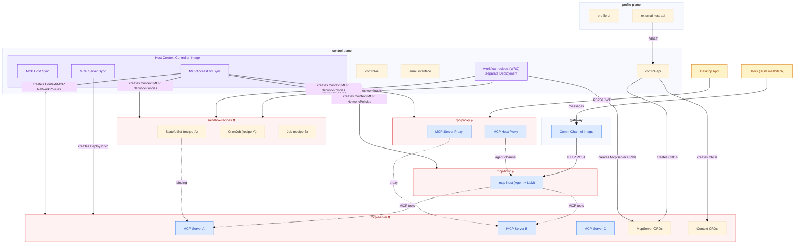
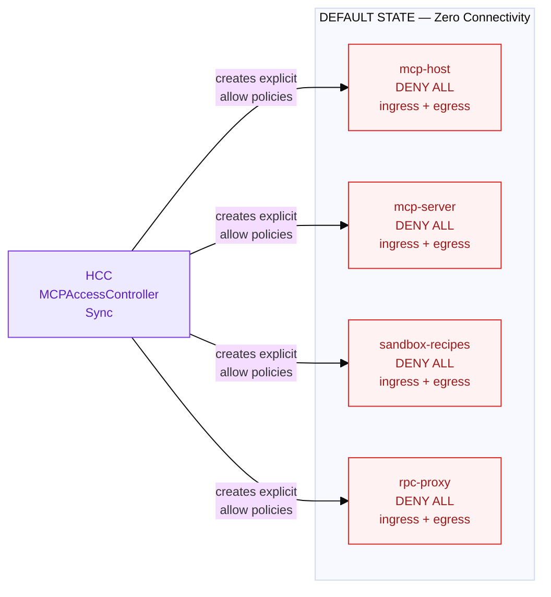
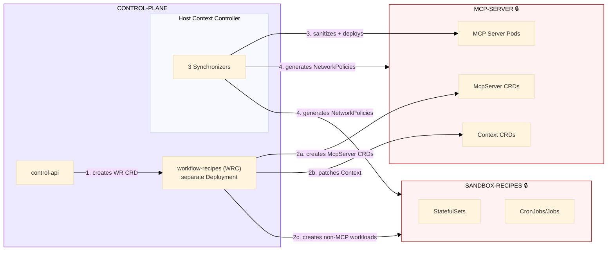
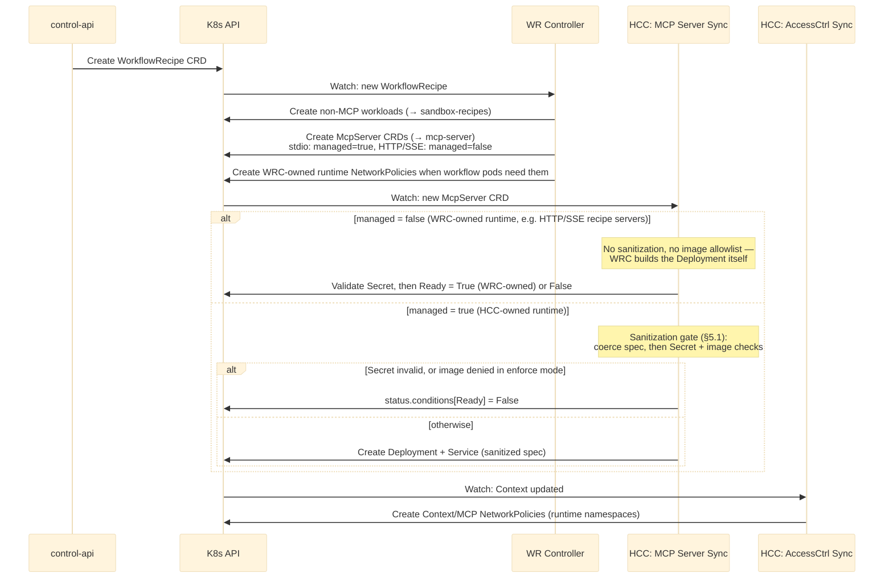
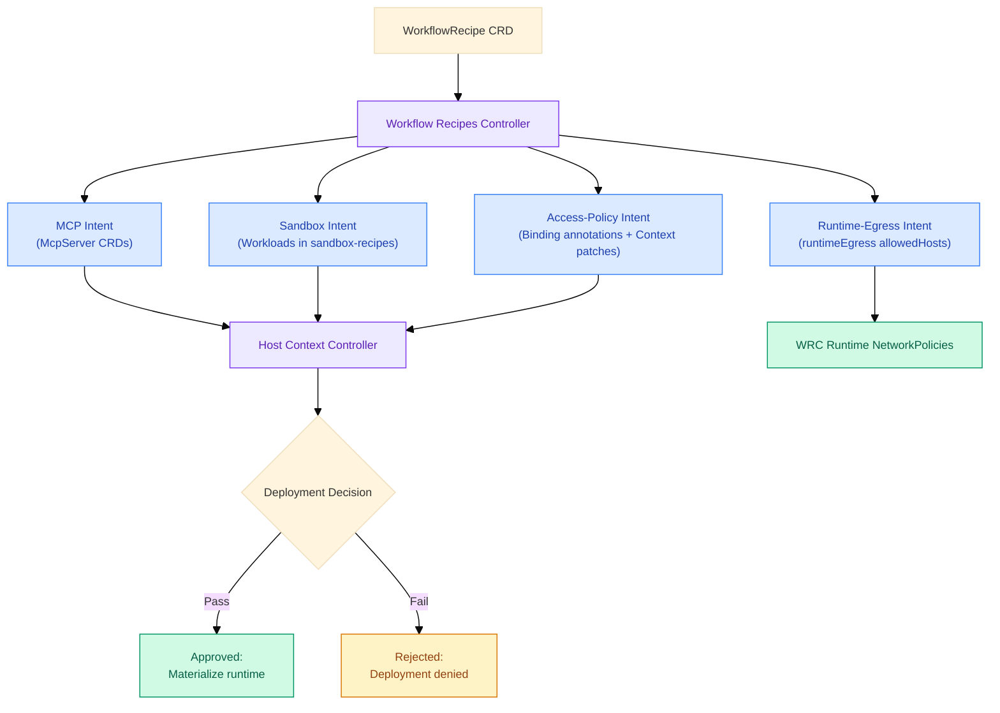
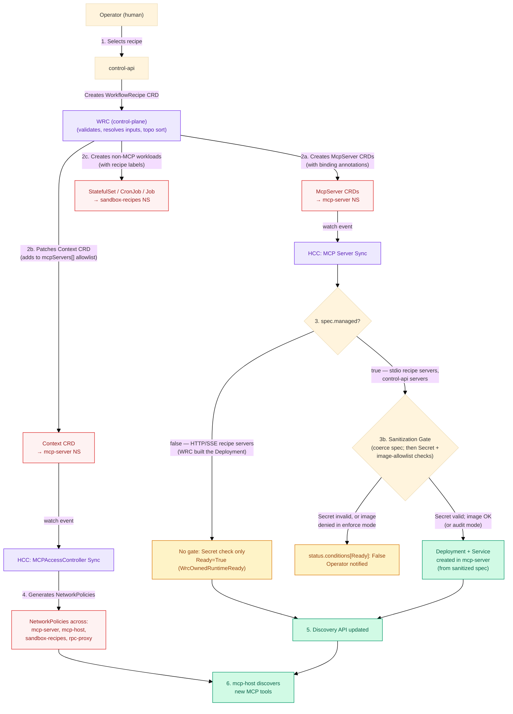
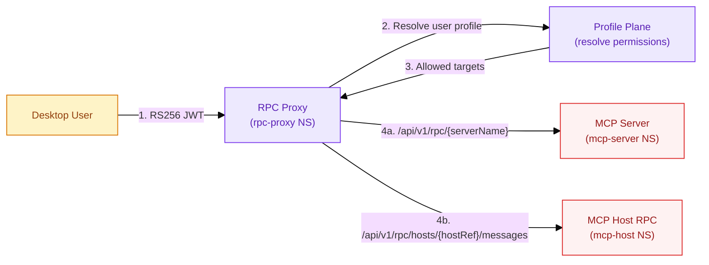
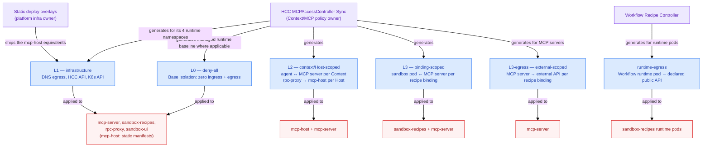
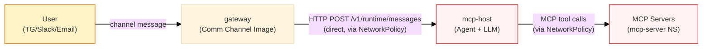
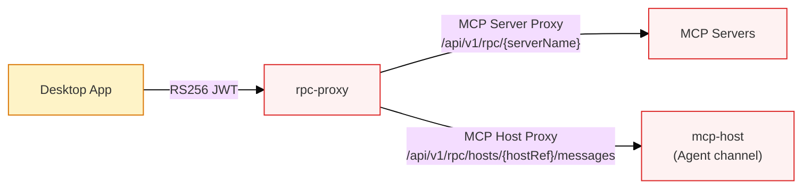

# Clerum Platform — Architecture Reference

> **Status**: Source of truth for Clerum platform architecture. Updated 2026-05-15 with WorkflowRecipe runtime egress lane ownership, public-only mcp-host egress, and Host-scoped rpc-proxy lanes.
> All other specification documents reference this document for architectural decisions.
> When the architecture changes, update THIS document first, then propagate to specs.
>
> **Security-First Architecture**: This document defines the 12-namespace architecture,
> the controller architecture (HCC + WRC), the Sandbox Recipes Namespace, the RPC Proxy Namespace,
> and the **deny-all by default** security posture across all runtime namespaces.

---

## Table of Contents

1. [Platform Architecture (12 Namespaces)](#1-platform-architecture-12-namespaces)
2. [Security Architecture: Deny-All by Default](#2-security-architecture-deny-all-by-default)
3. [Controller Architecture](#3-controller-architecture)
4. [CRD Ecosystem](#4-crd-ecosystem)
5. [Host Context Controller Image (3 Synchronizers)](#5-host-context-controller-image-3-synchronizers)
6. [Workflow Recipe Controller (WRC)](#6-workflow-recipe-controller-wrc)
7. [Workflow Recipe Lifecycle](#7-workflow-recipe-lifecycle)
8. [Sandbox Recipes Namespace](#8-sandbox-recipes-namespace)
9. [RPC Proxy Namespace](#9-rpc-proxy-namespace)
10. [Context CRD and Multi-Tenancy](#10-context-crd-and-multi-tenancy)
11. [NetworkPolicy Architecture](#11-networkpolicy-architecture)
12. [Data Flows](#12-data-flows)
13. [Deployment Responsibility Matrix](#13-deployment-responsibility-matrix)
14. [Design Decisions](#14-design-decisions)
15. [Glossary](#15-glossary)
16. [Known Limitations](#16-known-limitations)
17. [Future Scope](#17-future-scope)
18. [Implementation Status](#18-implementation-status)

---

## 1. Platform Architecture (12 Namespaces)

### 1.1 Platform Overview

evenfire is a Kubernetes-native platform for LLM orchestration with multi-channel communication (Telegram, Email, Slack, Desktop App) and MCP (Model Context Protocol) integration. All configuration is driven by CRDs under the historical `clerum.io/v1alpha1` API group ([code names](../concepts/code-names.md)).

The platform is deployed across **12 namespaces** (declared in `deploy/`) with a **deny-all by default** security posture. Every runtime namespace denies all ingress/egress by default: HCC reconciles the deny-all for its four runtime namespaces (mcp-server, sandbox-recipes, rpc-proxy, sandbox-ui), and `mcp-host` gets an equivalent static `deny-all-mcp-host` policy shipped in `deploy/base/mcp-host/networkpolicies.yaml`. Communication is only enabled through explicit NetworkPolicies owned by the component responsible for that selector family: HCC for Context/MCP relationships, WRC for WorkflowRecipe runtime pods, and static deploy overlays for platform infrastructure policies.

**Core architectural principle**: Think Linux — **deny everything by default, open only what is needed, with explicit justification for every exception**.



### 1.2 Namespace Map

| Namespace           | Purpose                                                   | Deny-All Default | Key Components                                                                           |
| ------------------- | --------------------------------------------------------- | :--------------: | ---------------------------------------------------------------------------------------- |
| **profiles**        | User identity, profiles, team management, access mapping  | No (management)  | profile-ui, external-rest-api                                                            |
| **control-plane**   | Platform management, CRD lifecycle, controllers           | No (management)  | control-ui, control-api, email intf, HCC Image (3 synchronizers), workflow-recipes (WRC) |
| **channels**        | External communication ingress (channels)                 |   No (ingress)   | Communication Channel Image (TG/Email/Slack)                                             |
| **mcp-host**        | LLM orchestration and agent state machine                 |     **Yes**      | mcp-host (Agent + MCP Client)                                                            |
| **mcp-server**      | MCP server runtime and CRD storage                        |     **Yes**      | MCP server pods, McpServer CRDs, Context CRDs                                            |
| **sandbox-recipes** | Non-MCP workloads from WorkflowRecipes                    |     **Yes**      | StatefulSets, CronJobs, Jobs, Deployments, PVCs                                          |
| **rpc-proxy**       | Secure external access for Desktop App users              |     **Yes**      | mcpProxy Image (MCP Server Proxy, MCP Host Proxy)                                        |
| **sandbox-ui**      | Untrusted recipe-supplied UI workloads                    |     **Yes**      | Recipe-defined UI workloads (ingress only via rpc-proxy)                                 |
| **webhook-ingress** | Public webhook termination                                |     **Yes**      | webhook-proxy (HTTP terminator)                                                          |
| **gfs**             | GFS (Global File System) data plane                       |     **Yes**      | gfsc file-broker pods reconciled from GlobalFileSystem CRDs                              |
| **ingress**         | Public tunnel ingress                                     |     **Yes**      | cloudflared                                                                              |
| **registry**        | Recipe registry (declared in the minikube overlay only)   |        No        | registry-api (side-by-side registry server, port 8085)                                   |

> Namespace names above are the ones declared in `deploy/` (`deploy/base/namespaces.yaml`, plus `deploy/base/ingress/` and `deploy/overlays/minikube/registry/`). Diagrams in this document use the historical conceptual names **profile-plane** and **gateway** for the declared namespaces `profiles` and `channels`.

### 1.3 Service Map

| Service                        | Directory                  | Namespace     | Port | Role                                                                                                                                                      |
| ------------------------------ | -------------------------- | ------------- | ---- | --------------------------------------------------------------------------------------------------------------------------------------------------------- |
| **profile-ui**                 | `/profile-ui`              | profiles      | 3001 | User-facing profile management UI                                                                                                                         |
| **external-rest-api**          | `/external-rest-api`       | profiles      | 8091 | User-facing profile, auth, team, invitation, and RPC-token API                                                                                            |
| **control-ui**                 | `/control-ui`              | control-plane | 3000 | Platform management UI                                                                                                                                    |
| **control-api**                | `/control-api`             | control-plane | 8090 | CRD lifecycle, resource CRUD, profile mapping                                                                                                             |
| **Host Context Controller**    | `/host-context-controller` | control-plane | 8081 | 3 synchronizers (MCP Host, AccessCtrl, MCP Server) + Discovery REST API                                                                                   |
| **Workflow Recipe Controller** | `/workflow-recipes`        | control-plane | 8082 | Standalone `workflow-recipes` Deployment + Service — a separate process from HCC, with its own image and ServiceAccount                                   |
| **Comm Channel Image**         | `/channel-reader`          | channels      | —    | Polls TG/Email/Slack, forwards to mcp-host                                                                                                                |
| **mcp-host**                   | `/mcp-host`                | mcp-host      | 8080 | LLM orchestration, agent state machine, MCP tool calling                                                                                                  |
| **mcpProxy Image**             | `/rpc-proxy`               | rpc-proxy     | 8094 | Secure RPC proxy: Desktop App → MCP servers / Agent                                                                                                       |

---

## 2. Security Architecture: Deny-All by Default

### 2.1 Core Principle

**Every runtime namespace starts with zero connectivity.** No pod can communicate with any other pod — within or across namespaces — unless an explicit NetworkPolicy has been created by the owner for that pod-selector family.



Nothing moves until HCC creates explicit allow policies.

### 2.2 Trust Boundaries

| Boundary                   | Trust Level                                                | Enforcement                                                                                                                 |
| -------------------------- | ---------------------------------------------------------- | --------------------------------------------------------------------------------------------------------------------------- |
| External → rpc-proxy       | Zero trust                                                 | Scoped RS256 bearer JWT (iss/aud/typ/exp/scope/hostRefs), control-api profile ACL                                          |
| External → gateway         | Channel trust                                              | Bot tokens, allowed sender lists                                                                                            |
| gateway → mcp-host         | Internal trust                                             | NetworkPolicy                                                                                                               |
| mcp-host → mcp-server      | Context-scoped                                             | NetworkPolicy per (context, server) + identity headers                                                                      |
| sandbox → mcp-server       | Recipe-scoped                                              | NetworkPolicy per recipe binding                                                                                            |
| rpc-proxy → mcp-server     | Context/server-scoped data plane + profile-scoped app auth | HCC `rpc-egress-<context>-<server>` plus matching `ctx-<context>-<server>` ingress, with control-api profile ACL            |
| rpc-proxy → mcp-host       | Host-scoped data plane + profile-scoped app auth           | HCC `rpc-proxy-<host>-egress-mcp-host` and `mcp-host-<host>-ingress-rpc-proxy` NetworkPolicies plus control-api profile ACL |
| control-plane → mcp-server | RBAC watch-only                                            | HCC watches CRDs, creates Deploys. No data plane access                                                                     |

### 2.3 Security Invariants

1. **No runtime pod initiates unauthorized outbound connections**
2. **No sandbox pod reaches any MCP server** unless recipe bindings sanitized by HCC
3. **The agent cannot deploy workloads** — only control-plane creates WorkflowRecipe CRDs
4. **Cross-context access is impossible** — agents in context A cannot reach servers in context B
5. **All NetworkPolicies have a single owner per pod-selector family** (HCC, WRC, or static deploy)
6. **`managed: true` McpServer CRDs are sanitized by HCC** before HCC builds their Deployment. This does **not** cover every recipe MCP workload: WRC sets `managed: false` on HTTP/SSE-transport recipe servers and builds those Deployments itself, without the HCC sanitization gate (§5.1)

---

## 3. Controller Architecture

### 3.1 Controller Architecture Overview

The platform uses a **controller architecture** where all control logic runs in `control-plane`:

| Component                        | Namespace                    | Role                                                                                    |
| -------------------------------- | ---------------------------- | --------------------------------------------------------------------------------------- |
| Host Context Controller (HCC)    | `control-plane`              | 3 synchronizers + Discovery API (port 8081)                                             |
| Workflow Recipe Controller (WRC) | `control-plane`              | Pure CRD reconciler for WorkflowRecipe lifecycle — its own Deployment (port 8082)       |
| Control-plane triggers deploys   | `control-plane`              | Agents cannot trigger deploys directly                                                  |
| Non-MCP workloads                | `sandbox-recipes`            | Isolated runtime for non-MCP recipe workloads                                           |
| 12 namespaces                    | —                            | channels, control-plane, gfs, ingress, mcp-host, mcp-server, profiles, registry (minikube overlay), rpc-proxy, sandbox-recipes, sandbox-ui, webhook-ingress |

### 3.2 Where the WRC Fits



### 3.3 Controller Interaction Sequence



---

## 4. CRD Ecosystem

### 4.1 CRD Summary

| CRD                    | Created By                           | Watched By            | Purpose                                     |
| ---------------------- | ------------------------------------ | --------------------- | ------------------------------------------- |
| `WorkflowRecipe`       | control-api                          | WR Controller         | Package of workloads + resources + bindings |
| `WorkflowRecipePolicy` | control-api                          | WR Controller         | Governance rules per recipe context         |
| `McpServer`            | control-api, WR Controller           | HCC (MCP Server Sync) | MCP server deployment spec                  |
| `Context`              | control-api, WR Controller (patches) | HCC (AccessCtrl Sync) | Access control: server allowlist            |
| `Host`                 | control-api                          | HCC (MCP Host Sync)   | LLM provider config                         |
| `CommunicationChannel` | control-api                          | Comm Channel Image    | TG/Email/Slack channels                     |

### 4.2 McpServer CRD Status

The shipped `McpServer` CRD status has exactly two fields. There is no `status.phase`
and no `status.sanitization` — reconciliation state is reported through `conditions[]`.

| Field                      | Type  | Description                                                                    |
| -------------------------- | ----- | ------------------------------------------------------------------------------ |
| `status.resolvedEgressIPs` | array | Resolved IPs for DNS-based egress bindings (for auditability)                  |
| `status.conditions`        | array | Standard K8s conditions (`type`, `status`, `reason`, `message`) — e.g. `Ready` |

---

## 5. Host Context Controller Image (3 Synchronizers)

| Synchronizer                 | Watches                                        | Produces                                    | Target Namespaces                                |
| ---------------------------- | ---------------------------------------------- | ------------------------------------------- | ------------------------------------------------ |
| **MCP Server Sync**          | McpServer CRDs                                 | Deployments + Services (after sanitization) | mcp-server                                       |
| **MCPAccessController Sync** | Context CRDs, McpServer annotations, Host CRDs | Context/MCP NetworkPolicies                 | mcp-server, mcp-host, sandbox-recipes, rpc-proxy |
| **MCP Host Sync**            | Host CRDs                                      | mcp-host configuration, Secret validation   | mcp-host                                         |

### 5.1 Sanitization Gate (MCP Server Sync)

**The gate only runs for `managed: true` McpServers.** `reconcile()` reads `spec.managed` (CRD default `true`) and, when it is `false`, returns early into `reconcileWrcOwnedServer()` (`host-context-controller/src/reconciler.ts`), which validates the Secret, writes `Ready=True` (`reason: WrcOwnedRuntimeReady`) and does nothing else. `sanitizeCrdSpec()` is called only from `buildDeployment()`, and `classifyPluginImage()` only on the managed branch — so **neither runs on the WRC-owned path**.

This matters because WRC sets `managed: isStdio` (`workflow-recipes/src/reconciler/mcpDelegation.ts`): recipe MCP workloads on **stdio** transport are `managed: true` (HCC owns the Deployment, sanitization applies), while recipe MCP workloads on **HTTP/SSE** transport are `managed: false` — WRC builds those Deployments itself and they never pass through this gate.

For a `managed: true` McpServer, `sanitizeCrdSpec()` rewrites the spec before the Deployment is built so CRD-supplied values cannot override platform security decisions. **It coerces and strips — it does not reject.** The Deployment is still created afterwards.

**Coercing rules** (workload still deploys, with the offending value rewritten or removed):

| Field                                                        | Behaviour                                                                                                                                                                                                                                                                                            |
| ------------------------------------------------------------ | ------------------------------------------------------------------------------------------------------------------------------------------------------------------------------------------------------------------------------------------------------------------------------------------------------ |
| `spec.imagePullPolicy`                                       | Deleted — the platform default (`config.mcpServerImagePullPolicy`) always wins                                                                                                                                                                                                                        |
| `spec.security.runAsGroup` / `fsGroup` (`< 1`)               | Rewritten to `1000`. These two fields have no schema `minimum`, so this is the coercion that actually fires                                                                                                                                                                                           |
| `spec.security.runAsUser` (`< 1`)                            | Rewritten to `1000` — but unreachable through the API: the CRD sets `minimum: 1`, so `runAsUser: 0` is rejected at admission (`kubectl apply` fails) rather than coerced. Defence in depth only                                                                                                       |
| `spec.security.addCapabilities[]`                            | Capabilities outside the default-allowed set are stripped — also unreachable through the API: the CRD `enum` admits only `CHOWN`, `FOWNER`, `DAC_OVERRIDE`, `NET_BIND_SERVICE`, which _is_ the allowed set, so e.g. `SYS_ADMIN` is rejected at admission. Defence in depth only                        |
| `spec.env[]`                                                 | `LD_PRELOAD`, `LD_LIBRARY_PATH`, `PATH`, `NODE_OPTIONS`, `PYTHONPATH`, `JAVA_TOOL_OPTIONS`, `KUBECONFIG`, `KUBERNETES_SERVICE_HOST`, `KUBERNETES_SERVICE_PORT` are stripped                                                                                                                           |
| `spec.resources.limits.cpu` / `.memory`                      | Clamped to `4000m` / `8Gi` — but the comparison is **unit-naive** (`parseInt(limits.cpu) > 4000`, `parseInt(limits.memory) > 8192`). It only catches values whose leading number is already in millicores / mebibytes; `cpu: "8"` (→ 8) and `memory: 16Gi` (→ 16) pass through **unclamped**           |

There is no privileged / hostPath / hostNetwork rule because the McpServer CRD has no such fields: `spec.security` carries only `runAsUser`, `runAsGroup`, `fsGroup`, and `addCapabilities`.

**Blocking rules** (`managed: true` only — no Deployment; `status.conditions[Ready] = False`):

| Check                                        | Behaviour                                                                                                                                                                                                                                                                                                                          |
| --------------------------------------------- | ------------------------------------------------------------------------------------------------------------------------------------------------------------------------------------------------------------------------------------------------------------------------------------------------------------------------------------ |
| Secret validation (`validateSecret()`)       | On failure: no Deployment, and `SecretResolved=False` + `Ready=False` (`reason: SecretValidationFailed`) are written                                                                                                                                                                                                                |
| Plugin image allowlist (`classifyPluginImage()`) | **Audit mode by default.** `deploy/base` ships `CONTEXT_MAPPER_ENFORCE_IMAGE_ALLOWLIST="false"`, so a non-allowlisted image is logged and **still deployed**. Only with `=true` does HCC skip the Deployment and write `Ready=False` (`reason: ImageNotAllowed`). The allowlist comes from `CONTEXT_MAPPER_ALLOWED_IMAGE_PREFIXES`, shipped in base as `ghcr.io/evenfire-ai/,mongodb/,mcr.microsoft.com/,clerum/`; environment overlays override it with their own registry prefixes. |

#### Sanitization Sequence

```mermaid
%%{init: {'theme':'base', 'themeVariables': {'fontSize':'12px'}}}%%
sequenceDiagram
    participant WRC as WR Controller
    participant K8s as K8s API
    participant HCC as HCC: MCP Server Sync

    WRC->>K8s: Create McpServer CRD (from recipe)
    K8s->>HCC: Watch event: new McpServer

    alt spec.managed = false (HTTP/SSE recipe servers — WRC-owned runtime)
        Note over HCC: reconcileWrcOwnedServer() — early return.<br/>No sanitizeCrdSpec(), no image allowlist.
        HCC->>HCC: Validate Secret only
        HCC->>K8s: Ready = True (WrcOwnedRuntimeReady) — WRC built the Deployment
    else spec.managed = true (stdio recipe servers, control-api servers)
        Note over HCC: sanitizeCrdSpec() — coerce, do not reject
        HCC->>HCC: Drop imagePullPolicy; force non-root gid/fsGroup
        HCC->>HCC: Strip forbidden capabilities and env vars
        HCC->>HCC: Clamp resource limits (unit-naive — see table)

        HCC->>HCC: Validate Secret; classify image against allowlist

        alt Secret invalid, or image denied in enforce mode
            HCC->>K8s: status.conditions[Ready] = False (reason + message)
            Note over HCC: No Deployment — operator notified via status
        else otherwise
            HCC->>K8s: Create Deployment + Service (from the sanitized spec)
        end
    end
```

**Trust is layered, not binary.** The registry verifies recipe _authorship and integrity_ (who published it, has it been tampered with). Sanitization verifies _runtime safety_ (this specific configuration cannot escalate privilege inside our cluster). Today that safety is narrower than the name suggests: it **only applies to `managed: true` servers** (so the default HTTP/SSE recipe path bypasses it entirely), it is achieved mostly by **rewriting** the spec rather than refusing it, its resource clamp is unit-naive, and the image-host allowlist is **audit-only** until an operator sets `CONTEXT_MAPPER_ENFORCE_IMAGE_ALLOWLIST=true`. Treat the gate as partial privilege containment on the HCC-owned path, not as a cluster-wide admission barrier.

> **Cross-reference**: The McpServer status fields are defined in [§4.2 McpServer CRD Status](#42-mcpserver-crd-status).

---

## 6. Workflow Recipe Controller (WRC)

The **Workflow Recipe Controller (WRC)** is a pure CRD reconciler in `control-plane` that generates _intent_ (CRDs and workloads) but never touches the data plane directly. The WRC ships as its **own `workflow-recipes` Deployment** (image `clerum/workflow-recipes`, ServiceAccount `workflow-recipes`, ClusterIP Service on port 8082) — a separate process from the Host Context Controller (port 8081), and the two sign InternalControl JWTs with distinct issuer-specific secrets. Both live in `control-plane`, so the control/data-plane split holds, but they scale, restart, and fail independently.

### 6.1 What It Does vs. What It Does NOT

| Does                                                        | Does NOT                                        |
| ----------------------------------------------------------- | ----------------------------------------------- |
| Watches WorkflowRecipe CRDs                                 | Manage MCP servers (HCC does this)              |
| Creates McpServer CRDs (for HCC)                            | Create Context/MCP NetworkPolicies owned by HCC |
| Creates non-MCP workloads in sandbox                        | Serve the end-user agent runtime (that is mcp-host) |
| Creates runtime NetworkPolicies for WRC-owned workflow pods | Create static platform infrastructure policies  |
| Annotates binding requirements                              | Accept a deployment whose caller `contextRef` ≠ the recipe's (403) |
| Exposes an MCP interface for recipe ops (`:8082/mcp/v1`)    | —                                               |

### 6.2 Namespace Placement: Control Plane

| Factor                             | Control Plane (chosen) | MCP Server (rejected) |
| ---------------------------------- | :--------------------: | :-------------------: |
| Triggered by CRDs from control-api |     Same namespace     |    Cross-namespace    |
| MCP interface needed               |           No           |  Unnecessary surface  |
| Attack surface in mcp-server       |       Unchanged        |       Increased       |
| Diagram alignment                  |        Matches         |      Contradicts      |

### 6.3 Intent Decomposition

The WRC decomposes every WorkflowRecipe into architectural intent classes before any runtime state is created. This decomposition is the central architectural function of the WRC — a recipe expresses _intent_, not direct MCP runtime ownership and not implicit trust. WRC does render NetworkPolicies only for the runtime pods that it creates and labels itself.

| Intent Class              | What It Represents                                                                                                                                       | Produced As                                                                                         |
| ------------------------- | -------------------------------------------------------------------------------------------------------------------------------------------------------- | --------------------------------------------------------------------------------------------------- |
| **MCP Intent**            | Which MCP servers the recipe wants to expose through the platform                                                                                        | McpServer CRDs in mcp-server namespace                                                              |
| **Sandbox Intent**        | Which non-MCP services must run in an isolated execution zone                                                                                            | Workloads (StatefulSet, Job, CronJob) in sandbox-recipes namespace                                  |
| **Access-Policy Intent**  | Which communication relationships are requested — both internal (MCP server ↔ non-MCP service) and external (MCP server → external API via `dns`/`cidr`) | Binding annotations on CRDs + Context CRD patches + McpServer `spec.egressBindings[]`               |
| **Runtime-Egress Intent** | Which external public HTTP hosts WRC-owned workflow code runtimes may reach                                                                              | WRC-owned runtime NetworkPolicies in sandbox-recipes, with hostnames resolved to public `/32` CIDRs |



If recipe authors could define final policy directly, the platform would no longer own its own security model. The intent decomposition ensures that WRC produces **declarative intent** for HCC-owned MCP surfaces, and HCC decides what becomes MCP runtime reality. WRC-owned workflow runtime state is limited to the pods and NetworkPolicies WRC itself creates and labels.

---

## 7. Workflow Recipe Lifecycle

### 7.1 Trigger: Control-Plane Only

| Trigger                     | Behavior                                                                                                                           |
| --------------------------- | ---------------------------------------------------------------------------------------------------------------------------------- |
| Agent request               | **Not supported** — agents cannot deploy workloads directly. Agents can REQUEST deployment by notifying operators through channels |
| Operator via control-api UI | **Primary path**                                                                                                                   |

**Why**: An LLM agent should not deploy workloads to production. Human-in-the-loop for high-impact operations. Agent can REQUEST deployment by notifying operators through channels.

### 7.2 Full Deployment Flow



### 7.3 Step-by-Step Explanation

| Step                            | Who                                | What                                                                                                                                                                                                                          | Where                                                 |
| ------------------------------- | ---------------------------------- | ----------------------------------------------------------------------------------------------------------------------------------------------------------------------------------------------------------------------------- | ----------------------------------------------------- |
| **1. Recipe Submission**        | Human operator via control-api     | Creates `WorkflowRecipe` CRD — the **only entry point** for recipe deployment. Agents cannot trigger this step                                                                                                                | control-plane                                         |
| **2. Intent Decomposition**     | WRC (watches WorkflowRecipe CRDs)  | Validates recipe, decomposes into 3 intent classes: MCP Intent → McpServer CRDs, Sandbox Intent → non-MCP workloads, Access-Policy Intent → Context patches + binding annotations                                             | control-plane → mcp-server, sandbox-recipes           |
| **3. Sanitization Gate**        | HCC: MCP Server Sync               | **`managed: true` only** (stdio recipe servers, control-api servers). Coerces the McpServer CRD (imagePullPolicy, non-root gid/fsGroup, capability + env stripping, unit-naive resource clamping), then runs the two blocking checks — Secret validation and the image allowlist (audit-only unless enforce mode). Blocked → no Deployment, `status.conditions[Ready]=False`. `managed: false` servers (WRC's HTTP/SSE recipe workloads) skip the gate entirely — HCC only validates the Secret and marks them Ready. See §5.1 | control-plane → mcp-server                            |
| **4. NetworkPolicy Generation** | HCC + WRC + static deploy overlays | HCC watches Context/McpServer intent and generates Context/MCP policies; WRC generates policies only for WRC-owned workflow runtime pods; static deploy owns platform infrastructure policies such as GKE mcp-host API egress | control-plane → mcp-host, mcp-server, sandbox-recipes |
| **5. Discovery**                | HCC REST API                       | Internal cache updates when MCP server Deployment is running. mcp-host polls Discovery API (`GET /api/v1/mcpservers/context/{contextRef}`)                                                                                    | control-plane (8081) → mcp-host                       |
| **6. Tool Availability**        | mcp-host                           | Agent discovers new MCP server tools. L2 NetworkPolicy allows traffic. Auth token from Discovery API authenticates the agent to the MCP server                                                                                | mcp-host → mcp-server                                 |

### 7.4 Trust Behavior Properties

The important property of this flow is not its sequence alone, but its **trust behavior**:

| Property                                                                   | Guarantee                                                                                                              |
| -------------------------------------------------------------------------- | ---------------------------------------------------------------------------------------------------------------------- |
| **Recipes do not self-authorize**                                          | A recipe can request behavior, but it cannot directly create trusted runtime state                                     |
| **HCC-owned runtime is created only after review**                         | The HCC sanitization gate evaluates `managed: true` McpServers before materialization. It does **not** cover `managed: false` (WRC-owned) servers, which WRC materializes itself — see §5.1 |
| **Network openings are controlled, not implied**                           | Each pod-selector family has exactly one NetworkPolicy owner, and every exception has a declared source                |
| **MCP and non-MCP remain coordinated but isolated**                        | Different namespaces, different trust zones, connected only by approved bindings                                       |
| **Owners do not write another owner's NetworkPolicy surface**              | WRC only finalizes its own runtime pod and policy selectors. Note this does **not** extend to MCP server materialization: for `managed: false` servers WRC builds the Deployment itself, without HCC review |
| **Discovery is context-scoped**                                            | mcp-host only sees servers allowed by its Context CRD — not all servers in the cluster                                 |

---

## 8. Sandbox Recipes Namespace

### 8.1 Isolation Model

Single shared namespace. Per-recipe isolation via labels + NetworkPolicies:

- All workloads labeled `clerum.io/recipe={name}`
- Recipe A cannot communicate with Recipe B (even in same namespace)
- Cross-namespace to mcp-server only via declared bindings

### 8.2 Cross-Namespace Connectivity

```
Recipe bindings[] → WRC annotates McpServer CRD → HCC generates NetworkPolicy:

  sandbox-recipes (recipe-A pods) → mcp-server (recipe-A MCP server)
  Only specific ports. Only declared bindings. Nothing else.
```

> **✅ Implementation Status (Phase 8)**: Namespace splitting is **implemented**.
> Non-MCP workloads are deployed to `sandbox-recipes` namespace, MCP workloads remain
> in `mcp-server`. Cross-namespace L3 NetworkPolicies enable communication between
> namespaces. See [non-MCP services](non-mcp-services.md) for the published
> namespace-splitting rules and implementation details.

---

## 9. RPC Proxy Namespace

### 9.1 Dual Proxy Architecture

All rpc-proxy routers are mounted under `/api/v1`; unmatched paths return 404.

| Proxy                | Path                                     | Target          | Purpose                                                                  |
| -------------------- | ---------------------------------------- | --------------- | ------------------------------------------------------------------------ |
| **MCP Server Proxy** | `/api/v1/rpc/{serverName}`               | mcp-server pods | Desktop App → MCP tools directly                                         |
| **MCP Host Proxy**   | `/api/v1/rpc/hosts/{hostRef}/messages`   | mcp-host        | Desktop App → Agent (secure channel, like TG/Slack but with strong auth) |

> **Important — Gateway does NOT use rpc-proxy**: Channel communication (Telegram, Email, Slack) flows
> directly from the gateway namespace to mcp-host via NetworkPolicy. The rpc-proxy is exclusively for
> Desktop App users, who authenticate with a scoped RS256 bearer JWT. This separation keeps
> existing channel infrastructure simple and avoids unnecessary indirection. Routing channels through
> rpc-proxy is tracked as a [future study option](#17-future-scope).

### 9.2 Auth Chain

```
Desktop App → RS256 JWT (scoped: scope + hostRefs) →
rpc-proxy validates → resolves user profile via control-api →
forwards to allowed MCP servers or agent
```

### 9.3 Remote Access Flow

The RPC Proxy provides secure user access from a Desktop App without granting cluster access. Authorization is **profile-driven**: the Profile Plane determines whether the user may access a specific MCP server or the host RPC surface.



The proxy routes traffic to the right internal target only after: the user is authenticated, the profile allows the target, and the platform posture (NetworkPolicy) allows the route.

#### Channel vs Desktop Comparison

| Concern             | Channel Path                                    | Desktop App Path                                |
| ------------------- | ----------------------------------------------- | ----------------------------------------------- |
| **Auth model**      | Bot tokens + allowed sender lists (per channel) | Scoped RS256 JWT + control-api profile ACL      |
| **Traffic pattern** | Polling → HTTP POST (simple)                    | Bidirectional RPC (complex)                     |
| **Infrastructure**  | Already built and proven                        | Requires rpc-proxy namespace                    |
| **Latency**         | Direct = minimal hops                           | Proxy adds one hop (acceptable for strong auth) |
| **Blast radius**    | Gateway compromise ≠ Desktop compromise         | Separate security boundary                      |

---

## 10. Context CRD and Multi-Tenancy

### 10.1 Context as Sufficient Access Control

**v2 conclusion: Context alone is sufficient. No separate agent-level ACL needed.**

- Context controls discovery (mcpServers[] allowlist)
- Context controls network (NetworkPolicies per context)
- Identity headers (X-Clerum-Agent-Id) provide audit, not access control
- Adding agent ACL on top of context is redundant

---

## 11. NetworkPolicy Architecture

### 11.1 Four-Layer Model

| Layer              | Type                  | Purpose                                                                |
| ------------------ | --------------------- | ---------------------------------------------------------------------- |
| **L0**             | deny-all              | Base isolation for all runtime namespaces (ingress + egress)           |
| **L1**             | infrastructure        | DNS egress, HCC API access, K8s API token refresh                      |
| **L2**             | context-scoped        | Agent ↔ MCP server per context; rpc-proxy ↔ selected mcp-host per Host |
| **L3**             | binding-scoped        | Sandbox ↔ MCP server per recipe binding                                |
| **L3-egress**      | external-scoped       | MCP server → external endpoint per recipe `to: external` binding       |
| **runtime-egress** | public-runtime-scoped | WRC-owned workflow code runtime pod → declared public HTTP host        |

Each selector family has one owner. HCC owns Context/MCP policies, WRC owns WorkflowRecipe runtime policies for pods it creates, and static deploy overlays own platform infrastructure policies. This prevents additive NetworkPolicies from widening another owner's boundary.



### 11.2 Layer-by-Layer Specification

#### 11.2.1 L0 — Deny-All (Base Isolation)

**What it does**: Creates a `NetworkPolicy` in each runtime namespace that selects all pods (`podSelector: {}`) and blocks all ingress and all egress traffic with no exceptions.

**Applied to**: `mcp-server`, `sandbox-recipes`, `rpc-proxy`, `sandbox-ui` — HCC's four runtime namespaces (`CONTEXT_MAPPER_RUNTIME_NAMESPACES`). `mcp-host` is not one of them: it gets an equivalent static `deny-all-mcp-host` policy from `deploy/base/mcp-host/networkpolicies.yaml` instead (see §19.4.3).

**Why it matters**: This is the foundation of the entire security model. Without L0, any pod deployed into a runtime namespace could immediately communicate with any other pod in the cluster. L0 ensures that the **default state is zero connectivity** — nothing works until a higher layer explicitly opens a path. This is analogous to `iptables -P INPUT DROP` and `iptables -P OUTPUT DROP` in Linux.

**Lifecycle**: Created at namespace initialization, before any workload pod starts. **Never deleted.**

#### 11.2.2 L1 — Infrastructure (Platform Services Access)

**What it does**: Opens the minimum egress paths required for Kubernetes infrastructure to function:

- **DNS egress** to `kube-system` (port 53 UDP/TCP) — without this, pods cannot resolve any service name
- **HCC API access** — allows runtime pods to reach the Host Context Controller's discovery endpoint in `control-plane` (port 8081)
- **Kubernetes API** — allows projected ServiceAccount token refresh

**Applied to**: HCC's four runtime namespaces (same scope as L0). DNS egress goes to all four; HCC-API and K8s-API egress are skipped for namespaces listed in `CONTEXT_MAPPER_MINIMAL_INFRA_NAMESPACES` — currently `sandbox-ui`, whose pods are plain HTTP servers that call neither API. That yields 10 policies, not 3 × 4. `mcp-host`'s equivalents are static manifests.

**Why it matters**: L0 blocks everything, including DNS. Without L1, pods could not resolve `my-mcp-server.mcp-server.svc.cluster.local` to an IP address, making all other network communication impossible. L1 is the minimum baseline for a functioning Kubernetes workload under deny-all.

#### 11.2.3 L2 — Context/Host-Scoped Internal Data Plane

**What it does**: Creates explicit NetworkPolicies for each internal data-plane relationship. For a `Context` CRD, HCC opens a bidirectional path between the mcp-host pod for that context and the specific MCP server pod. For Desktop/App agent access, HCC opens a per-Host path between `rpc-proxy` and exactly one `mcp-host` pod.

**Applied to**: `mcp-host` (egress to specific server and ingress from selected rpc-proxy route), `mcp-server` (ingress from specific host), and `rpc-proxy` (egress to one selected Host or one selected MCP server).

**Why it matters**: This is the core of Clerum's multi-tenancy model. Agent A in Context "analytics" can only reach MCP servers listed in the "analytics" Context CRD. It cannot reach servers in Context "finance", even though both agents might run in the same `mcp-host` namespace. L2 is what makes **cross-context access impossible**.

**Example**: Context CRD `analytics` lists `mcpServers: [mongodb-analytics, airtable-reports]`. L2 generates:

- `mcp-host` egress: allow traffic from agent pod (label `clerum.io/context=analytics`) to `mongodb-analytics` pod on port 3000
- `mcp-server` ingress: allow traffic from `mcp-host` namespace pods with label `clerum.io/context=analytics` to `mongodb-analytics` pod
- `rpc-proxy` egress to MCP server: `rpc-egress-analytics-mongodb-analytics`, only to the selected server pod after app-level profile authorization
- `rpc-proxy` egress to Host: `rpc-proxy-<host>-egress-mcp-host`, only to the selected Host pod on agent/desktop ports
- `mcp-host` ingress from rpc-proxy: `mcp-host-<host>-ingress-rpc-proxy`, only from `app=rpc-proxy`

**Lifecycle**: Created when HCC watches a Context CRD update. Deleted when the MCP server is removed from the Context's allowlist.

#### 11.2.4 L3 — Binding-Scoped (Sandbox ↔ MCP Server)

**What it does**: Creates NetworkPolicies for cross-namespace communication between non-MCP workloads in `sandbox-recipes` and MCP servers in `mcp-server`. These policies are generated from **recipe binding declarations** — the access-policy intent that the WRC annotates on McpServer CRDs.

**Applied to**: `sandbox-recipes` (egress to specific server) and `mcp-server` (ingress from specific sandbox pod).

**Why it matters**: WorkflowRecipes often describe composite topologies where a non-MCP support service (e.g., a database migration Job or an API adapter) needs to communicate with an MCP server. L3 ensures this cross-namespace communication only happens for **explicitly declared and HCC-approved bindings**, on specific ports, and only for pods belonging to the same recipe.

**Example**: A recipe deploys a MongoDB StatefulSet in `sandbox-recipes` and a `mongodb-mcp` server in `mcp-server`. The recipe declares a binding: `sandbox:mongodb-statefulset → mcp:mongodb-mcp on port 27017`. After HCC approves:

- `sandbox-recipes` egress: allow pods with label `clerum.io/recipe=my-recipe` to reach `mongodb-mcp` pod on port 27017
- `mcp-server` ingress: allow pods from `sandbox-recipes` with label `clerum.io/recipe=my-recipe` on port 27017

**Key constraint**: Recipe A's sandbox pods **cannot** reach Recipe B's MCP servers. The label selector `clerum.io/recipe={name}` ensures per-recipe isolation even within the shared `sandbox-recipes` namespace.

#### 11.2.5 L3-Egress — External Runtime Egress

**What it does**: Opens explicit public egress paths declared by runtime configuration. Kubernetes NetworkPolicy cannot enforce HTTP hostnames at L7, so the current architecture resolves declared hostnames to public IPv4 CIDRs and writes L3/L3-runtime egress policies that allow only those CIDRs on ports 443 and 80.

**Applied to**:

- `McpServer.spec.egressBindings[]` — HCC owns the `mcp-server` policies for rendered MCP server pods.
- `WorkflowRecipe.spec.runtimeEgress.http.allowedHosts[]` — WRC owns the per-run policies for WorkflowRecipe runtime pods it creates, such as snippet runners and custom coordinator images in `sandbox-recipes`.
- Registry installs are only metadata until Control API translates them: remote endpoint metadata becomes exact-host egress, local `egressSummary.domains/ports` becomes exact-host egress, and temporary `egressSummary.wideCidr:true` becomes explicit `egressClass: public-web`.

**Why WRC owns WorkflowRecipe runtime egress**: WRC creates and labels short-lived coordinator, snippet runner, artifact reader, custom coordinator, and recipe-local runtime pods. HCC does not own those pod selectors. WRC therefore creates only the NetworkPolicies that target WRC-owned runtime selectors, while HCC remains the owner for MCP server and Context-derived selectors.

**Operational constraint**: Hostname-to-CIDR resolution is fail-closed. A runtime host that does not resolve, resolves only to non-IPv4 addresses, or resolves to private, metadata, link-local, carrier NAT, documentation, benchmarking, multicast, or reserved ranges must not create a permissive public egress rule. WRC refreshes active WorkflowRecipe runtime egress policies during the same steady-state loop used for runtime credential refresh. When DNS changes, WRC patches the NetworkPolicy with the new public `/32` CIDRs while retaining the previous CIDR set for the configured overlap window (`WRC_RUNTIME_EGRESS_DNS_OVERLAP_SECONDS`, default `300`) so active runs do not lose connectivity during propagation. That overlap is also a bounded trust window: previous public CIDRs remain allowed until expiry and should be tuned with that security tradeoff in mind.

**mcp-host distinction**: `runtimeEgress.http.allowedHosts[]` is a strict network contract for WorkflowRecipe code runtimes such as snippet runners and custom coordinator images. Agentic `mcp-host` workloads are different: they run LLM/tool workflows that may need dynamic public internet access for provider APIs and operator-approved HTTP tools. Those pods keep a public HTTP/S egress lane with private, metadata, link-local, carrier NAT, documentation, benchmarking, multicast, and reserved ranges excluded. Fine-grained hostname policy for agentic browsing belongs in a future L7 egress proxy/tool gateway, not in raw Kubernetes NetworkPolicy.

### 11.3 NetworkPolicy Owner Boundaries

In Kubernetes, NetworkPolicies are **additive** — if two controllers independently create policies targeting the same pods, the effective policy is the _union_ of both, which can be more permissive than either controller intended. This is a known source of security drift in multi-controller environments.

Clerum avoids that drift with a **single owner per pod-selector family**, not a blanket single controller for every policy:

| Guarantee                   | How                                                                                                                                          |
| --------------------------- | -------------------------------------------------------------------------------------------------------------------------------------------- |
| **Predictable**             | HCC targets Context/MCP selectors, WRC targets WorkflowRecipe runtime selectors, and static deploy manifests target infrastructure selectors |
| **Auditable**               | To audit access, identify the selector family first, then inspect that family's single owner                                                 |
| **Consistent lifecycle**    | The controller or manifest layer that creates a selector family also cleans up or updates the matching policies                              |
| **No privilege escalation** | Controllers must not create policies for another owner's selectors, because additive policies would widen access                             |

### 11.4 Network Isolation Before Deployment (Option C — Pre-Deploy Annotation Handshake)

#### 11.4.1 The Problem: Vulnerability Window

When a workload is deployed, there is a **time gap** between the pod starting (kubelet creates containers) and the NetworkPolicies being fully applied by HCC. During this window, a pod may receive or initiate traffic that should be blocked. This is especially dangerous for MCP servers, which expose transport endpoints.

Three approaches were evaluated:

| Option                                  | Mechanism                                                                                                                                         | Pros                                                                                                     | Cons                                                                                                                                                                        |
| --------------------------------------- | ------------------------------------------------------------------------------------------------------------------------------------------------- | -------------------------------------------------------------------------------------------------------- | --------------------------------------------------------------------------------------------------------------------------------------------------------------------------- |
| **A — ReadinessGate**                   | HCC patches `pod.status.conditions` with `clerum.io/network-isolated: True` after applying NPs                                                    | Standard K8s pattern, Service won't route until ready                                                    | HCC must watch pods in all namespaces, direct pod patching violates Invariant #1 (CRD-only communication), adds Pod RBAC to HCC, complex lifecycle (pod restart = re-patch) |
| **B — Init container**                  | Sidecar init container blocks until NetworkPolicy exists                                                                                          | No HCC changes needed                                                                                    | Requires shared ServiceAccount, polling from within pod is fragile, no guarantee NP is _applied_ vs just _created_                                                          |
| **C — Pre-deploy annotation handshake** | WRC creates McpServer CRD with `clerum.io/pre-deploy: true` → HCC applies NPs → HCC sets `clerum.io/network-ready: true` → WRC creates Deployment | 100% CRD-based (Invariant #1 preserved), no pod patching, no RBAC expansion, reuses existing watch loops | Adds ~1-5s latency to first deployment, requires timeout handling for HCC unavailability                                                                                    |

**Decision**: **Option C** — the annotation handshake preserves the CRD-only communication invariant while closing the vulnerability window. ReadinessGate (Option A) is deferred indefinitely as Option C provides equivalent security guarantees with simpler implementation.

#### 11.4.2 Flow

```
WRC                                    McpServer CRD                          HCC
 │                                          │                                  │
 ├─── Step 7b: Create McpServer CR ─────────►│                                  │
 │    annotations:                           │                                  │
 │      clerum.io/pre-deploy: "true"         │                                  │
 │    + Create transport Service             │                                  │
 │                                           │                                  │
 │                                           ├── watch triggers ───────────────►│
 │                                           │                                  │
 │                                           │◄── HCC applies L2/L3 NPs ───────┤
 │                                           │    + sets annotation:            │
 │                                           │    clerum.io/network-ready: true │
 │                                           │                                  │
 │◄── Step 7c: Poll for network-ready ──────┤                                  │
 │    (1s interval, 30s timeout)             │                                  │
 │                                           │                                  │
 ├─── Step 8: Create Deployment/StatefulSet  │                                  │
 │    (pods start AFTER NPs exist)           │                                  │
 │                                           │                                  │
 ├─── Step 9a: Finalize delegation ──────────►│                                  │
 │    (patch Context allowlist)              │                                  │
```

#### 11.4.3 Annotations

| Annotation                | Set by | Value    | Meaning                                                                            |
| ------------------------- | ------ | -------- | ---------------------------------------------------------------------------------- |
| `clerum.io/pre-deploy`    | WRC    | `"true"` | McpServer CRD created before workload pods exist; HCC should apply NPs proactively |
| `clerum.io/network-ready` | HCC    | `"true"` | L2/L3 NetworkPolicies applied; safe to start workload pods                         |

#### 11.4.4 Timeout and Graceful Degradation

If HCC does not set `clerum.io/network-ready: "true"` within 30 seconds, WRC proceeds with deployment and logs a warning. This ensures that:

- **HCC unavailability** does not permanently block all recipe deployments
- **Operators are alerted** to investigate the NP gap
- The **security posture degrades gracefully** rather than causing a full outage

The timeout is the WRC constant `NETWORK_READY_TIMEOUT_MS` (30,000ms, in `mcpDelegation.ts`). It is not read from the environment — changing it requires a code change.

#### 11.4.5 Why Option C Is Better Than ReadinessGate

1. **Invariant #1 preserved**: Controllers communicate ONLY via CRDs. Option A (ReadinessGate) requires HCC to directly patch pod status objects — a fundamentally different communication pattern that bypasses the CRD contract.

2. **No RBAC expansion**: HCC currently has no `pods/status` patch permissions. ReadinessGate would require adding this across all runtime namespaces, expanding HCC's blast radius.

3. **Simpler lifecycle**: ReadinessGate must handle pod restarts, evictions, and StatefulSet rolling updates — each requiring re-evaluation and re-patching. Option C runs once during initial reconciliation.

4. **Reuses existing infrastructure**: HCC already watches McpServer CRDs and generates NetworkPolicies from them. Option C adds only an annotation check to the existing watch loop — no new controllers, no new watch targets.

5. **Deterministic ordering**: The NP is guaranteed to exist before the first pod container starts. ReadinessGate only blocks Service routing (pods still run and can initiate egress).

### 11.5 Security Invariants with Layer Mapping

Each security invariant from [§2.3](#23-security-invariants) is enforced by specific NetworkPolicy layers:

| Invariant                                                              | Enforcement Layer(s)                                                  |
| ---------------------------------------------------------------------- | --------------------------------------------------------------------- |
| No runtime pod initiates unauthorized outbound connections             | **L0** (egress deny-all) + **L1** (opens only DNS and HCC API)        |
| No sandbox pod reaches any MCP server unless recipe bindings sanitized | **L0** (base deny) + **L3** (binding-scoped allow after HCC approval) |
| The agent cannot deploy workloads                                      | Not NetworkPolicy — control-plane RBAC                                |
| Cross-context access is impossible                                     | **L2** (per-Context CRD scoping with label selectors)                 |
| All NetworkPolicies have one owner per pod-selector family             | Owner-boundary guarantee (§11.3)                                      |
| Recipe McpServer CRDs sanitized before Deployment                      | Sanitization gate (§5.1) — prerequisite for L2/L3 generation          |

---

## 12. Data Flows

### 12.1 Channel Flow (Direct — no rpc-proxy)



> Channel traffic goes **directly** from gateway to mcp-host. It does NOT pass through rpc-proxy.
> The gateway already has its own auth model (bot tokens + allowed sender lists). All mcp-host runtime
> routes live under `/v1/runtime/*` and require `x-clerum-edge-*` caller headers; an `Authorization`
> header on those routes is rejected with 401.

### 12.2 Desktop App Flow (via rpc-proxy)



### 12.3 Recipe Deployment Flow

See [§7.2 Full Deployment Flow](#72-full-deployment-flow) for the complete mermaid diagram.

---

## 13. Deployment Responsibility Matrix

| Resource                              | Created By            | Target Namespace             | Current Namespace  | Sanitized By           | Infrastructure By |
| ------------------------------------- | --------------------- | ---------------------------- | ------------------ | ---------------------- | ----------------- |
| Standalone MCP server                 | control-api           | mcp-server                   | mcp-server         | HCC (gate — §5.1)      | HCC (Deploy+Svc)  |
| Recipe MCP workload — stdio           | WRC (`managed:true`)  | mcp-server                   | mcp-server         | HCC (gate — §5.1)      | HCC (Deploy+Svc)  |
| Recipe MCP workload — HTTP/SSE        | WRC (`managed:false`) | mcp-server                   | mcp-server         | **Not sanitized**      | WRC (Deploy+Svc)  |
| Platform MCP server                   | Platform install      | mcp-server (`managed:false`) | mcp-server         | Pre-validated          | WRC-owned runtime |
| Non-MCP workload                      | WRC                   | sandbox-recipes              | sandbox-recipes ¹  | HCC validates bindings | WRC               |
| Context/MCP NetworkPolicies           | HCC (AccessCtrl Sync) | runtime namespaces           | runtime namespaces | Self                   | Self              |
| Workflow runtime NetworkPolicies      | WRC                   | sandbox-recipes              | sandbox-recipes    | Self                   | Self              |
| Static infrastructure NetworkPolicies | deploy overlays       | runtime namespaces           | runtime namespaces | Pre-reviewed           | Platform deploy   |

> ¹ Namespace splitting is implemented: `resolveWorkloadNamespace()` routes MCP-transport
> workloads to `mcp-server`, the `spec.ui` workload to `sandbox-ui`, and every other workload
> to `sandbox-recipes`, with L3 cross-namespace binding policies. See
> [non-MCP services](non-mcp-services.md) and §8.2.

---

## 14. Design Decisions

| #   | Decision                                         | Rationale                                                                                                   |
| --- | ------------------------------------------------ | ----------------------------------------------------------------------------------------------------------- |
| D1  | WRC is its own Deployment in control-plane       | Separate control/data planes; WRC and HCC scale and fail independently. mcp-server = pure runtime           |
| D2  | Agents can deploy recipes via the WRC MCP `deploy_recipe` tool | Authorized by a caller-`contextRef` match; a cross-context request is rejected with 403 (`workflow-recipes/src/mcp/handlers.ts`). This is the authorization boundary — not a human-in-the-loop gate |
| D3  | WRC exposes an MCP interface (`:8082/mcp/v1`)    | Recipe operations (`deploy_recipe`, `rollback_recipe`, `delete_recipe`, `validate_recipe`, plus status/list/registry tools) are available as MCP tools, not only via `kubectl apply`             |
| D4  | Single sandbox namespace (shared)                | Standard K8s multi-tenancy. Label + NetworkPolicy isolation                                                 |
| D5  | Each NetworkPolicy selector family has one owner | Prevents additive-policy drift while allowing HCC, WRC, and static deploy to own different runtime surfaces |
| D6  | HCC sanitization gate                            | Defense-in-depth. Even registry-verified recipes validated locally                                          |
| D7  | Context = sufficient access control              | Context controls discovery + network. Agent ACL is redundant                                                |
| D8  | RPC Proxy = secure agent channel                 | Desktop App users interact with agent via strong auth, not cluster access                                   |
| D9  | Deny-all by default                              | Linux firewall model. Every exception requires explicit justification                                       |
| D10 | CRD-as-Package stays                             | Non-negotiable. K8s-native lifecycle. No Helm migration                                                     |

---

## 15. Glossary

| Term                   | Full Name                        | Description                                                                            |
| ---------------------- | -------------------------------- | -------------------------------------------------------------------------------------- |
| **WRC**                | Workflow Recipe Controller       | Pure CRD reconciler; its own `workflow-recipes` Deployment in `control-plane`           |
| **HCC**                | Host Context Controller          | 3 synchronizers + Discovery API. Manages all namespaces                                |
| **MCPAccessCtrl Sync** | MCPAccessController Synchronizer | Context/MCP NetworkPolicy scope across runtime namespaces                              |
| **MCP Server Sync**    | MCP Server Synchronizer          | McpServer CRD → Deployment + Service. Includes sanitization gate                       |
| **MCP Host Sync**      | MCP Host Synchronizer            | Host CRD lifecycle management                                                          |
| `control-plane`        | Control-Plane Namespace          | All controllers run here. Separation of control/data planes                            |
| `sandbox-recipes`      | Sandbox Recipes Namespace        | Isolated non-MCP runtime for recipe workloads                                          |
| `rpc-proxy`            | RPC Proxy Namespace              | Desktop-App RPC proxy to MCP servers and mcp-host agent routes (see §9)                |

---

## 16. Known Limitations

| Limitation                                           | Mitigation                                                                                                                                                                                                                                              |
| ---------------------------------------------------- | ------------------------------------------------------------------------------------------------------------------------------------------------------------------------------------------------------------------------------------------------------- |
| Single-replica mcp-host                              | Future: sharding by context                                                                                                                                                                                                                             |
| Shared sandbox namespace                             | Label-scoped NetworkPolicies + ResourceQuotas                                                                                                                                                                                                           |
| HCC single point of failure                          | Multiple replicas + leader election                                                                                                                                                                                                                     |
| Sanitization mostly coerces instead of rejecting     | `sanitizeCrdSpec()` rewrites/strips offending fields and still deploys; only Secret validation and (in enforce mode) the image allowlist block a workload. The image allowlist ships in audit mode. Future: promote more checks to blocking, or replace with OPA (§17)         |
| No egress control for MCP servers                    | **Resolved**: `bindings[].to: external` with `dns` or specific `cidr` propagated to McpServer CRD `spec.egressBindings[]` → HCC generates L3-egress NetworkPolicies. Open CIDRs (`0.0.0.0/0`) rejected by CEL. See WORKLOADRECIPE-SPEC §3.6 and §23.11. |
| Registry seed changes do not update existing DB rows | Run the registry egress DB audit/migration helper after deploy; install smoke must verify the live row translates to exact-host or explicit public-web CRD bindings.                                                                                    |

---

## 17. Future Scope

| Feature                            | Description                                                                                                                                                                      |
| ---------------------------------- | -------------------------------------------------------------------------------------------------------------------------------------------------------------------------------- |
| ~~Egress policies per MCP server~~ | **Specified** in Phase 8 — `bindings[].to: external` with `dns`/`cidr` → McpServer CRD `spec.egressBindings[]` → HCC L3-egress NetworkPolicies                                   |
| Per-recipe ResourceQuotas          | CPU/memory quotas in sandbox-recipes                                                                                                                                             |
| WRO detection pipeline             | Workflow Recipe Optimization per WRO-SPECIFICATION.md                                                                                                                            |
| Namespace-per-context sandbox      | Stronger isolation if scale requires it                                                                                                                                          |
| OPA policy engine                  | Replace HCC sanitization with OPA Rego policies                                                                                                                                  |
| Gateway routing via rpc-proxy      | Study routing channel traffic (TG/Email/Slack) through rpc-proxy for unified ingress and centralized auth. Currently, gateway communicates directly with mcp-host for simplicity |

---

## 18. Implementation Status

| Component                                       | Status                                         | Location                                                                                                |
| ----------------------------------------------- | ---------------------------------------------- | ------------------------------------------------------------------------------------------------------- |
| Discovery API (HCC REST)                        | **Implemented**                                | `host-context-controller/src/server.ts`                                                                 |
| MCP Server Reconciler                           | **Implemented**                                | `host-context-controller/src/reconciler.ts`                                                             |
| NetworkPolicy Reconciler (L0-L3 + L3-egress)    | **Implemented** (Phase 8)                      | `host-context-controller/src/networkPolicyReconciler.ts`                                                |
| L0 deny-all (Ingress + Egress, 4 NS)            | **Implemented** (Phase 8)                      | `ensureDefaultDeny()` — dynamic, HCC's 4 runtime namespaces (mcp-host is static)                        |
| L1 infrastructure (DNS, HCC API, K8s API)       | **Implemented** (Phase 8)                      | `ensureInfrastructurePolicies()` — 10 policies (DNS x 4, HCC/K8s API x 3; sandbox-ui is DNS-only)       |
| L1 allow-api ingress                            | **Implemented** (Phase 8)                      | `ensureAllowContextMapperApi()` — `from` bug fixed                                                      |
| L2 context-allow (bidirectional)                | **Implemented** (Phase 8)                      | `reconcileContext()` — ingress in mcp-server + egress in mcp-host                                       |
| L3 binding-scoped NetworkPolicies               | **Implemented** (Phase 8)                      | `bindingPolicyReconciler.ts` — wired to HCC McpServer watch loop                                        |
| L3-egress external-scoped                       | **Implemented** (Phase 8)                      | `reconcileExternalEgress()` — CIDR + DNS resolution                                                     |
| Prometheus metrics (HCC + WRC)                  | **Implemented** (Phase 8)                      | `host-context-controller/src/metrics.ts`, `workflow-recipes/src/metrics.ts`                             |
| RPC Proxy service + NetworkPolicy               | **Implemented**                                | `rpc-proxy/src/` + `rpc-proxy/deploy/networkpolicy.yaml`                                                |
| WRC reconciler pipeline                         | **Implemented**                                | `workflow-recipes/src/reconciler/` — ships as the standalone `workflow-recipes` Deployment              |
| Host Reconciler                                 | **Implemented**                                | `host-context-controller/src/hostReconciler.ts`                                                         |
| WorkflowRecipePolicy CRD                        | **Implemented** (Phase 7)                      | Blocking enforcement in reconciler step 2.5                                                             |
| Namespace splitting (non-MCP → sandbox-recipes) | **Implemented** (Phase 8)                      | `resolveWorkloadNamespace()` + finalizer pattern + cross-namespace L3                                   |
| ValidatingAdmissionWebhook                      | **Deferred** (Phase 9)                         | Requires TLS certificates (cert-manager)                                                                |
| Per-context auth (TokenReview)                  | **Deferred** (Phase 9)                         | Requires ServiceAccount projected token infrastructure                                                  |
| ~~ReadinessGate `clerum.io/network-isolated`~~  | **Replaced** by Option C (§11.4)               | Pre-deploy annotation handshake closes vulnerability window without pod patching                        |
| Pre-deploy annotation handshake (Option C)      | **Implemented**                                | `mcpDelegation.ts:preDeployMcpServers()` + `waitForNetworkReady()` — Steps 7b/7c in reconciler pipeline |
| Sanitization Gate                               | **Partially implemented** — see §5.1           | `managed: true` servers only (WRC's HTTP/SSE recipe servers are `managed: false` and skip it). `sanitizeCrdSpec()` (coerces/strips, never rejects; resource clamp is unit-naive) + `validateSecret()` and `classifyPluginImage()` (the only blocking checks; image allowlist is audit-only by default) in `host-context-controller/src/reconciler.ts` |
| Registry integration                            | Stubbed                                        | `search_registry` tool exists                                                                           |

---

## 19. Production Deployment Status (v1.0.0-wrc, 2026-03-11)

### 19.1 Deployed Services

| Service                     | Image Tag  | Namespace            | Status  |
| --------------------------- | ---------- | -------------------- | ------- |
| host-context-controller     | v1.0.0-wrc | control-plane        | Running |
| mcp-host (chatllm + agent2) | v1.0.0-wrc | mcp-host             | Running |
| channel-reader              | v1.0.0-wrc | channels             | Running |
| mcp-proxy                   | v1.0.0-wrc | mcp-server           | Running |
| stdio-bridge                | v1.0.0-wrc | mcp-server (sidecar) | Running |
| workflow-recipes (WRC)      | v1.0.0-wrc | control-plane        | Running |

### 19.2 Cluster

- **Provider**: DigitalOcean (Amsterdam, linux/amd64)
- **CNI**: Cilium
- **Registry**: your-registry.example.com/evenfire/

### 19.3 Namespace Validation

| Namespace       | Spec Status        | Production Status                                       |
| --------------- | ------------------ | ------------------------------------------------------- |
| profiles        | Defined            | Deployed (profile-ui, external-rest-api, funnel)        |
| control-plane   | Defined            | Deployed (HCC + WRC, separate Deployments)              |
| channels        | Defined            | Deployed (channel-reader)                               |
| mcp-host        | Defined (deny-all) | Deployed (chatllm, agent2)                              |
| mcp-server      | Defined (deny-all) | Deployed (MCP servers, mcp-proxy)                       |
| sandbox-recipes | Defined (deny-all) | Created (empty — no non-MCP recipes deployed yet)       |
| rpc-proxy       | Defined (deny-all) | Deployed (rpc-proxy, port 8094 — Desktop App)           |

### 19.4 Key Implementation Differences from Spec

1. **WRC source lives in `workflow-recipes/`** — and ships as its own `workflow-recipes` Deployment (port 8082) alongside HCC (port 8081) in `control-plane`, not inside the HCC process.
2. **MCP Proxy is optional** — controlled by `MCP_PROXY_ENABLED` feature flag (default: false). When disabled, mcp-host connects directly to MCP servers.
3. **mcp-host excluded from HCC runtime namespaces** — NetworkPolicies for mcp-host are managed manually, not by HCC's automatic NetworkPolicy reconciler. This prevents HCC from blocking its own control plane communications.
4. **stdio-bridge as init container + HTTP proxy** — the bridge binary is loaded via init container into emptyDir shared volume, not pre-baked into MCP server images. The bridge implements a direct HTTP-to-stdio proxy with JSON-RPC ID correlation (using a `Map<id, PendingRequest>` pattern), not the MCP SDK's `StreamableHTTPServerTransport` (which requires `server.connect(transport)` and is designed for MCP server implementations, not proxy use cases).

---

## See Also

- [WorkflowRecipe CRD schema](../crds/workflowrecipe.md) — living CRD reference
- [WorkflowRecipes feature hub](../features/workflow-recipes.md) — ops, architecture, authoring entry points
- [Non-MCP services](non-mcp-services.md) — namespace splitting and L0–L3 NetworkPolicy layers
- Public Recipe Registry — external component; client integration lives in this repo
