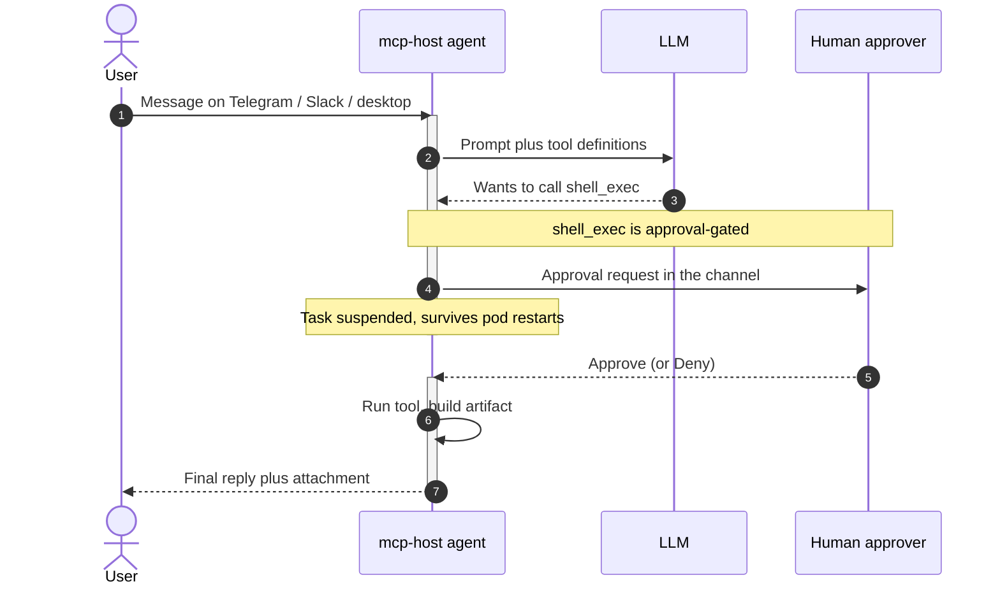

# See it work: a tool call, end to end

A user asks an agent to do something with a side effect. The agent picks a tool,
the platform pauses on the risky call for a human decision, then the artifact
comes back to the channel:



A tool call that needs approval suspends the task and tells the caller exactly
what is waiting:

```jsonc
// POST /v1/runtime/messages            → agent decides it needs a tool
{ "success": true, "status": "waiting_approval",
  "approval": { "taskId": "…", "requestId": "…", "userId": "…",
                "notification": "The agent wants to run shell_exec: …" } }

// POST /v1/runtime/approvals/approve   { "userId", "requestId" }
{ "success": true }

// GET /v1/runtime/tasks/{taskId}/result   → poll until done
{ "success": true, "status": "completed",
  "response": "…final answer…", "attachments": [ /* generated files */ ] }
```

The prompt surfaces wherever the user already is — inline Approve/Deny buttons on
Telegram (or `/approve <target>`), a Slack Approve button, or the desktop app's
in-chat gate; pending approvals survive pod restarts.

## Related

- [Security model](../../README.md#security-model) — the four enforcement layers
  behind the approval gate
- [Architecture overview](../architecture/overview.md) — ports, token flows, and
  the network model
- [Quickstart (API path)](../get-started/quickstart.md) — drive the real
  session → scoped-RPC → rpc-proxy JWT chain by hand
