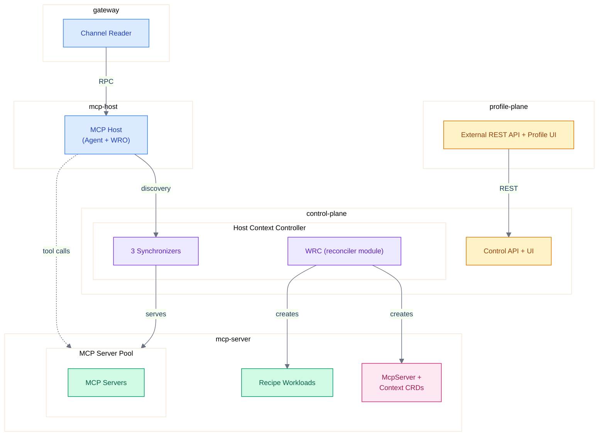
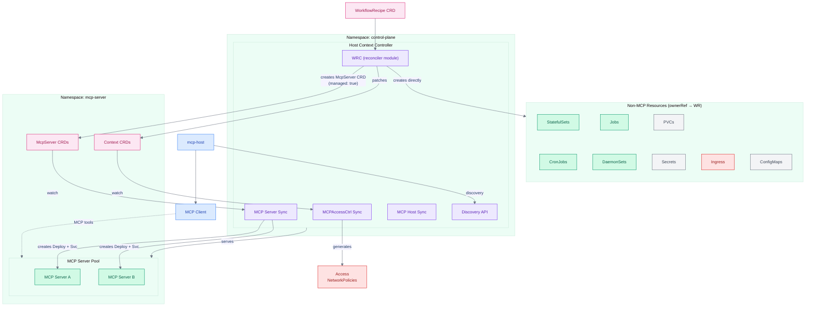
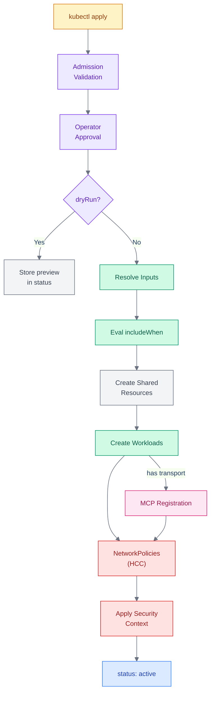
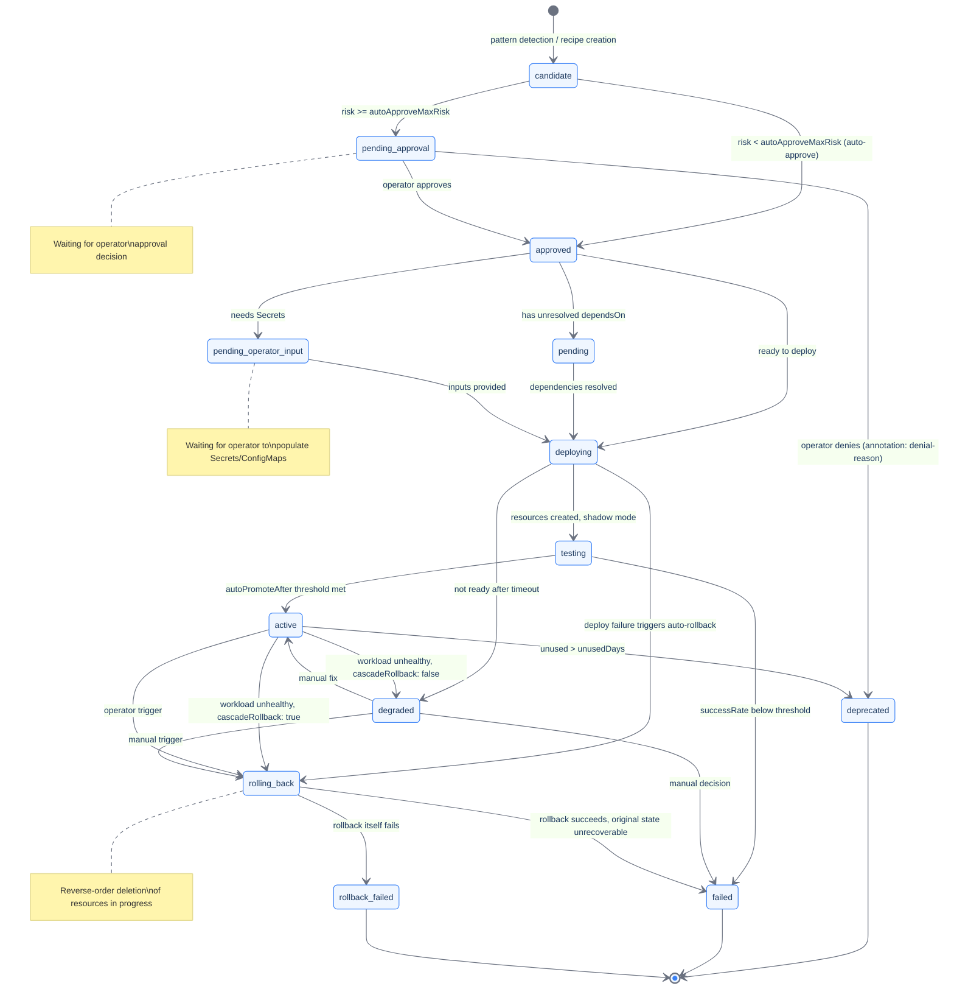

# WorkflowRecipe CRD Reference

**API version:** `clerum.io/v1alpha1`
**Kind:** `WorkflowRecipe`
**References:** [Platform Architecture](../architecture/platform-topology.md) | [Feature Hub](../features/workflow-recipes.md) | [Operations Guide](../deploy/workflow-recipes-guide.md) | [Architecture Overview](../architecture/overview.md)

---

## Table of Contents

1. [Overview](#1-overview)
2. [Core Concepts](#2-core-concepts)
3. [WorkflowRecipe CRD Schema](#3-workflowrecipe-crd-schema)
4. [Conditional Resource Inclusion](#4-conditional-resource-inclusion)
5. [Environment Variant Management](#5-environment-variant-management)
6. [Deployment Pipeline](#6-deployment-pipeline)
7. [Resource Generation](#7-resource-generation)
8. [Security Model](#8-security-model)
9. [Network Security and Bindings](#9-network-security-and-bindings)
10. [External Ingress](#10-external-ingress)
11. [CRD Validation Rules (CEL)](#11-crd-validation-rules-cel)
12. [Status Subresource and Observability](#12-status-subresource-and-observability)
13. [Dry-Run and Preview Mode](#13-dry-run-and-preview-mode)
14. [Agent-Driven Recipe Creation](#14-agent-driven-recipe-creation)
15. [Operator Approval and Governance](#15-operator-approval-and-governance)
16. [Template Injection Prevention](#16-template-injection-prevention)
17. [Failure Mode Analysis](#17-failure-mode-analysis)
18. [PVC Retention and Finalizers](#18-pvc-retention-and-finalizers)
19. [Rate Limiting](#19-rate-limiting)
20. [CRD Version Migration](#20-crd-version-migration)
21. [GitOps Integration](#21-gitops-integration)
22. [Examples](#22-examples)
23. [Caveats, Limitations and Trade-offs](#23-caveats-limitations-and-trade-offs)

---

## 1. Overview

Clerum Recipes is a Kubernetes-native, CRD-driven workload composition system that defines complete, self-contained applications as a single Custom Resource. It is the packaging, deployment, and lifecycle management layer of the Clerum platform.

### 1.1 The Problem

A single-image, single-Deployment model cannot express:

- A database plus the MCP server that uses it
- CronJobs running at different schedules with different images
- A migration Job that must complete before a Deployment starts
- Multi-container pods with sidecars
- StatefulSets with persistent storage
- Event pipelines with queues, workers, and gateways

Beyond composition, existing tools (Helm, Kustomize, Terraform, kro) lack:

- **Enforced security-by-default** at the schema level (opt-in is insufficient for production MCP infrastructure)
- **Automatic NetworkPolicy generation** from a declarative communication graph
- **Agent-driven recipe discovery, generation, and publication** from runtime telemetry
- **Operator approval for deployment** with risk classification (publication to registry is automatic)

### 1.2 The Solution

Four core abstractions compose any Clerum workload:

```
workloads[]   -- What runs (Deployments, StatefulSets, CronJobs, Jobs, DaemonSets)
resources[]   -- What is shared (PVCs, Secrets, ConfigMaps)
bindings[]    -- Who talks to whom (auto-generates NetworkPolicies)
profiles{}    -- How it varies across environments (staging, production)
```

### 1.3 Design Principles

1. **Security-by-default, enforced at every level** -- Every workload gets non-root, read-only root filesystem, resource limits, and deny-all networking. These are not optional. No isolation level permits privileged execution.
2. **Additive complexity** -- A single-workload recipe is minimal YAML. Multi-workload, multi-environment, and conditional inclusion are all opt-in.
3. **Minimal required fields** -- Each workload needs only `id`, `type`, and `image`. Everything else has sensible defaults.
4. **Kubernetes-native** -- No new abstractions over Kubernetes concepts. If you know Kubernetes, you know this format.
5. **Declarative dependencies** -- `bindings[]` generates NetworkPolicies. `dependsOn` controls deployment ordering.
6. **Resources are shared, workloads are isolated** -- Secrets and PVCs live in `resources[]`, referenced by workloads that need them.
7. **MCP registration is opt-in** -- Only workloads with a `transport` field are registered as MCP servers. Not every workload needs to be an MCP server.
8. **In-place mutable** -- Recipes can be updated in place (image tags, replicas, resource limits). PVCs are preserved across updates. The controller reconciles changes like any Kubernetes operator.
9. **Operator approval for deployment** -- No workload deploys without operator approval. Recipe publication to the Clerum Recipe Registry is automatic and unrestricted.
10. **Context-scoped visibility** -- Recipes are visible only within the context (Context CRD) that includes them in its `mcpServers[]` allowlist. This enables multi-tenant isolation through context boundaries.
11. **The CRD IS the package** -- No separate chart concept. A WorkflowRecipe CRD contains everything needed for deployment. Single file, pure YAML, no template DSL.

### 1.4 Platform Architecture Reference

WorkflowRecipes operate within the Clerum platform architecture. The Workload Recipe Controller (WRC) is a pure CRD reconciler module within the Host Context Controller (HCC) in the `control-plane` namespace. It runs in the same process as the HCC's 3 synchronizers (MCP Host, AccessCtrl, MCP Server) and does not expose an MCP interface:



| Node                        | Detail                                                                                  |
| --------------------------- | --------------------------------------------------------------------------------------- |
| **External REST API + UI**  | external-rest-api, profile-ui, WorkflowRecipePolicy CRDs                                |
| **Control API + UI**        | control-api, control-ui (platform management)                                           |
| **Channel Reader**          | Telegram, Email, Slack adapters                                                         |
| **MCP Host**                | Agent + MCP Client + WRO                                                                |
| **Host Context Controller** | 3 Synchronizers (MCP Host, AccessCtrl, MCP Server) + WRC module + Discovery API (:8081) |
| **WRC**                     | WorkflowRecipe reconciler module within HCC (pure CRD reconciler, no MCP interface)     |
| **MCP Servers**             | MongoDB, Airtable, etc.                                                                 |

> **Full architecture details**: See [Platform Architecture](../architecture/platform-topology.md) for the complete 7-namespace architecture, service map, data flow, and controller architecture. This is a reference diagram only — the architecture document is the source of truth.

### 1.5 Competitive Positioning

Clerum Recipes combines several capabilities that are individually available in the Kubernetes ecosystem but are not found together in a single CRD-as-Package tool:

| Capability                                           | Comparable Ecosystem Tools                                               | Clerum Approach                                                                                   |
| ---------------------------------------------------- | ------------------------------------------------------------------------ | ------------------------------------------------------------------------------------------------- |
| Security-by-default (enforced at CRD level)          | PSS Restricted profile (namespace-level), OPA/Gatekeeper (cluster-level) | Mandatory security context baked into CRD schema; cannot be bypassed by individual recipe authors |
| Auto-generated NetworkPolicies from bindings         | Calico, Cilium, Istio (CNI/service mesh level)                           | Generated from declarative `bindings[]` within the CRD; no separate CNI configuration needed      |
| Agent-driven recipe discovery and generation         | No comparable K8s tool (unvalidated concept)                             | WRO pattern detection from runtime telemetry; requires empirical validation                       |
| MCP server registration (transport field)            | N/A (Clerum-specific domain)                                             | Domain-specific integration                                                                       |
| Mandatory operator approval with risk classification | ArgoCD sync windows, Terraform plan + Sentinel (opt-in)                  | Enforced by default, not opt-in                                                                   |
| Single-file CRD-as-Package                           | kro ResourceGraphDefinition                                              | Pure YAML, no DSL                                                                                 |

A 15-dimension comparison against 8 tools (Helm, Kustomize, ArgoCD, Crossplane, KubeVela, etc.) was previously drafted but has not yet been migrated into the new docs tree (TBD). Note that Clerum Recipes is a draft specification with no production validation, while the compared tools have years of operational history.

---

## 2. Core Concepts

### 2.1 Recipe

A `WorkflowRecipe` CRD that defines a complete, self-contained application composed of one or more workloads. Recipes can declare dependencies on other recipes via `spec.dependsOn` for deployment ordering (Section 6.3).

### 2.2 Workload

A single Kubernetes workload resource. Each workload maps 1:1 to a Kubernetes resource:

| `type`        | Kubernetes Resource | Use Case                                           |
| ------------- | ------------------- | -------------------------------------------------- |
| `deployment`  | Deployment          | Long-running services, MCP servers, APIs           |
| `statefulset` | StatefulSet         | Databases, caches, queues with persistent identity |
| `cronjob`     | CronJob             | Scheduled tasks, ETL, backups                      |
| `job`         | Job                 | One-time tasks, migrations, data imports           |
| `daemonset`   | DaemonSet           | Per-node agents, log collectors, monitors          |

### 2.3 Resource

A shared Kubernetes resource referenced by one or more workloads:

| `type`      | Kubernetes Resource   | Purpose                        |
| ----------- | --------------------- | ------------------------------ |
| `pvc`       | PersistentVolumeClaim | Persistent storage             |
| `secret`    | Secret                | Credentials, tokens, passwords |
| `configmap` | ConfigMap             | Configuration files, scripts   |

### 2.4 Binding

A declared communication path between two workloads, or from a workload to an external endpoint. Each binding generates a NetworkPolicy rule allowing traffic from `from` to `to` on the specified port.

### 2.5 Profile

A named set of input overrides for environment-specific parameterization (staging, production, etc.). Profiles eliminate the need to duplicate entire recipes per environment.

### 2.6 MCP Registration

Workloads with a `transport` field are automatically registered as MCP servers. The HCC controller architecture splits responsibilities through CRD-mediated coordination between its internal modules:

1. **WRC module** (within HCC) watches WorkflowRecipe CRDs and reconciles them:
   - Non-MCP workloads (StatefulSets, CronJobs, Jobs, PVCs, Secrets, ConfigMaps) → created directly with `ownerRef → WorkflowRecipe`
   - MCP workloads (those with `transport` field) → creates McpServer CRDs (`managed: true`) with `ownerRef → WorkflowRecipe`
2. **MCP Server Sync** (within HCC) watches McpServer CRDs and creates Deployment + Service for each `managed: true` McpServer
3. **Discovery**: mcp-host discovers ALL MCP servers (standalone, recipe-based, and infrastructure) through HCC's Discovery API

See [Architecture Reference §13](../architecture/platform-topology.md#13-deployment-responsibility-matrix) for the complete deployment responsibility matrix.

### 2.7 Architecture: Controller Model with CRD-Mediated Coordination

A WorkflowRecipe functions as a **CRD-as-Package** orchestrated by the **WRC module** within the Host Context Controller (HCC) in the `control-plane` namespace. The WRC delegates MCP server lifecycle to the HCC's MCP Server Sync via McpServer CRDs:



**Diagram Legend:**

| Color             | Meaning                                       | Examples                                                                      |
| ----------------- | --------------------------------------------- | ----------------------------------------------------------------------------- |
| Blue (service)    | Core platform services                        | mcp-host, MCP Client                                                          |
| Purple (operator) | Controller components                         | WRC module, MCP Server Sync, MCPAccessCtrl Sync, MCP Host Sync, Discovery API |
| Green (workload)  | Deployed workloads and non-MCP workload kinds | MCP Server A/B, StatefulSets, CronJobs                                        |
| Pink (crd)        | CRDs                                          | WorkflowRecipe CRD, McpServer CRDs, Context CRDs                              |
| Red (security)    | Security resources                            | NetworkPolicies, Ingress                                                      |
| Gray (storage)    | Supporting resources                          | PVCs, Secrets, ConfigMaps                                                     |

| Node                        | Detail                                                                                               |
| --------------------------- | ---------------------------------------------------------------------------------------------------- |
| **WRC (reconciler module)** | WorkflowRecipe Reconciler module within HCC                                                          |
| **MCP Server Sync**         | McpServer Reconciler — watches McpServer CRDs, creates Deployments + Services                        |
| **MCPAccessCtrl Sync**      | Context Reconciler — manages access NetworkPolicies                                                  |
| **MCP Host Sync**           | Host CRD lifecycle management                                                                        |
| **Discovery API**           | REST endpoint: `GET /api/v1/mcpservers/context/{ref}`                                                |
| **MCP Server Pool**         | All MCP servers: recipe-created and standalone (`managed: true`) + infrastructure (`managed: false`) |
| **McpServer CRDs**          | Created by WRC module for MCP workloads (`managed: true`, `ownerRef → WorkflowRecipe`)               |
| **MCP Server A/B**          | Standalone or recipe-created MCP servers (MongoDB, Airtable, etc.)                                   |

> **WRC as pure CRD reconciler**: The WRC does not expose an MCP interface. Recipes are deployed by creating WorkflowRecipe CRDs via control-api or `kubectl apply`. The WRC watches these CRDs and reconciles them — it produces declarative intent (McpServer CRDs, workloads, Context patches), and the HCC's other synchronizers materialize them into runtime state.

**Controller resource ownership:**

| Resource Type                                            | Created By               | Managed By               |
| -------------------------------------------------------- | ------------------------ | ------------------------ |
| StatefulSets, CronJobs, Jobs, DaemonSets                 | HCC (WRC module)         | HCC (WRC module)         |
| Non-MCP Deployments + Services                           | HCC (WRC module)         | HCC (WRC module)         |
| PVCs, Secrets, ConfigMaps                                | HCC (WRC module)         | HCC (WRC module)         |
| Ingress resources                                        | HCC (WRC module)         | HCC (WRC module)         |
| McpServer CRD (`managed: true`, MCP-enabled workloads)   | HCC (WRC module)         | HCC (MCP Server Sync)    |
| MCP server Deployment + Service                          | HCC (MCP Server Sync)    | HCC (MCP Server Sync)    |
| ALL NetworkPolicies (deny-all, bindings, context access) | HCC (MCPAccessCtrl Sync) | HCC (MCPAccessCtrl Sync) |

> **NetworkPolicy ownership**: The HCC's MCPAccessCtrl Sync is the SOLE owner of all NetworkPolicies across all runtime namespaces. The WRC module creates ZERO NetworkPolicies. When the WRC reconciles a WorkflowRecipe, it patches the Context CRD with binding information; the MCPAccessCtrl Sync then generates and manages all NetworkPolicies (deny-all defaults, inter-workload binding rules, and cross-namespace access rules). This single-owner model eliminates NetworkPolicy conflicts and TOCTOU race conditions.
>
> **TOCTOU requirement**: NetworkPolicies MUST exist before workload pods are scheduled. The MCPAccessCtrl Sync creates NetworkPolicies synchronously during Context CRD reconciliation, before the WRC module creates workload resources.

**Key architectural decisions:**

1. **Controller architecture**: The WRC is a reconciler module within the HCC in the `control-plane` namespace. The HCC runs 3 synchronizers (MCP Host, AccessCtrl, MCP Server) plus the WRC module in a single process. All modules interact through CRDs via the Kubernetes API.
2. **WRC has no MCP interface**: The WRC is a pure CRD reconciler. Recipes are deployed by creating WorkflowRecipe CRDs — no agent-triggered deployments. This reduces attack surface and enforces human-in-the-loop for high-impact operations.
3. **CRD-mediated coordination**: The WRC module creates McpServer CRDs (`managed: true`, the default) and patches Context CRDs. The HCC's MCP Server Sync and MCPAccessCtrl Sync watch these CRDs and create the corresponding infrastructure.
4. **Transport triggers delegation**: Workloads with a `transport` field cause the WRC module to create an McpServer CRD (`managed: true`, the default, handled by MCP Server Sync for Deployment + Service) and patch the Context CRD (handled by MCPAccessCtrl Sync for NetworkPolicies). Workloads without `transport` are created directly by the WRC module.
5. **MCP Server Sync treats all McpServer CRDs uniformly**: No conditional logic based on `ownerReference`. Whether a McpServer CRD was created manually or by the WRC module, MCP Server Sync always creates Deployment + Service. The ownerRef serves only for Kubernetes garbage collection cascade.
6. **Dependency ordering**: The WRC module handles topological sort and creates resources in order.
7. **Status tracking**: The WRC module updates WorkflowRecipe status with per-workload phases.
8. **Rollback coordination**: The WRC module deletes McpServer CRDs (triggering MCP Server Sync cleanup via DELETE watch events) and patches Context CRD (removing from allowlist). Non-MCP resources are deleted directly.

---

## 3. WorkflowRecipe CRD Schema

### 3.1 Top-Level Structure

```yaml
apiVersion: clerum.io/v1alpha1
kind: WorkflowRecipe
metadata:
  name: <recipe-name>
  namespace: mcp-server
  labels:
    clerum.io/recipe-version: '<semver>'
spec:
  description: '<what this recipe does>'
  contextRef: '<context-name>' # Required when any workload has transport; references a Context CRD

  # --- Parameterization (Section 3.8) ---
  inputContract: { ... } # JSON Schema defining required inputs
  inputs: { ... } # Concrete input values (validated against inputContract)

  # --- Environment Variants (Section 5) ---
  profiles: { ... } # Named input override sets (staging, production)
  activeProfile: '<profile-name>' # Which profile to activate

  # --- Computed Values (Section 5.5) ---
  computedValues: # Optional. CEL expressions for derived values
    - name: memoryLimit
      expression: 'inputs.memoryRequest * 2'
    - name: replicaCount
      expression: 'inputs.baseReplicas + inputs.extraReplicas'

  # --- WRO Detection Fields (populated by WRO pipeline, do NOT set manually) ---
  # See WRO-SPECIFICATION.md for the detection algorithm.
  recipeId: '' # Optional. Auto-generated sha256 of canonical sequence when detected by WRO.
  version: '' # Optional. Semantic version (e.g., "1.0.0").
  signatures: # Optional. Populated by WRO pattern detection.
    - patternId: '' # Unique pattern identifier
      canonicalSequence: [...] # Ordered tool-call sequence
      metrics: # Detection metrics
        support: 0
        agents: 0
        avgTokens: 0
  serverization: # Optional. Deployment configuration for serverization.
    image: '' # Container image for the serverized recipe
    mcpServerName: '' # MCP server name for registration
    namespace: mcp-server # Target namespace (default: mcp-server)
    resources: {} # Resource requests/limits

  # --- WRO Marketplace Fields (optional) ---
  capabilities: { ... } # Capability declarations (optional)
  requirements: { ... } # Requirement declarations (optional)

  # --- Inter-Recipe Dependencies (Section 6.3) ---
  dependsOn: # Recipes that must be 'active' before this recipe deploys
    - name: <recipe-name> # Required. Name of the dependent WorkflowRecipe
      namespace: mcp-server # Optional. Defaults to same namespace
      cascadeRollback: false # Optional. Auto-rollback when dependency fails (default: false)
      maxWaitMinutes: 30 # Optional. Max time to wait for dependency to reach 'active' (default: 30)

  # --- Core Composition ---
  workloads: [...] # Required. Array of workload definitions
  resources: [...] # Array of shared resource definitions (optional)
  bindings: [...] # Array of inter-workload communication declarations (optional)

  # --- Recipe-Wide Settings ---
  security:
    isolationLevel: standard # minimal | standard | strict
  dryRun: false # Preview mode (Section 13)
```

### 3.1.1 Workflow Steps

`spec.steps[]` supports two executable step kinds:

| Shape              | Runtime                  | Required field          | Notes                                                                                            |
| ------------------ | ------------------------ | ----------------------- | ------------------------------------------------------------------------------------------------ |
| Agentic            | `mcp-host` broker        | `instruction`           | Uses `spec.agent` or a full `step.agent` override.                                               |
| Snippet            | snippet runner           | `run.type: snippet`     | Executes platform-managed TypeScript code without a custom image.                                |
| Custom coordinator | custom coordinator image | `spec.coordinatorImage` | Runs an operator-allowed SDK image. This is the custom-image tier for user-owned business logic. |

Without `spec.coordinatorImage`, each step must set exactly one of `instruction` or `run`. With `spec.coordinatorImage`, id-only steps are allowed. `run + instruction` and `run + agent` are always rejected. Snippet steps require `run.type: snippet`, `run.language: typescript`, and inline `run.code`.

```yaml
steps:
  - id: merge
    run:
      type: snippet
      language: typescript
      code: |
        return { a: 1, b: 2 }
  - id: analyze
    dependsOn: [merge]
    instruction: 'Analyze {{merge:output}}.'
```

Pure snippet workflows do not create a per-recipe `mcp-host` pod. Hybrid workflows create one only for agentic or broker-backed steps. Runtime gateway credentials remain scoped to the `mcp-host` broker; the coordinator uses WRC status/signal credentials and its internal coordinator-to-broker token.

Custom coordinator workflows declare the image at workflow level:

```yaml
spec:
  coordinatorImage: ghcr.io/acme/reconciliation-coordinator:1.2.3@sha256:aaaaaaaaaaaaaaaaaaaaaaaaaaaaaaaaaaaaaaaaaaaaaaaaaaaaaaaaaaaaaaaa
  steps:
    - id: prepare
    - id: transform
      dependsOn: [prepare]
    - id: emit
      dependsOn: [transform]
  output:
    destination: pvc
    storageSize: 1Gi
```

The WRC only runs custom coordinator images when `WRC_ENABLE_CUSTOM_COORDINATOR_IMAGE=true` and the image reference passes the configured allowlist/digest policy. The custom coordinator receives the mounted workflow spec at `/etc/workflow/config.json`, a reduced WRC token for status/signal/health access, and optional `mcp-host` endpoint/token only when a step actually requires the broker.

Custom images must satisfy the same pod contract as the platform coordinator: run without root as UID/GID `1000`, expose SDK health on port `8090`, write temporary data only under `/tmp`, and write declared artifacts only under `/output`. The WRC derives the pod `activeDeadlineSeconds` from declared step `timeoutSeconds` plus a buffer, capped below the one-hour coordinator-token TTL to preserve final status/artifact reporting margin.

When a custom coordinator writes `/output` artifacts, WRC serves them through the platform-owned artifact path for the exact child run. Workflows without a child `mcp-host` get a WRC-managed artifact reader; broker-backed workflows can still use `mcp-host` for agent/tool execution while `/output` artifact download remains run-scoped and bound to `status.artifacts[]`.

For any WorkflowRecipe runtime, WRC uses one output PVC per parent recipe
unless `output.claimName` is set. Runtime pods still see `/output`, and WRC
keeps run isolation with subdirectories under `workflow-output/<parent>` and
`workflow-output/<parent>/<runId>` for triggered child runs. If
`output.claimName` is omitted, WRC creates a parent-scoped PVC sized by
`output.storageSize` (default `256Mi`) and deletes that PVC when the parent
WorkflowRecipe is deleted. If `output.claimName` is set, it must name an
existing PVC in `sandbox-recipes` that is explicitly labeled for this workflow
output scope:

```yaml
metadata:
  labels:
    clerum.io/workflow-output-external: 'true'
    clerum.io/workflow-output-claim: <claimName>
    clerum.io/workflow-output-scope: <parentRecipeName>
```

Use the same RFC1123 hash/truncation value that WRC uses for generated
workflow output labels when the claim or recipe name is long.
WRC mounts that external claim but does not create, resize, or delete it.
PVCs labeled `clerum.io/managed-by: wrc` are reserved for WRC-managed lifecycle
and cannot be selected through `output.claimName`; omit `claimName` to use that
managed path.
WRC-managed output PVCs get a run-scoped one-shot
`workflow-output-prepare` pod before runtime startup; the prepare pod validates
the subPath, creates only that directory chain, and makes it writable by the
non-root workflow UID/GID `1000`. Operator-provided `output.claimName` PVCs do
not get ownership mutation, so operators must pre-provision permissions for
UID/GID `1000`. PVCs declared under `workloads[].volumes` remain
workload/service storage and are not treated as workflow output storage.

Upgrade note: recipes that previously relied on the cluster-wide
`clerum-workflow-output` PVC must explicitly set
`output.claimName: clerum-workflow-output` and label that PVC for one exact
workflow output scope to keep serving historical bytes from that claim. For
multiple recipes, migrate bytes to separate per-recipe external claims or to
the new WRC-managed claims. Otherwise WRC uses the per-recipe PVC and missing
historical bytes surface as `artifact_gone`.

`status.steps[].output` is only a bounded preview. WRC records
`outputTruncated`, `outputLength`, and `outputPreviewMaxChars` when output is
reported, and Control UI points users to `status.artifacts[]` for complete
files. Prompt interpolation such as `{{merge:output}}` receives the same kind
of bounded preview; full reports must move through `/output` artifacts instead.

### 3.2 Workload Schema

Each entry in `workloads[]`:

```yaml
workloads:
  - id: <unique-name> # Required. Unique within this recipe.
    type: <workload-type> # Required. deployment|statefulset|cronjob|job|daemonset
    image: <container-image> # Required. Docker image reference.
    imagePullSecrets: # Optional. List of Secret names for private registries.
      - <secret-name> # Secrets must exist in the workload's namespace.

    # --- Standard Kubernetes workload fields ---
    # replicas, port, command, args, env, resources, volumeMounts, serviceAccount,
    # and type-specific fields (schedule, backoffLimit, parallelism, etc.) are
    # supported as-is. See https://kubernetes.io/docs/concepts/workloads/
    # Only Clerum-specific extensions are documented below.
    #
    # Required: resources.limits.cpu and resources.limits.memory (enforced by security policy).
    # env supports Clerum-specific sources (Section 3.4).
    # envSecret provides batch secret mapping (Section 3.4.1).
    # volumeMounts supports resourceRef (Section 3.5).

    # --- Conditional Inclusion (Section 4) ---
    includeWhen: '{{inputs.<key>}}' # Optional. Include only when boolean input is true.

    # --- Deployment ordering ---
    dependsOn: [...] # List of workload IDs that must be ready/completed first.

    # --- MCP Server registration (optional, deployment/statefulset only) ---
    transport:
      streamableHttp # If set, this workload is registered as an MCP server.
      # Values: streamableHttp | sse | stdio
      # stdio: WRC sets managed:true on McpServer CRD;
      #   HCC injects stdio-bridge sidecar (HTTP-to-stdio proxy)

    # --- Health check (Clerum abstraction over K8s probes) ---
    healthCheck:
      type: http # http | tcp | exec (default: http if path set, tcp if only port)
      path: /health # HTTP GET path (liveness + readiness). Only for type: http.
      port: 3000 # Port for health check (http and tcp).
      command: [...] # Command for exec probe. Only for type: exec.
      initialDelaySeconds: 30 # Seconds before first probe (default: K8s default 0).
      periodSeconds: 10 # Probe interval in seconds (default: K8s default 10).
      timeoutSeconds: 5 # Max seconds per probe attempt (default: K8s default 1).
      failureThreshold: 3 # Consecutive failures before marking unhealthy (default: K8s default 3).

    # --- External Ingress (optional, deployment/statefulset only) (Section 10) ---
    ingress:
      host: api.example.com # Required. Hostname for the Ingress resource.
      path: / # URL path (default: /).
      pathType: Prefix # Prefix | Exact | ImplementationSpecific (default: Prefix).
      tls: true # Auto-create cert-manager Certificate (default: false).
      ingressClassName: nginx # Ingress class (default: from cluster default).
      annotations: { ... } # Additional Ingress annotations.

    # --- Multi-container (optional) ---
    sidecars:
      - name: <sidecar-name>
        image: <sidecar-image>
        port: <port>
        env: [...]
        resources: { ... }
    initContainers:
      - name: <init-name>
        image: <init-image>
        command: [...]
        env: [...]

    # --- CronJob-specific (type: cronjob) ---
    schedule: '0 * * * *' # Required for cronjob. Cron expression.
    timeZone: 'America/New_York' # Optional. IANA timezone (K8s 1.27+). Default: cluster UTC.
    # Standard CronJob fields (concurrencyPolicy, restartPolicy, activeDeadlineSeconds,
    # startingDeadlineSeconds, successfulJobsHistoryLimit, failedJobsHistoryLimit) supported as-is.

    # --- Job-specific (type: job) ---
    # Standard Job fields (restartPolicy, backoffLimit, activeDeadlineSeconds,
    # parallelism, completions) supported as-is.

    # --- DaemonSet-specific (type: daemonset) ---
    # Requires explicit operator annotation (OPA policy: clerum.io/daemonset-approved).

    # --- StatefulSet-specific (type: stateset) ---
    # A headless Service (clusterIP: None) is auto-created for stable pod DNS.
    # Pod DNS: <recipe>-<workload-id>-N.<recipe>-<workload-id>.<namespace>.svc.cluster.local
    volumeClaimTemplates: # Per-replica PVCs (StatefulSet only).
      - name: data
        storageClass: do-block-storage
        accessMode: ReadWriteOnce
        size: 10Gi
    # PVCs created from volumeClaimTemplates include WorkflowRecipe labels for queryability:
    # - clerum.io/workload: <workload-id>
    # - clerum.io/recipe: <recipe-name>
    # - clerum.io/context: <contextRef>
    # - clerum.io/managed-by: workflow-recipes
    # PVCs do NOT have ownerReferences (data retention on recipe deletion)

    # --- Autoscaling (optional, deployment/statefulset only) ---
    autoscaling:
      minReplicas: 2
      maxReplicas: 20
      targetCPUUtilizationPercentage: 70
```

### 3.3 Resource Schema

Each entry in `resources[]`. Standard Kubernetes resource fields (`storageClass`, `accessMode`, `size`, `data`, `stringData`) are supported as-is. See [Kubernetes documentation](https://kubernetes.io/docs/concepts/storage/persistent-volumes/). Only Clerum-specific extensions are documented below.

```yaml
resources:
  # --- PersistentVolumeClaim ---
  - id: <unique-name> # Required. Unique within this recipe.
    type: pvc
    storageClass: <storage-class> # Required. e.g., "do-block-storage"
    size: 10Gi # Required. Storage size.
    includeWhen: '{{inputs.<key>}}' # Optional. Conditional inclusion (Section 4).

  # --- Secret ---
  # WARNING: Values in `data` are stored in plaintext in the WorkflowRecipe CRD.
  # For sensitive values, use `generateKeys` or reference pre-existing K8s Secrets via `secretKeyRef`.
  - id: <unique-name>
    type: secret
    data: { KEY_NAME: 'value' } # Static key-value pairs (optional, non-sensitive only).
    generateKeys: # Clerum-specific: auto-generated keys.
      - key: PASSWORD
        length: 32 # Generates a cryptographically random alphanumeric string.
      - key: EXTERNAL_API_TOKEN
        length:
          0 # 0 = operator-supplied. Recipe enters `pending-operator-input`.
          # Operator populates via `kubectl edit secret <recipe>-<resource-id>`.
          # Controller polls every 30s. Timeout: 24h -> `failed`.

  # --- ConfigMap ---
  - id: <unique-name>
    type: configmap
    data: { config.yaml: 'setting: value' }
```

### 3.4 Environment Variables

Environment variables support literal Kubernetes `EnvVar.value` strings plus
the `envSecret` batch mapping in Section 3.4.1. `env[].value` is optional and
follows Kubernetes semantics: if omitted, Kubernetes treats it as `""`.

```yaml
env:
  # Literal value
  - name: LOG_LEVEL
    value: 'info'

  # Template in a Kubernetes-shaped string
  - name: DATABASE_URL
    value: 'postgresql://{{postgres:host}}:{{postgres:port}}/{{inputs.db_name}}'
```

**Template syntax** (resolved at resource creation time by the WorkflowRecipe Reconciler):

- `{{resource-id:KEY}}` -- Resolves to the value of `KEY` from the named resource.
- `{{workload-id:host}}` -- Resolves to the internal Service DNS name WRC/HCC materializes for the workload.
- `{{workload-id:port}}` -- Resolves to the workload's primary port.
- `{{inputs.<key>}}` -- Resolves to the value of the named input parameter.
- `{{computed.<key>}}` -- Resolves to a computed value evaluated by WRC.

`{{workload-id:host}}` and `{{workload-id:port}}` require the referenced
workload to declare `port`; WRC only materializes a Service DNS name for
port-backed workloads.

For issue #231, WRC resolves Clerum template syntax in these workload fields:

- `env[].value`
- `command[]`
- `args[]`

`env[].valueFrom.template` is not implemented by this contract. Secrets should
continue to use `envSecret` or snippet `secretRef`; do not place sensitive
values directly in `env[].value`.

Kubernetes native env var substitution `$(ENV_VAR_NAME)` still happens later
inside the container and is separate from Clerum's `{{...}}` resolution.

### 3.4.1 Secret-Backed Environment Variables (envSecret)

**Workload-level field for batch secret mapping.**

The `envSecret` field provides a concise syntax for mapping multiple keys from a single Kubernetes Secret to environment variables. This is particularly useful for MCP servers that require multiple credentials from the same secret (e.g., database connection strings, API keys, configuration tokens).

```yaml
envSecret:
  name: <k8s-secret-name> # Required. Name of an existing K8s Secret
  keys:
    - secretKey: <key-in-secret> # Required. Key within the Secret
      envVar: <ENV_VAR_NAME> # Required. Environment variable name to create
    - secretKey: <another-key>
      envVar: <ANOTHER_ENV_VAR>
```

**Example: MongoDB MCP Server with credentials**

```yaml
workloads:
  - id: mongodb-mcp
    type: statefulset
    image: your-registry.example.com/evenfire/mongodb-mcp-server:latest
    envSecret:
      name: mcp-mongodb-credentials # K8s Secret with connection data
      keys:
        - secretKey: connection-string # Key in Secret
          envVar: MONGODB_CONNECTION_URL # Env var in container
        - secretKey: database-name
          envVar: MONGODB_DATABASE
        - secretKey: username
          envVar: MONGODB_USER
```

**Generated Kubernetes pod spec equivalent:**

```yaml
spec:
  containers:
    - name: mongodb-mcp
      env:
        - name: MONGODB_CONNECTION_URL
          valueFrom:
            secretKeyRef:
              name: mcp-mongodb-credentials
              key: connection-string
        - name: MONGODB_DATABASE
          valueFrom:
            secretKeyRef:
              name: mcp-mongodb-credentials
              key: database-name
        - name: MONGODB_USER
          valueFrom:
            secretKeyRef:
              name: mcp-mongodb-credentials
              key: username
```

**Relationship to `env[]` field:**

| Aspect          | `env[]`                      | `envSecret`                   |
| --------------- | ---------------------------- | ----------------------------- |
| **Use case**    | Mixed sources, single values | Multiple keys from one Secret |
| **Syntax**      | Verbose per-entry            | Concise batch mapping         |
| **Flexibility** | High (4 different sources)   | Focused on K8s Secrets only   |
| **Combination** | ✅ Can use both              | ✅ Can use both               |

When both `env` and `envSecret` are specified, the reconciler merges them. Duplicate `envVar` names are resolved with `envSecret` taking precedence (Kubernetes last-writer-wins semantics apply during env var injection).

**Secret lifecycle:**

- The Secret referenced by `envSecret.name` must exist in the same namespace as the WorkflowRecipe.
- The reconciler does NOT create the Secret — it is assumed to be pre-provisioned by the operator or external secret management system.
- If the Secret does not exist, the workload will be created but pod startup will fail with `ContainerCreating` state and error `Unexpected adversarial event: InvalidVariableName`. This is intentional Kubernetes behavior.

**Security considerations:**

- `envSecret` is the **recommended** method for MCP server credentials because it never stores secret values in the WorkflowRecipe CRD.
- The `env[].value` field should ONLY be used for non-sensitive configuration (log levels, feature flags, etc.).
- For operator-supplied secrets, use `resources[].generateKeys` with `length: 0` (see §3.3).

`envSecret` values are not template-rendered. They remain Kubernetes
`secretKeyRef` entries in the generated pod spec.

**Cross-recipe ownership boundary (Issue #637):**

Recipe Secrets live in a shared, co-tenant namespace (`sandbox-recipes`), and a
Kubernetes `secretKeyRef` is namespace-local, so any recipe could _name_ any
other recipe's Secret. To prevent a third-party recipe from referencing another
recipe's Secret by name to exfiltrate credentials, every recipe Secret carries
exactly ONE ownership label, stamped by the operator when the Secret is loaded
(via Control UI / `POST /admin/recipe-secrets`):

- `clerum.io/owner-recipe=<recipe-name>` — only that recipe may project it.
- `clerum.io/shared=true` — any recipe may project it.

A recipe may project a Secret (through `envSecret` **or** `imagePullSecrets`)
only when it is shared or owned by that recipe. When a workload references a
Secret owned by a _different_ recipe (or an unlabeled / conflicting-label Secret,
which is deny-by-default), the reconciler **fails closed**: it does NOT render
the offending workload, tears down any prior instance, and marks the recipe
`NotReady` with an `EnvSecretOwnershipDenied` condition naming the Secret and the
label to add. The credential is never injected into the workload's runtime.

Enforcement points: the WRC reconciler is authoritative (it sees every reconcile
and re-evaluates on Secret label/delete changes); Control API additionally
rejects an _exists-but-foreign_ reference at recipe create/update and at registry
install/upgrade (`422 workflowWorkloadSecretOwnershipDenied`) for early, clear
feedback. An unlabeled Secret passes Control API (it may be labeled before the
recipe runs) but still fails closed at the reconciler until labeled.

### 3.5 Volume Mounts

```yaml
volumeMounts:
  # From a shared resource (PVC, ConfigMap, Secret)
  - resourceRef: <resource-id>
    mountPath: /data
    readOnly: false # Default: false

  # From a host path (DaemonSet only, requires operator annotation clerum.io/hostpath-approved)
  - hostPath: /proc
    mountPath: /host/proc
    readOnly: true

  # EmptyDir (ephemeral, pod-scoped)
  - emptyDir: true
    mountPath: /tmp
    sizeLimit: 1Gi # Optional. Max size.
```

### 3.6 Bindings

```yaml
bindings:
  # --- Inter-workload binding ---
  - from: <workload-id> # Source workload
    to: <workload-id> # Destination workload
    protocol: tcp # tcp | udp (default: tcp)
    port: 5432 # Destination port

  # --- External egress binding (by DNS hostname — preferred) ---
  - from: <workload-id> # Source workload (including MCP workloads with transport)
    to: external # Reserved keyword for external endpoints
    dns: 'api.airtable.com' # Exact DNS hostname (resolved to CIDR at reconcile time)
    port: 443 # Destination port
    protocol: tcp # tcp | udp (default: tcp)

  # --- External egress binding (by specific CIDR) ---
  - from: <workload-id> # Source workload
    to: external # Reserved keyword for external endpoints
    cidr: '104.18.0.0/16' # Specific CIDR block (NOT 0.0.0.0/0)
    port: 443 # Destination port
    protocol: tcp # tcp | udp (default: tcp)
```

**External binding fields** (mutually exclusive — specify `dns` OR `cidr`, not both):

| Field  | Type   | Required            | Description                                                                                                                                              |
| ------ | ------ | ------------------- | -------------------------------------------------------------------------------------------------------------------------------------------------------- |
| `dns`  | string | One of `dns`/`cidr` | Exact DNS hostname. Resolved to IP addresses at reconcile time by the HCC. Re-resolved periodically (default: 300s). **Preferred** for external APIs.    |
| `cidr` | string | One of `dns`/`cidr` | Specific CIDR block. **Must be a targeted range** — open ranges (`0.0.0.0/0`, `::/0`) are rejected by CEL validation. Use for endpoints with stable IPs. |

**Constraint: No open CIDR ranges.** The `cidr` field rejects `0.0.0.0/0` and `::/0` to force recipe authors to declare specific destinations. This prevents accidental unrestricted egress. For external APIs, prefer `dns` which is more readable and maintains the principle of least privilege.

Each **inter-workload** binding generates a NetworkPolicy rule:

- **Ingress** on `to` workload: allow from `from` workload pods on `port`
- **Egress** on `from` workload: allow to `to` workload pods on `port`

Each **external** binding generates an egress NetworkPolicy rule on the `from` workload allowing traffic to the resolved IP(s) on the specified port. For `dns`-based bindings, the HCC resolves the hostname and generates CIDR-based NetworkPolicy rules; the resolved IPs are stored in the McpServer CRD status for auditability. `egressClass: public-web` is allowed only when the workflow explicitly requests public web access; it permits public TCP 80/443 while keeping private, metadata, cluster-internal, link-local, multicast, and reserved ranges blocked.

**MCP workloads and external egress**: Workloads with `transport` field can declare `to: external` bindings. The WRC propagates these bindings to the McpServer CRD as `spec.egressBindings[]`. The HCC reads these bindings and generates egress NetworkPolicy rules in the `mcp-server` namespace alongside the L2 context-allow rules. This closes the egress gap for MCP servers that depend on external APIs (e.g., Airtable, GitHub, Slack). Without an explicit `to: external` binding, MCP server pods can only reach DNS (L1) and internal services (L2/L3) — all other egress is denied by L0.

Registry-installed recipes and MCP servers follow the same contract. Registry
metadata with exact `domains`/`ports` installs exact-host egress. Temporary
registry metadata `wideCidr:true` installs explicit `egressClass: public-web`;
the value must not be interpreted as raw unrestricted cluster egress.

Workloads with `transport` field also automatically get an additional ingress rule allowing traffic from the `mcp-host` namespace on their primary port. For recipe-based MCP workloads, this is handled by the HCC's MCPAccessCtrl Sync when the WRC module patches the Context CRD (see Section 6.1). For standalone MCP servers (no recipe), the HCC's MCP Server Sync and MCPAccessCtrl Sync handle this directly.

**Risk classification**: External bindings with `dns` or restricted `cidr` trigger MEDIUM risk classification. Recipes with external bindings require operator approval when `autoApproveMaxRisk` is `none` or `low`. The approval notification includes the DNS hostname or CIDR, port, and protocol for each external binding, allowing the operator to verify that the requested egress is legitimate.

**Note on ephemeral workloads**: Bindings involving CronJob or Job workloads only apply while those pods exist. The NetworkPolicy is always present but only matches running pods.

### 3.7 Security Configuration

```yaml
security:
  isolationLevel: standard # minimal | standard | strict
```

See Section 8 for full security model details.

### 3.8 Input Parameterization

Recipes can declare an `inputContract` (JSON Schema) and accept `inputs` values that are interpolated into the recipe using `{{inputs.<key>}}` syntax. This enables recipe reuse across environments without duplicating YAML.

```yaml
spec:
  inputContract:
    type: object
    required: [imageTag, replicas]
    properties:
      imageTag:
        type: string
        description: 'Docker image tag for the MCP server'
        default: 'latest'
      replicas:
        type: integer
        minimum: 1
        maximum: 10
        default: 2
      cacheEnabled:
        type: boolean
        default: false
        description: 'Deploy Redis cache alongside the MCP server'
      dbStorageSize:
        type: string
        default: '10Gi'

  inputs:
    imageTag: '2.1.0'
    replicas: 3
    cacheEnabled: true
    dbStorageSize: '50Gi'

  workloads:
    - id: mcp-server
      type: deployment
      image: 'your-registry.example.com/evenfire/mcp-knowledge:{{inputs.imageTag}}'
      replicas: '{{inputs.replicas}}'

  resources:
    - id: pg-data
      type: pvc
      size: '{{inputs.dbStorageSize}}'
```

**Resolution rules**:

Resolution happens in two phases:

1. **Admission time** (CEL rules): Validates structural constraints — `inputContract` schema compliance, `includeWhen` format, profile references. No template resolution occurs here.
2. **Reconciliation time** (WorkflowRecipe Reconciler): Resolves all `{{inputs.<key>}}` templates, applies profile overrides, evaluates `includeWhen` conditions, and generates child resources.

- If `inputContract` is defined, `inputs` are validated against it at admission. Missing required fields without defaults are rejected.
- If `inputContract` is not defined, `inputs` is ignored.
- Input values are string-interpolated into the YAML before type coercion. The controller parses the resulting values into their expected types.
- Profile overrides (Section 5) are applied to `inputs` before template resolution.

---

## 4. Conditional Resource Inclusion

**Inspired by**: kro `includeWhen`, Helm `{{- if }}`

### 4.1 The Problem

Without conditional inclusion, every workload in a recipe is always deployed. This prevents common patterns like:

- Deploy Redis only when caching is enabled
- Include a monitoring sidecar only in production
- Add a debug container only in staging
- Deploy an optional search index alongside a database

### 4.2 The `includeWhen` Field

Workloads and resources can declare an `includeWhen` field that references a boolean input parameter. When the referenced input evaluates to `false`, the workload or resource is excluded from deployment.

```yaml
spec:
  inputContract:
    properties:
      cacheEnabled:
        type: boolean
        default: false
      monitoringEnabled:
        type: boolean
        default: true

  inputs:
    cacheEnabled: true
    monitoringEnabled: true

  workloads:
    - id: api-server
      type: deployment
      image: your-registry.example.com/evenfire/api:2.0.0
      port: 8080
      resources:
        requests: { cpu: '100m', memory: '128Mi' }
        limits: { cpu: '500m', memory: '256Mi' }

    - id: redis
      type: deployment
      image: redis:7-alpine
      port: 6379
      includeWhen: '{{inputs.cacheEnabled}}' # Only deployed when cacheEnabled is true
      resources:
        requests: { cpu: '100m', memory: '128Mi' }
        limits: { cpu: '500m', memory: '256Mi' }

    - id: prometheus-exporter
      type: deployment
      image: your-registry.example.com/evenfire/exporter:1.0.0
      port: 9090
      includeWhen: '{{inputs.monitoringEnabled}}' # Only deployed when monitoringEnabled is true
      resources:
        requests: { cpu: '50m', memory: '64Mi' }
        limits: { cpu: '200m', memory: '128Mi' }

  resources:
    - id: redis-data
      type: pvc
      storageClass: do-block-storage
      accessMode: ReadWriteOnce
      size: 5Gi
      includeWhen: '{{inputs.cacheEnabled}}' # PVC excluded when Redis is excluded
```

### 4.3 Resolution Rules

1. `includeWhen` must reference a boolean input: `{{inputs.<key>}}` where the key resolves to a JSON Schema `boolean` type.
2. Format is validated at admission time (CEL regex check). Actual boolean evaluation happens at reconciliation time (WorkflowRecipe Reconciler), after input resolution and profile application but before resource creation.
3. When `includeWhen` resolves to `false`:
   - The workload or resource is completely excluded from the deployment pipeline.
   - Any `bindings[]` referencing the excluded workload are silently skipped (no error).
   - Any `dependsOn` references to the excluded workload are silently removed.
   - Any `env[].valueFrom.resourceRef` references to an excluded resource cause a validation error (fail-fast).
4. When `includeWhen` resolves to `true` or is absent: the workload/resource is included normally.
5. The `includeWhen` field is validated by a CEL rule to ensure it references a valid input key (see Section 11).

### 4.4 Interaction with Bindings and Dependencies

When a workload is excluded via `includeWhen`:

- **Bindings**: Any binding with `from` or `to` referencing the excluded workload is silently dropped. No NetworkPolicy is generated for it.
- **dependsOn**: Any workload with `dependsOn` listing the excluded workload has that dependency removed. If the excluded workload was the only dependency, the dependent workload proceeds immediately.
- **resourceRef in env**: If a workload references an excluded resource via `env[].valueFrom.resourceRef`, this is a validation error. The recipe author must also conditionally include the dependent workload, or use `secretKeyRef` to reference a pre-existing Secret.

---

## 5. Environment Variant Management

**Inspired by**: Kustomize overlays, Helm values files, ArgoCD ApplicationSets

### 5.1 The Problem

Every real-world deployment needs staging vs. production differences (replicas, resource limits, image tags, feature flags). Without environment variant management, operators must duplicate the entire WorkflowRecipe YAML per environment.

### 5.2 Input Profiles (Primary Mechanism)

Profiles are named sets of input overrides declared within the recipe. They are the primary mechanism for environment-specific parameterization.

```yaml
spec:
  inputContract:
    type: object
    required: [imageTag, replicas]
    properties:
      imageTag:
        type: string
        default: 'latest'
      replicas:
        type: integer
        minimum: 1
        maximum: 20
        default: 1
      cpuLimit:
        type: string
        default: '500m'
      memoryLimit:
        type: string
        default: '256Mi'
      cacheEnabled:
        type: boolean
        default: false
      logLevel:
        type: string
        enum: ['debug', 'info', 'warn', 'error']
        default: 'info'

  profiles:
    staging:
      replicas: 1
      cpuLimit: '500m'
      memoryLimit: '256Mi'
      cacheEnabled: false
      logLevel: 'debug'

    production:
      replicas: 3
      cpuLimit: '2'
      memoryLimit: '1Gi'
      cacheEnabled: true
      logLevel: 'warn'

    load-test:
      replicas: 10
      cpuLimit: '4'
      memoryLimit: '4Gi'
      cacheEnabled: true
      logLevel: 'info'

  activeProfile: production # Selects which profile to activate
  inputs:
    imageTag: '2.1.0' # Base inputs (always applied)
```

### 5.3 Resolution Order

Input values are resolved in this order (later overrides earlier):

1. **inputContract defaults** -- Default values from JSON Schema `default` fields.
2. **inputs** -- Base input values declared in `spec.inputs`.
3. **Profile overrides** -- Values from `profiles[activeProfile]` if `activeProfile` is set.

```
Final value = inputContract.defaults << inputs << profiles[activeProfile]
```

Where `<<` means "overridden by."

### 5.4 Profile Validation Rules

- Profile keys must be valid `inputContract` property names. A profile cannot introduce keys not declared in `inputContract`.
- Profile values must pass `inputContract` type validation. A profile value of `"abc"` for a `type: integer` field is rejected.
- `activeProfile` must reference a declared profile name. An unknown profile name is rejected at admission time.
- If `activeProfile` is not set, profiles have no effect and only `inputs` values are used.
- Profiles do not cascade. Only the active profile is applied. There is no profile inheritance.

### 5.5 Computed Values

Computed values allow derived values to be calculated from inputs using CEL expressions. This addresses the common pattern of "memory limit = 2x memory request" without requiring external calculation.

#### 5.5.1 Schema

```yaml
spec:
  computedValues:
    - name: <unique-name> # Required. Used as {{computed.<name>}}
      expression: '<CEL-expression>' # Required. CEL expression referencing inputs
```

#### 5.5.2 Supported CEL Operations

| Category            | Operations                                           | Example                                     |
| ------------------- | ---------------------------------------------------- | ------------------------------------------- | ---------------------- | --------------------------------- |
| **Arithmetic**      | `+`, `-`, `*`, `/`, `%`                              | `inputs.memoryRequest * 2`                  |
| **Comparison**      | `<`, `>`, `<=`, `>=`, `==`, `!=`                     | `inputs.replicas > 3 ? 3 : inputs.replicas` |
| **Logical**         | `&&`, `                                              |                                             | `, `!`, `?:` (ternary) | `inputs.enableCache ? 1024 : 256` |
| **String**          | `contains()`, `startsWith()`, `endsWith()`, `size()` | `inputs.name.startsWith("prod")`            |
| **Type conversion** | `int()`, `string()`, `double()`                      | `int(inputs.timeoutMs / 1000)`              |
| **Math**            | `max()`, `min()`, `abs()`                            | `max(inputs.replicas, 1)`                   |

#### 5.5.3 Resolution Order

Computed values are resolved AFTER inputs and profiles:

```
1. inputContract.defaults
2. inputs
3. profiles[activeProfile]
4. computedValues (can reference inputs, not other computed values)
```

**Important**: Computed values cannot reference other computed values (no chaining). Each expression can only reference `inputs.*` directly.

#### 5.5.4 Usage in Templates

Computed values are accessible via `{{computed.<name>}}` template syntax:

```yaml
spec:
  inputContract:
    type: object
    properties:
      memoryRequest:
        type: integer
        default: 128
    required: [memoryRequest]

  computedValues:
    - name: memoryLimit
      expression: 'inputs.memoryRequest * 2'

  workloads:
    - id: api
      type: deployment
      image: app:1.0
      resources:
        requests:
          memory: '{{inputs.memoryRequest}}Mi'
        limits:
          memory: '{{computed.memoryLimit}}Mi'
```

#### 5.5.5 Validation Rules

- Maximum 10 computed values per recipe (CEL enforcement).
- Expression must compile at admission time (invalid CEL rejected).
- Expression can only reference `inputs.*` (no `computed.*`, no `resources.*`).
- Division by zero returns error at admission time if detectable, otherwise at reconciliation.
- Type mismatch (string + integer) returns error at admission.

#### 5.5.6 CEL Validation Rule

```yaml
- rule: >-
    !has(self.computedValues) ||
    self.computedValues.size() <= 10
  message: 'Maximum 10 computedValues per recipe.'

- rule: >-
    !has(self.computedValues) ||
    self.computedValues.all(cv,
      !cv.expression.contains("computed."))
  message: 'Computed values cannot reference other computed values.'
```

#### 5.5.7 Examples

```yaml
# Example 1: Memory sizing
computedValues:
  - name: memoryLimit
    expression: "inputs.memoryRequest * 2"
  - name: heapSize
    expression: "int(inputs.memoryRequest * 0.75)"

# Example 2: Replica calculation with bounds
computedValues:
  - name: effectiveReplicas
    expression: "max(min(inputs.desiredReplicas, 10), 1)"

# Example 3: Feature flag derived value
computedValues:
  - name: cacheSize
    expression: "inputs.enableCache ? 512 : 0"

# Example 4: String-based conditional
computedValues:
  - name: logLevel
    expression: "inputs.environment == 'production' ? 'warn' : 'debug'"
```

### 5.6 Kustomize Overlay Pattern (Alternative)

For teams already using Kustomize, WorkflowRecipe CRDs can be managed with standard Kustomize overlays without any Clerum-specific features:

```
recipes/
  base/
    knowledge-base.yaml          # WorkflowRecipe with defaults
    kustomization.yaml
  overlays/
    staging/
      kustomization.yaml         # patches replicas, resource limits
    production/
      kustomization.yaml         # patches replicas, resource limits, image tags
```

This approach is documented but not the recommended default. Input Profiles keep everything self-contained within the CRD model.

---

## 6. Deployment Pipeline

### 6.1 Pipeline



| Step                        | Detail                                                                   |
| --------------------------- | ------------------------------------------------------------------------ |
| **Admission Validation**    | CEL rules, inputContract schema, profile validation                      |
| **Operator Approval**       | Checked against WorkflowRecipePolicy CRD                                 |
| **Store preview**           | Manifests stored in `status.preview`, pipeline stops                     |
| **Resolve Inputs**          | Merge order: defaults, then inputs, then activeProfile                   |
| **Eval includeWhen**        | Conditional inclusion evaluated on all workloads and resources           |
| **Create Shared Resources** | PVCs, Secrets, ConfigMaps                                                |
| **Create Workloads**        | Created in `dependsOn` topological order                                 |
| **Create NetworkPolicies**  | HCC creates deny-all base + binding rules via Context CRD reconciliation |
| **Apply Security Context**  | Based on `isolationLevel`                                                |
| **MCP Registration**        | Creates McpServer CRD + patches Context allowlist                        |

**Pipeline detail — workload creation (all types follow the same path):**

```
For each included workload in workloads[] (respecting dependsOn order):
    |
    +-- type: deployment  --> Create Deployment + ClusterIP Service
    +-- type: statefulset --> Create StatefulSet + Headless Service (clusterIP: None)
    +-- type: cronjob     --> Create CronJob
    +-- type: job         --> Create Job
    +-- type: daemonset   --> Create DaemonSet
    |
    +-- If workload has transport (MCP delegation, NOT a pipeline fork):
    |       Create McpServer CRD (managed: true, ownerRef → WorkflowRecipe)
    |       Patch Context: add to mcpServers[] allowlist (max 100 entries)
    |       HCC's MCP Server Sync detects new McpServer CRD → creates Deployment + Service
    |       HCC's MCPAccessCtrl Sync detects Context update → creates/updates NetworkPolicies
    |
    +-- If workload has ingress:
            Create Ingress resource (Section 10)
```

**Context CRD mcpServers[] constraint**: The `mcpServers[]` array in a Context CRD MUST NOT exceed 100 entries. CEL validation: `self.mcpServers.size() <= 100`. When the WRC module patches the Context CRD to add an MCP server to the allowlist, it uses server-side apply with field manager `workflow-recipes`. Concurrent patches from multiple recipe reconciliations use distinct field managers. On 409 Conflict, the WRC module retries with exponential backoff (max 3 retries, 1s/2s/4s).

**Controller resource creation — WRC module creates recipe resources, other HCC synchronizers handle MCP lifecycle:**

| Resource Type                                  | Created By               | Creation Method                                                          |
| ---------------------------------------------- | ------------------------ | ------------------------------------------------------------------------ |
| Non-MCP Deployments + Services                 | HCC (WRC module)         | Direct K8s creation (server-side apply)                                  |
| StatefulSets + Headless Services               | HCC (WRC module)         | Direct K8s creation (server-side apply)                                  |
| CronJobs, Jobs, DaemonSets                     | HCC (WRC module)         | Direct K8s creation (server-side apply)                                  |
| NetworkPolicies (deny-all + bindings + access) | HCC (MCPAccessCtrl Sync) | Created via Context CRD watch event (sole owner of all NetworkPolicies)  |
| PVCs, Secrets, ConfigMaps                      | HCC (WRC module)         | Direct K8s creation (server-side apply)                                  |
| Ingress                                        | HCC (WRC module)         | Direct K8s creation (server-side apply)                                  |
| McpServer CRD                                  | HCC (WRC module)         | CRD creation (`managed: true`, the default; `ownerRef → WorkflowRecipe`) |
| MCP server Deployment + Service                | HCC (MCP Server Sync)    | Created via McpServer CRD watch event                                    |
| Context NetworkPolicies                        | HCC (MCPAccessCtrl Sync) | Created via Context watch event                                          |

All resources created by the WRC module carry an `ownerReference` pointing to the WorkflowRecipe CRD, enabling Kubernetes garbage collection on recipe deletion. McpServer CRDs created by the WRC module are `managed: true` (the default) with `ownerRef → WorkflowRecipe`; when the recipe is deleted, K8s GC cascades the deletion, and the MCP Server Sync handles cleanup of the associated Deployment + Service via its DELETE watch event.

**WorkflowRecipe Reconciler location**: The WRC runs as a reconciler module within the Host Context Controller (HCC) in the `control-plane` namespace. It runs in the same process as the HCC's 3 synchronizers and does not expose an MCP interface. It validates WorkflowRecipes, resolves inputs/profiles/computed values, performs topological sort for dependencies, creates non-MCP resources directly, and delegates MCP-enabled workloads to the MCP Server Sync via McpServer CRDs. WRC reconciler code currently lives in `workflow-recipes/src/reconciler/`. Pending integration into `host-context-controller/src/wrc/` as described in the platform architecture.

**MCP vs Non-MCP resource distinction**: The controller architecture splits WorkflowRecipe resources into two categories based on whether a workload has a `transport` field. MCP workloads (those with `transport`) are delegated to the MCP Server Sync via McpServer CRDs — the MCP Server Sync creates their Deployment and Service, and the MCPAccessCtrl Sync creates their NetworkPolicies. Non-MCP workloads (StatefulSets, CronJobs, Jobs, etc. without `transport`) are created directly by the WRC module as standard Kubernetes resources. Critically, NetworkPolicies for **all** workloads — both MCP and non-MCP — are owned exclusively by the MCPAccessCtrl Sync. The WRC module communicates binding requirements through CRD fields and annotations; it never creates NetworkPolicy resources itself. Non-MCP workloads are never directly accessible by agents — they are accessed by MCP workloads within the same recipe via bindings. For the complete WRC permission model (access control, NetworkPolicy enforcement, and implementation gaps), see [Platform Architecture Section 6](../architecture/platform-topology.md#6-workflow-recipe-controller-wrc).

### 6.2 Dependency Ordering

When `dependsOn` is specified, the controller uses a topological sort to determine deployment order:

1. Resources are created first (all resources are independent).
2. Workloads with no `dependsOn` are created in parallel.
3. Workloads with `dependsOn` wait for their dependencies:
   - For `deployment`/`statefulset`/`daemonset`: waits until at least 1 pod is Ready.
   - For `job`: waits until `status.succeeded >= 1`. If `status.conditions[type=Failed]`, the controller transitions the recipe to `failed` and stops deploying downstream workloads.
   - For `cronjob`: no waiting (it is a schedule, not a one-time event).
4. Excluded workloads (via `includeWhen`) are removed from the dependency graph before topological sort.

**Circular dependency detection**: CEL validation cannot detect cycles of length >= 2 (only self-dependency is checked at admission time). The controller detects cycles during topological sort and transitions the recipe to `failed` with a descriptive error message.

### 6.3 Inter-Recipe Dependencies

Recipes can declare dependencies on other recipes via `spec.dependsOn`. The controller resolves these before deploying:

1. **Dependency check**: For each entry in `dependsOn[]`, the controller looks up the referenced WorkflowRecipe CRD. If the referenced recipe does not exist, the recipe status transitions to `failed` with a descriptive error.
2. **Wait for active**: The recipe remains in `pending` until all referenced recipes are in `active` state. The controller polls every 30 seconds. Each dependency has a `maxWaitMinutes` timeout (default: 30) that defines the maximum time the recipe will wait for that dependency to reach `active` state. If the timeout is exceeded, the recipe transitions to `failed` with reason `"DependencyTimeout: <dependency-name> did not reach active state within <maxWaitMinutes> minutes"`.
3. **Cascading failure (cascadeRollback: false)**: If a dependency recipe transitions from `active` to `failed` or `degraded`, the dependent recipe emits a warning event but does NOT automatically roll back. The operator decides.
4. **Cascading failure (cascadeRollback: true)**: If a dependency with `cascadeRollback: true` fails, the dependent recipe transitions to `degraded` and triggers automatic rollback. Rollback order is: dependents first, dependencies last.
5. **Cascading deletion**: If a dependency recipe is deleted while a dependent recipe is `active`, the dependent recipe transitions to `degraded` with message "dependency <name> deleted".
6. **Cycle detection**: The controller builds a DAG across all recipes in the namespace. If a cycle is detected (A depends on B, B depends on A), both recipes transition to `failed` with error "inter-recipe dependency cycle detected".

#### 6.3.1 cascadeRollback Semantics

The `cascadeRollback` field controls automatic rollback behavior when a dependency fails:

| Dependency State                    | cascadeRollback: false (default)                 | cascadeRollback: true                            |
| ----------------------------------- | ------------------------------------------------ | ------------------------------------------------ |
| `active` → `failed`                 | Warning event, dependent stays `active`          | Dependent → `degraded`, rollback triggered       |
| `active` → `degraded`               | Warning event, dependent stays `active`          | Dependent → `degraded`, rollback triggered       |
| Deleted                             | Dependent → `degraded` (no rollback)             | Dependent → `degraded` + rollback                |
| Operator rollback                   | Dependent stays `active`                         | Dependent rolls back first                       |
| Not `active` after `maxWaitMinutes` | Dependent → `failed` (reason: DependencyTimeout) | Dependent → `failed` (reason: DependencyTimeout) |

**Rollback ordering with cascade**: When multiple dependents have `cascadeRollback: true` on the same dependency, the controller rolls back in reverse dependency order (dependents first, then the failing dependency).

#### 6.3.2 When to Use cascadeRollback

| Dependency Type                  | cascadeRollback | Rationale                                                  |
| -------------------------------- | --------------- | ---------------------------------------------------------- |
| Database (PostgreSQL, MongoDB)   | `true`          | Hard dependency: service cannot function without data      |
| Message queue (Kafka, RabbitMQ)  | `true`          | Hard dependency: async jobs require queue                  |
| Cache (Redis, Memcached)         | `false`         | Soft dependency: service degrades gracefully without cache |
| Monitoring (Prometheus, Grafana) | `false`         | Non-runtime: observability does not affect functionality   |
| Rate limit proxy (compliance)    | `true`          | Hard dependency: violation of external API terms           |
| Secrets provider (Vault)         | `true`          | Bootstrap dependency: cannot start without credentials     |
| Logging (Loki, Elasticsearch)    | `false`         | Non-runtime: logging failure should not stop service       |

#### 6.3.3 Examples

```yaml
# Example 1: MCP server with hard database dependency
# postgres-db is REQUIRED - without it, the MCP server cannot function
apiVersion: clerum.io/v1alpha1
kind: WorkflowRecipe
metadata:
  name: mcp-airtable
  namespace: mcp-server
spec:
  dependsOn:
    - name: postgres-db
      cascadeRollback: true # Hard dependency: rollback if DB fails
      maxWaitMinutes: 15 # Database should be ready within 15 minutes
    - name: redis-cache
      cascadeRollback: false # Soft dependency: continue without cache
      maxWaitMinutes: 10 # Cache is fast to start; fail quickly if not ready
  workloads:
    - id: airtable-server
      type: deployment
      image: clerum/mcp-airtable:1.0.0
      env:
        - name: DATABASE_URL
          value: 'postgres://{{postgres-db:host}}:5432/airtable'
        - name: REDIS_URL
          value: '{{redis-cache:host}}:6379'
```

```yaml
# Example 2: Multiple MCP servers sharing optional cache
# If redis-cache fails, each MCP server continues in degraded mode
apiVersion: clerum.io/v1alpha1
kind: WorkflowRecipe
metadata:
  name: mcp-slack
  namespace: mcp-server
spec:
  dependsOn:
    - name: redis-cache
      cascadeRollback: false # Cache is nice-to-have, not required
  workloads:
    - id: slack-server
      type: deployment
      image: clerum/mcp-slack:1.0.0
```

**Cross-namespace dependencies (MVP restriction)**: For MVP, `dependsOn[].namespace` MUST be the same as the recipe's namespace (`mcp-server`). Cross-namespace dependencies are reserved for post-MVP. CEL validation enforces this:

```yaml
- rule: >-
    !has(self.dependsOn) ||
    self.dependsOn.all(d, !has(d.namespace) || d.namespace == 'mcp-server')
  message: "For MVP, dependsOn[].namespace must be 'mcp-server'. Cross-namespace dependencies are reserved for post-MVP."
```

### 6.4 Rollback

**Trigger model (auto + manual)**:

- **Automatic rollback** on clear failures: `ImagePullBackOff`, `CrashLoopBackOff` (after 3 restarts), `InvalidImageName`, `ErrImagePull`, Job `status.conditions[type=Failed]`.
- **Status `degraded`** for slow timeouts: if a workload has not reached Ready after 10 minutes, the recipe moves to `degraded` (not `failed`). Operator decides whether to rollback or wait.
- **Manual rollback** always available: operator can trigger rollback at any time via annotation `clerum.io/rollback: "true"` on the WorkflowRecipe CRD.

**Rollback mechanics** (reverse dependency order):

1. Delete workloads in reverse topological order.
   - For Jobs that have already completed: skip (cannot undo database changes).
   - For StatefulSets: delete the workload but retain PVCs.
2. For MCP-enabled workloads (transport field): delete McpServer CRD (HCC detects DELETE event and removes Deployment + Service), patch Context CRD to remove from `mcpServers[]` allowlist.
3. Delete Ingress resources (if any).
4. Patch Context CRD to remove binding information (HCC then deletes associated NetworkPolicies).
5. PVCs are NOT deleted (prevents data loss; operator must clean up manually via `kubectl delete pvc -l clerum.io/recipe=<name>`).
6. Notify operator with failure details.

**Note**: The WRC module owns all recipe resources via ownerReference. For non-MCP resources, rollback is direct deletion. For MCP-enabled workloads, deleting the McpServer CRD triggers HCC's MCP Server Sync to clean up the Deployment + Service via its DELETE watch event. The McpServer CRD has `ownerReference → WorkflowRecipe`, so it is automatically garbage-collected when the recipe is deleted. The WRC module explicitly patches the Context CRD to remove the allowlist entry, ensuring immediate discovery invalidation before GC completes.

**Mass failure**: If no workloads reached `ready`/`completed`, rollback is a no-op. Status moves to `failed` with aggregated error messages.

#### 6.4.1 Rollback State Machine

```
trigger (auto or manual)
    |
    v
rolling-back
    |
    +-- All resources deleted successfully --> failed (with message)
    |
    +-- Delete fails on resource N --> retry with backoff (1s, 2s, 4s, max 30s)
    |       |
    |       +-- After 5 retries --> rollback-failed
    |                                   |
    |                                   v
    |                           Operator notified, manual cleanup required
    |
    +-- Controller crash during rollback --> on restart, resume from rolling-back phase
```

**Phase `rolling-back`**: Persisted in `status.phase` before any deletions begin. If the controller crashes, it resumes rollback on restart by checking which resources still exist.

**Phase `rollback-failed`**: Terminal state indicating that rollback could not complete. The operator must manually clean up remaining resources using `kubectl delete -l clerum.io/recipe=<name>`.

#### 6.4.2 Rollback Failure Handling

If deletion of a resource fails during rollback:

| Failure                | Behavior                                                                          |
| ---------------------- | --------------------------------------------------------------------------------- |
| API server timeout     | Retry with exponential backoff (1s, 2s, 4s, max 30s). Max 5 retries per resource. |
| 404 Not Found          | Resource already deleted. Continue to next resource.                              |
| 403 Forbidden          | Log error, skip resource, continue rollback. Operator notified.                   |
| After 5 failed retries | Mark recipe as `rollback-failed`. Operator must clean up manually.                |

#### 6.4.3 Concurrency: Rollback vs Reconciliation

The WorkflowRecipe Reconciler checks for the `clerum.io/rollback: "true"` annotation at the START of every reconciliation cycle:

1. If rollback annotation is present and recipe is in `deploying`/`active`/`degraded`, transition to `rolling-back` and begin rollback.
2. If rollback annotation is present and recipe is already in `rolling-back`, continue rollback.
3. If a spec change occurs during rollback, the controller completes the rollback first, then reconciles the new spec on the next cycle.
4. The controller processes one operation per recipe at a time (no concurrent deploy + rollback). The work queue ensures serialization.

#### 6.4.4 Controller Crash During Rollback

If the controller crashes while `status.phase` is `rolling-back`:

1. On restart, the controller enqueues the recipe for reconciliation.
2. The reconciler detects `phase: rolling-back` and resumes rollback.
3. The controller checks `status.workloads[].phase` to determine which workloads still exist and need deletion.
4. Already-deleted resources return 404 and are skipped.

#### 6.4.5 Orphaned Resource Identification

All resources created by the WorkflowRecipe Reconciler carry these labels:

```yaml
labels:
  clerum.io/recipe: <recipe-name>
  clerum.io/managed-by: workflow-recipes
```

If rollback fails or the controller is permanently unavailable, the operator can identify and clean up orphaned resources:

```bash
# List all resources from a specific recipe (NetworkPolicies are owned by HCC)
kubectl get all,pvc,ingress -l clerum.io/recipe=<name> -n mcp-server

# Delete all orphaned resources (except PVCs; NetworkPolicies are managed by HCC)
kubectl delete deploy,sts,cronjob,job,ds,svc,ingress \
  -l clerum.io/recipe=<name> -n mcp-server
```

#### 6.4.6 Degraded-to-Failed Transition

When a recipe enters `degraded` state (workload not ready after the deploying timeout):

- The deploying timeout is configurable via `WorkflowRecipePolicy.governance.deployingTimeoutMinutes` (default: 10, range: 5-60). Clusters with autoscaler may need longer timeouts (e.g., 20-30 minutes) to allow node provisioning.
- The timer starts from the workload's creation timestamp (not the recipe's).
- The timer is per-workload. If workload A is ready but workload B hits the timeout, only workload B triggers the degraded state.
- Once in `degraded`, the recipe stays there until:
  - The workload becomes ready → recipe returns to `active`
  - The grace period elapses without recovery → recipe transitions to `failed` with automatic rollback. Grace period is configurable via `WorkflowRecipePolicy.governance.degradedGracePeriodMinutes` (default: 30, range: 10-120).
  - Operator triggers manual rollback via annotation
- The total maximum time from deploy to automatic failure is `deployingTimeoutMinutes + degradedGracePeriodMinutes` (default: 40 minutes).

#### 6.4.7 CronJob Rollback Behavior

When a CronJob is deleted during rollback:

- The CronJob resource is deleted, preventing future scheduled runs.
- Already-running Job pods (spawned by the CronJob) are NOT killed. They run to completion or natural timeout.
- Completed Job pods (from `successfulJobsHistoryLimit`) are garbage-collected by Kubernetes when the parent CronJob is deleted (owner references).

#### 6.4.8 Running Job Rollback Behavior

When rollback is triggered and a Job is currently running (not yet completed):

- If `status.active > 0` (pods still running): the Job is deleted. Kubernetes terminates running pods via the Job's `activeDeadlineSeconds` or immediately if not set.
- If `status.succeeded >= 1` (already completed): the Job is skipped (cannot undo side effects).
- If `status.conditions[type=Failed]`: the Job is deleted (cleanup).

---

## 7. Resource Generation

### 7.1 Naming Convention

All generated Kubernetes resources follow:

```
<recipe-name>-<workload-id>         --> Deployment/StatefulSet/CronJob/Job/DaemonSet
<recipe-name>-<workload-id>         --> Service (same name as workload)
<recipe-name>-<resource-id>         --> PVC/Secret/ConfigMap
<recipe-name>-<workload-id>-hpa     --> HorizontalPodAutoscaler
<recipe-name>-<workload-id>-np      --> NetworkPolicy
<recipe-name>-<workload-id>-sa      --> ServiceAccount
<recipe-name>-<workload-id>-ingress --> Ingress
```

**Length constraint**: The combined `<recipe-name>-<workload-id>` must not exceed 53 characters, leaving room for suffixes like `-ingress`, `-hpa`, `-np`, `-sa` (Kubernetes label values max 63 characters).

### 7.2 Labels

All generated resources carry:

```yaml
labels:
  clerum.io/managed-by: workflow-recipes
  clerum.io/recipe: <recipe-name>
  clerum.io/recipe-version: <version>
  clerum.io/workload: <workload-id> # On workload resources only
  clerum.io/resource: <resource-id> # On shared resources only
```

### 7.3 Owner References

Workload resources (Deployments, StatefulSets, CronJobs, Jobs, DaemonSets, Services, HPAs, ServiceAccounts, Ingresses) have an `ownerReference` pointing to the WorkflowRecipe CRD, enabling Kubernetes garbage collection on recipe deletion. NetworkPolicies are owned by HCC and cleaned up via Context CRD patch (not ownerReference).

**PVCs do NOT get owner references** to prevent accidental data loss on recipe deletion. PVC lifecycle is governed by the `clerum.io/pvc-retention` annotation on the WorkflowRecipe:

| Annotation Value      | Behavior on Deletion/Rollback                                                                                                                                                | Use Case                             |
| --------------------- | ---------------------------------------------------------------------------------------------------------------------------------------------------------------------------- | ------------------------------------ |
| `retain` (default)    | PVCs are preserved. Labeled with `clerum.io/recipe: <name>` for manual cleanup.                                                                                              | Production databases, stateful data  |
| `delete`              | PVCs are deleted during recipe deletion (step 6 of cleanup sequence). On rollback, PVCs are still retained.                                                                  | Ephemeral caches, test environments  |
| `delete-after-days:N` | PVCs are retained on deletion but annotated with `clerum.io/delete-after: <timestamp+N days>`. A CronJob (deployed by HCC's WRC module) garbage-collects expired PVCs daily. | Staging environments, temporary data |

**Configuration in WorkflowRecipePolicy**:

```yaml
governance:
  pvcRetentionPolicy: retain # Default policy: retain | delete | delete-after-days:N
  pvcRetentionOverride: true # Allow per-recipe override via annotation (default: true)
```

When `pvcRetentionOverride: false`, the policy-level `pvcRetentionPolicy` is enforced and per-recipe annotations are ignored.

### 7.4 Server-Side Apply

All resources are applied using Server-Side Apply with field manager `workflow-recipes`.

### 7.5 Correlation ID for End-to-End Tracing

Every WorkflowRecipe MUST generate a `clerum.io/correlation-id` annotation containing a UUIDv4 value at creation time. This annotation is propagated to ALL child resources created by the recipe, enabling end-to-end tracing across all HCC modules (WRC, MCP Server Sync, MCPAccessCtrl Sync).

**Generation**: The WorkflowRecipe Reconciler generates the correlation ID on the first reconciliation of a new recipe and stores it in the recipe's annotations. If the annotation already exists (e.g., set by the user or a GitOps tool), the existing value is preserved.

**Propagation**: The correlation ID is copied to the `metadata.annotations` of every child resource:

| Resource Type                                         | Annotation Propagated                  |
| ----------------------------------------------------- | -------------------------------------- |
| McpServer CRDs                                        | Yes                                    |
| Deployments, StatefulSets, CronJobs, Jobs, DaemonSets | Yes                                    |
| Services                                              | Yes                                    |
| NetworkPolicies                                       | Yes                                    |
| PVCs, Secrets, ConfigMaps                             | Yes                                    |
| Ingresses                                             | Yes                                    |
| Context CRD patches                                   | Yes (added as annotation on the patch) |

**Example**:

```yaml
apiVersion: clerum.io/v1alpha1
kind: WorkflowRecipe
metadata:
  name: knowledge-base
  namespace: mcp-server
  annotations:
    clerum.io/correlation-id: 'a1b2c3d4-5678-90ab-cdef-1234567890ab'
spec:
  # ...
---
# Generated child Deployment carries the same correlation ID:
apiVersion: apps/v1
kind: Deployment
metadata:
  name: knowledge-base-mcp-server
  namespace: mcp-server
  annotations:
    clerum.io/correlation-id: 'a1b2c3d4-5678-90ab-cdef-1234567890ab'
  labels:
    clerum.io/managed-by: workflow-recipes
    clerum.io/recipe: knowledge-base
spec:
  # ...
```

**Cross-module tracing**: When the WRC module creates an McpServer CRD with the correlation ID, the MCP Server Sync reads it from the CRD's annotations and propagates it to the MCP server's Deployment and Service. This enables tracing a request from the original WorkflowRecipe through to the final MCP server pod.

**Validation**: The correlation ID must be a valid UUIDv4 string (36 characters, format `xxxxxxxx-xxxx-4xxx-yxxx-xxxxxxxxxxxx`). If a user provides an invalid format, the WorkflowRecipe Reconciler replaces it with a newly generated UUIDv4 and emits a warning event.

---

## 8. Security Model

Clerum Recipes enforces security controls at the CRD schema level, making them mandatory for every recipe.

> **Ecosystem context**: The individual security capabilities described in this section (non-root enforcement, read-only rootfs, deny-all NetworkPolicies, seccomp profiles) are achievable through existing Kubernetes mechanisms: Pod Security Standards (PSS) Restricted profile at the namespace level, Calico/Cilium network policies at the CNI level, and manual security context configuration per workload. Clerum Recipes bundles these controls into the CRD schema so that recipe authors cannot bypass them. This is a packaging convenience, not a novel security capability. The trade-off is reduced flexibility compared to cluster-level PSS or CNI-based policies, which offer more granular control. The constraint-based approach ensures consistent policy coverage across all recipes without relying on cluster administrators to separately configure PSS enforcement or CNI policies.

### 8.1 Default Security Context

Every container in every workload gets this security context (the base applied at all isolation levels):

```yaml
securityContext:
  runAsNonRoot: true
  allowPrivilegeEscalation: false
  capabilities:
    drop: ['ALL']
  seccompProfile:
    type: RuntimeDefault
```

Pod-level security context:

```yaml
podSecurityContext:
  runAsNonRoot: true
  fsGroup: 65534
  seccompProfile:
    type: RuntimeDefault
```

### 8.2 Isolation Levels

#### `minimal` -- For development and testing

```yaml
# Container security context (base + NET_BIND_SERVICE, writable rootfs)
securityContext:
  runAsNonRoot: true
  allowPrivilegeEscalation: false
  capabilities:
    drop: ['ALL']
    add: ['NET_BIND_SERVICE']
  seccompProfile:
    type: RuntimeDefault
  # readOnlyRootFilesystem: false (allows tmp writes)
```

#### `standard` -- Default for production (recommended)

```yaml
# Container security context (base + read-only rootfs)
securityContext:
  runAsNonRoot: true
  readOnlyRootFilesystem: true
  allowPrivilegeEscalation: false
  capabilities:
    drop: ['ALL']
  seccompProfile:
    type: RuntimeDefault
```

#### `strict` -- For sensitive workloads

```yaml
# Container security context (everything from standard, plus fixed UID/GID)
securityContext:
  runAsNonRoot: true
  runAsUser: 65534 # nobody
  runAsGroup: 65534
  readOnlyRootFilesystem: true
  allowPrivilegeEscalation: false
  capabilities:
    drop: ['ALL']
  seccompProfile:
    type: RuntimeDefault

# Pod-level additions:
podSecurityContext:
  runAsNonRoot: true
  runAsUser: 65534
  runAsGroup: 65534
  fsGroup: 65534
  seccompProfile:
    type: RuntimeDefault

# Pod spec (NOT inside securityContext):
automountServiceAccountToken: false # Unless serviceAccount is specified
```

### 8.3 Security Summary

| Level      | Pod Security Standard | runAsNonRoot | readOnlyRootFilesystem | allowPrivilegeEscalation | Capabilities                   | seccomp        |
| ---------- | --------------------- | ------------ | ---------------------- | ------------------------ | ------------------------------ | -------------- |
| `minimal`  | Baseline              | true         | false                  | false                    | drop ALL, add NET_BIND_SERVICE | RuntimeDefault |
| `standard` | Restricted            | true         | true                   | false                    | drop ALL                       | RuntimeDefault |
| `strict`   | Restricted + extras   | true         | true                   | false                    | drop ALL                       | RuntimeDefault |

**Always enforced (all levels)**:

- `runAsNonRoot: true`
- `allowPrivilegeEscalation: false`
- `seccompProfile: type: RuntimeDefault`
- Resource limits required on every container
- No `hostNetwork`, `hostPID`, `hostIPC`
- No `privileged: true`
- Image must come from allowed registries (OPA policy)

### 8.4 OPA/Gatekeeper Policies

| Policy                                          | Enforcement                                                                                                                                                                                                                                                                                                                                 |
| ----------------------------------------------- | ------------------------------------------------------------------------------------------------------------------------------------------------------------------------------------------------------------------------------------------------------------------------------------------------------------------------------------------- |
| Max workloads per recipe                        | **5**                                                                                                                                                                                                                                                                                                                                       |
| Max containers per pod (main + sidecars + init) | 5                                                                                                                                                                                                                                                                                                                                           |
| Required resource limits                        | All containers (main, sidecars, initContainers) must have `resources.limits`                                                                                                                                                                                                                                                                |
| Image registry allowlist                        | Only `your-registry.example.com/evenfire/*` and approved registries. Applies to all images including init containers and sidecars.                                                                                                                                                                                                          |
| No privileged containers                        | `securityContext.privileged` must be `false` or absent                                                                                                                                                                                                                                                                                      |
| No host namespaces                              | `hostNetwork`, `hostPID`, `hostIPC` must be `false` or absent                                                                                                                                                                                                                                                                               |
| No hostPath volumes                             | Except DaemonSets with `clerum.io/hostpath-approved: "true"` annotation                                                                                                                                                                                                                                                                     |
| CronJob schedule bounds                         | Minimum interval: 5 minutes                                                                                                                                                                                                                                                                                                                 |
| PVC size limits                                 | Max 500Gi per PVC, max 1Ti total per recipe                                                                                                                                                                                                                                                                                                 |
| Volume type restrictions                        | Only `persistentVolumeClaim`, `configMap`, `secret`, `emptyDir` allowed (plus `hostPath` for approved DaemonSets)                                                                                                                                                                                                                           |
| DaemonSet requires approval                     | DaemonSets require explicit `clerum.io/daemonset-approved: "true"` annotation                                                                                                                                                                                                                                                               |
| Binding port range                              | Port must be 1-65535                                                                                                                                                                                                                                                                                                                        |
| Ingress requires approval                       | Ingress-enabled workloads require `clerum.io/ingress-approved: "true"` annotation                                                                                                                                                                                                                                                           |
| External CIDR validation                        | `bindings[].cidr` must NOT include private ranges (10.0.0.0/8, 172.16.0.0/12, 192.168.0.0/16), link-local/metadata range (169.254.0.0/16), or Kubernetes API server CIDR. The 169.254.0.0/16 block covers cloud provider metadata services (AWS 169.254.169.254, GCP, DigitalOcean) which could leak cloud credentials to recipe workloads. |
| Image digest or immutable tag required          | Images must use a digest (`@sha256:...`) or a tag matching `^v?\d+\.\d+\.\d+`. The `:latest` tag is rejected. Prevents supply chain attacks via mutable tags.                                                                                                                                                                               |
| Namespace allowlist enforcement                 | `metadata.namespace` on the WorkflowRecipe CRD must be `sandbox-recipes`. Recipe YAML namespace is not authoritative in Control UI/API flows, and direct cluster writes outside `sandbox-recipes` are denied by admission policy.                                                                                                           |
| DaemonSet risk escalation                       | DaemonSet deployment generates a HIGH risk notification to the operator (not just annotation check). The notification includes node count and estimated resource impact.                                                                                                                                                                    |
| Profile input re-validation                     | Input values provided by `spec.profiles[].inputs` are re-validated against `spec.inputContract` after profile application. A profile that violates inputContract constraints (e.g., `replicas: 100` when max is 10) is rejected at admission.                                                                                               |
| Aggregate resource limits per recipe            | The sum of all workload `resources.limits.cpu` must not exceed `maxAggregateCPU`, and the sum of all `resources.limits.memory` must not exceed `maxAggregateMemory`. Prevents a single recipe from consuming disproportionate cluster resources.                                                                                            |

#### 8.4.1 Aggregate Resource Limit Validation

Per-workload resource limits (enforced by the `require-resource-limits` policy above) are necessary but not sufficient. A recipe with 8 workloads, each requesting 4 CPU and 4Gi memory, would consume 32 CPU and 32Gi -- potentially exhausting an entire node pool. Aggregate limits provide a recipe-level ceiling.

**Configuration in WorkflowRecipePolicy**:

```yaml
apiVersion: clerum.io/v1alpha1
kind: WorkflowRecipePolicy
metadata:
  name: default-policy
  namespace: mcp-server
spec:
  limits:
    maxAggregateCPU: '16' # Max total CPU across all workloads in a recipe
    maxAggregateMemory: '32Gi' # Max total memory across all workloads in a recipe
```

**CEL validation rule** (enforced at admission time):

```yaml
x-kubernetes-validations:
  # --- Aggregate CPU limit per recipe ---
  # NOTE: CEL operates on string values for CPU/memory. This rule uses a simplified
  # integer check for millicore values. Full unit conversion (e.g., "2" to 2000m)
  # is performed by the controller at reconciliation time as a secondary validation.
  - rule: >-
      self.workloads.all(w,
        has(w.resources) && has(w.resources.limits) &&
        has(w.resources.limits.cpu) && has(w.resources.limits.memory))
    message: 'All workloads must specify resources.limits.cpu and resources.limits.memory for aggregate validation.'
```

**OPA/Gatekeeper policy example** (for full unit-aware validation):

```yaml
apiVersion: constraints.gatekeeper.sh/v1beta1
kind: ClerumAggregateResourceLimit
metadata:
  name: recipe-aggregate-limits
spec:
  match:
    kinds:
      - apiGroups: ['clerum.io']
        kinds: ['WorkflowRecipe']
  parameters:
    maxAggregateCPU: '16' # 16 cores total
    maxAggregateMemory: '32Gi' # 32 GiB total
---
apiVersion: templates.gatekeeper.sh/v1
kind: ConstraintTemplate
metadata:
  name: clerumaggregateresourcelimit
spec:
  crd:
    spec:
      names:
        kind: ClerumAggregateResourceLimit
      validation:
        openAPIV3Schema:
          type: object
          properties:
            maxAggregateCPU:
              type: string
            maxAggregateMemory:
              type: string
  targets:
    - target: admission.k8s.gatekeeper.sh
      rego: |
        package clerumaggregateresourcelimit

        violation[{"msg": msg}] {
          recipe := input.review.object
          workloads := recipe.spec.workloads

          # Sum CPU limits (convert to millicores)
          total_cpu_millicores := sum([cpu_to_millicores(w.resources.limits.cpu) | w := workloads[_]])
          max_cpu_millicores := cpu_to_millicores(input.parameters.maxAggregateCPU)
          total_cpu_millicores > max_cpu_millicores
          msg := sprintf("Aggregate CPU limit %dm exceeds maximum %dm", [total_cpu_millicores, max_cpu_millicores])
        }

        violation[{"msg": msg}] {
          recipe := input.review.object
          workloads := recipe.spec.workloads

          # Sum memory limits (convert to bytes)
          total_memory_bytes := sum([mem_to_bytes(w.resources.limits.memory) | w := workloads[_]])
          max_memory_bytes := mem_to_bytes(input.parameters.maxAggregateMemory)
          total_memory_bytes > max_memory_bytes
          msg := sprintf("Aggregate memory limit %d bytes exceeds maximum %d bytes", [total_memory_bytes, max_memory_bytes])
        }

        # CPU conversion helpers
        cpu_to_millicores(s) = result {
          endswith(s, "m")
          result := to_number(trim_suffix(s, "m"))
        }
        cpu_to_millicores(s) = result {
          not endswith(s, "m")
          result := to_number(s) * 1000
        }

        # Memory conversion helpers
        mem_to_bytes(s) = result {
          endswith(s, "Gi")
          result := to_number(trim_suffix(s, "Gi")) * 1073741824
        }
        mem_to_bytes(s) = result {
          endswith(s, "Mi")
          result := to_number(trim_suffix(s, "Mi")) * 1048576
        }
```

**Note**: Aggregate limits include only the main container per workload. Sidecar and initContainer resource limits are validated individually (per the `require-resource-limits` policy) but are NOT included in the aggregate sum. This simplifies calculation and avoids double-counting initContainers that run sequentially, not concurrently.

#### 8.4.2 OPA Policy Tiers

OPA/Gatekeeper policies are organized into two implementation tiers. Tier 1 is mandatory before first deployment; Tier 2 is implemented incrementally post-MVP.

**Tier 1 (MVP -- implement first)**:

| #   | Policy                       | Rationale                                                                                                                                                    |
| --- | ---------------------------- | ------------------------------------------------------------------------------------------------------------------------------------------------------------ |
| 1   | `deny-privileged-containers` | Prevents container breakout; most critical security boundary                                                                                                 |
| 2   | `deny-hostPath`              | Prevents access to host filesystem; node compromise vector                                                                                                   |
| 3   | `image-registry-allowlist`   | Prevents execution of untrusted images; supply chain security                                                                                                |
| 4   | `require-resource-limits`    | Prevents resource starvation; cluster stability                                                                                                              |
| 5   | `namespace-restriction`      | Prevents recipe deployment outside allowed namespaces                                                                                                        |
| 6   | `image-digest-required`      | Images must use a digest (`@sha256:...`) or an immutable semver tag. Promoted from Tier 2: mutable image tags enable supply chain attacks via tag overwrite. |

**Tier 2 (Post-MVP)**:

All remaining policies from the table above, including: max workloads per recipe, max containers per pod, no host namespaces, CronJob schedule bounds, PVC size limits, volume type restrictions, DaemonSet approval, binding port range, ingress approval, external CIDR validation, DaemonSet risk escalation, profile input re-validation, and aggregate resource limits.

**Implementation note**: Tier 1 policies MUST be deployed and validated before any WorkflowRecipe is admitted to the cluster. Tier 2 policies are deployed incrementally as the platform matures, with each policy tested in `dryrun` enforcement mode before switching to `deny`.

**failurePolicy requirement**: All Tier 1 OPA constraint templates MUST use `failurePolicy: Fail`. If Gatekeeper is unavailable, admission requests are denied rather than allowed. This ensures the security constraints are never silently bypassed. The `failurePolicy: Ignore` setting is explicitly prohibited for Tier 1 policies. Tier 2 policies MAY use `failurePolicy: Ignore` during initial rollout in `dryrun` mode, but MUST switch to `failurePolicy: Fail` before enforcing `deny` mode.

#### 8.4.3 Context CRD Patch Restriction Policy (Tier 1)

The HCC's WRC module has `patch` permission on Context CRDs (needed to add recipe-created MCP servers to `spec.mcpServers[]`). However, Kubernetes RBAC cannot restrict patches to specific fields. An OPA policy MUST enforce that the `host-context-controller` ServiceAccount can only modify `spec.mcpServers[]` entries on Context CRDs via the WRC module:

```yaml
apiVersion: constraints.gatekeeper.sh/v1beta1
kind: ContextPatchRestriction
metadata:
  name: restrict-context-patch-to-mcpservers
spec:
  enforcementAction: deny
  match:
    kinds:
      - apiGroups: ['clerum.io']
        kinds: ['Context']
    operations: ['UPDATE']
  parameters:
    allowedServiceAccounts:
      - name: workflow-recipes
        namespace: mcp-server
        allowedFields: ['spec.mcpServers']
```

**Rationale**: If the HCC process is compromised (container escape, dependency vulnerability), an attacker could patch any Context CRD to add malicious servers, modify rate limits, or change auth policies. This OPA policy limits the blast radius to `spec.mcpServers[]` only.

### 8.5 RBAC Requirements

The HCC uses a single ServiceAccount for all its modules:

1. **WRC module** (within `host-context-controller` in `control-plane`): WorkflowRecipeReconciler. Creates non-MCP resources directly, creates McpServer CRDs (`managed: true`, the default), and patches Context CRDs.
2. **3 Synchronizers** (within `host-context-controller` in `control-plane`): MCP Server Sync + MCPAccessCtrl Sync + MCP Host Sync + Discovery REST API. Manages MCP server Deployment + Service lifecycle and NetworkPolicy generation from Context CRD.

See [Platform Architecture Section 14](../architecture/platform-topology.md#14-design-decisions) for the complete design decisions covering the controller architecture.

```yaml
apiVersion: rbac.authorization.k8s.io/v1
kind: ClusterRole
metadata:
  name: workflow-recipes
rules:
  # WorkflowRecipe CRDs
  - apiGroups: ['clerum.io']
    resources: ['workflowrecipes', 'workflowrecipes/status']
    verbs: ['get', 'list', 'watch', 'create', 'update', 'patch']
  - apiGroups: ['clerum.io']
    resources: ['workflowrecipepolicies']
    verbs: ['get', 'list', 'watch']
  # McpServer CRDs
  - apiGroups: ['clerum.io']
    resources: ['mcpservers']
    verbs: ['get', 'list', 'watch', 'create', 'update', 'patch', 'delete']
  # Context CRDs (patch mcpServers[] allowlist)
  - apiGroups: ['clerum.io']
    resources: ['contexts']
    verbs: ['get', 'list', 'watch', 'patch']
  # Workload resources
  - apiGroups: ['apps']
    resources: ['deployments', 'statefulsets', 'daemonsets']
    verbs: ['get', 'list', 'watch', 'create', 'update', 'patch', 'delete']
  - apiGroups: ['batch']
    resources: ['cronjobs', 'jobs']
    verbs: ['get', 'list', 'watch', 'create', 'update', 'patch', 'delete']
  - apiGroups: ['']
    resources: ['services', 'configmaps', 'secrets', 'persistentvolumeclaims']
    verbs: ['get', 'list', 'watch', 'create', 'update', 'patch', 'delete']
  - apiGroups: ['']
    resources: ['pods', 'events']
    verbs: ['get', 'list', 'watch']
  # Ingress (NetworkPolicies are owned exclusively by HCC)
  - apiGroups: ['networking.k8s.io']
    resources: ['ingresses']
    verbs: ['get', 'list', 'watch', 'create', 'update', 'patch', 'delete']
  # Leases (leader election)
  - apiGroups: ['coordination.k8s.io']
    resources: ['leases']
    verbs: ['get', 'list', 'watch', 'create', 'update', 'patch', 'delete']
---
apiVersion: rbac.authorization.k8s.io/v1
kind: RoleBinding
metadata:
  name: workflow-recipes
  namespace: mcp-server
roleRef:
  apiGroup: rbac.authorization.k8s.io
  kind: ClusterRole
  name: workflow-recipes
subjects:
  - kind: ServiceAccount
    name: workflow-recipes
    namespace: mcp-server
```

The HCC runs in `control-plane` with a single ServiceAccount (`host-context-controller`). The WRC module shares the HCC's ServiceAccount, which has permissions for creating workload resources (StatefulSets, CronJobs, etc.), managing CRDs, and MCP server lifecycle management. Cross-namespace recipe dependencies (Section 6.3) require a separate RoleBinding in the target namespace granting read-only access to WorkflowRecipe CRDs.

### 8.6 Agent Context and contextRef Validation

When a recipe is deployed (via `kubectl apply` or control-api), the `contextRef` of the recipe MUST match a valid Context CRD. The WRC module validates this during reconciliation. This prevents cross-context privilege escalation where a recipe references a context it should not have access to.

**Validation rule**: An agent operating within Context `X` can only deploy recipes where `spec.contextRef` equals `X`. For example:

- Agent in context `"autonomous"` can only deploy recipes with `contextRef: "autonomous"`.
- Agent in context `"supervised"` can only deploy recipes with `contextRef: "supervised"`.
- A recipe with `contextRef: "autonomous"` submitted by an agent in context `"supervised"` is rejected.

**Registry-only deployments**: The WRC module does not accept raw `recipe_yaml` for deployment. All deployments reference recipes by `recipe_name` from the registry, ensuring supply chain verification (cosign signature, OCI provenance) is enforced for all production deployments. The `kubectl apply --dry-run=server` path accepts `recipe_yaml` for validation only and never persists or deploys.

A `--skip-verification` flag is available for development/testing environments with the following mandatory safeguards:

- The target namespace MUST have the annotation `clerum.io/dev-override: "true"`
- Usage is logged as a security-relevant audit event
- The flag is DISABLED by default in production configurations
- Supply chain verification (cosign signature, OCI provenance) remains mandatory for all production deployments

**Enforcement point**: The WRC module validates this during reconciliation (before creating any child resources):

1. The WRC module reads the `spec.contextRef` from the WorkflowRecipe CRD.
2. The WRC module validates that the referenced Context CRD exists and is valid.
3. If they do not match, the tool returns an error: `"contextRef mismatch: recipe references context '<recipe-context>' but agent operates in context '<agent-context>'. Cross-context deployment is not permitted."`.

**Rationale**: Without this validation, an agent in a restricted context could deploy a recipe that references a permissive Context CRD, effectively escalating its own privileges by making the recipe's MCP servers available in a broader context than the agent was granted.

**Limitation: kubectl Apply Path**: Recipes applied directly via `kubectl apply` (not through the agent MCP tool) are not subject to contextRef validation against the invoking agent's context, because `kubectl` does not operate within a Context. In this case, the `contextRef` is validated only for existence (the referenced Context CRD must exist).

> **Security Warning**: The `kubectl apply` path bypasses context-based access control. An operator with direct K8s API access can deploy recipes that reference any Context CRD, potentially exposing MCP servers to agents in contexts that should not have access. This is an intentional escape hatch for platform administrators but represents a privilege escalation vector if RBAC is misconfigured.
>
> **Mitigations (Post-MVP)**:
>
> - Admission webhook at Kubernetes API level that validates contextRef ownership
> - RBAC restrictions on who can create WorkflowRecipe CRDs (limit to trusted principals)
> - GitOps patterns with pre-approval validation in CI/CD pipelines
>
> **Current Workaround**: Limit `create workflowrecipes` RBAC to trusted principals (cluster admins, GitOps service accounts with restricted contexts).

### 8.5 Image Compatibility & Security Edge Cases

> **Context**: E2E testing of composite WorkflowRecipes (Phase 8+) revealed that many popular Docker images are incompatible with the current security model (`drop: ALL` + `runAsNonRoot: true`). This section documents known incompatibilities and proposed CRD extensions to resolve them.

#### 8.5.1 Known Incompatibilities

| Image                          | Failure Mode                                                         | Root Cause                                                                                                                                          |
| ------------------------------ | -------------------------------------------------------------------- | --------------------------------------------------------------------------------------------------------------------------------------------------- |
| `postgres:16-alpine`           | `"root" execution not permitted` OR `chmod: Operation not permitted` | **Resolved**: `security: { runAsUser: 70, runAsGroup: 70, fsGroup: 70 }`. Container starts as UID 70, entrypoint detects non-root and skips `gosu`. |
| `redis:7-alpine`               | `error: failed switching to "redis": operation not permitted`        | **Resolved**: `security: { runAsUser: 999, runAsGroup: 999 }`. Container starts as UID 999, entrypoint skips `gosu`.                                |
| `mysql:8`, `mariadb:11`        | Similar `gosu`/`su-exec` failure                                     | **Resolvable**: Same pattern — use `security: { runAsUser: <UID> }` with the image's expected UID.                                                  |
| Images with non-numeric `USER` | `container has runAsNonRoot and image has non-numeric user`          | **Resolved**: `security: { runAsUser: <UID> }` with numeric UID bypasses non-numeric USER check.                                                    |

#### 8.5.2 Implemented CRD Extensions

**`runAsUser` / `runAsGroup` / `fsGroup` per workload** — IMPLEMENTED (GAP 15)

Resolves 80%+ of image incompatibilities. Container starts directly as the target UID — no runtime user switching needed, so `drop: ALL` remains effective. `fsGroup` can make mounted volumes writable on storage backends that honor Kubernetes group ownership changes.

```yaml
workloads:
  - id: db
    type: statefulset
    image: postgres:16-alpine
    port: 5432
    security: # Per-workload security overrides
      runAsUser: 70 # postgres UID
      runAsGroup: 70 # postgres GID
      fsGroup: 70 # PVC files owned by GID 70
```

**Validation rules** (triple-layer defense-in-depth):

1. **CRD OpenAPI**: `minimum: 1` — K8s API server rejects UID/GID 0 at admission
2. **Reconciler code**: `validateSpec()` throws if `runAsUser`, `runAsGroup`, or `fsGroup` is 0
3. **Security builder**: `buildWithOverrides()` forces `runAsNonRoot: true` when `runAsUser` is set

**Behavior**:

- `runAsUser` sets `podSecurityContext.runAsUser` and forces `container.runAsNonRoot: true`
- `runAsGroup` sets `podSecurityContext.runAsGroup`
- `fsGroup` sets `podSecurityContext.fsGroup` — Kubernetes asks the storage backend/kubelet to apply group ownership at mount time; hostPath-style provisioners may not rewrite existing root-owned directories
- All three are optional and can be combined independently
- Overrides merge with the base isolation level (e.g., `strict` defaults preserved for unset fields)

**`prepareVolumeOwnership` per workload** — IMPLEMENTED

For storage backends that do not honor `fsGroup` on existing PVC directories, a workload can explicitly opt into a short root init container that chowns writable volume mounts to the configured non-root UID/GID before the main container starts. This is intended for recipe fixtures such as MongoDB on minikube hostPath PVCs; it is not a general fallback and requires `security.runAsUser`.

```yaml
workloads:
  - id: mongodb
    type: statefulset
    image: mongodb/mongodb-community-server:7.0-ubi8
    volumeMounts:
      - name: mongodb-data
        mountPath: /data/db
    security:
      runAsUser: 1000
      runAsGroup: 1000
      fsGroup: 1000
      prepareVolumeOwnership: true
```

**Behavior**:

- Requires `runAsUser` and at least one writable `volumeMount`
- Uses the workload image and requires POSIX `sh`, `chown`, and `chmod` in that image; distroless images are incompatible with `prepareVolumeOwnership: true`
- Mounts only writable volume mounts, not read-only config/secret mounts
- Runs as root only for the init container with `CHOWN`, `FOWNER`, and `DAC_OVERRIDE`; the main container still runs non-root with the normal isolation profile
- Should be used only when the cluster Pod Security policy and storage backend require this explicit ownership preparation

**Pending — `capabilities.add` per workload (restricted allowlist)**

For images that genuinely need specific capabilities. Restricted to a safe allowlist to prevent security regression. Requires GAP 5 (OPA) first.

```yaml
workloads:
  - id: redis
    security:
      capabilities:
        add: ['NET_BIND_SERVICE'] # Only from allowlist
```

**Capability allowlist** (OPA-enforced):

- `NET_BIND_SERVICE` — bind to ports < 1024
- `CHOWN` — change file ownership (for PVC init)
- `SETUID` / `SETGID` — user switching (for images requiring `gosu`)
- `DAC_OVERRIDE` — bypass file permission checks (rare, requires justification)

Any capability NOT in the allowlist is rejected at admission. `SYS_ADMIN`, `SYS_PTRACE`, `NET_RAW`, and other dangerous capabilities are **never** allowed.

#### 8.5.3 Image Compatibility Matrix

| Image                                         | `minimal`             | `standard`            | `strict`              | Fix Required                                                                                                                    |
| --------------------------------------------- | --------------------- | --------------------- | --------------------- | ------------------------------------------------------------------------------------------------------------------------------- |
| Node.js (`node:*-alpine`)                     | ✅                    | ✅                    | ✅                    | None                                                                                                                            |
| Python (`python:*-alpine`)                    | ✅                    | ✅                    | ✅                    | None                                                                                                                            |
| MongoDB (`mongodb-community-server:7.0-ubi8`) | ✅ (with `runAsUser`) | ✅ (with `runAsUser`) | ✅ (with `runAsUser`) | `security: { runAsUser: 1000, runAsGroup: 1000, fsGroup: 1000 }`; add `prepareVolumeOwnership: true` for hostPath/minikube PVCs |
| PostgreSQL (`postgres:*-alpine`)              | ✅ (with `runAsUser`) | ✅ (with `runAsUser`) | ✅ (with `runAsUser`) | `security: { runAsUser: 70, runAsGroup: 70, fsGroup: 70 }`                                                                      |
| Redis (`redis:*-alpine`)                      | ✅ (with `runAsUser`) | ✅ (with `runAsUser`) | ✅ (with `runAsUser`) | `security: { runAsUser: 999, runAsGroup: 999 }`                                                                                 |
| curl (`curlimages/curl:*`)                    | ✅                    | ✅                    | ✅                    | None                                                                                                                            |
| BusyBox                                       | ✅                    | ✅                    | ✅                    | None                                                                                                                            |
| Bitnami images                                | ✅                    | ✅                    | ✅                    | Designed for non-root, UID 1001                                                                                                 |

**Recommendation for recipe authors**: Prefer images designed for non-root execution (Bitnami, Chainguard, distroless). When using standard Docker Hub images (postgres, redis, mysql), use `security: { runAsUser: <UID> }` with the image's expected UID to bypass `gosu`/`su-exec` entrypoint incompatibilities while preserving `drop: ALL` capability restrictions.

---

## 9. Network Security and Bindings

### 9.1 Default NetworkPolicy

Every workload gets a deny-all NetworkPolicy that only permits DNS resolution:

```yaml
apiVersion: networking.k8s.io/v1
kind: NetworkPolicy
metadata:
  name: <recipe>-<workload>-np
spec:
  podSelector:
    matchLabels:
      clerum.io/recipe: <recipe-name>
      clerum.io/workload: <workload-id>
  policyTypes: ['Ingress', 'Egress']
  ingress: [] # Deny all by default
  egress:
    - to: # Allow DNS (restricted to kube-system namespace)
        - namespaceSelector:
            matchLabels:
              kubernetes.io/metadata.name: kube-system
          podSelector:
            matchLabels:
              k8s-app: kube-dns
      ports:
        - protocol: UDP
          port: 53
        - protocol: TCP
          port: 53
```

### 9.2 Binding-Generated Rules

Bindings add ingress/egress rules on top of the deny-all default. Among CRD-as-Package tools (kro, Crossplane, KubeVela), this automatic NetworkPolicy generation from a declarative communication graph is not available. Calico, Cilium, and Istio provide similar or more granular network isolation at the CNI/service mesh level, but those operate outside the CRD-as-Package model.

> **Pod-level isolation**: All NetworkPolicies generated by HCC MUST include `podSelector.matchLabels` with `clerum.io/recipe: {recipe-name}` to ensure workloads from different recipes cannot communicate with each other even within the same namespace, unless explicitly permitted by a binding. The WRC module communicates binding information to the MCPAccessCtrl Sync via the Context CRD patch; HCC's MCPAccessCtrl Sync is the sole owner of all NetworkPolicies.

### 9.3 MCP Workload Network Rules

MCP workloads (with `transport` field) get their mcp-host ingress rule from HCC. When the WRC module patches the Context CRD to add an MCP server, HCC's MCPAccessCtrl Sync generates a NetworkPolicy rule allowing ingress from mcp-host pods on the workload's transport port. This rule is created alongside the deny-all default and binding rules -- HCC's MCPAccessCtrl Sync is the sole owner of all NetworkPolicies across all runtime namespaces.

**External egress for MCP workloads**: When an MCP workload has `to: external` bindings (Section 3.6), the WRC propagates these to the McpServer CRD as `spec.egressBindings[]`:

```yaml
# McpServer CRD generated by WRC (includes egress bindings)
apiVersion: clerum.io/v1alpha1
kind: McpServer
metadata:
  name: airtable-mcp
  namespace: mcp-server
spec:
  managed: false
  transport:
    type: streamableHttp
    url: http://airtable-mcp.mcp-server.svc.cluster.local:3000
  egressBindings: # Propagated from recipe bindings
    - dns: 'api.airtable.com'
      port: 443
      protocol: TCP
```

The HCC reads `spec.egressBindings[]` and generates L3-egress NetworkPolicy rules:

```yaml
# Generated by HCC — L3-egress policy
apiVersion: networking.k8s.io/v1
kind: NetworkPolicy
metadata:
  name: egress-airtable-mcp-api-airtable-com
  namespace: mcp-server
  labels:
    clerum.io/managed-by: host-context-controller
    clerum.io/policy-type: external-egress
    clerum.io/mcpserver: airtable-mcp
spec:
  podSelector:
    matchLabels:
      app: airtable-mcp
  policyTypes: ['Egress']
  egress:
    - to:
        - ipBlock:
            cidr: '104.18.32.7/32' # Resolved from dns: api.airtable.com
      ports:
        - port: 443
          protocol: TCP
```

### 9.4 Ingress Network Rules

When a workload has an `ingress` field, HCC adds an ingress rule to the workload's NetworkPolicy allowing traffic from the ingress controller namespace on the workload's port. The WRC module communicates ingress requirements via the Context CRD patch. See Section 10.

### 9.5 CNI Capability Check

NetworkPolicy resources are only enforced if the cluster's CNI (Container Network Interface) plugin supports them. Not all CNI plugins enforce NetworkPolicy (e.g., basic Flannel without a policy engine does not). HCC (as the sole NetworkPolicy owner) SHOULD verify CNI NetworkPolicy support on startup.

**Startup check procedure**:

1. On startup, HCC creates a temporary NetworkPolicy in its own namespace targeting a non-existent pod selector.
2. If the API server accepts the resource, it verifies that the NetworkPolicy API is available (but not necessarily enforced).
3. The operator then checks for known CNI indicators: the presence of Calico, Cilium, or Weave pods in `kube-system`, or the `k8s.cni.cncf.io/v1` annotations on nodes.
4. If no CNI with known NetworkPolicy support is detected, the operator logs a WARNING and emits a Kubernetes Event of type `Warning` with reason `CNINetworkPolicyUnsupported`:
   ```
   Warning  CNINetworkPolicyUnsupported  context-mapper  CNI plugin does not appear to support
   NetworkPolicy enforcement. Recipes with isolationLevel 'standard' or 'strict' may not have
   effective network isolation. Verify your CNI configuration.
   ```
5. The temporary NetworkPolicy is deleted after the check.

**Deployment blocking**: If NetworkPolicy enforcement cannot be verified, the operator SHOULD block deployment of recipes with `security.isolationLevel: standard` or `security.isolationLevel: strict`. Recipes with `isolationLevel: minimal` are allowed with a warning. The blocking behavior is configurable via WorkflowRecipePolicy:

```yaml
spec:
  networkPolicy:
    requireCNISupport: true # Default: true. Set to false to allow deployment without verified CNI support.
```

When `requireCNISupport: true` (default) and CNI support is not verified, the recipe transitions to `failed` with message `"NetworkPolicy enforcement cannot be verified. Recipe requires isolationLevel 'standard' or 'strict' which depends on CNI NetworkPolicy support. Set WorkflowRecipePolicy.spec.networkPolicy.requireCNISupport to false to override."`.

**Rationale**: Without this check, operators may deploy recipes believing they have network isolation when the CNI does not actually enforce it, creating a false sense of security.

---

## 10. External Ingress

**Inspired by**: kro Ingress templates, Helm Ingress templates

### 10.1 The Problem

Without Ingress support, workloads cannot be exposed outside the Kubernetes cluster. This blocks external API gateways, webhook receivers, and public-facing MCP servers.

### 10.2 Ingress Field

Workloads of type `deployment` or `statefulset` can declare an `ingress` field:

```yaml
workloads:
  - id: api-gateway
    type: deployment
    image: your-registry.example.com/evenfire/api-gateway:1.0.0
    port: 8080
    ingress:
      host: api.example.com
      path: /
      pathType: Prefix
      tls: true # Auto-creates cert-manager Certificate
      ingressClassName: nginx
      annotations:
        nginx.ingress.kubernetes.io/rate-limit-rps: '50'
    resources:
      requests: { cpu: '100m', memory: '128Mi' }
      limits: { cpu: '500m', memory: '256Mi' }
```

### 10.3 Generated Ingress Resource

```yaml
apiVersion: networking.k8s.io/v1
kind: Ingress
metadata:
  name: <recipe>-<workload-id>-ingress
  namespace: mcp-server
  labels:
    clerum.io/managed-by: workflow-recipes
    clerum.io/recipe: <recipe-name>
    clerum.io/workload: <workload-id>
  annotations:
    # User-specified annotations merged here
spec:
  ingressClassName: <ingressClassName>
  rules:
    - host: <host>
      http:
        paths:
          - path: <path>
            pathType: <pathType>
            backend:
              service:
                name: <recipe>-<workload-id>
                port:
                  number: <workload-port>
  tls: # Only when tls: true
    - hosts:
        - <host>
      secretName: <recipe>-<workload-id>-tls
```

### 10.4 Security Requirements

Exposing workloads externally increases the attack surface. The following controls apply:

1. **OPA policy**: Ingress-enabled workloads require the annotation `clerum.io/ingress-approved: "true"` on the WorkflowRecipe CRD. Without this annotation, the recipe is rejected at admission time.
2. **Operator approval**: Ingress creation is included in the operator approval workflow. The approval notification includes the hostname and path being exposed.
3. **TLS enforcement**: When `tls: true`, the controller creates a cert-manager Certificate resource. When `tls: false`, the ingress operates without TLS (allowed but flagged in the approval notification as a security concern).
4. **NetworkPolicy integration**: HCC (sole NetworkPolicy owner) adds an ingress rule to the workload's NetworkPolicy allowing traffic from the ingress controller namespace, based on binding information in the Context CRD.

### 10.5 CEL Validation

```yaml
# Ingress only on deployment/statefulset
- rule: >-
    self.workloads.all(w,
      !has(w.ingress) || w.type in ['deployment', 'statefulset'])
  message: 'ingress is only valid for deployment or statefulset workloads.'

# Ingress requires port
- rule: >-
    self.workloads.all(w,
      !has(w.ingress) || has(w.port))
  message: 'Workloads with ingress must specify a port.'

# Ingress host is required
- rule: >-
    self.workloads.all(w,
      !has(w.ingress) || has(w.ingress.host))
  message: 'ingress.host is required when ingress is specified.'
```

---

## 11. CRD Validation Rules (CEL)

The WorkflowRecipe CRD uses [CEL (Common Expression Language)](https://kubernetes.io/docs/reference/using-api/cel/) validation rules to enforce schema constraints at admission time. This avoids the need for validating webhooks.

```yaml
x-kubernetes-validations:
  # --- workloads must exist ---
  - rule: 'has(self.workloads) && self.workloads.size() > 0'
    message: 'spec.workloads must be specified and non-empty.'
    reason: Invalid

  # --- CronJob must have schedule ---
  - rule: >-
      self.workloads.all(w, w.type != 'cronjob' || has(w.schedule))
    message: "Workloads of type 'cronjob' must specify a schedule."

  # --- CronJob/Job must NOT have replicas ---
  - rule: >-
      self.workloads.all(w,
        !(w.type in ['cronjob', 'job']) || !has(w.replicas))
    message: "Workloads of type 'cronjob' or 'job' must not specify replicas."

  # --- DaemonSet must NOT have replicas ---
  - rule: >-
      self.workloads.all(w, w.type != 'daemonset' || !has(w.replicas))
    message: "Workloads of type 'daemonset' must not specify replicas."

  # --- Workload IDs must be unique ---
  - rule: >-
      self.workloads.all(w,
        self.workloads.filter(w2, w2.id == w.id).size() == 1)
    message: 'Workload IDs must be unique within spec.workloads.'

  # --- Resource IDs must be unique ---
  - rule: >-
      !has(self.resources) ||
      self.resources.all(r,
        self.resources.filter(r2, r2.id == r.id).size() == 1)
    message: 'Resource IDs must be unique within spec.resources.'

  # --- Workload and resource IDs must not collide ---
  - rule: >-
      !has(self.resources) ||
      self.workloads.all(w,
        !self.resources.exists(r, r.id == w.id))
    message: 'Workload IDs and resource IDs must be disjoint to avoid naming collisions.'

  # --- dependsOn must reference existing workloads ---
  - rule: >-
      self.workloads.all(w,
        !has(w.dependsOn) ||
        w.dependsOn.all(dep,
          self.workloads.exists(target, target.id == dep)))
    message: 'dependsOn must reference IDs of other workloads in this recipe.'

  # --- No self-dependency ---
  - rule: >-
      self.workloads.all(w,
        !has(w.dependsOn) ||
        !w.dependsOn.exists(dep, dep == w.id))
    message: 'A workload cannot depend on itself.'

  # --- Resource limits required on all workloads ---
  - rule: >-
      self.workloads.all(w,
        has(w.resources) && has(w.resources.limits) &&
        has(w.resources.limits.memory) && has(w.resources.limits.cpu))
    message: 'All workloads must specify resources.limits.memory and resources.limits.cpu.'

  # --- bindings must reference existing workloads ---
  - rule: >-
      !has(self.bindings) ||
      self.bindings.all(b,
        self.workloads.exists(w, w.id == b.from) &&
        (b.to == 'external' || self.workloads.exists(w, w.id == b.to)))
    message: "bindings.from and bindings.to must reference workload IDs (or 'external' for egress)."

  # --- external bindings must specify dns OR cidr (not both, not neither) ---
  - rule: >-
      !has(self.bindings) ||
      self.bindings.all(b,
        b.to != 'external' ||
        (has(b.dns) && !has(b.cidr)) || (!has(b.dns) && has(b.cidr)))
    message: "External bindings must specify exactly one of 'dns' or 'cidr' (not both)."

  # --- external bindings must NOT use open CIDR ranges ---
  - rule: >-
      !has(self.bindings) ||
      self.bindings.all(b,
        b.to != 'external' || !has(b.cidr) ||
        (b.cidr != '0.0.0.0/0' && b.cidr != '::/0'))
    message: "External bindings with cidr must use a specific range. Open ranges (0.0.0.0/0, ::/0) are not allowed — use 'dns' for external APIs or specify a targeted CIDR."

  # --- schedule field only on cronjob ---
  - rule: >-
      self.workloads.all(w,
        !has(w.schedule) || w.type == 'cronjob')
    message: 'The schedule field is only valid for type=cronjob.'

  # --- timeZone field only on cronjob ---
  - rule: >-
      self.workloads.all(w,
        !has(w.timeZone) || w.type == 'cronjob')
    message: 'The timeZone field is only valid for type=cronjob.'

  # --- Max workloads per recipe ---
  - rule: 'self.workloads.size() <= 8'
    message: 'A recipe may contain at most 8 workloads.'

  # --- transport only on deployment/statefulset ---
  - rule: >-
      self.workloads.all(w,
        !has(w.transport) || w.type in ['deployment', 'statefulset'])
    message: 'The transport field is only valid for deployment or statefulset workloads.'

  # --- contextRef required when any workload has transport ---
  - rule: >-
      self.workloads.all(w, !has(w.transport)) || has(self.contextRef)
    message: 'spec.contextRef is required when any workload has a transport field (references a Context CRD).'

  # --- autoscaling only on deployment/statefulset ---
  - rule: >-
      self.workloads.all(w,
        !has(w.autoscaling) || w.type in ['deployment', 'statefulset'])
    message: 'autoscaling is only valid for deployment or statefulset workloads.'

  # --- ingress only on deployment/statefulset ---
  - rule: >-
      self.workloads.all(w,
        !has(w.ingress) || w.type in ['deployment', 'statefulset'])
    message: 'ingress is only valid for deployment or statefulset workloads.'

  # --- ingress requires port ---
  - rule: >-
      self.workloads.all(w,
        !has(w.ingress) || has(w.port))
    message: 'Workloads with ingress must specify a port.'

  # --- ingress host is required ---
  - rule: >-
      self.workloads.all(w,
        !has(w.ingress) || has(w.ingress.host))
    message: 'ingress.host is required when ingress is specified.'

  # --- includeWhen must reference an inputs field ---
  - rule: >-
      self.workloads.all(w,
        !has(w.includeWhen) ||
        w.includeWhen.matches('^\\{\\{inputs\\.[a-zA-Z_][a-zA-Z0-9_]*\\}\\}$'))
    message: 'includeWhen must reference a boolean input: {{inputs.<key>}}'

  # --- includeWhen on resources must reference an inputs field ---
  - rule: >-
      !has(self.resources) ||
      self.resources.all(r,
        !has(r.includeWhen) ||
        r.includeWhen.matches('^\\{\\{inputs\\.[a-zA-Z_][a-zA-Z0-9_]*\\}\\}$'))
    message: 'Resource includeWhen must reference a boolean input: {{inputs.<key>}}'

  # --- activeProfile must reference a declared profile ---
  - rule: >-
      !has(self.activeProfile) ||
      (has(self.profiles) && self.activeProfile in self.profiles)
    message: 'activeProfile must reference a profile declared in spec.profiles.'

  # --- Profile keys must be valid inputContract properties ---
  # NOTE: This rule validates structural integrity. Full type validation
  # happens in the controller after input resolution.
```

**Why CEL over validating webhooks**: CEL runs at admission time with zero infrastructure -- no webhook deployment, no TLS certificates, no availability concerns. These rules go directly in the CRD definition.

**CEL vs OPA: Execution Order and Precedence**:

CEL and OPA/Gatekeeper are complementary validation layers with distinct execution points and purposes:

| Layer                                | Execution Point               | Purpose                                                                                                       | Configurable                                                                                     | Runtime ceilings                                                          |
| ------------------------------------ | ----------------------------- | ------------------------------------------------------------------------------------------------------------- | ------------------------------------------------------------------------------------------------ | ------------------------------------------------------------------------- |
| **CEL / schema**                     | CRD admission (API server)    | Structural schema validation. Immutable ceiling -- cannot be raised without CRD schema change.                | No (baked into CRD)                                                                              | `spec.workloads` `maxItems: 25`; `spec.ui.egress.internal` `maxItems: 25` |
| **Control API / WRC runtime limits** | API preflight and reconciler  | Configurable runtime enforcement before workload or UI egress policy creation. Can be updated by environment. | Yes (`CLERUM_WORKFLOW_MAX_WORKLOADS_PER_RECIPE`, `CLERUM_WORKFLOW_UI_EGRESS_INTERNAL_MAX_ITEMS`) | Both default to `25`, configurable from `1` to `25`                       |
| **WorkflowRecipePolicy**             | Reconciler policy enforcement | Per-namespace governance. Can be updated without CRD version change.                                          | Yes (`governance.maxWorkloadsPerRecipe`)                                                         | Can lower the effective limit below the runtime ceiling                   |

**Execution order**: CRD schema validation runs first at Kubernetes admission. It enforces the absolute ceiling of 25 workloads per recipe and 25 `spec.ui.egress.internal[]` entries. Control API and WRC then enforce `CLERUM_WORKFLOW_MAX_WORKLOADS_PER_RECIPE` and `CLERUM_WORKFLOW_UI_EGRESS_INTERNAL_MAX_ITEMS` (both default 25, max 25), and `WorkflowRecipePolicy.governance.maxWorkloadsPerRecipe` may lower the effective workload limit further per namespace.

**CEL limitations (validated by controller at reconciliation time instead)**:

- Circular dependency detection (cycles of length >= 2) — requires topological sort algorithm.
- `includeWhen` boolean type verification — CEL cannot cross-reference `inputContract.properties` to verify the key is `type: boolean`.
- Template resolution — CEL validates format (`{{inputs.*}}` regex), controller resolves actual values.
- Profile value type checking — CEL validates `activeProfile` references a declared profile, controller validates profile values match `inputContract` types.

---

## 12. Status Subresource and Observability

### 12.1 Recipe State Machine

The `status.phase` field tracks the lifecycle of a WorkflowRecipe through the following 13 states. **This is the canonical state machine for WorkflowRecipe. All other documents reference this section.**

Historical WRO specification notes (not published in this OSS tree) also
reference this canonical state machine.

**States** (complete list -- 13 states):

| #   | State                    | Description                                                                                                                                                         |
| --- | ------------------------ | ------------------------------------------------------------------------------------------------------------------------------------------------------------------- |
| 1   | `candidate`              | Newly detected by WRO or manually created. Auto-published to registry (SOUL.md driven).                                                                             |
| 2   | `pending-approval`       | Waiting for risk-based operator approval decision. Entered when risk >= `autoApproveMaxRisk` threshold.                                                             |
| 3   | `approved`               | Operator has approved the recipe for deployment.                                                                                                                    |
| 4   | `pending`                | Waiting for dependency (`dependsOn` references to reach `active`).                                                                                                  |
| 5   | `pending-operator-input` | Waiting for operator to provide Secrets/ConfigMaps (e.g., `generateKeys` with `length: 0`).                                                                         |
| 6   | `deploying`              | Creating Kubernetes resources, waiting for pod readiness.                                                                                                           |
| 7   | `testing`                | Shadow execution validation. Auto-promotes after `autoPromoteAfter` runs (default: 10).                                                                             |
| 8   | `active`                 | All workloads healthy and serving production traffic.                                                                                                               |
| 9   | `degraded`               | Workload not ready or dependency failure (`cascadeRollback: false`). Operator decides next action.                                                                  |
| 10  | `deprecated`             | Unused (`unusedDays` threshold exceeded), or operator denied the recipe (with annotation `clerum.io/denial-reason`). Resources cleaned up after `cleanupAfterDays`. |
| 11  | `rolling-back`           | Rollback in progress (reverse-order deletion of resources).                                                                                                         |
| 12  | `failed`                 | Terminal failure state. Deployment or rollback completed with errors.                                                                                               |
| 13  | `rollback-failed`        | Rollback could not complete, manual intervention required. Terminal state.                                                                                          |

> **Note**: `denied` is NOT a state. When an operator denies a recipe, it transitions to `deprecated` with annotation `clerum.io/denial-reason` explaining the rationale. `preview` is NOT a state. When `dryRun: true`, the recipe enters `candidate` with condition `type: PreviewReady` in `status.conditions[]`.

**State transitions**:



**Key transitions** (text form for reference):

```
candidate --> pending-approval           (risk >= autoApproveMaxRisk)
candidate --> approved                   (risk < autoApproveMaxRisk, auto-approve)
pending-approval --> approved            (operator approves)
pending-approval --> deprecated          (operator denies, annotation: clerum.io/denial-reason)
approved --> pending                     (has unresolved dependsOn)
approved --> pending-operator-input      (needs Secrets)
approved --> deploying                   (ready to deploy)
pending --> deploying                    (dependencies resolved)
pending-operator-input --> deploying     (inputs provided)
deploying --> testing                    (resources created, shadow mode)
deploying --> degraded                   (not ready after timeout)
deploying --> rolling-back               (deploy failure triggers auto-rollback)
testing --> active                       (autoPromoteAfter threshold met)
active --> deprecated                    (unused > unusedDays)
active --> degraded                      (workload unhealthy, cascadeRollback: false)
active --> rolling-back                  (workload unhealthy, cascadeRollback: true)
active --> rolling-back                  (operator trigger)
degraded --> active                      (manual fix)
degraded --> rolling-back                (manual trigger)
degraded --> failed                      (manual decision)
rolling-back --> failed                  (rollback succeeds, original state unrecoverable)
rolling-back --> rollback-failed         (rollback itself fails)
```

**Invalid transitions** (rejected by admission webhook, see Section 12.4):

- `candidate` --> `active` (must go through `pending-approval` or `approved` --> `deploying`)
- `candidate` --> `deploying` (must be approved first)
- `candidate` --> `approved` when risk >= `autoApproveMaxRisk` (must go through `pending-approval`)
- `pending-approval` --> `deploying` (must go through `approved`)
- `failed` --> `active` (must go through `candidate` for retry)
- `rollback-failed` --> any state (terminal; manual cleanup required)

**Recovery from `failed` state**: Unlike `rollback-failed` (which is terminal), the `failed` state supports a retry path via `failed` --> `candidate`. The operator triggers this transition by annotating the WorkflowRecipe with `clerum.io/retry: "true"`. The controller:

1. Resets `status.workloads[].phase` to `pending` for all workloads
2. Preserves existing PVCs and Secrets (does not recreate)
3. Transitions to `candidate`, re-entering the approval flow
4. Increments `status.retryCount` (max 3 retries, configurable via `WorkflowRecipePolicy.governance.maxRetries`)

This avoids the overhead of deleting and recreating the entire recipe (which loses status history and correlation ID) while still requiring re-approval for safety.

#### 12.1.1 Simplified Visible States (CLI/Dashboard Layer)

The 13 internal states provide precise controller semantics, but CLI tools and dashboards SHOULD present a simplified 5-state view to operators and developers:

| Visible State | Internal States Mapped                                                           | Icon | Description                                                              |
| ------------- | -------------------------------------------------------------------------------- | ---- | ------------------------------------------------------------------------ |
| **Pending**   | `candidate`, `pending-approval`, `approved`, `pending`, `pending-operator-input` | ⏳   | Recipe is waiting — for approval, inputs, or dependencies                |
| **Deploying** | `deploying`, `testing`                                                           | 🔄   | Resources are being created and validated                                |
| **Active**    | `active`                                                                         | ✅   | All workloads healthy and running                                        |
| **Degraded**  | `degraded`, `deprecated`                                                         | ⚠️   | Running but with issues or marked for sunset                             |
| **Failed**    | `failed`, `rolling-back`, `rollback-failed`                                      | ❌   | Deployment failed, rollback in progress, or manual intervention required |

CLI tools (e.g., `clerum status`) SHOULD display the visible state prominently with the internal state available via `--verbose` flag. The `status.phase` field always contains the full 13-state value for controller logic; the simplified view is a presentation concern only.

### 12.2 Status Schema

```yaml
status:
  phase:
    active # candidate | pending-approval | approved | pending |
    # pending-operator-input | deploying | testing | active |
    # degraded | deprecated | rolling-back | failed | rollback-failed
  message: 'All workloads healthy'
  lastTransitionTime: '2026-02-26T12:00:00Z'
  activeProfile: 'production' # Which profile was activated (if any)

  workloads:
    - id: postgres
      type: statefulset
      phase: ready # pending | creating | ready | failed | excluded
      replicas: 1
      readyReplicas: 1

    - id: redis
      type: deployment
      phase: excluded # Excluded via includeWhen
      excludeReason: 'inputs.cacheEnabled is false'

    - id: migrate
      type: job
      phase: completed # pending | creating | running | completed | failed
      succeeded: 1

    - id: mcp-server
      type: deployment
      phase: ready
      replicas: 2
      readyReplicas: 2
      mcpServerName: knowledge-base-mcp-server # If transport is set

  resources:
    - id: pg-data
      type: pvc
      phase: bound # pending | bound | failed | excluded

    - id: db-creds
      type: secret
      phase: created # pending | created | failed

  conditions:
    - type: AllWorkloadsReady
      status: 'True'
      lastTransitionTime: '2026-02-26T12:00:00Z'
    - type: AllResourcesBound
      status: 'True'
      lastTransitionTime: '2026-02-26T11:59:50Z'
    - type: IngressConfigured
      status: 'True'
      lastTransitionTime: '2026-02-26T12:00:05Z'

  summary:
    workloadCount: 3 # Total active workloads (excludes includeWhen=false)
    resourceCount: 2 # Total active resources
    excludedCount: 1 # Workloads/resources excluded via includeWhen

  preview: # Only populated when dryRun: true (Section 13)
    manifests: [...]
    validationErrors: [...]
```

### 12.3 Printer Columns

```yaml
additionalPrinterColumns:
  - name: Phase
    type: string
    jsonPath: .status.phase
  - name: Profile
    type: string
    jsonPath: .status.activeProfile
    description: 'Active environment profile'
  - name: Workloads
    type: integer
    jsonPath: .status.summary.workloadCount
    description: 'Number of active workloads (computed by controller)'
  - name: Ready
    type: string
    jsonPath: .status.conditions[?(@.type=="AllWorkloadsReady")].status
    description: 'All workloads ready'
  - name: Age
    type: date
    jsonPath: .metadata.creationTimestamp
```

Example `kubectl get workflowrecipes`:

```
NAME               PHASE                  PROFILE      WORKLOADS   READY   AGE
airtable-mcp       active                 production   1           True    5d
knowledge-base     active                 production   3           True    3d
etl-pipeline       active                 staging      3           True    1d
backup-system      pending-operator-input              3           False   12h
api-gateway        candidate              production   4           False   1h
```

### 12.4 Admission Webhook for State Machine Transitions

State machine transitions SHOULD be enforced at admission time via a validating webhook, not only in the controller. This prevents invalid transitions via direct `kubectl patch` on the `status.phase` field.

**Why admission enforcement is necessary**: Without an admission webhook, a user with RBAC access to the WorkflowRecipe status subresource could bypass the controller's state machine logic by directly patching `status.phase` (e.g., `candidate` --> `active`). The admission webhook acts as a second enforcement point alongside the controller.

**Webhook behavior**:

1. On every status update, the webhook reads `oldObject.status.phase` and `object.status.phase`.
2. It validates the transition against the allowed transitions listed in Section 12.1.
3. If the transition is invalid, the webhook rejects the request with a descriptive error:
   ```
   admission webhook "validate-recipe-transition.clerum.io" denied the request:
   invalid state transition from "candidate" to "active";
   allowed transitions from "candidate": [pending-approval, approved]
   ```
4. If `oldObject.status.phase` is empty (first status update after creation), any initial state is allowed.

**Webhook configuration**:

```yaml
apiVersion: admissionregistration.k8s.io/v1
kind: ValidatingWebhookConfiguration
metadata:
  name: clerum-recipe-state-transitions
webhooks:
  - name: validate-recipe-transition.clerum.io
    rules:
      - apiGroups: ['clerum.io']
        apiVersions: ['v1alpha1']
        resources: ['workflowrecipes/status']
        operations: ['UPDATE']
    clientConfig:
      service:
        name: workflow-recipes
        namespace: mcp-server
        path: /validate-status-transition
    failurePolicy: Fail
    sideEffects: None
    admissionReviewVersions: ['v1']
```

**Note**: The controller itself also validates transitions (defense in depth). The webhook prevents bypass via direct API access; the controller prevents bugs in its own reconciliation logic.

### 12.5 Prometheus Metrics

| Metric                                   | Type      | Description                                    |
| ---------------------------------------- | --------- | ---------------------------------------------- |
| `clerum_recipe_workloads_total`          | Gauge     | Total workloads across all recipes             |
| `clerum_recipe_workloads_ready`          | Gauge     | Ready workloads across all recipes             |
| `clerum_recipe_phase`                    | Gauge     | Current phase per recipe (labeled)             |
| `clerum_recipe_deploy_duration_seconds`  | Histogram | Time from `deploying` to `active`              |
| `clerum_recipe_rollback_total`           | Counter   | Number of rollbacks (auto + manual)            |
| `clerum_recipe_approval_latency_seconds` | Histogram | Time between recipe creation and approval      |
| `clerum_wro_detection_cycles_total`      | Counter   | WRO detection cycle count                      |
| `clerum_wro_candidates_detected_total`   | Counter   | Detected pattern candidates                    |
| `clerum_wro_recipes_active`              | Gauge     | Currently active recipes                       |
| `clerum_wro_recipe_generations_total`    | Counter   | Recipe generation attempts (success + failure) |

---

## 13. Dry-Run and Preview Mode

**Inspired by**: Helm `helm template`, Terraform `terraform plan`, WRO shadow mode

### 13.1 The Problem

Operators need to review exactly what resources a recipe will create before committing to deployment. This is especially important for recipes with complex conditional logic, multiple workloads, and environment-specific profiles.

### 13.2 The `dryRun` Field

```yaml
spec:
  dryRun: true # Preview mode
```

When `dryRun: true`, the WorkflowRecipe Reconciler:

1. Validates the recipe (inputContract, CEL rules, OPA policies).
2. Resolves all inputs (defaults, base inputs, active profile).
3. Evaluates all `includeWhen` conditions.
4. Generates all child manifests (Deployments, Services, NetworkPolicies, Ingresses, etc.).
5. Stores the generated manifests in `status.preview.manifests[]`.
6. Keeps `status.phase: candidate` and adds condition `type: PreviewReady, status: "True"` to `status.conditions[]`. (`preview` is NOT a separate state -- see Section 12.1.)
7. Does NOT create any resources.

### 13.3 Preview Output

```yaml
status:
  phase: candidate
  message: 'Dry-run complete. 7 resources would be created.'
  preview:
    manifests:
      - kind: Deployment
        name: knowledge-base-mcp-server
        yaml: |
          apiVersion: apps/v1
          kind: Deployment
          metadata:
            name: knowledge-base-mcp-server
            # ... full generated manifest
      - kind: Service
        name: knowledge-base-mcp-server
        yaml: |
          # ...
      - kind: NetworkPolicy
        name: knowledge-base-mcp-server-np
        yaml: |
          # ...
    validationErrors: [] # Empty when validation passes
    excludedWorkloads:
      - id: redis
        reason: 'inputs.cacheEnabled is false'
    summary:
      totalResources: 7
      workloads: 3
      services: 2
      networkPolicies: 3
      ingresses: 1
      pvcs: 1
```

### 13.4 Transition to Deployment

To deploy after preview, set `dryRun: false`:

```bash
kubectl patch workflowrecipe knowledge-base --type merge -p '{"spec":{"dryRun":false}}'
```

The WorkflowRecipe Reconciler detects the `dryRun: false` change on a `candidate` recipe with `PreviewReady` condition and proceeds with the normal deployment pipeline.

---

## 14. Agent-Driven Recipe Creation

### 14.1 Autonomous Recipe Discovery

Agents (via WRO pattern detection or direct user interaction) can identify recurring tool-call patterns that would benefit from dedicated infrastructure and automatically generate WorkflowRecipe CRDs.

**Core principle**: Agents are maximally autonomous for recipe creation and publication (zero cost to store a recipe in the registry). Operators only intervene when deployment affects cluster infrastructure costs. This separates the "catalog" (free, open) from "execution" (approved, resource-consuming).

The agent recipe creation flow:

```
Agent detects pattern (e.g., repeated MongoDB + MCP server setup)
    |
    v
Agent generates WorkflowRecipe YAML from detected pattern
    |
    v
Agent pushes recipe to the public Clerum Recipe Registry
    |
    v
Recipe is immediately available for discovery by all agents (deployment blocked during 24h quarantine)
    |
    v
Operator approval is still required before deployment to a cluster
```

### 14.2 Registry and Distribution

The Recipe Repository, OCI distribution format, supply chain security, and agent publishing model are defined in a separate specification:

> **Public Recipe Registry specification** -- TBD (registry spec not yet drafted)
>
> Covers: registry architecture, REST API, publishing model, recipe lifecycle, OCI bundle format, supply chain security (cosign), recipe quality scoring, deprecation lifecycle, and cold-start seeding plan.

The WRO-driven marketplace matching and fitScore algorithm are defined in:

> Historical WRO specification (not in this OSS tree) Section 11 — Marketplace Matching and Recommendation

---

## 15. Operator Approval and Governance

This section describes the `WorkflowRecipePolicy` CRD and the approval workflow.

### 15.1 WorkflowRecipePolicy CRD

**This is the single source of truth for the WorkflowRecipePolicy schema.** All other documents reference this section.

```yaml
apiVersion: clerum.io/v1alpha1
kind: WorkflowRecipePolicy
metadata:
  name: default-policy
  namespace: mcp-server
spec:
  contextRef: 'context1' # References Context CRD (REQUIRED)

  # --- Governance: Operational limits ---
  governance:
    maxWorkloadsPerRecipe: 25 # Configurable lower/equal to the CRD ceiling of 25
    maxMcpServersPerContext: 20 # Policy limit (recipe-created servers only)
    # NOTE: Two distinct limits apply to MCP servers per context:
    #
    # | Limit                      | Value | Scope                              | Enforced By              |
    # |----------------------------|-------|------------------------------------|--------------------------|
    # | maxMcpServersPerContext     | 20    | Recipe-created MCP servers only    | WorkflowRecipePolicy CRD |
    # | mcpServers[] array max     | 100   | ALL MCP servers (recipe + standalone + infra) | Context CRD CEL rule |
    #
    # A context could have 80 standalone servers (MongoDB, Airtable, etc.)
    # + 20 recipe-created servers = 100 total. These are complementary limits
    # at different enforcement layers, not conflicting values.
    allowedWorkloadTypes: # Workload types permitted in recipes
      - Deployment
      - StatefulSet
      - CronJob
      - Job
      - DaemonSet
    imageAllowlist: # Allowed container image registries
      - 'your-registry.example.com/evenfire/*' # Current production registry
      - 'registry.clerum.io/*' # Target registry
    resourceLimits:
      maxCpuPerWorkload: '4'
      maxMemoryPerWorkload: '8Gi'

  # --- Detection: WRO pattern detection config ---
  detection:
    minSupport: 20 # Minimum pattern occurrences
    minAgents: 2 # Minimum floor per security requirement
    windowMinutes: 43200 # Detection window (30 days)
    ngramRange: # N-gram size range for pattern detection
      min: 2
      max: 6
    minAvgTokens: 1500 # Minimum average tokens per pattern
    minEstimatedSavingsPct: 25 # Minimum savings percentage to qualify

  # --- Publication: Auto-publish to registry ---
  publication:
    autoPublish: true # Overridable via SOUL.md

  # --- Deployment: Recipe deployment config ---
  deployment:
    enabled: false # Default off (requires explicit enablement)
    autoApproveMaxRisk: none # none | low (risk threshold for auto-approval)
    namespaceAllowlist: # Namespaces where recipes can be deployed
      - 'mcp-server'

  # --- Risk Classification (Algorithm) ---
  # Risk is computed algorithmically, not configured manually.
  # The controller evaluates rules in order (first match wins):
  #
  # HIGH triggers:
  # - Any workload with type: daemonset
  # - Any workload with ingress configured
  # - Any workload requesting > governance.resourceLimits thresholds
  # - Recipe with > governance.maxWorkloadsPerRecipe workloads
  # - Recipe with inter-recipe dependencies (spec.dependsOn non-empty)
  #
  # MEDIUM triggers:
  # - Any binding with to: external (dns or restricted CIDR — open ranges are rejected by CEL)
  # - Any workload with type: statefulset
  # - Any resource with generateKeys
  # - Recipe with > 3 workloads
  # - Total PVC storage > 50Gi
  #
  # LOW: All recipes that match none of the above triggers
  #
  # NOTE: The previous HIGH trigger for cidr: "0.0.0.0/0" is no longer applicable —
  # CEL validation now rejects open CIDR ranges. All external bindings are MEDIUM.

  # --- Notification ---
  notification:
    channelRef: 'ops-channel' # CommunicationChannel CRD reference
    webhookUrl: '' # Alternative to channelRef
    maxPerHour: 20 # Rate limit notifications
    deduplicationWindowHours: 24 # Suppress duplicate notifications within window

  # --- Deprecation ---
  deprecation:
    unusedDays: 7 # Mark deprecated after N days without use
    cleanupAfterDays: 30 # Delete resources after N days deprecated
```

### 15.2 Approval Workflow

The approval workflow is driven entirely by the `autoApproveMaxRisk` field in WorkflowRecipePolicy. There is NO separate `approvalMode` field.

```
Recipe applied (kubectl apply / agent-generated)
    |
    v
WorkflowRecipe Reconciler evaluates risk classification
    |
    +-- autoApproveMaxRisk: none
    |       --> ALL recipes require approval
    |       --> Set status.phase: pending-approval
    |
    +-- autoApproveMaxRisk: low
    |       +-- risk == LOW --> Auto-approve, proceed to deployment
    |       +-- risk == MEDIUM or HIGH --> Set status.phase: pending-approval
    |
    +-- risk <= autoApproveMaxRisk
    |       --> Auto-approve (candidate --> approved)
    |       --> Proceed to deployment
    |
    +-- risk > autoApproveMaxRisk
            --> Set status.phase: pending-approval
            --> Send notification to operator (via channelRef or webhookUrl)
            --> Wait for operator response
                |
                +-- Approved: clerum.io/approved: "true" annotation
                |       --> Transition to approved, proceed to deployment
                |
                +-- Denied: operator sets clerum.io/denied: "true" annotation
                        --> Transition to deprecated with annotation
                            clerum.io/denial-reason: "<operator rationale>"
                        --> No resources created
```

> **WARNING**: Annotation-based approval is bypassable by users with patch permissions on WorkflowRecipe annotations. For production environments, implement a ValidatingWebhookConfiguration that validates the identity of the annotation setter against an authorized approvers list. Without this webhook, any user with `patch workflowrecipes` RBAC can approve or deny recipes.

### 15.3 Audit Trail

All approval decisions are recorded as:

- Kubernetes Events on the WorkflowRecipe CRD
- Structured JSON logs (stdout)
- Prometheus metrics (`clerum_recipe_approval_latency_seconds`)
- WRO events (`wro:recipe_approved`, `wro:recipe_denied`)

## 16. Template Injection Prevention

### 16.1 The Problem

Template strings (`{{resource:KEY}}`, `{{workload:host}}`, `{{inputs.*}}`) are resolved by the WorkflowRecipe Reconciler at reconciliation time. Without proper controls, malicious or malformed templates could cause:

- **Recursive resolution**: `{{a:KEY}}` resolves to `{{b:KEY}}` which resolves to `{{a:KEY}}`, creating an infinite loop.
- **Injection via input values**: An input value containing `{{...}}` could trigger unintended template resolution.
- **Information disclosure**: Templates that reference non-existent resources could leak error messages with internal state.

### 16.2 Escaping

To include literal `{{` in a value without template resolution, use the escape sequence `\{{`:

```yaml
env:
  - name: DISPLAY_FORMAT
    value: "Value is: \\{{not-a-template}}"
    # Resolves to: "Value is: {{not-a-template}}"
```

The WorkflowRecipe Reconciler processes escape sequences AFTER template resolution. This means `\{{` is never evaluated as a template.

### 16.3 Resolution Depth Limit

Templates are resolved with a maximum depth of **2 levels**:

- Level 1: `{{resource:KEY}}` resolves to the resource value.
- Level 2: If the resolved value itself contains `{{...}}`, it is resolved once more.
- Level 3+: Any remaining `{{...}}` patterns in the output are treated as literal strings (no further resolution).

This prevents recursive resolution while allowing one level of indirection (e.g., a Secret value that references another resource).

### 16.4 Input Sanitization

Input values provided via `spec.inputs` are sanitized before template resolution:

| Rule                                          | Implementation                                                    |
| --------------------------------------------- | ----------------------------------------------------------------- |
| Template patterns in input values are escaped | Any `{{` in input values is replaced with `\{{` before resolution |
| Maximum input value length                    | 10,000 characters per value                                       |
| Maximum total inputs size                     | 100KB across all input values                                     |
| Null bytes rejected                           | Input values containing `\0` are rejected at admission            |

### 16.5 Template Locations

Template patterns (`{{...}}`) are supported in workload `env[].value`,
`command[]`, and `args[]` string fields. Existing image interpolation behavior
is outside the scope of issue #231 and remains unchanged.

| Field                      | Template Allowed  | Reason                                                                                                                                                        |
| -------------------------- | ----------------- | ------------------------------------------------------------------------------------------------------------------------------------------------------------- |
| `env[].value`              | Yes               | Kubernetes-shaped string value resolved before Pod creation                                                                                                   |
| `command[]`, `args[]`      | Yes               | Entrypoint/CMD string arrays resolved before Pod creation                                                                                                     |
| `image`                    | Existing behavior | Input interpolation, not changed by #231                                                                                                                      |
| `env[].valueFrom.template` | **No**            | Not implemented in #231; use `env.value` for non-sensitive rendered strings and `envSecret` for secrets                                                       |
| `resources[].data` values  | **No**            | Prevents nested secret referencing (a Secret value containing `{{other-secret:KEY}}` would resolve at creation time, bypassing RBAC on the referenced Secret) |
| `labels`, `annotations`    | **No**            | Metadata must be static for consistent label selectors                                                                                                        |
| `volumeMounts[].mountPath` | **No**            | Mount paths must be deterministic                                                                                                                             |

The WorkflowRecipe Reconciler validates all `resources[].data` values at reconciliation time. If any value matches the regex `\{\{[^}]+\}\}` (unescaped template pattern), the recipe transitions to `failed` with error `"template patterns are not allowed in resources[].data"`. This prevents a resource from acting as an indirect secret proxy.

### 16.6 Error Behavior

| Scenario                                                  | Behavior                                                                                                          |
| --------------------------------------------------------- | ----------------------------------------------------------------------------------------------------------------- |
| Template references non-existent resource                 | Validation error at reconciliation time. Recipe status: `failed` with message identifying the dangling reference. |
| Template references non-existent input key                | Validation error at reconciliation time. Recipe status: `failed`.                                                 |
| Resolution produces empty string                          | Allowed. Empty string is a valid resolved value.                                                                  |
| Unresolved `{{...}}` remains in workload env/command/args | Fail-closed before workload resources are created.                                                                |

### 16.7 Sidecar and InitContainer Coverage

The template sanitization pipeline described in this section must apply equally
to sidecar and initContainer fields if those workload fields are introduced.
Issue #231 only covers the main workload container fields currently present in
the CRD:

1. **Input sanitization**: Any `{{` patterns in input values are escaped before resolution, regardless of where the template appears.
2. **Template locations**: The template location rules (Section 16.5) apply to sidecar and initContainer fields identically when those fields are introduced. `env[].valueFrom.template` is not implemented by #231.
3. **Validation at reconciliation time**: The WorkflowRecipe Reconciler rejects unresolved template references before creating any resources.

This ensures that sidecars and initContainers cannot be used as a bypass vector for template injection.

---

## 17. Failure Mode Analysis

The reconciler uses standard Kubernetes controller-runtime patterns (server-side apply with `fieldManager: "workflow-recipes"` for idempotency, work queue with exponential backoff requeue). Only Clerum-specific failure modes are documented here.

### 17.1 OPA/Gatekeeper Unavailability

| Scenario                       | Behavior                                                                                                                                                                                                                                                                                                                                                   |
| ------------------------------ | ---------------------------------------------------------------------------------------------------------------------------------------------------------------------------------------------------------------------------------------------------------------------------------------------------------------------------------------------------------- |
| OPA webhook timeout (>10s)     | Kubernetes API returns 500 for admission requests. Recipe creation/update fails. User sees `Internal error occurred: failed calling webhook`.                                                                                                                                                                                                              |
| OPA pods down                  | Same as timeout. Admission webhook fails closed (deny).                                                                                                                                                                                                                                                                                                    |
| OPA policy update (new policy) | Existing recipes are not re-validated. Only new creates/updates go through new policies. This is a Kubernetes admission webhook limitation — admission runs only on create/update, not on existing resources. To re-validate existing recipes against new policies, trigger a no-op update (e.g., add a label) or use `gator test` for offline validation. |
| `failurePolicy: Ignore`        | NOT used. OPA webhooks use `failurePolicy: Fail` to prevent unvalidated recipes from being admitted.                                                                                                                                                                                                                                                       |

**Mitigation**: OPA/Gatekeeper runs as a Deployment with 2+ replicas and a PodDisruptionBudget. The webhook is configured with a 10-second timeout and `failurePolicy: Fail`.

### 17.2 Status Update Failures

| Scenario                     | Behavior                                                                                            |
| ---------------------------- | --------------------------------------------------------------------------------------------------- |
| Status update conflict (409) | Controller retries with latest `resourceVersion`. Maximum 5 retries.                                |
| Status update timeout        | Logged as warning. Reconciliation continues. Status will be corrected on next reconciliation cycle. |
| etcd storage pressure        | See Section 19 (Rate Limiting) for status coalescing.                                               |

### 17.3 Webhook Timeout During Admission

If a validating/mutating webhook times out during recipe admission:

| Webhook                            | failurePolicy   | Behavior                                         |
| ---------------------------------- | --------------- | ------------------------------------------------ |
| OPA/Gatekeeper                     | Fail            | Recipe rejected. User retries.                   |
| Conversion webhook (future)        | Fail            | Recipe rejected.                                 |
| WorkflowRecipe Reconciler webhooks | None (CEL only) | No impact -- CEL runs in API server, no webhook. |

---

## 18. PVC Retention and Finalizers

### 18.1 Current Behavior

PVCs created by recipes do not have owner references. On recipe deletion, PVCs are preserved (prevents data loss). Cleanup requires manual `kubectl delete pvc -l clerum.io/recipe=<name>`.

### 18.2 Retention Annotation

A new annotation `clerum.io/pvc-retention` controls PVC behavior on recipe deletion:

| Value    | Behavior                                               | Default           |
| -------- | ------------------------------------------------------ | ----------------- |
| `retain` | PVC is preserved on recipe deletion (current behavior) | **Yes** (default) |
| `delete` | PVC is deleted when the recipe is deleted              | No                |

```yaml
apiVersion: clerum.io/v1alpha1
kind: WorkflowRecipe
metadata:
  name: temp-pipeline
  namespace: mcp-server
  annotations:
    clerum.io/pvc-retention: 'delete'
spec:
  resources:
    - id: scratch-data
      type: pvc
      storageClass: do-block-storage
      accessMode: ReadWriteOnce
      size: 10Gi
```

### 18.3 Implementation

When `clerum.io/pvc-retention: "delete"`:

1. The WorkflowRecipe Reconciler adds an `ownerReference` to the PVC pointing to the WorkflowRecipe CRD.
2. Kubernetes garbage collection handles deletion when the recipe is deleted.
3. The PVC still carries the `clerum.io/recipe` label for identification.

When `clerum.io/pvc-retention: "retain"` (default):

1. No `ownerReference` is set on the PVC.
2. PVC survives recipe deletion.
3. Operator must clean up manually.

### 18.4 Rollback Behavior

During rollback, PVCs are NEVER deleted regardless of the retention annotation. Only recipe deletion triggers retention policy evaluation. This prevents data loss during transient failures.

### 18.5 Recipe Cleanup Finalizer

All WorkflowRecipe CRDs MUST have a finalizer `clerum.io/recipe-cleanup` that guarantees complete cleanup of all child resources before the CRD is removed from etcd. This is distinct from Kubernetes garbage collection via `ownerReference`, which is asynchronous and may not complete before the parent is deleted.

**Finalizer lifecycle**:

1. **Added at creation**: The WorkflowRecipe Reconciler adds the `clerum.io/recipe-cleanup` finalizer to the WorkflowRecipe CRD during the first reconciliation, before creating any child resources.
2. **Cleanup on deletion**: When a deletion request is received for a WorkflowRecipe with this finalizer, the Kubernetes API server marks the resource for deletion (`metadata.deletionTimestamp` is set) but does not remove it from etcd. The WorkflowRecipe Reconciler detects the deletion timestamp and begins cleanup.
3. **Removed after cleanup**: The finalizer is removed only after ALL cleanup steps are confirmed complete.

**Cleanup guarantees**:

| Step | Action                                                                              | Verification                                                                                             |
| ---- | ----------------------------------------------------------------------------------- | -------------------------------------------------------------------------------------------------------- |
| 1    | Delete all child McpServer CRDs                                                     | Verify CRDs are deleted (404 response). HCC handles Deployment + Service cleanup via DELETE watch event. |
| 2    | Delete all child Deployments, StatefulSets, CronJobs, Jobs, DaemonSets              | Verify each resource returns 404.                                                                        |
| 3    | Delete all child Services                                                           | Verify 404.                                                                                              |
| 4    | Patch Context CRD to remove binding info (HCC deletes NetworkPolicies)              | Verify Context CRD patch succeeded.                                                                      |
| 5    | Delete all child Ingress resources                                                  | Verify 404.                                                                                              |
| 6    | Delete PVCs (only if `clerum.io/pvc-retention: "delete"`)                           | Verify 404 or skip if retention is `retain`.                                                             |
| 7    | Delete Secrets and ConfigMaps                                                       | Verify 404.                                                                                              |
| 8    | Patch Context CRD: remove all `mcpServers[]` allowlist entries added by this recipe | Verify patch succeeded.                                                                                  |
| 9    | Clean up approval records (Kubernetes Events tagged with recipe name)               | Best-effort; Events have TTL and are eventually cleaned by Kubernetes.                                   |
| 10   | Remove the `clerum.io/recipe-cleanup` finalizer                                     | WorkflowRecipe is now deleted from etcd.                                                                 |

**Failure handling**: If any cleanup step fails after 5 retries with exponential backoff (1s, 2s, 4s, 8s, 16s):

- The finalizer is NOT removed (the recipe remains in `Terminating` state).
- The operator is notified via a Kubernetes Event with reason `FinalizerCleanupFailed`.
- The operator can manually remove the finalizer after ensuring cleanup: `kubectl patch workflowrecipe <name> --type merge -p '{"metadata":{"finalizers":[]}}'`.

**Example**:

```yaml
apiVersion: clerum.io/v1alpha1
kind: WorkflowRecipe
metadata:
  name: knowledge-base
  namespace: mcp-server
  finalizers:
    - clerum.io/recipe-cleanup
spec:
  # ...
```

**Rationale**: While `ownerReference` provides automatic garbage collection for most child resources, it does not handle:

- Context CRD allowlist removal (no ownerReference relationship).
- Cross-operator coordination (McpServer CRD deletion must trigger HCC cleanup before the recipe is gone).
- PVC retention policy evaluation.
- Ordered cleanup (dependencies must be respected during deletion).

The finalizer ensures all these concerns are addressed synchronously before the recipe is removed.

---

## 19. Rate Limiting

### 19.1 Recipe Creation Rate Limiting

| Limit                          | Default     | Configurable                                              |
| ------------------------------ | ----------- | --------------------------------------------------------- |
| Max recipes per namespace      | 50          | WorkflowRecipePolicy `limits.maxRecipesPerNamespace`      |
| Max creation rate per agent    | 10 per hour | WorkflowRecipePolicy `limits.maxCreationsPerAgentPerHour` |
| Max total recipes cluster-wide | 200         | Global OPA policy                                         |

When limits are exceeded:

- Admission webhook rejects the recipe with HTTP 429 and a descriptive message.
- WRO reduces detection cycle frequency to avoid exceeding limits.

### 19.2 Status Update Coalescing

During reconciliation of large recipes (5+ workloads), the controller may generate many status updates in rapid succession (one per workload phase change). This creates unnecessary etcd write pressure.

**Coalescing strategy**:

1. Status updates are batched within a 5-second window.
2. Multiple phase changes within the window are merged into a single status update.
3. The controller uses a debounce timer: after the first status change, it waits 5 seconds before writing, accumulating additional changes.
4. Exception: Transitions to `failed` or `active` are written immediately (no debounce).

**Maximum status size**: The `status` subresource is limited to 256KB. For a recipe with 5 workloads and full preview manifests, typical status size is 15-30KB.

---

## 20. CRD Version Migration

WorkflowRecipe CRD version migration follows standard Kubernetes conversion webhook patterns. When migrating from `v1alpha1` to `v1beta1`:

- Use a conversion webhook for field transformations
- Support dual-serving during the migration window
- The storage version is managed by the Kubernetes storage version migrator

**Note**: The `inputContract` field uses `includeWhen` boolean semantics that must be preserved during conversion. See [Kubernetes CRD Versioning](https://kubernetes.io/docs/tasks/extend-kubernetes/custom-resources/custom-resource-definition-versioning/) for standard patterns.

> **Approval bypass caveat**: GitOps auto-sync does NOT bypass the approval gate. Recipes synced via ArgoCD/Flux still require approval if `autoApproveMaxRisk` is exceeded.

---

## 21. GitOps Integration

WorkflowRecipe CRDs integrate with GitOps controllers (ArgoCD, Flux) using standard patterns. Store recipe manifests in Git and apply via your GitOps pipeline.

**Important caveat**: GitOps auto-sync does NOT bypass the approval gate. Recipes synced via ArgoCD/Flux still require operator approval if `autoApproveMaxRisk` is exceeded. The `pending-approval` state blocks reconciliation regardless of the sync source. See Section 20 for the full approval bypass caveat.

## 22. Examples

### 22.1 Simple MCP Server

```yaml
apiVersion: clerum.io/v1alpha1
kind: WorkflowRecipe
metadata:
  name: airtable-mcp
  namespace: mcp-server
spec:
  description: 'Airtable MCP server'
  contextRef: context1

  workloads:
    - id: mcp-server
      type: deployment
      image: your-registry.example.com/evenfire/mcp-airtable:1.2.0
      port: 3000
      transport: streamableHttp
      env:
        - name: AIRTABLE_API_KEY
          valueFrom:
            secretKeyRef:
              name: airtable-credentials
              key: api-key
      resources:
        requests: { cpu: '100m', memory: '128Mi' }
        limits: { cpu: '500m', memory: '256Mi' }
      healthCheck:
        path: /health
        port: 3000
```

**Generates**: 1 McpServer CRD (`managed: true`, the default; `ownerRef → WorkflowRecipe`; Deployment + Service created by HCC) + 1 Context CRD patch + 1 NetworkPolicy (all NetworkPolicies created and managed by HCC)

### 22.2 MCP Server + PostgreSQL with Environment Profiles

```yaml
apiVersion: clerum.io/v1alpha1
kind: WorkflowRecipe
metadata:
  name: knowledge-base
  namespace: mcp-server
spec:
  description: 'Knowledge-base MCP with dedicated PostgreSQL'
  contextRef: context1

  inputContract:
    type: object
    required: [imageTag]
    properties:
      imageTag:
        type: string
        default: '2.0.0'
      replicas:
        type: integer
        minimum: 1
        maximum: 10
        default: 1
      pgStorageSize:
        type: string
        default: '10Gi'
      cpuLimit:
        type: string
        default: '500m'
      memoryLimit:
        type: string
        default: '256Mi'
      cacheEnabled:
        type: boolean
        default: false

  profiles:
    staging:
      replicas: 1
      pgStorageSize: '10Gi'
      cpuLimit: '500m'
      memoryLimit: '256Mi'
      cacheEnabled: false
    production:
      replicas: 3
      pgStorageSize: '50Gi'
      cpuLimit: '2'
      memoryLimit: '1Gi'
      cacheEnabled: true

  activeProfile: production
  inputs:
    imageTag: '2.1.0'

  resources:
    - id: pg-data
      type: pvc
      storageClass: do-block-storage
      accessMode: ReadWriteOnce
      size: '{{inputs.pgStorageSize}}'

    - id: db-creds
      type: secret
      generateKeys:
        - key: POSTGRES_USER
          length: 0
        - key: POSTGRES_PASSWORD
          length: 32
        - key: POSTGRES_DB
          length: 0

    - id: redis-data
      type: pvc
      storageClass: do-block-storage
      accessMode: ReadWriteOnce
      size: 5Gi
      includeWhen: '{{inputs.cacheEnabled}}'

  workloads:
    - id: postgres
      type: statefulset
      image: postgres:16-alpine
      port: 5432
      env:
        - name: POSTGRES_USER
          valueFrom: { resourceRef: db-creds, key: POSTGRES_USER }
        - name: POSTGRES_PASSWORD
          valueFrom: { resourceRef: db-creds, key: POSTGRES_PASSWORD }
        - name: POSTGRES_DB
          valueFrom: { resourceRef: db-creds, key: POSTGRES_DB }
        - name: PGDATA
          value: /var/lib/postgresql/data/pgdata
      volumeMounts:
        - resourceRef: pg-data
          mountPath: /var/lib/postgresql/data
      resources:
        requests: { cpu: '250m', memory: '512Mi' }
        limits: { cpu: '1', memory: '1Gi' }

    - id: redis
      type: deployment
      image: redis:7-alpine
      port: 6379
      includeWhen: '{{inputs.cacheEnabled}}'
      volumeMounts:
        - resourceRef: redis-data
          mountPath: /data
      resources:
        requests: { cpu: '100m', memory: '128Mi' }
        limits: { cpu: '500m', memory: '256Mi' }

    - id: mcp-server
      type: deployment
      image: 'your-registry.example.com/evenfire/mcp-knowledge:{{inputs.imageTag}}'
      replicas: '{{inputs.replicas}}'
      port: 3000
      transport: streamableHttp
      env:
        - name: DATABASE_URL
          valueFrom:
            template: 'postgresql://{{db-creds:POSTGRES_USER}}:{{db-creds:POSTGRES_PASSWORD}}@{{postgres:host}}:5432/{{db-creds:POSTGRES_DB}}'
      resources:
        requests: { cpu: '100m', memory: '128Mi' }
        limits:
          cpu: '{{inputs.cpuLimit}}'
          memory: '{{inputs.memoryLimit}}'
      healthCheck: { path: /health, port: 3000 }

  bindings:
    - from: mcp-server
      to: postgres
      port: 5432
    - from: mcp-server
      to: redis
      port: 6379
```

**With production profile**: 1 StatefulSet, 1 Redis Deployment, 1 McpServer CRD, 1+1 PVCs, 1 Secret, 3 NetworkPolicies
**With staging profile**: 1 StatefulSet, 1 McpServer CRD, 1 PVC, 1 Secret, 2 NetworkPolicies (Redis excluded)

### 22.3 Database Migration + MCP Server

```yaml
apiVersion: clerum.io/v1alpha1
kind: WorkflowRecipe
metadata:
  name: inventory-service
  namespace: mcp-server
spec:
  description: 'MCP server with migration job -- server starts after migration succeeds'
  contextRef: context1

  resources:
    - id: pg-data
      type: pvc
      storageClass: do-block-storage
      accessMode: ReadWriteOnce
      size: 20Gi
    - id: db-creds
      type: secret
      generateKeys:
        - key: POSTGRES_USER
          length: 0
        - key: POSTGRES_DB
          length: 0
        - key: POSTGRES_PASSWORD
          length: 32

  workloads:
    - id: postgres
      type: statefulset
      image: postgres:16-alpine
      port: 5432
      env:
        - name: POSTGRES_USER
          valueFrom: { resourceRef: db-creds, key: POSTGRES_USER }
        - name: POSTGRES_PASSWORD
          valueFrom: { resourceRef: db-creds, key: POSTGRES_PASSWORD }
        - name: POSTGRES_DB
          valueFrom: { resourceRef: db-creds, key: POSTGRES_DB }
        - name: PGDATA
          value: /var/lib/postgresql/data/pgdata
      volumeMounts:
        - resourceRef: pg-data
          mountPath: /var/lib/postgresql/data
      resources:
        requests: { cpu: '250m', memory: '512Mi' }
        limits: { cpu: '1', memory: '1Gi' }

    - id: migrate
      type: job
      image: your-registry.example.com/evenfire/db-migrator:1.0.0
      backoffLimit: 3
      activeDeadlineSeconds: 300
      dependsOn: [postgres]
      initContainers:
        - name: wait-for-db
          image: busybox:1.36
          command: ['sh', '-c', 'until nc -z $DB_HOST 5432; do sleep 2; done']
          env:
            - name: DB_HOST
              valueFrom:
                template: '{{postgres:host}}'
      env:
        - name: DATABASE_URL
          valueFrom:
            template: 'postgresql://{{db-creds:POSTGRES_USER}}:{{db-creds:POSTGRES_PASSWORD}}@{{postgres:host}}:5432/{{db-creds:POSTGRES_DB}}'
      resources:
        requests: { cpu: '100m', memory: '128Mi' }
        limits: { cpu: '500m', memory: '256Mi' }

    - id: mcp-server
      type: deployment
      image: your-registry.example.com/evenfire/mcp-inventory:2.0.0
      replicas: 2
      port: 3000
      transport: streamableHttp
      dependsOn: [migrate]
      env:
        - name: DATABASE_URL
          valueFrom:
            template: 'postgresql://{{db-creds:POSTGRES_USER}}:{{db-creds:POSTGRES_PASSWORD}}@{{postgres:host}}:5432/{{db-creds:POSTGRES_DB}}'
      resources:
        requests: { cpu: '100m', memory: '128Mi' }
        limits: { cpu: '500m', memory: '256Mi' }
      healthCheck: { path: /health, port: 3000 }

  bindings:
    - from: migrate
      to: postgres
      port: 5432
    - from: mcp-server
      to: postgres
      port: 5432
```

**Deployment order**: `resources` --> `postgres` (wait ready) --> `migrate` (wait succeeded) --> `mcp-server`

### 22.4 Multi-CronJob ETL Pipeline with Timezone Support

```yaml
apiVersion: clerum.io/v1alpha1
kind: WorkflowRecipe
metadata:
  name: etl-pipeline
  namespace: mcp-server
spec:
  description: 'Three-stage ETL: extract (hourly), transform (daily), report (weekly)'

  resources:
    - id: staging
      type: pvc
      storageClass: do-block-storage
      accessMode: ReadWriteOnce
      size: 50Gi
    - id: api-creds
      type: secret
      generateKeys:
        - key: API_TOKEN
          length: 0

  workloads:
    - id: extract
      type: cronjob
      image: your-registry.example.com/evenfire/etl-extract:1.0.0
      schedule: '0 * * * *'
      timeZone: 'America/New_York'
      concurrencyPolicy: Forbid
      activeDeadlineSeconds: 3300
      env:
        - name: API_TOKEN
          valueFrom: { resourceRef: api-creds, key: API_TOKEN }
        - name: OUTPUT_DIR
          value: /data/raw
      volumeMounts:
        - resourceRef: staging
          mountPath: /data
      resources:
        requests: { cpu: '500m', memory: '512Mi' }
        limits: { cpu: '2', memory: '2Gi' }

    - id: transform
      type: cronjob
      image: your-registry.example.com/evenfire/etl-transform:1.0.0
      schedule: '30 2 * * *'
      timeZone: 'America/New_York'
      concurrencyPolicy: Forbid
      activeDeadlineSeconds: 7200
      env:
        - name: INPUT_DIR
          value: /data/raw
        - name: OUTPUT_DIR
          value: /data/processed
      volumeMounts:
        - resourceRef: staging
          mountPath: /data
      resources:
        requests: { cpu: '1', memory: '2Gi' }
        limits: { cpu: '4', memory: '8Gi' }

    - id: report
      type: cronjob
      image: your-registry.example.com/evenfire/etl-report:1.0.0
      schedule: '0 6 * * 1'
      timeZone: 'America/New_York'
      concurrencyPolicy: Forbid
      activeDeadlineSeconds: 3600
      volumeMounts:
        - resourceRef: staging
          mountPath: /data
      resources:
        requests: { cpu: '250m', memory: '256Mi' }
        limits: { cpu: '1', memory: '1Gi' }
```

### 22.5 API Gateway with External Ingress

```yaml
apiVersion: clerum.io/v1alpha1
kind: WorkflowRecipe
metadata:
  name: api-gateway
  namespace: mcp-server
  annotations:
    clerum.io/ingress-approved: 'true'
spec:
  description: 'Public API gateway with TLS and rate limiting'
  contextRef: context1

  workloads:
    - id: gateway
      type: deployment
      image: your-registry.example.com/evenfire/api-gateway:2.0.0
      replicas: 3
      port: 8080
      transport: streamableHttp
      ingress:
        host: api.clerum.example.com
        path: /
        tls: true
        ingressClassName: nginx
        annotations:
          nginx.ingress.kubernetes.io/rate-limit-rps: '100'
          nginx.ingress.kubernetes.io/proxy-body-size: '10m'
      resources:
        requests: { cpu: '250m', memory: '256Mi' }
        limits: { cpu: '1', memory: '512Mi' }
      healthCheck: { path: /health, port: 8080 }
```

### 22.6 Dry-Run Preview

```yaml
apiVersion: clerum.io/v1alpha1
kind: WorkflowRecipe
metadata:
  name: preview-test
  namespace: mcp-server
spec:
  description: 'Testing recipe in preview mode'
  dryRun: true
  activeProfile: production

  inputContract:
    properties:
      replicas:
        type: integer
        default: 1

  profiles:
    staging:
      replicas: 1
    production:
      replicas: 5

  workloads:
    - id: worker
      type: deployment
      image: your-registry.example.com/evenfire/worker:1.0.0
      replicas: '{{inputs.replicas}}'
      resources:
        requests: { cpu: '100m', memory: '128Mi' }
        limits: { cpu: '500m', memory: '256Mi' }
```

**Result**: `status.phase: candidate` with condition `type: PreviewReady` and all generated manifests in `status.preview.manifests[]`. No resources created.

## 23. Caveats, Limitations and Trade-offs

### 23.1 Single Namespace

All workloads in a recipe are deployed to the same namespace (`mcp-server`). Cross-namespace recipes are not supported. This simplifies RBAC and NetworkPolicy management. Multi-tenancy is achieved through Context CRDs (see [Platform Architecture §10](../architecture/platform-topology.md#10-context-crd-and-multi-tenancy)), not namespace separation. Each context groups agents with specific MCP servers, providing logical isolation without namespace proliferation.

### 23.2 PVC Data Persistence

PVCs created by recipes are not deleted on rollback or recipe deletion. Cleanup behavior is controlled by the `clerum.io/pvc-retention` annotation (Section 18).

### 23.3 DaemonSet Cluster Impact

DaemonSets run on every node. OPA policy requires the `clerum.io/daemonset-approved: "true"` annotation before the recipe can be applied.

### 23.4 HPA Interaction with Replicas

When `autoscaling` is present, the `replicas` field is the initial count before HPA activates. `minReplicas` becomes the effective floor. VPA is not supported.

### 23.5 Resource Quotas

The controller does not enforce namespace ResourceQuotas. Operators must configure quotas at the namespace level.

### 23.6 Secret Rotation

Secrets created via `generateKeys` are generated once at creation time. For rotation, use External Secrets Operator and reference via `secretKeyRef`.

### 23.7 Template Resolution Limitations

Templates resolve to Service DNS names at creation time. Renaming a workload breaks references. For workload runtime fields, #231 supports templates in `env[].value`, `command[]`, and `args[]`; `env[].valueFrom.template` is not implemented.

### 23.8 Maximum Recipe Size

Subject to Kubernetes etcd size limits (~1.5MB). The CRD schema enforces a maximum of 25 workloads per recipe. Operators can lower the runtime limit with `CLERUM_WORKFLOW_MAX_WORKLOADS_PER_RECIPE` and can lower it further per namespace via `WorkflowRecipePolicy.governance.maxWorkloadsPerRecipe`.

### 23.9 Inter-Recipe Dependency Scope

Inter-recipe dependencies (`spec.dependsOn`) support deployment ordering across recipes within the same cluster. The controller polls for dependency status every 30 seconds. Cascading rollback is configurable per-dependency via `cascadeRollback` field (default: false). Hard dependencies (databases, message queues) should set `cascadeRollback: true`; soft dependencies (caches, monitoring) should use default. See Section 6.3 for full semantics and examples.

### 23.10 StatefulSet Storage

`ReadWriteOnce` PVCs bind to a single node. For multi-replica StatefulSets, use `volumeClaimTemplates` instead of shared PVCs from `resources[]`.

### 23.11 External Egress via Bindings

Without an explicit `to: external` binding, workloads cannot reach endpoints outside the cluster (deny-all egress, DNS-only). This applies equally to **all workloads** — including MCP server workloads with `transport` field.

**DNS-based egress (preferred)**:

```yaml
bindings:
  - from: airtable-mcp
    to: external
    dns: 'api.airtable.com'
    port: 443
```

The HCC resolves the hostname to IP addresses and generates a CIDR-based egress NetworkPolicy. Resolution is refreshed periodically (default: 300s) to handle DNS changes. The resolved IPs are stored in the McpServer CRD `status.resolvedEgress[]` for operator auditability.

**CIDR-based egress (for stable IPs)**:

```yaml
bindings:
  - from: airtable-mcp
    to: external
    cidr: '104.18.0.0/16'
    port: 443
```

**Restrictions**:

- Open ranges (`0.0.0.0/0`, `::/0`) are rejected by CEL validation — recipe authors must declare specific destinations
- Each external binding must specify exactly one of `dns` or `cidr` (not both)
- External bindings trigger MEDIUM risk classification and require operator approval when `autoApproveMaxRisk` is `none` or `low`

**Propagation for MCP workloads**: When a workload with `transport` declares `to: external` bindings, the WRC includes these as `spec.egressBindings[]` on the McpServer CRD it creates. The HCC reads `egressBindings` and generates egress NetworkPolicy rules in the `mcp-server` namespace. This ensures that MCP servers like Airtable, GitHub, or Slack can reach their external APIs while maintaining the deny-all baseline.

### 23.12 ConfigMap Updates

ConfigMap changes do not trigger pod restarts. Use a reloader sidecar if needed.

### 23.13 Constrained Resource Types

5 workload types + 3 resource types. Enables exhaustive OPA policy coverage. For arbitrary resource flexibility, use Helm or kro.

### 23.14 Limited Templating with Computed Values

Template syntax: `{{inputs.*}}`, `{{resource:key}}`, `{{workload:host}}`, `{{computed.*}}`.

No loops, no arbitrary conditionals in templates. Computed values (Section 5.5) provide a constrained alternative to Helm-style template functions:

- Simple CEL expressions for derived values (e.g., `inputs.memory * 2`)
- Maximum 10 computed values per recipe
- No chaining (computed values cannot reference other computed values)
- Validated at admission time

For complex transformations, compute values externally and pass as inputs.

### 23.15 No Progressive Delivery

Canary, blue-green, and traffic-splitting are not supported. Rollback-on-failure handles deployment safety.

### 23.16 No Multi-Cluster Support

Recipes deploy to a single cluster. Use ArgoCD ApplicationSets for multi-cluster replication.

### 23.17 CronJob Timezone Requirement

The `timeZone` field on CronJob workloads requires Kubernetes 1.27 or later. On older clusters, the field is silently ignored and the CronJob runs in the kube-controller-manager's timezone (typically UTC).

### 23.18 WorkflowRecipe Reconciler Isolation

The WorkflowRecipe Reconciler runs as a module within the Host Context Controller (HCC) in the `control-plane` namespace. The WRC is a pure CRD reconciler — it does not expose an MCP interface. It runs in the same process as the HCC's 3 synchronizers (MCP Host, AccessCtrl, MCP Server), sharing the same ServiceAccount and pod. The WRC module interacts with other HCC synchronizers through CRDs (McpServer and Context) via the Kubernetes API. WRC reconciler code currently lives in `workflow-recipes/src/reconciler/`. Pending integration into `host-context-controller/src/wrc/` as described in the platform architecture.

### 23.19 Single Namespace Scope

All recipes deploy to the `mcp-server` namespace, sharing ResourceQuota and RBAC scope. Mitigation: per-recipe resource limits are enforced via OPA policies (Section 8), and the rate limiting system (Section 19) prevents any single agent from exhausting namespace resources. Multi-namespace support is deferred.

---

## 24. Implementation Status (v1.0.0-wrc, 2026-03-11)

This section tracks what has been implemented, validated, and deployed from this specification.

### 24.1 Implemented and Validated

| Feature                                                                           | Section | Tests                                | Status                            |
| --------------------------------------------------------------------------------- | ------- | ------------------------------------ | --------------------------------- |
| All 5 workload types (deployment, statefulset, cronjob, job, daemonset)           | 2.2     | 62 resourceBuilder + 45 reconciler   | Deployed                          |
| Transport types: streamableHttp, sse, stdio                                       | 3.2     | 8 E2E suites (268 checks)            | Deployed                          |
| Namespace splitting (mcp-server / sandbox-recipes)                                | 7.1     | E2E validated                        | Deployed                          |
| envSecret field                                                                   | 3.2     | 62 resourceBuilder tests             | Deployed                          |
| Per-workload security overrides (runAsUser, runAsGroup, fsGroup, addCapabilities) | 8       | 27 securityContext tests             | Deployed                          |
| VolumeClaimTemplates for StatefulSets                                             | 3.2     | E2E + unit                           | Deployed                          |
| VCT volume filtering (auto-exclude emptyDir for VCT names)                        | 7       | Unit tests                           | Deployed                          |
| Bindings and NetworkPolicy generation (delegated to HCC)                          | 9       | 26 policyEnforcer + E2E              | Deployed                          |
| Egress bindings (dns/cidr per workload)                                           | 9       | mcpDelegation tests                  | Deployed                          |
| Template interpolation (`{{workload-id:field}}` colon syntax)                     | 16      | 21 templateEngine tests              | Deployed                          |
| inputContract + inputs + profiles + activeProfile                                 | 4, 5    | 20 inputResolver + 17 computedValues | Deployed                          |
| Computed values (CEL expressions)                                                 | 5.5     | 17 tests                             | Deployed                          |
| includeWhen conditional deployment                                                | 4       | 16 tests                             | Deployed                          |
| Dependency graph (topological sort, cycle detection)                              | 6       | 12 tests                             | Deployed                          |
| 13-phase state machine (candidate through rollback-failed)                        | 12      | 39 stateMachine tests                | Deployed                          |
| Security isolation levels (minimal, standard, strict)                             | 8       | 27 tests                             | Deployed                          |
| WorkflowRecipePolicy CRD                                                          | 15      | 26 policyEnforcer tests              | CRD installed                     |
| MCP Proxy (centralized HTTP router)                                               | --      | Unit + E2E                           | Deployed (optional, feature flag) |
| stdio-bridge sidecar (HTTP-to-stdio proxy, HCC auto-injection)                    | --      | 3 stdio E2E suites + 1 prod suite    | Deployed                          |
| MCP delegation (WRC creates McpServer CRDs for HCC)                               | --      | 35+ mcpDelegation tests              | Deployed                          |

### 24.2 Not Yet Implemented

| Feature                                                         | Section | Priority | Notes                                      |
| --------------------------------------------------------------- | ------- | -------- | ------------------------------------------ |
| Dry-run and preview mode                                        | 13      | Medium   | No code evidence                           |
| Rate limiting                                                   | 19      | Low      | Deferred to post-MVP                       |
| CRD version migration                                           | 20      | Low      | Only v1alpha1 exists                       |
| GitOps integration                                              | 21      | Low      | Deferred                                   |
| External ingress (Ingress + cert-manager)                       | 10      | Medium   | Deferred                                   |
| Inter-recipe dependencies reconciler (dependsOn across recipes) | 6.3     | Medium   | CRD schema exists, reconciler code pending |
| Per-workload ServiceAccount + RBAC                              | 8       | Medium   | Deferred                                   |
| Finalizers and PVC retention logic                              | 18      | Medium   | Constant defined, full cleanup pending     |

### 24.3 Test Summary

| Component                                        | Tests      | Framework      |
| ------------------------------------------------ | ---------- | -------------- |
| workflow-recipes (WRC)                           | 381        | Vitest         |
| host-context-controller (HCC)                    | 38         | Vitest         |
| mcp-host                                         | 418        | Vitest         |
| **Unit subtotal**                                | **837**    |                |
| E2E suites (8 minikube, all passing)             | 268 checks | Bash + kubectl |
| Production E2E (2 DO suites: MongoDB + stdio-PG) | 113 checks | Bash + kubectl |
| **Grand total**                                  | **1,218**  |                |

### 24.4 Production Deployment

- **Tag**: `v1.0.0-wrc`
- **Cluster**: DigitalOcean (Amsterdam, linux/amd64, Cilium CNI)
- **Services deployed**: HCC, mcp-host, channel-reader, mcp-proxy, stdio-bridge, WRC
- **Production E2E validated**: MongoDB MCP Stack (56 checks), stdio MCP with PostgreSQL (57 checks)
- **stdio-bridge architecture**: Direct HTTP-to-stdio proxy with JSON-RPC ID correlation (rewrote from StreamableHTTPServerTransport which requires `server.connect()` per MCP SDK v1.27)
- **Deployment plan**: See [Production notes](../deploy/production.md) and [Minikube guide](../deploy/minikube.md)

---

## Further Reading

- Public Recipe Registry specification -- TBD (registry spec not yet drafted)
- 15-dimension comparison against 8 tools -- TBD (comparative-analysis doc not yet migrated)
- [Feature hub](../features/workflow-recipes.md) — operator docs, ops, and architecture links
- [agents/CLERUM_WORKFLOW_RECIPE_GUIDE.md](../agents/CLERUM_WORKFLOW_RECIPE_GUIDE.md) — deep authoring guide
