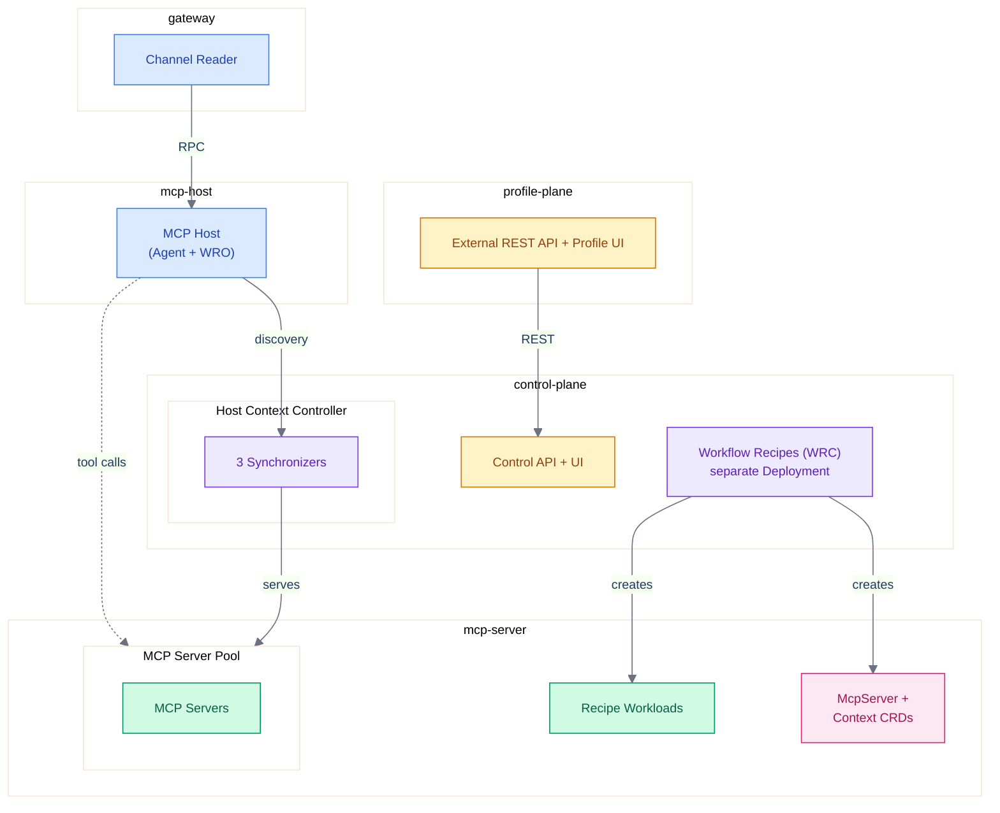
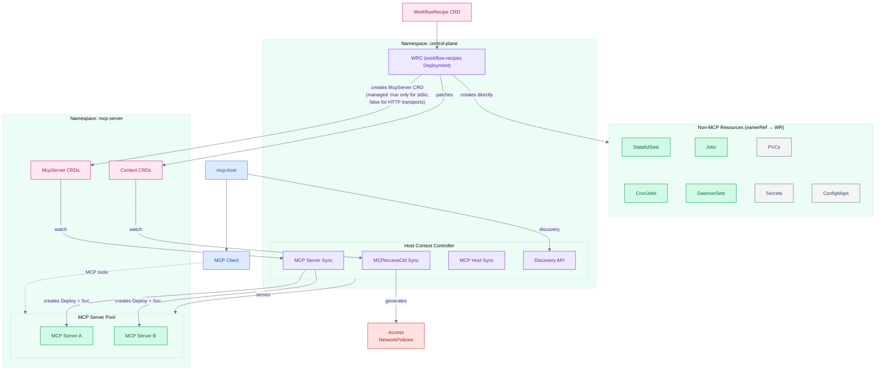
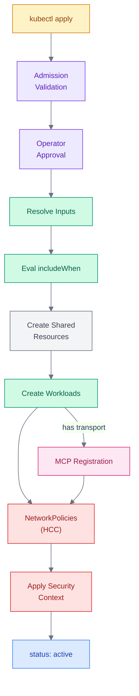
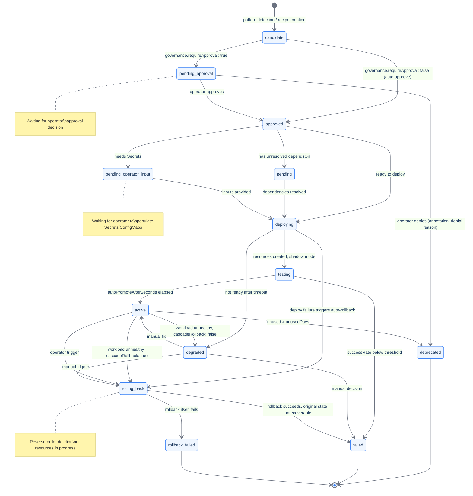

# WorkflowRecipe CRD Reference

**API version:** `clerum.io/v1alpha1`
**Kind:** `WorkflowRecipe`
**References:** [Platform Architecture](../architecture/platform-topology.md) | [Operations Guide](../deploy/workflow-recipes-guide.md) | [Architecture Overview](../architecture/overview.md)

---

## Table of Contents

1. [Overview](#1-overview)
2. [Core Concepts](#2-core-concepts)
3. [WorkflowRecipe CRD Schema](#3-workflowrecipe-crd-schema)
4. [Conditional Resource Inclusion](#4-conditional-resource-inclusion)
5. [Environment Variant Management](#5-environment-variant-management)
6. [Deployment Pipeline](#6-deployment-pipeline)
7. [Resource Generation](#7-resource-generation)
8. [Security Model](#8-security-model)
9. [Network Security and Bindings](#9-network-security-and-bindings)
10. [External Ingress — Not Implemented](#10-external-ingress--not-implemented)
11. [CRD Validation Rules (CEL)](#11-crd-validation-rules-cel)
12. [Status Subresource and Observability](#12-status-subresource-and-observability)
13. [Dry-Run and Preview Mode — Not Implemented](#13-dry-run-and-preview-mode--not-implemented)
14. [Agent-Driven Recipe Creation](#14-agent-driven-recipe-creation)
15. [Operator Approval and Governance](#15-operator-approval-and-governance)
16. [Template Injection Prevention](#16-template-injection-prevention)
17. [Failure Mode Analysis](#17-failure-mode-analysis)
18. [PVC Retention and Finalizers](#18-pvc-retention-and-finalizers)
19. [Rate Limiting](#19-rate-limiting)
20. [CRD Version Migration](#20-crd-version-migration)
21. [GitOps Integration](#21-gitops-integration)
22. [Examples](#22-examples)
23. [Caveats, Limitations and Trade-offs](#23-caveats-limitations-and-trade-offs)

---

## 1. Overview

Clerum Recipes is a Kubernetes-native, CRD-driven workload composition system that defines complete, self-contained applications as a single Custom Resource. It is the packaging, deployment, and lifecycle management layer of the Clerum platform.

### 1.1 The Problem

A single-image, single-Deployment model cannot express:

- A database plus the MCP server that uses it
- CronJobs running at different schedules with different images
- A migration Job that must complete before a Deployment starts
- Multi-container pods with sidecars
- StatefulSets with persistent storage
- Event pipelines with queues, workers, and gateways

Beyond composition, existing tools (Helm, Kustomize, Terraform, kro) lack:

- **Enforced security-by-default** at the schema level (opt-in is insufficient for production MCP infrastructure)
- **Automatic NetworkPolicy generation** from a declarative communication graph
- **Agent-driven recipe discovery, generation, and publication** from runtime telemetry
- **Operator approval for deployment** with risk classification (publication to registry is automatic)

### 1.2 The Solution

Four core abstractions compose any Clerum workload:

```
workloads[]   -- What runs (Deployments, StatefulSets, CronJobs, Jobs, DaemonSets)
resources[]   -- What is shared (PVCs, Secrets, ConfigMaps)
bindings[]    -- Who talks to whom (auto-generates NetworkPolicies)
profiles{}    -- How it varies across environments (staging, production)
```

### 1.3 Design Principles

1. **Security-by-default, enforced at every level** -- Every workload gets `allowPrivilegeEscalation: false`, `capabilities: drop: [ALL]`, a `RuntimeDefault` seccomp profile, and deny-all networking. No isolation level permits privileged execution. Non-root and read-only root filesystem are enforced from `isolationLevel: standard` upwards; the default level (`minimal`, used when `spec.security.isolationLevel` is omitted) still allows the container to run as root so that stock images work (see Section 8).
2. **Additive complexity** -- A single-workload recipe is minimal YAML. Multi-workload, multi-environment, and conditional inclusion are all opt-in.
3. **Minimal required fields** -- Each workload needs only `id`, `type`, and `image`. Everything else has sensible defaults.
4. **Kubernetes-native** -- No new abstractions over Kubernetes concepts. If you know Kubernetes, you know this format.
5. **Declarative dependencies** -- `bindings[]` generates NetworkPolicies. `dependsOn` controls deployment ordering.
6. **Resources are shared, workloads are isolated** -- Secrets and PVCs live in `resources[]`, referenced by workloads that need them.
7. **MCP registration is opt-in** -- Only workloads with a `transport` field are registered as MCP servers. Not every workload needs to be an MCP server.
8. **In-place mutable** -- Recipes can be updated in place (image tags, replicas, resource limits). PVCs are preserved across updates. The controller reconciles changes like any Kubernetes operator.
9. **Operator approval for deployment** -- No workload deploys without operator approval. Recipe publication to the Clerum Recipe Registry is automatic and unrestricted.
10. **Context-scoped visibility** -- Recipes are visible only within the context (Context CRD) that includes them in its `mcpServers[]` allowlist. This enables multi-tenant isolation through context boundaries.
11. **The CRD IS the package** -- No separate chart concept. A WorkflowRecipe CRD contains everything needed for deployment. Single file, pure YAML, no template DSL.

### 1.4 Platform Architecture Reference

WorkflowRecipes operate within the Clerum platform architecture. The Workload Recipe Controller (WRC) is a pure CRD reconciler that runs as its own Deployment (`workflow-recipes`, image `clerum/workflow-recipes`, port 8082) in the `control-plane` namespace, alongside — but separate from — the Host Context Controller (HCC) Deployment (`host-context-controller`, port 8081). Each has its own ServiceAccount. Besides reconciling WorkflowRecipe CRDs, the WRC exposes an MCP interface (StreamableHTTP at `:8082/mcp/v1`) whose tools include `deploy_recipe`, `rollback_recipe`, and `delete_recipe`; deployments requested through it are authorized by a caller-`contextRef` check (a cross-context request is rejected with 403):



| Node                        | Detail                                                                                        |
| --------------------------- | --------------------------------------------------------------------------------------------- |
| **External REST API + UI**  | external-rest-api, profile-ui, WorkflowRecipePolicy CRDs                                      |
| **Control API + UI**        | control-api, control-ui (platform management)                                                 |
| **Channel Reader**          | Telegram, Email, Slack adapters                                                               |
| **MCP Host**                | Agent + MCP Client + WRO                                                                      |
| **Host Context Controller** | 3 Synchronizers (MCP Host, AccessCtrl, MCP Server) + Discovery API (:8081)                    |
| **WRC**                     | `workflow-recipes` Deployment (:8082) — WorkflowRecipe reconciler + MCP interface (`/mcp/v1`) |
| **MCP Servers**             | MongoDB, Airtable, etc.                                                                       |

> **Full architecture details**: See [Platform Architecture](../architecture/platform-topology.md) for the complete 7-namespace architecture, service map, data flow, and controller architecture. This is a reference diagram only — the architecture document is the source of truth.

### 1.5 Competitive Positioning

Clerum Recipes combines several capabilities that are individually available in the Kubernetes ecosystem but are not found together in a single CRD-as-Package tool:

| Capability                                           | Comparable Ecosystem Tools                                               | Clerum Approach                                                                                   |
| ---------------------------------------------------- | ------------------------------------------------------------------------ | ------------------------------------------------------------------------------------------------- |
| Security-by-default (enforced at CRD level)          | PSS Restricted profile (namespace-level), OPA/Gatekeeper (cluster-level) | Mandatory security context baked into CRD schema; cannot be bypassed by individual recipe authors |
| Auto-generated NetworkPolicies from bindings         | Calico, Cilium, Istio (CNI/service mesh level)                           | Generated from declarative `bindings[]` within the CRD; no separate CNI configuration needed      |
| Agent-driven recipe discovery and generation         | No comparable K8s tool (unvalidated concept)                             | WRO pattern detection from runtime telemetry; requires empirical validation                       |
| MCP server registration (transport field)            | N/A (Clerum-specific domain)                                             | Domain-specific integration                                                                       |
| Mandatory operator approval with risk classification | ArgoCD sync windows, Terraform plan + Sentinel (opt-in)                  | Enforced by default, not opt-in                                                                   |
| Single-file CRD-as-Package                           | kro ResourceGraphDefinition                                              | Pure YAML, no DSL                                                                                 |

A broader comparative analysis against ecosystem tools (Helm, Kustomize, ArgoCD, Crossplane, KubeVela, etc.) is not published in this OSS tree. Note that Clerum Recipes is a draft specification with no production validation, while the compared tools have years of operational history.

---

## 2. Core Concepts

### 2.1 Recipe

A `WorkflowRecipe` CRD that defines a complete, self-contained application composed of one or more workloads. Recipes can declare dependencies on other recipes via `spec.dependencies` for deployment ordering (Section 6.3).

### 2.2 Workload

A single Kubernetes workload resource. Each workload maps 1:1 to a Kubernetes resource:

| `type`        | Kubernetes Resource | Use Case                                           |
| ------------- | ------------------- | -------------------------------------------------- |
| `deployment`  | Deployment          | Long-running services, MCP servers, APIs           |
| `statefulset` | StatefulSet         | Databases, caches, queues with persistent identity |
| `cronjob`     | CronJob             | Scheduled tasks, ETL, backups                      |
| `job`         | Job                 | One-time tasks, migrations, data imports           |
| `daemonset`   | DaemonSet           | Per-node agents, log collectors, monitors          |

### 2.3 Resource

A shared Kubernetes resource referenced by one or more workloads:

| `type`      | Kubernetes Resource   | Purpose                        |
| ----------- | --------------------- | ------------------------------ |
| `pvc`       | PersistentVolumeClaim | Persistent storage             |
| `secret`    | Secret                | Credentials, tokens, passwords |
| `configmap` | ConfigMap             | Configuration files, scripts   |

### 2.4 Binding

A declared communication path between two workloads, or from a workload to an external endpoint. Each binding generates a NetworkPolicy rule allowing traffic from `from` to `to` on the specified port.

### 2.5 Profile

A named set of input overrides for environment-specific parameterization (staging, production, etc.). Profiles eliminate the need to duplicate entire recipes per environment.

### 2.6 MCP Registration

Workloads with a `transport` field are automatically registered as MCP servers. Responsibilities are split between the WRC and the HCC through CRD-mediated coordination:

1. **WRC** (the `workflow-recipes` Deployment) watches WorkflowRecipe CRDs and reconciles them:
   - Non-MCP workloads (StatefulSets, CronJobs, Jobs, PVCs, Secrets, ConfigMaps) → created directly with `ownerRef → WorkflowRecipe`
   - MCP workloads (those with `transport` field) → creates McpServer CRDs with `ownerRef → WorkflowRecipe`. The `managed` flag is **transport-dependent**: `managed: true` only for `transport.type: stdio`; `streamableHttp` and `sse` workloads get `managed: false` and the WRC creates their Deployment + Service itself.
2. **MCP Server Sync** (within HCC) watches McpServer CRDs and creates Deployment + Service for each `managed: true` McpServer — i.e. for stdio recipe workloads (where it also injects the stdio-bridge sidecar) and for standalone managed servers. `managed: false` McpServer CRDs are registration/discovery records only; their runtime is owned by whoever created it (the WRC, for HTTP transport workloads).
3. **Discovery**: mcp-host discovers ALL MCP servers (standalone, recipe-based, and infrastructure) through HCC's Discovery API

See [Architecture Reference §13](../architecture/platform-topology.md#13-deployment-responsibility-matrix) for the complete deployment responsibility matrix.

### 2.7 Architecture: Controller Model with CRD-Mediated Coordination

A WorkflowRecipe functions as a **CRD-as-Package** orchestrated by the **WRC** (`workflow-recipes` Deployment) in the `control-plane` namespace. The WRC delegates MCP server lifecycle to the HCC's MCP Server Sync via McpServer CRDs:



**Diagram Legend:**

| Color             | Meaning                                       | Examples                                                               |
| ----------------- | --------------------------------------------- | ---------------------------------------------------------------------- |
| Blue (service)    | Core platform services                        | mcp-host, MCP Client                                                   |
| Purple (operator) | Controller components                         | WRC, MCP Server Sync, MCPAccessCtrl Sync, MCP Host Sync, Discovery API |
| Green (workload)  | Deployed workloads and non-MCP workload kinds | MCP Server A/B, StatefulSets, CronJobs                                 |
| Pink (crd)        | CRDs                                          | WorkflowRecipe CRD, McpServer CRDs, Context CRDs                       |
| Red (security)    | Security resources                            | NetworkPolicies                                                        |
| Gray (storage)    | Supporting resources                          | PVCs, Secrets, ConfigMaps                                              |

| Node                   | Detail                                                                                             |
| ---------------------- | -------------------------------------------------------------------------------------------------- |
| **WRC**                | WorkflowRecipe Reconciler — its own `workflow-recipes` Deployment in `control-plane`               |
| **MCP Server Sync**    | McpServer Reconciler — watches McpServer CRDs, creates Deployments + Services                      |
| **MCPAccessCtrl Sync** | Context Reconciler — manages access NetworkPolicies                                                |
| **MCP Host Sync**      | Host CRD lifecycle management                                                                      |
| **Discovery API**      | REST endpoint: `GET /api/v1/mcpservers/context/{ref}`                                              |
| **MCP Server Pool**    | All MCP servers: recipe-created, standalone, and infrastructure                                    |
| **McpServer CRDs**     | Created by the WRC for MCP workloads (`ownerRef → WorkflowRecipe`; `managed: true` only for stdio) |
| **MCP Server A/B**     | Standalone or recipe-created MCP servers (MongoDB, Airtable, etc.)                                 |

> **WRC reconciliation model**: Recipes are deployed either by creating WorkflowRecipe CRDs (via control-api or `kubectl apply`) or through the WRC's MCP `deploy_recipe` tool. Either way, the WRC watches the resulting CRDs and reconciles them — it produces declarative intent (McpServer CRDs, workloads, Context patches), and the HCC's other synchronizers materialize them into runtime state.

**Controller resource ownership:**

| Resource Type                                                   | Created By               | Managed By                                                                             |
| --------------------------------------------------------------- | ------------------------ | -------------------------------------------------------------------------------------- |
| StatefulSets, CronJobs, Jobs, DaemonSets                        | WRC                      | WRC                                                                                    |
| Non-MCP Deployments + Services                                  | WRC                      | WRC                                                                                    |
| PVCs, Secrets, ConfigMaps                                       | WRC                      | WRC                                                                                    |
| McpServer CRD (MCP-enabled workloads)                           | WRC                      | WRC (`managed: false`, HTTP transports) / HCC MCP Server Sync (`managed: true`, stdio) |
| Deployment + Service for `streamableHttp` / `sse` MCP workloads | WRC                      | WRC                                                                                    |
| Deployment (+ stdio-bridge sidecar) for `stdio` MCP workloads   | HCC (MCP Server Sync)    | HCC (MCP Server Sync)                                                                  |
| ALL NetworkPolicies (deny-all, bindings, context access)        | HCC (MCPAccessCtrl Sync) | HCC (MCPAccessCtrl Sync)                                                               |

> **NetworkPolicy ownership**: The HCC's MCPAccessCtrl Sync is the SOLE owner of all NetworkPolicies across all runtime namespaces. The WRC creates ZERO NetworkPolicies. When the WRC reconciles a WorkflowRecipe, it patches the Context CRD with binding information; the MCPAccessCtrl Sync then generates and manages all NetworkPolicies (deny-all defaults, inter-workload binding rules, and cross-namespace access rules). This single-owner model eliminates NetworkPolicy conflicts and TOCTOU race conditions.
>
> **Pod scheduling and NetworkPolicy ordering**: The namespace-wide deny-all policy is applied once per runtime namespace at HCC startup, as a mandatory bootstrap barrier before the controller reconciles anything, so a pod never runs with no policy selecting it. Per-workload ordering after that point depends on the transport, and only one of the three paths blocks:
>
> | Workload | Waits for `network-ready`? | If the wait does not resolve |
> | --- | --- | --- |
> | External egress bindings | Yes | Throws; no workload resources are created |
> | Generic `stdio` | Yes, up to 30s | Logs a warning and proceeds |
> | HTTP transport, no external egress | No | Not applicable |
>
> In the two non-blocking cases the pod can start before its per-workload allow rules are confirmed applied. It starts under the pre-existing deny-all, so the failure mode is broken connectivity until those rules land, not unrestricted traffic. Do not read this as a guarantee that every per-workload NetworkPolicy exists before its pod is scheduled.

**Key architectural decisions:**

1. **Controller architecture**: The WRC is a standalone Deployment (`workflow-recipes`) in the `control-plane` namespace, separate from the HCC Deployment (which runs the 3 synchronizers: MCP Host, AccessCtrl, MCP Server). The two controllers have separate images and separate ServiceAccounts, and interact only through CRDs via the Kubernetes API.
2. **WRC MCP interface**: Besides reconciling CRDs, the WRC exposes an MCP server (StreamableHTTP at `:8082/mcp/v1`) whose tools include `deploy_recipe`, `rollback_recipe`, and `delete_recipe`, so a recipe can be deployed either by creating a WorkflowRecipe CRD or by an agent calling the tool. Tool-driven deployments are authorized by a caller-`contextRef` check: a request whose identity `contextRef` does not match the recipe's is rejected with 403 (`workflow-recipes/src/mcp/handlers.ts`). This is the authorization boundary for agent-triggered deployments — not a human-in-the-loop gate.
3. **CRD-mediated coordination**: The WRC creates McpServer CRDs and patches Context CRDs. The HCC's MCP Server Sync and MCPAccessCtrl Sync watch these CRDs and create the corresponding infrastructure — the MCP Server Sync only owns the runtime of `managed: true` (stdio) servers.
4. **Transport triggers delegation**: Workloads with a `transport` field cause the WRC to create an McpServer CRD and patch the Context CRD (handled by MCPAccessCtrl Sync for NetworkPolicies). The `managed` flag follows the transport: `stdio` → `managed: true`, and the MCP Server Sync creates the Deployment (with stdio-bridge sidecar); `streamableHttp` / `sse` → `managed: false`, and the WRC creates the Deployment and Service itself. Workloads without `transport` are created directly by the WRC.
5. **MCP Server Sync keys off `managed`, not `ownerReference`**: No conditional logic based on who created the McpServer CRD. It creates Deployment + Service for every `managed: true` McpServer, whether created manually or by the WRC, and leaves `managed: false` servers alone. The ownerRef serves only for Kubernetes garbage collection cascade.
6. **Dependency ordering**: The WRC handles topological sort and creates resources in order.
7. **Status tracking**: The WRC updates WorkflowRecipe status with per-workload phases.
8. **Rollback coordination**: The WRC deletes McpServer CRDs (triggering MCP Server Sync cleanup via DELETE watch events) and patches Context CRD (removing from allowlist). Non-MCP resources are deleted directly.

---

## 3. WorkflowRecipe CRD Schema

### 3.1 Top-Level Structure

```yaml
apiVersion: clerum.io/v1alpha1
kind: WorkflowRecipe
metadata:
  name: <recipe-name>
  namespace: sandbox-recipes # WorkflowRecipe CRDs are always stored here
  labels:
    clerum.io/recipe-version: '<semver>'
spec:
  description: '<what this recipe does>'
  contextRef: '<context-name>' # Optional; references a Context CRD. If omitted, a transport workload gets a private `wf-<recipeName>` Context derived during MCP delegation

  # --- Parameterization (Section 3.8) ---
  inputContract: { ... } # JSON Schema defining required inputs
  inputs: { ... } # Concrete input values (validated against inputContract)

  # --- Environment Variants (Section 5) ---
  profiles: { ... } # Named input override sets (staging, production)
  activeProfile: '<profile-name>' # Which profile to activate

  # --- Computed Values (Section 5.5) ---
  computed: # Optional. Derived values from a sandboxed arithmetic/ternary
    - name: memoryLimit #   evaluator. `{{...}}` is NOT valid here (Section 5.5.2).
      expression: 'inputs.memoryRequest * 2'

  # --- Inter-Recipe Dependencies (Section 6.3) ---
  dependencies: # Recipes that must be 'active' before this recipe deploys
    - name: <recipe-name> # Required. Name of the dependent WorkflowRecipe
      namespace: sandbox-recipes # Optional. Defaults to same namespace
      cascadeRollback: false # Optional. Auto-rollback when dependency fails (default: false)
      maxWaitMinutes: 10 # Optional. Max time to wait for dependency to reach 'active' (default: 10)

  # --- Core Composition ---
  workloads: [...] # Array of workload definitions (optional; may be empty for steps-only recipes)
  resources: [...] # Array of shared resource definitions (optional)
  bindings: [...] # Array of inter-workload communication declarations (optional)

  # --- Recipe-Wide Settings ---
  security:
    isolationLevel:
      standard # minimal | standard | strict. No CRD default;
      # the reconciler falls back to `minimal` when omitted (Section 8).
```

`spec` has no `required` list. The CRD instead requires (CEL rule R2) that a
recipe define **at least one of** `workloads` or `steps` — `workloads` has
`minItems: 0`, so workflow-only (steps-only) recipes are valid.

The complete `spec` property set is: `description`, `gfs`, `contextRef`,
`coordinatorImage`, `runtimeEgress`, `agent`, `steps`, `mcpServers`, `output`,
`scheduling`, `triggers`, `runRetention`, `ui`, `workloads`, `webhooks`,
`oauthClients`, `pluginWorkloadSdk`, `resources`, `bindings`, `inputs`,
`inputContract`, `activeProfile`, `profiles`, `computed`, `security`,
`dependencies`. Anything else — including `recipeId`, `version`, `signatures`,
`serverization`, `capabilities`, and `requirements` — is **not** in the schema
and is pruned by the API server.

### 3.1.1 Workflow Steps

`spec.steps[]` supports two executable step kinds:

| Shape              | Runtime                  | Required field          | Notes                                                                                            |
| ------------------ | ------------------------ | ----------------------- | ------------------------------------------------------------------------------------------------ |
| Agentic            | `mcp-host` broker        | `instruction`           | Uses `spec.agent` or a full `step.agent` override.                                               |
| Snippet            | snippet runner           | `run.type: snippet`     | Executes platform-managed TypeScript code without a custom image.                                |
| Custom coordinator | custom coordinator image | `spec.coordinatorImage` | Runs an operator-allowed SDK image. This is the custom-image tier for user-owned business logic. |

Without `spec.coordinatorImage`, each step must set exactly one of `instruction` or `run`. With `spec.coordinatorImage`, id-only steps are allowed. `run + instruction` and `run + agent` are always rejected. Snippet steps require `run.type: snippet`, `run.language: typescript`, and inline `run.code`.

```yaml
steps:
  - id: merge
    run:
      type: snippet
      language: typescript
      code: |
        return { a: 1, b: 2 }
  - id: analyze
    dependsOn: [merge]
    instruction: 'Analyze {{merge:output}}.'
```

Pure snippet workflows do not create a per-recipe `mcp-host` pod. Hybrid workflows create one only for agentic or broker-backed steps. Runtime gateway credentials remain scoped to the `mcp-host` broker; the coordinator uses WRC status/signal credentials and its internal coordinator-to-broker token.

Custom coordinator workflows declare the image at workflow level:

```yaml
spec:
  coordinatorImage: ghcr.io/acme/reconciliation-coordinator:1.2.3@sha256:aaaaaaaaaaaaaaaaaaaaaaaaaaaaaaaaaaaaaaaaaaaaaaaaaaaaaaaaaaaaaaaa
  steps:
    - id: prepare
    - id: transform
      dependsOn: [prepare]
    - id: emit
      dependsOn: [transform]
  output:
    destination: pvc
    storageSize: 1Gi
```

The WRC only runs custom coordinator images when `WRC_ENABLE_CUSTOM_COORDINATOR_IMAGE=true` and the image reference passes the configured allowlist/digest policy. The custom coordinator receives the mounted workflow spec at `/etc/workflow/config.json`, a reduced WRC token for status/signal/health access, and optional `mcp-host` endpoint/token only when a step actually requires the broker.

Custom images must satisfy the same pod contract as the platform coordinator: run without root as UID/GID `1000`, expose SDK health on port `8090`, write temporary data only under `/tmp`, and write declared artifacts only under `/output`. The WRC derives the pod `activeDeadlineSeconds` from declared step `timeoutSeconds` plus a buffer, capped below the one-hour coordinator-token TTL to preserve final status/artifact reporting margin.

When a custom coordinator writes `/output` artifacts, WRC serves them through the platform-owned artifact path for the exact child run. Workflows without a child `mcp-host` get a WRC-managed artifact reader; broker-backed workflows can still use `mcp-host` for agent/tool execution while `/output` artifact download remains run-scoped and bound to `status.artifacts[]`.

For any WorkflowRecipe runtime, WRC uses one output PVC per parent recipe
unless `output.claimName` is set. Runtime pods still see `/output`, and WRC
keeps run isolation with subdirectories under `workflow-output/<parent>` and
`workflow-output/<parent>/<runId>` for triggered child runs. If
`output.claimName` is omitted, WRC creates a parent-scoped PVC sized by
`output.storageSize` (default `256Mi`) and deletes that PVC when the parent
WorkflowRecipe is deleted. If `output.claimName` is set, it must name an
existing PVC in `sandbox-recipes` that is explicitly labeled for this workflow
output scope:

```yaml
metadata:
  labels:
    clerum.io/workflow-output-external: 'true'
    clerum.io/workflow-output-claim: <claimName>
    clerum.io/workflow-output-scope: <parentRecipeName>
```

Use the same RFC1123 hash/truncation value that WRC uses for generated
workflow output labels when the claim or recipe name is long.
WRC mounts that external claim but does not create, resize, or delete it.
PVCs labeled `clerum.io/managed-by: wrc` are reserved for WRC-managed lifecycle
and cannot be selected through `output.claimName`; omit `claimName` to use that
managed path.
WRC-managed output PVCs get a run-scoped one-shot
`workflow-output-prepare` pod before runtime startup; the prepare pod validates
the subPath, creates only that directory chain, and makes it writable by the
non-root workflow UID/GID `1000`. Operator-provided `output.claimName` PVCs do
not get ownership mutation, so operators must pre-provision permissions for
UID/GID `1000`. PVCs declared under `spec.resources[]` (mounted through
`workloads[].volumeMounts`) or under `workloads[].volumeClaimTemplates` remain
workload/service storage and are not treated as workflow output storage.

Upgrade note: recipes that previously relied on the cluster-wide
`clerum-workflow-output` PVC must explicitly set
`output.claimName: clerum-workflow-output` and label that PVC for one exact
workflow output scope to keep serving historical bytes from that claim. For
multiple recipes, migrate bytes to separate per-recipe external claims or to
the new WRC-managed claims. Otherwise WRC uses the per-recipe PVC and missing
historical bytes surface as `artifact_gone`.

`status.steps[].output` is only a bounded preview. WRC records
`outputTruncated`, `outputLength`, and `outputPreviewMaxChars` when output is
reported, and Control UI points users to `status.artifacts[]` for complete
files. Prompt interpolation such as `{{merge:output}}` receives the same kind
of bounded preview; full reports must move through `/output` artifacts instead.

### 3.1.2 Step Approval Gates (`steps[].requiresApproval`)

`requiresApproval` turns a step into a human-in-the-loop gate. The step **pauses before execution** and the coordinator waits for an explicit approve decision from `target.userId` (or any member of `target.teamId`). Use it for steps with irreversible side effects — posting to a customer channel, writing to a system of record, issuing a refund.

| Field            | Type    | Required | Description                                                                                         |
| ---------------- | ------- | -------- | --------------------------------------------------------------------------------------------------- |
| `target`         | object  | **Yes**  | Who must approve. Exactly one of `userId` or `teamId` (schema `oneOf`).                             |
| `target.userId`  | string  | No\*     | Target user identifier. Max 253 chars.                                                              |
| `target.teamId`  | string  | No\*     | Target team identifier. Max 253 chars.                                                              |
| `message`        | string  | **Yes**  | Prompt shown to the approver. 1–2000 chars.                                                         |
| `timeoutSeconds` | integer | No       | Approval TTL. No decision in the window ⇒ step auto-rejected as expired. 30–604800, default `3600`. |

\* `target` is a `oneOf` — supply **exactly one** of `userId` / `teamId`. Both, or neither, is rejected at admission.

```yaml
spec:
  agent:
    provider: claude
    model: claude-3-opus
  steps:
    - id: draft-summary
      instruction: 'Summarize this week's reconciliation breaks.'
    - id: post-summary
      dependsOn: [draft-summary]
      instruction: 'Post {{draft-summary:output}} to the finance channel.'
      requiresApproval:
        target:
          teamId: finance-ops
        message: 'Approve posting the reconciliation summary to #finance?'
        timeoutSeconds: 7200
```

**What gets rejected**

- The `oneOf` on `target`: exactly one of `userId` / `teamId`.
- `message` must be non-empty (`minLength: 1`).
- A step cannot pair `requiresApproval` with `run` (reconciler, surfaced as a failed phase): approval is an agentic-broker feature, so **snippet steps cannot gate**.
- `requiresApproval` on a recipe with no agentic broker (`mcp-host`) fails: _"step requires an agentic broker for approval"_.

### 3.2 Workload Schema

Each entry in `workloads[]`:

```yaml
workloads:
  - id: <unique-name> # Required. Unique within this recipe.
    type: <workload-type> # Required. deployment|statefulset|cronjob|job|daemonset
    image: <container-image> # Required. Docker image reference.
    imagePullSecrets: # Optional. List of Secret names for private registries.
      - <secret-name> # Secrets must exist in the workload's namespace.

    # --- Supported workload fields ---
    # The complete workloads[] property set is: id, type, image, imagePullPolicy,
    # port, replicas, command, args, env, volumeMounts, envSecret, resources,
    # healthCheck, dependsOn, imagePullSecrets, oauthClientRefs, egressBindings,
    # includeWhen, transport, security, schedule, timeZone, serviceName,
    # volumeClaimTemplates, backoffLimit. Anything else is pruned by the API
    # server (structural schema) and silently ignored.
    #
    # env carries literal name/value pairs only (Section 3.4).
    # envSecret provides Secret-backed env vars (Section 3.4.1).
    # volumeMounts take name + mountPath, where name is a resources[] id (Section 3.5).

    # --- Conditional Inclusion (Section 4) ---
    includeWhen: '{{inputs.<key>}}' # Optional. Include only when boolean input is true.

    # --- Deployment ordering ---
    dependsOn: [...] # List of workload IDs that must be ready/completed first.

    # --- MCP Server registration (optional) ---
    # transport is an OBJECT. Its presence makes this workload an MCP server.
    transport:
      type: streamableHttp # streamableHttp | sse | stdio
      path: /mcp # Optional. HTTP path for the MCP endpoint.
      # stdio: WRC sets managed:true on McpServer CRD;
      #   HCC injects stdio-bridge sidecar (HTTP-to-stdio proxy)

    # --- Health check (Clerum abstraction over K8s probes) ---
    # `type` has NO schema default and NO reconciler fallback: the probe builder
    # attaches a handler only when type is http, tcp, or exec. Omit it and the
    # generated Deployment carries a handler-less Probe, which the API server
    # rejects with "must specify a handler type". Always set it.
    healthCheck:
      type: http # http | tcp | exec. Required in practice (see above).
      path: /health # HTTP GET path (liveness + readiness). Only for type: http.
      port: 3000 # Port for health check (http and tcp).
      command: [...] # Command for exec probe. Only for type: exec.
      initialDelaySeconds: 30 # Seconds before first probe (default: K8s default 0).
      periodSeconds: 10 # Probe interval in seconds (default: K8s default 10).
      timeoutSeconds: 5 # Max seconds per probe attempt (default: K8s default 1).
      failureThreshold: 3 # Consecutive failures before marking unhealthy (default: K8s default 3).

    # --- External egress (optional) ---
    egressBindings: # Max 20. Allows this workload to reach an external endpoint.
      - egressClass: exact-host # exact-host (default) | public-web
        dns: api.example.com # DNS hostname (exact-host only).
        port: 443
        protocol: TCP # TCP | UDP

    # NOTE: there is no `ingress`, `sidecars`, `initContainers`, or `autoscaling`
    # field on workloads[]. External ingress and HPAs are not implemented
    # (Section 24.2); multi-container pods are not part of the schema.

    # --- CronJob-specific (type: cronjob) ---
    schedule: '0 * * * *' # Required for cronjob (CEL-enforced). Cron expression.
    timeZone: 'America/New_York' # Optional. IANA timezone (K8s 1.27+). Default: cluster UTC.
    # `schedule` and `timeZone` are the ONLY cronjob knobs in the schema.
    # concurrencyPolicy, restartPolicy, activeDeadlineSeconds, startingDeadlineSeconds,
    # successfulJobsHistoryLimit and failedJobsHistoryLimit are NOT fields — they are pruned.

    # --- Job-specific (type: job) ---
    backoffLimit: 3 # Optional. The ONLY job knob in the schema.
    # restartPolicy, activeDeadlineSeconds, parallelism and completions are NOT
    # fields — they are pruned.

    # --- DaemonSet-specific (type: daemonset) ---
    # Requires explicit operator annotation (OPA policy: clerum.io/daemonset-approved).

    # --- StatefulSet-specific (type: statefulset) ---
    # A headless Service (clusterIP: None) is auto-created for stable pod DNS.
    # Pod DNS: <recipe>-<workload-id>-N.<recipe>-<workload-id>.<namespace>.svc.cluster.local
    volumeClaimTemplates: # Per-replica PVCs (StatefulSet only).
      - name: data
        storageClass: do-block-storage
        accessMode: ReadWriteOnce
        size: 10Gi
    # PVCs created from volumeClaimTemplates include WorkflowRecipe labels for queryability:
    # - clerum.io/workload: <workload-id>
    # - clerum.io/recipe: <recipe-name>
    # - clerum.io/context: <contextRef>
    # - clerum.io/managed-by: workflow-recipes
    # PVCs do NOT have ownerReferences (data retention on recipe deletion)
```

### 3.3 Resource Schema

Each entry in `resources[]`. The schema carries Kubernetes-shaped fields (`storageClass`, `accessMode`, `size`, `data`) with their usual meaning — see the [Kubernetes documentation](https://kubernetes.io/docs/concepts/storage/persistent-volumes/) — plus the Clerum-specific `generateKeys`. There is **no** `stringData` field; it is pruned.

```yaml
resources:
  # --- PersistentVolumeClaim ---
  - id: <unique-name> # Required. Unique within this recipe.
    type: pvc
    storageClass: <storage-class> # e.g., "do-block-storage"
    size: 10Gi # Storage size. Required for PVC.
    accessMode: ReadWriteOnce # ReadWriteOnce | ReadOnlyMany | ReadWriteMany

  # --- Secret ---
  # WARNING: Values in `data` are stored in plaintext in the WorkflowRecipe CRD.
  # For sensitive values, use `generateKeys` or a pre-provisioned K8s Secret via `envSecret`.
  - id: <unique-name>
    type: secret
    data: { KEY_NAME: 'value' } # Static key-value pairs (optional, non-sensitive only).
    generateKeys: # Clerum-specific: plain list of Secret KEYS to auto-generate
      - PASSWORD # random values for. There is no per-key `length` option.
      - API_TOKEN

  # --- ConfigMap ---
  - id: <unique-name>
    type: configmap
    data: { config.yaml: 'setting: value' }
```

`resources[]` items support only `id`, `type`, `storageClass`, `size`,
`accessMode`, `data`, and `generateKeys`. There is **no** `includeWhen` on
resources — conditional inclusion applies to workloads only (Section 4).

### 3.4 Environment Variables

Environment variables support literal Kubernetes `EnvVar.value` strings plus
the `envSecret` batch mapping in Section 3.4.1. `env[].value` is optional and
follows Kubernetes semantics: if omitted, Kubernetes treats it as `""`.

```yaml
env:
  # Literal value
  - name: LOG_LEVEL
    value: 'info'

  # Template in a Kubernetes-shaped string
  - name: DATABASE_URL
    value: 'postgresql://{{postgres:host}}:{{postgres:port}}/{{inputs.db_name}}'
```

**Template syntax** (resolved at resource creation time by the WorkflowRecipe Reconciler):

- `{{resource-id:KEY}}` -- Resolves to the value of `KEY` from the named resource.
- `{{workload-id:host}}` -- Resolves to the internal Service DNS name WRC/HCC materializes for the workload.
- `{{workload-id:port}}` -- Resolves to the workload's primary port.
- `{{inputs.<key>}}` -- Resolves to the value of the named input parameter.
- `{{computed.<key>}}` -- Resolves to a computed value evaluated by WRC.

`{{workload-id:host}}` and `{{workload-id:port}}` require the referenced
workload to declare `port`; WRC only materializes a Service DNS name for
port-backed workloads.

For issue #231, WRC resolves Clerum template syntax in these workload fields:

- `env[].value`
- `command[]`
- `args[]`

`env[].valueFrom.template` is not implemented by this contract. Secrets should
continue to use `envSecret` or snippet `secretRef`; do not place sensitive
values directly in `env[].value`.

Kubernetes native env var substitution `$(ENV_VAR_NAME)` still happens later
inside the container and is separate from Clerum's `{{...}}` resolution.

### 3.4.1 Secret-Backed Environment Variables (envSecret)

**Workload-level field for batch secret mapping.**

The `envSecret` field provides a concise syntax for mapping multiple keys from a single Kubernetes Secret to environment variables. This is particularly useful for MCP servers that require multiple credentials from the same secret (e.g., database connection strings, API keys, configuration tokens).

```yaml
envSecret:
  name: <k8s-secret-name> # Required. Name of an existing K8s Secret
  keys:
    - secretKey: <key-in-secret> # Required. Key within the Secret
      envVar: <ENV_VAR_NAME> # Required. Environment variable name to create
    - secretKey: <another-key>
      envVar: <ANOTHER_ENV_VAR>
```

**Example: MongoDB MCP Server with credentials**

```yaml
workloads:
  - id: mongodb-mcp
    type: statefulset
    image: your-registry.example.com/evenfire/mongodb-mcp-server:latest
    envSecret:
      name: mcp-mongodb-credentials # K8s Secret with connection data
      keys:
        - secretKey: connection-string # Key in Secret
          envVar: MONGODB_CONNECTION_URL # Env var in container
        - secretKey: database-name
          envVar: MONGODB_DATABASE
        - secretKey: username
          envVar: MONGODB_USER
```

**Generated Kubernetes pod spec equivalent:**

```yaml
spec:
  containers:
    - name: mongodb-mcp
      env:
        - name: MONGODB_CONNECTION_URL
          valueFrom:
            secretKeyRef:
              name: mcp-mongodb-credentials
              key: connection-string
        - name: MONGODB_DATABASE
          valueFrom:
            secretKeyRef:
              name: mcp-mongodb-credentials
              key: database-name
        - name: MONGODB_USER
          valueFrom:
            secretKeyRef:
              name: mcp-mongodb-credentials
              key: username
```

**Relationship to `env[]` field:**

| Aspect          | `env[]`                      | `envSecret`                   |
| --------------- | ---------------------------- | ----------------------------- |
| **Use case**    | Literal / templated values   | Multiple keys from one Secret |
| **Syntax**      | Verbose per-entry            | Concise batch mapping         |
| **Flexibility** | Literal `value` strings only | Focused on K8s Secrets only   |
| **Combination** | ✅ Can use both              | ✅ Can use both               |

When both `env` and `envSecret` are specified, the reconciler merges them. Duplicate `envVar` names are resolved with `envSecret` taking precedence (Kubernetes last-writer-wins semantics apply during env var injection).

**Secret lifecycle:**

- The Secret referenced by `envSecret.name` must exist in the same namespace as the WorkflowRecipe.
- The reconciler does NOT create the Secret — it is assumed to be pre-provisioned by the operator or external secret management system.
- If the Secret does not exist, the workload is still created, but the reconciler keeps the required `secretKeyRef`, so the kubelet cannot start the container and surfaces a `CreateContainerConfigError` (the pod stays out of `Running`). This is intentional — a genuinely-absent key is a visible failure signal, not a silent drop (`workflow-recipes/src/reconciler/resourceBuilder.ts`).

**Security considerations:**

- `envSecret` is the **recommended** method for MCP server credentials because it never stores secret values in the WorkflowRecipe CRD.
- The `env[].value` field should ONLY be used for non-sensitive configuration (log levels, feature flags, etc.).
- For auto-generated secrets, list the key names under `resources[].generateKeys` (see §3.3). For operator- or externally-supplied secrets, pre-provision a K8s Secret and reference it through `envSecret`.

`envSecret` values are not template-rendered. They remain Kubernetes
`secretKeyRef` entries in the generated pod spec.

**Cross-recipe ownership boundary (Issue #637):**

Recipe Secrets live in a shared, co-tenant namespace (`sandbox-recipes`), and a
Kubernetes `secretKeyRef` is namespace-local, so any recipe could _name_ any
other recipe's Secret. To prevent a third-party recipe from referencing another
recipe's Secret by name to exfiltrate credentials, every recipe Secret carries
exactly ONE ownership label, stamped by the operator when the Secret is loaded
(via Control UI / `POST /admin/recipe-secrets`):

- `clerum.io/owner-recipe=<recipe-name>` — only that recipe may project it.
- `clerum.io/shared=true` — any recipe may project it.

A recipe may project a Secret (through `envSecret` **or** `imagePullSecrets`)
only when it is shared or owned by that recipe. When a workload references a
Secret owned by a _different_ recipe (or an unlabeled / conflicting-label Secret,
which is deny-by-default), the reconciler **fails closed**: it does NOT render
the offending workload, tears down any prior instance, and marks the recipe
`NotReady` with an `EnvSecretOwnershipDenied` condition naming the Secret and the
label to add. The credential is never injected into the workload's runtime.

Enforcement points: the WRC reconciler is authoritative (it sees every reconcile
and re-evaluates on Secret label/delete changes); Control API additionally
rejects an _exists-but-foreign_ reference at recipe create/update and at registry
install/upgrade (`422 workflowWorkloadSecretOwnershipDenied`) for early, clear
feedback. An unlabeled Secret passes Control API (it may be labeled before the
recipe runs) but still fails closed at the reconciler until labeled.

### 3.4.2 Image Pull Secrets (format conversion + the platform credential)

**`string[]` here, `{name}` objects downstream — this is intentional.** A WorkflowRecipe
workload declares `imagePullSecrets` as a list of plain Secret **names**:

```yaml
imagePullSecrets:
  - my-ghcr-creds
```

Kubernetes `PodSpec.imagePullSecrets` and the McpServer CRD (`spec.imagePullSecrets`) both
take **object references** (`- name: my-ghcr-creds`). WRC performs that conversion: it
applies the Issue-#637 ownership filter to the declared names, then normalizes the
surviving names into `{ name }` references when it renders a pod template or an McpServer
manifest. The recipe-facing string form is the ergonomic surface; the object form is the
Kubernetes contract. **This is a documented format conversion at the contract boundary, not
a desynchronization between the two CRDs** — do not "fix" either schema to match the other.

**The platform registry credential is injected, never declared.** Images hosted on the
platform registry are covered by a Secret named `evenfire-registry-pull`, provisioned by
Control API and referenced automatically: WRC appends it **after** the ownership filter to
any workload whose image host matches the configured registry host. A recipe must **not**
name it in `imagePullSecrets` — the Secret is deliberately unlabeled to the #637 ownership
model, so declaring it is `denied`, which denies the whole **workload** (it is torn down,
not merely stripped). Recipes stay portable precisely because they never mention it. See
`docs/architecture/registry-pull-secret-recipe-workloads.md`.

**`envSecret` is a different mechanism — never use it for registry credentials.**
`envSecret` (Section 3.4.1) projects Secret values into the container's **environment**;
`imagePullSecrets` is consumed by the **kubelet** and never reaches the container. Routing a
registry credential through `envSecret` hands it to the workload process (and to anything
that can read that process's environment) — exactly the exfiltration path the #637
ownership model exists to close.

### 3.5 Volume Mounts

```yaml
volumeMounts:
  # `name` is the id of a shared resource (PVC, ConfigMap, Secret) in resources[]
  - name: <resource-id> # Required.
    mountPath: /data # Required.
    subPath: '' # Optional.
    readOnly: false # Optional. Default: false
```

Only `name`, `mountPath`, `subPath`, and `readOnly` exist. There is no
`resourceRef`, no `hostPath`, and no `emptyDir`/`sizeLimit` in the schema —
those keys are pruned by the API server, which then rejects the mount for a
missing required `name`.

### 3.6 Bindings

`spec.bindings[]` declares **inter-workload** traffic only. Each item requires
`from`, `to`, and `port`; the only other field is `protocol` (`TCP` | `UDP`,
default `TCP`). There is no `to: external` keyword and no `dns`/`cidr` field on
bindings — those keys are pruned.

```yaml
bindings:
  # --- Inter-workload binding ---
  - from: <workload-id> # Source workload
    to: <workload-id> # Destination workload
    protocol: TCP # TCP | UDP (default: TCP)
    port: 5432 # Destination port
```

**External egress** is declared per workload with `workloads[].egressBindings[]`
(max 20 entries), not with bindings:

```yaml
workloads:
  - id: airtable-mcp
    # ...
    egressBindings:
      - egressClass: exact-host # exact-host (default) | public-web
        dns: 'api.airtable.com' # DNS hostname (exact-host only)
        port: 443
        protocol: TCP
```

| Field         | Type    | Description                                                                                                          |
| ------------- | ------- | -------------------------------------------------------------------------------------------------------------------- |
| `egressClass` | enum    | `exact-host` (default) targets one DNS hostname plus port. `public-web` is an explicit opt-in for public TCP 80/443. |
| `dns`         | string  | DNS hostname of the external service. Resolved to an `ipBlock` at reconcile time.                                    |
| `port`        | integer | 1-65535.                                                                                                             |
| `protocol`    | enum    | `TCP` \| `UDP`.                                                                                                      |

**No raw CIDR anywhere.** The schema deliberately does not accept a static CIDR
for external egress; destinations are declared as DNS hostnames and resolved by
the controller. `public-web` permits public TCP 80/443 while keeping private,
metadata, cluster-internal, link-local, multicast, and reserved ranges blocked
by NetworkPolicy.

Each **inter-workload** binding generates a NetworkPolicy rule:

- **Ingress** on `to` workload: allow from `from` workload pods on `port`
- **Egress** on `from` workload: allow to `to` workload pods on `port`

Each **egressBinding** generates an egress NetworkPolicy rule on the declaring workload allowing traffic to the resolved IP(s) on the specified port. The HCC resolves the hostname and generates ipBlock-based NetworkPolicy rules; the resolved IPs are stored in the McpServer CRD status for auditability.

**MCP workloads and external egress**: Workloads with a `transport` object can declare `egressBindings`. The WRC propagates them to the McpServer CRD as `spec.egressBindings[]`. The HCC reads these bindings and generates egress NetworkPolicy rules in the `mcp-server` namespace alongside the L2 context-allow rules. This closes the egress gap for MCP servers that depend on external APIs (e.g., Airtable, GitHub, Slack). Without an explicit egress binding, MCP server pods can only reach DNS (L1) and internal services (L2/L3) — all other egress is denied by L0.

Registry-installed recipes and MCP servers follow the same contract. Registry
metadata with exact `domains`/`ports` installs exact-host egress. Temporary
registry metadata `wideCidr:true` installs explicit `egressClass: public-web`;
the value must not be interpreted as raw unrestricted cluster egress.

Workloads with `transport` field also automatically get an additional ingress rule allowing traffic from the `mcp-host` namespace on their primary port. For recipe-based MCP workloads, this is handled by the HCC's MCPAccessCtrl Sync when the WRC patches the Context CRD (see Section 6.1). For standalone MCP servers (no recipe), the HCC's MCP Server Sync and MCPAccessCtrl Sync handle this directly.

**Risk classification**: Egress bindings trigger MEDIUM risk classification. Recipes with external egress require operator approval when auto-approval is restricted. The approval notification includes the DNS hostname, port, and protocol for each egress binding, allowing the operator to verify that the requested egress is legitimate.

**Note on ephemeral workloads**: Bindings involving CronJob or Job workloads only apply while those pods exist. The NetworkPolicy is always present but only matches running pods.

### 3.7 Security Configuration

```yaml
security:
  isolationLevel: standard # minimal | standard | strict
  allowContextRef: false # optional; must be true for a recipe to bind an existing shared Context (see §8)
```

There is deliberately **no CRD-level default** for `isolationLevel`. When
`spec.security.isolationLevel` is omitted, the reconciler falls back to
`minimal`. See Section 8 for full security model details.

### 3.8 Input Parameterization

Recipes can declare an `inputContract` (JSON Schema) and accept `inputs` values that are interpolated into the recipe using `{{inputs.<key>}}` syntax.

**Interpolation is limited to `env[].value`, `command[]`, and `args[]`** (Section 3.4). It does **not** reach `image`, `replicas`, `resources.limits.*`, `resources.requests.*`, or `resources[].size`. Those fields are consumed raw, so a `{{...}}` placeholder in them either fails CRD admission (`replicas` is `type: integer` — a string is rejected outright) or is passed through literally to Kubernetes as an invalid image reference / invalid quantity. Vary those values per environment with `profiles` (Section 5), not with templates.

```yaml
spec:
  inputContract:
    type: object
    required: [logLevel]
    properties:
      logLevel:
        type: string
        default: 'info'
      dbName:
        type: string
        default: 'knowledge'
      cacheEnabled:
        type: boolean
        default: false
        description: 'Deploy Redis cache alongside the MCP server'

  inputs:
    logLevel: 'debug'
    dbName: 'knowledge'
    cacheEnabled: true

  workloads:
    - id: mcp-server
      type: deployment
      image: 'your-registry.example.com/evenfire/mcp-knowledge:2.1.0' # literal — not templated
      replicas: 3 # integer literal — not templated
      env:
        - name: LOG_LEVEL
          value: '{{inputs.logLevel}}' # templated
        - name: DB_NAME
          value: '{{inputs.dbName}}' # templated

  resources:
    - id: pg-data
      type: pvc
      size: 50Gi # literal — not templated
```

**Resolution rules**:

Resolution happens at reconciliation time only:

1. **Admission time**: Nothing input-related is validated. `spec.inputContract`, `spec.inputs`, and `spec.profiles` are all preserve-unknown-fields objects with no CEL rules (§11) and there is no validating webhook. `inputContract` is **not** enforced by the API server — a recipe whose `inputs` violate its own contract is admitted.
2. **Reconciliation time** (WorkflowRecipe Reconciler): Resolves `{{inputs.<key>}}` templates in the three templated fields, applies profile overrides, evaluates `includeWhen` conditions, and generates child resources.

- `inputContract` is consumed by the reconciler for **one purpose only**: harvesting `properties.*.default` values as the lowest precedence layer (`extractSchemaDefaults`). `required`, `type`, `enum`, `minimum`, and every other JSON Schema keyword in it are **not** enforced anywhere in the reconcile path.
- A missing input surfaces late: the reconcile fails with `Unresolved template reference: "inputs.<key>"` the first time a template references it (§16.6). An input that is declared but never templated is silently unused.
- If `inputContract` is not defined, `inputs` still work — they are simply layered without defaults.
- Interpolation is textual and produces a string. Because it only runs on `env[].value`, `command[]`, and `args[]` — all of which are strings in the pod spec — there is no type coercion step.
- Profile overrides (Section 5) are applied to `inputs` before template resolution.

---

### 3.9 Agent Configuration (`spec.agent`)

The **default LLM configuration** for every agentic (`instruction`) step. Steps may override `model` / `provider` via `steps[].agent`. The reconciler resolves the recipe's `mcp-host` agent from `spec.agent` first, then falls back to the first step declaring a _complete_ agent.

| Field                 | Type   | Required | Description                                                                                                                                                                                                                             |
| --------------------- | ------ | -------- | --------------------------------------------------------------------------------------------------------------------------------------------------------------------------------------------------------------------------------------- |
| `model`               | string | No\*     | LLM model name (e.g. `gpt-4o`, `claude-3-opus`).                                                                                                                                                                                        |
| `provider`            | string | No\*     | Enum: `openai`, `claude`, `zai`, `bailian`, `vertex`, `bedrock`, `openrouter`, `gemini`, `deepseek`, `groq`, `together`, `fireworks`, `mistral`, `xai`, `cerebras`, `deepinfra`, `perplexity`, `moonshot`, `nebius`, `novita`, `minimax`, `azure`. |
| `secretRef.name`      | string | No       | Secret holding the API key.                                                                                                                                                                                                             |
| `secretRef.namespace` | string | No       | Secret namespace.                                                                                                                                                                                                                       |
| `soulRef.storageRef`  | object | No       | `SOUL.md` in object storage: `bucket`, `key`, `provider` (`s3`\|`gcs`\|`spaces`\|`minio`), `region`, `endpoint`.                                                                                                                        |

\* The schema marks no field required, but the reconciler treats an agent as usable only when **both** `provider` and `model` are set. A half-declared `spec.agent` behaves as if absent.

```yaml
spec:
  agent:
    provider: claude
    model: claude-3-opus
    secretRef:
      name: llm-provider-key
  steps:
    - id: classify
      instruction: 'Classify the inbound ticket.'
```

**What gets rejected**

- **CEL R1** — `agent requires non-empty workflow steps or spec.pluginWorkloadSdk.promptBridge`. An agent remains invalid for an ordinary workloads-only recipe, but a stepless `promptBridge` recipe uses `spec.agent` as the eager mcp-host bootstrap binding rather than as a workflow agent.
- A `provider` outside the canonical provider enum.
- An `instruction` step with no resolvable agent: _"step requires an agent configuration"_.

### 3.10 MCP Servers (`spec.mcpServers`)

Names the MCP servers workflow steps may reach. **You usually do not need this**: any workload in the recipe declaring `transport` and a `port` gets its endpoint auto-computed. Declare entries explicitly only to reach an MCP server that is **not** a workload of this recipe.

| Field      | Type   | Required | Description                                               |
| ---------- | ------ | -------- | --------------------------------------------------------- |
| `id`       | string | **Yes**  | Identifier steps reference in `steps[].mcpServers[]`.     |
| `endpoint` | string | No\*     | MCP HTTP endpoint. Auto-computed for transport workloads. |

\* An entry with no `endpoint` that also does not correspond to a transport workload contributes nothing — the reconciler only merges entries carrying both `id` and `endpoint`.

Auto-computed endpoints take the shape `http://<server>.<namespace>.svc.cluster.local:<port><transport.path|/mcp>`. Workload-derived entries **override** a hand-declared entry with the same `id`.

```yaml
spec:
  mcpServers:
    - id: web-search
      endpoint: http://web-search.mcp-server.svc.cluster.local:3000/mcp
  steps:
    - id: research
      instruction: 'Research the vendor and summarize findings.'
      mcpServers: [web-search]
```

**What gets rejected**

- `id` is required on every entry.
- No CEL rule cross-checks `steps[].mcpServers[]` against this list — the **reconciler** does, failing with _"Step references MCP server not found in MCP workloads or mcpServers (with endpoint)"_.
- `steps[].mcpServers` is capped at `maxItems: 20`.
- There is **no** `transport` field on `spec.mcpServers[]` items; setting one is silently pruned by the API server.

### 3.11 Workflow Output (`spec.output`)

Where a workflow's results land. `destination: pvc` is the artifact path — the runtime mounts `/output`, the coordinator writes files there, and WRC records each in `status.artifacts[]`.

| Field         | Type   | Required | Description                                                                                        |
| ------------- | ------ | -------- | -------------------------------------------------------------------------------------------------- |
| `destination` | string | No       | Enum: `configmap`, `secret`, `stdout`, `pvc`.                                                      |
| `name`        | string | No       | Target object name (for `configmap` / `secret`).                                                   |
| `namespace`   | string | No       | Target namespace.                                                                                  |
| `claimName`   | string | No       | Existing output PVC in `sandbox-recipes`. WRC mounts it but never creates, resizes, or deletes it. |
| `format`      | string | No       | Enum: `pdf`, `xlsx`, `json`, `text`, `html`, `multi`.                                              |
| `storageSize` | string | No       | Pattern `^[0-9]+(Mi\|Gi)$`. No schema default; the runtime uses `256Mi`.                           |

```yaml
spec:
  output:
    destination: pvc
    format: pdf
    storageSize: 1Gi
```

**What gets rejected**

- **CEL** — `output.claimName requires output.destination=pvc`.
- `storageSize` must match `^[0-9]+(Mi|Gi)$` — `1G`, `1024M` and `1Ti` are all rejected.

### 3.12 Runtime Egress (`spec.runtimeEgress`)

The recipe-wide egress intent for the **workflow runtime** (snippet-runner and custom-coordinator pods). It is the shared allowlist that per-step snippet HTTP capabilities must be a subset of. Distinct from `workloads[].egressBindings` (§3.2), which governs long-lived workload pods.

| Field               | Type     | Required | Description                                                                                                                                                        |
| ------------------- | -------- | -------- | ------------------------------------------------------------------------------------------------------------------------------------------------------------------ |
| `http.egressClass`  | string   | No       | Enum `exact-host` (default) or `public-web`. `public-web` is an explicit opt-in for public TCP 443 with private, metadata, link-local and reserved ranges blocked. |
| `http.allowedHosts` | string[] | No       | Max 20, each max 253, pattern `^[a-z0-9][a-z0-9.-]*[a-z0-9]$`.                                                                                                     |

```yaml
spec:
  runtimeEgress:
    http:
      egressClass: exact-host
      allowedHosts:
        - api.stripe.com
```

**What gets rejected**

- **CEL R12** — with `public-web`, `allowedHosts` must be absent or empty. With `exact-host`, every host must contain a `.` and must **not** be an IPv4 literal, `localhost`, or any `*.local` / `*.internal` / `*.svc` / `*.cluster.local` / `kubernetes.default` / `metadata.goog` form.
- **CEL R13** — a snippet cannot reach a host the recipe did not declare here.
- The host pattern is lowercase-only: `API.stripe.com` is rejected.

> For `exact-host`, DNS refresh retains previous public CIDRs for an overlap window (`WRC_RUNTIME_EGRESS_DNS_OVERLAP_SECONDS`). Treat that as a bounded trust window, not merely an availability setting.

### 3.13 Triggers (`spec.triggers`)

When and how the recipe may run. Presence of a sub-field enables that mode. A recipe with **no** `spec.triggers` falls back to legacy behavior: implicit on-demand with approval required. This is the canonical shape; `spec.scheduling` (§3.14) is its predecessor.

| Field                        | Type     | Required  | Description                                                                                 |
| ---------------------------- | -------- | --------- | ------------------------------------------------------------------------------------------- |
| `onDemand`                   | object   | No        | **Presence** enables manual triggering. Without it, nothing can trigger the recipe by hand. |
| `onDemand.requiresApproval`  | boolean  | No        | Route each manual trigger through the approval gateway. Default `true`.                     |
| `onDemand.allowedActors`     | string[] | No        | Max 3; enum `user`, `autonomous`, `scheduled`. Default `[user]`.                            |
| `schedule`                   | object   | No        | **Presence** enables cron scheduling.                                                       |
| `schedule.cron`              | string   | **Yes**\* | Five-field cron. See the warning below.                                                     |
| `schedule.timezone`          | string   | No        | IANA timezone. Default `UTC`.                                                               |
| `schedule.concurrencyPolicy` | string   | No        | Enum `Forbid` (default), `Replace`, `Allow`.                                                |
| `schedule.suspend`           | boolean  | No        | Stop firing new triggers. Default `false`.                                                  |

\* Required within `schedule` when `schedule` is present.

```yaml
spec:
  triggers:
    onDemand:
      requiresApproval: false
      allowedActors: [user, autonomous]
    schedule:
      cron: '0 9 * * 1' # 09:00 every Monday
      timezone: America/New_York
```

> ⚠️ **Named day-of-week and month values are rejected.** `0 9 * * MON` fails CEL R7: each field must be `*` or match `[0-9,\-*/]`. Use the numeric form (`0 9 * * 1`). The same applies to `spec.scheduling.cron` (CEL R5).

**What gets rejected**

- **CEL R6** — `spec.triggers` must declare at least one of `onDemand` or `schedule`. An empty `triggers: {}` is rejected; `onDemand: {}` is valid and enables manual triggering with defaults.
- **CEL R7** — the cron regex above.

**Runtime behavior.** Scheduling is **Postgres-backed, not a Kubernetes CronJob**: WRC keeps a `workflow_schedules` row in sync and the advance loop lives in a control-api worker. `enabled = NOT suspend`, so suspending keeps the row rather than deleting it.

### 3.14 Scheduling (`spec.scheduling`) — legacy

The predecessor of `spec.triggers.schedule` (§3.13), still accepted for backwards compatibility. The reconciler prefers `spec.triggers.schedule`. **Prefer `spec.triggers` in new recipes.**

| Field                    | Type    | Required | Description                                                       |
| ------------------------ | ------- | -------- | ----------------------------------------------------------------- |
| `cron`                   | string  | **Yes**  | Five-field cron, numeric only (see §3.13 warning). Max 100 chars. |
| `timezone`               | string  | No       | IANA timezone. Default `UTC`.                                     |
| `concurrencyPolicy`      | string  | No       | Enum `Forbid` (default), `Replace`, `Allow`.                      |
| `successfulHistoryLimit` | integer | No       | Successful child CRDs to retain. Min 0, default `3`.              |
| `failedHistoryLimit`     | integer | No       | Failed child CRDs to retain. Min 0, default `1`.                  |
| `suspend`                | boolean | No       | Stop firing new triggers. Default `false`.                        |

**What gets rejected**

- **CEL R4** — `spec.scheduling requires spec.steps to be non-empty`. Scheduling a workloads-only recipe is rejected.
- **CEL R5** — the same numeric-only cron regex.

### 3.15 Run Retention (`spec.runRetention`)

How long completed runs stay live before the archive cron moves them to `workflow_runs_audit` and deletes the child WorkflowRecipe. Also carries the safety valve that force-fails a run that never terminates.

| Field                     | Type    | Required | Description                                                                                      |
| ------------------------- | ------- | -------- | ------------------------------------------------------------------------------------------------ |
| `successfulHistoryLimit`  | integer | No       | Keep the last N successful runs. 0–50, default `5`.                                              |
| `failedHistoryLimit`      | integer | No       | Keep the last N failed runs. 0–100, default `20`.                                                |
| `ttlSecondsAfterFinished` | integer | No       | Retain the finished run, child CRD and run-scoped artifacts. 0–2592000, default `2592000` (30d). |
| `maxRunDurationSeconds`   | integer | No       | Force-fail active runs exceeding this. Min 1, default `604800` (7d).                             |

No CEL rules — enforcement is purely by the schema bounds above.

### 3.16 Sandbox UI (`spec.ui`)

Exposes **one** recipe workload as a sandbox UI, deployed into the `sandbox-ui` namespace and reachable from the Desktop App through rpc-proxy. Zero or one UI per recipe.

| Field               | Type    | Required | Description                                                                              |
| ------------------- | ------- | -------- | ---------------------------------------------------------------------------------------- |
| `workloadRef`       | string  | **Yes**  | ID of the `workloads[]` entry serving UI HTTP traffic.                                   |
| `port`              | integer | **Yes**  | TCP port serving HTTP. 1–65535.                                                          |
| `title`             | string  | No       | Title in the Desktop App picker. Max 100.                                                |
| `icon`              | string  | No       | Inline base64 `data:` URI, max 32 KB. Remote URLs are intentionally unsupported.         |
| `defaultPath`       | string  | No       | Path the embed loads first. Default `/`.                                                 |
| `egress.internal[]` | array   | No       | Max 25. Sibling workloads the UI may reach (`workloadRef` + `port`).                     |
| `egress.external[]` | array   | No       | Max 20. Each requires `fqdn` + `port`; optional `reason`. Static CIDRs are not accepted. |

Default egress for a UI workload is **deny-all except DNS**.

```yaml
spec:
  workloads:
    - id: dashboard
      type: deployment
      image: ghcr.io/acme/dashboard:2.1.0
      port: 8080
      replicas: 1
  ui:
    workloadRef: dashboard
    port: 8080
    title: Acme Dashboard
```

**What gets rejected**

- **CEL R15** — `workloadRef` must reference an existing `workloads[].id`.
- **CEL R16** — that workload must be `type: deployment`, `replicas: 1`, and have **no** `transport`. An MCP-server workload cannot double as the UI.
- **CEL R17** — `egress.internal[].workloadRef` must reference a non-MCP-server workload.
- **CEL R18** and an item-level rule — `defaultPath` may not carry a scheme prefix or be protocol-relative (`//evil.example`).

> `port` passes CRD range validation but is **separately gated at runtime**: rpc-proxy enforces an admin allow-list (`RPC_PROXY_SANDBOX_UI_ALLOWED_PORTS`, default `8080`). A port outside it is admitted by the CRD and then rejected with `502 port_not_allowed` on the first view.

### 3.17 Webhooks (`spec.webhooks`)

Mounts verified inbound HTTP routes for external providers. Each entry becomes a route on a per-recipe [webhook-gateway](../../webhook-gateway/) pod that verifies the provider signature and forwards the verified payload to a non-MCP workload. Public URL shape:

```text
<host>/api/v1/webhook/<recipeNs>/<recipeName>/<id>
```

Max 16 webhooks per recipe.

| Field                 | Type     | Required | Description                                                                                                                                      |
| --------------------- | -------- | -------- | ------------------------------------------------------------------------------------------------------------------------------------------------ |
| `id`                  | string   | **Yes**  | Appears in the public URL. Pattern `^[a-z0-9-]{1,63}$`.                                                                                          |
| `workloadRef`         | string   | **Yes**  | A `type: deployment` workload with **no** `transport`.                                                                                           |
| `path`                | string   | **Yes**  | Path the handler workload sees. Must start with `/`; rejects `..`, `.`, `//`, whitespace.                                                        |
| `verification`        | object   | **Yes**  | Signature verification (below).                                                                                                                  |
| `methods`             | string[] | No       | Max 2, enum `POST`, `GET`. Default `[POST]`.                                                                                                     |
| `maxBodyBytes`        | integer  | No       | 1024–10485760, default `1048576` (1 MiB).                                                                                                        |
| `optional`            | boolean  | No       | Default `false`. When true, a missing Secret leaves the webhook **dormant** (every request → `410 Gone`) instead of marking the recipe degraded. |
| `cors.allowedOrigins` | string[] | No       | Max 32, exact-match origins (scheme + host + optional port; no path, no wildcards). Omitted ⇒ server-to-server only; preflights return 403.      |
| `replay`              | object   | No\*     | `timestampHeader` + `toleranceSec` (10–3600, default `300`). Required **iff** scheme is `hmac-sha256-timestamp-body`.                            |

**`verification` fields**

| Field                           | Required | Description                                                                                                                                          |
| ------------------------------- | -------- | ---------------------------------------------------------------------------------------------------------------------------------------------------- |
| `scheme`                        | **Yes**  | Enum: `hmac-sha256-body`, `hmac-sha256-timestamp-body`, `jwt-bearer-jwks`, `static-bearer`.                                                          |
| `secretRef` (`name`,`key`)      | No\*     | Secret in the recipe's `sandbox-recipes` namespace. Required for **every scheme except** `jwt-bearer-jwks`.                                          |
| `signatureHeader`               | No       | Required for `hmac-*` schemes (checked at reconcile).                                                                                                |
| `signaturePrefix`               | No       | Stripped before decoding (e.g. `sha256=`, `v1=`).                                                                                                    |
| `signatureEncoding`             | No       | Enum `hex` (default), `base64`.                                                                                                                      |
| `tokenHeader`                   | No       | `static-bearer` only. Defaults to `Authorization`.                                                                                                   |
| `tokenPrefix`                   | No       | `static-bearer` only. Defaults to `"Bearer "`; an explicit empty string means the whole header value is the token (Telegram style).                  |
| `jwksUrl`, `issuer`, `audience` | No\*     | All three required **iff** scheme is `jwt-bearer-jwks`.                                                                                              |
| `setupHandshake.strategy`       | No       | Enum: `meta-hub-challenge`, `slack-url-verification`, `stripe-verify`. Only the strategy's exact request shape bypasses body-signature verification. |

```yaml
spec:
  webhooks:
    - id: stripe-events
      workloadRef: bot-api
      path: /hooks/stripe
      verification:
        scheme: hmac-sha256-timestamp-body
        secretRef:
          name: stripe-webhook
          key: signing-secret
        signatureHeader: Stripe-Signature
        signaturePrefix: 'v1='
      replay:
        timestampHeader: Stripe-Signature
        toleranceSec: 300
```

**What gets rejected**

| Rule | Rejects                                                                                                      |
| ---- | ------------------------------------------------------------------------------------------------------------ |
| W1   | Duplicate `id` within `webhooks[]`.                                                                          |
| W4   | `methods` that omit `POST`. A GET-only webhook is rejected.                                                  |
| W7   | A missing `verification.secretRef` for any scheme except `jwt-bearer-jwks` — **even when `optional: true`**. |
| W8   | Missing `replay` when scheme is `hmac-sha256-timestamp-body`.                                                |
| W9   | Missing `jwksUrl` / `issuer` / `audience` when scheme is `jwt-bearer-jwks`.                                  |
| W12  | A `jwksUrl` that is not `https://` with a multi-label DNS host (no IP literals, no localhost).               |
| W13  | `GET` in `methods` without a `setupHandshake`.                                                               |
| W14  | `meta-hub-challenge` without both a `secretRef` and `GET` in `methods`.                                      |
| W2   | (Reconciler, not CEL) `workloadRef` not an existing transport-less `deployment`.                             |

> `stripe-verify` is accepted by the config schema but **not implemented yet** in the gateway.

### 3.18 OAuth Clients (`spec.oauthClients`)

The OAuth providers a recipe **acts on behalf of**. Each entry names a known-shape provider adapter — control-api owns the authorize/token URLs and response parsing, so recipes cannot speak OAuth to arbitrary endpoints — plus Secret pointers for the provider-side credentials. Max 8 per recipe.

A declared client needs **at least one** consumer:

1. **Foreground** — end-user OAuth delivered into the sandbox UI embed (`spec.ui`, §3.16).
2. **Background** — `backgroundAccess: true` clients referenced from `workloads[].oauthClientRefs` on non-MCP workloads. This mounts the recipe OAuth broker token read-only and grants egress to the control-api broker route.

| Field              | Type     | Required | Description                                                                                                                                                                     |
| ------------------ | -------- | -------- | ------------------------------------------------------------------------------------------------------------------------------------------------------------------------------- |
| `id`               | string   | **Yes**  | Pattern `^[a-z0-9-]{1,63}$`. Surfaced as the `clientId` on `clerum:oauth?` URLs.                                                                                                |
| `provider`         | string   | **Yes**  | Enum: `salesforce`, `slack`, `notion`, `microsoft-graph`, `google`.                                                                                                             |
| `clientIdRef`      | object   | **Yes**  | `{ name, key }` — Secret holding the OAuth `client_id`.                                                                                                                         |
| `clientSecretRef`  | object   | **Yes**  | `{ name, key }` — Secret holding the OAuth `client_secret`.                                                                                                                     |
| `scopes`           | string[] | No       | Max 32. Provider-specific syntax.                                                                                                                                               |
| `backgroundAccess` | boolean  | No       | Allows an operator to connect this client as a recipe-owned `service` grant, so background workloads obtain tokens with no end user present. Requires an offline/refresh scope. |

```yaml
spec:
  workloads:
    - id: sync-worker
      type: deployment
      image: ghcr.io/acme/salesforce-sync:1.4.0
      oauthClientRefs: [salesforce-crm]
  oauthClients:
    - id: salesforce-crm
      provider: salesforce
      clientIdRef: { name: salesforce-oauth, key: client-id }
      clientSecretRef: { name: salesforce-oauth, key: client-secret }
      scopes: [api, refresh_token]
      backgroundAccess: true
```

**What gets rejected**

- **CEL O1** — every client needs a consumer (`spec.ui`, or a `workloads[].oauthClientRefs`). A client nothing consumes is dead config.
- **CEL O3** — duplicate `id`.
- **CEL O4** — `oauthClientRefs` on an MCP transport workload. MCP workloads reach providers through the MCP proxy and must not also get a broker-token mount.
- A `provider` outside the five-value enum — adding a provider is a control-api change, not a recipe change.

### 3.19 Plugin Workload SDK (`spec.pluginWorkloadSdk`)

Opts plugin workloads into two **controlled side-effect channels**:

- **`promptBridge`** — a one-shot LLM call routed through the recipe's `mcp-host`. `spec.agent` supplies the host bootstrap identity; the operator's Control UI grant is the only authority for ordered `{provider, model, credentialSlot}` targets, default selection, and authorized fallback.
- **`clientNotifications`** — notification _intent_ authorized by control-api and delivered by the Notification Service. Targets are opaque refs, never raw channel addresses.

Declaring this block forces an always-on `mcp-host`. Runtime enforcement is additionally gated by the `PLUGIN_WORKLOAD_SDK_ENABLED` flag.

| Field                                        | Type     | Required  | Description                                                                 |
| -------------------------------------------- | -------- | --------- | --------------------------------------------------------------------------- |
| `promptBridge.allowedModels`                 | string[] | No        | Max 32.                                                                     |
| `promptBridge.maxOutputTokens`               | integer  | No        | Min 1.                                                                      |
| `promptBridge.maxRequestsPerRun`             | integer  | No        | Min 1. **Deprecated:** accepted but ignored; platform per-minute rate limits apply. Removal planned. |
| `promptBridge.maxConcurrentInvocations`      | integer  | No        | Min 1. Runtime default 5.                                                   |
| `promptBridge.maxInvocationsPerMinute`       | integer  | No        | Min 1. Platform default 120 when unset (ENV `CONTROL_API_PLUGIN_SDK_PROMPTBRIDGE_PER_MIN`, issue #348). |
| `clientNotifications.allowedEventTypes`      | string[] | **Yes**\† | 1–64 entries.                                                               |
| `clientNotifications.allowedTargetRefs`      | string[] | No        | Max 64.                                                                     |
| `clientNotifications.allowedUserRefs`        | boolean  | No        | Whether `userRef` targets are permitted.                                    |
| `clientNotifications.maxNotificationsPerRun` | integer  | No        | Min 1. **Deprecated:** accepted but ignored; platform per-minute rate limits apply. Removal planned. |
| `clientNotifications.maxNotificationsPerMinute` | integer  | No        | Min 1. Platform default 150 when unset (ENV `CONTROL_API_PLUGIN_SDK_NOTIFICATIONS_PER_MIN`, issue #348). |
| `allowedCallers`                             | string[] | No        | Workload ids permitted to call the SDK. **Empty = all declared workloads.** |
| `idempotencyKeyPattern`                      | string   | No        | Regex; runtime default `^[a-zA-Z0-9_-]{1,128}$`. Must compile.              |

† Required within `clientNotifications` when that block is present.

> The "runtime default" values are **not** schema defaults — the CRD injects no default for any `pluginWorkloadSdk` field. Omit a field and the runtime applies its own default.

**What gets rejected**

- **CEL PS1** — at least one of `promptBridge` / `clientNotifications`.
- **CEL PS2 / PS3** — no wildcards in `allowedEventTypes` or `allowedModels`. Only explicit admin grants (control-api) may use wildcards.
- **PS4** (reconciler) — `allowedCallers` entries must reference existing `workloads[].id`.
- `promptBridge` needs a resolvable provider/model binding. A stepless SDK recipe provides it in `spec.agent`; it is not a workflow and creates no coordinator, run, step graph, or workflow output PVC. Runtime provider selection remains grant-authorized and per-attempt. A `clientNotifications`-only recipe needs no agent.
- A stepless SDK recipe must not declare `triggers`, `scheduling`, or `coordinatorImage`; these are workflow-only fields and fail closed at admission and in WRC defence in depth.

### 3.20 Global File System (`spec.gfs`)

Declares the recipe's **intents** against [GFS](globalfilesystem.md). It is a declaration of desire, **not a grant**:

- **`publishTargets`** — folders where the recipe may publish artifact **references**. Publishing creates a GFS resource pointing at the artifact-store object; bytes are never copied.
- **`mounts`** — GFS resources surfaced to the recipe's `mcp-host`. **Intent only**: a mount is wired only if the host identity _already_ holds the declared scopes. Insufficient scope yields a `PendingMount`, never an escalation.

> Editing `spec.gfs` never grants access. A recipe author cannot widen their own GFS permissions by editing the CRD.

| Field                     | Type     | Required | Description                                                                          |
| ------------------------- | -------- | -------- | ------------------------------------------------------------------------------------ |
| `publishTargets[].drive`  | string   | **Yes**  | Drive the target lives on.                                                           |
| `publishTargets[].target` | string   | **Yes**  | Destination folder — resourceId (32-hex) or path.                                    |
| `mounts[].drive`          | string   | **Yes**  | Drive the mount target lives on.                                                     |
| `mounts[].target`         | string   | **Yes**  | Mount target — resourceId or path.                                                   |
| `mounts[].scopes`         | string[] | **Yes**  | Enum per item: `gfs.read`, `gfs.write`, `gfs.delete`, `gfs.manage_acl`, `gfs.share`. |

```yaml
spec:
  gfs:
    publishTargets:
      - drive: main
        target: /finance/reports
    mounts:
      - drive: main
        target: /finance/inputs
        scopes: [gfs.read]
```

**What gets rejected**

- No CEL rules — enforcement is schema shape plus runtime.
- A scope outside the five-value enum.
- Runtime: a coordinator with `publishTargets` fails loudly if the GFS access token is not wired (_"GFS_ACCESS_FILE is required when spec.gfs.publishTargets is configured"_).
- Runtime: mounts exceeding the host identity's scopes surface as `PendingMount`; the recipe is **not** escalated.

## 4. Conditional Resource Inclusion

**Inspired by**: kro `includeWhen`, Helm `{{- if }}`

### 4.1 The Problem

Without conditional inclusion, every workload in a recipe is always deployed. This prevents common patterns like:

- Deploy Redis only when caching is enabled
- Include a monitoring sidecar only in production
- Add a debug container only in staging
- Deploy an optional search index alongside a database

### 4.2 The `includeWhen` Field

**Workloads** can declare an `includeWhen` field that references a boolean input parameter. In a recipe **without** `spec.steps`, when the referenced input evaluates to `false` the workload is excluded from deployment.

> **`includeWhen` has NO effect in a steps-based (workflow) recipe.** The reconciler treats a recipe as a workflow when `spec.steps` is non-empty (`workflowRecipeReconciler.ts:1142`), and that branch deploys `spec.workloads` directly — `filterByIncludeWhen` is called only in the non-workflow branch (`:1689`). In a recipe with `spec.steps`, `includeWhen` is silently ignored and the workload is **always** deployed. Everything in this section describes steps-less recipes only.

`includeWhen` exists on `workloads[]` only. `resources[]` has no `includeWhen` field — the reconciler passes resources through unchanged — so a PVC, Secret, or ConfigMap declared in `resources[]` is always created, even when the only workload that mounts it is excluded.

```yaml
spec:
  inputContract:
    properties:
      cacheEnabled:
        type: boolean
        default: false
      monitoringEnabled:
        type: boolean
        default: true

  inputs:
    cacheEnabled: true
    monitoringEnabled: true

  workloads:
    - id: api-server
      type: deployment
      image: your-registry.example.com/evenfire/api:2.0.0
      port: 8080
      resources:
        requests: { cpu: '100m', memory: '128Mi' }
        limits: { cpu: '500m', memory: '256Mi' }

    - id: redis
      type: deployment
      image: redis:7-alpine
      port: 6379
      includeWhen: '{{inputs.cacheEnabled}}' # Only deployed when cacheEnabled is true
      resources:
        requests: { cpu: '100m', memory: '128Mi' }
        limits: { cpu: '500m', memory: '256Mi' }

    - id: prometheus-exporter
      type: deployment
      image: your-registry.example.com/evenfire/exporter:1.0.0
      port: 9090
      includeWhen: '{{inputs.monitoringEnabled}}' # Only deployed when monitoringEnabled is true
      resources:
        requests: { cpu: '50m', memory: '64Mi' }
        limits: { cpu: '200m', memory: '128Mi' }

  resources:
    - id: redis-data
      type: pvc
      storageClass: do-block-storage
      accessMode: ReadWriteOnce
      size: 5Gi
      # NOTE: this PVC is created even when redis is excluded — resources[]
      # has no includeWhen. Size the recipe accordingly.
```

### 4.3 Resolution Rules

1. `includeWhen` accepts **exactly one form**: the literal string `{{inputs.<key>}}` (optional inner whitespace; `<key>` must be `\w+`). This is not a general expression language and it is not the general template engine — `includeWhen` has its own anchored resolver (`includeWhenFilter.ts`). **No other form works.** Every other _string_ you can write here is silently ignored rather than rejected; the only value that fails loudly is a non-string one, which the CRD's `type: string` rejects at admission:

   | Written                                                                      | Result                                                                                                                              |
   | ---------------------------------------------------------------------------- | ----------------------------------------------------------------------------------------------------------------------------------- |
   | `'{{inputs.enabled}}'`                                                       | Resolved against the resolved inputs. The only supported form.                                                                      |
   | `'{{computed.enabled}}'`                                                     | **No match → workload silently excluded.** Use `{{inputs.enabled}}` — computed values are merged into the resolved inputs (rule 6). |
   | `'true'` (quoted string)                                                     | **No match → workload silently excluded.** To always include, omit `includeWhen` entirely.                                          |
   | `true` (unquoted YAML boolean)                                               | Rejected at admission — the CRD types `includeWhen` as `string`. This is the one bad value that _does_ fail loudly.                 |
   | `'{{inputs.a}}-{{inputs.b}}'`, `'not {{inputs.x}}'`, or any surrounding text | **No match → workload silently excluded.** The regex is anchored; no concatenation, negation, or comparison is supported.           |

   There is no error and no `failed` status for any of the silently-excluded rows — see §16.6.

   > The CRD `description` for this field reads _"CEL expression evaluated against inputs"_. **That is inaccurate** — no CEL evaluator is involved, and none of CEL's operators work here. Trust this table (and `includeWhenFilter.ts`) over `kubectl explain`.

2. The key must resolve to a value the filter considers truthy. Falsy: `false`, `"false"`, `"0"`, `0`, `""`, `null`, and — critically — a key that is absent or a template that did not match. Everything else is truthy.
3. Evaluation happens at reconciliation time (WorkflowRecipe Reconciler), after input resolution and profile application but before resource creation — and **only on the non-workflow (steps-less) path**. A recipe with `spec.steps` never runs the filter at all (§4.2).
4. In a steps-less recipe, when `includeWhen` resolves to `false`:
   - The workload is completely excluded from the deployment pipeline.
   - Any `bindings[]` referencing the excluded workload are silently skipped (no error).
   - Any `dependsOn` references to the excluded workload are silently removed.
5. When `includeWhen` resolves to `true` or is absent: the workload is included normally.
6. **Computed values are reachable — but only through `inputs.`.** `spec.computed` results are merged into the resolved inputs as the highest-precedence layer (§5.5.3), so a computed value named `enabled` is gated with `{{inputs.enabled}}`. `{{computed.enabled}}` does **not** work here even though it works in `env[].value` (§5.5.4).
7. Resources are never excluded — see §4.2.

### 4.4 Interaction with Bindings and Dependencies

When a workload is excluded via `includeWhen`:

- **Bindings**: Any binding with `from` or `to` referencing the excluded workload is silently dropped. No NetworkPolicy is generated for it.
- **dependsOn**: Any workload with `dependsOn` listing the excluded workload has that dependency removed. If the excluded workload was the only dependency, the dependent workload proceeds immediately.
- **Resources**: Shared resources are unaffected. A PVC or Secret whose only consumer was excluded is still created.

---

## 5. Environment Variant Management

**Inspired by**: Kustomize overlays, Helm values files, ArgoCD ApplicationSets

### 5.1 The Problem

Every real-world deployment needs staging vs. production differences (replicas, resource limits, image tags, feature flags). Without environment variant management, operators must duplicate the entire WorkflowRecipe YAML per environment.

### 5.2 Input Profiles (Primary Mechanism)

Profiles are named sets of input overrides declared within the recipe. They are the primary mechanism for environment-specific parameterization.

**A profile can only change what an input can reach.** Inputs reach exactly three
places: `includeWhen`, and the templated fields `env[].value`, `command[]`,
`args[]` (§3.4, §16.5). Putting `replicas`, `imageTag`, `cpuLimit`, or
`memoryLimit` in a profile does **nothing** — `workloads[].replicas`,
`image`, and `resources.limits.*` are consumed raw and are never templated. Vary
those with Kustomize overlays (§5.6), not with profiles.

```yaml
spec:
  inputContract:
    type: object
    properties:
      cacheEnabled:
        type: boolean
        default: false
      logLevel:
        type: string
        enum: ['debug', 'info', 'warn', 'error']
        default: 'info'
      samplingRate:
        type: string
        default: '0.01'

  profiles:
    staging:
      cacheEnabled: false
      logLevel: 'debug'
      samplingRate: '1.0'

    production:
      cacheEnabled: true
      logLevel: 'warn'
      samplingRate: '0.01'

    load-test:
      cacheEnabled: true
      logLevel: 'info'
      samplingRate: '0.5'

  activeProfile: production # Selects which profile to activate
  inputs:
    logLevel: 'info' # Base inputs (always applied)

  workloads:
    - id: api
      type: deployment
      image: your-registry.example.com/evenfire/api:2.1.0 # literal — image is NOT templated
      replicas: 3 # integer literal — replicas is NOT templated
      env: # the only place the profile values actually land
        - name: LOG_LEVEL
          value: '{{inputs.logLevel}}'
        - name: SAMPLING_RATE
          value: '{{inputs.samplingRate}}'

    - id: redis
      type: deployment
      image: redis:7-alpine
      port: 6379
      includeWhen: '{{inputs.cacheEnabled}}' # profile-driven inclusion
```

### 5.3 Resolution Order

Input values are resolved in this order (later overrides earlier):

1. **inputContract defaults** -- Default values from JSON Schema `default` fields.
2. **inputs** -- Base input values declared in `spec.inputs`.
3. **Profile overrides** -- Values from `profiles[activeProfile]` if `activeProfile` is set.

```
Final value = inputContract.defaults << inputs << profiles[activeProfile]
```

Where `<<` means "overridden by."

### 5.4 Profile Validation Rules

**Nothing about profiles is validated at admission.** The CRD has no CEL rule
touching `profiles` or `activeProfile` (§11), and `profiles` is a
preserve-unknown-fields map. The rules below are reconciler behaviour:

- `activeProfile` must reference a declared profile name. An unknown name is **not** rejected at admission — the reconciler throws `Profile "<name>" not found. Available: [...]` at reconcile time and the recipe fails.
- Profile keys are merged over `inputs` as-is. A key not declared in `inputContract` is **not** rejected; it simply becomes another entry in the resolved input map (and is unusable unless a `{{inputs.<key>}}` template reads it).
- Profile values are **not** type-checked against `inputContract`. A `"abc"` for a `type: integer` property is merged verbatim and reaches templates as the string it is.
- If `activeProfile` is not set, profiles have no effect and only `inputs` values are used.
- Profiles do not cascade. Only the active profile is applied. There is no profile inheritance.

### 5.5 Computed Values

Computed values allow derived values to be calculated from inputs. This addresses the common pattern of "memory limit = 2x memory request" without requiring external calculation.

#### 5.5.1 Schema

The field is `spec.computed` (there is no `computedValues` field — it would be pruned).

```yaml
spec:
  computed:
    - name: <unique-name> # Required. Used as {{computed.<name>}}
      expression: '<expression>' # Required
```

#### 5.5.2 Supported Expression Operations

Expressions are evaluated by a sandboxed recursive-descent evaluator (no `eval`, not CEL). It supports:

| Category       | Operations                       | Example                           |
| -------------- | -------------------------------- | --------------------------------- |
| **Input refs** | `inputs.KEY`                     | `inputs.memoryRequest`            |
| **Arithmetic** | `+`, `-`, `*`, `/`               | `inputs.memoryRequest * 2`        |
| **Comparison** | `<`, `>`, `<=`, `>=`, `==`, `!=` | `inputs.replicas > 3`             |
| **Ternary**    | `?:`                             | `inputs.enableCache ? 1024 : 256` |
| **Literals**   | numbers, single/double quotes    | `'warn'`                          |
| **Grouping**   | `( )`                            | `(inputs.a + inputs.b) * 2`       |

String concatenation uses `+` with string operands. There are no built-in
functions (`int()`, `max()`, `min()`, `contains()` etc. are not available).

**Clerum template syntax (`{{...}}`) is NOT valid inside an expression.** The
tokenizer rejects `{` with `Unexpected character '{'`, and the only reference
form the parser accepts is `inputs.KEY` (a bare identifier such as `postgres`
is also rejected). An expression like `'postgres://{{postgres:host}}:5432'`
fails the reconcile with a `ComputedValueError`. (The `spec.computed`
_description_ text in the CRD suggests otherwise; the evaluator is
authoritative.)

#### 5.5.3 Resolution Order

Two orders matter, and they are not the same.

**Evaluation input.** `spec.computed` expressions are evaluated against the
**raw `spec.inputs` map only** — before `inputContract` defaults and profile
overrides are layered in. An expression that references a key supplied _only_
by an `inputContract` `default` or by `profiles[activeProfile]` fails with
`Unresolved reference 'inputs.X'`. Keys used in expressions must be present in
`spec.inputs`.

**Final merge.** The evaluated results are then layered on top of the resolved
inputs, so `{{inputs.<key>}}` and `{{computed.<key>}}` see:

```
1. inputContract.defaults
2. inputs
3. profiles[activeProfile]
4. computed (highest precedence)
```

**Chaining is supported.** Entries are evaluated in array order and each result
is merged back into the evaluation map, so a later expression may reference an
earlier computed value as `inputs.<earlier-name>` (note: `inputs.`, not
`computed.`).

#### 5.5.4 Usage in Templates

Computed values are accessible via `{{computed.<name>}}` template syntax — in
`env[].value`, `command[]`, and `args[]`, and **only** there:

```yaml
spec:
  inputContract:
    type: object
    properties:
      memoryRequest:
        type: integer
        default: 128
    required: [memoryRequest]

  # REQUIRED for the expression below: computed reads the raw spec.inputs map,
  # so relying on the inputContract `default: 128` alone would fail the
  # reconcile with "Unresolved reference 'inputs.memoryRequest'" (§5.5.3).
  inputs:
    memoryRequest: 128

  computed:
    - name: memoryLimit
      expression: 'inputs.memoryRequest * 2'

  workloads:
    - id: api
      type: deployment
      image: app:1.0
      env:
        - name: MEMORY_REQUEST_MI
          value: '{{inputs.memoryRequest}}'
        - name: MEMORY_LIMIT_MI
          value: '{{computed.memoryLimit}}'
```

> `{{...}}` resolution only runs on `env[].value`, `command[]`, and `args[]`
> (Section 3.4). `resources.requests.*` / `resources.limits.*` are **not**
> templated — a `{{computed.memoryLimit}}Mi` written there reaches the API
> server literally and is rejected as an invalid resource quantity.

> **Do not use `{{computed.<name>}}` in `includeWhen`.** `includeWhen` is
> resolved by a different pass whose regex accepts only `{{inputs.<key>}}`
> (§4.3, §16.5). A `{{computed.<name>}}` there does not match, resolves to
> `undefined`, and **silently excludes the workload** — no error, no `failed`
> status. Because computed results are merged into the resolved inputs at the
> highest precedence (§5.5.3), reference the computed value through `inputs.`
> instead:
>
> ```yaml
> # `computed` reads the raw spec.inputs map (§5.5.3), so `tier` must be set
> # here — an inputContract default alone would fail the reconcile.
> inputs:
>   tier: premium
>
> computed:
>   - name: cacheEnabled
>     expression: 'inputs.tier == "premium"'
>
> workloads:
>   - id: cache
>     type: deployment
>     image: redis:7
>     # CORRECT — computed values are reachable through the inputs namespace.
>     includeWhen: '{{inputs.cacheEnabled}}'
>     # WRONG — '{{computed.cacheEnabled}}' would silently drop this workload.
> ```

#### 5.5.5 Validation Rules

Both `name` and `expression` are required on every entry (CRD schema). The
remaining rules are enforced by the reconciler at reconciliation time, not by
CEL at admission:

- An expression that fails to parse or evaluate fails the reconcile.
- Expressions reference `inputs.*` only. A later entry may reference an earlier
  computed value, but still through the `inputs.` prefix (Section 5.5.3).
- `{{...}}` template syntax inside an expression fails to tokenize.
- Division by zero and type mismatches surface at reconciliation.

There are no dedicated CEL rules for `spec.computed` in the CRD.

#### 5.5.6 Examples

```yaml
# Example 1: Memory sizing
computed:
  - name: memoryLimit
    expression: 'inputs.memoryRequest * 2'

# Example 2: Feature flag derived value
computed:
  - name: cacheSize
    expression: 'inputs.enableCache ? 512 : 0'

# Example 3: String-based conditional
computed:
  - name: logLevel
    expression: "inputs.environment == 'production' ? 'warn' : 'debug'"

# Example 4: Chaining — a later entry reads an earlier one via inputs.<name>
computed:
  - name: memoryLimit
    expression: 'inputs.memoryRequest * 2'
  - name: memoryHeadroom
    expression: 'inputs.memoryLimit - inputs.memoryRequest'
```

To build a connection string, do it in `env[].value` — which _is_ template-
resolved — not in a computed expression:

```yaml
env:
  - name: DATABASE_URL
    value: 'postgres://{{postgres:host}}:5432'
```

### 5.6 Kustomize Overlay Pattern (Alternative)

For teams already using Kustomize, WorkflowRecipe CRDs can be managed with standard Kustomize overlays without any Clerum-specific features:

```
recipes/
  base/
    knowledge-base.yaml          # WorkflowRecipe with defaults
    kustomization.yaml
  overlays/
    staging/
      kustomization.yaml         # patches replicas, resource limits
    production/
      kustomization.yaml         # patches replicas, resource limits, image tags
```

This approach is documented but not the recommended default. Input Profiles keep everything self-contained within the CRD model.

---

## 6. Deployment Pipeline

### 6.1 Pipeline



| Step                        | Detail                                                                             |
| --------------------------- | ---------------------------------------------------------------------------------- |
| **Admission Validation**    | Structural schema + the 25 CEL rules (§11). No inputContract or profile validation |
| **Operator Approval**       | Checked against WorkflowRecipePolicy CRD                                           |
| **Resolve Inputs**          | Merge order: defaults, then inputs, then activeProfile                             |
| **Eval includeWhen**        | Conditional inclusion evaluated on workloads                                       |
| **Create Shared Resources** | PVCs, Secrets, ConfigMaps                                                          |
| **Create Workloads**        | Created in `dependsOn` topological order                                           |
| **Create NetworkPolicies**  | HCC creates deny-all base + binding rules via Context CRD reconciliation           |
| **Apply Security Context**  | Based on `isolationLevel`                                                          |
| **MCP Registration**        | Creates McpServer CRD + patches Context allowlist                                  |

**Pipeline detail — workload creation (all types follow the same path):**

```
For each included workload in workloads[] (respecting dependsOn order):
    |
    +-- type: deployment  --> Create Deployment + ClusterIP Service
    +-- type: statefulset --> Create StatefulSet + Headless Service (clusterIP: None)
    +-- type: cronjob     --> Create CronJob
    +-- type: job         --> Create Job
    +-- type: daemonset   --> Create DaemonSet
    |
    +-- If workload has transport (MCP delegation, NOT a pipeline fork):
    |       Create McpServer CRD (ownerRef → WorkflowRecipe)
    |         transport.type: stdio          → managed: true
    |                                          HCC's MCP Server Sync creates the Deployment
    |                                          (with stdio-bridge sidecar)
    |         transport.type: streamableHttp → managed: false
    |                       | sse              WRC creates the Deployment + Service itself
    |       Patch Context: add to mcpServers[] allowlist
    |       HCC's MCPAccessCtrl Sync detects Context update → creates/updates NetworkPolicies
```

**Context CRD mcpServers[] patching**: The Context CRD's `mcpServers[]` is a plain
`array` of strings with no `maxItems` and no `x-kubernetes-validations` — there
is no CEL size cap on the allowlist. When the WRC patches the Context CRD to add
an MCP server, it uses server-side apply with field manager `workflow-recipes`.
Concurrent patches from multiple recipe reconciliations use distinct field
managers. On 409 Conflict, the WRC retries with exponential backoff.

**Controller resource creation — WRC creates recipe resources, the HCC synchronizers handle MCP lifecycle:**

| Resource Type                                  | Created By               | Creation Method                                                                                                    |
| ---------------------------------------------- | ------------------------ | ------------------------------------------------------------------------------------------------------------------ |
| Non-MCP Deployments + Services                 | WRC                      | Direct K8s creation (server-side apply)                                                                            |
| StatefulSets + Headless Services               | WRC                      | Direct K8s creation (server-side apply)                                                                            |
| CronJobs, Jobs, DaemonSets                     | WRC                      | Direct K8s creation (server-side apply)                                                                            |
| NetworkPolicies (deny-all + bindings + access) | HCC (MCPAccessCtrl Sync) | Created via Context CRD watch event (sole owner of all NetworkPolicies)                                            |
| PVCs, Secrets, ConfigMaps                      | WRC                      | Direct K8s creation (server-side apply)                                                                            |
| McpServer CRD                                  | WRC                      | CRD creation (`managed: true` for stdio, `managed: false` for `streamableHttp`/`sse`; `ownerRef → WorkflowRecipe`) |
| Deployment + Service for HTTP MCP workloads    | WRC                      | Direct K8s creation (server-side apply)                                                                            |
| Deployment for stdio MCP workloads             | HCC (MCP Server Sync)    | Created via McpServer CRD watch event (`managed: true`)                                                            |
| Context NetworkPolicies                        | HCC (MCPAccessCtrl Sync) | Created via Context watch event                                                                                    |

All resources created by the WRC carry an `ownerReference` pointing to the WorkflowRecipe CRD, enabling Kubernetes garbage collection on recipe deletion. McpServer CRDs created by the WRC carry `ownerRef → WorkflowRecipe`; when the recipe is deleted, K8s GC cascades the deletion. For `managed: true` (stdio) servers, the MCP Server Sync additionally cleans up the Deployment it created, via its DELETE watch event.

**WorkflowRecipe Reconciler location**: The WRC runs as its own `workflow-recipes` Deployment in the `control-plane` namespace, separate from the HCC Deployment. It validates WorkflowRecipes, resolves inputs/profiles/computed values, performs topological sort for dependencies, creates non-MCP resources directly, and delegates MCP-enabled workloads to the MCP Server Sync via McpServer CRDs. It also exposes an MCP interface (`:8082/mcp/v1`) for tool-driven recipe operations (see §2). WRC reconciler code lives in `workflow-recipes/src/reconciler/`.

**MCP vs Non-MCP resource distinction**: The controller architecture splits WorkflowRecipe resources into two categories based on whether a workload has a `transport` field. MCP workloads (those with `transport`) always get an McpServer CRD for registration/discovery, and the MCPAccessCtrl Sync creates their NetworkPolicies. Their **runtime** ownership depends on the transport: `stdio` workloads are delegated to the MCP Server Sync (`managed: true`), which creates the Deployment with the stdio-bridge sidecar; `streamableHttp` and `sse` workloads are `managed: false` and the WRC creates their Deployment and Service directly. Non-MCP workloads (StatefulSets, CronJobs, Jobs, etc. without `transport`) are created directly by the WRC as standard Kubernetes resources. Critically, NetworkPolicies for **all** workloads — both MCP and non-MCP — are owned exclusively by the MCPAccessCtrl Sync. The WRC communicates binding requirements through CRD fields and annotations; it never creates NetworkPolicy resources itself. Non-MCP workloads are never directly accessible by agents — they are accessed by MCP workloads within the same recipe via bindings. For the complete WRC permission model (access control, NetworkPolicy enforcement, and implementation gaps), see [Platform Architecture Section 6](../architecture/platform-topology.md#6-workflow-recipe-controller-wrc).

### 6.2 Dependency Ordering

When `dependsOn` is specified, the controller uses a topological sort to determine deployment order:

1. Resources are created first (all resources are independent).
2. Workloads with no `dependsOn` are created in parallel.
3. Workloads with `dependsOn` wait for their dependencies:
   - For `deployment`/`statefulset`/`daemonset`: waits until at least 1 pod is Ready.
   - For `job`: waits until `status.succeeded >= 1`. If `status.conditions[type=Failed]`, the controller transitions the recipe to `failed` and stops deploying downstream workloads.
   - For `cronjob`: no waiting (it is a schedule, not a one-time event).
4. Excluded workloads (via `includeWhen`) are removed from the dependency graph before topological sort.

**Circular dependency detection**: CEL validation cannot detect cycles of length >= 2 (only self-dependency is checked at admission time). The controller detects cycles during topological sort and transitions the recipe to `failed` with a descriptive error message.

### 6.3 Inter-Recipe Dependencies

Recipes can declare dependencies on other recipes via `spec.dependencies` (note: `dependsOn` at the top level of `spec` does not exist — `dependsOn` is only a field on `steps[]` and `workloads[]`). The controller resolves these before deploying:

1. **Dependency check**: For each entry in `dependencies[]`, the controller looks up the referenced WorkflowRecipe CRD. If the referenced recipe does not exist, the recipe status transitions to `failed` with a descriptive error.
2. **Wait for active**: The recipe remains in `pending` until all referenced recipes are in `active` state. The controller polls every 30 seconds. Each dependency has a `maxWaitMinutes` timeout (default: 10) that defines the maximum time the recipe will wait for that dependency to reach `active` state. If the timeout is exceeded, the recipe transitions to `failed` with reason `"DependencyTimeout: <dependency-name> did not reach active state within <maxWaitMinutes> minutes"`.
3. **Cascading failure (cascadeRollback: false)**: If a dependency recipe transitions from `active` to `failed` or `degraded`, the dependent recipe emits a warning event but does NOT automatically roll back. The operator decides.
4. **Cascading failure (cascadeRollback: true)**: If a dependency with `cascadeRollback: true` fails, the dependent recipe transitions to `degraded` and triggers automatic rollback. Rollback order is: dependents first, dependencies last.
5. **Cascading deletion**: If a dependency recipe is deleted while a dependent recipe is `active`, the dependent recipe transitions to `degraded` with message "dependency <name> deleted".
6. **Cycle detection**: The controller builds a DAG across all recipes in the namespace. If a cycle is detected (A depends on B, B depends on A), both recipes transition to `failed` with error "inter-recipe dependency cycle detected".

#### 6.3.1 cascadeRollback Semantics

The `cascadeRollback` field controls automatic rollback behavior when a dependency fails:

| Dependency State                    | cascadeRollback: false (default)                 | cascadeRollback: true                            |
| ----------------------------------- | ------------------------------------------------ | ------------------------------------------------ |
| `active` → `failed`                 | Warning event, dependent stays `active`          | Dependent → `degraded`, rollback triggered       |
| `active` → `degraded`               | Warning event, dependent stays `active`          | Dependent → `degraded`, rollback triggered       |
| Deleted                             | Dependent → `degraded` (no rollback)             | Dependent → `degraded` + rollback                |
| Operator rollback                   | Dependent stays `active`                         | Dependent rolls back first                       |
| Not `active` after `maxWaitMinutes` | Dependent → `failed` (reason: DependencyTimeout) | Dependent → `failed` (reason: DependencyTimeout) |

**Rollback ordering with cascade**: When multiple dependents have `cascadeRollback: true` on the same dependency, the controller rolls back in reverse dependency order (dependents first, then the failing dependency).

#### 6.3.2 When to Use cascadeRollback

| Dependency Type                  | cascadeRollback | Rationale                                                  |
| -------------------------------- | --------------- | ---------------------------------------------------------- |
| Database (PostgreSQL, MongoDB)   | `true`          | Hard dependency: service cannot function without data      |
| Message queue (Kafka, RabbitMQ)  | `true`          | Hard dependency: async jobs require queue                  |
| Cache (Redis, Memcached)         | `false`         | Soft dependency: service degrades gracefully without cache |
| Monitoring (Prometheus, Grafana) | `false`         | Non-runtime: observability does not affect functionality   |
| Rate limit proxy (compliance)    | `true`          | Hard dependency: violation of external API terms           |
| Secrets provider (Vault)         | `true`          | Bootstrap dependency: cannot start without credentials     |
| Logging (Loki, Elasticsearch)    | `false`         | Non-runtime: logging failure should not stop service       |

#### 6.3.3 Examples

```yaml
# Example 1: MCP server with hard database dependency
# postgres-db is REQUIRED - without it, the MCP server cannot function
apiVersion: clerum.io/v1alpha1
kind: WorkflowRecipe
metadata:
  name: mcp-airtable
  namespace: sandbox-recipes
spec:
  dependencies:
    - name: postgres-db
      cascadeRollback: true # Hard dependency: rollback if DB fails
      maxWaitMinutes: 15 # Database should be ready within 15 minutes
    - name: redis-cache
      cascadeRollback: false # Soft dependency: continue without cache
      maxWaitMinutes: 10 # Cache is fast to start; fail quickly if not ready
  workloads:
    - id: airtable-server
      type: deployment
      image: clerum/mcp-airtable:1.0.0
      env:
        # IMPORTANT: `{{...}}` cannot cross a recipe boundary. The template
        # context is built ONLY from THIS recipe's workloads and resources
        # (buildTemplateContext), so `{{postgres-db:host}}` — a *dependency
        # recipe* name — would throw UnresolvedTemplateError and fail the
        # reconcile. Address another recipe's Service by its DNS name instead.
        # Use the dependency's Service DNS name literally (check it with
        # `kubectl get svc -n sandbox-recipes -l clerum.io/recipe=postgres-db`).
        - name: DATABASE_URL
          value: 'postgres://<postgres-db-service>.sandbox-recipes.svc.cluster.local:5432/airtable'
        - name: REDIS_URL
          value: '<redis-cache-service>.sandbox-recipes.svc.cluster.local:6379'
```

`spec.dependencies` only orders deployment; it does **not** extend the template
context. `{{workload-id:host}}` / `{{workload-id:port}}` resolve only against
workloads declared in the same recipe, and `{{resource-id:KEY}}` only against
that recipe's `resources[]`.

```yaml
# Example 2: Multiple MCP servers sharing optional cache
# If redis-cache fails, each MCP server continues in degraded mode
apiVersion: clerum.io/v1alpha1
kind: WorkflowRecipe
metadata:
  name: mcp-slack
  namespace: sandbox-recipes
spec:
  dependencies:
    - name: redis-cache
      cascadeRollback: false # Cache is nice-to-have, not required
  workloads:
    - id: slack-server
      type: deployment
      image: clerum/mcp-slack:1.0.0
```

**Cross-namespace dependencies**: `dependencies[].namespace` is optional and defaults to the recipe's own namespace. There is no CEL rule constraining it to a particular namespace.

### 6.4 Rollback

**Trigger model (auto + manual)**:

- **Automatic rollback** on clear failures: `ImagePullBackOff`, `CrashLoopBackOff` (after 3 restarts), `InvalidImageName`, `ErrImagePull`, Job `status.conditions[type=Failed]`.
- **Status `degraded`** for slow timeouts: if a workload has not reached Ready after 10 minutes, the recipe moves to `degraded` (not `failed`). Operator decides whether to rollback or wait.
- **Manual rollback** always available: operator can trigger rollback at any time via annotation `clerum.io/rollback: "true"` on the WorkflowRecipe CRD.

**Rollback mechanics** (reverse dependency order):

1. Delete workloads in reverse topological order.
   - For Jobs that have already completed: skip (cannot undo database changes).
   - For StatefulSets: delete the workload but retain PVCs.
2. For MCP-enabled workloads (transport field): delete the McpServer CRD and patch the Context CRD to remove the entry from the `mcpServers[]` allowlist. For a `managed: true` (stdio) server, HCC detects the DELETE event and removes the Deployment it created; for a `managed: false` (`streamableHttp`/`sse`) server, the WRC deletes the Deployment + Service it created itself.
3. Patch Context CRD to remove binding information (HCC then deletes associated NetworkPolicies).
4. PVCs are NOT deleted (prevents data loss; operator must clean up manually via `kubectl delete pvc -l clerum.io/recipe=<name>`).
5. Notify operator with failure details.

**Note**: The WRC owns all recipe resources via ownerReference. For non-MCP resources, rollback is direct deletion. For MCP-enabled workloads, deleting the McpServer CRD triggers HCC's MCP Server Sync to clean up the Deployment + Service via its DELETE watch event. The McpServer CRD has `ownerReference → WorkflowRecipe`, so it is automatically garbage-collected when the recipe is deleted. The WRC explicitly patches the Context CRD to remove the allowlist entry, ensuring immediate discovery invalidation before GC completes.

**Mass failure**: If no workloads reached `ready`/`completed`, rollback is a no-op. Status moves to `failed` with aggregated error messages.

#### 6.4.1 Rollback State Machine

```
trigger (auto or manual)
    |
    v
rolling-back
    |
    +-- All resources deleted successfully --> failed (with message)
    |
    +-- Delete fails on resource N --> retry with backoff (1s, 2s, 4s, max 30s)
    |       |
    |       +-- After 5 retries --> rollback-failed
    |                                   |
    |                                   v
    |                           Operator notified, manual cleanup required
    |
    +-- Controller crash during rollback --> on restart, resume from rolling-back phase
```

**Phase `rolling-back`**: Persisted in `status.phase` before any deletions begin. If the controller crashes, it resumes rollback on restart by checking which resources still exist.

**Phase `rollback-failed`**: Terminal state indicating that rollback could not complete. The operator must manually clean up remaining resources using `kubectl delete -l clerum.io/recipe=<name>`.

#### 6.4.2 Rollback Failure Handling

If deletion of a resource fails during rollback:

| Failure                | Behavior                                                                          |
| ---------------------- | --------------------------------------------------------------------------------- |
| API server timeout     | Retry with exponential backoff (1s, 2s, 4s, max 30s). Max 5 retries per resource. |
| 404 Not Found          | Resource already deleted. Continue to next resource.                              |
| 403 Forbidden          | Log error, skip resource, continue rollback. Operator notified.                   |
| After 5 failed retries | Mark recipe as `rollback-failed`. Operator must clean up manually.                |

#### 6.4.3 Concurrency: Rollback vs Reconciliation

The WorkflowRecipe Reconciler checks for the `clerum.io/rollback: "true"` annotation at the START of every reconciliation cycle:

1. If rollback annotation is present and recipe is in `deploying`/`active`/`degraded`, transition to `rolling-back` and begin rollback.
2. If rollback annotation is present and recipe is already in `rolling-back`, continue rollback.
3. If a spec change occurs during rollback, the controller completes the rollback first, then reconciles the new spec on the next cycle.
4. The controller processes one operation per recipe at a time (no concurrent deploy + rollback). The work queue ensures serialization.

#### 6.4.4 Controller Crash During Rollback

If the controller crashes while `status.phase` is `rolling-back`:

1. On restart, the controller enqueues the recipe for reconciliation.
2. The reconciler detects `phase: rolling-back` and resumes rollback.
3. The controller checks `status.workloads[].phase` to determine which workloads still exist and need deletion.
4. Already-deleted resources return 404 and are skipped.

#### 6.4.5 Orphaned Resource Identification

All resources created by the WorkflowRecipe Reconciler carry these labels:

```yaml
labels:
  clerum.io/recipe: <recipe-name>
  clerum.io/managed-by: workflow-recipes
```

If rollback fails or the controller is permanently unavailable, the operator can identify and clean up orphaned resources:

```bash
# List all resources from a specific recipe (NetworkPolicies are owned by HCC)
kubectl get all,pvc -l clerum.io/recipe=<name> -n sandbox-recipes

# Delete all orphaned resources (except PVCs; NetworkPolicies are managed by HCC)
kubectl delete deploy,sts,cronjob,job,ds,svc \
  -l clerum.io/recipe=<name> -n sandbox-recipes
```

#### 6.4.6 Degraded-to-Failed Transition

When a recipe enters `degraded` state (workload not ready after the deploying timeout):

- The deploying timeout and the degraded grace period are **not** WorkflowRecipePolicy fields — there is no `governance.deployingTimeoutMinutes` and no `governance.degradedGracePeriodMinutes` (Section 15.1 lists the policy's full property set). Both are controller-internal.
- The timer starts from the workload's creation timestamp (not the recipe's).
- The timer is per-workload. If workload A is ready but workload B hits the timeout, only workload B triggers the degraded state.
- Once in `degraded`, the recipe stays there until:
  - The workload becomes ready → recipe returns to `active`
  - The grace period elapses without recovery → recipe transitions to `failed` with automatic rollback.
  - Operator triggers manual rollback via annotation

#### 6.4.7 CronJob Rollback Behavior

When a CronJob is deleted during rollback:

- The CronJob resource is deleted, preventing future scheduled runs.
- Already-running Job pods (spawned by the CronJob) are NOT killed. They run to completion or natural timeout.
- Completed Job pods (from `successfulJobsHistoryLimit`) are garbage-collected by Kubernetes when the parent CronJob is deleted (owner references).

#### 6.4.8 Running Job Rollback Behavior

When rollback is triggered and a Job is currently running (not yet completed):

- If `status.active > 0` (pods still running): the Job is deleted. Kubernetes terminates running pods via the Job's `activeDeadlineSeconds` or immediately if not set.
- If `status.succeeded >= 1` (already completed): the Job is skipped (cannot undo side effects).
- If `status.conditions[type=Failed]`: the Job is deleted (cleanup).

---

## 7. Resource Generation

### 7.1 Naming Convention

All generated Kubernetes resources follow:

```
<recipe-name>-<workload-id>         --> Deployment/StatefulSet/CronJob/Job/DaemonSet
<recipe-name>-<workload-id>         --> Service (same name as workload)
<recipe-name>-<resource-id>         --> PVC/Secret/ConfigMap
<recipe-name>-<workload-id>-np      --> NetworkPolicy
<recipe-name>-<workload-id>-sa      --> ServiceAccount
```

**Length constraint**: The combined `<recipe-name>-<workload-id>` must not exceed 53 characters, leaving room for suffixes like `-np` and `-sa` (Kubernetes label values max 63 characters).

### 7.2 Labels

All generated resources carry:

```yaml
labels:
  clerum.io/managed-by: workflow-recipes
  clerum.io/recipe: <recipe-name>
  clerum.io/recipe-version: <version>
  clerum.io/workload: <workload-id> # On workload resources only
  clerum.io/resource: <resource-id> # On shared resources only
```

### 7.3 Owner References

Workload resources (Deployments, StatefulSets, CronJobs, Jobs, DaemonSets, Services, ServiceAccounts) have an `ownerReference` pointing to the WorkflowRecipe CRD, enabling Kubernetes garbage collection on recipe deletion. NetworkPolicies are owned by HCC and cleaned up via Context CRD patch (not ownerReference).

**PVCs do NOT get owner references** to prevent accidental data loss on recipe deletion. PVC lifecycle is governed by the `clerum.io/pvc-retention` annotation on the WorkflowRecipe:

| Annotation Value      | Behavior on Deletion/Rollback                                                                                                                                       | Use Case                             |
| --------------------- | ------------------------------------------------------------------------------------------------------------------------------------------------------------------- | ------------------------------------ |
| `retain` (default)    | PVCs are preserved. Labeled with `clerum.io/recipe: <name>` for manual cleanup.                                                                                     | Production databases, stateful data  |
| `delete`              | PVCs are deleted during recipe deletion (step 5 of cleanup sequence). On rollback, PVCs are still retained.                                                         | Ephemeral caches, test environments  |
| `delete-after-days:N` | PVCs are retained on deletion but annotated with `clerum.io/delete-after: <timestamp+N days>`. A CronJob (deployed by the WRC) garbage-collects expired PVCs daily. | Staging environments, temporary data |

PVC retention is driven **only** by the per-recipe annotation above. WorkflowRecipePolicy has no `governance.pvcRetentionPolicy` / `governance.pvcRetentionOverride` field — see Section 15.1 for the policy's actual property set.

### 7.4 Server-Side Apply

All resources are applied using Server-Side Apply with field manager `workflow-recipes`.

---

## 8. Security Model

Clerum Recipes enforces security controls at the CRD schema level, making them mandatory for every recipe.

> **Ecosystem context**: The individual security capabilities described in this section (non-root enforcement, read-only rootfs, deny-all NetworkPolicies, seccomp profiles) are achievable through existing Kubernetes mechanisms: Pod Security Standards (PSS) Restricted profile at the namespace level, Calico/Cilium network policies at the CNI level, and manual security context configuration per workload. Clerum Recipes bundles these controls into the CRD schema so that recipe authors cannot bypass them. This is a packaging convenience, not a novel security capability. The trade-off is reduced flexibility compared to cluster-level PSS or CNI-based policies, which offer more granular control. The constraint-based approach ensures consistent policy coverage across all recipes without relying on cluster administrators to separately configure PSS enforcement or CNI policies.

### 8.1 Default Security Context

Every container in every workload gets this base security context, applied at all isolation levels:

```yaml
securityContext:
  allowPrivilegeEscalation: false
  capabilities:
    drop: ['ALL']
  seccompProfile:
    type: RuntimeDefault
```

`runAsNonRoot` and `readOnlyRootFilesystem` are **not** part of that base — they
are added from `standard` upwards (§8.2). `spec.security.isolationLevel` has no
CRD-level default; when it is omitted the reconciler uses `minimal`.

### 8.2 Isolation Levels

#### `minimal` -- Default when `isolationLevel` is omitted; for development and images that expect root

```yaml
# Container security context (base only — root is permitted, rootfs is writable)
securityContext:
  runAsNonRoot: false # allows root, for images like mongo, nginx, redis
  allowPrivilegeEscalation: false
  readOnlyRootFilesystem: false
  capabilities:
    drop: ['ALL']
  seccompProfile:
    type: RuntimeDefault
```

No capabilities are added at `minimal`. `NET_BIND_SERVICE` (and `CHOWN`,
`FOWNER`, `DAC_OVERRIDE`) are only added when the recipe author sets
`workloads[].security.addCapabilities` explicitly (§8.5.2).

#### `standard` -- Recommended for production (must be set explicitly)

```yaml
# Container security context (base + read-only rootfs)
securityContext:
  runAsNonRoot: true
  readOnlyRootFilesystem: true
  allowPrivilegeEscalation: false
  capabilities:
    drop: ['ALL']
  seccompProfile:
    type: RuntimeDefault
```

#### `strict` -- For sensitive workloads

```yaml
# Container security context — IDENTICAL to `standard`.
# runAsUser/runAsGroup/fsGroup are set at the POD level, not here.
securityContext:
  runAsNonRoot: true
  readOnlyRootFilesystem: true
  allowPrivilegeEscalation: false
  capabilities:
    drop: ['ALL']
  seccompProfile:
    type: RuntimeDefault

# Pod-level additions:
podSecurityContext:
  runAsUser: 65534 # nobody
  runAsGroup: 65534
  fsGroup: 65534

# Pod spec (NOT inside securityContext):
automountServiceAccountToken: false

# Pod labels added at `strict`:
labels:
  pod-security.kubernetes.io/enforce: restricted
  pod-security.kubernetes.io/enforce-version: latest
```

A per-workload `security.runAsUser` / `runAsGroup` / `fsGroup` override (§8.5.2)
also lands on `podSecurityContext`, at any isolation level.

### 8.3 Security Summary

| Level                | Pod Security Standard | runAsNonRoot | readOnlyRootFilesystem | allowPrivilegeEscalation | Capabilities | seccomp        |
| -------------------- | --------------------- | ------------ | ---------------------- | ------------------------ | ------------ | -------------- |
| `minimal` (fallback) | Baseline              | false        | false                  | false                    | drop ALL     | RuntimeDefault |
| `standard`           | Restricted            | true         | true                   | false                    | drop ALL     | RuntimeDefault |
| `strict`             | Restricted + extras   | true         | true                   | false                    | drop ALL     | RuntimeDefault |

**Always enforced (all levels)**:

- `allowPrivilegeEscalation: false`
- `capabilities: drop: ['ALL']`
- `seccompProfile: type: RuntimeDefault`
- No `hostNetwork`, `hostPID`, `hostIPC`
- No `privileged: true`

**Not enforced at `minimal`**: `runAsNonRoot` and `readOnlyRootFilesystem`. A recipe
that omits `spec.security.isolationLevel` runs at `minimal` and its containers may
run as root. Set `isolationLevel: standard` (or `strict`) to enforce non-root.
A workload can also pin a specific non-root UID with `security.runAsUser` (§8.5.2),
which forces `runAsNonRoot: true` for that workload regardless of level.

### 8.4 OPA/Gatekeeper Policies

> These are **external** policy-engine rules, not CRD schema constraints. Nothing in this table is enforced by the WorkflowRecipe CRD unless explicitly noted. Where a CRD-level ceiling exists it is called out below.

| Policy                                 | Enforcement                                                                                                                                                                                                                                                                                                                                                                                                                                                                            |
| -------------------------------------- | -------------------------------------------------------------------------------------------------------------------------------------------------------------------------------------------------------------------------------------------------------------------------------------------------------------------------------------------------------------------------------------------------------------------------------------------------------------------------------------- |
| Max workloads per recipe               | The CRD caps `spec.workloads` at `maxItems: 25`. A tighter per-namespace ceiling can be set with WorkflowRecipePolicy `governance.maxWorkloadsPerRecipe`.                                                                                                                                                                                                                                                                                                                              |
| Required resource limits               | A policy engine can require `resources.limits` on every workload. The CRD does **not** require it (Section 11) — `workloads[].resources` is entirely optional.                                                                                                                                                                                                                                                                                                                         |
| Image registry allowlist               | Only `your-registry.example.com/evenfire/*` and approved registries. Also expressible with WorkflowRecipePolicy `detection.imageAllowlist` / `imageDenylist`.                                                                                                                                                                                                                                                                                                                          |
| No privileged containers               | `securityContext.privileged` must be `false` or absent                                                                                                                                                                                                                                                                                                                                                                                                                                 |
| No host namespaces                     | `hostNetwork`, `hostPID`, `hostIPC` must be `false` or absent                                                                                                                                                                                                                                                                                                                                                                                                                          |
| No hostPath volumes                    | Except DaemonSets with `clerum.io/hostpath-approved: "true"` annotation                                                                                                                                                                                                                                                                                                                                                                                                                |
| CronJob schedule bounds                | Minimum interval: 5 minutes                                                                                                                                                                                                                                                                                                                                                                                                                                                            |
| PVC size limits                        | Max 500Gi per PVC, max 1Ti total per recipe                                                                                                                                                                                                                                                                                                                                                                                                                                            |
| Volume type restrictions               | The CRD only ever emits `persistentVolumeClaim`, `configMap`, and `secret` volumes — `emptyDir` and `hostPath` are not expressible in `resources[]` or `volumeMounts` at all (Sections 3.3, 3.5).                                                                                                                                                                                                                                                                                      |
| DaemonSet requires approval            | DaemonSets require explicit `clerum.io/daemonset-approved: "true"` annotation                                                                                                                                                                                                                                                                                                                                                                                                          |
| Binding port range                     | Port must be 1-65535                                                                                                                                                                                                                                                                                                                                                                                                                                                                   |
| External egress range validation       | Egress declared via `workloads[].egressBindings[]` resolves to public addresses only. Private ranges (10.0.0.0/8, 172.16.0.0/12, 192.168.0.0/16), the link-local/metadata range (169.254.0.0/16), and the Kubernetes API server CIDR are excluded from generated NetworkPolicies. The 169.254.0.0/16 block covers cloud provider metadata services (AWS 169.254.169.254, GCP, DigitalOcean) which could leak cloud credentials to recipe workloads. Raw CIDR is not an accepted input. |
| Image digest or immutable tag required | Images must use a digest (`@sha256:...`) or a tag matching `^v?\d+\.\d+\.\d+`. The `:latest` tag is rejected. Prevents supply chain attacks via mutable tags.                                                                                                                                                                                                                                                                                                                          |
| Namespace allowlist enforcement        | `metadata.namespace` on the WorkflowRecipe CRD must be `sandbox-recipes`. Recipe YAML namespace is not authoritative in Control UI/API flows, and direct cluster writes outside `sandbox-recipes` are denied by admission policy.                                                                                                                                                                                                                                                      |
| DaemonSet risk escalation              | DaemonSet deployment generates a HIGH risk notification to the operator (not just annotation check). The notification includes node count and estimated resource impact.                                                                                                                                                                                                                                                                                                               |
| Profile input re-validation            | Input values provided by `spec.profiles[].inputs` are re-validated against `spec.inputContract` after profile application. A profile that violates inputContract constraints (e.g., `replicas: 100` when max is 10) is rejected at admission.                                                                                                                                                                                                                                          |
| Aggregate resource limits per recipe   | The sum of all workload `resources.limits.cpu` must not exceed `maxAggregateCPU`, and the sum of all `resources.limits.memory` must not exceed `maxAggregateMemory`. Prevents a single recipe from consuming disproportionate cluster resources.                                                                                                                                                                                                                                       |

#### 8.4.1 Aggregate Resource Limit Validation

A recipe with 8 workloads, each requesting 4 CPU and 4Gi memory, would consume 32 CPU and 32Gi -- potentially exhausting an entire node pool. Aggregate limits provide a recipe-level ceiling.

**None of this is enforced by the WorkflowRecipe CRD.** There is no
`x-kubernetes-validations` rule requiring `resources.limits` on workloads
(Section 11 lists every CEL rule that exists), and `spec.limits` is not a
WorkflowRecipePolicy field either (Section 15.1 lists the policy's full
property set). A recipe with no `resources` block at all is admitted. Both the
per-workload requirement and any aggregate ceiling must come from an external
policy engine such as OPA/Gatekeeper — or, for the per-workload ceiling only,
from WorkflowRecipePolicy `detection.maxResourceLimits`.

**OPA/Gatekeeper policy example** (for full unit-aware validation):

```yaml
apiVersion: constraints.gatekeeper.sh/v1beta1
kind: ClerumAggregateResourceLimit
metadata:
  name: recipe-aggregate-limits
spec:
  match:
    kinds:
      - apiGroups: ['clerum.io']
        kinds: ['WorkflowRecipe']
  parameters:
    maxAggregateCPU: '16' # 16 cores total
    maxAggregateMemory: '32Gi' # 32 GiB total
---
apiVersion: templates.gatekeeper.sh/v1
kind: ConstraintTemplate
metadata:
  name: clerumaggregateresourcelimit
spec:
  crd:
    spec:
      names:
        kind: ClerumAggregateResourceLimit
      validation:
        openAPIV3Schema:
          type: object
          properties:
            maxAggregateCPU:
              type: string
            maxAggregateMemory:
              type: string
  targets:
    - target: admission.k8s.gatekeeper.sh
      rego: |
        package clerumaggregateresourcelimit

        violation[{"msg": msg}] {
          recipe := input.review.object
          workloads := recipe.spec.workloads

          # Sum CPU limits (convert to millicores)
          total_cpu_millicores := sum([cpu_to_millicores(w.resources.limits.cpu) | w := workloads[_]])
          max_cpu_millicores := cpu_to_millicores(input.parameters.maxAggregateCPU)
          total_cpu_millicores > max_cpu_millicores
          msg := sprintf("Aggregate CPU limit %dm exceeds maximum %dm", [total_cpu_millicores, max_cpu_millicores])
        }

        violation[{"msg": msg}] {
          recipe := input.review.object
          workloads := recipe.spec.workloads

          # Sum memory limits (convert to bytes)
          total_memory_bytes := sum([mem_to_bytes(w.resources.limits.memory) | w := workloads[_]])
          max_memory_bytes := mem_to_bytes(input.parameters.maxAggregateMemory)
          total_memory_bytes > max_memory_bytes
          msg := sprintf("Aggregate memory limit %d bytes exceeds maximum %d bytes", [total_memory_bytes, max_memory_bytes])
        }

        # CPU conversion helpers
        cpu_to_millicores(s) = result {
          endswith(s, "m")
          result := to_number(trim_suffix(s, "m"))
        }
        cpu_to_millicores(s) = result {
          not endswith(s, "m")
          result := to_number(s) * 1000
        }

        # Memory conversion helpers
        mem_to_bytes(s) = result {
          endswith(s, "Gi")
          result := to_number(trim_suffix(s, "Gi")) * 1073741824
        }
        mem_to_bytes(s) = result {
          endswith(s, "Mi")
          result := to_number(trim_suffix(s, "Mi")) * 1048576
        }
```

**Note**: Each workload contributes exactly one container to the sum. Multi-container pods (sidecars, user-declared initContainers) are not part of the schema (Sections 10, 24.2), so there is nothing else to count.

#### 8.4.2 OPA Policy Tiers

OPA/Gatekeeper policies are organized into two implementation tiers. Tier 1 is mandatory before first deployment; Tier 2 is implemented incrementally post-MVP.

**Tier 1 (MVP -- implement first)**:

| #   | Policy                       | Rationale                                                                                                                                                    |
| --- | ---------------------------- | ------------------------------------------------------------------------------------------------------------------------------------------------------------ |
| 1   | `deny-privileged-containers` | Prevents container breakout; most critical security boundary                                                                                                 |
| 2   | `deny-hostPath`              | Prevents access to host filesystem; node compromise vector                                                                                                   |
| 3   | `image-registry-allowlist`   | Prevents execution of untrusted images; supply chain security                                                                                                |
| 4   | `require-resource-limits`    | Prevents resource starvation; cluster stability                                                                                                              |
| 5   | `namespace-restriction`      | Prevents recipe deployment outside allowed namespaces                                                                                                        |
| 6   | `image-digest-required`      | Images must use a digest (`@sha256:...`) or an immutable semver tag. Promoted from Tier 2: mutable image tags enable supply chain attacks via tag overwrite. |

**Tier 2 (Post-MVP)**:

All remaining policies from the table above, including: max workloads per recipe, max containers per pod, no host namespaces, CronJob schedule bounds, PVC size limits, volume type restrictions, DaemonSet approval, binding port range, external egress range validation, DaemonSet risk escalation, profile input re-validation, and aggregate resource limits.

**Implementation note**: Tier 1 policies MUST be deployed and validated before any WorkflowRecipe is admitted to the cluster. Tier 2 policies are deployed incrementally as the platform matures, with each policy tested in `dryrun` enforcement mode before switching to `deny`.

**failurePolicy requirement**: All Tier 1 OPA constraint templates MUST use `failurePolicy: Fail`. If Gatekeeper is unavailable, admission requests are denied rather than allowed. This ensures the security constraints are never silently bypassed. The `failurePolicy: Ignore` setting is explicitly prohibited for Tier 1 policies. Tier 2 policies MAY use `failurePolicy: Ignore` during initial rollout in `dryrun` mode, but MUST switch to `failurePolicy: Fail` before enforcing `deny` mode.

#### 8.4.3 Context CRD Patch Restriction Policy (Tier 1)

The the WRC has `patch` permission on Context CRDs (needed to add recipe-created MCP servers to `spec.mcpServers[]`). However, Kubernetes RBAC cannot restrict patches to specific fields. An OPA policy MUST enforce that the `host-context-controller` ServiceAccount can only modify `spec.mcpServers[]` entries on Context CRDs via the WRC:

```yaml
apiVersion: constraints.gatekeeper.sh/v1beta1
kind: ContextPatchRestriction
metadata:
  name: restrict-context-patch-to-mcpservers
spec:
  enforcementAction: deny
  match:
    kinds:
      - apiGroups: ['clerum.io']
        kinds: ['Context']
    operations: ['UPDATE']
  parameters:
    allowedServiceAccounts:
      - name: workflow-recipes
        namespace: control-plane
        allowedFields: ['spec.mcpServers']
```

**Rationale**: If the HCC process is compromised (container escape, dependency vulnerability), an attacker could patch any Context CRD to add malicious servers, modify rate limits, or change auth policies. This OPA policy limits the blast radius to `spec.mcpServers[]` only.

### 8.5 RBAC Requirements

The WRC and the HCC are separate Deployments with separate ServiceAccounts:

1. **WRC** — Deployment `workflow-recipes` in `control-plane`, ServiceAccount `workflow-recipes`. Creates non-MCP resources directly, creates the Deployment + Service for `streamableHttp`/`sse` transport workloads (`managed: false`), creates McpServer CRDs, and patches Context CRDs.
2. **HCC** — Deployment `host-context-controller` in `control-plane`, ServiceAccount `host-context-controller`. Runs the 3 Synchronizers (MCP Server Sync + MCPAccessCtrl Sync + MCP Host Sync) and the Discovery REST API. Manages the Deployment lifecycle of `managed: true` (stdio) MCP servers and NetworkPolicy generation from Context CRD.

See [Platform Architecture Section 14](../architecture/platform-topology.md#14-design-decisions) for the complete design decisions covering the controller architecture.

```yaml
apiVersion: rbac.authorization.k8s.io/v1
kind: ClusterRole
metadata:
  name: workflow-recipes
rules:
  # WorkflowRecipe CRDs
  - apiGroups: ['clerum.io']
    resources: ['workflowrecipes', 'workflowrecipes/status']
    verbs: ['get', 'list', 'watch', 'create', 'update', 'patch']
  - apiGroups: ['clerum.io']
    resources: ['workflowrecipepolicies']
    verbs: ['get', 'list', 'watch']
  # McpServer CRDs
  - apiGroups: ['clerum.io']
    resources: ['mcpservers']
    verbs: ['get', 'list', 'watch', 'create', 'update', 'patch', 'delete']
  # Context CRDs (patch mcpServers[] allowlist)
  - apiGroups: ['clerum.io']
    resources: ['contexts']
    verbs: ['get', 'list', 'watch', 'patch']
  # Workload resources
  - apiGroups: ['apps']
    resources: ['deployments', 'statefulsets', 'daemonsets']
    verbs: ['get', 'list', 'watch', 'create', 'update', 'patch', 'delete']
  - apiGroups: ['batch']
    resources: ['cronjobs', 'jobs']
    verbs: ['get', 'list', 'watch', 'create', 'update', 'patch', 'delete']
  - apiGroups: ['']
    resources: ['services', 'configmaps', 'secrets', 'persistentvolumeclaims']
    verbs: ['get', 'list', 'watch', 'create', 'update', 'patch', 'delete']
  - apiGroups: ['']
    resources: ['pods', 'events']
    verbs: ['get', 'list', 'watch']
  # NetworkPolicies are owned exclusively by HCC — WRC needs no networking verbs
  # Leases (leader election)
  - apiGroups: ['coordination.k8s.io']
    resources: ['leases']
    verbs: ['get', 'list', 'watch', 'create', 'update', 'patch', 'delete']
---
apiVersion: rbac.authorization.k8s.io/v1
kind: RoleBinding
metadata:
  name: workflow-recipes
  namespace: sandbox-recipes
roleRef:
  apiGroup: rbac.authorization.k8s.io
  kind: ClusterRole
  name: workflow-recipes
subjects:
  - kind: ServiceAccount
    name: workflow-recipes
    namespace: control-plane
```

The WRC runs in `control-plane` under its own `workflow-recipes` ServiceAccount, which has permissions for creating workload resources (StatefulSets, CronJobs, etc.), managing CRDs, and delegating MCP server lifecycle. The HCC runs under the separate `host-context-controller` ServiceAccount. Cross-namespace recipe dependencies (Section 6.3) require a separate RoleBinding in the target namespace granting read-only access to WorkflowRecipe CRDs.

### 8.6 Agent Context and contextRef Validation

When a recipe is deployed (via `kubectl apply` or control-api), the `contextRef` of the recipe MUST match a valid Context CRD. The WRC validates this during reconciliation. This prevents cross-context privilege escalation where a recipe references a context it should not have access to.

**Validation rule**: An agent operating within Context `X` can only deploy recipes where `spec.contextRef` equals `X`. For example:

- Agent in context `"autonomous"` can only deploy recipes with `contextRef: "autonomous"`.
- Agent in context `"supervised"` can only deploy recipes with `contextRef: "supervised"`.
- A recipe with `contextRef: "autonomous"` submitted by an agent in context `"supervised"` is rejected.

**Registry-only deployments**: The WRC does not accept raw `recipe_yaml` for deployment. All deployments reference recipes by `recipe_name` from the registry, ensuring supply chain verification (cosign signature, OCI provenance) is enforced for all production deployments. The `kubectl apply --dry-run=server` path accepts `recipe_yaml` for validation only and never persists or deploys.

A `--skip-verification` flag is available for development/testing environments with the following mandatory safeguards:

- The target namespace MUST have the annotation `clerum.io/dev-override: "true"`
- Usage is logged as a security-relevant audit event
- The flag is DISABLED by default in production configurations
- Supply chain verification (cosign signature, OCI provenance) remains mandatory for all production deployments

**Enforcement point**: The WRC validates this during reconciliation (before creating any child resources):

1. The WRC reads the `spec.contextRef` from the WorkflowRecipe CRD.
2. The WRC validates that the referenced Context CRD exists and is valid.
3. If they do not match, the tool returns an error: `"contextRef mismatch: recipe references context '<recipe-context>' but agent operates in context '<agent-context>'. Cross-context deployment is not permitted."`.

**Rationale**: Without this validation, an agent in a restricted context could deploy a recipe that references a permissive Context CRD, effectively escalating its own privileges by making the recipe's MCP servers available in a broader context than the agent was granted.

**Limitation: kubectl Apply Path**: Recipes applied directly via `kubectl apply` (not through the agent MCP tool) are not subject to contextRef validation against the invoking agent's context, because `kubectl` does not operate within a Context. In this case, the `contextRef` is validated only for existence (the referenced Context CRD must exist).

> **Security Warning**: The `kubectl apply` path bypasses context-based access control. An operator with direct K8s API access can deploy recipes that reference any Context CRD, potentially exposing MCP servers to agents in contexts that should not have access. This is an intentional escape hatch for platform administrators but represents a privilege escalation vector if RBAC is misconfigured.
>
> **Mitigations (Post-MVP)**:
>
> - Admission webhook at Kubernetes API level that validates contextRef ownership
> - RBAC restrictions on who can create WorkflowRecipe CRDs (limit to trusted principals)
> - GitOps patterns with pre-approval validation in CI/CD pipelines
>
> **Current Workaround**: Limit `create workflowrecipes` RBAC to trusted principals (cluster admins, GitOps service accounts with restricted contexts).

### 8.5 Image Compatibility & Security Edge Cases

> **Context**: E2E testing of composite WorkflowRecipes revealed that many popular Docker images are incompatible with the current security model (`drop: ALL` + `runAsNonRoot: true`). This section documents known incompatibilities and proposed CRD extensions to resolve them.

#### 8.5.1 Known Incompatibilities

| Image                          | Failure Mode                                                         | Root Cause                                                                                                                                          |
| ------------------------------ | -------------------------------------------------------------------- | --------------------------------------------------------------------------------------------------------------------------------------------------- |
| `postgres:16-alpine`           | `"root" execution not permitted` OR `chmod: Operation not permitted` | **Resolved**: `security: { runAsUser: 70, runAsGroup: 70, fsGroup: 70 }`. Container starts as UID 70, entrypoint detects non-root and skips `gosu`. |
| `redis:7-alpine`               | `error: failed switching to "redis": operation not permitted`        | **Resolved**: `security: { runAsUser: 999, runAsGroup: 999 }`. Container starts as UID 999, entrypoint skips `gosu`.                                |
| `mysql:8`, `mariadb:11`        | Similar `gosu`/`su-exec` failure                                     | **Resolvable**: Same pattern — use `security: { runAsUser: <UID> }` with the image's expected UID.                                                  |
| Images with non-numeric `USER` | `container has runAsNonRoot and image has non-numeric user`          | **Resolved**: `security: { runAsUser: <UID> }` with numeric UID bypasses non-numeric USER check.                                                    |

#### 8.5.2 Implemented CRD Extensions

**`runAsUser` / `runAsGroup` / `fsGroup` per workload** — IMPLEMENTED (GAP 15)

Resolves 80%+ of image incompatibilities. Container starts directly as the target UID — no runtime user switching needed, so `drop: ALL` remains effective. `fsGroup` can make mounted volumes writable on storage backends that honor Kubernetes group ownership changes.

```yaml
workloads:
  - id: db
    type: statefulset
    image: postgres:16-alpine
    port: 5432
    security: # Per-workload security overrides
      runAsUser: 70 # postgres UID
      runAsGroup: 70 # postgres GID
      fsGroup: 70 # PVC files owned by GID 70
```

**Validation rules** (triple-layer defense-in-depth):

1. **CRD OpenAPI**: `minimum: 1` — K8s API server rejects UID/GID 0 at admission
2. **Reconciler code**: `validateSpec()` throws if `runAsUser`, `runAsGroup`, or `fsGroup` is 0
3. **Security builder**: `buildWithOverrides()` forces `runAsNonRoot: true` when `runAsUser` is set

**Behavior**:

- `runAsUser` sets `podSecurityContext.runAsUser` and forces `container.runAsNonRoot: true`
- `runAsGroup` sets `podSecurityContext.runAsGroup`
- `fsGroup` sets `podSecurityContext.fsGroup` — Kubernetes asks the storage backend/kubelet to apply group ownership at mount time; hostPath-style provisioners may not rewrite existing root-owned directories
- All three are optional and can be combined independently
- Overrides merge with the base isolation level (e.g., `strict` defaults preserved for unset fields)

**`prepareVolumeOwnership` per workload** — IMPLEMENTED

For storage backends that do not honor `fsGroup` on existing PVC directories, a workload can explicitly opt into a short root init container that chowns writable volume mounts to the configured non-root UID/GID before the main container starts. This is intended for recipe fixtures such as MongoDB on minikube hostPath PVCs; it is not a general fallback and requires `security.runAsUser`.

```yaml
workloads:
  - id: mongodb
    type: statefulset
    image: mongodb/mongodb-community-server:7.0-ubi8
    volumeMounts:
      - name: mongodb-data
        mountPath: /data/db
    security:
      runAsUser: 1000
      runAsGroup: 1000
      fsGroup: 1000
      prepareVolumeOwnership: true
```

**Behavior**:

- Requires `runAsUser` and at least one writable `volumeMount`
- Uses the workload image and requires POSIX `sh`, `chown`, and `chmod` in that image; distroless images are incompatible with `prepareVolumeOwnership: true`
- Mounts only writable volume mounts, not read-only config/secret mounts
- Runs as root only for the init container with `CHOWN`, `FOWNER`, and `DAC_OVERRIDE`; the main container still runs non-root with the normal isolation profile
- Should be used only when the cluster Pod Security policy and storage backend require this explicit ownership preparation

**`security.addCapabilities` per workload (restricted allowlist)** — IMPLEMENTED

For images that genuinely need specific capabilities. The field is a flat array
(there is no `capabilities.add` sub-object) and the CRD enum restricts it to a
safe allowlist:

```yaml
workloads:
  - id: redis
    security:
      addCapabilities: ['NET_BIND_SERVICE'] # Only from the enum below
```

**Capability allowlist** (enforced by the CRD enum — anything else is rejected at admission):

- `NET_BIND_SERVICE` — bind to ports < 1024
- `CHOWN` — change file ownership (for PVC init)
- `FOWNER` — bypass ownership checks on file operations
- `DAC_OVERRIDE` — bypass file permission checks (rare, requires justification)

`SETUID`/`SETGID` are **not** permitted, and neither are `SYS_ADMIN`, `SYS_PTRACE`, `NET_RAW`, or any other capability outside the four values above.

#### 8.5.3 Image Compatibility Matrix

| Image                                         | `minimal`             | `standard`            | `strict`              | Fix Required                                                                                                                    |
| --------------------------------------------- | --------------------- | --------------------- | --------------------- | ------------------------------------------------------------------------------------------------------------------------------- |
| Node.js (`node:*-alpine`)                     | ✅                    | ✅                    | ✅                    | None                                                                                                                            |
| Python (`python:*-alpine`)                    | ✅                    | ✅                    | ✅                    | None                                                                                                                            |
| MongoDB (`mongodb-community-server:7.0-ubi8`) | ✅ (with `runAsUser`) | ✅ (with `runAsUser`) | ✅ (with `runAsUser`) | `security: { runAsUser: 1000, runAsGroup: 1000, fsGroup: 1000 }`; add `prepareVolumeOwnership: true` for hostPath/minikube PVCs |
| PostgreSQL (`postgres:*-alpine`)              | ✅ (with `runAsUser`) | ✅ (with `runAsUser`) | ✅ (with `runAsUser`) | `security: { runAsUser: 70, runAsGroup: 70, fsGroup: 70 }`                                                                      |
| Redis (`redis:*-alpine`)                      | ✅ (with `runAsUser`) | ✅ (with `runAsUser`) | ✅ (with `runAsUser`) | `security: { runAsUser: 999, runAsGroup: 999 }`                                                                                 |
| curl (`curlimages/curl:*`)                    | ✅                    | ✅                    | ✅                    | None                                                                                                                            |
| BusyBox                                       | ✅                    | ✅                    | ✅                    | None                                                                                                                            |
| Bitnami images                                | ✅                    | ✅                    | ✅                    | Designed for non-root, UID 1001                                                                                                 |

**Recommendation for recipe authors**: Prefer images designed for non-root execution (Bitnami, Chainguard, distroless). When using standard Docker Hub images (postgres, redis, mysql), use `security: { runAsUser: <UID> }` with the image's expected UID to bypass `gosu`/`su-exec` entrypoint incompatibilities while preserving `drop: ALL` capability restrictions.

---

## 9. Network Security and Bindings

### 9.1 Default NetworkPolicy

Every workload gets a deny-all NetworkPolicy that only permits DNS resolution:

```yaml
apiVersion: networking.k8s.io/v1
kind: NetworkPolicy
metadata:
  name: <recipe>-<workload>-np
spec:
  podSelector:
    matchLabels:
      clerum.io/recipe: <recipe-name>
      clerum.io/workload: <workload-id>
  policyTypes: ['Ingress', 'Egress']
  ingress: [] # Deny all by default
  egress:
    - to: # Allow DNS (restricted to kube-system namespace)
        - namespaceSelector:
            matchLabels:
              kubernetes.io/metadata.name: kube-system
          podSelector:
            matchLabels:
              k8s-app: kube-dns
      ports:
        - protocol: UDP
          port: 53
        - protocol: TCP
          port: 53
```

### 9.2 Binding-Generated Rules

Bindings add ingress/egress rules on top of the deny-all default. Among CRD-as-Package tools (kro, Crossplane, KubeVela), this automatic NetworkPolicy generation from a declarative communication graph is not available. Calico, Cilium, and Istio provide similar or more granular network isolation at the CNI/service mesh level, but those operate outside the CRD-as-Package model.

> **Pod-level isolation**: All NetworkPolicies generated by HCC MUST include `podSelector.matchLabels` with `clerum.io/recipe: {recipe-name}` to ensure workloads from different recipes cannot communicate with each other even within the same namespace, unless explicitly permitted by a binding. The WRC communicates binding information to the MCPAccessCtrl Sync via the Context CRD patch; HCC's MCPAccessCtrl Sync is the sole owner of all NetworkPolicies.

### 9.3 MCP Workload Network Rules

MCP workloads (with `transport` field) get their mcp-host ingress rule from HCC. When the WRC patches the Context CRD to add an MCP server, HCC's MCPAccessCtrl Sync generates a NetworkPolicy rule allowing ingress from mcp-host pods on the workload's transport port. This rule is created alongside the deny-all default and binding rules -- HCC's MCPAccessCtrl Sync is the sole owner of all NetworkPolicies across all runtime namespaces.

**External egress for MCP workloads**: When an MCP workload declares `egressBindings` (Section 3.6), the WRC propagates these to the McpServer CRD as `spec.egressBindings[]`:

```yaml
# McpServer CRD generated by WRC (includes egress bindings)
apiVersion: clerum.io/v1alpha1
kind: McpServer
metadata:
  name: airtable-mcp
  namespace: mcp-server
spec:
  managed: false
  transport:
    type: streamableHttp
    url: http://airtable-mcp.mcp-server.svc.cluster.local:3000
  egressBindings: # Propagated from recipe bindings
    - dns: 'api.airtable.com'
      port: 443
      protocol: TCP
```

The HCC reads `spec.egressBindings[]` and generates L3-egress NetworkPolicy rules:

```yaml
# Generated by HCC — L3-egress policy
apiVersion: networking.k8s.io/v1
kind: NetworkPolicy
metadata:
  name: egress-airtable-mcp-api-airtable-com
  namespace: mcp-server
  labels:
    clerum.io/managed-by: host-context-controller
    clerum.io/policy-type: external-egress
    clerum.io/mcpserver: airtable-mcp
spec:
  podSelector:
    matchLabels:
      app: airtable-mcp
  policyTypes: ['Egress']
  egress:
    - to:
        - ipBlock:
            cidr: '104.18.32.7/32' # Resolved from dns: api.airtable.com
      ports:
        - port: 443
          protocol: TCP
```

### 9.4 CNI Capability Check

NetworkPolicy resources are only enforced if the cluster's CNI (Container Network Interface) plugin supports them. Not all CNI plugins enforce NetworkPolicy (e.g., basic Flannel without a policy engine does not). HCC (as the sole NetworkPolicy owner) SHOULD verify CNI NetworkPolicy support on startup.

**Startup check procedure**:

1. On startup, HCC creates a temporary NetworkPolicy in its own namespace targeting a non-existent pod selector.
2. If the API server accepts the resource, it verifies that the NetworkPolicy API is available (but not necessarily enforced).
3. The operator then checks for known CNI indicators: the presence of Calico, Cilium, or Weave pods in `kube-system`, or the `k8s.cni.cncf.io/v1` annotations on nodes.
4. If no CNI with known NetworkPolicy support is detected, the operator logs a WARNING and emits a Kubernetes Event of type `Warning` with reason `CNINetworkPolicyUnsupported`:
   ```
   Warning  CNINetworkPolicyUnsupported  context-mapper  CNI plugin does not appear to support
   NetworkPolicy enforcement. Recipes with isolationLevel 'standard' or 'strict' may not have
   effective network isolation. Verify your CNI configuration.
   ```
5. The temporary NetworkPolicy is deleted after the check.

**Deployment blocking is NOT implemented.** The check is advisory: it warns, it does not gate. WorkflowRecipePolicy has no `spec.networkPolicy` block and no `requireCNISupport` field (Section 15.1 lists the policy's full property set), so there is no supported way to make a missing/unverified CNI fail a recipe. A recipe with `isolationLevel: standard` or `strict` still deploys on a cluster whose CNI silently ignores NetworkPolicies.

**Rationale for the warning**: without it, operators may deploy recipes believing they have network isolation when the CNI does not actually enforce it, creating a false sense of security. Verifying CNI NetworkPolicy enforcement remains an operator responsibility.

---

## 10. External Ingress — Not Implemented

There is **no** `ingress` field on `workloads[]`. The WorkflowRecipe CRD has no
Ingress support: an `ingress:` block written into a workload is pruned by the
Kubernetes structural schema and no Ingress resource is ever created. There are
also no ingress-related CEL rules in the CRD.

External ingress (Ingress + cert-manager) is tracked as Not Yet Implemented in
Section 24.2. Recipe-hosted UIs are exposed through `spec.ui` (a sandbox-UI
embed), not through a cluster Ingress.

The supported ways to reach a recipe from outside the recipe's own namespace are:

- **MCP transport** — a workload with a `transport` object is registered as an
  MCP server and reachable from `mcp-host` (Section 2.6).
- **Webhooks** — `spec.webhooks[]` mounts verified routes on a per-recipe
  webhook gateway in the `webhook-ingress` namespace.
- **UI embed** — `spec.ui` exposes a single-replica, non-MCP deployment workload
  through the sandbox UI.

---

## 11. CRD Validation Rules (CEL)

The WorkflowRecipe CRD uses [CEL (Common Expression Language)](https://kubernetes.io/docs/reference/using-api/cel/) validation rules to enforce schema constraints at admission time. This avoids the need for validating webhooks.

The spec-level rules in the shipped CRD are numbered in comments (R1-R18, W1, O1/O3/O4, PS1-PS3). Their exact messages:

| ID  | Message                                                                                                                                                                 |
| --- | ----------------------------------------------------------------------------------------------------------------------------------------------------------------------- |
| R1  | `agent requires workflow steps or spec.pluginWorkloadSdk.promptBridge`                                                                                                  |
| R1a | `spec.pluginWorkloadSdk without workflow steps cannot define triggers, scheduling, or coordinatorImage`                                                                 |
| R2  | `recipe must define at least workloads or steps`                                                                                                                        |
| R3  | `duplicate step IDs are not allowed`                                                                                                                                    |
| R4  | `spec.scheduling requires spec.steps to be non-empty`                                                                                                                   |
| R5  | `spec.scheduling.cron must be a valid five-field cron expression`                                                                                                       |
| R6  | `spec.triggers must declare at least one of onDemand or schedule`                                                                                                       |
| R7  | `spec.triggers.schedule.cron must be a valid five-field cron expression`                                                                                                |
| R8  | `step cannot define both run and instruction`                                                                                                                           |
| R9  | `step must have exactly one of: run, instruction unless spec.coordinatorImage is set`                                                                                   |
| R10 | `step cannot define both run and agent`                                                                                                                                 |
| R11 | `snippet mcp allowedTools.include must not contain wildcards`                                                                                                           |
| R12 | `runtimeEgress.http.allowedHosts must contain public DNS hostnames for exact-host and must be omitted for public-web`                                                   |
| R13 | `snippet HTTP exact-host allowedHosts must be declared in spec.runtimeEgress.http.allowedHosts; public-web requires spec.runtimeEgress.http.egressClass public-web ...` |
| R14 | `snippet mcp servers require explicit allowedTools.include`                                                                                                             |
| R15 | `spec.ui.workloadRef must reference an existing workloads[].id`                                                                                                         |
| R16 | `the workload referenced by spec.ui.workloadRef must be type=deployment with replicas=1 and no transport`                                                               |
| R17 | `spec.ui.egress.internal[].workloadRef must reference a non-MCP-server workload`                                                                                        |
| R18 | `spec.ui.defaultPath must not include a scheme prefix`                                                                                                                  |
| W1  | `spec.webhooks[].id must be unique within webhooks[]`                                                                                                                   |
| O1  | `spec.oauthClients requires either spec.ui or a workloads[].oauthClientRefs consumer for every client`                                                                  |
| O3  | `spec.oauthClients[].id must be unique within oauthClients[]`                                                                                                           |
| O4  | `workloads[].oauthClientRefs is not allowed on MCP transport workloads`                                                                                                 |
| PS1 | `spec.pluginWorkloadSdk must declare at least one capability family (promptBridge or clientNotifications)`                                                              |
| PS2 | `spec.pluginWorkloadSdk.clientNotifications.allowedEventTypes must not contain wildcards`                                                                               |
| PS3 | `spec.pluginWorkloadSdk.promptBridge.allowedModels must not contain wildcards`                                                                                          |

Item-level rules also exist:

- `workloads[]`: `CronJob workloads must specify a schedule`.
- `steps[]`: `run` and `instruction` are mutually exclusive; `run` and `agent` are mutually exclusive; `run must define type=snippet with language and code`.
- `webhooks[]`: W4, W7, W8, W9, W12, W13, W14 (methods must include POST; `secretRef` required for every scheme except `jwt-bearer-jwks`; `replay` required iff `hmac-sha256-timestamp-body`; `jwksUrl`/`issuer`/`audience` required iff `jwt-bearer-jwks`; `jwksUrl` must be an https multi-label DNS host; GET only with `setupHandshake`; `meta-hub-challenge` requires `setupHandshake.secretRef` plus GET).
- `spec.ui`: `ui.defaultPath must not be a protocol-relative URL`.

Two rules are deliberately **not** CEL — they exceed the per-CRD CEL cost budget at
the workload ceiling and are enforced by the WRC reconciler instead, surfaced as
status conditions: **W2** (`webhooks[].workloadRef` references an existing non-MCP
deployment workload) and **PS4** (`allowedCallers` reference existing `workloads[].id`).

**Bounds, not CEL rules**: `spec.workloads` has `minItems: 0` / `maxItems: 25`
(a steps-only recipe is valid — see R2); `spec.steps` `maxItems: 100`;
`spec.webhooks` `maxItems: 16`; `spec.oauthClients` `maxItems: 8`;
`workloads[].replicas` `minimum: 0` / `maximum: 20`.

There is no CEL rule for ingress, autoscaling, CIDR ranges, `includeWhen` format,
workload/resource ID uniqueness, `resources.limits` presence, or a maximum of 8
workloads — none of those exist in the shipped CRD.

**Why CEL over validating webhooks**: CEL runs at admission time with zero infrastructure -- no webhook deployment, no TLS certificates, no availability concerns. These rules go directly in the CRD definition.

**CEL vs OPA: Execution Order and Precedence**:

CEL and OPA/Gatekeeper are complementary validation layers with distinct execution points and purposes:

| Layer                                | Execution Point               | Purpose                                                                                                       | Configurable                                                                                     | Runtime ceilings                                                          |
| ------------------------------------ | ----------------------------- | ------------------------------------------------------------------------------------------------------------- | ------------------------------------------------------------------------------------------------ | ------------------------------------------------------------------------- |
| **CEL / schema**                     | CRD admission (API server)    | Structural schema validation. Immutable ceiling -- cannot be raised without CRD schema change.                | No (baked into CRD)                                                                              | `spec.workloads` `maxItems: 25`; `spec.ui.egress.internal` `maxItems: 25` |
| **Control API / WRC runtime limits** | API preflight and reconciler  | Configurable runtime enforcement before workload or UI egress policy creation. Can be updated by environment. | Yes (`CLERUM_WORKFLOW_MAX_WORKLOADS_PER_RECIPE`, `CLERUM_WORKFLOW_UI_EGRESS_INTERNAL_MAX_ITEMS`) | Both default to `25`, configurable from `1` to `25`                       |
| **WorkflowRecipePolicy**             | Reconciler policy enforcement | Per-namespace governance. Can be updated without CRD version change.                                          | Yes (`governance.maxWorkloadsPerRecipe`)                                                         | Can lower the effective limit below the runtime ceiling                   |

**Execution order**: CRD schema validation runs first at Kubernetes admission. It enforces the absolute ceiling of 25 workloads per recipe and 25 `spec.ui.egress.internal[]` entries. Control API and WRC then enforce `CLERUM_WORKFLOW_MAX_WORKLOADS_PER_RECIPE` and `CLERUM_WORKFLOW_UI_EGRESS_INTERNAL_MAX_ITEMS` (both default 25, max 25), and `WorkflowRecipePolicy.governance.maxWorkloadsPerRecipe` may lower the effective workload limit further per namespace.

**Not covered by CEL at all (handled by the controller at reconciliation time, or not at all)**:

- Circular dependency detection (cycles of length >= 2) — requires topological sort algorithm; done by the controller.
- `includeWhen` — there is no CEL rule for its format or for the referenced key's type.
- Template syntax — there is **no** CEL format check on `{{inputs.*}}`. Templates are only resolved (fail-closed) by the reconciler.
- Profiles — there is **no** CEL rule validating `activeProfile` against the declared profile names, and none validating profile value types (§5.4). An unknown `activeProfile` is admitted and then fails the reconcile.
- `inputContract` — a preserve-unknown-fields blob with no CEL rule; `inputs` are **not** validated against it at admission (§3.8).

---

## 12. Status Subresource and Observability

### 12.1 Recipe State Machine

The `status.phase` field tracks the lifecycle of a WorkflowRecipe through the following 13 states. **This is the canonical state machine for WorkflowRecipe. All other documents reference this section.**

Historical WRO specification notes (not published in this OSS tree) also
reference this canonical state machine.

**States** (complete list -- 13 states):

| #   | State                    | Description                                                                                                                                                         |
| --- | ------------------------ | ------------------------------------------------------------------------------------------------------------------------------------------------------------------- |
| 1   | `candidate`              | Newly detected by WRO or manually created. Auto-published to registry (SOUL.md driven).                                                                             |
| 2   | `pending-approval`       | Waiting for risk-based operator approval decision. Entered when approval is required by policy.                                                                     |
| 3   | `approved`               | Operator has approved the recipe for deployment.                                                                                                                    |
| 4   | `pending`                | Waiting for dependency (`dependsOn` references to reach `active`).                                                                                                  |
| 5   | `pending-operator-input` | Waiting for the operator to pre-provision a Kubernetes Secret/ConfigMap the recipe references (e.g. an `envSecret.name` that does not exist yet).                   |
| 6   | `deploying`              | Creating Kubernetes resources, waiting for pod readiness.                                                                                                           |
| 7   | `testing`                | Shadow execution validation. Auto-promotes to `active` after `WorkflowRecipePolicy.deployment.autoPromoteAfterSeconds` **seconds** (not runs).                      |
| 8   | `active`                 | All workloads healthy and serving production traffic.                                                                                                               |
| 9   | `degraded`               | Workload not ready or dependency failure (`cascadeRollback: false`). Operator decides next action.                                                                  |
| 10  | `deprecated`             | Unused (`unusedDays` threshold exceeded), or operator denied the recipe (with annotation `clerum.io/denial-reason`). Resources cleaned up after `cleanupAfterDays`. |
| 11  | `rolling-back`           | Rollback in progress (reverse-order deletion of resources).                                                                                                         |
| 12  | `failed`                 | Terminal failure state. Deployment or rollback completed with errors.                                                                                               |
| 13  | `rollback-failed`        | Rollback could not complete, manual intervention required. Terminal state.                                                                                          |

> **Note**: `denied` is NOT a state. When an operator denies a recipe, it transitions to `deprecated` with annotation `clerum.io/denial-reason` explaining the rationale. `preview` is NOT a state, and there is no `dryRun` field (Section 13).

**State transitions**:



**Key transitions** (text form for reference):

```
candidate --> pending-approval           (governance.requireApproval: true)
candidate --> approved                   (governance.requireApproval: false, auto-approve)
pending-approval --> approved            (operator approves)
pending-approval --> deprecated          (operator denies, annotation: clerum.io/denial-reason)
approved --> pending                     (has unresolved dependsOn)
approved --> pending-operator-input      (needs Secrets)
approved --> deploying                   (ready to deploy)
pending --> deploying                    (dependencies resolved)
pending-operator-input --> deploying     (inputs provided)
deploying --> testing                    (resources created, shadow mode)
deploying --> degraded                   (not ready after timeout)
deploying --> rolling-back               (deploy failure triggers auto-rollback)
testing --> active                       (autoPromoteAfterSeconds elapsed)
active --> deprecated                    (unused > unusedDays)
active --> degraded                      (workload unhealthy, cascadeRollback: false)
active --> rolling-back                  (workload unhealthy, cascadeRollback: true)
active --> rolling-back                  (operator trigger)
degraded --> active                      (manual fix)
degraded --> rolling-back                (manual trigger)
degraded --> failed                      (manual decision)
rolling-back --> failed                  (rollback succeeds, original state unrecoverable)
rolling-back --> rollback-failed         (rollback itself fails)
```

**Invalid transitions** (rejected by admission webhook, see Section 12.4):

- `candidate` --> `active` (must go through `pending-approval` or `approved` --> `deploying`)
- `candidate` --> `deploying` (must be approved first)
- `candidate` --> `approved` when approval is required (must go through `pending-approval`)
- `pending-approval` --> `deploying` (must go through `approved`)
- `failed` --> `active` (must go through `candidate` for retry)
- `rollback-failed` --> any state (terminal; manual cleanup required)

**Recovery from `failed` state**: Unlike `rollback-failed` (which is terminal), the `failed` state supports a retry path via `failed` --> `candidate`. The operator triggers this transition by annotating the WorkflowRecipe with `clerum.io/retry: "true"`. The controller:

1. Resets `status.workloads[].phase` to `pending` for all workloads
2. Preserves existing PVCs and Secrets (does not recreate)
3. Transitions to `candidate`, re-entering the approval flow

Retry counting is controller-internal. There is **no** `status.retryCount`
property in the CRD status schema (§12.2) — the status object is structural with
no `x-kubernetes-preserve-unknown-fields`, so such a key would be pruned — and
there is no `WorkflowRecipePolicy.governance.maxRetries` field.

This avoids the overhead of deleting and recreating the entire recipe (which loses status history and correlation ID) while still requiring re-approval for safety.

#### 12.1.1 Simplified Visible States (CLI/Dashboard Layer)

The 13 internal states provide precise controller semantics, but CLI tools and dashboards SHOULD present a simplified 5-state view to operators and developers:

| Visible State | Internal States Mapped                                                           | Icon | Description                                                              |
| ------------- | -------------------------------------------------------------------------------- | ---- | ------------------------------------------------------------------------ |
| **Pending**   | `candidate`, `pending-approval`, `approved`, `pending`, `pending-operator-input` | ⏳   | Recipe is waiting — for approval, inputs, or dependencies                |
| **Deploying** | `deploying`, `testing`                                                           | 🔄   | Resources are being created and validated                                |
| **Active**    | `active`                                                                         | ✅   | All workloads healthy and running                                        |
| **Degraded**  | `degraded`, `deprecated`                                                         | ⚠️   | Running but with issues or marked for sunset                             |
| **Failed**    | `failed`, `rolling-back`, `rollback-failed`                                      | ❌   | Deployment failed, rollback in progress, or manual intervention required |

CLI tools (e.g., `clerum status`) SHOULD display the visible state prominently with the internal state available via `--verbose` flag. The `status.phase` field always contains the full 13-state value for controller logic; the simplified view is a presentation concern only.

### 12.2 Status Schema

The complete `status` property set is: `phase`, `message`, `lastTransitionTime`,
`workloads[]`, `workflowExecution`, `steps[]`, `artifacts[]`, `workloadInstances`,
`resourceInstances`, `pluginWorkloadSdk`, `conditions[]`. There is no
`status.activeProfile`, no `status.resources[]`, no `status.summary`, and no
`status.preview`.

```yaml
status:
  phase:
    active # candidate | pending-approval | approved | pending |
    # pending-operator-input | deploying | testing | active |
    # degraded | deprecated | rolling-back | failed | rollback-failed
  message: 'All workloads healthy'
  lastTransitionTime: '2026-02-26T12:00:00Z'

  workloads:
    - id: postgres
      type: statefulset
      phase: ready
      ready: true

    - id: mcp-server
      type: deployment
      phase: ready
      ready: true

  workflowExecution:
    phase: completed # pending | initializing | running | recovering | completed | failed | cancelled

  steps:
    - id: merge
      phase: completed # pending | running | completed | failed | skipped
      executor: snippet # agentic | snippet | custom

  artifacts: []

  # Maps of recipe id -> materialized Kubernetes object name
  workloadInstances:
    mcp-server: knowledge-base-mcp-server
  resourceInstances:
    pg-data: knowledge-base-pg-data

  conditions:
    - type: EnvSecretOwnershipDenied
      status: 'False'
      reason: NoForeignSecretRefs
      lastTransitionTime: '2026-02-26T12:00:00Z'
```

The active profile is read from **`spec.activeProfile`** (the recipe's own input),
not from status.

### 12.3 Printer Columns

```yaml
additionalPrinterColumns:
  - name: Phase
    type: string
    jsonPath: .status.phase
  - name: Profile
    type: string
    jsonPath: .spec.activeProfile
  - name: Workloads
    type: integer
    jsonPath: .spec.workloads
    description: 'Number of workloads in the recipe.'
  - name: Triggers
    type: string
    jsonPath: .spec.triggers
    description: 'Trigger configuration (onDemand, schedule, or both).'
    priority: 1
  - name: Workflow
    type: string
    jsonPath: .status.workflowExecution.phase
    description: 'Workflow execution phase (if applicable).'
  - name: Age
    type: date
    jsonPath: .metadata.creationTimestamp
```

Example `kubectl get workflowrecipes`:

```
NAME               PHASE                  PROFILE      WORKLOADS   WORKFLOW    AGE
airtable-mcp       active                 production   1                       5d
knowledge-base     active                 production   3                       3d
etl-pipeline       active                 staging      3                       1d
backup-system      pending-operator-input              3                       12h
api-gateway        candidate              production   4                       1h
```

### 12.4 Admission Webhook for State Machine Transitions

State machine transitions SHOULD be enforced at admission time via a validating webhook, not only in the controller. This prevents invalid transitions via direct `kubectl patch` on the `status.phase` field.

**Why admission enforcement is necessary**: Without an admission webhook, a user with RBAC access to the WorkflowRecipe status subresource could bypass the controller's state machine logic by directly patching `status.phase` (e.g., `candidate` --> `active`). The admission webhook acts as a second enforcement point alongside the controller.

**Webhook behavior**:

1. On every status update, the webhook reads `oldObject.status.phase` and `object.status.phase`.
2. It validates the transition against the allowed transitions listed in Section 12.1.
3. If the transition is invalid, the webhook rejects the request with a descriptive error:
   ```
   admission webhook "validate-recipe-transition.clerum.io" denied the request:
   invalid state transition from "candidate" to "active";
   allowed transitions from "candidate": [pending-approval, approved]
   ```
4. If `oldObject.status.phase` is empty (first status update after creation), any initial state is allowed.

**Webhook configuration**:

```yaml
apiVersion: admissionregistration.k8s.io/v1
kind: ValidatingWebhookConfiguration
metadata:
  name: clerum-recipe-state-transitions
webhooks:
  - name: validate-recipe-transition.clerum.io
    rules:
      - apiGroups: ['clerum.io']
        apiVersions: ['v1alpha1']
        resources: ['workflowrecipes/status']
        operations: ['UPDATE']
    clientConfig:
      service:
        name: workflow-recipes
        namespace: control-plane
        path: /validate-status-transition
    failurePolicy: Fail
    sideEffects: None
    admissionReviewVersions: ['v1']
```

**Note**: The controller itself also validates transitions (defense in depth). The webhook prevents bypass via direct API access; the controller prevents bugs in its own reconciliation logic.

### 12.5 Prometheus Metrics

| Metric                                   | Type      | Description                                    |
| ---------------------------------------- | --------- | ---------------------------------------------- |
| `clerum_recipe_workloads_total`          | Gauge     | Total workloads across all recipes             |
| `clerum_recipe_workloads_ready`          | Gauge     | Ready workloads across all recipes             |
| `clerum_recipe_phase`                    | Gauge     | Current phase per recipe (labeled)             |
| `clerum_recipe_deploy_duration_seconds`  | Histogram | Time from `deploying` to `active`              |
| `clerum_recipe_rollback_total`           | Counter   | Number of rollbacks (auto + manual)            |
| `clerum_recipe_approval_latency_seconds` | Histogram | Time between recipe creation and approval      |
| `clerum_wro_detection_cycles_total`      | Counter   | WRO detection cycle count                      |
| `clerum_wro_candidates_detected_total`   | Counter   | Detected pattern candidates                    |
| `clerum_wro_recipes_active`              | Gauge     | Currently active recipes                       |
| `clerum_wro_recipe_generations_total`    | Counter   | Recipe generation attempts (success + failure) |

---

## 13. Dry-Run and Preview Mode — Not Implemented

There is **no** `spec.dryRun` field in the WorkflowRecipe CRD and no
`status.preview` object. A recipe that sets `dryRun: true` has that key pruned by
the Kubernetes structural schema and **deploys for real** — do not rely on it as
a preview gate. This is tracked as Not Yet Implemented in Section 24.2.

To inspect a recipe before it takes effect, use the standard Kubernetes
server-side dry run, which validates against admission (CEL, policy) without
persisting the object:

```bash
kubectl apply -f recipe.yaml --dry-run=server
```

Note that server-side dry run validates the WorkflowRecipe itself; it does not
render the child manifests the WRC would generate.

---

## 14. Agent-Driven Recipe Creation

### 14.1 Autonomous Recipe Discovery

Agents (via WRO pattern detection or direct user interaction) can identify recurring tool-call patterns that would benefit from dedicated infrastructure and automatically generate WorkflowRecipe CRDs.

**Core principle**: Agents are maximally autonomous for recipe creation and publication (zero cost to store a recipe in the registry). Operators only intervene when deployment affects cluster infrastructure costs. This separates the "catalog" (free, open) from "execution" (approved, resource-consuming).

The agent recipe creation flow:

```
Agent detects pattern (e.g., repeated MongoDB + MCP server setup)
    |
    v
Agent generates WorkflowRecipe YAML from detected pattern
    |
    v
Agent pushes recipe to the public Clerum Recipe Registry
    |
    v
Recipe is immediately available for discovery by all agents (deployment blocked during 24h quarantine)
    |
    v
Operator approval is still required before deployment to a cluster
```

### 14.2 Registry and Distribution

The Recipe Registry is an external component. This repository ships the client-side integration — the multi-registry search/pull client in the `workflow-recipes` service and the `RegistryClient` interface contract in `packages/workflow-sdk` — while the registry service itself (its architecture, REST API, publishing model, recipe lifecycle, OCI bundle format, supply chain security, quality scoring, and deprecation lifecycle) is specified separately. A public registry specification is not published in this OSS tree.

The WRO-driven marketplace matching and fitScore algorithm are defined in:

> Historical WRO specification (not in this OSS tree) Section 11 — Marketplace Matching and Recommendation

---

## 15. Operator Approval and Governance

This section describes the `WorkflowRecipePolicy` CRD and the approval workflow.

### 15.1 WorkflowRecipePolicy CRD

**This is the single source of truth for the WorkflowRecipePolicy schema.**

`spec` is the only required top-level field. The complete `spec` property set is:
`description`, `allowContextRef`, `governance`, `detection`, `publication`,
`deployment`, `notification`, `deprecation`. The CRD has no
`x-kubernetes-validations` and no status subresource. Any other key (for example
`contextRef`, `limits`, or `networkPolicy`) is pruned.

```yaml
apiVersion: clerum.io/v1alpha1
kind: WorkflowRecipePolicy
metadata:
  name: default-policy
  namespace: sandbox-recipes
spec:
  description: 'Default governance policy for recipe deployment'

  # Widens the default-deny on spec.contextRef for agentic recipes. Both this
  # AND the recipe's own spec.security.allowContextRef must be true.
  allowContextRef: false

  # --- Governance: operational limits ---
  governance:
    requireApproval: true # Recipes require approval before deployment
    maxWorkloadsPerRecipe: 25 # Min 1. May lower the CRD ceiling of 25
    maxReplicasPerWorkload: 5 # Min 1
    allowedWorkloadTypes: # LOWERCASE enum. Empty = all types allowed
      - deployment
      - statefulset
      - cronjob
      - job
      - daemonset
    requiredSecurityLevel: standard # minimal | standard | strict

  # --- Detection: image and resource constraints ---
  detection:
    enabled: true
    scanOnDeploy: true
    imageAllowlist: # Glob patterns. If set, only matching images are permitted
      - 'your-registry.example.com/evenfire/*'
    imageDenylist: [] # Glob patterns. Matching images are always rejected
    allowedStorageClasses:
      - do-block-storage
    maxResourceLimits: # Max resource limits per container
      cpu: '4'
      memory: '8Gi'

  # --- Publication: registry settings ---
  publication:
    registry: '' # Registry URL for recipe publication
    autoPublish: true

  # --- Deployment behavior ---
  deployment:
    autoPromoteAfterSeconds: 300 # Seconds before auto-promoting testing -> active
    rollbackOnFailure: true
    maxConcurrentDeploys: 3

  # --- Notification ---
  notification:
    channels: [] # Notification channel references
    events: # deploy | rollback | failed | deprecated
      - deploy
      - rollback
      - failed

  # --- Deprecation ---
  deprecation:
    gracePeriodDays: 30 # Days before a deprecated recipe is removed
    autoDeprecateInactiveDays: 7 # Days of inactivity before auto-deprecation
```

Notes:

- `allowedWorkloadTypes` values are **lowercase** (`deployment`, not `Deployment`) — capitalized values are rejected at admission.
- `imageAllowlist` / `imageDenylist` live under `detection`, not `governance`.
- No field on this CRD carries a schema default.

### 15.2 Approval Workflow

The approval gate is driven by `governance.requireApproval` in
WorkflowRecipePolicy. There is no `approvalMode` field and no
`deployment.autoApproveMaxRisk` field on the CRD.

```
Recipe applied (kubectl apply / agent-generated)
    |
    v
WRC reads the WorkflowRecipePolicy in the recipe's namespace
    |
    +-- governance.requireApproval: false
    |       --> Proceed to deployment
    |
    +-- governance.requireApproval: true
            --> Set status.phase: pending-approval
            --> Notify operator (notification.channels / notification.events)
            --> Wait for operator response
                |
                +-- Approved: clerum.io/approved: "true" annotation
                |       --> Transition to approved, proceed to deployment
                |
                +-- Denied: operator sets clerum.io/denied: "true" annotation
                        --> Transition to deprecated with annotation
                            clerum.io/denial-reason: "<operator rationale>"
                        --> No resources created
```

> **WARNING**: Annotation-based approval is bypassable by users with patch permissions on WorkflowRecipe annotations. For production environments, implement a ValidatingWebhookConfiguration that validates the identity of the annotation setter against an authorized approvers list. Without this webhook, any user with `patch workflowrecipes` RBAC can approve or deny recipes.

### 15.3 Audit Trail

All approval decisions are recorded as:

- Kubernetes Events on the WorkflowRecipe CRD
- Structured JSON logs (stdout)
- Prometheus metrics (`clerum_recipe_approval_latency_seconds`)
- WRO events (`wro:recipe_approved`, `wro:recipe_denied`)

## 16. Template Injection Prevention

### 16.1 The Problem

Template strings (`{{resource:KEY}}`, `{{workload:host}}`, `{{inputs.*}}`) are resolved by the WorkflowRecipe Reconciler at reconciliation time. Without proper controls, malicious or malformed templates could cause:

- **Recursive resolution**: `{{a:KEY}}` resolves to `{{b:KEY}}` which resolves to `{{a:KEY}}`, creating an infinite loop.
- **Injection via input values**: An input value containing `{{...}}` could trigger unintended template resolution.
- **Information disclosure**: Templates that reference non-existent resources could leak error messages with internal state.

### 16.2 No Escaping — Literal `{{` Is Not Expressible

There is **no escape sequence**. The resolver is a single `String.replace` over
`/\{\{([^}]+)\}\}/g`, and every match must resolve to an input, computed value,
workload `host`/`port`, or resource key; anything else throws
`UnresolvedTemplateError` and fails the reconcile. `\{{` is not special-cased —
the backslash is just a literal character preceding a `{{` that still matches the
regex.

Consequence: a `{{...}}` sequence that is _meant_ to be literal cannot be placed
in `env[].value`, `command[]`, or `args[]`. It will fail the reconcile rather
than render. If a container needs a literal `{{`, build it at runtime inside the
container (or source it from a Secret/ConfigMap projected with `envSecret` /
`volumeMounts`, which are not template-rendered).

### 16.3 No Multi-Pass Resolution

Resolution is **single-pass**. A substituted value is never re-scanned, so a
resource value that itself contains `{{...}}` is emitted verbatim (there is no
"depth of 2" indirection, and equally no recursion risk). Templates can only be
written directly in the three templated container fields — plus `includeWhen`,
which has its own separate resolver (§16.5).

### 16.4 Input Sanitization — Not Implemented

`spec.inputs` is a bare `x-kubernetes-preserve-unknown-fields` object in the CRD
and the reconciler does not transform its values. There is **no** escaping of
`{{` inside input values, **no** per-value length cap, **no** total-size cap, and
**no** null-byte rejection. Because an input value is substituted textually into
`env[].value` / `command[]` / `args[]` and the result is not re-scanned (§16.3),
an input containing `{{...}}` lands literally in the pod spec — it does not
trigger a second resolution round. Recipe authors — and any agent generating a
recipe — remain responsible for the content of `spec.inputs`; the only hard
limits are Kubernetes object size (etcd ~1.5MB, §23.8).

### 16.5 Template Locations

There are **two independent** template passes in the reconciler, and they do not
share a resolver:

1. `resolveWorkloadTemplates` — the general engine. It resolves `env[].value`,
   `command[]`, and `args[]`, and only those. It understands `{{inputs.*}}`,
   `{{computed.*}}`, `{{<workload-id>:host}}` / `{{<workload-id>:port}}`, and
   `{{<resource-id>:KEY}}` (§3.4).
2. `filterByIncludeWhen` — a separate, much narrower resolver for
   `workloads[].includeWhen` (`includeWhenFilter.ts`). Its regex is anchored and
   accepts **only** the exact literal form `{{inputs.<key>}}`. It runs _before_
   `resolveWorkloadTemplates`, and it fails **silently** (§16.6, §4.3). It runs
   **only on the non-workflow (steps-less) path** — in a recipe with `spec.steps`
   it is never called, so `includeWhen` is ignored entirely (§4.2).

Every other field is consumed raw.

| Field                                             | Template Allowed            | Reason                                                                                                                                                                                                                     |
| ------------------------------------------------- | --------------------------- | -------------------------------------------------------------------------------------------------------------------------------------------------------------------------------------------------------------------------- |
| `env[].value`                                     | Yes                         | Kubernetes-shaped string value resolved before Pod creation                                                                                                                                                                |
| `command[]`, `args[]`                             | Yes                         | Entrypoint/CMD string arrays resolved before Pod creation                                                                                                                                                                  |
| `includeWhen`                                     | `{{inputs.<key>}}` **only** | Resolved by `filterByIncludeWhen`, not `resolveWorkloadTemplates`. Any other string (`{{computed.x}}`, `'true'`, or any surrounding text) does not match, resolves to `undefined`, and **silently excludes the workload**. |
| `image`                                           | **No**                      | Consumed raw. A `{{...}}` here reaches Kubernetes literally and is an invalid image reference.                                                                                                                             |
| `replicas`                                        | **No**                      | `type: integer` — a `{{...}}` string is rejected at admission.                                                                                                                                                             |
| `resources.requests.*`, `resources.limits.*`      | **No**                      | Consumed raw. A `{{...}}` here is an invalid resource quantity.                                                                                                                                                            |
| `resources[].size`, `volumeClaimTemplates[].size` | **No**                      | Consumed raw. A `{{...}}` here is an invalid PVC quantity.                                                                                                                                                                 |
| `env[].valueFrom.template`                        | **No**                      | Not implemented; use `env.value` for non-sensitive rendered strings and `envSecret` for secrets                                                                                                                            |
| `resources[].data` values                         | **No**                      | Copied verbatim into the generated Secret/ConfigMap. A `{{...}}` here is neither resolved nor rejected — it is stored as a literal string.                                                                                 |
| `labels`, `annotations`                           | **No**                      | Metadata must be static for consistent label selectors                                                                                                                                                                     |
| `volumeMounts[].mountPath`                        | **No**                      | Mount paths must be deterministic                                                                                                                                                                                          |

The reconciler does **not** scan `resources[].data` for template patterns: `buildSecret` / `buildConfigMap` iterate the map and copy each value through unchanged (base64-encoding it for Secrets). Nothing rejects a `{{...}}` there, and nothing resolves it — the literal characters end up in the Secret/ConfigMap. Note that a Secret _value_ referenced from `env[].value` as `{{secret-id:KEY}}` **is** substituted into the pod spec at reconcile time, so do not treat `resources[].data` as an RBAC boundary (see the plaintext warning in §3.3).

### 16.6 Error Behavior

| Scenario                                                                                | Behavior                                                                                                                                                                                                                                                                                                                                        |
| --------------------------------------------------------------------------------------- | ----------------------------------------------------------------------------------------------------------------------------------------------------------------------------------------------------------------------------------------------------------------------------------------------------------------------------------------------- |
| Template references non-existent resource                                               | Validation error at reconciliation time. Recipe status: `failed` with message identifying the dangling reference.                                                                                                                                                                                                                               |
| Template references non-existent input key                                              | Validation error at reconciliation time. Recipe status: `failed`.                                                                                                                                                                                                                                                                               |
| Resolution produces empty string                                                        | Allowed. Empty string is a valid resolved value.                                                                                                                                                                                                                                                                                                |
| Unresolved `{{...}}` remains in workload env/command/args                               | Fail-closed before workload resources are created.                                                                                                                                                                                                                                                                                              |
| Unresolvable `includeWhen` (not the literal `{{inputs.<key>}}` form), steps-less recipe | **Fail-silent, not fail-closed.** The condition resolves to `undefined`, which is falsy, so the workload is **quietly excluded** — no error, no `failed` status, no mention of the workload anywhere in `status`. If it was the only workload, the recipe fails with the misleading message `All workloads excluded by includeWhen conditions`. |
| Any `includeWhen`, recipe with `spec.steps`                                             | **Ignored.** The workflow branch never calls `filterByIncludeWhen`, so the workload is deployed regardless of the condition — including conditions that would exclude it on the steps-less path (§4.2).                                                                                                                                         |

> **`includeWhen` is the one place a typo is not caught.** Everywhere else an
> unresolved `{{...}}` fails the reconcile loudly. In `includeWhen`, a
> misspelled key, a `{{computed.*}}` reference, or the literal string `'true'`
> all silently delete the workload from the deployment. If a workload you
> expected is simply absent, check its `includeWhen` first.

### 16.7 Scope of the Template Pass

There are no `sidecars` or `initContainers` fields on `workloads[]` (Section 3.2), so there is no additional container surface to template. The general template pass (`resolveWorkloadTemplates`) covers the three templated container fields — `env[].value`, `command[]`, `args[]` (Section 16.5). Its only safety property is **fail-closed resolution**:

1. Unresolvable `{{...}}` references throw before any workload resource is created.
2. References whose path contains a prototype-pollution key (`__proto__`, `constructor`, `prototype`, `__defineGetter__`, `__defineSetter__`, `__lookupGetter__`, `__lookupSetter__`) are blocked with a `TemplateInjectionError`.

Neither property extends to `includeWhen`, which is resolved by a separate pass (`filterByIncludeWhen`) that is fail-**silent** rather than fail-closed (Section 16.6).

There is no input sanitization step (§16.4) and no re-resolution pass (§16.3). Should multi-container pods ever be added to the schema, the template pass would need to be extended to cover them.

---

## 17. Failure Mode Analysis

The reconciler uses standard Kubernetes controller-runtime patterns (server-side apply with `fieldManager: "workflow-recipes"` for idempotency, work queue with exponential backoff requeue). Only Clerum-specific failure modes are documented here.

### 17.1 OPA/Gatekeeper Unavailability

| Scenario                       | Behavior                                                                                                                                                                                                                                                                                                                                                   |
| ------------------------------ | ---------------------------------------------------------------------------------------------------------------------------------------------------------------------------------------------------------------------------------------------------------------------------------------------------------------------------------------------------------- |
| OPA webhook timeout (>10s)     | Kubernetes API returns 500 for admission requests. Recipe creation/update fails. User sees `Internal error occurred: failed calling webhook`.                                                                                                                                                                                                              |
| OPA pods down                  | Same as timeout. Admission webhook fails closed (deny).                                                                                                                                                                                                                                                                                                    |
| OPA policy update (new policy) | Existing recipes are not re-validated. Only new creates/updates go through new policies. This is a Kubernetes admission webhook limitation — admission runs only on create/update, not on existing resources. To re-validate existing recipes against new policies, trigger a no-op update (e.g., add a label) or use `gator test` for offline validation. |
| `failurePolicy: Ignore`        | NOT used. OPA webhooks use `failurePolicy: Fail` to prevent unvalidated recipes from being admitted.                                                                                                                                                                                                                                                       |

**Mitigation**: OPA/Gatekeeper runs as a Deployment with 2+ replicas and a PodDisruptionBudget. The webhook is configured with a 10-second timeout and `failurePolicy: Fail`.

### 17.2 Status Update Failures

| Scenario                     | Behavior                                                                                            |
| ---------------------------- | --------------------------------------------------------------------------------------------------- |
| Status update conflict (409) | Controller retries with latest `resourceVersion`. Maximum 5 retries.                                |
| Status update timeout        | Logged as warning. Reconciliation continues. Status will be corrected on next reconciliation cycle. |
| etcd storage pressure        | See Section 19 (Rate Limiting) for status coalescing.                                               |

### 17.3 Webhook Timeout During Admission

If a validating/mutating webhook times out during recipe admission:

| Webhook                            | failurePolicy   | Behavior                                         |
| ---------------------------------- | --------------- | ------------------------------------------------ |
| OPA/Gatekeeper                     | Fail            | Recipe rejected. User retries.                   |
| Conversion webhook (future)        | Fail            | Recipe rejected.                                 |
| WorkflowRecipe Reconciler webhooks | None (CEL only) | No impact -- CEL runs in API server, no webhook. |

---

## 18. PVC Retention and Finalizers

### 18.1 Current Behavior

PVCs created by recipes do not have owner references. On recipe deletion, PVCs are preserved (prevents data loss). Cleanup requires manual `kubectl delete pvc -l clerum.io/recipe=<name>`.

### 18.2 Retention Annotation

A new annotation `clerum.io/pvc-retention` controls PVC behavior on recipe deletion:

| Value    | Behavior                                               | Default           |
| -------- | ------------------------------------------------------ | ----------------- |
| `retain` | PVC is preserved on recipe deletion (current behavior) | **Yes** (default) |
| `delete` | PVC is deleted when the recipe is deleted              | No                |

```yaml
apiVersion: clerum.io/v1alpha1
kind: WorkflowRecipe
metadata:
  name: temp-pipeline
  namespace: sandbox-recipes
  annotations:
    clerum.io/pvc-retention: 'delete'
spec:
  resources:
    - id: scratch-data
      type: pvc
      storageClass: do-block-storage
      accessMode: ReadWriteOnce
      size: 10Gi
```

### 18.3 Implementation

When `clerum.io/pvc-retention: "delete"`:

1. The WorkflowRecipe Reconciler adds an `ownerReference` to the PVC pointing to the WorkflowRecipe CRD.
2. Kubernetes garbage collection handles deletion when the recipe is deleted.
3. The PVC still carries the `clerum.io/recipe` label for identification.

When `clerum.io/pvc-retention: "retain"` (default):

1. No `ownerReference` is set on the PVC.
2. PVC survives recipe deletion.
3. Operator must clean up manually.

### 18.4 Rollback Behavior

During rollback, PVCs are NEVER deleted regardless of the retention annotation. Only recipe deletion triggers retention policy evaluation. This prevents data loss during transient failures.

### 18.5 Recipe Cleanup Finalizer

All WorkflowRecipe CRDs MUST have a finalizer `clerum.io/recipe-cleanup` that guarantees complete cleanup of all child resources before the CRD is removed from etcd. This is distinct from Kubernetes garbage collection via `ownerReference`, which is asynchronous and may not complete before the parent is deleted.

**Finalizer lifecycle**:

1. **Added at creation**: The WorkflowRecipe Reconciler adds the `clerum.io/recipe-cleanup` finalizer to the WorkflowRecipe CRD during the first reconciliation, before creating any child resources.
2. **Cleanup on deletion**: When a deletion request is received for a WorkflowRecipe with this finalizer, the Kubernetes API server marks the resource for deletion (`metadata.deletionTimestamp` is set) but does not remove it from etcd. The WorkflowRecipe Reconciler detects the deletion timestamp and begins cleanup.
3. **Removed after cleanup**: The finalizer is removed only after ALL cleanup steps are confirmed complete.

**Cleanup guarantees**:

| Step | Action                                                                              | Verification                                                                                             |
| ---- | ----------------------------------------------------------------------------------- | -------------------------------------------------------------------------------------------------------- |
| 1    | Delete all child McpServer CRDs                                                     | Verify CRDs are deleted (404 response). HCC handles Deployment + Service cleanup via DELETE watch event. |
| 2    | Delete all child Deployments, StatefulSets, CronJobs, Jobs, DaemonSets              | Verify each resource returns 404.                                                                        |
| 3    | Delete all child Services                                                           | Verify 404.                                                                                              |
| 4    | Patch Context CRD to remove binding info (HCC deletes NetworkPolicies)              | Verify Context CRD patch succeeded.                                                                      |
| 5    | Delete PVCs (only if `clerum.io/pvc-retention: "delete"`)                           | Verify 404 or skip if retention is `retain`.                                                             |
| 6    | Delete Secrets and ConfigMaps                                                       | Verify 404.                                                                                              |
| 7    | Patch Context CRD: remove all `mcpServers[]` allowlist entries added by this recipe | Verify patch succeeded.                                                                                  |
| 8    | Clean up approval records (Kubernetes Events tagged with recipe name)               | Best-effort; Events have TTL and are eventually cleaned by Kubernetes.                                   |
| 9    | Remove the `clerum.io/recipe-cleanup` finalizer                                     | WorkflowRecipe is now deleted from etcd.                                                                 |

**Failure handling**: If any cleanup step fails after 5 retries with exponential backoff (1s, 2s, 4s, 8s, 16s):

- The finalizer is NOT removed (the recipe remains in `Terminating` state).
- The operator is notified via a Kubernetes Event with reason `FinalizerCleanupFailed`.
- The operator can manually remove the finalizer after ensuring cleanup: `kubectl patch workflowrecipe <name> --type merge -p '{"metadata":{"finalizers":[]}}'`.

**Example**:

```yaml
apiVersion: clerum.io/v1alpha1
kind: WorkflowRecipe
metadata:
  name: knowledge-base
  namespace: sandbox-recipes
  finalizers:
    - clerum.io/recipe-cleanup
spec:
  # ...
```

**Rationale**: While `ownerReference` provides automatic garbage collection for most child resources, it does not handle:

- Context CRD allowlist removal (no ownerReference relationship).
- Cross-operator coordination (McpServer CRD deletion must trigger HCC cleanup before the recipe is gone).
- PVC retention policy evaluation.
- Ordered cleanup (dependencies must be respected during deletion).

The finalizer ensures all these concerns are addressed synchronously before the recipe is removed.

---

## 19. Rate Limiting

### 19.1 Recipe Creation Rate Limiting

**WorkflowRecipePolicy has no `spec.limits` block.** There is no
`limits.maxRecipesPerNamespace` and no `limits.maxCreationsPerAgentPerHour`
field (Section 15.1 lists the policy's full property set), so recipe-count and
recipe-creation-rate ceilings are not expressible through the policy CRD.

The only concurrency ceiling the policy CRD offers is
`deployment.maxConcurrentDeploys`. Recipe-count and creation-rate limits must
come from an external policy engine (OPA/Gatekeeper) or a namespace
ResourceQuota, and are not implemented in this tree.

### 19.2 Status Update Coalescing

During reconciliation of large recipes (5+ workloads), the controller may generate many status updates in rapid succession (one per workload phase change). This creates unnecessary etcd write pressure.

**Coalescing strategy**:

1. Status updates are batched within a 5-second window.
2. Multiple phase changes within the window are merged into a single status update.
3. The controller uses a debounce timer: after the first status change, it waits 5 seconds before writing, accumulating additional changes.
4. Exception: Transitions to `failed` or `active` are written immediately (no debounce).

**Maximum status size**: The `status` subresource is limited to 256KB. For a recipe with 5 workloads and full preview manifests, typical status size is 15-30KB.

---

## 20. CRD Version Migration

WorkflowRecipe CRD version migration follows standard Kubernetes conversion webhook patterns. When migrating from `v1alpha1` to `v1beta1`:

- Use a conversion webhook for field transformations
- Support dual-serving during the migration window
- The storage version is managed by the Kubernetes storage version migrator

**Note**: The `inputContract` field uses `includeWhen` boolean semantics that must be preserved during conversion. See [Kubernetes CRD Versioning](https://kubernetes.io/docs/tasks/extend-kubernetes/custom-resources/custom-resource-definition-versioning/) for standard patterns.

> **Approval bypass caveat**: GitOps auto-sync does NOT bypass the approval gate. Recipes synced via ArgoCD/Flux still require approval if `governance.requireApproval` is true.

---

## 21. GitOps Integration

WorkflowRecipe CRDs integrate with GitOps controllers (ArgoCD, Flux) using standard patterns. Store recipe manifests in Git and apply via your GitOps pipeline.

**Important caveat**: GitOps auto-sync does NOT bypass the approval gate. Recipes synced via ArgoCD/Flux still require operator approval if `governance.requireApproval` is true. The `pending-approval` state blocks reconciliation regardless of the sync source. See Section 20 for the full approval bypass caveat.

## 22. Examples

> All WorkflowRecipe CRDs are stored in the `sandbox-recipes` namespace. Direct
> writes to any other namespace are denied by admission policy (§8.4). The
> `mcp-server` namespace is where the MCP transport children materialize — it is
> not where the recipe object lives.

### 22.1 Simple MCP Server

```yaml
apiVersion: clerum.io/v1alpha1
kind: WorkflowRecipe
metadata:
  name: airtable-mcp
  namespace: sandbox-recipes
spec:
  description: 'Airtable MCP server'
  contextRef: context1

  workloads:
    - id: mcp-server
      type: deployment
      image: your-registry.example.com/evenfire/mcp-airtable:1.2.0
      port: 3000
      transport:
        type: streamableHttp
      # Secrets are projected with envSecret — env[] has no valueFrom.
      envSecret:
        name: airtable-credentials
        keys:
          - secretKey: api-key
            envVar: AIRTABLE_API_KEY
      egressBindings:
        - egressClass: exact-host
          dns: api.airtable.com
          port: 443
          protocol: TCP
      resources:
        requests: { cpu: '100m', memory: '128Mi' }
        limits: { cpu: '500m', memory: '256Mi' }
      healthCheck:
        type: http # required — a healthCheck without `type` yields a handler-less probe (§3.2)
        path: /health
        port: 3000
```

The `airtable-credentials` Secret must carry an ownership label
(`clerum.io/owner-recipe=airtable-mcp` or `clerum.io/shared=true`) or the
reconciler fails closed with an `EnvSecretOwnershipDenied` condition (§3.4.1).

**Generates**: 1 Deployment + 1 Service (created by the WRC — this is a `streamableHttp` workload, so its McpServer CRD is `managed: false`) + 1 McpServer CRD (`ownerRef → WorkflowRecipe`, registration/discovery record) + 1 Context CRD patch + NetworkPolicies (all NetworkPolicies created and managed by HCC). Had the transport been `stdio`, the McpServer CRD would be `managed: true` and HCC's MCP Server Sync would create the Deployment instead.

### 22.2 MCP Server + PostgreSQL with Environment Profiles

```yaml
apiVersion: clerum.io/v1alpha1
kind: WorkflowRecipe
metadata:
  name: knowledge-base
  namespace: sandbox-recipes
spec:
  description: 'Knowledge-base MCP with dedicated PostgreSQL'
  contextRef: context1

  # Only `includeWhen` and the three templated fields (env[].value, command[],
  # args[]) consume inputs. `replicas`, `image`, `resources.limits.*` and
  # `resources[].size` are NOT templated (§3.4, §16.5), so they are written as
  # literals here and must be varied per environment with Kustomize overlays
  # (§5.6) rather than with profiles.
  inputContract:
    type: object
    required: [logLevel]
    properties:
      logLevel:
        type: string
        default: 'info'
      cacheEnabled:
        type: boolean
        default: false

  profiles:
    staging:
      logLevel: 'debug'
      cacheEnabled: false
    production:
      logLevel: 'warn'
      cacheEnabled: true

  activeProfile: production
  inputs:
    logLevel: 'info'

  security:
    isolationLevel: standard # Without this, the recipe runs at `minimal` (root allowed)

  resources:
    - id: pg-data
      type: pvc
      storageClass: do-block-storage
      accessMode: ReadWriteOnce
      size: 50Gi # literal — resources[].size is not templated

    - id: db-creds
      type: secret
      generateKeys: # Plain list of key names — no `length`
        - POSTGRES_PASSWORD
      data:
        POSTGRES_USER: kb
        POSTGRES_DB: knowledge

    # NOTE: resources[] has no includeWhen — this PVC is created even when
    # cacheEnabled is false and the redis workload is excluded.
    - id: redis-data
      type: pvc
      storageClass: do-block-storage
      accessMode: ReadWriteOnce
      size: 5Gi

  workloads:
    - id: postgres
      type: statefulset
      image: postgres:16-alpine
      port: 5432
      security: # postgres UID — see §8.5
        runAsUser: 70
        runAsGroup: 70
        fsGroup: 70
      envSecret:
        name: knowledge-base-db-creds # <recipe>-<resource-id>
        keys:
          - secretKey: POSTGRES_USER
            envVar: POSTGRES_USER
          - secretKey: POSTGRES_PASSWORD
            envVar: POSTGRES_PASSWORD
          - secretKey: POSTGRES_DB
            envVar: POSTGRES_DB
      env:
        - name: PGDATA
          value: /var/lib/postgresql/data/pgdata
      volumeMounts:
        - name: pg-data # `name` is the resources[] id
          mountPath: /var/lib/postgresql/data
      resources:
        requests: { cpu: '250m', memory: '512Mi' }
        limits: { cpu: '1', memory: '1Gi' }

    - id: redis
      type: deployment
      image: redis:7-alpine
      port: 6379
      includeWhen: '{{inputs.cacheEnabled}}'
      security:
        runAsUser: 999
        runAsGroup: 999
      volumeMounts:
        - name: redis-data
          mountPath: /data
      resources:
        requests: { cpu: '100m', memory: '128Mi' }
        limits: { cpu: '500m', memory: '256Mi' }

    - id: mcp-server
      type: deployment
      image: 'your-registry.example.com/evenfire/mcp-knowledge:2.1.0' # literal — image is not templated
      replicas: 3 # integer literal — replicas is `type: integer`, a template string is rejected at admission
      port: 3000
      transport:
        type: streamableHttp
      env:
        # Templates resolve in env[].value. Do not put credentials here —
        # POSTGRES_PASSWORD arrives via envSecret below.
        - name: DATABASE_HOST
          value: '{{postgres:host}}'
        - name: LOG_LEVEL
          value: '{{inputs.logLevel}}' # profile-driven
      envSecret:
        name: knowledge-base-db-creds
        keys:
          - secretKey: POSTGRES_USER
            envVar: PGUSER
          - secretKey: POSTGRES_PASSWORD
            envVar: PGPASSWORD
          - secretKey: POSTGRES_DB
            envVar: PGDATABASE
      resources:
        requests: { cpu: '100m', memory: '128Mi' }
        limits: { cpu: '2', memory: '1Gi' } # literals — resources.limits.* is not templated
      healthCheck: { type: http, path: /health, port: 3000 } # `type` is required (§3.2)

  bindings:
    - from: mcp-server
      to: postgres
      port: 5432
    - from: mcp-server
      to: redis
      port: 6379
```

**With production profile** (`cacheEnabled: true`): 1 StatefulSet, 1 Redis Deployment, 1 McpServer CRD, 2 PVCs, 1 Secret. `LOG_LEVEL=warn`.
**With staging profile** (`cacheEnabled: false`): 1 StatefulSet, 1 McpServer CRD, 2 PVCs (the redis PVC is still created — `resources[]` has no `includeWhen`), 1 Secret. Redis workload excluded, `LOG_LEVEL=debug`.

### 22.3 Database Migration + MCP Server

```yaml
apiVersion: clerum.io/v1alpha1
kind: WorkflowRecipe
metadata:
  name: inventory-service
  namespace: sandbox-recipes
spec:
  description: 'MCP server with migration job -- server starts after migration succeeds'
  contextRef: context1

  security:
    isolationLevel: standard

  resources:
    - id: pg-data
      type: pvc
      storageClass: do-block-storage
      accessMode: ReadWriteOnce
      size: 20Gi
    - id: db-creds
      type: secret
      generateKeys:
        - POSTGRES_PASSWORD
      data:
        POSTGRES_USER: inventory
        POSTGRES_DB: inventory

  workloads:
    - id: postgres
      type: statefulset
      image: postgres:16-alpine
      port: 5432
      security:
        runAsUser: 70
        runAsGroup: 70
        fsGroup: 70
      envSecret:
        name: inventory-service-db-creds
        keys:
          - secretKey: POSTGRES_USER
            envVar: POSTGRES_USER
          - secretKey: POSTGRES_PASSWORD
            envVar: POSTGRES_PASSWORD
          - secretKey: POSTGRES_DB
            envVar: POSTGRES_DB
      env:
        - name: PGDATA
          value: /var/lib/postgresql/data/pgdata
      volumeMounts:
        - name: pg-data
          mountPath: /var/lib/postgresql/data
      resources:
        requests: { cpu: '250m', memory: '512Mi' }
        limits: { cpu: '1', memory: '1Gi' }

    - id: migrate
      type: job
      image: your-registry.example.com/evenfire/db-migrator:1.0.0
      backoffLimit: 3
      # dependsOn is the ordering mechanism: the WRC waits for postgres to be
      # Ready before creating this Job. There are no initContainers in the schema.
      dependsOn: [postgres]
      env:
        - name: DATABASE_HOST
          value: '{{postgres:host}}'
      envSecret:
        name: inventory-service-db-creds
        keys:
          - secretKey: POSTGRES_USER
            envVar: PGUSER
          - secretKey: POSTGRES_PASSWORD
            envVar: PGPASSWORD
          - secretKey: POSTGRES_DB
            envVar: PGDATABASE
      resources:
        requests: { cpu: '100m', memory: '128Mi' }
        limits: { cpu: '500m', memory: '256Mi' }

    - id: mcp-server
      type: deployment
      image: your-registry.example.com/evenfire/mcp-inventory:2.0.0
      replicas: 2
      port: 3000
      transport:
        type: streamableHttp
      dependsOn: [migrate]
      env:
        - name: DATABASE_HOST
          value: '{{postgres:host}}'
      envSecret:
        name: inventory-service-db-creds
        keys:
          - secretKey: POSTGRES_USER
            envVar: PGUSER
          - secretKey: POSTGRES_PASSWORD
            envVar: PGPASSWORD
          - secretKey: POSTGRES_DB
            envVar: PGDATABASE
      resources:
        requests: { cpu: '100m', memory: '128Mi' }
        limits: { cpu: '500m', memory: '256Mi' }
      healthCheck: { type: http, path: /health, port: 3000 }

  bindings:
    - from: migrate
      to: postgres
      port: 5432
    - from: mcp-server
      to: postgres
      port: 5432
```

**Deployment order**: `resources` --> `postgres` (wait ready) --> `migrate` (wait succeeded) --> `mcp-server`

### 22.4 Multi-CronJob ETL Pipeline with Timezone Support

```yaml
apiVersion: clerum.io/v1alpha1
kind: WorkflowRecipe
metadata:
  name: etl-pipeline
  namespace: sandbox-recipes
spec:
  description: 'Three-stage ETL: extract (hourly), transform (daily), report (weekly)'

  resources:
    - id: staging
      type: pvc
      storageClass: do-block-storage
      accessMode: ReadWriteOnce
      size: 50Gi
    - id: api-creds
      type: secret
      generateKeys:
        - API_TOKEN

  workloads:
    - id: extract
      type: cronjob
      image: your-registry.example.com/evenfire/etl-extract:1.0.0
      schedule: '0 * * * *'
      timeZone: 'America/New_York'
      envSecret:
        name: etl-pipeline-api-creds
        keys:
          - secretKey: API_TOKEN
            envVar: API_TOKEN
      env:
        - name: OUTPUT_DIR
          value: /data/raw
      volumeMounts:
        - name: staging
          mountPath: /data
      resources:
        requests: { cpu: '500m', memory: '512Mi' }
        limits: { cpu: '2', memory: '2Gi' }

    - id: transform
      type: cronjob
      image: your-registry.example.com/evenfire/etl-transform:1.0.0
      schedule: '30 2 * * *'
      timeZone: 'America/New_York'
      env:
        - name: INPUT_DIR
          value: /data/raw
        - name: OUTPUT_DIR
          value: /data/processed
      volumeMounts:
        - name: staging
          mountPath: /data
      resources:
        requests: { cpu: '1', memory: '2Gi' }
        limits: { cpu: '4', memory: '8Gi' }

    - id: report
      type: cronjob
      image: your-registry.example.com/evenfire/etl-report:1.0.0
      schedule: '0 6 * * 1'
      timeZone: 'America/New_York'
      volumeMounts:
        - name: staging
          mountPath: /data
      resources:
        requests: { cpu: '250m', memory: '256Mi' }
        limits: { cpu: '1', memory: '1Gi' }
```

### 22.5 Workload with External Egress

There is no `ingress` field (§10). A workload that must reach an external API
declares `egressBindings` instead.

```yaml
apiVersion: clerum.io/v1alpha1
kind: WorkflowRecipe
metadata:
  name: api-gateway
  namespace: sandbox-recipes
spec:
  description: 'Gateway MCP server that calls an upstream public API'
  contextRef: context1

  security:
    isolationLevel: standard

  workloads:
    - id: gateway
      type: deployment
      image: your-registry.example.com/evenfire/api-gateway:2.0.0
      replicas: 3
      port: 8080
      transport:
        type: streamableHttp
      egressBindings:
        - egressClass: exact-host
          dns: api.upstream.example.com
          port: 443
          protocol: TCP
      resources:
        requests: { cpu: '250m', memory: '256Mi' }
        limits: { cpu: '1', memory: '512Mi' }
      healthCheck: { type: http, path: /health, port: 8080 }
```

## 23. Caveats, Limitations and Trade-offs

### 23.1 Single Namespace

WorkflowRecipe CRDs live in `sandbox-recipes`; a recipe's non-MCP workloads are deployed there, and MCP transport workloads materialize in the `mcp-server` child namespace. A recipe cannot spread its workloads across arbitrary namespaces. This simplifies RBAC and NetworkPolicy management. Multi-tenancy is achieved through Context CRDs (see [Platform Architecture §10](../architecture/platform-topology.md#10-context-crd-and-multi-tenancy)), not namespace separation. Each context groups agents with specific MCP servers, providing logical isolation without namespace proliferation.

### 23.2 PVC Data Persistence

PVCs created by recipes are not deleted on rollback or recipe deletion. Cleanup behavior is controlled by the `clerum.io/pvc-retention` annotation (Section 18).

### 23.3 DaemonSet Cluster Impact

DaemonSets run on every node. OPA policy requires the `clerum.io/daemonset-approved: "true"` annotation before the recipe can be applied.

### 23.4 No Autoscaling

There is no `autoscaling` field on `workloads[]` and no HorizontalPodAutoscaler is ever generated. `replicas` (0-20) is the fixed replica count. HPA and VPA are not supported.

### 23.5 Resource Quotas

The controller does not enforce namespace ResourceQuotas. Operators must configure quotas at the namespace level.

### 23.6 Secret Rotation

Secrets created via `generateKeys` are generated once at creation time. For rotation, use External Secrets Operator to maintain a pre-provisioned Secret and project it with `envSecret`.

### 23.7 Template Resolution Limitations

Templates resolve to Service DNS names at creation time. Renaming a workload breaks references. For workload runtime fields, #231 supports templates in `env[].value`, `command[]`, and `args[]`; `env[].valueFrom.template` is not implemented.

### 23.8 Maximum Recipe Size

Subject to Kubernetes etcd size limits (~1.5MB). The CRD schema enforces a maximum of 25 workloads per recipe. Operators can lower the runtime limit with `CLERUM_WORKFLOW_MAX_WORKLOADS_PER_RECIPE` and can lower it further per namespace via `WorkflowRecipePolicy.governance.maxWorkloadsPerRecipe`.

### 23.9 Inter-Recipe Dependency Scope

Inter-recipe dependencies (`spec.dependencies`) support deployment ordering across recipes within the same cluster. The controller polls for dependency status every 30 seconds. Cascading rollback is configurable per-dependency via `cascadeRollback` field (default: false), and each dependency has a `maxWaitMinutes` timeout (default: 10). Hard dependencies (databases, message queues) should set `cascadeRollback: true`; soft dependencies (caches, monitoring) should use default. See Section 6.3 for full semantics and examples.

### 23.10 StatefulSet Storage

`ReadWriteOnce` PVCs bind to a single node. For multi-replica StatefulSets, use `volumeClaimTemplates` instead of shared PVCs from `resources[]`.

### 23.11 External Egress

Without an explicit `workloads[].egressBindings[]` entry, workloads cannot reach endpoints outside the cluster (deny-all egress, DNS-only). This applies equally to **all workloads** — including MCP server workloads with a `transport` object.

```yaml
workloads:
  - id: airtable-mcp
    # ...
    egressBindings:
      - egressClass: exact-host
        dns: 'api.airtable.com'
        port: 443
        protocol: TCP
```

The HCC resolves the hostname to IP addresses and generates an ipBlock-based egress NetworkPolicy. Resolution is refreshed periodically to handle DNS changes. The resolved IPs are stored in the McpServer CRD status for operator auditability.

**Restrictions**:

- There is no `cidr` / `ipBlock` input. Raw CIDR is deliberately not accepted anywhere in the schema — destinations are DNS hostnames, resolved by the controller.
- `egressClass: public-web` is the only way to open broad public access; it permits public TCP 80/443 while keeping private, metadata, cluster-internal, link-local, multicast, and reserved ranges blocked, and it must not declare `dns`, `port`, or `protocol`.
- Maximum 20 egress bindings per workload.
- External egress triggers MEDIUM risk classification and requires operator approval when the policy requires it.

**Propagation for MCP workloads**: When a workload with `transport` declares `egressBindings`, the WRC includes them as `spec.egressBindings[]` on the McpServer CRD it creates. The HCC reads `egressBindings` and generates egress NetworkPolicy rules in the `mcp-server` namespace. This ensures that MCP servers like Airtable, GitHub, or Slack can reach their external APIs while maintaining the deny-all baseline.

### 23.12 ConfigMap Updates

ConfigMap changes do not trigger pod restarts. Roll the workload (e.g. bump the image tag or delete the pod) to pick up new values — the schema has no sidecar/reloader mechanism.

### 23.13 Constrained Resource Types

5 workload types + 3 resource types. Enables exhaustive OPA policy coverage. For arbitrary resource flexibility, use Helm or kro.

### 23.14 Limited Templating with Computed Values

Template syntax: `{{inputs.*}}`, `{{resource:key}}`, `{{workload:host}}`, `{{computed.*}}` — resolved only in `env[].value`, `command[]`, and `args[]` (Section 16.5).

No loops, no arbitrary conditionals in templates. `spec.computed` (Section 5.5) provides a constrained alternative to Helm-style template functions:

- Simple expressions for derived values (e.g., `inputs.memory * 2`) — arithmetic, comparison, ternary, literals; no built-in functions
- Chaining works: entries evaluate in order and a later expression can read an earlier computed value as `inputs.<name>`
- Expressions read the **raw `spec.inputs`** map — not `inputContract` defaults, not profile overrides (Section 5.5.3)
- `{{...}}` template syntax is not valid inside an expression
- Evaluated by the reconciler, not by CEL at admission

For complex transformations, compute values externally and pass as inputs.

### 23.15 No Progressive Delivery

Canary, blue-green, and traffic-splitting are not supported. Rollback-on-failure handles deployment safety.

### 23.16 No Multi-Cluster Support

Recipes deploy to a single cluster. Use ArgoCD ApplicationSets for multi-cluster replication.

### 23.17 CronJob Timezone Requirement

The `timeZone` field on CronJob workloads requires Kubernetes 1.27 or later. On older clusters, the field is silently ignored and the CronJob runs in the kube-controller-manager's timezone (typically UTC).

### 23.18 WorkflowRecipe Reconciler Isolation

The WorkflowRecipe Reconciler runs as its own `workflow-recipes` Deployment in the `control-plane` namespace, with its own container image, its own ServiceAccount (`workflow-recipes`), and its own port (8082). It is a separate process and pod from the HCC Deployment (`host-context-controller`, port 8081), which runs the 3 synchronizers (MCP Host, AccessCtrl, MCP Server). The WRC interacts with the HCC synchronizers only through CRDs (McpServer and Context) via the Kubernetes API; it additionally serves an MCP interface on its own port (`:8082/mcp/v1`) for tool-driven recipe operations (see §2). WRC reconciler code lives in `workflow-recipes/src/reconciler/`.

### 23.19 Single Namespace Scope

All WorkflowRecipe CRDs are stored in the `sandbox-recipes` namespace, sharing ResourceQuota and RBAC scope; MCP transport children land in the `mcp-server` namespace. Mitigation: per-recipe resource limits must be enforced via an external policy engine (Section 8) — recipe-count and creation-rate limits are not implemented (Section 19.1). Multi-namespace support is deferred.

---

## 24. Implementation Status

This section tracks what has been implemented, validated, and deployed from this specification.

### 24.1 Implemented and Validated

| Feature                                                                           | Section | Tests                                | Status                            |
| --------------------------------------------------------------------------------- | ------- | ------------------------------------ | --------------------------------- |
| All 5 workload types (deployment, statefulset, cronjob, job, daemonset)           | 2.2     | 62 resourceBuilder + 45 reconciler   | Deployed                          |
| Transport types: streamableHttp, sse, stdio                                       | 3.2     | 8 E2E suites (268 checks)            | Deployed                          |
| Namespace splitting (mcp-server / sandbox-recipes)                                | 7.1     | E2E validated                        | Deployed                          |
| envSecret field                                                                   | 3.2     | 62 resourceBuilder tests             | Deployed                          |
| Per-workload security overrides (runAsUser, runAsGroup, fsGroup, addCapabilities) | 8       | 27 securityContext tests             | Deployed                          |
| VolumeClaimTemplates for StatefulSets                                             | 3.2     | E2E + unit                           | Deployed                          |
| VCT volume filtering (auto-exclude emptyDir for VCT names)                        | 7       | Unit tests                           | Deployed                          |
| Bindings and NetworkPolicy generation (delegated to HCC)                          | 9       | 26 policyEnforcer + E2E              | Deployed                          |
| Egress bindings (dns per workload, no raw CIDR)                                   | 9       | mcpDelegation tests                  | Deployed                          |
| Template interpolation (`{{workload-id:field}}` colon syntax)                     | 16      | 21 templateEngine tests              | Deployed                          |
| inputContract + inputs + profiles + activeProfile                                 | 4, 5    | 20 inputResolver + 17 computedValues | Deployed                          |
| Computed values (`spec.computed` expressions)                                     | 5.5     | 17 tests                             | Deployed                          |
| includeWhen conditional deployment                                                | 4       | 16 tests                             | Deployed                          |
| Dependency graph (topological sort, cycle detection)                              | 6       | 12 tests                             | Deployed                          |
| 13-phase state machine (candidate through rollback-failed)                        | 12      | 39 stateMachine tests                | Deployed                          |
| Security isolation levels (minimal, standard, strict)                             | 8       | 27 tests                             | Deployed                          |
| WorkflowRecipePolicy CRD                                                          | 15      | 26 policyEnforcer tests              | CRD installed                     |
| MCP Proxy (centralized HTTP router)                                               | --      | Unit + E2E                           | Deployed (optional, feature flag) |
| stdio-bridge sidecar (HTTP-to-stdio proxy, HCC auto-injection)                    | --      | 3 stdio E2E suites + 1 prod suite    | Deployed                          |
| MCP delegation (WRC creates McpServer CRDs for HCC)                               | --      | 35+ mcpDelegation tests              | Deployed                          |

### 24.2 Not Yet Implemented

| Feature                                                    | Section | Priority | Notes                                      |
| ---------------------------------------------------------- | ------- | -------- | ------------------------------------------ |
| Dry-run and preview mode                                   | 13      | Medium   | No `dryRun` field, no `status.preview`     |
| Rate limiting                                              | 19      | Low      | Deferred to post-MVP                       |
| CRD version migration                                      | 20      | Low      | Only v1alpha1 exists                       |
| GitOps integration                                         | 21      | Low      | Deferred                                   |
| External ingress (Ingress + cert-manager)                  | 10      | Medium   | Deferred — no `ingress` field in the CRD   |
| Autoscaling (HPA per workload)                             | --      | Low      | No `autoscaling` field in the CRD          |
| Multi-container pods (sidecars / initContainers)           | --      | Low      | Not in the CRD schema                      |
| Inter-recipe dependencies reconciler (`spec.dependencies`) | 6.3     | Medium   | CRD schema exists, reconciler code pending |
| Per-workload ServiceAccount + RBAC                         | 8       | Medium   | Deferred                                   |
| Finalizers and PVC retention logic                         | 18      | Medium   | Constant defined, full cleanup pending     |

### 24.3 Test Summary

| Component                                        | Tests      | Framework      |
| ------------------------------------------------ | ---------- | -------------- |
| workflow-recipes (WRC)                           | 381        | Vitest         |
| host-context-controller (HCC)                    | 38         | Vitest         |
| mcp-host                                         | 418        | Vitest         |
| **Unit subtotal**                                | **837**    |                |
| E2E suites (8 minikube, all passing)             | 268 checks | Bash + kubectl |
| Production E2E (2 DO suites: MongoDB + stdio-PG) | 113 checks | Bash + kubectl |
| **Grand total**                                  | **1,218**  |                |

### 24.4 Production Deployment

- **Tag**: `v1.0.0-wrc`
- **Cluster**: DigitalOcean (Amsterdam, linux/amd64, Cilium CNI)
- **Services deployed**: HCC, mcp-host, channel-reader, mcp-proxy, stdio-bridge, WRC
- **Production E2E validated**: MongoDB MCP Stack (56 checks), stdio MCP with PostgreSQL (57 checks)
- **stdio-bridge architecture**: Direct HTTP-to-stdio proxy with JSON-RPC ID correlation (rewrote from StreamableHTTPServerTransport which requires `server.connect()` per MCP SDK v1.27)
- **Deployment plan**: See [Production notes](../deploy/production.md) and [Minikube guide](../deploy/minikube.md)

---

## Further Reading

- [agents/CLERUM_WORKFLOW_RECIPE_GUIDE.md](../agents/CLERUM_WORKFLOW_RECIPE_GUIDE.md) — deep authoring guide
