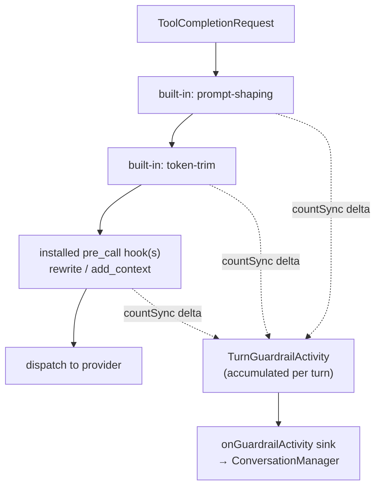

# Guardrail Input Transparency — Design Spec

| Field | Value |
|---|---|
| **Type** | design spec (architecture + implementable) |
| **Status** | draft for discussion |
| **Scope** | specification only — no runtime/CRD/deployment change is authorized here |
| **Parent** | [`mcp-host-guardrails-spec-v3.md`](./mcp-host-guardrails-spec-v3.md) — this extends §7 (LLM lane) and §9 (evidence) |
| **Lane** | **LLM lane only** (decided, §1.2) |

---

## 1 · Overview

### 1.1 · The problem

LLM-lane guardrails silently reshape the prompt before it reaches the model. `token-trim` can drop tens
of thousands of tokens; `prompt-shaping` adds a system part; an installed `may_rewrite` hook (e.g. a
prompt compactor) can rewrite the whole conversation; a `pii-redact` hook can change content without
changing its size.

Today none of that is visible to the person using the desktop app. The parent spec's evidence layer (§9)
emits **Prometheus counters and console logs only** (`mcp-host/src/core/guardrails/metrics.ts`) — an
operator-facing surface. There is no per-session, per-turn record, so a user cannot answer either of the
two questions this spec addresses:

1. **How much did guardrails reduce my input?**
2. **Which guardrails changed my input?**

### 1.2 · Locked decisions

| # | Decision | Choice |
|---|---|---|
| D1 | **Lane scope** | **LLM lane only.** Prompt-shaping contributors that run before the model call. Tool-lane `PreToolUse` `updatedInput` is explicitly out of scope (§10). |
| D2 | **Surface** | **Both** — an expandable per-turn note in the transcript **and** a "Guardrails" section in the existing context-window popover. |
| D3 | **Retention** | **Persisted per turn.** A compact record on each turn survives reload/cold-load, so scrollback always shows what guardrails did. |
| D4 | **Direction** | **Signed net delta per source.** Reductions, additions, and same-size rewrites all appear in one list; the headline is the net. |
| D5 | **Visibility** | **Any desktop user; real names; no hook-supplied text.** Built-ins get first-party display names, installed hooks get their `LlmHook` CR name. Hook-authored `code`/`message` strings are never rendered. |

### 1.3 · What the user sees

Inline, on every assistant turn — collapsed by default, expandable:

```
┌ assistant · turn 7 ─────────────────────────┐
│ Done — the file is updated.                 │
└─────────────────────────────────────────────┘
  12:04    ↑ 84.7k  ↓ 1.2k    🛡 −11.9k  ⌄
                              └ expanded ┐
     token-trim (built-in)        −11.9k │
     prompt-shaping (built-in)     +0.4k │
     prompt-compactor              −0.5k │
     pii-redact                  changed │
```

And in the context-window popover, under the existing bucket rows:

```
Context window                    84.2k/200k (42%)
▇▇▇▇▇▇▇▇▇▇▇▇▇░░░░░░░░░░░░░░░░░
● Messages           61%
● System tools       22%
● Meta context       11%
● System prompt       6%
──────────────────────────────────────────────────
Guardrails            96.6k → 84.7k   (−12%)
  token-trim (built-in)              −11.9k
  prompt-shaping (built-in)           +0.4k
  prompt-compactor                    −0.5k
  pii-redact                         changed
```

---

## 2 · What counts as a guardrail input change

### 2.1 · In scope — the pre-dispatch chain

Everything that mutates the request between `completeWithTools` being called and the request being
dispatched to the provider, i.e. steps 1–2 of `HookedLlmPort.completeWithTools`
(`mcp-host/src/core/adapters/hookedLlmPort.ts:145`):

| Contributor | Kind | Mechanism | Typical delta |
|---|---|---|---|
| `token-trim` | built-in | `applyTokenTrim` rewrites `messages` via `prePrune` | large negative |
| `prompt-shaping` | built-in | `applyPromptShaping` adds a system part / pins params | small positive or zero |
| installed `pre_call` hook with `may_rewrite` | installed | `Contributor.rewrite` replaces the request | negative (compactor) or ~zero (redactor) |
| installed `pre_call` hook with `may_add_context` | installed | bounded `additionalContext` appended as an untrusted message | small positive |

### 2.2 · Explicitly out of scope

- **`moderate` / `post_call` / `on_error` hooks** — they act on the *response*, not the input. A
  `post_call` redaction changes what the user sees, which is a different (and more sensitive) feature.
- **A `deny`** — a denied turn already surfaces to the user as a graceful refusal
  (`refusalResponse`, `hookedLlmPort.ts:87`). It changes nothing about the input, so it produces no row.
- **The aux/compaction lane** — `HookedLlmPort.complete` is a passthrough with no guardrails
  (parent spec §7.4), so there is nothing to record.
- **Non-guardrail reduction** — the context manager's own `prePrune`/compaction runs outside the
  guardrail boundary and is *not* attributed here. This is a real risk of user confusion and is called
  out in §9.2.
- **The tool lane** — see §10.

### 2.3 · Aggregation unit: the turn, summed across LLM calls

One turn makes **many** LLM calls (the initial call plus one per tool-loop continuation), and the
guardrail chain runs on **every one of them**. The record is therefore a **per-turn aggregate summed
across all LLM calls in that turn**, matching how `Turn.input_tokens` already sums per-turn usage
(`mcp-host/src/core/types.ts:455`).

Concretely, per source: `deltaTokens` sums across calls, and `calls` counts how many calls that source
acted on. This is the single most likely thing to get quietly wrong — a naive "last call wins" would
under-report a 20-call turn by an order of magnitude.

> **Contrast with `ContextBreakdown`,** which *overwrites* per call and describes only the most recent
> prompt (`core/types.ts:416`). The guardrail record accumulates instead, because the user's question is
> "what did guardrails do for me this turn", not "what is in my prompt right now".

---

## 3 · Measurement

### 3.1 · Where

Inside `HookedLlmPort.completeWithTools` — the only place that holds both the original request and every
intermediate form. Both surfaces are fed from this one measurement.



### 3.2 · How

`HookedLlmPort` already exposes the token counter (`getTokenCounter()`, `hookedLlmPort.ts:107`), the same
`countSync` the context breakdown uses (`core/reasoning/port.ts:163`). Per LLM call:

1. `before = countSync(nonSystemMessages(request))`.
2. After each chain step, if the step returned a **different object** than it received, count again; the
   difference is that source's delta for this call. If the step returned the same object, it did nothing
   — **skip the count entirely** (this is the common case and must cost nothing).
3. A step that changed the request but produced a delta of `0` is recorded as `changed` (D4) — this is
   how `pii-redact` shows up.

Cost: `1 + N` counts per LLM call where `N` is the number of sources that **actually acted**, on top of
the 4 counts `captureBreakdown` already performs. With no guardrails configured, `maybeWrapHookedLlmPort`
returns the port unwrapped and this code never runs (parent spec §5 no-config compatibility).

### 3.3 · What is counted, and the accuracy caveat

Only **non-system messages** are counted — the exact surface installed hooks are allowed to touch
(parent spec §8.1, system prompt immutable). Tool schemas are excluded (guardrails don't rewrite them).

`countSync` is a **local, best-effort** count — for Anthropic it is a character heuristic, never the
provider's authoritative number (`core/tokenizer/tokenCounter.ts:21`). Two consequences the UI must
respect:

- **The delta and the percentage are trustworthy** — both sides come from the same counter, so the ratio
  is internally consistent even where the absolute values are off.
- **The absolute before/after are estimates** and will not match the turn's billed `input_tokens` (which
  also includes the system prompt and tool schemas). The UI therefore leads with the **delta**, and the
  popover's `96.6k → 84.7k` pair is labelled as an estimate of the *messages* portion — never presented
  as total input. Percentages are computed against `tokensBefore`, not against the context window.

### 3.4 · Failure posture

Measurement is **best-effort telemetry and must never affect a turn.** The whole capture is wrapped in
try/catch and a failure is logged and dropped, exactly as `captureBreakdown` does
(`core/reasoning/port.ts:192`). A tokenizer fault must never deny, delay, or fail a model call.

---

## 4 · Data model

New core type, alongside `ContextBreakdown` in `mcp-host/src/core/types.ts`:

```ts
/** One guardrail source's net effect on the input, summed across a turn's LLM calls. */
export interface GuardrailInputChange {
  /** `guardrails.builtins[].type` for a built-in, or the LlmHook CR name for an installed hook. */
  sourceId: string
  kind: 'builtin' | 'hook'
  /** Signed net token delta (D4). Negative = reduced. 0 with `changed: true` = same-size rewrite. */
  deltaTokens: number
  /** True when the source replaced the request at least once (even at zero delta). */
  changed: boolean
  /** How many LLM calls in this turn this source acted on (§2.3). */
  calls: number
}

/** Per-turn aggregate of LLM-lane guardrail effects on the input. */
export interface TurnGuardrailActivity {
  /** Estimated non-system message tokens before the chain, summed over the turn's calls (§3.3). */
  tokensBefore: number
  /** Same, after the chain. `tokensBefore - tokensAfter` is the headline saving. */
  tokensAfter: number
  changes: GuardrailInputChange[]
  /** Number of LLM calls in this turn whose chain was measured. */
  llmCalls: number
}
```

Bounded by construction: `changes.length` ≤ the configured built-ins plus `maxHooksPerPhase` (parent spec
§5, default 8), so the persisted blob stays small. `sourceId` values come from admin-authored config, not
from hook responses (§8).

**Two homes, one record:**

| Home | Lifetime | Feeds |
|---|---|---|
| `Conversation.guardrailActivity` | RAM, current turn, running aggregate | the context-window popover |
| `messages.guardrail_activity` column | persisted, per turn | the inline transcript note |

---

## 5 · mcp-host — capture, accumulate, persist

### 5.1 · Sink wiring

`maybeWrapHookedLlmPort` gains an optional `onGuardrailActivity` dep, wired in
`taskExecutor.buildLoopConfig` (`mcp-host/src/agent/taskExecutor.ts:1108`) to a new
`ConversationManager.recordGuardrailActivity` — the same shape as the existing breakdown sink two lines
below it (`taskExecutor.ts:1135` → `conversation.ts:395`).

`recordGuardrailActivity(conversation, callRecord)` **merges** the call's record into
`conversation.guardrailActivity` (sum `tokensBefore`/`tokensAfter`, merge `changes` by `sourceId`,
increment `llmCalls`), and resets it when a new turn starts. Like `recordContextBreakdown`, it must
**not** bump `updated_at` — token accounting is not user activity.

### 5.2 · Persistence

Follows the per-turn-token-usage pattern exactly (`db/migrations/005-messages-token-usage.ts`), which
exists for the same reason: attribute a turn-level fact to a turn by stamping its final assistant
message.

- **Migration `013-messages-guardrail-activity`** — `ALTER TABLE messages ADD COLUMN guardrail_activity TEXT`
  (JSON, nullable). Nullable rather than defaulted so "no guardrails ran" and "no record" stay
  distinguishable. FTS-safe for the same reason 005 is: the `messages_fts` triggers reference only
  `new.id`/`new.content`.
- **Stamping** — `persistTurnComplete` and `persistTurnCancel`
  (`persistence/sqliteConversationStore.ts:771` / `:823`) serialize `conversation.guardrailActivity`
  onto the turn-boundary message alongside the existing `input_tokens` fields. A cancelled turn keeps
  its partial record, matching the existing partial-usage stamp.
- **Rehydration** — `groupMessagesIntoTurns` (`persistence/reconstruct.ts:150`) parses the column back
  onto `Turn.guardrailActivity`. Parsing is **tolerant**: a malformed blob is dropped with a log, never
  throwing during cold-load.
- **Known limitation, inherited:** compaction's `replace_messages` rewrites the message set with summary
  rows that carry no per-turn columns, so compacted turns lose the record on cold-load — the identical,
  already-documented limitation for per-turn tokens (`reconstruct.ts:168-174`). Acceptable; the inline
  note simply doesn't render for those turns.

### 5.3 · Wire projections

Two projections in `mcp-host/src/server/wireProjections.ts`, both from the same core type:

- **`projectTurnGuardrails(turn)`** → added to the turn objects in `sessionRouteHandlers.ts:139`,
  beside `tokens` and `tool_steps`. Returns `undefined` when nothing acted, so quiet turns add zero
  bytes to the payload.
- **`projectContextBreakdown(conversation)`** (`wireProjections.ts:164`) gains a `guardrails` field from
  `conversation.guardrailActivity`, likewise omitted when absent.

Reusing the context-breakdown response for the popover is deliberate: it is already fetched on mount, on
open, and force-refetched when a turn completes (`ContextWindowIndicator.tsx:104`). **No new endpoint and
no new fetch hook are needed** — and unlike reading the latest turn out of the message window, it stays
correct when the user has paginated up.

---

## 6 · Transport — rpc-proxy and desktop IPC

No new routes. Both payloads already flow end to end; each file gains one field on an existing type:

| Layer | File | Change |
|---|---|---|
| mcp-host wire types | `mcp-host/src/server/types.ts:574` | `guardrails?` on `ContextBreakdownWire`; new `TurnGuardrailsWire`; field on the turn wire type |
| rpc-proxy | `rpc-proxy/src/routes/rpc.ts` | none — both routes are passthrough |
| desktop types | `desktop-app/src/types.ts:944` | `TurnGuardrailsLite`; field on `ContextBreakdownLite` and on `SessionMessagesResult.turns[]` |
| turn → message adapter | `desktop-app/src/serverTurnAdapter.ts:54` | carry `guardrails` onto the assistant `ChatMessage`, beside `tokens`/`toolSteps` |
| renderer bridge | `rpcProxyClient.ts:919`, `appService.ts:2778`, `ipc.ts:1042`, `preload.ts:338`, `renderer.d.ts:414` | type-only — the breakdown result shape widens |

Because the inline note rides the existing `/messages` turn payload, a completed turn's note appears on
the **same poll that already populates `MessageTokens`** — no new refresh path.

---

## 7 · Desktop UI

### 7.1 · Inline per-turn note

A new `MessageGuardrails` component in `desktop-app/ui/src/components/agents/`, modelled directly on
`MessageTokens.tsx` and rendered next to it in the `chat-message-meta-row` footer
(`ChatThread.tsx:668`), gated on `message.role === 'assistant' && message.guardrails`.

- **Collapsed:** a shield glyph plus the signed net delta (`−11.9k`). Renders **nothing** when no source
  acted — a quiet turn shows no shield, matching `MessageTokens`' "never show a misleading zero" rule
  (`MessageTokens.tsx:18`).
- **Expanded:** the per-source rows of §1.3. Expansion is local component state; it does not refetch.
- Net delta of exactly zero with `changed: true` on some source collapses to a glyph with no number and
  the label `changed`.

### 7.2 · Popover section

A "Guardrails" block appended inside the existing popover in `ContextWindowIndicator.tsx`, below the
bucket rows and above the cache-hit line. Rendered only when `breakdown.guardrails` is present, so cold
sessions and unguarded hosts see exactly today's popover.

### 7.3 · Formatting and styling

- New helpers in `desktop-app/ui/src/lib/format.ts`: `formatSignedTokenDelta` (`−11.9k` / `+0.4k`, reusing
  `formatTokenCount`) and `formatGuardrailPercent`.
- Per `desktop-app/ui/CLAUDE.md`: shared classes go at the end of the relevant section of
  `src/styles.css` — **no new component-level CSS file**. Colors/spacing/type from `tokens.css` only, no
  hardcoded hex or raw px. Compose the `Pill` primitive rather than new markup; no hover `transform` or
  `filter`.
- Accessibility: the collapsed control is a real button with `aria-expanded`, and an `aria-label`
  spelling out the delta in words ("guardrails reduced input by 11.9 thousand tokens").

### 7.4 · Naming (D5)

| Source | Label | Origin |
|---|---|---|
| built-in | `token-trim (built-in)`, `prompt-shaping (built-in)` | first-party display-name map in the UI, keyed by `guardrails.builtins[].type` |
| installed hook | `pii-redact` | the `LlmHook` CR name from `guardrails.hooks[].id` — admin-authored config |

An unrecognized `sourceId` renders verbatim but **escaped and length-capped**, never as a lookup failure.

---

## 8 · Security & redaction

This feature widens what an end user sees, so it inherits the parent spec's evidence discipline (§9) and
adds nothing new to the trust surface.

- **No content, ever.** The record carries counts and admin-authored ids. No message text, no diff, no
  sample of what was trimmed or redacted. A PII redactor's whole purpose is that the removed content
  does not travel; surfacing it here would defeat it.
- **No hook-supplied strings.** A hook's `code`/`message` are untrusted response data (parent spec
  §12.4) and are never rendered — the same reasoning that makes `denyRefusal` map reason codes to canned
  first-party text rather than echo the hook (`hookedLlmPort.ts:47`). `sourceId` comes from
  `Host.spec.guardrails`, which the mcp-host runtime cannot mutate (parent spec §5).
- **Bounded by construction.** `changes[]` is capped by the configured built-in count plus
  `maxHooksPerPhase`; `sourceId` is length-capped at projection.
- **Metrics unchanged.** Nothing here becomes a metric label — the §9 fixed-cardinality rule stands.
- **Ownership unchanged.** Both payloads ride routes already scoped server-side to
  `${userSub}:rpc:${agent}:${chatId}` (`server/routes.ts:1319`); a user can only ever see their own
  session's record.
- **Disclosure accepted (D5):** the guardrail *composition* of a Host — which built-ins and which hook
  names an admin enabled — becomes visible to that Host's users. This is accepted as transparency about
  their own prompt. An admin opt-out flag was considered and deliberately not specified (§11).

---

## 9 · Risks

### 9.1 · Estimated numbers presented as exact

`countSync` is a heuristic (§3.3). Mitigated by leading with the delta, labelling absolutes as
estimates, and never implying the pair matches billed input.

### 9.2 · Attribution gap versus the context manager

The context manager's own `prePrune`/compaction runs **outside** the guardrail boundary, so a user may
see a large drop in context that no guardrail row explains — or, if an operator enables both the
context-manager prePrune and the `token-trim` built-in, see two prunes where only one is attributed
(`builtins/tokenTrim.ts:9` already notes this config overlap). The transparency surface makes a
pre-existing overlap newly visible. Mitigated by the section title being *Guardrails*, scoped by
construction to the guardrail chain, and by §3.3's messages-only framing.

### 9.3 · Persisted blob growth

Bounded per §8, but it is a new JSON column on a hot table. Mitigated by omitting the record entirely on
turns where nothing acted — the common case for most Hosts today.

---

## 10 · Non-goals

- **Tool-lane transparency** (D1). A `PreToolUse` hook rewriting tool arguments is arguably the more
  security-relevant disclosure, but it is a different data path (`toolLaneAdapter.ts`), a different wire
  shape (`tool_steps`), and a different UI surface (`ProgressStepper`). Deferred deliberately.
- **Response-side transparency.** Showing that a `post_call` hook redacted the model's answer is a
  separate, more delicate feature.
- **Session-cumulative totals.** Per-turn notes plus the current-turn popover cover the ask; a
  lifetime "guardrails have saved you N tokens" figure would need either a `sessions` column or a full
  turn scan. Listed as a follow-up.
- **Operator/admin views.** control-ui already has a guardrails dashboard (`control-ui/app/guardrails/`);
  this spec does not touch it.

---

## 11 · Open questions

1. **Should `prompt-shaping` appear at all?** It usually contributes a small positive delta and shapes
   params rather than trimming. Including it is more honest (D4) but adds a row that never varies.
   *Recommendation: include it — a `+0.4k` row is the clearest possible evidence that "guardrails changed
   my input" means more than trimming.*
2. **Admin opt-out.** §8 accepts that hook names become user-visible. If any operator considers their
   guardrail composition sensitive, a `Host.spec.guardrails.exposeToUsers` flag would be a small CRD
   addition — but it is CRD surface added speculatively. *Recommendation: ship without it; add on demand.*
3. **In-flight turns.** The popover shows the running aggregate of an in-flight turn; the inline note
   only appears once the turn completes and persists. *Recommendation: accept the asymmetry — it matches
   `MessageTokens` exactly and avoids a live-update path.*

---

## 12 · Implementation plan

Each phase is independently shippable and verifiable.

### 12.1 · Phase A — capture (mcp-host, no surface)

- `GuardrailInputChange` / `TurnGuardrailActivity` in `core/types.ts`.
- Instrument the chain: `buildLlmBuiltinChain` returns per-step results instead of an opaque composed
  `RequestShaper` (`guardrails/llm/builtinChain.ts:36`); `HookedLlmPort` measures around each built-in
  step and each `pre_call` hook rewrite.
- `ConversationManager.recordGuardrailActivity` + sink wiring in `taskExecutor.buildLoopConfig`.
- **Verifiable by unit test alone.** Nothing user-visible ships.

### 12.2 · Phase B — persistence

- Migration `013-messages-guardrail-activity`; stamp in `persistTurnComplete`/`persistTurnCancel`;
  tolerant parse in `groupMessagesIntoTurns`.
- **Ships:** the record survives restart, still invisible.

### 12.3 · Phase C — wire

- `projectTurnGuardrails` + the `guardrails` field on `projectContextBreakdown`; wire types through
  mcp-host → desktop types → `serverTurnAdapter`.
- **Ships:** the data reaches the renderer; still nothing rendered.

### 12.4 · Phase D — UI

- `MessageGuardrails` in the message footer; the popover section; `format.ts` helpers; `styles.css`
  additions; `npm run style-rules` clean.
- **Ships:** the feature.

### 12.5 · Test plan

| Level | Coverage |
|---|---|
| unit — measurement | delta signs; a no-op step costs zero counts; same-size rewrite ⇒ `changed: true, delta: 0`; a tokenizer throw never propagates |
| unit — aggregation | multi-call turn sums per source and increments `calls` (§2.3 — the regression that matters most) |
| unit — persistence | round-trip through the column; malformed blob is dropped not thrown; cancelled turn keeps its partial record |
| unit — projection | omitted when nothing acted; `sourceId` capped |
| component | note hidden on a quiet turn; expand/collapse; `aria-expanded`; popover section absent without data |
| integration | end-to-end alongside `contextBreakdownEndToEnd.test.ts` |
| regression | a Host with **no** guardrails configured produces byte-identical `/messages` and `/context-breakdown` payloads |
