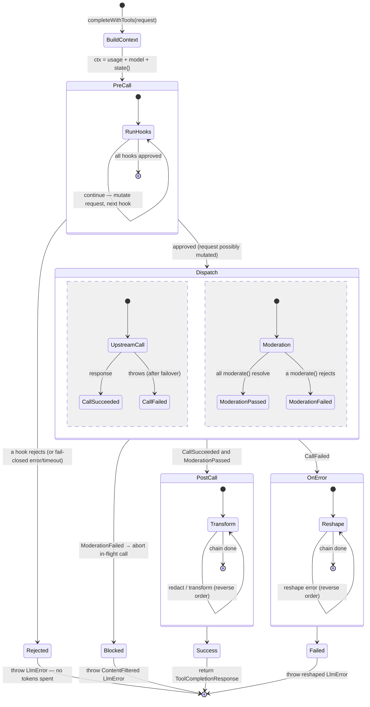
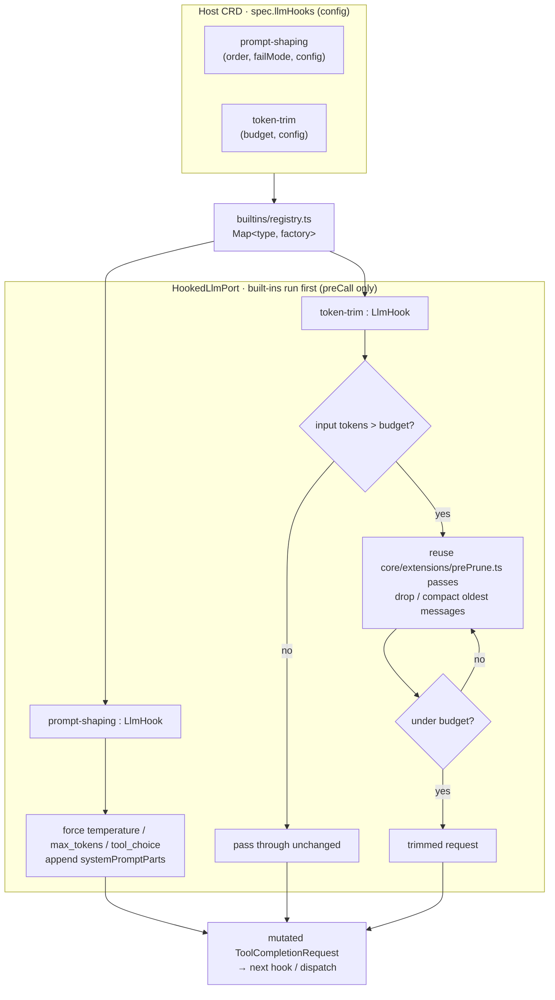

# Spec · LLM hooks — implementation & marketplace install (v2)

**Type:** design spec (implementable) · **Date:** 2026-08-10 · **Status:** draft for approval
**Code head:** `evenfire` @ `dev`
**Model:** a request-lifecycle hook chain (`pre_call` / `moderation` / `post_call_success` /
`post_call_failure`) realized **in-process** at the mcp-host `LlmPort` seam, with a second class of
hook that is an **installable marketplace artifact running in its own pod**.

> v2 supersedes the conceptual v1: two hook classes, dedicated `LlmHook` CRD, and a
> `/admin/registry/install-hook` saga. This doc is implementation-first.

---

## 0 · The two hook classes

| Class | Runs where | Examples | Distribution | Trust |
|---|---|---|---|---|
| **Built-in** | inside mcp-host (`HookedLlmPort` + `core/extensions/prePrune.ts`) | `prompt-shaping`, `token-trim` | compiled into mcp-host, enabled by config | first-party |
| **Remote** | its own pod/image (Deployment+Service+NetworkPolicy) | `guardrail`, `pii-redact` (3rd-party) | **marketplace** → `LlmHook` CRD | image-allowlist + sha256 digest + egress policy + trust_level |

Both classes implement the **same `LlmHook` interface** and run in the **same ordered chain** at the
same seam. A remote hook is just an `LlmHook` whose methods make an HTTP call to its pod. Third-party
code never runs inside the mcp-host process (which holds LLM credentials + conversation state).

---

## 1 · Runtime seam (shared by both classes)

Every completion funnels through `LlmPort.completeWithTools` (`mcp-host/src/core/interfaces.ts:33`);
`LlmPortAdapter` (`core/adapters/llmPortAdapter.ts:93`) is the one implementation, sitting under an
optional `FailoverLlmPort` (`core/adapters/failoverLlmPort.ts:56`). We insert a decorator **above
failover** so each hook fires **once per logical request**.

### 1.1 · `LlmHook` interface · `mcp-host/src/llm/hooks/types.ts` (new)
```ts
export interface LlmHookContext {
  readonly callType: 'complete' | 'completeWithTools'
  readonly model: string
  readonly provider: LlmProvider
  readonly host: { hostRef?: string; contextRef?: string }   // NOT llmSecretName — see §6
  readonly usage?: UsageContext            // user_id, team_id, recipe_name, task_id, traceContext
  readonly signal?: AbortSignal
  readonly state: Record<string, unknown>  // mutable, shared across ONE request's hooks
}
export type PreCallOutcome =
  | { action: 'continue'; request?: ToolCompletionRequest }  // optionally-mutated request
  | { action: 'reject'; error: LlmError }                    // veto before any tokens spent
export interface LlmHook {
  readonly name: string
  readonly failMode: 'open' | 'closed'
  readonly timeoutMs: number
  preCall?(req: ToolCompletionRequest, ctx: LlmHookContext): Promise<PreCallOutcome>
  moderate?(req: ToolCompletionRequest, ctx: LlmHookContext): Promise<void>            // throw = fail
  postCallSuccess?(req: ToolCompletionRequest, res: ToolCompletionResponse, ctx: LlmHookContext): Promise<ToolCompletionResponse>
  onError?(req: ToolCompletionRequest, err: LlmError, ctx: LlmHookContext): Promise<LlmError>
}
```

### 1.2 · `HookedLlmPort` decorator · `mcp-host/src/core/adapters/hookedLlmPort.ts` (new)
Implements `LlmPort`, wraps an inner `LlmPort`, holds `readonly hooks: LlmHook[]` (built-ins first,
then remote hooks by `order`). Behavior:
- **preCall** in order; thread the mutated request forward; `reject` → throw immediately (no
  dispatch). Thrown/timed-out hook obeys `failMode` (closed → reject, open → skip + warn metric).
- **moderate ‖ dispatch**: `linkedAbort` chained to `req.signal`; `Promise.all([inner.completeWithTools(req), ...moderate()])`.
  A rejected `moderate` calls `linkedAbort.abort()` and throws a `ContentFiltered` `LlmError`
  (`core/errors.ts`). Succeeds only when the call **and** every moderation resolve.
- **postCallSuccess** folds in **reverse** order (onion). **onError** folds inner throw (after
  failover) in reverse order. `modelName()`/`getTokenCounter?()` delegate to inner.
- Per-hook calls wrapped in `withTimeout(hook.timeoutMs)`.

### 1.3 · Lifecycle state machine



### 1.4 · Wiring · `mcp-host/src/agent/taskExecutor.ts`
In `buildLoopConfig` (`taskExecutor.ts:1057`), after `effectiveLlmPort` is built (primary or
failover-wrapped, `:1017–1055`): `effectiveLlmPort = new HookedLlmPort(effectiveLlmPort, chain)`.
Build `LlmHookContext.usage` from the existing `buildDefaultUsageContext()` (`:1436`). The compaction
lane (`stateMachine.ts:821`) gets only built-in trim/observability hooks (flag on the chain builder).

---

## 2 · Built-in hooks (in-process, first-party)

Implement as `LlmHook`s compiled into mcp-host, under `mcp-host/src/llm/hooks/builtins/`:
| type | method(s) | implementation notes |
|---|---|---|
| `prompt-shaping` | `preCall` | inject a system `systemPromptParts` entry; force `temperature`/`max_tokens`/`tool_choice`. |
| `token-trim` | `preCall` | reduce **input** tokens to a budget; **reuse the existing `core/extensions/prePrune.ts` passes** internally (they already do toggleable pre-LLM context pruning) — the hook is a thin `LlmHook` wrapper so ordering/config are uniform with the chain. |

Registered in a `Map<type, (config)=>LlmHook>` (`mcp-host/src/llm/hooks/builtins/registry.ts`),
enabled/ordered via config (§4). No marketplace, no network hop.



Both built-ins are `preCall`-only (no `moderate`/`postCall`); they mutate the request and hand it to
the next hook. Remote marketplace hooks (§3) run **after** the built-ins, by `order`.

---

## 3 · Remote hooks (installable, own pod)

### 3.1 · `RemoteLlmHook` adapter · `mcp-host/src/llm/hooks/remoteHook.ts` (new)
An `LlmHook` whose methods POST to the hook pod's in-cluster `Service`. Constructed from an `LlmHook`
CRD (§3.3). Only the lifecycle methods the CRD's `lifecyclePoints` declare are wired; others are
`undefined` (skipped by the chain).

### 3.2 · Hook protocol (HTTP/JSON, `mcp-host → hook Service`)
Versioned under `/v1`. mcp-host authenticates with a short-lived RS256 token (reuse the broker-token
signer pattern, `control-api/src/utils/auth/*`) and the connection is confined by NetworkPolicy.
| Endpoint | Request body (redacted projection — §6) | Response |
|---|---|---|
| `POST /v1/pre_call` | `{ messages, tools?, model, params, usage, state, config }` | `{ action:'continue', patch?:{messages?,params?,systemPromptParts?} } \| { action:'reject', code, message }` |
| `POST /v1/moderate` | `{ messages, model, usage, config }` | `200 {}` = pass · `4xx { code, message }` = fail |
| `POST /v1/post_call` | `{ response:{content,tool_calls,finish_reason}, usage, state, config }` | `{ response }` (possibly redacted) |
| `POST /v1/on_error` | `{ error:{code,message,retryable}, usage, state, config }` | `{ error:{code,message} }` |

`RemoteLlmHook` maps a `pre_call` `patch` onto the local `ToolCompletionRequest` (mcp-host applies the
patch — the hook never gets the raw request object), and maps `reject`/moderation-4xx onto an
`LlmError`. `timeoutMs`/`failMode` come from the CRD.

### 3.3 · `LlmHook` CRD · `charts/clerum-crds/crds/llmhook.yaml` (new)
Namespaced `clerum.io/v1alpha1`, **modeled field-for-field on `mcpserver.yaml`** so it reuses the
same image-trust + egress machinery. Reconciled by the **host-context-controller** into
Deployment+Service+NetworkPolicy (new `host-context-controller/src/llmHookReconciler.ts`, mirroring
the McpServer reconcile).
```yaml
spec:
  image: registry.evenfire.ai/hooks/pii-redact:1.2.0   # required; image-allowlist enforced
  imagePullSecrets: [ ... ]                             # reuse evenfire-registry-pull
  port: 8080
  lifecyclePoints: [preCall, moderate, postCallSuccess, onError]   # which /v1 endpoints it serves
  order: 100                                            # chain position (built-ins run before)
  scope: context                                        # global | context (see §3.4) — DECIDED: both supported
  failMode: closed                                      # closed = a hook failure rejects the request
  timeoutMs: 5000
  onUnavailable:                                        # per-hook down-behavior (DECIDED)
    mode: breaker                                       # breaker | strict
    failureThreshold: 5                                 # trips after N consecutive failures
    cooldownMs: 30000                                   # fail-open + alert while tripped; re-probe after
  appliesTo:                                            # which requests this intercepts
    models: ['*']
    sourceKinds: ['channel','desktop','workflow']
  config: { ... }                                       # opaque, passed to the hook
  envSecret: pii-redact-creds                           # hook's OWN credentials (not the LLM secret)
  egressBindings: [ { toFQDN: moderation.vendor.com, ports:[443] } ]  # hook's outbound allowlist
  security: { addCapabilities: [] }
  managed: true                                         # owned by HCC vs authored directly
```
- **`scope`** (DECIDED — both): `global` hooks live in the operator namespace and apply to every Host;
  `context` hooks live in the Context/team namespace and apply only there. mcp-host merges both (§3.4).
- **`onUnavailable`** (DECIDED — per-hook): `strict` = a down fail-closed hook blocks every call;
  `breaker` = after `failureThreshold` consecutive failures the hook trips to fail-open (loud
  metric/alert) for `cooldownMs`, then re-probes. `RemoteLlmHook` owns the breaker state.

**NetworkPolicy** (generated): ingress **only** from mcp-host pods on `port`; egress **only** per
`egressBindings`. **Capability floor** reuses `@clerum/workflow-recipe-capability-policy`.

### 3.4 · mcp-host discovery + hot reload · `mcp-host/src/llm/hooks/hookChainProvider.ts` (new)
mcp-host **watches `LlmHook` CRDs** in **two scopes** (DECIDED — both global + per-Context): the
operator namespace (`scope: global`) and its own Context namespace (`scope: context`). It filters by
`appliesTo`, builds `RemoteLlmHook`s, and orders the chain as: **built-ins → global remote (by
`order`) → context remote (by `order`)**. Rebuild on CRD add/update/delete in either scope and hand
to the loop (hot reload, mirroring `main.ts` `refreshFailoverPolicy:406`). Each `RemoteLlmHook` owns
its `onUnavailable` breaker state so a down hook degrades per its declared mode, not globally.

---

## 4 · Config (built-ins) · Host CRD + `mcp-host/src/config.ts`
Built-in hook selection/order stays on the Host CRD (`spec.llmHooks`, parsed by
`mcp-host/src/llm/hooks/parseLlmHooks.ts`, hot-reloaded like `spec.llmPolicy`). Remote hooks are
**not** listed here — their presence is the `LlmHook` CRD itself. `CLERUM_LLM_HOOK_TIMEOUT_MS` default.

---

## 5 · Marketplace registration & install (answering "how do they get into the registry")

Clone the connector path end-to-end. Nothing new in the trust model.

### 5.1 · Registry entry type · `control-api/src/services/registryClient.ts`
Add `'llm_hook'` to `RegistryEntry.entry_type` (`registryClient.ts:198`) with a `hook_meta`:
`{ image, lifecyclePoints[], credential_schema, defaultConfig, requiredEgress[], appliesToDefaults }`.
`getEntryVersion` / `credential-schema` / `bundle` / `digest` already generic — reused as-is.

### 5.2 · Install saga · `control-api/src/routes/admin/registry.ts`
New `POST /admin/registry/install-hook`, cloned from `install-recipe` (`:1360+`) / `install` (`:961`):
1. `getEntryVersion` → **verify bundle `sha256` digest** (tamper check, cf. `:999`).
2. Fetch + validate `credential_schema`; create a K8s `Secret` from user creds (cf. `:1214`).
3. Build the `LlmHook` spec from `hook_meta` (image, port, lifecyclePoints, egress, envSecret ref).
4. **Image-allowlist preflight** via `@clerum/image-policy` `classifyPluginImage` (cf. `:1174`).
5. Stamp `clerum.io/catalog-id` + `catalog-version` annotations (`catalogAnnotations`, `:102`).
6. Create the `LlmHook` CRD; **rollback saga** on any failure (delete CRD + Secret).
7. Fire-and-forget `reportInstall` (`:1331`).

### 5.3 · Installed-state + catalog · `registry.ts:658`
Extend `getInstalledRegistryState` to list `LlmHook` CRDs and match by `catalog-id`, so
`GET /admin/registry/catalog` (`:718`) shows hooks as "installed."

### 5.4 · control-ui
Add a **"Guardrails / Hooks"** tab to `components/MarketplaceTabs.tsx`; an install form cloned from
`components/RegistryInstallForm/` (credential-schema-driven); surface `trust_level`/`quality_tier`
(already on the entry). Route alias `/marketplace/hooks → /registry`.

### 5.5 · Trust — 100% reuse
Image allowlist (`@clerum/image-policy`, `config.allowedPluginImagePrefixes`), sha256 bundle digest,
per-org pull secret (`registryPullSecretService`), capability whitelist
(`@clerum/workflow-recipe-capability-policy`), `trust_level`/`quality_tier`, install-time credential
`Secret`, per-workload egress NetworkPolicy. **No new trust primitives.**

### 5.6 · Publish/author path
A hook author ships a container image implementing the `/v1` protocol + a registry manifest
(`entry_type: llm_hook`, `hook_meta`). Publish via `POST /admin/registry/entries` (`publishEntry`,
`:764`) with org scoping. A reference hook image + template lives under `mcp-servers/`-style samples.

---

## 6 · Security invariants
- **No third-party code in the mcp-host pod** — remote hooks run in their own pod; mcp-host only makes
  an authenticated HTTP call.
- **Hooks never receive LLM provider credentials.** `LlmHookContext.host` omits `llmSecretName`.
- **Content exposure is need-based + trust-gated** (DECIDED). A remote hook receives message/response
  **content** only for the lifecycle points that require it — `moderate`/`postCallSuccess` get content,
  `preCall` param-shaping gets model+params+metadata but not message bodies — **and** only if the
  entry's `trust_level` clears a configurable bar (`config.minHookTrustLevel`); below the bar, install
  is refused or the hook is content-starved. Every content-bearing hook call is audit-logged
  (hook name, lifecycle point, request id — not the content).
- Hook's **own** credentials live in its **own** `Secret` (`envSecret`), never the LLM secret.
- NetworkPolicy: hook ingress **only** from mcp-host; egress **only** per `egressBindings`.
- **Fail-closed** default for `guardrail`/`pii-redact`; `token-trim`/observability fail-open. Per-hook.
- Bounded per-hook `timeoutMs`; a slow/hung hook cannot stall the reasoning loop; a rejected
  `moderate` **aborts** the in-flight call so no tokens are wasted.
- `postCallSuccess` redaction runs **before** the response reaches the caller; telemetry stays in the
  adapter below on raw counts (redacted content never re-serialized to logs/billing).
- Install-time: image allowlist + sha256 digest + trust_level surfaced for consent.

---

## 7 · Sequencing / PRs
1. **PR1 (runtime core):** `LlmHook` types + `HookedLlmPort` + built-ins (`prompt-shaping`,
   `token-trim` on prePrune) + `taskExecutor` wiring. Remote chain empty. Unit tests. No marketplace.
2. **PR2 (remote plumbing):** hook `/v1` protocol + `RemoteLlmHook` + `LlmHook` CRD + HCC
   `llmHookReconciler` + mcp-host watch/`hookChainProvider` + hot reload.
3. **PR3 (control-api marketplace):** `entry_type: llm_hook`, `install-hook` saga, installed-state,
   trust reuse.
4. **PR4 (control-ui):** marketplace Hooks tab + install form + installed badges.
5. **PR5:** metrics, docs (`docs/llm-providers/llm-hooks.md`), reference hook image.

## 8 · Decisions (resolved) / risks
1. **Dedicated `LlmHook` CRD** (not a WorkflowRecipe capability block) → independent lifecycle + its
   own marketplace `entry_type`; recipe-bundled hooks can be a later fast-follow. *(decided)*
2. **Two classes:** built-ins in-process (no hop) vs remote (marketplace). *(decided)*
3. **Install scope = both** `global` (operator ns, all Hosts) **and** `context` (team ns); merge order
   built-ins → global → context. *(decided, §3.3/§3.4)*
4. **Down-behavior = per-hook** `onUnavailable: strict | breaker`; breaker trips to fail-open with
   alerting after N failures, re-probes after cooldown. *(decided, §3.3)*
5. **Block UX = hard block:** a rejected `moderate`/pre-call surfaces a `ContentFiltered` `LlmError` to
   the caller (no advisory or canned-response mode in v1). *(decided)*
6. **Content exposure = need-based + trust-gated** (§6): content only to lifecycle points that need it,
   gated by `trust_level`, audit-logged. *(decided)*
7. **`onError` is reshape-only** in v1 (no canned-response recovery). *(open — confirm)*
8. **Latency:** each remote hook is a round-trip; mitigations — moderation runs in parallel, built-ins
   in-proc, per-hook timeout, `appliesTo` scoping. **Streaming** stays out (single-shot lane).
9. **Protocol versioning:** `/v1` prefix; CRD `lifecyclePoints` must match what the image serves
   (declared in `hook_meta`, probed at install).
10. **Registry dependency:** `entry_type: 'llm_hook'` + `hook_meta` require the external
    `evenfire-registry` service to add the type. *(open — coordination)*

## 9 · Verification
1. **HookedLlmPort unit tests** (mock inner + fake hooks): preCall order/mutation/reject-no-dispatch;
   parallel moderation fail aborts the call; postCall reverse fold; onError reshape; per-hook
   timeout + `failMode`; empty chain = pass-through.
2. **Built-in tests:** `token-trim` brings an over-budget message set under budget via the real token
   counter; `prompt-shaping` forces params + injects a system part.
3. **RemoteLlmHook tests** (mock hook server): each `/v1` endpoint mapped correctly; reject/4xx →
   `LlmError`; patch application; timeout → `failMode`.
4. **CRD/reconciler tests:** HCC materializes Deployment+Service+NetworkPolicy; ingress-from-mcp-host
   only; egress per `egressBindings`; capability floor.
5. **Install saga tests** (mock registry): digest mismatch rejects; credential Secret created; CRD
   stamped with catalog-id; rollback on failure; installed-state reflects the hook.
6. **Integration:** install a reference `pii-redact` hook from a mock registry → it appears installed
   → a reasoning turn's response is redacted by the remote hook, fired once across a failover.
7. Confirm no LLM secret ever appears in a hook request body or hook logs.
