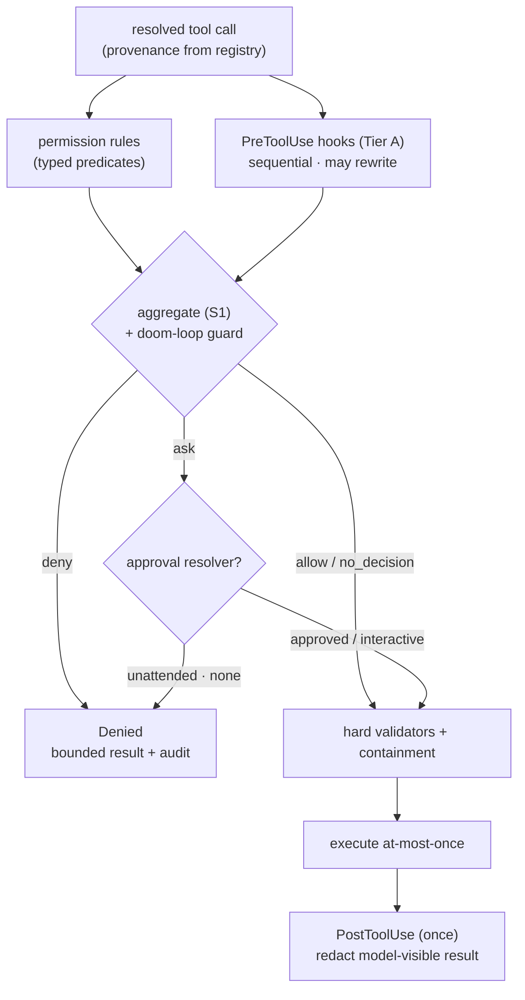

# S2 · Tool-lane adapter

|  |  |
|---|---|
| **Type** | design spec (lane adapter) |
| **Status** | draft for discussion |
| **Conforms to** | S1 [core](./01-guardrail-core.md) · **Consumes** S4 [trust & delivery](./04-hook-trust-and-delivery.md) (Tier A) |
| **Source of record** | the colleague's draft *MCP Host Guardrails — Permission Rules, Hooks & Admin Policy* (full tool-lane detail); this adapter re-homes it on S1/S4 |

Specializes the `GuardrailBoundary` over **tool execution** (native + MCP tools). Everything not below —
the decision algebra, aggregation, at-most-once/resume, admin policy, audit — comes from S1; hook
execution (Tier A local child-processes) comes from S4.

---

## 1 · Lane types

- **`Input`** = resolved-tool arguments; **`Result`** = the tool result; **`ResolvedIdentity`** = the real
  tool after dynamic-bridge resolution.
- **Provenance** (`native` vs `mcp`, server + name) comes from the **registry**, never inferred from a
  `__` name pattern. A `clerum__tool_call` bridge rule evaluates the *resolved* target; it MAY additionally
  constrain the original bridge identity but never instead of the resolved target.



## 2 · Permission rules (declarative contributors)

`Host.spec.guardrails.rules[]` with `action: allow | ask | deny`, matched on provenance + **typed
argument predicates**. Schema — `Host.spec.guardrails`, additive on the Host CRD:

```yaml
guardrails:
  type: object
  properties:
    rules:
      type: array
      items:
        type: object
        required: [id, action, match]
        properties:
          id:         { type: string }
          action:     { type: string, enum: [allow, ask, deny] }
          reasonCode: { type: string }
          match:
            type: object
            required: [tool]
            properties:
              tool:
                type: object
                required: [provenance]
                properties:
                  provenance: { type: string, enum: [native, mcp] }
                  server:     { type: string }
                  name:       { type: string }
              arguments:
                type: array
                items:
                  type: object
                  required: [type, pointer, op]
                  properties:
                    type:    { type: string, enum: [path, url, command, json] }
                    pointer: { type: string }                    # constrained RFC 6901 JSON Pointer
                    op:      { type: string }                    # per type — see the predicate list below
                    value:   { x-kubernetes-preserve-unknown-fields: true }
    hooks:
      type: object
      properties:
        preToolUse:  { type: array, items: { type: string } }   # hook ids — must be in adminPolicy.allowedHooks
        postToolUse: { type: array, items: { type: string } }
```

Predicate `op` values by `type`:

- **`path`** — `equals | under | outside`; normalized, symlink-aware, boundary-safe containment; prefix
  strings are forbidden.
- **`url`** — `scheme_in | host_in | port_in | path_under`; parsed + normalized; credentials-in-URL rejected.
- **`command`** — `executable_is | argv_prefix`; a structured executable + argv, not a parsed shell string.
- **`json`** — `exists | equals | one_of | contains`; size- and depth-bounded; object-key order canonicalized.

Predicates name constrained RFC-6901 JSON Pointers; invalid pointers / excess depth / excess count / over-
limit values are **rejected at admission**. Wildcards support only `*` and `?`, anchored, bounded length
— no regex. Array order is never security precedence (all matching rules contribute; S1 aggregates).

Unmatched default follows S1: non-empty rules → `ask`; absent → `no_decision` (defer to the existing approval path).

## 3 · Pre/PostToolUse hooks (Tier A)

Executable contributors, delivered as **Tier A** local hooks (S4): admin-allowlisted, digest-verified,
least-privilege child processes, no shell, no secrets, bounded stdio.

- **PreToolUse** — runs sequentially **before** approval; returns `{decision, reasonCode, updatedInput,
  additionalContext}`. `updatedInput` (only with `allow`/`ask`) is a full input replacement, canonicalized
  + revalidated (S1 §4). Failure/timeout/digest-mismatch → declared fail-mode (decision-making pre hooks
  default **closed**).
- **PostToolUse** — runs **once** after the single execution attempt; may redact/replace the *model-visible*
  result, add bounded context, or recommend stop. It **cannot** undo side effects, mark the execution
  denied, or alter the stored outcome (S1 §5/§6).

## 4 · Approvals — interactive & unattended

Execution mode is set by the **availability of an exact-call approval resolver**, not by cron origin.

- **Interactive** (`ask`/`force_ask`): one pending request bound to the resolved tool + effective-input
  digest + rule/hook digests; choices are `approve_once | deny`. A broad wildcard/prior approval **cannot** satisfy
  an explicit `ask`. This creates no persistent rule.
- **Unattended:** explicit `deny` → deny; `ask` with no resolver → **deny** (`approval_unavailable`); `allow`
  → proceed through hard validators + containment; `no_decision` → preserve current unattended behavior.
- The existing `*`, exact-tool, and MCP-server approvals apply **only** inside `no_decision`/defer.

Snapshot/resume for suspended calls uses S1 §5; batches are left-to-right with earlier denied/completed
results preserved.

## 5 · Doom-loop guard

Within one task, three consecutive identical `(resolved tool, effective-input digest)` calls →
`deny (repeated_identical_call)`. Any intervening different tool or input resets the counter; the counter
is persisted with task state.

## 6 · Persistence / prompt-injection hardening

Rules and hooks evaluate memory and file tools including canonical paths after rewrites, but **path denial
is not a substitute for content scanning**: raw `file_write` MUST route through the `WorkspaceService`
scanner, and `daily/*` memory is treated as prompt-affecting persistent state.

## 7 · Hard validators & containment (unchanged)

Existing structural validators, MCP scoping, token restrictions, NetworkPolicy, and the stateless
cron-manage containment remain authoritative and independent of guardrail outcome — a guardrail `allow`
never bypasses them.
