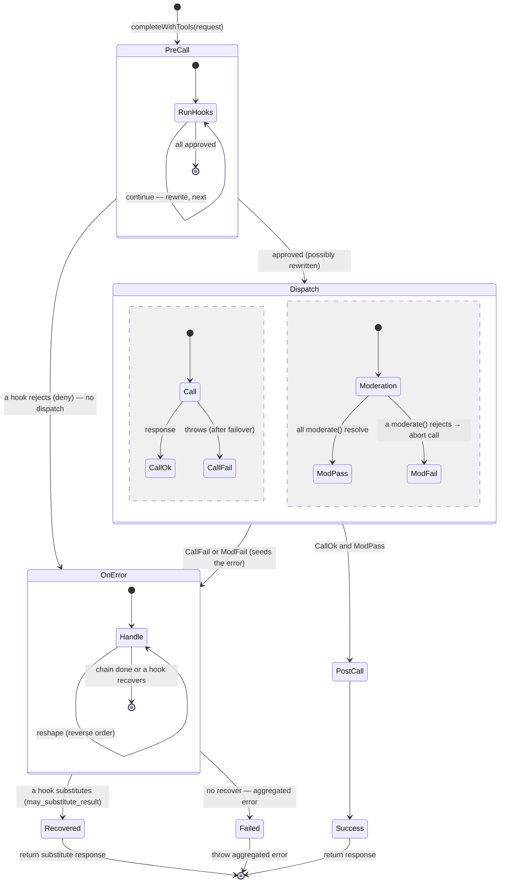

# S3 · LLM-lane adapter

|  |  |
|---|---|
| **Type** | design spec (lane adapter) |
| **Status** | draft for discussion |
| **Conforms to** | S1 [core](./01-guardrail-core.md) · **Consumes** S4 [trust & delivery](./04-hook-trust-and-delivery.md) (Tier A built-ins + Tier B remote) |

Specializes the `GuardrailBoundary` over the **LLM completion call**. Decision algebra, aggregation,
at-most-once, admin policy, and audit come from S1; hook delivery (in-process built-ins and remote hooks)
comes from S4.

---

## 1 · Lane types & placement

- **`Input`** = the `ToolCompletionRequest` (messages, tools, params, `usageContext`); **`Result`** =
  the `ToolCompletionResponse`; **`ResolvedIdentity`** = model + provider.
- The boundary is a **`HookedLlmPort`** decorator (`mcp-host/src/core/adapters/hookedLlmPort.ts`) wrapping
  the effective `LlmPort` **above failover**, so contributors fire **once per logical request**, not per
  fallback attempt. Wired in `taskExecutor.buildLoopConfig`.

## 2 · Lifecycle → S1 contributor mapping

| LLM-lane point | S1 contributor |
|---|---|
| `pre_call` (mutate) | `pre` contributor with `rewrite` (`may_rewrite`) |
| `pre_call` (reject) / `moderation` fail | `pre` contributor `decision: deny` (`ContentFiltered`) |
| `post_call_success` | `post` contributor transforming the model-visible `Result` |
| `on_error` recover | `post`/error contributor with `substitute` (`may_substitute_result`, S4-gated) |
| `token-trim` / `prompt-shaping` | `pre` contributors with `rewrite` |

**Moderation runs concurrently** with the upstream call (`Promise.all([call, ...moderate()])`); a
moderation `deny` aborts the in-flight call via a linked `AbortSignal` so no tokens are wasted. The happy
path (call ok **and** all moderation pass) proceeds to `post`. A `pre` reject, a moderation block, and a
call failure all converge on the `on_error` contributor chain, where a gated hook may `substitute` a safe
`Result` (bypassing `post`, never model output) or the aggregated error surfaces.

### 2.1 · Lifecycle state machine



`OnError` is the single convergence point for a `pre` reject, a moderation block, and a call failure; any
gated hook may `recover` (return a safe response) instead of surfacing the error.

## 3 · Built-in hooks (in-process, Tier A)

First-party, compiled into mcp-host, no network — Tier-A-equivalent (S4):

- **`prompt-shaping`** — inject a system prompt part; force `temperature`/`max_tokens`/`tool_choice`.
- **`token-trim`** — reduce input tokens to a budget, reusing the existing `core/extensions/prePrune.ts`
  passes; exposed as an `LlmHook` so ordering/config are uniform with the chain.

Both are `pre`-only rewrite contributors. Registered in `mcp-host/src/llm/hooks/builtins/registry.ts`,
selected/ordered by `Host.spec.llmHooks`.

## 4 · Remote hooks (Tier B)

Guardrail / PII-redaction and other third-party contributors run as **Tier B** hooks (S4): remote
services reached over the `/v1` protocol, declared by an `LlmHook` CR, `trust_level`-gated, and delivered
by any of the three modes (self-hosted pod / in-cluster Service / direct external egress). Their content
exposure is need-based + trust-gated (S4); mcp-host discovers them by watching the CRs and orders the
chain **built-ins → global remote → context remote**.

## 5 · Aux/compaction lane

The internal summarization/compaction calls (`stateMachine.ts`) run only **`token-trim` + observability**
contributors — no guardrail/PII on internal calls — via an explicit per-lane flag on the chain builder.

## 6 · Config — `Host.spec.llmHooks` (additive field on the Host CRD)

Built-in selection/order lives on `Host.spec.llmHooks`, parsed by `mcp-host/src/llm/hooks/parseLlmHooks.ts`
and hot-reloaded like `spec.llmPolicy`. Remote hooks are declared by their `LlmHook` CR (S4), not here.
Schema (rendered into the Host CRD `openAPIV3Schema`):

```yaml
llmHooks:
  type: array
  items:
    type: object
    required: [type]
    properties:
      type:      { type: string, enum: [prompt-shaping, token-trim] }
      order:     { type: integer, default: 100 }
      failMode:  { type: string, enum: [open, closed] }
      timeoutMs: { type: integer, minimum: 1 }
      config:    { type: object, x-kubernetes-preserve-unknown-fields: true }
```

## 7 · Lane-specific notes

`ask`/human approval is generally **unused** on this lane (S0 open decision 1) — the LLM adapter typically
uses only `allow`/`deny`/`no_decision`. `HookedLlmPort` placement above failover and the built-ins are
lane mechanics that stay here, not in S1.
