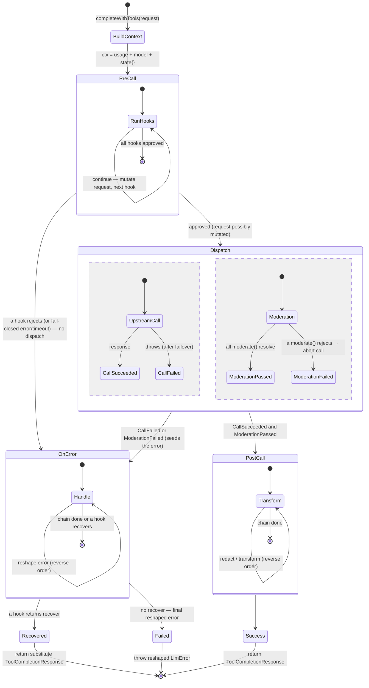
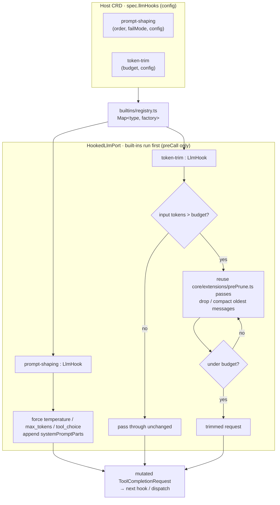

# Spec · LLM hooks — implementation & marketplace install

|  |  |
|---|---|
| **Type** | design spec (implementable) |
| **Date** | 2026-08-10 |
| **Status** | draft for approval |
| **Code head** | `evenfire` @ `dev` |
| **Model** | a request-lifecycle hook chain (`pre_call` / `moderation` / `post_call_success` / `post_call_failure`) realized **in-process** at the mcp-host `LlmPort` seam, plus a second class of hook that is an **installable marketplace artifact running out-of-process** (a self-hosted pod, an in-cluster Service, or an external endpoint) |

---

## 0 · The two hook classes

| Class | Runs where | Examples | Distribution | Trust |
|---|---|---|---|---|
| **Built-in** | inside mcp-host (`HookedLlmPort` + `core/extensions/prePrune.ts`) | `prompt-shaping`, `token-trim` | compiled into mcp-host, enabled by config | first-party |
| **Remote** | out-of-process: self-hosted pod, in-cluster Service, or external endpoint (§3) | `guardrail`, `pii-redact` (3rd-party) | **marketplace** → `LlmHook` CRD | image-allowlist + sha256 digest + egress policy + trust_level |

Both classes implement the **same `LlmHook` interface** and run in the **same ordered chain** at the
same seam. A remote hook is just an `LlmHook` whose methods make an HTTP call to its pod. Third-party
code never runs inside the mcp-host process (which holds LLM credentials + conversation state).

---

## 1 · Runtime seam (shared by both classes)

Every completion funnels through `LlmPort.completeWithTools` (`mcp-host/src/core/interfaces.ts:33`);
`LlmPortAdapter` (`core/adapters/llmPortAdapter.ts:93`) is the one implementation, sitting under an
optional `FailoverLlmPort` (`core/adapters/failoverLlmPort.ts:56`). We insert a decorator **above
failover** so each hook fires **once per logical request**.

### 1.1 · `LlmHook` interface · `mcp-host/src/llm/hooks/types.ts` (new)
```ts
export interface LlmHookContext {
  readonly callType: 'complete' | 'completeWithTools'
  readonly model: string
  readonly provider: LlmProvider
  readonly host: { hostRef?: string; contextRef?: string }   // NOT llmSecretName — see §6
  readonly usage?: UsageContext            // user_id, team_id, recipe_name, task_id, traceContext
  readonly signal?: AbortSignal
  readonly state: Record<string, unknown>  // mutable, shared across ONE request's hooks
}
export type PreCallOutcome =
  | { action: 'continue'; request?: ToolCompletionRequest }  // optionally-mutated request
  | { action: 'reject'; error: LlmError }                    // veto before any tokens spent
export type OnErrorOutcome =
  | { action: 'reshape'; error: LlmError }                    // transform the surfaced error
  | { action: 'recover'; response: ToolCompletionResponse }   // substitute a safe response
export interface LlmHook {
  readonly name: string
  readonly failMode: 'open' | 'closed'
  readonly timeoutMs: number
  preCall?(req: ToolCompletionRequest, ctx: LlmHookContext): Promise<PreCallOutcome>
  moderate?(req: ToolCompletionRequest, ctx: LlmHookContext): Promise<void>            // throw = fail
  postCallSuccess?(req: ToolCompletionRequest, res: ToolCompletionResponse, ctx: LlmHookContext): Promise<ToolCompletionResponse>
  // Invoked whenever the request fails to produce a model response — a preCall
  // reject, a moderation block, or a call failure (after failover). May reshape
  // the surfaced error OR RECOVER with a substitute response. `recover` is
  // trust-gated + audited (§6).
  onError?(req: ToolCompletionRequest, err: LlmError, ctx: LlmHookContext): Promise<OnErrorOutcome>
}
```

### 1.2 · `HookedLlmPort` decorator · `mcp-host/src/core/adapters/hookedLlmPort.ts` (new)
Implements `LlmPort`, wraps an inner `LlmPort`, holds `readonly hooks: LlmHook[]` (built-ins first,
then remote hooks by `order`). Behavior:
- **preCall** in order; thread the mutated request forward. A `reject` (or a fail-closed
  error/timeout, per `failMode`) does **not** dispatch — it seeds an `error` and jumps straight to
  the onError chain (so a recovery hook can substitute a safe response with zero tokens spent).
- **moderate ‖ dispatch**: `linkedAbort` chained to `req.signal`; `Promise.all([inner.completeWithTools(req), ...moderate()])`.
  A rejected `moderate` calls `linkedAbort.abort()` and seeds a `ContentFiltered` `LlmError`
  (`core/errors.ts`); a call failure (after failover) seeds its `LlmError`. Either routes to onError.
  The happy path (call ok **and** every moderation passes) goes to postCallSuccess.
- **postCallSuccess** folds in **reverse** order (onion) and returns the response.
- **onError** — the single convergence point for preCall-reject, moderation-block, and call-failure.
  Folds hooks in **reverse** order; each returns `reshape` (update the error, continue) or `recover`
  (short-circuit: return the substitute response immediately — remaining onError hooks are skipped
  and postCallSuccess is **not** re-run, since a recovered response is synthesized, not model output).
  If the chain ends with no `recover`, throw the final reshaped error.
- `modelName()`/`getTokenCounter?()` delegate to inner. Per-hook calls wrapped in `withTimeout(hook.timeoutMs)`.

### 1.3 · Lifecycle state machine



`OnError` is the single convergence point: a preCall reject, a moderation block, and a call failure
all seed an error into it, and any hook may **recover** (return a safe response) instead of the error.

### 1.4 · Wiring · `mcp-host/src/agent/taskExecutor.ts`
In `buildLoopConfig` (`taskExecutor.ts:1057`), after `effectiveLlmPort` is built (primary or
failover-wrapped, `:1017–1055`): `effectiveLlmPort = new HookedLlmPort(effectiveLlmPort, chain)`.
Build `LlmHookContext.usage` from the existing `buildDefaultUsageContext()` (`:1436`). The compaction
lane (`stateMachine.ts:821`) gets only built-in trim/observability hooks (flag on the chain builder).

---

## 2 · Built-in hooks (in-process, first-party)

Implement as `LlmHook`s compiled into mcp-host, under `mcp-host/src/llm/hooks/builtins/`:
| type | method(s) | implementation notes |
|---|---|---|
| `prompt-shaping` | `preCall` | inject a system `systemPromptParts` entry; force `temperature`/`max_tokens`/`tool_choice`. |
| `token-trim` | `preCall` | reduce **input** tokens to a budget; **reuse the existing `core/extensions/prePrune.ts` passes** internally (they already do toggleable pre-LLM context pruning) — the hook is a thin `LlmHook` wrapper so ordering/config are uniform with the chain. |

Registered in a `Map<type, (config)=>LlmHook>` (`mcp-host/src/llm/hooks/builtins/registry.ts`),
enabled/ordered via config (§4). No marketplace, no network hop.



Both built-ins are `preCall`-only (no `moderate`/`postCall`); they mutate the request and hand it to
the next hook. Remote marketplace hooks (§3) run **after** the built-ins, by `order`.

---

## 3 · Remote hooks (installable, out-of-process)

### 3.1 · `RemoteLlmHook` adapter · `mcp-host/src/llm/hooks/remoteHook.ts` (new)
An `LlmHook` whose methods POST to the hook's endpoint — its in-cluster `Service` (`image`/`service`
modes) or an external URL dialed directly with SSRF validation (`remote` mode, §3.5), resolved from the
`LlmHook` CRD (§3.3). Only the lifecycle methods the CRD's `lifecyclePoints` declare are wired; others
are `undefined` (skipped by the chain).

### 3.2 · Hook protocol (HTTP/JSON, `mcp-host → hook Service`)
Versioned under `/v1`. **Auth: a short-lived RS256 bearer token** (reuse the broker-token signer,
`control-api/src/utils/auth/*`) over a connection confined by NetworkPolicy (ingress-from-mcp-host-only).
No mTLS.
| Endpoint | Request body (redacted projection — §6) | Response |
|---|---|---|
| `POST /v1/pre_call` | `{ messages, tools?, model, params, usage, state, config }` | `{ action:'continue', patch?:{messages?,params?,systemPromptParts?} } \| { action:'reject', code, message }` |
| `POST /v1/moderate` | `{ messages, model, usage, config }` | `200 {}` = pass · `4xx { code, message }` = fail |
| `POST /v1/post_call` | `{ response:{content,tool_calls,finish_reason}, usage, state, config }` | `{ response }` (possibly redacted) |
| `POST /v1/on_error` | `{ error:{code,message,retryable}, messages, model, usage, state, config }` | `{ action:'reshape', error:{code,message} } \| { action:'recover', response:{content,tool_calls?} }` |

`RemoteLlmHook` maps a `pre_call` `patch` onto the local `ToolCompletionRequest` (mcp-host applies the
patch — the hook never gets the raw request object), maps `reject`/moderation-4xx onto an `LlmError`,
and maps an `on_error` `recover` onto a substitute `ToolCompletionResponse` (trust-gated + audited, §6).
`timeoutMs`/`failMode` come from the CRD.

### 3.3 · `LlmHook` CRD · `charts/clerum-crds/crds/llmhook.yaml` (new)
Namespaced `clerum.io/v1alpha1`, **modeled field-for-field on `mcpserver.yaml`** (including its
`image`-vs-`remote` split) so it reuses the same image-trust + egress machinery. Reconciled by the
**host-context-controller** (new `host-context-controller/src/llmHookReconciler.ts`, mirroring the
McpServer reconcile): `image` mode materializes a Deployment+Service+NetworkPolicy in `llm-hooks`;
`service` and `remote` modes deploy nothing — `service` wires an in-cluster Service reference, and
`remote` is dialed **directly** by mcp-host over its existing public-egress lane (§3.5).
```yaml
spec:
  # Delivery — exactly ONE of image | service | remote (mirrors McpServer's image vs remote):
  target:
    image:                                              # SELF-HOSTED: HCC deploys a Deployment + Service
      ref: registry.evenfire.ai/hooks/pii-redact:1.2.0  #   image-allowlist enforced
      port: 8080
      imagePullSecrets: [ ... ]                         #   reuse evenfire-registry-pull
      envSecret: pii-redact-creds                       #   hook's OWN credentials (never the LLM secret)
      egressBindings: [ { toFQDN: moderation.vendor.com, ports: [443] } ]
      security: { addCapabilities: [] }
    # service:                                          # INTERNAL: an existing in-cluster Service — no pod deployed
    #   name: shared-guardrail; namespace: platform; port: 8080
    # remote:                                           # EXTERNAL: HTTPS endpoint mcp-host dials DIRECTLY (no proxy pod; §3.5)
    #   baseUrl: https://guardrail.vendor.com; authHeadersSecret: guardrail-creds
  lifecyclePoints: [preCall, moderate, postCallSuccess, onError]   # which /v1 endpoints it serves
  order: 100                                            # chain position (built-ins run before)
  scope: context                                        # global | context (see §3.4)
  failMode: closed                                      # closed = a hook failure rejects the request
  timeoutMs: 5000
  onUnavailable:                                        # per-hook down-behavior
    mode: breaker                                       # breaker | strict
    failureThreshold: 5                                 # trips after N consecutive failures
    cooldownMs: 30000                                   # fail-open + alert while tripped; re-probe after
  appliesTo:                                            # which requests this intercepts
    models: ['*']
    sourceKinds: ['channel','desktop','workflow']
  config: { ... }                                       # opaque, passed to the hook
  managed: true                                         # owned by HCC vs authored directly
```
- **Delivery modes** (three): `image` = HCC deploys a Deployment+Service and manages its lifecycle;
  `service` = mcp-host calls an **existing in-cluster Service** (name/ns/port), nothing is deployed;
  `remote` = an **external HTTPS endpoint mcp-host dials directly** (no proxy pod — §3.5), so no
  third-party image runs in-cluster. The `image`-only fields (`imagePullSecrets`/`envSecret`/
  `egressBindings`/`security`) apply solely to that mode.
- **Namespace:** `image`-mode hook workloads deploy into a dedicated platform namespace
  **`llm-hooks`** (env `CONTROL_API_LLM_HOOKS_NAMESPACE`, default `llm-hooks`) — parallel to
  `mcp-server` / `sandbox-recipes` / `sandbox-ui`. **Both** `global` and `context` scopes live in it;
  context-scoping is enforced by a `context` label + `appliesTo` + NetworkPolicy (ingress only from the
  matching mcp-host), **not** by per-context namespaces — keeping the egress lane a single
  `mcp-host` → `llm-hooks` hop. On per-tenant managed clusters (where Host namespaces are
  `mcp-host-<slug>`), the hooks namespace follows the same per-tenant override.
- **`scope`:** `global` applies to every Host in the deployment; `context` only to its Context/team.
  mcp-host merges both (§3.4).
- **`onUnavailable`** (per-hook): `strict` = a down fail-closed hook blocks every call;
  `breaker` = after `failureThreshold` consecutive failures the hook trips to fail-open (loud
  metric/alert) for `cooldownMs`, then re-probes. `RemoteLlmHook` owns the breaker state.

**NetworkPolicy** (generated, `image` mode): the hook Service in `llm-hooks` accepts ingress **only**
from mcp-host pods on `port`; egress **only** per `egressBindings`; **capability floor** reuses
`@clerum/workflow-recipe-capability-policy`. `service` mode adds an egress lane to the referenced
Service; `remote` mode uses mcp-host's existing public-egress lane, validated app-layer (§3.5) — no
in-cluster hook pod and no proxy.

**Ownership (who reconciles what):** the marketplace install saga (§5.2) only writes the `LlmHook` CR
(+ its credential Secret). The **host-context-controller** reconciles that CR to the live
Deployment/Service/NetworkPolicy on every add/update/delete (`image` mode) — the same actor that
reconciles `McpServer`. mcp-host merely **watches** the CRs to build its hook chain (§3.4); it never
deploys anything.

### 3.4 · mcp-host discovery + hot reload · `mcp-host/src/llm/hooks/hookChainProvider.ts` (new)
mcp-host **watches `LlmHook` CRDs** in **two scopes** (global + per-Context): the
operator namespace (`scope: global`) and its own Context namespace (`scope: context`). It filters by
`appliesTo`, builds `RemoteLlmHook`s, and orders the chain as: **built-ins → global remote (by
`order`) → context remote (by `order`)**. Rebuild on CRD add/update/delete in either scope and hand
to the loop (hot reload, mirroring `main.ts` `refreshFailoverPolicy:406`). Each `RemoteLlmHook` owns
its `onUnavailable` breaker state so a down hook degrades per its declared mode, not globally.

### 3.5 · `remote`-mode egress — direct, matching the status quo

A `remote` hook is reached by **mcp-host dialing the external endpoint directly** — **not** through a
per-hook egress-proxy pod (the `McpServer.spec.remote` nginx pattern). This is a deliberate
simplification, and it adds **no new network-exposure class**, because it is exactly how mcp-host
already reaches external LLM providers today.

**Why it matches the status quo (current code):**
- mcp-host's namespace is default-deny (`deploy/base/mcp-host/networkpolicies.yaml:6-17`), with one
  **broad external lane**: `443/TCP → 0.0.0.0/0` (and `80`), `except: []`
  (`networkpolicies.yaml:108-121`). No per-host allowlist, no FQDN policy, no proxy.
- **LLM completions already ride that lane directly** — `new Anthropic({apiKey})` → `api.anthropic.com`
  (`llm/claude.ts:30`), OpenAI-compatible providers use compiled-in baseURL constants
  (`llm/registryCore.ts`). The provider baseURL set is a *functional table, not a network allowlist*.
- So a `remote` hook endpoint is the **same shape of call** as an LLM completion. Routing it through a
  proxy while the LLM call goes direct would be inconsistent for no security gain — the proxy pattern
  exists to fence *untrusted connector pods*, not the trusted mcp-host reaching out.

**Why the proxy's job is unnecessary here.** The nginx egress proxy on the MCP path does two things —
(a) fence an untrusted vendor pod's egress, and (b) hide the upstream credential from that pod. Neither
applies: mcp-host is first-party trusted code (there is no untrusted pod to fence), and it already holds
credentials (LLM secrets), so holding one hook's outbound auth is not a new trust-boundary crossing.

**Destination safety is enforced app-layer (primary control):**
1. **Config-only provenance.** The dial target comes *only* from the reconciled, admin-vetted,
   `trust_level`-gated `LlmHook` CR — never from a model output, tool result, user input, or a hook's
   own response. The destination is a control-plane fact, not a data-plane input.
2. **Reuse the existing SSRF guard.** The hook dial routes through the **same validation the
   `http_request` tool already uses** (`core/tools/httpRequest.ts` + `core/safety/safety.ts`):
   `https://` only, reject IP literals, **block RFC-1918 / loopback / link-local / metadata
   `169.254.169.254` / `*.cluster.local`**, resolve A+AAAA and reject if any is private (fail-closed on
   DNS failure), **DNS-pin** (connect to the validated IP with the original Host/SNI), and **do not
   follow redirects**. This is a reuse, not new code, and it is what actually stops the one
   high-severity threat — an admin-configured `baseUrl` pointing back at the cluster or metadata.
3. **Payload minimization** stays governed by the need-based/`trust_level` content projection (§6);
   egress governs *destination*, the projection governs *payload*.

**L3 is the backstop, not the control.** The broad `0.0.0.0/0:443` lane bounds a *compromised* mcp-host
only weakly — but that is the **pre-existing posture for LLM calls**, so hooks do not regress it. Teams
that want network-level containment can add a Calico domain policy (`destination.domains`) scoped to the
admin-declared hook hosts + provider hosts, ideally programmed by HCC per `remote` hook — no proxy pod,
per-host precision, kept in sync with the CR. Note the current mcp-host external lane does **not**
exclude private/metadata ranges at L3 (`except: []`) — which is exactly why control (2) is load-bearing
rather than optional.

---

## 4 · Config (built-ins) · Host CRD + `mcp-host/src/config.ts`
Built-in hook selection/order stays on the Host CRD (`spec.llmHooks`, parsed by
`mcp-host/src/llm/hooks/parseLlmHooks.ts`, hot-reloaded like `spec.llmPolicy`). Remote hooks are
**not** listed here — their presence is the `LlmHook` CRD itself. `CLERUM_LLM_HOOK_TIMEOUT_MS` default.

---

## 5 · Marketplace registration & install (answering "how do they get into the registry")

Clone the connector path end-to-end. Nothing new in the trust model.

### 5.1 · Registry entry type · `evenfire-registry` (PR0) + `control-api/src/services/registryClient.ts`
Add `'llm_hook'` to `RegistryEntry.entry_type` (`registryClient.ts:198`) with a `hook_meta`:
`{ target: image|service|remote, lifecyclePoints[], credential_schema, defaultConfig, requiredEgress[], appliesToDefaults }`.
The `evenfire-registry` schema is **ours to extend** — the entry-type + `hook_meta` addition is **PR0**
(§7), a prerequisite we own, not an external coordination. `getEntryVersion` / `credential-schema` /
`bundle` / `digest` are already generic — reused as-is.

### 5.2 · Install saga · `control-api/src/routes/admin/registry.ts`
New `POST /admin/registry/install-hook`, cloned from `install-recipe` (`:1360+`) / `install` (`:961`):
1. `getEntryVersion` → **verify bundle `sha256` digest** (tamper check, cf. `:999`).
2. Fetch + validate `credential_schema`; create a K8s `Secret` from user creds (cf. `:1214`).
3. Build the `LlmHook` spec's `target` from `hook_meta` (`image` | `service` | `remote`), plus
   lifecyclePoints, egress, envSecret ref.
4. **Image-allowlist preflight** via `@clerum/image-policy` `classifyPluginImage` (cf. `:1174`).
5. Stamp `clerum.io/catalog-id` + `catalog-version` annotations (`catalogAnnotations`, `:102`).
6. Create the `LlmHook` CRD; **rollback saga** on any failure (delete CRD + Secret).
7. Fire-and-forget `reportInstall` (`:1331`).

### 5.3 · Installed-state + catalog · `registry.ts:658`
Extend `getInstalledRegistryState` to list `LlmHook` CRDs and match by `catalog-id`, so
`GET /admin/registry/catalog` (`:718`) shows hooks as "installed."

### 5.4 · control-ui
Add a **"Guardrails / Hooks"** tab to `components/MarketplaceTabs.tsx`; an install form cloned from
`components/RegistryInstallForm/` (credential-schema-driven); surface `trust_level`/`quality_tier`
(already on the entry). Route alias `/marketplace/hooks → /registry`.

### 5.5 · Trust — 100% reuse
Image allowlist (`@clerum/image-policy`, `config.allowedPluginImagePrefixes`), sha256 bundle digest,
per-org pull secret (`registryPullSecretService`), capability whitelist
(`@clerum/workflow-recipe-capability-policy`), `trust_level`/`quality_tier`, install-time credential
`Secret`, per-workload egress NetworkPolicy. **No new trust primitives.**

### 5.6 · Publish/author path
A hook author ships a container image implementing the `/v1` protocol + a registry manifest
(`entry_type: llm_hook`, `hook_meta`). Publish via `POST /admin/registry/entries` (`publishEntry`,
`:764`) with org scoping. A reference hook image + template lives under `mcp-servers/`-style samples.

---

## 6 · Security invariants
- **No third-party code in the mcp-host pod** — remote hooks run out-of-process (self-hosted pod in
  `llm-hooks`, an existing in-cluster Service, or an external endpoint mcp-host dials directly — §3.5);
  mcp-host only makes an authenticated HTTP call.
- **`remote`-mode destination safety** (§3.5): the dial target is **config-only** (the admin-vetted,
  `trust_level`-gated `LlmHook` CR — never data-derived), validated by the reused `http_request` SSRF
  guard (`https`-only, block private/loopback/link-local/metadata/`*.cluster.local`, DNS-pin,
  no-redirect, fail-closed). The broad `0.0.0.0/0:443` NetworkPolicy is only an L3 backstop.
- **Hooks never receive LLM provider credentials.** `LlmHookContext.host` omits `llmSecretName`.
- **Content exposure is need-based + trust-gated.** A remote hook receives message/response
  **content** only for the lifecycle points that require it — `moderate`/`postCallSuccess` get content,
  `preCall` param-shaping gets model+params+metadata but not message bodies — **and** only if the
  entry's `trust_level` clears a configurable bar (`config.minHookTrustLevel`); below the bar, install
  is refused or the hook is content-starved. Every content-bearing hook call is audit-logged
  (hook name, lifecycle point, request id — not the content).
- Hook's **own** credentials live in its **own** `Secret` (`envSecret`), never the LLM secret.
- NetworkPolicy: hook ingress **only** from mcp-host; egress **only** per `egressBindings`.
- **Fail-closed** default for `guardrail`/`pii-redact`; `token-trim`/observability fail-open. Per-hook.
- **`onError` `recover` fabricates the assistant's response**, so it is as powerful as content access:
  only a hook whose `trust_level` clears the bar may recover, every recovery is audit-logged (hook
  name + request id), and the substitute response is tagged **hook-originated** in telemetry — never
  attributed to the model. A recovered response bypasses `postCallSuccess` (it is not model output).
- Bounded per-hook `timeoutMs`; a slow/hung hook cannot stall the reasoning loop; a rejected
  `moderate` **aborts** the in-flight call so no tokens are wasted.
- `postCallSuccess` redaction runs **before** the response reaches the caller; telemetry stays in the
  adapter below on raw counts (redacted content never re-serialized to logs/billing).
- Install-time: image allowlist + sha256 digest + trust_level surfaced for consent.

---

## 7 · Sequencing / PRs
0. **PR0 (registry schema — prerequisite, we own it):** add `entry_type: 'llm_hook'` + `hook_meta` to
   `evenfire-registry`. Gates PR3's install saga; no runtime effect on its own.
1. **PR1 (runtime core):** `LlmHook` types (incl. `onError` reshape/recover) + `HookedLlmPort` +
   built-ins (`prompt-shaping`, `token-trim` on prePrune) + `taskExecutor` wiring (main lane + aux
   lane restricted to trim/observability). Remote chain empty. Unit tests. No marketplace.
2. **PR2 (remote plumbing):** hook `/v1` protocol + `RemoteLlmHook` + `LlmHook` CRD + HCC
   `llmHookReconciler` + mcp-host watch/`hookChainProvider` + hot reload.
3. **PR3 (control-api marketplace):** `entry_type: llm_hook`, `install-hook` saga, installed-state,
   trust reuse.
4. **PR4 (control-ui):** marketplace Hooks tab + install form + installed badges.
5. **PR5:** metrics, docs (`docs/llm-providers/llm-hooks.md`), reference hook image.

## 8 · Design decisions
1. **Dedicated `LlmHook` CRD** (not a WorkflowRecipe capability block) → independent lifecycle + its own
   marketplace `entry_type`. Recipe-bundled hooks are a possible later addition.
2. **Two classes:** built-ins in-process (no hop) vs remote (marketplace).
3. **Install scope = both** `global` (operator ns, all Hosts) **and** `context` (team ns); merge order
   built-ins → global → context (§3.3/§3.4).
4. **Down-behavior = per-hook** `onUnavailable: strict | breaker`; breaker trips to fail-open with
   alerting after N failures, then re-probes after cooldown (§3.3).
5. **`onError` may reshape OR recover:** a trust-gated, audited hook can substitute a safe response for
   a preCall-reject / moderation-block / call-failure; otherwise the error surfaces (a block is a
   `ContentFiltered` `LlmError`). Recovery bypasses `postCallSuccess` and is tagged hook-originated
   (§1 / §6).
6. **Content exposure = need-based + trust-gated** (§6): content only to lifecycle points that need it,
   gated by `trust_level`, audit-logged.
7. **Aux/compaction lane** runs only built-in `token-trim` + observability — no guardrail/PII on
   internal summarization calls (§1.4).
8. **Protocol auth = short-lived RS256 token + NetworkPolicy** (ingress-from-mcp-host-only); no mTLS
   (§3.2).
9. **Registry entry type** `entry_type: 'llm_hook'` + `hook_meta` is added in **PR0** (§7).

**Risks / out of scope:**
- **Streaming** is out of scope for the initial version (single-shot lane); `postCall`/`onError` take a
  full response, so a future `postCallStreaming` chunk hook slots onto the same interface.
- **Latency:** each remote hook is a round-trip; mitigated by parallel moderation, in-process
  built-ins, per-hook timeout, and `appliesTo` scoping.
- **Protocol versioning:** the `/v1` prefix; a CRD's `lifecyclePoints` must match what the image serves
  (declared in `hook_meta`, probed at install).

## 9 · Verification
1. **HookedLlmPort unit tests** (mock inner + fake hooks): preCall order/mutation; a preCall reject, a
   moderation block, and a call failure all route to the onError chain; parallel moderation fail aborts
   the call; postCall reverse fold; onError **reshape** and **recover** (recover short-circuits, skips
   remaining onError + postCall, returns the substitute response); per-hook timeout + `failMode`; empty
   chain = pass-through.
2. **Built-in tests:** `token-trim` brings an over-budget message set under budget via the real token
   counter; `prompt-shaping` forces params + injects a system part.
3. **RemoteLlmHook tests** (mock hook server): each `/v1` endpoint mapped correctly; reject/4xx →
   `LlmError`; patch application; timeout → `failMode`.
4. **CRD/reconciler tests:** HCC materializes Deployment+Service+NetworkPolicy; ingress-from-mcp-host
   only; egress per `egressBindings`; capability floor.
5. **Install saga tests** (mock registry): digest mismatch rejects; credential Secret created; CRD
   stamped with catalog-id; rollback on failure; installed-state reflects the hook.
6. **Integration:** install a reference `pii-redact` hook from a mock registry → it appears installed
   → a reasoning turn's response is redacted by the remote hook, fired once across a failover.
7. **Recovery gating:** an `on_error` `recover` from a below-bar `trust_level` hook is refused (the
   error surfaces); an allowed recovery returns the substitute response, bypasses `postCallSuccess`,
   and is tagged hook-originated in telemetry + audit-logged.
8. Confirm no LLM secret ever appears in a hook request body or hook logs.
