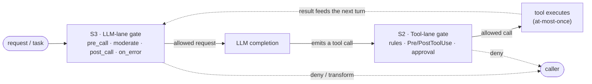

# S0 · MCP Host Guardrails — Unified Architecture

|  |  |
|---|---|
| **Type** | architecture / umbrella spec |
| **Status** | draft for discussion |
| **Suite** | S1 [core](./01-guardrail-core.md) · S2 [tool-lane](./02-tool-lane-adapter.md) · S3 [llm-lane](./03-llm-lane-adapter.md) · S4 [trust & delivery](./04-hook-trust-and-delivery.md) |
| **Scope** | specification only — no runtime/CRD/deployment change is authorized here |

---

## 0 · Thesis

The MCP Host applies guardrails on two lanes — the **LLM completion** and **tool execution** — and both
are the same machine: *intercept a call → run an ordered chain of policy contributors → aggregate to a
decision → execute at-most-once → emit bounded audit.* They differ only in **what** they intercept and
in the **trust model of their hooks**.

So the suite splits that machine into three parts rather than merging everything into one document:

- **One shared decision engine — S1 · Guardrail Core.** The actual guardrail logic that *both* lanes
  use: the `allow`/`ask`/`deny` decision and how contributions aggregate, running each call
  at-most-once, the admin policy, and the audit trail.
- **Two thin per-lane layers — S2 (tool) and S3 (LLM).** Each one only describes what is specific to
  its kind of call (tool arguments vs an LLM request) and hands everything else to S1.
- **One shared "how hooks run and are trusted" layer — S4.** Custom hooks are **installed as
  containers** (any language), run out-of-process as a pod / in-cluster Service / external endpoint; the
  platform's own hooks are **built-ins** compiled into mcp-host. There is no local-executable or
  CRD-scripting hook.

At runtime the two lanes **stack**: a request first passes the LLM-lane gate, the model it returns emits
a tool call, and that call then passes the tool-lane gate before it executes — the tool result feeds the
next turn.

Both gates are the *same* machine — one `GuardrailBoundary` (§1), configured by the shared engine (S1)
and delivered with hooks from S4. What differs is only the lane-specific configuration in S2 / S3.

---

## 1 · The unifying abstraction — one `GuardrailBoundary`

Each lane instantiates one boundary over its own call/result types (defined fully in S1):

| Stage | Shared contract (S1) | LLM lane (S3) | Tool lane (S2) |
|---|---|---|---|
| Intercept | a call reaches a mandatory boundary | `HookedLlmPort` at `LlmPort` | resolved tool call before execution |
| Contributors | ordered chain of **rules + hooks + validators** | moderation, prompt-shaping, token-trim, PII | permission rules, Pre hooks, hard validators |
| Decision | `allow / ask / deny / no_decision`, strict aggregation `deny > ask > allow > no_decision` | reject→`deny`, moderation-fail→`deny`, continue→`allow` | as authored |
| Rewrite | full input replacement, canonicalize + revalidate | `pre_call` patch | Pre-hook `updatedInput` |
| Execute | **at-most-once**, snapshot-safe | one completion per logical request (above failover) | `executeSingleTool`, batch/resume |
| Post | transform the model-visible result; never alter the authoritative outcome | `post_call`; `on_error` recover (gated) | `PostToolUse` |
| Evidence | bounded-enum metrics + redacted, digest-based audit | S3 audit | S2 audit |

A **contributor** is the shared unit: `{ phase: pre|post, source: admin_rule|host_rule|hook|validator,
decision, reasonCode, rewrite?, capabilities? }`. Rules are declarative contributors; hooks are
executable contributors delivered per S4.

---

## 2 · How the lanes' differences reconcile

The two lanes independently agree on the trust primitives (universal mediation, no-secrets-in-hooks,
digest/allowlist trust, HCC-delivered admin policy, at-most-once, bounded audit). Where they diverge,
the resolution lives in the shared engine (S1):

| Divergence | Resolution | Home |
|---|---|---|
| Hook **execution model** (local executable vs remote service) | **No local-executable hook.** Custom hooks are **installed containers** (any language) run out-of-process; only first-party **built-ins** run in-process. The deterministic, deny-authoritative in-process logic a local executable was meant to provide is served instead by the declarative rules (S2) + built-ins. | S4 |
| Hook **network / side-effects** | installed hooks are egress-allowlisted; built-ins have no network of their own | S4 |
| Who **installs** / trust | one **non-overridable admin policy on the Host CRD** (the mcp-host's own CR; the runtime can't mutate it): allowed installed-hook digests + a `trust_level` floor + capability grants | S1 + S4 |
| **Fail-open vs fail-closed** on hook-down | fail-closed is mandatory for any deny-authoritative hook; a `breaker` fail-open is allowed only for advisory hooks the admin opts in | S1 + S4 |
| Hook **fabricating the outcome** | a named, admin-granted, audited `may_substitute_result` capability that never alters the stored outcome | S1 + S4 |
| **Decision expressiveness** | the 4-valued algebra + strict aggregation for both lanes | S1 |

The load-bearing move is dropping the local-executable model entirely, leaving two kinds of hook:
**built-in** (first-party, compiled into mcp-host, in-process) and **installed** (a container in any
language, run out-of-process as a pod / Service / external endpoint). Custom logic is therefore authored
in the language of choice as an ordinary container — not a script wedged into the CRD — while the
high-assurance core stays in-process as declarative rules (S2) + built-ins. The Host-CRD admin policy
(S1 §7) declares, per lane, which installed hooks (by digest + `trust_level`) and which capabilities are
admissible — so the two specs' opposite instincts are settled by choosing containers for all custom logic.

---

## 3 · Sequencing

1. **S1 (Core)** — lift the decision algebra, contributor contract, at-most-once/resume, admin-policy
   model, and audit out of the lane specifics into a lane-neutral core.
2. **S4 (Hook trust & delivery)** — define the built-in vs installed model, installed-hook delivery/trust,
   and the admin-policy hook/capability grants.
3. **S2 / S3 (adapters, in parallel)** — each conforms to S1 and consumes S4; keeps its lane depth.

Dependencies: S1 → {S4, S2, S3}; S4 → {S2, S3}. The open decisions in §4 gate S1's scope.

---

## 4 · Open decisions

1. Does the **LLM lane need `ask`** (human approval before a model call)? If not, `ask` is tool-lane-only.
2. **Installed-hook latency on the tool lane** — a container round-trip per `Pre/PostToolUse` adds latency
   to every guarded tool call. Acceptable, or do the hottest checks need an in-process built-in fast-path?
3. Is **`may_substitute_result`** allowed on the tool lane, or LLM-only?
4. Is **Guardrail Core** an in-process shared library (both lanes run in mcp-host) or a separate module?
5. **Unify the reason-code registries**, or keep per-lane with a shared bounded-label discipline?
6. Minimal **capability set** — is `{may_deny, may_rewrite, may_substitute_result}` enough, or also
   `may_ask` / `may_add_context`?

---

## 5 · Out of scope for the shared engine (S1)

S1 must not absorb lane mechanics: the tool lane's typed argument predicates, provenance, doom-loop,
and persistence scanner (S2); and the LLM lane's `token-trim`/`prompt-shaping` built-ins and
`HookedLlmPort` placement (S3). Those stay in the adapters.
