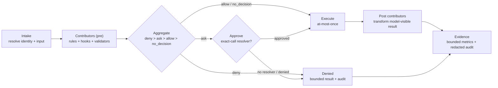

# S1 · Guardrail Core (lane-neutral)

|  |  |
|---|---|
| **Type** | design spec |
| **Status** | draft for discussion |
| **Consumed by** | S2 [tool-lane](./02-tool-lane-adapter.md), S3 [llm-lane](./03-llm-lane-adapter.md) |
| **Depends on** | S4 [trust & delivery](./04-hook-trust-and-delivery.md) for how hook contributors are invoked |

The lane-neutral machine every guarded call passes through. A lane supplies the concrete **input** and
**result** types; this core supplies the decision algebra, the contributor contract, execution safety,
admin policy, and evidence.

---

## 1 · The `GuardrailBoundary`

One mandatory boundary per guarded call: `Intake → Contributors → Aggregate → (Approve) → Execute → Post
→ Evidence`. It is universal — native, remote, bridged, first-run, resumed, interactive, and unattended
calls all pass the same boundary before execution.

Lane-supplied types: `Input` (e.g. tool arguments / an LLM request), `Result` (tool result / LLM
response), `ResolvedIdentity` (the *real* target after any bridge resolution — never inferred from a name
pattern).



## 2 · Contributor contract

A **contributor** is the unit every source produces:

```
Contributor = {
  phase:  'pre' | 'post'
  source: 'admin_rule' | 'host_rule' | 'hook' | 'validator' | 'current'   // 'current' = the existing approval path
  sourceId: string                         // stable configured id
  decision: 'allow' | 'ask' | 'deny' | 'no_decision'
  reasonCode: <bounded enum>
  rewrite?:  Input                          // full replacement of the input (pre only)
  substitute?: Result                       // only if granted may_substitute_result (§6)
  audit: { modelReason?, userReason?, details? }  // redacted, bounded; not copied across surfaces
}
```

- **Rules** are declarative contributors (the lane defines their match language). **Hooks** are executable
  contributors; *how* a hook is executed (local child-process vs remote call) is S4's concern, not the
  algebra's.
- `modelReason` / `userReason` / `details` serve different consumers and MUST NOT be copied between
  surfaces without explicit redaction.

## 3 · Decision algebra & aggregation

- **Strictness order:** `deny > ask > allow > no_decision`. The boundary outcome is the **strictest**
  contribution across all matching sources; every contribution is retained in audit.
- **`no_decision`** means "no guardrail source decided" → the lane's *defer* behavior (the existing approval path).
- **Unmatched default is explicit:** when a lane has a non-empty rule set, an unmatched call contributes
  `ask` (not silently `allow`); when it has no guardrail config at all, absence contributes `no_decision`.
  A default is never synthesized when guardrails are absent (no-config compatibility, §7).
- **Tie-break for presentation only:** when one bounded reason must be chosen for a metric or a
  model-facing result, break ties deterministically (admin_rule → hook order → host_rule → lexical
  sourceId). This selects *presentation*, never severity.
- **Malformed input fails closed:** an unknown decision value or an out-of-range predicate is rejected at
  admission; it never aggregates as permissive.

## 4 · Rewrite safety

A `pre` contributor's `rewrite` **replaces the entire `Input`**, which is then canonicalized and
**re-validated** before the next contributor sees it. A contributor can never *weaken* an earlier
stricter decision. Rewrites are re-evaluated, so an earlier `allow` on the original input is never reused.

## 5 · Execution safety — at-most-once, snapshot, resume

- **At-most-once:** an approved call executes exactly once; suspension, restart, retry, and batch resume
  never execute a call more than once.
- **Snapshot:** a suspended call persists an immutable snapshot — resolved identity, original + effective
  input digests, matched rule/hook ids + decisions + rewrite digests, admin-policy digest, execution
  mode, and state (`pending | approved | denied | executing | executed | post_complete`).
- **Resume:** load the snapshot, verify identity + effective-input digest, verify hook artifacts still
  match stored digests **without re-running pre hooks**, **re-load current admin policy and deny if it is
  now stricter or missing**, atomically claim `executing`, run once, then run post hooks under a stable
  idempotency key. An approval for a different digest/identity/expired request is invalid.

## 6 · Capabilities

Contributor powers beyond `allow/deny` are **explicit, admin-granted** capabilities (§ admin policy):
`may_rewrite`, `may_ask`, `may_substitute_result`, `may_add_context`. In particular **`substitute` never
alters the stored authoritative outcome** — it changes only the *caller-visible* result, is clearly
tagged as contributor-originated, and is audited.

## 7 · Administrative policy

- **Shape** — a **single** admin-authored block, `Host.spec.guardrails`, on the **Host CRD** (the
  mcp-host's own CR that HCC reconciles to instantiate the process). There is **no separate `adminPolicy`
  sub-object**: the whole Host CR is admin-authored and the runtime can't mutate it, so everything in the
  block is already non-overridable. A mcp-host runs exactly the hooks this block lists — installed hooks
  are **opt-in per Host**. Rendered into the Host `openAPIV3Schema`:

```yaml
guardrails:
  type: object
  properties:
    rules:                       # ordered allow/ask/deny rules — tool-lane predicate shape in S2 §2
      type: array
      items: { type: object }    #   { id, action: allow|ask|deny, reasonCode, match{ tool, arguments[] } }
    hooks:                       # installed hooks this mcp-host runs, by phase (each an installed LlmHook CR, S4)
      type: object               #   each entry: { id: string, digest: string }  (expected sha256 of the hook image)
      properties:
        preToolUse:      { type: array, items: { type: object } }
        postToolUse:     { type: array, items: { type: object } }
        preCall:         { type: array, items: { type: object } }
        moderate:        { type: array, items: { type: object } }
        postCallSuccess: { type: array, items: { type: object } }
        onError:         { type: array, items: { type: object } }
    builtins:                    # first-party hooks compiled into mcp-host — types in S3 §3
      type: array
      items: { type: object }    #   { type: prompt-shaping|token-trim|…, order, failMode, timeoutMs, config }
    minInstalledHookTrustLevel: { type: string, enum: [low, mid, high] }   # trust floor for installed hooks
    approvalPolicies:  { type: array, items: { type: string, enum: [cli_only, channel_users, designated_approvers] } }
    capabilityCeiling: { type: array, items: { type: string, enum: [may_deny, may_rewrite, may_substitute_result, may_add_context] } }
    limits:
      type: object
      properties:
        maxRules:           { type: integer, default: 100 }
        maxHooksPerPhase:   { type: integer, default: 8 }
        maxHookTimeoutMs:   { type: integer, default: 5000 }
        maxHookOutputBytes: { type: integer, default: 65536 }
```
- **Non-overridable by construction:** the Host CR is authored only through control-api admin RBAC and
  reconciled by HCC; the **mcp-host runtime cannot mutate its own Host CR**, so it cannot weaken the
  guardrails. Within the block, no rule or hook can weaken a `deny` — the strictest contribution wins (§3).
- **Delivery:** the admin policy rides the path HCC **already** uses to instantiate the mcp-host from its
  Host CR — no cross-object artifact. HCC validates schema/digests/limits and normalizes it; mcp-host
  reads its Host state. If policy is declared but the Host is not reconciled/Ready, guarded execution
  **fails closed**; a malformed policy never replaces the last valid one; the enforced policy digest is
  recorded for integrity/audit and never falls back to a weaker policy on mismatch.
- **No-config compatibility:** with no admin policy, host rules, or hooks, behavior is identical to
  current — absence contributes `no_decision`.

## 8 · Evidence — metrics & audit

- **Metrics** use **fixed-enum labels only** (`decision`, `source`, `execution_mode`, `phase`, `outcome`,
  `reason_code`, plus lane-supplied bounded dimensions). Ids, paths, args, free-form reasons, and digests
  are **forbidden** as labels.
- **Audit** events carry timestamps, identity linkage, original + resolved identities, decision + source
  ids, bounded reason codes, original/effective **input digests**, policy/rule/hook digests, execution
  state, and redaction status. Raw sensitive inputs, hook stdout/stderr, and credentials are excluded
  unless a separate protected-trace contract permits a redacted form.
- **Reason-code registry** is a single bounded enum (see §4/§8 open decision in S0 on per-lane vs unified).

## 9 · Invariants (lane-neutral)

Universal mediation · resolved-identity evaluation · strict aggregation · rewrite-then-revalidate ·
at-most-once · authoritative-outcome-immutable · admin-cannot-be-weakened (policy on the Host CRD, which
the mcp-host runtime can't mutate) · authoritative-delivery (HCC-reconciled, digest-checked) ·
bounded/redacted evidence · no-config compatibility.
