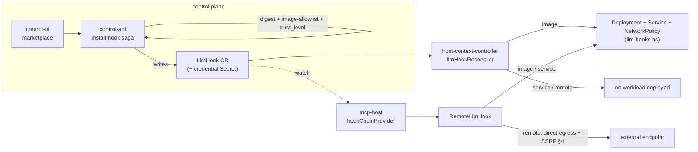

# S4 · Hook trust & delivery

|  |  |
|---|---|
| **Type** | design spec |
| **Status** | draft for discussion |
| **Consumed by** | S2 [tool-lane](./02-tool-lane-adapter.md), S3 [llm-lane](./03-llm-lane-adapter.md) |
| **Governed by** | S1 [core](./01-guardrail-core.md) admin policy (which installed hooks + capabilities are admissible) |

How a hook (an executable contributor, S1 §2) is trusted, delivered, and invoked. A hook is either
**built-in** (first-party, compiled into mcp-host) or **installed** (a container in any language, run
out-of-process). Admin policy on the Host CRD (S1 §7) declares which installed hooks and capabilities a lane may use.

---

## 1 · Two kinds of hook

| | **Built-in** | **Installed** |
|---|---|---|
| What it is | first-party code **compiled into mcp-host** | a **container image**, authored in any language |
| Runs | in-process, no separate process | out-of-process — a pod / in-cluster Service / external endpoint |
| Installed by | ships with the platform | anyone, via the marketplace (§6) |
| Trust | first-party | image-allowlist + sha256 digest + `trust_level` + NetworkPolicy |
| Examples | `prompt-shaping`, `token-trim` | `guardrail`, `pii-redact`, custom tool checks |

**There is no local-executable / CRD-scripting hook.** Custom logic is a container in the author's
language of choice — not a script or executable wedged into the CRD, which is awkward to author and learn.
The high-assurance, deterministic checks that might otherwise justify a local executable are served
**in-process** instead: by the declarative permission **rules** (S2 — evaluated by mcp-host, not a hook)
and by the built-ins above. An operator who wants custom guaranteed-local logic contributes a built-in.

**Capabilities are admin-granted per hook** (S1 §6): `may_deny`, `may_rewrite`, `may_substitute_result`,
`may_add_context`. An installed hook may be deny-authoritative, but then it must fail-closed (§7).

## 2 · Built-in hooks (in-process)

First-party contributors compiled into mcp-host, selected/ordered by config (not a CRD). They run
in-process — no separate process, no network of their own, full first-party trust. The LLM lane ships
`prompt-shaping` and `token-trim` (S3 §3); the tool lane's decision logic is the declarative
permission-rule engine (S2 §2), also in-process. Built-ins are the deterministic, always-available core;
everything custom is an installed hook.

## 3 · Installed hooks — delivery & invocation

### 3.1 · The `/v1` protocol
mcp-host POSTs each contributor call to **`{endpoint}{path}/v1/{lifecyclePoint}`**, where `{endpoint}`
is resolved from the `target` (the pod / Service / URL) and `{path}` is the hook's `spec.path` (default
`/`). Because the path is per-hook, **one pod can host hundreds of hook functions** — many `LlmHook`s
point at the *same* `service` with a different `path` — so you don't run a pod per function (which keeps
the compute footprint, not just the bytes, low). **Auth:** a short-lived RS256 bearer token (broker-token
signer) over a NetworkPolicy-confined connection; no mTLS. **Bodies** are a redacted, need-based
projection (§5). Only the lifecycle endpoints a hook's `lifecyclePoints` declares are called — so one path
can serve both a pre and a post contributor (via `…/v1/pre_call` and `…/v1/post_call`).

| Endpoint (under `{endpoint}{path}`) | Request body (redacted projection — §5) | Response |
|---|---|---|
| `POST …/v1/pre_call` | `{ messages, tools?, model, params, usage, state, config }` | `{ action:'continue', patch?:{messages?,params?,systemPromptParts?} } \| { action:'reject', code, message }` |
| `POST …/v1/moderate` | `{ messages, model, usage, config }` | `200 {}` = pass · `4xx { code, message }` = fail |
| `POST …/v1/post_call` | `{ response:{content,tool_calls,finish_reason}, usage, state, config }` | `{ response }` (possibly redacted) |
| `POST …/v1/on_error` | `{ error:{code,message,retryable}, messages, model, usage, state, config }` | `{ action:'reshape', error:{code,message} } \| { action:'recover', response:{content,tool_calls?} }` |

`RemoteLlmHook` applies a `pre_call` `patch` onto the local request (the hook never gets the raw request
object), maps `reject`/`moderate`-4xx onto a `deny` contributor, and maps `on_error` `recover` onto a
`substitute` contributor (gated by `may_substitute_result`, §5/S1 §6).

### 3.2 · The `LlmHook` CRD (declaration)
Namespaced `clerum.io/v1alpha1`, reconciled by the **host-context-controller** (`llmHookReconciler.ts`).
Full schema (rendered as the k8s CRD `openAPIV3Schema` under `charts/clerum-crds/crds/llmhook.yaml`):

```yaml
apiVersion: apiextensions.k8s.io/v1
kind: CustomResourceDefinition
metadata: { name: llmhooks.clerum.io }
spec:
  group: clerum.io
  scope: Namespaced
  names: { kind: LlmHook, listKind: LlmHookList, plural: llmhooks, singular: llmhook, shortNames: [llmhook] }
  versions:
    - name: v1alpha1
      served: true
      storage: true
      schema:
        openAPIV3Schema:
          type: object
          required: [spec]
          properties:
            spec:
              type: object
              required: [target, lifecyclePoints]
              properties:
                target:                                  # exactly one of image | service | remote
                  type: object
                  oneOf: [{required: [image]}, {required: [service]}, {required: [remote]}]
                  properties:
                    image:
                      type: object
                      required: [ref, port]
                      properties:
                        ref:              { type: string }                    # image-allowlist enforced at install
                        port:             { type: integer, minimum: 1, maximum: 65535 }
                        imagePullSecrets: { type: array, items: { type: string } }
                        envSecret:        { type: string }                    # hook's OWN creds (never the LLM secret)
                        egressBindings:   { type: array, items: { type: object,
                                            properties: { toFQDN: {type: string}, cidr: {type: string},
                                                          ports: {type: array, items: {type: integer}} } } }
                        security:
                          type: object
                          properties: { addCapabilities: { type: array, items: { type: string } } }
                    service:
                      type: object
                      required: [name, namespace, port]
                      properties:
                        name:      { type: string }
                        namespace: { type: string }
                        port:      { type: integer, minimum: 1, maximum: 65535 }
                    remote:
                      type: object
                      required: [baseUrl]
                      properties:
                        baseUrl:           { type: string, pattern: '^https://' }   # §4 SSRF-validated at dial
                        authHeadersSecret: { type: string }
                path:       { type: string, default: '/' }   # API path on the endpoint; calls go to {endpoint}{path}/v1/{point}.
                                                             # Many LlmHooks can share one `service` pod via distinct paths.
                lifecyclePoints:
                  type: array
                  minItems: 1
                  items: { type: string, enum: [preCall, moderate, postCallSuccess, onError] }
                order:      { type: integer, default: 100 }
                failMode:   { type: string, enum: [open, closed], default: closed }
                timeoutMs:  { type: integer, default: 5000, minimum: 1 }
                onUnavailable:
                  type: object
                  properties:
                    mode:             { type: string, enum: [strict, breaker], default: strict }
                    failureThreshold: { type: integer, default: 5, minimum: 1 }
                    cooldownMs:       { type: integer, default: 30000, minimum: 0 }
                capabilities:                            # admin-granted (S1 §6); enforced ⊆ guardrails.capabilityCeiling (S1 §7)
                  type: array
                  items: { type: string, enum: [may_deny, may_rewrite, may_substitute_result, may_add_context] }
                appliesTo:
                  type: object
                  properties:
                    models:      { type: array, items: { type: string } }
                    sourceKinds: { type: array, items: { type: string,
                                   enum: [channel, desktop, workflow, cron, plugin_workload_sdk] } }
                config:  { type: object, x-kubernetes-preserve-unknown-fields: true }
                managed: { type: boolean, default: true }
              x-kubernetes-validations:                  # CEL
                - rule: "!has(self.target.remote) || self.target.remote.baseUrl.startsWith('https://')"
                  message: "remote.baseUrl must be https://"
                - rule: "!(has(self.capabilities) && self.capabilities.exists(c, c == 'may_deny')) || self.failMode == 'closed'"
                  message: "a deny-authoritative hook (may_deny) must fail closed"
```

### 3.3 · Delivery modes & reconcile flow
Exactly one `target`: **`image`** — HCC deploys a Deployment+Service+NetworkPolicy in the **`llm-hooks`**
namespace (`CONTROL_API_LLM_HOOKS_NAMESPACE`), ingress only from mcp-host, egress per `egressBindings`;
**`service`** — an existing in-cluster Service, nothing deployed; **`remote`** — an external HTTPS endpoint
mcp-host dials directly (§4), no proxy pod.

**Shared hook-server (one pod, many functions).** A single hook-server pod in `llm-hooks` can host
hundreds of functions, each at a distinct `path`. Deploy the pod **once** — either as one `image` LlmHook,
or an operator-managed Deployment+Service — then register each function as a lightweight **`service`-mode
LlmHook** pointing at that Service with its own `path` (`/pii-redact`, `/budget-guard`, …) and its own
`lifecyclePoints`/`order`/`capabilities`. mcp-host addresses each at `{service}{path}/v1/{point}`. This
keeps the pod count (and thus the always-on compute cost, §7) flat as the number of contributors grows,
while each function stays an independently-governed contributor in the Host's `guardrails.hooks` list.



control-api's saga only **writes** the CR + Secret; **HCC** reconciles it to workloads; **mcp-host** only
**watches** the CRs to resolve the hooks its `Host.spec.guardrails.hooks` block lists (installed hooks are
opt-in per Host — S1 §7; there is no auto-apply scope) and builds `RemoteLlmHook`s — it deploys nothing.

## 4 · `remote`-mode egress (direct, matching the status quo)

mcp-host dials a `remote` endpoint directly over its existing broad public-egress lane — the same way it
already reaches external LLM providers (`deploy/base/mcp-host/networkpolicies.yaml:108-121` — `443 →
0.0.0.0/0`; `llm/claude.ts` calls `api.anthropic.com` directly). No per-hook proxy pod: the proxy pattern
exists to fence *untrusted connector pods*, which does not apply to the trusted mcp-host reaching out.

**Destination safety is app-layer (the primary control):**
1. **Config-only provenance** — the target comes only from the admin-vetted, `trust_level`-gated `LlmHook`
   CR, never from model/tool/user/hook data.
2. **Reuse the existing SSRF guard** (`core/tools/httpRequest.ts` + `core/safety/safety.ts`): `https` only;
   block RFC-1918 / loopback / link-local / metadata `169.254.169.254` / `*.cluster.local`; resolve A+AAAA
   and reject if any is private (fail-closed on DNS failure); **DNS-pin** to the validated IP; **no
   redirects**.
3. **Payload** stays governed by the content projection (§5).

**L3 is a backstop only.** The broad lane is the pre-existing LLM-call posture; hooks add no new class of
egress. Optional: a Calico `destination.domains` policy scoped to the admin-declared hook hosts, programmed
by HCC per `remote` hook — per-host precision without a proxy pod.

## 5 · Content exposure (installed hooks)

A remote hook receives message/response **content** only for the lifecycle points that need it
(`moderate`/`post_call` get content; `pre_call` shaping gets model+params+metadata, not bodies) **and** only
if the entry's `trust_level` clears `config.minHookTrustLevel`. Below the bar, install is refused or the hook
is content-starved. Every content-bearing call is audit-logged (hook + phase + request id, not the content).
`LlmHookContext.host` omits `llmSecretName`; the hook's own credentials live in its own Secret.

## 6 · Marketplace (installed-hook distribution)

- Registry `entry_type: 'llm_hook'` with `hook_meta { target(image|service|remote), lifecyclePoints[],
  credential_schema, defaultConfig, requiredEgress[], appliesToDefaults }`. Extending the `evenfire-registry`
  schema is a prerequisite we own.
- `POST /admin/registry/install-hook` saga (cloned from `install-recipe`): verify sha256 bundle digest →
  validate + store credential Secret → build the `LlmHook` `target` → image-allowlist preflight → stamp
  `catalog-id/version` → create CR → rollback on failure → `reportInstall`. Installed-state derived from CRs.
- **Trust reuse (no new primitives):** `@clerum/image-policy` allowlist, sha256 digest, per-org pull secret,
  `@clerum/workflow-recipe-capability-policy`, `trust_level`/`quality_tier`, install-time credential Secret,
  per-workload egress NetworkPolicy.

## 7 · Fail-posture

Fail-closed is the default and **mandatory for any deny-authoritative hook** (built-in or installed). A `breaker`
(trip to fail-open after N failures, alert, re-probe) is permitted **only** for non-authoritative
(advisory/observability) hooks and **only** when admin policy opts in. `RemoteLlmHook` owns per-hook breaker
state so a down hook degrades per its declared mode, not globally.
