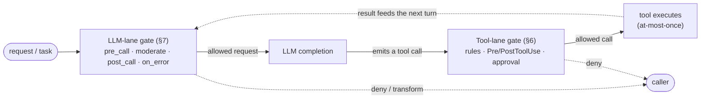
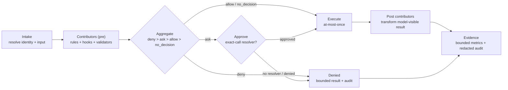
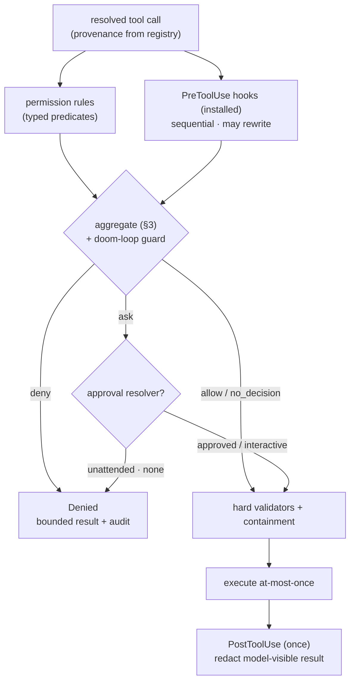
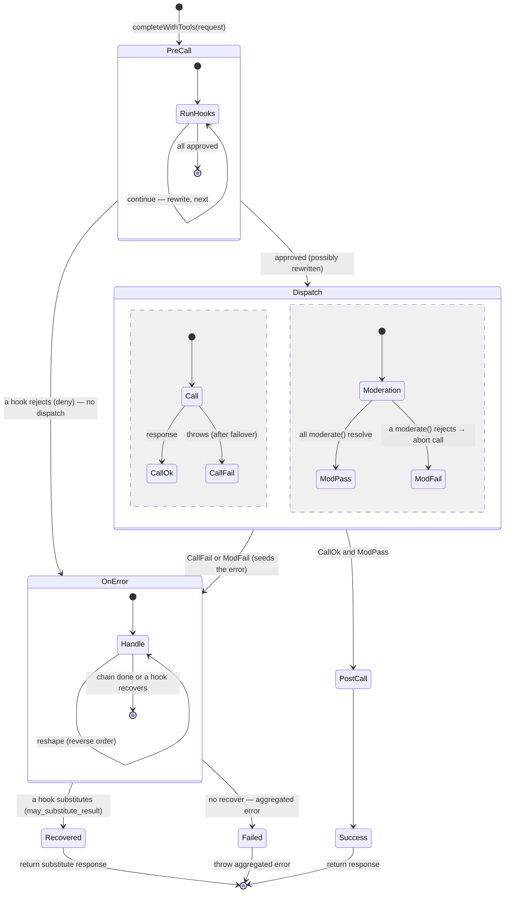
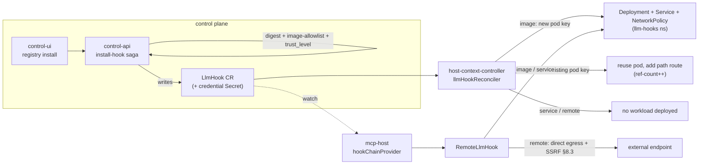

# MCP Host Guardrails — Design Spec

| Field | Value |
|---|---|
| **Type** | design spec (architecture + implementable) |
| **Status** | draft for discussion |
| **Scope** | specification only — no runtime/CRD/deployment change is authorized here |

---

## 1 · Overview

The MCP Host applies guardrails on **two lanes**:

- **LLM lane** — the model *completion* call: mutate/moderate the request, transform the response,
  recover on failure.
- **Tool lane** — *tool execution* (native + MCP tools): permission rules, `Pre/PostToolUse` hooks,
  approvals.

Both lanes are the **same machine**: *intercept a call → run an ordered chain of policy contributors →
aggregate to a decision → execute at-most-once → emit bounded audit.* They differ only in **what** they
intercept and in the **trust model of their hooks**. So instead of two parallel guardrail stacks, this
spec is:

- **One shared decision engine** (§2–§4) — the `allow`/`ask`/`deny` logic, how contributions aggregate,
  at-most-once execution, and the audit trail. Both lanes use it verbatim.
- **One shared config** (§5) — a single admin-authored `Host.spec.guardrails` block on the Host CRD.
- **Two thin per-lane layers** (§6 tool, §7 LLM) — each describes only what is specific to its kind of
  call and hands everything else to the engine.
- **One shared "how hooks run and are trusted" layer** (§8) — custom hooks are **installed as
  containers** (any language, out-of-process); the platform's own hooks are **built-ins** compiled into
  mcp-host. There is no local-executable or CRD-scripting hook.

### 1.1 · The two lanes stack at runtime

A request first passes the LLM-lane gate; the model it returns emits a tool call; that call then passes
the tool-lane gate before it executes; the tool result feeds the next turn.



Both gates are the *same* `GuardrailBoundary` (§2), configured by the shared engine and delivered with
hooks from §8. Only the lane-specific configuration in §6 / §7 differs.

### 1.2 · Two kinds of hook (the load-bearing simplification)

There are exactly **two** kinds of hook — there is **no** local-executable / CRD-scripting model:

- **Built-in** — first-party code **compiled into mcp-host**, run in-process, no network of its own
  (e.g. `prompt-shaping`, `token-trim`). The deterministic, always-available core. **Only the Evenfire
  core team adds built-in in-process hooks** — they ship with the platform and are not authorable by
  operators or third parties, who use installed hooks instead.
- **Installed** — a **container image** in any language, run out-of-process (pod / in-cluster Service /
  external endpoint), reached over the `/v1` protocol (e.g. `guardrail`, `pii-redact`, custom checks).

Custom logic is therefore authored in the language of choice as an ordinary container — not a script
wedged into a CRD — while the high-assurance core stays in-process as declarative **rules** (§6) +
built-ins. The Host-CRD admin policy (§5) declares which installed hooks (by digest, subject to a
`trust_level` floor) and which capabilities are admissible.

---

## 2 · The `GuardrailBoundary` (the shared machine)

One mandatory boundary per guarded call:
`Intake → Contributors → Aggregate → (Approve) → Execute → Post → Evidence`. It is universal — native,
remote, bridged, first-run, resumed, interactive, and unattended calls all pass the same boundary before
execution.

Each lane instantiates the boundary over its own types:

| Type | Tool lane (§6) | LLM lane (§7) |
|---|---|---|
| `Input` | resolved-tool arguments | the `ToolCompletionRequest` (messages, tools, params, `usageContext`) |
| `Result` | the tool result | the `ToolCompletionResponse` |
| `ResolvedIdentity` | the *real* tool after dynamic-bridge resolution | model + provider |

`ResolvedIdentity` is always the *real* target after any bridge resolution — **never inferred from a name
pattern**.



### 2.1 · Contributor contract

A **contributor** is the unit every policy source produces:

```
Contributor = {
  phase:  'pre' | 'post'
  source: 'admin_rule' | 'host_rule' | 'hook' | 'validator' | 'current'   // 'current' = the existing approval path
  sourceId: string                         // stable configured id
  decision: 'allow' | 'ask' | 'deny' | 'no_decision'
  reasonCode: <bounded enum>
  rewrite?:  Input                          // full replacement of the input (pre only)
  substitute?: Result                       // only if granted may_substitute_result (§4.3)
  audit: { modelReason?, userReason?, details? }  // redacted, bounded; not copied across surfaces
}
```

- **Rules** are declarative contributors (the lane defines their match language, §6.1). **Hooks** are
  executable contributors; *how* a hook runs (in-process built-in vs remote container) is §8's concern,
  not the algebra's.
- `modelReason` / `userReason` / `details` serve different consumers and MUST NOT be copied between
  surfaces without explicit redaction.

---

## 3 · Decision algebra & aggregation

- **Strictness order:** `deny > ask > allow > no_decision`. The boundary outcome is the **strictest**
  contribution across all matching sources; every contribution is retained in audit.
- **`no_decision`** means "no guardrail source decided" → the lane's *defer* behavior (the existing
  approval path).
- **Unmatched default is explicit:** when a lane has a non-empty rule set, an unmatched call contributes
  `ask` (not silently `allow`); when it has no guardrail config at all, absence contributes
  `no_decision`. A default is never synthesized when guardrails are absent (no-config compatibility, §5).
- **Tie-break for presentation only:** when one bounded reason must be chosen for a metric or a
  model-facing result, break ties deterministically (`admin_rule` → hook order → `host_rule` → lexical
  `sourceId`). This selects *presentation*, never severity.
- **Malformed input fails closed:** an unknown decision value or an out-of-range predicate is rejected at
  admission; it never aggregates as permissive.

---

## 4 · Execution safety

### 4.1 · Rewrite safety

A `pre` contributor's `rewrite` **replaces the entire `Input`**, which is then canonicalized and
**re-validated** before the next contributor sees it. A contributor can never *weaken* an earlier
stricter decision. Rewrites are re-evaluated, so an earlier `allow` on the original input is never reused.

**Rewrite re-aggregation (algorithm).** When a `pre` contributor returns a `rewrite`:

1. Canonicalize + structurally **re-validate** the new `Input` (§6.1 admission checks); a rewrite that
   fails validation is rejected `rewrite_invalid` (fail-closed).
2. **Restart the `pre` chain from the beginning** against the new `Input`. Every rule and pre hook
   therefore always evaluates the **final** input, and the boundary outcome is the aggregate over that
   final input — so no rule can be *bypassed* by a later rewrite (it re-runs and sees the rewritten input)
   and no earlier `allow` is carried over.
3. **Termination:** each contributor's `rewrite` is honored **at most once** per call (by `sourceId`); a
   further rewrite from the same source is ignored. With N `pre` contributors the chain restarts ≤ N times.

The input after the last honored rewrite is what executes and is digested into the snapshot (§4.2).

### 4.2 · At-most-once, snapshot, resume

- **At-most-once:** an approved call executes exactly once; suspension, restart, retry, and batch resume
  never execute a call more than once.
- **Snapshot:** a suspended call persists an immutable snapshot — resolved identity, original + effective
  input digests, matched rule/hook ids + decisions + rewrite digests, admin-policy digest, execution
  mode, and state (`pending | approved | denied | executing | executed | post_complete`).
- **Resume:** load the snapshot; verify resolved identity + effective-input digest match. **Re-run the
  declarative rules** (cheap, in-process) against the effective input and **re-aggregate**; verify
  installed-hook artifacts still match stored digests **without re-calling the hooks**; **re-load the
  current admin policy**. Proceed only if the fresh decision is allow/approved and **no stricter than the
  snapshot** — if a rule now denies, the policy is missing/stricter, an artifact digest changed, or the
  approval was for a different digest/identity/expired request → **deny**. Then atomically claim
  `executing`, run once, and run post hooks under a stable idempotency key. *(Resume re-runs the rules — a
  cheap, in-process re-aggregation — not merely a policy-digest comparison.)*

### 4.3 · Capabilities

A **hook's** powers beyond its default `allow` are **explicit, admin-granted** capabilities (§5/§8.2),
enforced on the hook's response (§8.1) — a hook lacking a capability cannot exercise it:

| Capability | Grants a hook | Key constraints |
|---|---|---|
| `may_deny` | contribute a **blocking `deny`** (a `reject`, or a `moderate` 4xx) | deny-authoritative ⇒ **must fail closed** (§8.6 / CRD CEL); without the grant a `reject` is downgraded to `no_decision` (§8.1) |
| `may_rewrite` | **replace the input** — a `pre_call` patch (`messages`/`params`) or a tool `updatedInput` | full replacement, canonicalized + **re-validated & re-aggregated** (§4.1); **cannot** touch the system prompt (§8.1); never weakens a prior stricter decision |
| `may_substitute_result` | return a **caller-visible result** in place of the real one (`on_error recover`) | never alters the **stored authoritative outcome**; on the LLM lane **text-only — no `tool_calls`** (§8.1); tagged contributor-originated + audited |
| `may_add_context` | **add bounded context** to the model (`additionalContext`) | injected as **untrusted** tool/hook output, **never** at system level (§12.4); size-bounded |

A **rule**'s `allow`/`ask`/`deny` needs no capability — admin authorship is the grant; hooks have **no
`may_ask`** (decided, §10 #6) — a hook wanting a human in the loop `deny`s and the admin writes an `ask`
rule. `may_substitute_result` is **LLM-lane-only** (§10 #3).

---

## 5 · Administrative policy — the one config block

All guardrail configuration is a **single** admin-authored block, `Host.spec.guardrails`, on the **Host
CRD** (the mcp-host's own CR that HCC reconciles to instantiate the process). There is **no separate
`adminPolicy` sub-object**: the whole Host CR is admin-authored and the runtime can't mutate it, so
everything in the block is already non-overridable. A mcp-host runs exactly the hooks this block lists —
installed hooks are **opt-in per Host**.

Rendered into the Host `openAPIV3Schema`:

```yaml
guardrails:
  type: object
  properties:
    rules:                       # ordered allow/ask/deny rules — tool-lane predicate shape in §6.1
      type: array
      items: { type: object }    #   { id, action: allow|ask|deny, reasonCode, match{ tool, arguments[] } }
    hooks:                       # installed hooks this mcp-host runs, by phase (each an installed LlmHook CR, §8)
      type: object               #   each entry: { id, digest } — id = LlmHook CR name (llm-hooks ns); digest = expected image sha256 (§8.2 resolution)
      properties:
        preToolUse:      { type: array, items: { type: object } }
        postToolUse:     { type: array, items: { type: object } }
        preCall:         { type: array, items: { type: object } }
        moderate:        { type: array, items: { type: object } }
        postCallSuccess: { type: array, items: { type: object } }
        onError:         { type: array, items: { type: object } }
    builtins:                    # first-party hooks compiled into mcp-host — types in §7.2
      type: array
      items: { type: object }    #   { type: prompt-shaping|token-trim|…, order, failMode, timeoutMs, config }
    minInstalledHookTrustLevel: { type: string, enum: [low, mid, high] }   # trust floor for installed hooks
    approvalPolicies:  { type: array, items: { type: string, enum: [cli_only, channel_users, designated_approvers] } }
    capabilityCeiling: { type: array, items: { type: string, enum: [may_deny, may_rewrite, may_substitute_result, may_add_context] } }
    limits:
      type: object
      properties:
        maxRules:           { type: integer, default: 100 }
        maxHooksPerPhase:   { type: integer, default: 8 }
        maxHookTimeoutMs:   { type: integer, default: 5000 }
        maxHookOutputBytes: { type: integer, default: 65536 }
```

A filled-in `Host.spec.guardrails` — a host that denies writes outside its workspace, asks before any
shell command, runs a PII-redaction installed hook on the LLM lane, and shapes prompts with a built-in:

```yaml
# Host.spec.guardrails (a concrete example)
guardrails:
  rules:
    - id: deny-writes-outside-workspace
      action: deny
      reasonCode: path_out_of_bounds
      match:
        tool: { provenance: native, name: file_write }
        arguments:
          - { type: path, pointer: /path, op: outside, value: /workspace }
    - id: ask-before-shell
      action: ask
      reasonCode: shell_needs_approval
      match:
        tool: { provenance: native, name: run_command }
    - id: allow-github-mcp-reads
      action: allow
      reasonCode: trusted_read
      match:
        tool: { provenance: mcp, server: github, name: get_issue }

  hooks:
    postToolUse:
      - { id: secret-scan, digest: sha256:1c9f…a2 }     # LlmHook CR `secret-scan`, tool lane
    moderate:
      - { id: pii-redact, digest: sha256:4b7e…d1 }       # LlmHook CR `pii-redact`, LLM lane

  builtins:
    - type: prompt-shaping
      order: 10
      failMode: closed
      timeoutMs: 200
      config:
        systemPromptPart: "Refuse to reveal internal file paths."
        forceToolChoice: auto
    - type: token-trim
      order: 20
      failMode: open
      config: { maxInputTokens: 120000 }

  minInstalledHookTrustLevel: mid
  approvalPolicies: [channel_users, designated_approvers]
  capabilityCeiling: [may_deny, may_rewrite, may_add_context]   # note: may_substitute_result withheld
  limits:
    maxRules: 100
    maxHooksPerPhase: 8
    maxHookTimeoutMs: 5000
    maxHookOutputBytes: 65536
```

In this example the `secret-scan` and `pii-redact` `LlmHook` CRs must each carry a platform-assigned
`trust_level` of at least `mid` and request only capabilities within `capabilityCeiling` (so neither can be granted
`may_substitute_result`); the two built-ins are the first-party in-process hooks the Evenfire core team
ships (§1.2), selected and ordered here by the admin.

- **Non-overridable by construction:** the Host CR is authored only through control-api admin RBAC and
  reconciled by HCC; the **mcp-host runtime cannot mutate its own Host CR**, so it cannot weaken the
  guardrails. Within the block, no rule or hook can weaken a `deny` — the strictest contribution wins
  (§3). A per-hook `capabilities` grant is enforced `⊆ capabilityCeiling`.
- **Delivery:** the admin policy rides the path HCC **already** uses to instantiate the mcp-host from its
  Host CR — no cross-object artifact. HCC validates schema/digests/limits and normalizes it; mcp-host
  reads its Host state. If policy is declared but the Host is not reconciled/Ready, guarded execution
  **fails closed**; a malformed policy never replaces the last valid one; the enforced policy digest is
  recorded for integrity/audit and never falls back to a weaker policy on mismatch.
- **No-config compatibility:** with no admin policy, host rules, or hooks, behavior is identical to
  current — absence contributes `no_decision`.

---

## 6 · Tool lane

Specializes the boundary over **tool execution**. `Input` = resolved-tool arguments; `Result` = the tool
result; `ResolvedIdentity` = the real tool after dynamic-bridge resolution. **Provenance** (`native` vs
`mcp`, server + name) comes from the **registry**, never inferred from a `__` name pattern. A
`clerum__tool_call` bridge rule evaluates the *resolved* target; it MAY additionally constrain the
original bridge identity but never instead of the resolved target.

**Terminology.**

| Term | Means (tool lane) | Not to be confused with |
|---|---|---|
| **provenance** (`native` or `mcp`) | where the resolved tool comes from, read from the **registry** | a `__` name pattern — provenance is **never** inferred from the tool name |
| **resolved identity** | the **real** target after dynamic-bridge (`clerum__tool_call`) resolution — what rules/hooks evaluate | the **bridge identity** (the `clerum__tool_call` wrapper); a rule may *also* constrain the bridge, never *instead of* the resolved target |
| **rule** | a **declarative** contributor — `allow`/`ask`/`deny` + typed predicates, admin-authored (§6.1) | a **hook** — an *executable* contributor (a container), §6.2 |
| **PreToolUse hook** | runs **before** approval; may decide (`allow`/`ask`/`deny`) and return `updatedInput` | **PostToolUse hook** — runs **once after** execution; may redact the model-visible result but cannot deny, undo side effects, or alter the stored outcome |
| **original input** | the arguments **as the model emitted** them | **effective input** — the arguments **after** a Pre-hook `updatedInput`/rewrite, re-validated & re-aggregated (§4.1) |
| **`allow`** | an **affirmative grant** over the whole call (§6.1) | **`no_decision`** — *no guardrail decided*; defers to the existing approval path (§3) |
| **interactive** | mode where an **exact-call approval resolver is available** | **unattended** — no resolver, so an `ask` becomes `deny`; set by resolver availability, **not** by cron origin (§6.3) |
| **hard validators / containment** | structural validators, MCP scoping, NetworkPolicy — **always authoritative** | a guardrail **decision** — an `allow` never bypasses them (§6.6) |
| **doom-loop guard** | denies 3 **consecutive identical** `(tool, input-digest)` calls (§6.4) | a rate/quota limit |



**Reading the flow.** Every tool call passes this gate once, before it runs:

1. The call is resolved to its **real identity** — provenance from the registry, and any dynamic
   `clerum__tool_call` bridge resolved to the true target — then checked in parallel by **permission rules**
   (§6.1) and **PreToolUse hooks** (§6.2).
2. All contributions **aggregate** with strict precedence — **`deny > ask > allow > no_decision`** (§3) —
   together with the doom-loop guard (§6.4); the strictest wins and nothing can weaken a `deny`.
3. The outcome routes: **`deny`** → blocked (bounded result + audit); **`ask`** → an **approval resolver**
   decides — a human may approve when interactive, otherwise an unattended `ask` becomes a `deny` (§6.3);
   **`allow` / `no_decision`** → proceed.
4. **Hard validators + containment** (§6.6) run next and are **always authoritative** — a guardrail `allow`
   never bypasses them.
5. The call **executes at-most-once** (§4.2).
6. A **PostToolUse** hook may transform the *model-visible* result, but cannot undo the side effect, deny
   the call, or change the stored outcome (§6.2).

In one sentence: *a tool call is resolved to its real identity, checked by admin rules + optional hook
containers, aggregated with `deny > ask > allow > no_decision`, sent to human approval if it's `ask`, then
run once behind the always-on hard validators — and the model only ever sees a post-processed result.*

### 6.1 · Permission rules (declarative contributors)

**In plain terms.** A permission rule is an *if-this-then-that* the admin writes: *"if a tool call looks
like X, then allow / ask / deny it."* The "looks like X" part matches on **which tool** it is (from the
registry) and on the **values of specific arguments** — e.g. *"the file path is outside `/workspace`"* or
*"the URL host is `api.github.com`."* The "then" part is one of three verdicts: **`allow`** (let it run),
**`ask`** (require a human's approval first), or **`deny`** (block it). You can write many rules; if
several match the same call, the **strictest** verdict wins — a `deny` always beats an `allow`. Rules are
just **data, not code**, so they're safe, fast, and always evaluated in-process. The rest of this section
is the precise vocabulary for writing the "looks like X" conditions.

`Host.spec.guardrails.rules[]` with `action: allow | ask | deny`, matched on provenance + **typed
argument predicates**. The `rules[]` **item** shape:

```yaml
# item of Host.spec.guardrails.rules (§5)
type: object
required: [id, action, match]
properties:
  id:         { type: string }
  action:     { type: string, enum: [allow, ask, deny] }
  reasonCode: { type: string }
  match:
    type: object
    required: [tool]
    properties:
      tool:
        type: object
        required: [provenance]
        properties:
          provenance: { type: string, enum: [native, mcp] }   # from the registry, never string-parsed
          server:     { type: string }
          name:       { type: string }
      arguments:
        type: array
        items:
          type: object
          required: [type, pointer, op]
          properties:
            type:    { type: string, enum: [path, url, command, json] }
            pointer: { type: string }                    # constrained RFC 6901 JSON Pointer
            op:      { type: string }                    # per type — see the predicate list below
            value:   { x-kubernetes-preserve-unknown-fields: true }
```

Predicate `op` values by `type`:

- **`path`** — `equals | under | outside`; normalized, symlink-aware, boundary-safe containment; prefix
  strings are forbidden.
- **`url`** — `scheme_in | host_in | port_in | path_under`; parsed + normalized; credentials-in-URL rejected.
- **`command`** — `executable_is | argv_prefix`; a structured executable + argv, not a parsed shell string.
- **`json`** — `exists | equals | one_of | contains`; size- and depth-bounded; object-key order canonicalized.

Predicates name constrained RFC-6901 JSON Pointers; invalid pointers / excess depth / excess count /
over-limit values are **rejected at admission**. Wildcards support only `*` and `?`, anchored, bounded
length — no regex. Array order is never security precedence (all matching rules contribute; §3
aggregates). Unmatched default follows §3: non-empty rules → `ask`; absent → `no_decision` (defer to the
existing approval path).

A filled `rules` array exercising all four predicate types (each rule is one item of the shape above):

```yaml
# Host.spec.guardrails.rules (a concrete example)
rules:
  # path — deny writing anywhere outside the workspace
  - id: deny-writes-outside-workspace
    action: deny
    reasonCode: path_out_of_bounds
    match:
      tool: { provenance: native, name: file_write }
      arguments:
        - { type: path, pointer: /path, op: outside, value: /workspace }

  # url — allow http_request only to GitHub over https on 443
  - id: allow-github-https-only
    action: allow
    reasonCode: trusted_egress
    match:
      tool: { provenance: native, name: http_request }
      arguments:
        - { type: url, pointer: /url, op: scheme_in, value: [https] }
        - { type: url, pointer: /url, op: host_in,   value: [api.github.com] }
        - { type: url, pointer: /url, op: port_in,   value: [443] }

  # command — deny a destructive shell invocation (structured executable + argv, not a shell string)
  - id: deny-rm-rf
    action: deny
    reasonCode: destructive_command
    match:
      tool: { provenance: native, name: run_command }
      arguments:
        - { type: command, pointer: /command, op: executable_is, value: rm }
        - { type: command, pointer: /command, op: argv_prefix,   value: [-rf] }

  # json — ask before a GitHub MCP write targeting a protected repo
  - id: ask-github-write-protected-repo
    action: ask
    reasonCode: write_needs_approval
    match:
      tool: { provenance: mcp, server: github, name: create_issue }
      arguments:
        - { type: json, pointer: /repository, op: one_of, value: [octo/prod, octo/infra] }
```

Given a `file_write` to `/etc/passwd`, `deny-writes-outside-workspace` contributes `deny` and — being the
strictest across all matching rules — wins (§3). Given `run_command` with `rm -rf /tmp/x`, `deny-rm-rf`
matches (both predicates true) and denies; `rm -v file` does not match (`argv_prefix` fails) and falls to
the unmatched default (`ask`, since the rule set is non-empty).

**Predicate limits — defense-in-depth, not a sandbox.** Argument predicates constrain the *declared*
arguments only. For **shell-capable tools they are advisory, not authoritative**: a `command` predicate
sees `argv[0]`, so `deny-rm-rf` above does **not** stop `sh -c 'rm -rf /'`, `xargs rm`, `find … -delete`,
or `python -c …` — the dangerous executable is hidden inside a shell string the predicate cannot parse.
Likewise a `path`/`url` predicate is evaluated *before* execution and is **not** TOCTOU-safe (a symlink or
DNS answer can change between check and use). Authoritative containment for these cases is the
hard-validator / sandbox layer (§6.6), never the arg predicate; write `deny` rules as **one** layer of
defense, not the only one (§12.3).

**`allow` is an affirmative grant over the *whole* call, not a filter on the arguments it names.** An
`allow` never overrides a `deny` (§3) or bypasses the hard validators (§6.6) — but a matching `allow`
replaces the unmatched-default `ask` with `allow` for that call, **including any argument the rule did not
constrain**. An `allow` that pins only `/url` still permits arbitrary `/method`, `/headers`, `/body`. Write
`allow` rules that constrain **every** security-relevant argument, and prefer the safer idiom — **`deny`
the dangerous + rely on the `ask` default** — using `allow` only to pre-approve fully-specified, known-safe
calls.

### 6.2 · Pre/PostToolUse hooks

**In plain terms.** Hooks are the *custom* checks — small programs (containers) an operator plugs in when
the built-in rules aren't enough. They run at two moments: a **PreToolUse** hook runs *before* the tool
executes and can inspect the call, rewrite its arguments, or vote `allow`/`ask`/`deny` — so it's a
gatekeeper that can stop the call. A **PostToolUse** hook runs *after* the tool has already executed and
can only clean up what the **model sees** of the result (e.g. strip a secret from the output). The key
asymmetry: **Pre can stop a call; Post cannot** — by the time Post runs, the action already happened, so it
can't undo it or retroactively deny it.

Executable contributors, delivered as **installed** hooks (§8): a container image in any language, run
out-of-process, reached over the `/v1` protocol, governed by image-allowlist + digest + `trust_level` +
NetworkPolicy. There is no local-executable / CRD-scripting hook; deny-authoritative guaranteed-local
logic is a built-in. The hooks this lane runs are listed under `Host.spec.guardrails.hooks` (§5).

- **PreToolUse** — runs sequentially **before** approval; returns `{decision, reasonCode, updatedInput,
  additionalContext}`. `updatedInput` (only with `allow`/`ask`) is a full input replacement,
  canonicalized + revalidated (§4.1). Failure/timeout → declared fail-mode (decision-making pre hooks
  default **closed**).
- **PostToolUse** — runs **once** after the single execution attempt; may redact/replace the
  *model-visible* result, add bounded context, or recommend stop. It **cannot** undo side effects, mark
  the execution denied, or alter the stored outcome.

### 6.3 · Approvals — interactive & unattended

**In plain terms.** When a rule or hook says **`ask`**, someone has to approve the call before it runs.
Whether that's even possible comes down to one thing: *is there a person (or channel) available to answer
right now?* — **not** whether the task is a cron job. If yes (**interactive**), they get a one-time
approve-or-deny prompt for that exact call; a blanket "allow everything" set earlier does **not** count as
answering an explicit `ask`. If no one is available (**unattended**), an `ask` **fails safe — it becomes a
`deny`** rather than silently running.

Execution mode is set by the **availability of an exact-call approval resolver**, not by cron origin.

- **Interactive** (`ask`/`force_ask`): one pending request bound to the resolved tool + effective-input
  digest + rule/hook digests; choices are `approve_once | deny`. A broad wildcard/prior approval **cannot**
  satisfy an explicit `ask`. This creates no persistent rule.
- **Unattended:** explicit `deny` → deny; `ask` with no resolver → **deny** (`approval_unavailable`);
  `allow` → proceed through hard validators + containment; `no_decision` → **defer to the existing approval
  path (unchanged)**.
- **`no_decision` is defined as a true no-op for the guardrail layer:** it hands to today's approval
  mechanism — the existing `*`, exact-tool, and MCP-server approvals and their current default — and adds
  nothing. This preserves no-config compatibility (§5): absence = `no_decision` = today's behavior. An
  operator who wants fail-safe under automation writes an explicit `deny`/`ask` **rule** (the guardrail
  layer's job); `no_decision` never silently tightens *or* loosens the status quo.
- The existing `*`, exact-tool, and MCP-server approvals apply **only** inside `no_decision`/defer.

Snapshot/resume for suspended calls uses §4.2; batches are left-to-right with earlier denied/completed
results preserved.

### 6.4 · Doom-loop guard

Within one task, three consecutive identical `(resolved tool, effective-input digest)` calls →
`deny (repeated_identical_call)`. Any intervening different tool or input resets the counter; the counter
is persisted with task state.

### 6.5 · Persistence / prompt-injection hardening

Rules and hooks evaluate memory and file tools including canonical paths after rewrites, but **path denial
is not a substitute for content scanning**: raw `file_write` MUST route through the `WorkspaceService`
scanner, and `daily/*` memory is treated as prompt-affecting persistent state.

### 6.6 · Hard validators & containment (unchanged)

Existing structural validators, MCP scoping, token restrictions, NetworkPolicy, and the stateless
cron-manage containment remain authoritative and independent of guardrail outcome — a guardrail `allow`
never bypasses them.

---

## 7 · LLM lane

**In plain terms.** This is the *other* gate: instead of guarding tool execution (§6), it guards the moment
the agent **talks to the model**. Same machine, different subject — here the "call" is the request sent to
the LLM and the "result" is the model's response. It lets guardrails **reshape or block the request** before
it's sent (e.g. redact PII, shape the prompt), **check the response** the model returns, and **recover** if
the call fails. It sits *above* provider failover, so these checks run **once per logical request**, not
once per retry.

Specializes the boundary over the **LLM completion call**. `Input` = the `ToolCompletionRequest`;
`Result` = the `ToolCompletionResponse`; `ResolvedIdentity` = model + provider.

The boundary is a **`HookedLlmPort`** decorator (`mcp-host/src/core/adapters/hookedLlmPort.ts`) wrapping
the effective `LlmPort` **above failover**, so contributors fire **once per logical request**, not per
fallback attempt. Wired in `taskExecutor.buildLoopConfig`.

### 7.1 · Lifecycle → contributor mapping

| LLM-lane point | Contributor |
|---|---|
| `pre_call` (mutate) | `pre` contributor with `rewrite` (`may_rewrite`) |
| `pre_call` (reject) / `moderation` fail | `pre` contributor `decision: deny` (`ContentFiltered`) |
| `post_call_success` | `post` contributor transforming the model-visible `Result` |
| `on_error` recover | `post`/error contributor with `substitute` (`may_substitute_result`, §8-gated) |
| `token-trim` / `prompt-shaping` | `pre` contributors with `rewrite` |

**Moderation runs concurrently** with the upstream call (`Promise.all([call, ...moderate()])`); a
moderation `deny` aborts the in-flight call via a linked `AbortSignal` so no tokens are wasted. The happy
path (call ok **and** all moderation pass) proceeds to `post`. A `pre` reject, a moderation block, and a
call failure all converge on the `on_error` contributor chain, where a gated hook may `substitute` a safe
`Result` (bypassing `post`, never model output) or the aggregated error surfaces.



**Reading the diagram.** The happy path runs top to bottom; every failure funnels to one place.

- **PreCall** — the request first runs through the pre-call hooks in order. Each may rewrite it and pass it
  on, or reject it. A reject skips the model entirely and jumps to **OnError**; otherwise the (possibly
  rewritten) request goes to **Dispatch**.
- **Dispatch — two things at once.** The request is **sent to the model** (→ succeeds, or fails after
  failover) *while* **moderation** runs in parallel (→ all checks pass, or one rejects and aborts the
  in-flight call so no tokens are wasted). Running both together means a bad request is stopped without
  waiting on the model.
- **After Dispatch** — if the call succeeded **and** moderation passed, **PostCall** hooks transform the
  model's response and it returns as **Success**. If **either** failed, it goes to **OnError**.
- **OnError — the single failure funnel.** A pre-reject, a moderation block, and a call failure all land
  here. Error hooks run; a gated hook may **recover** with a safe substitute response (**Recovered**), or if
  none does, the aggregated error is thrown (**Failed**).

So there are exactly three exits — **Success** (the real, post-processed response), **Recovered** (a hook's
safe stand-in), or **Failed** (an error). `OnError` is the single convergence point for a `pre` reject, a
moderation block, and a call failure — the one spot where a gated hook can still turn a failure into a safe
answer via `recover` instead of surfacing the error.

### 7.2 · Built-in hooks (in-process)

First-party, compiled into mcp-host, no network:

- **`prompt-shaping`** — inject a system prompt part; force `temperature`/`max_tokens`/`tool_choice`.
- **`token-trim`** — reduce input tokens to a budget, reusing `core/extensions/prePrune.ts`; exposed as a
  hook so ordering/config are uniform with the chain.

Both are `pre`-only rewrite contributors, registered in `mcp-host/src/llm/hooks/builtins/registry.ts`,
selected/ordered by `Host.spec.guardrails.builtins` (§5). Shape of a `builtins[]` item:

```yaml
# item of Host.spec.guardrails.builtins (§5)
type: object
required: [type]
properties:
  type:      { type: string, enum: [prompt-shaping, token-trim] }
  order:     { type: integer, default: 100 }
  failMode:  { type: string, enum: [open, closed] }
  timeoutMs: { type: integer, minimum: 1 }
  config:    { type: object, x-kubernetes-preserve-unknown-fields: true }
```

### 7.3 · Installed hooks on this lane

Guardrail / PII-redaction and other custom contributors run as **installed** hooks (§8), declared by an
`LlmHook` CR, `trust_level`-gated, delivered by any of the three modes. The chain is
**built-ins → installed** in the configured `order`. Content exposure is need-based + trust-gated (§8.4).

### 7.4 · Aux/compaction lane & notes

Internal summarization/compaction calls (`stateMachine.ts`) run **`token-trim` + observability +
PII-redaction** contributors, selected by an explicit per-lane flag on the chain builder. Redaction runs
in **transform-only** mode: it may **rewrite** (scrub PII/secrets *before* the content reaches the
provider) but **cannot block** — any `deny`/`ask` on this lane is downgraded to `no_decision` and audited,
so a guardrail can never wedge routine compaction. Deny-capable **moderation is therefore not run here**
(its verdict couldn't be enforced without risking a stuck task); the leak it would otherwise guard against
— sensitive conversation content reaching the model provider during compaction — is closed by redaction
instead. So internal calls are both **un-blockable and PII-scrubbed**. `ask`/human approval is generally
**tool-lane-only** (decided, §10 #1); the LLM adapter uses only
`allow`/`deny`/`no_decision`.

---

## 8 · Hooks — trust & delivery

How a hook (an executable contributor, §2.1) is trusted, delivered, and invoked. Built-ins (§7.2) run
in-process with full first-party trust and no network of their own — nothing below applies to them. The
rest of this section is about **installed** hooks.

### 8.1 · The `/v1` protocol

mcp-host POSTs each contributor call to **`{endpoint}{path}/v1/{lifecyclePoint}`**, where `{endpoint}` is
resolved from the `target` (the pod / Service / URL) and `{path}` is the hook's `spec.path` (default `/`).
Because the path is per-hook, **one pod can host hundreds of hook functions** — `image`-mode `LlmHook`s
that share the **same image digest** are backed by one pod (§8.2 digest-dedup) and differ only by `path`,
so you don't run a pod per function (keeping the compute footprint, not just the bytes, low). **Auth:** a
short-lived RS256 bearer token (broker-token signer) over
a NetworkPolicy-confined connection; no mTLS. **Bodies** are a redacted, need-based projection (§8.4).
Only the lifecycle endpoints a hook's `lifecyclePoints` declares are called — so one path can serve both a
pre and a post contributor (`…/v1/pre_call` and `…/v1/post_call`). The `/v1/{point}` endpoint names map to
the CRD `lifecyclePoints` values: `pre_call`→`preCall`, `post_call`→`postCallSuccess`, `on_error`→`onError`,
`moderate`→`moderate`.

| Endpoint (under `{endpoint}{path}`) | Request body (redacted projection — §8.4) | Response |
|---|---|---|
| `POST …/v1/pre_call` | `{ messages, tools?, model, params, usage, state, config }` | `{ action:'continue', patch?:{messages?,params?} }` or `{ action:'reject', code, message }` |
| `POST …/v1/moderate` | `{ messages, model, usage, config }` | `200 {}` = pass · `4xx { code, message }` = fail |
| `POST …/v1/post_call` | `{ response:{content,tool_calls,finish_reason}, usage, state, config }` | `{ response }` (possibly redacted) |
| `POST …/v1/on_error` | `{ error:{code,message,retryable}, messages, model, usage, state, config }` | `{ action:'reshape', error:{code,message} }` or `{ action:'recover', response:{content} }` (text-only — no `tool_calls`, §8.1) |

`RemoteLlmHook` applies a `pre_call` `patch` onto the local request (the hook never gets the raw request
object), maps `reject`/`moderate`-4xx onto a `deny` contributor, and maps `on_error` `recover` onto a
`substitute` contributor (gated by `may_substitute_result`, §4.3). Capabilities are admin-granted per hook
(§5): `may_deny`, `may_rewrite`, `may_substitute_result`, `may_add_context`. An installed hook may be
deny-authoritative, but then it must fail-closed (§8.6).

**Wire contract.** Each call is an HTTP `POST` of `application/json` to `{endpoint}{path}/v1/{point}` with:

- **Auth** — the **authoritative** caller control is the **network layer**: the hook's per-hook ingress
  NetworkPolicy admits only the referencing mcp-host pods over a default-deny baseline (N1/N7), so only an
  authorized mcp-host can open the connection; no mTLS. An app-layer `Authorization: Bearer <short-lived
  RS256 JWT>` is a **deferred, advisory** hardening (a hook *may* verify the signature + audience for
  defense-in-depth) — but mcp-host does **not** currently mint a per-hook token, and because a hook is an
  untrusted third-party container it cannot be forced to verify one, so the token is not relied upon.
  Decided: the NetworkPolicy admission is the caller boundary; per-hook token infra is out of scope until a
  concrete need (e.g. per-path authz across co-located hooks, which are same-image by construction anyway).
- **Versioning** — the `v1` in the path is the contract version: changes within `v1` are **additive-only**
  (new optional fields); any breaking change is a new `/v2` path served alongside.
- **Timeout — bounded in time, idle-independent.** A dial is bounded by the hook's `timeoutMs` (≤
  `maxHookTimeoutMs`, §5) enforced as an **absolute deadline** (`AbortSignal`), not a socket idle timer — a
  peer that trickles one byte at a time cannot keep the request alive. Above the transport, mcp-host races
  every dial against a **hard per-hook deadline** (belt-and-braces, §8.6): even a transport that fails to
  settle resolves to **unavailable**, so a hook can never hang the awaiting turn. Exceeding either bound is
  treated as **unavailable** (below).
- **Body cap — point-aware, bounded while streaming.** Response caps are **per lifecycle point**: a
  `pre_call` `may_rewrite` output IS the whole (possibly compressed) conversation — legitimately large — so
  it gets a **generous** cap (`maxHookRewriteBytes`, default **5 MiB ≈ 1M tokens**), while a `moderate`
  verdict, `post_call` redaction, or `on_error` recovery gets a **tight** cap (`maxHookOutputBytes`, default
  **1 MiB**). A single tight cap for all silently discards rewrites (they blow past 64 KiB) and no-ops the
  hook — see §12.4. The transports enforce only the **larger** ceiling for memory safety (streamed + the
  connection destroyed once exceeded — no buffering spike); the per-point application cap is checked after
  parse. An over-cap response is **logged** (never a silent no-op) and mapped to **unavailable**, but flagged
  `oversized` so the §8.6 breaker does **not** count "response too big" as a hook-down failure.
- **Status semantics** — `200` returns the endpoint's action body (§8.1 table); a `moderate` `4xx
  {code,message}` is a **fail** (→ `deny`). **`5xx`, timeout, connection error, a malformed/oversized body,
  or a `4xx` that isn't a valid action** are all treated as **hook-unavailable** → the hook's declared
  **fail-mode** (`strict` fail-closed, or `breaker`, §8.6) — never a silent `allow` — and are audited.
- **Idempotency** — every call carries a request id; `post_call`/`on_error` reuse a stable idempotency key
  across resume so a hook is never double-applied (§4.2).

**Capabilities are enforced on the response, not merely declared.** An installed hook is an untrusted
out-of-process container, so mcp-host validates **every** hook response against that hook's granted
capabilities and **discards any ungranted action**: a `patch` from a hook without `may_rewrite` is ignored,
a `reject` from a hook without `may_deny` is downgraded to `no_decision`, and a `recover`/`substitute` from
a hook without `may_substitute_result` is dropped — each rejected attempt is audited. The install-time
ceiling (§5) and this response-time check are **both** required; a container is never trusted to self-limit.
Ungranted fields never widen a hook's effect beyond its grant.

**Hooks are subtractive on actions — tool calls come only from the model.** A hook response may **drop** or
**redact** `tool_calls`, but it **MUST NOT add, synthesize, or rewrite** one into a different call. mcp-host
discards any `tool_call` in a hook response that is not present — by identity + argument digest — in the
model's own output, and audits it. Consequently an `on_error` **`recover` substitute is text-only** (no
`tool_calls`): recovery returns a safe terminal *result* to the caller, never new agent actions — which is
what `may_substitute_result` already promises (it changes the caller-visible result, **not** the
authoritative action flow, §4.3/§6). The same rule applies to a `post_call` transform: it may remove
`tool_calls` but never introduce them.

**The system prompt is immutable to installed hooks — neither added nor removed.** A `pre_call` `patch`
may edit only the **non-system** `messages` and `params`; the original system prefix is **preserved
byte-for-byte** and cannot be added, replaced, overridden, **or deleted**. mcp-host enforces this
structurally: a `messages` patch replaces only the non-system messages, and the original system-role
message(s) are **spliced back at the front** — so a hook can neither *inject* a system-role entry (it is
stripped from the patch) nor *drop* the existing one (it is re-added from the original request, not taken
from the patch). This holds on both prompt paths: the tiered path carries the system prompt out-of-band in
`systemPromptParts` (never in the hook-visible `messages`, and untouched by the patch), and the legacy path
carries it inside `messages` where the splice restores it. Authoritative system-prompt shaping stays a
**first-party** privilege: the `prompt-shaping` built-in (§7.2). Any context an installed hook adds is
message-level and untrusted-framed (§12.4) — a `may_rewrite` grant never confers system-level authority.

### 8.2 · The `LlmHook` CRD

Namespaced `clerum.io/v1alpha1`, reconciled by the **host-context-controller** (`llmHookReconciler.ts`).
`LlmHook` CRs and their credential Secrets live in the dedicated **`llm-hooks`** namespace (the same
namespace as the hook pods), which holds **only** hook config and secrets — so a hook's free-string
`envSecret` can reference only *hook* secrets, never the mcp-host LLM key (`mcp-host` ns) or a Host's
secret (§12.1). Full schema (rendered as the k8s CRD `openAPIV3Schema` under
`charts/clerum-crds/crds/llmhook.yaml`):

```yaml
apiVersion: apiextensions.k8s.io/v1
kind: CustomResourceDefinition
metadata: { name: llmhooks.clerum.io }
spec:
  group: clerum.io
  scope: Namespaced
  names: { kind: LlmHook, listKind: LlmHookList, plural: llmhooks, singular: llmhook, shortNames: [llmhook] }
  versions:
    - name: v1alpha1
      served: true
      storage: true
      schema:
        openAPIV3Schema:
          type: object
          required: [spec]
          properties:
            spec:
              type: object
              required: [target, lifecyclePoints]
              properties:
                target:                                  # exactly one of image | service | remote
                  type: object
                  oneOf: [{required: [image]}, {required: [service]}, {required: [remote]}]
                  properties:
                    image:
                      type: object
                      required: [ref, port]
                      properties:
                        ref:              { type: string }                    # @clerum/image-policy allowlist + digest preflight at install — same posture as mcp-server (§8.5/§12.4)
                        port:             { type: integer, minimum: 1, maximum: 65535 }
                        imagePullSecrets: { type: array, items: { type: string } }
                        envSecret:        { type: string }                    # hook's OWN creds, resolved in the llm-hooks ns (never the LLM secret)
                        egressBindings:   { type: array, items: { type: object,
                                            properties: { toFQDN: {type: string}, cidr: {type: string},
                                                          ports: {type: array, items: {type: integer}} } } }
                        security:
                          type: object
                          properties:
                            addCapabilities:                       # ⊆ @clerum/workflow-recipe-capability-policy; enforced at admission + reconcile
                              type: array
                              default: []
                              items: { type: string, enum: [CHOWN, FOWNER, DAC_OVERRIDE, NET_BIND_SERVICE] }
                    service:
                      type: object
                      required: [name, namespace, port]
                      properties:
                        name:      { type: string }
                        namespace: { type: string }
                        port:      { type: integer, minimum: 1, maximum: 65535 }
                    remote:
                      type: object
                      required: [baseUrl]
                      properties:
                        baseUrl:           { type: string, pattern: '^https://' }   # §8.3 SSRF-validated at dial
                        authHeadersSecret: { type: string }
                path:       { type: string, default: '/' }   # API path on the endpoint; calls go to {endpoint}{path}/v1/{point}.
                                                             # image-mode hooks sharing an image digest are co-located on one pod,
                                                             # routed by distinct paths (§8.2 digest-dedup); paths must be unique per pod.
                lifecyclePoints:
                  type: array
                  minItems: 1
                  maxItems: 4                             # bounds the CEL exists() cost below
                  items: { type: string, enum: [preCall, moderate, postCallSuccess, onError] }
                contentAccess:                           # §8.4/§8.7 content projection: content = bodies, metadata = no bodies.
                  type: string                           # moderate/postCallSuccess/onError are inherently content; only a
                  enum: [metadata, content]              # preCall-only hook may be metadata. Omit ⇒ platform infers.
                order:      { type: integer, default: 100 }
                failMode:   { type: string, enum: [open, closed], default: closed }
                timeoutMs:  { type: integer, default: 5000, minimum: 1 }
                onUnavailable:
                  type: object
                  properties:
                    mode:             { type: string, enum: [strict, breaker], default: strict }
                    failureThreshold: { type: integer, default: 5, minimum: 1 }
                    cooldownMs:       { type: integer, default: 30000, minimum: 0 }
                capabilities:                            # admin-granted (§4.3); enforced ⊆ guardrails.capabilityCeiling (§5)
                  type: array
                  items: { type: string, enum: [may_deny, may_rewrite, may_substitute_result, may_add_context] }
                config:  { type: object, x-kubernetes-preserve-unknown-fields: true }
              x-kubernetes-validations:                  # CEL
                - rule: "!has(self.target.remote) || self.target.remote.baseUrl.startsWith('https://')"
                  message: "remote.baseUrl must be https://"
                - rule: "!(has(self.capabilities) && self.capabilities.exists(c, c == 'may_deny')) || self.failMode == 'closed'"
                  message: "a deny-authoritative hook (may_deny) must fail closed"
                - rule: "!has(self.contentAccess) || self.contentAccess == 'content' || !self.lifecyclePoints.exists(p, p == 'moderate' || p == 'postCallSuccess' || p == 'onError')"
                  message: "contentAccess: metadata is not allowed for a moderate/postCallSuccess/onError hook"
            status:                                    # reconciler-written; surfaced in control-ui, like McpServer.status
              type: object
              properties:
                observedDigest: { type: string }       # image digest actually running
                readyReplicas:  { type: integer }      # ready replicas of the hook Deployment (image target)
                lastReconciled: { type: string }       # RFC3339
                conditions:                            # standard K8s conditions (Deployed, Ready, …) — the
                                                       # reconcile state is a conditions[] array, NOT flat
                                                       # phase/message fields. control-ui reads .conditions.
                  type: array
                  items:
                    type: object
                    required: [type, status]
                    properties:
                      type:               { type: string }                       # e.g. Ready, Deployed
                      status:             { type: string, enum: ['True','False','Unknown'] }
                      reason:             { type: string }
                      message:            { type: string }                       # human-readable explanation
                      lastTransitionTime: { type: string }                       # RFC3339
                      observedGeneration: { type: integer }
      subresources:
        status: {}                                     # HCC writes status; the mcp-host runtime cannot
```

Four filled-in `LlmHook` CRs. `pii-redact` is an **`image`** hook on its own pod; `budget-guard` and
`fees-guard` are two **`image`** hooks that **share the same image digest**, so HCC co-locates them on
**one** pod and routes them by `path` (digest-dedup, below); `acme-scan` is a vendor **`remote`** endpoint:

```yaml
# image — its own digest ⇒ its own pod; HCC deploys Deployment+Service+NetworkPolicy in llm-hooks ns
apiVersion: clerum.io/v1alpha1
kind: LlmHook
metadata: { name: pii-redact, namespace: llm-hooks }
spec:
  target:
    image:
      ref: registry.evenfire.io/hooks/pii-redact@sha256:4b7e…d1   # image-allowlist + digest at install
      port: 8080
      envSecret: pii-redact-creds                                 # the hook's OWN creds, never the LLM secret
      egressBindings:
        - { toFQDN: api.presidio.example, ports: [443] }
  # path omitted ⇒ '/'
  lifecyclePoints: [moderate, postCallSuccess]                    # POSTed at {svc}/v1/moderate, /v1/post_call
  order: 20
  failMode: closed                                                # deny-authoritative → must fail closed (CEL)
  capabilities: [may_deny, may_rewrite]
  config: { redactionMode: strict }                               # opaque hook settings — never a trust input (§8.4)
---
# image — SAME digest as fees-guard below ⇒ co-located on ONE pod, distinguished by `path`
apiVersion: clerum.io/v1alpha1
kind: LlmHook
metadata: { name: budget-guard, namespace: llm-hooks }
spec:
  target:
    image: { ref: registry.evenfire.io/hooks/spend-guard@sha256:aa01…f9, port: 8080 }
  path: /budget-guard                                             # calls go to {svc}/budget-guard/v1/{point}
  lifecyclePoints: [preCall]
  order: 10
  failMode: open                                                 # advisory only → may fail open
  onUnavailable: { mode: breaker, failureThreshold: 5, cooldownMs: 30000 }
  capabilities: [may_add_context]
---
# image — SAME digest as budget-guard ⇒ reuses that pod; NOT a second deployment
apiVersion: clerum.io/v1alpha1
kind: LlmHook
metadata: { name: fees-guard, namespace: llm-hooks }
spec:
  target:
    image: { ref: registry.evenfire.io/hooks/spend-guard@sha256:aa01…f9, port: 8080 }
  path: /fees-guard                                              # calls go to {svc}/fees-guard/v1/{point}
  lifecyclePoints: [preCall]
  order: 11
  failMode: open
  capabilities: [may_add_context]
---
# remote — external HTTPS endpoint mcp-host dials directly (SSRF-validated, §8.3); no proxy pod
apiVersion: clerum.io/v1alpha1
kind: LlmHook
metadata: { name: acme-scan, namespace: llm-hooks }
spec:
  target:
    remote:
      baseUrl: https://guardrails.acme.example                   # https only (CEL)
      authHeadersSecret: acme-scan-auth
  lifecyclePoints: [moderate]
  order: 30
  failMode: closed
  capabilities: [may_deny]
  config: { ruleset: pii-default }                               # opaque hook settings — never a trust input (§8.4)
```

`spend-guard@sha256:aa01…f9` is deployed **once**; `budget-guard` and `fees-guard` both resolve to that
pod's Service and are addressed at `/budget-guard/v1/pre_call` and `/fees-guard/v1/pre_call`. For any of
these to fire, the host's `Host.spec.guardrails.hooks` must list them by id + digest under the matching
phase (§5) — `pii-redact` and `acme-scan` under `moderate`, `budget-guard`/`fees-guard` under `preCall` —
and each hook's `capabilities` must stay within `capabilityCeiling`. The CEL rules reject a `remote` hook
whose `baseUrl` is not `https://`, and any `may_deny` hook set to `failMode: open`.

**Delivery modes & reconcile flow.** Exactly one `target`: **`image`** — HCC deploys **(or reuses — see
digest-dedup)** a Deployment+Service+NetworkPolicy in the **`llm-hooks`** namespace
(`CONTROL_API_LLM_HOOKS_NAMESPACE`), ingress only from the mcp-hosts that reference it (§12.2), egress per
`egressBindings`; **`service`** — an existing in-cluster Service (e.g. operator-managed), nothing deployed;
**`remote`** — an external
HTTPS endpoint mcp-host dials directly (§8.3), no proxy pod.

**Container hardening (untrusted image).** The hook image is untrusted third-party code even when the CR is
operator-authored, so HCC deploys it with the **same hardened pod `securityContext` as managed mcp-server
workloads**: `capabilities.drop: [ALL]`, `runAsNonRoot`, non-root uid/gid (≥1000),
`allowPrivilegeEscalation: false`, `seccompProfile: RuntimeDefault`; no privileged / hostPath / hostNetwork
path is exposed. `security.addCapabilities` is constrained to the shared
`@clerum/workflow-recipe-capability-policy` allowlist (`CHOWN`, `FOWNER`, `DAC_OVERRIDE`,
`NET_BIND_SERVICE`) and enforced at **both** admission (the CRD enum) and reconcile — a hook can never
obtain `NET_RAW`, `SYS_ADMIN`, `NET_ADMIN`, `SYS_PTRACE`, etc. (§12.1).

**Digest-dedup (one pod, many functions).** HCC does not blindly deploy one pod per `image`-mode hook. It
derives a **pod key** from the hook's pod-level fields — image `ref` (digest), `port`, `envSecret`,
`egressBindings`, `security` — and deploys **one** Deployment+Service+NetworkPolicy per distinct pod key.
Every `image` hook sharing that pod key (which, because the key includes the digest, means the *same
image*, hence the same code, creds, and egress) is **co-located on that one pod** and addressed by its own
`path`; hooks with a different pod key get their own pod. The shared pod's NetworkPolicy admits **exactly
the mcp-hosts whose Host CR references it**, re-reconciled as that set changes — so reachability tracks the
admin-authored `guardrails.hooks` lists (§12.2). HCC reference-counts the pod key and garbage-collects the
workload when its last referencing hook is removed; `path` must be unique within a pod key. This keeps pod
count (and always-on compute, §8.6) flat as functions grow, **without** unioning egress across unrelated
hooks: co-tenants are the same image by construction, so they already share one egress/trust boundary — a
hook with different creds or egress necessarily has a different pod key and its own pod. Each co-tenant
remains an independently-governed contributor (its own `lifecyclePoints`, `order`, `capabilities`,
`failMode`) in each referencing Host's `guardrails.hooks` list, and each independently passed the same
install-time digest + allowlist + `trust_level` check.



control-api's saga only **writes** the CR + Secret; **HCC** reconciles it to workloads **and reports
hook-pod health into `LlmHook.status`** (ready/running/failed — the same way it surfaces mcp-server state;
control-ui reads it, §13.4); **mcp-host** only **watches** the CRs to resolve the hooks its
`Host.spec.guardrails.hooks` block lists (opt-in per Host — §5; there is no auto-apply scope) and builds
`RemoteLlmHook`s — it deploys nothing.

**Credential rotation (`reconcileByEnvSecret`).** The hook's `envSecret` **name** is part of the pod key,
but its **contents** are folded into a separate **credentials-revision** — a digest of the Secret's data
stamped on the pod template — so rotating the Secret in place (same name, new value) changes the template
and **rolls the hook pod onto the new credentials**, exactly the mcp-server mechanism. HCC **MUST**
therefore watch the `llm-hooks` Secrets and re-reconcile on change — a `reconcileByEnvSecret` for `LlmHook`
**mirroring `McpServer`** — fanning the event out to every pod key whose `envSecret` names the changed
Secret, so a rotation converges **immediately** rather than on the periodic resync.

**Hook resolution (`hooks` entry → CR).** A `guardrails.hooks` entry is `{ id, digest }`: **`id`** is the
`LlmHook` **CR name** in the `llm-hooks` namespace, **`digest`** the expected image sha256. mcp-host
resolves `id` → the `LlmHook` CR and checks `entry.digest == status.observedDigest` (the digest actually
running, §8.2 `status`). On **mismatch or unresolved CR**, the hook is **not loaded**: **fail-closed** (the
guarded call denies) if the entry is deny-authoritative (`may_deny`), else **skipped-with-alert** for an
advisory hook. This binds the admin's intended digest to the pod actually answering, closing the gap that
mcp-host can't see the image over HTTP.

**Resolution is live, not boot-only.** mcp-host **MUST** re-resolve `Host.spec.guardrails` on every `Host`
and `LlmHook` watch event, not only at startup, so an in-place CR edit — a changed `capabilities`, `path`,
`order`, or `failMode`, or a moved endpoint — takes effect on the running mcp-host **without a restart**.
Granting `may_deny` (or tightening `failMode`) via a CR edit must apply on the next guarded call, not on the
next reboot.

**Image updates are a coordinated re-install, never an in-place edit.** Because the ref digest is **pinned**
(`{ id, digest }`), an `image`-target update **MUST** go through the control-api install/upgrade flow, which
bumps the `LlmHook` CR image digest **and** every referencing Host's `guardrails.hooks[].digest` in one
transaction. A bare `kubectl edit` of the `LlmHook` image is **not** a supported update path: it moves the
pod key and `status.observedDigest` while the referencing Hosts still pin the old digest, so the digest
check fails and the hook stops serving (fail-closed for `may_deny`, §8.2) rather than upgrading — the pin
deliberately binds the admin-reviewed digest to the pod actually answering.

### 8.3 · `remote`-mode egress (direct, matching the status quo)

mcp-host dials a `remote` endpoint directly over its existing broad public-egress lane — the same way it
already reaches external LLM providers (`deploy/base/mcp-host/networkpolicies.yaml:108-121` —
`443 → 0.0.0.0/0`; `llm/claude.ts` calls `api.anthropic.com` directly). No per-hook proxy pod: the proxy
pattern exists to fence *untrusted connector pods*, which does not apply to the trusted mcp-host reaching
out.

**Destination safety is app-layer (the primary control):**
1. **Config-only provenance** — the target comes only from the admin-vetted, `trust_level`-gated `LlmHook`
   CR, never from model/tool/user/hook data.
2. **Reuse the existing SSRF guard** (`core/tools/httpRequest.ts` + `core/safety/safety.ts`): block
   RFC-1918 / loopback / link-local / metadata `169.254.169.254` / `*.cluster.local`; resolve A+AAAA and
   reject if any is private (fail-closed on DNS failure); **DNS-pin** to the validated IP; **no redirects**.
   (The reused guard permits both `http` and `https`; **`https` for remote hooks is enforced separately** by
   the `remote.baseUrl` `^https://` pattern + CEL in §8.2 — not by this guard.)
3. **Payload** stays governed by the content projection (§8.4).

**L3 (network) — range-scoped, no cluster/internal reach.** The broad external lane MUST NOT be an
unqualified `0.0.0.0/0`: its `ipBlock.except` **MUST** exclude the cluster **pod, service, and node** CIDRs
and all private / link-local / metadata / reserved ranges — `10.0.0.0/8`, `172.16.0.0/12`,
`192.168.0.0/16`, `169.254.0.0/16` (incl. metadata `169.254.169.254`), `100.64.0.0/10`, `127.0.0.0/8`,
`0.0.0.0/8` (plus the IPv6 equivalents on a dual-stack cluster). This is the **network mirror of the
app-layer `isPrivateIp` guard**, so even a path that bypasses the app guard cannot reach a cluster-internal
or metadata IP on 443/80 — the same lane both external LLM providers and `remote` hooks use. Cluster-internal
destinations remain reachable **only** through the narrow, explicit per-destination lanes (HCC gateway,
approval gateway, DNS, API server, Context mcp-servers, llm-hooks), which are separate additive allows and
are unaffected by the `except`. This is **range**-scoping, not **domain**-scoping — per-host domain precision
(N6) stays app-layer, with an optional Calico `destination.domains` policy as future defense-in-depth.

Hook (`egressBindings`) egress carries the same guarantee by construction: HCC validates every binding CIDR
with `isAllowedExternalEgressCidr` at reconcile and **rejects** any that overlaps a private / metadata /
reserved range (§8.2), so a hook can never declare a cluster-internal destination in the first place.

### 8.4 · Content exposure

An installed hook receives message/response **content** only where it is needed **and** only if it clears
the admin's trust floor. `moderate` / `post_call` / `on_error` are inherently content-bearing; `pre_call`
declares its need via `spec.contentAccess` — a **metadata-only shaper** (`metadata`: model+params+usage, no
bodies) or a **content-aware rewriter** (`content`: full projected messages, e.g. an input-token
optimizer). The archetypes and the content×egress→trust matrix are catalogued in §8.7. **The trust decision uses only inputs the hook author does not
control:** a hook's **`trust_level`** (low/mid/high) is **assigned by the platform at install**
(registry vetting) and stamped onto the CR by the saga — the author cannot set it — and the floor is the
admin-authored **`Host.spec.guardrails.minInstalledHookTrustLevel`** (§5). Content is granted only when
`trust_level ≥ minInstalledHookTrustLevel` (a hook below the floor does not run at all). The hook's own
`spec.config` is **opaque hook settings passed through to the container and is never consulted for any
trust or exposure decision** — a hook cannot self-certify its own access. Every content-bearing call is
audit-logged (hook + phase + request id, not the content). The mcp-host LLM secret name is **omitted by
construction**: a hook's `/v1` request body is built only from the redacted content projection above
(messages/response/params/usage) — there is no host-context object threaded to hooks, so `llmSecretName`
never appears anywhere on the hook path. The hook's own credentials live in its own Secret (`envSecret`,
resolved only in `llm-hooks`, §12.1/N9).

**Content + egress are separated by default (exfiltration control).** A **content-bearing** hook — any hook
that receives message/response bodies: `moderate` / `post_call` / `on_error`, or a `pre_call` hook with
`contentAccess: content` — **MUST NOT** declare `egressBindings` unless its `trust_level` is `high`. A hook
that both *sees content* and *can reach the network* is an exfiltration path, so the two are combined only
for an explicitly high-trust, vetted hook (e.g. an approved PII processor). A **content-free** hook
(`pre_call` with `contentAccess: metadata`) has no conversation to leak and so **may** carry egress at
low/mid trust (§8.7 matrix). This is enforced at **install** (the saga/HCC refuses a content-bearing hook with egress below
`high`), since `trust_level` is set at install, not in the CR. A **`remote`-mode** content-bearing hook is
external egress *by construction* — its `target` **is** the destination, so there are no `egressBindings`
to gate — and is therefore admissible **only at `trust_level: high`**, the same content-plus-network bar.
Even at `high`, egress remains a **residual**
exfiltration channel — including DNS-tunneling via `toFQDN` lookups and timing channels — that
`trust_level` mitigates but cannot eliminate; that is why content-bearing calls are audit-logged. Prefer
content-free (`pre_call`-metadata) hooks, or in-cluster (`image`/`service`) content hooks with **no**
`egressBindings` (§12.4).

**The content projection (`projectForHook`) — normative contract.** mcp-host **MUST** build every `/v1`
request body from a per-point projection, never by handing the hook the raw `ToolCompletionRequest`/response.
The projection has exactly two jobs — it **scopes** (selects fields), it does **not scrub** (never masks
values inside a field it does send, so a PII/moderation hook still sees the raw content it exists to
inspect; redaction stays a hook's `post_call` **output** transform, never an input filter). Per point:

| Point (§8.1) | `contentAccess` | Body fields sent |
|---|---|---|
| `pre_call` | `metadata` | `model, params, usage, config`, tool **schemas** (names/params) — **no `messages`** |
| `pre_call` | `content` | the above **+** non-system `messages` |
| `moderate` | (always `content`) | non-system `messages`, `model, usage, config` |
| `post_call` | (always `content`) | `response{content,tool_calls,finish_reason}, usage` |
| `on_error` | (always `content`) | `error`, non-system `messages`, `model, usage` |

Two invariants hold for **every** projection, regardless of `contentAccess`:
1. **System prompt is never exposed.** All system-role messages are stripped (the modern `systemPromptParts`
   path already keeps it out of `messages`; the projection closes the legacy in-band path) — an installed
   hook never sees the first-party system prompt, only edits non-system messages (§8.1).
2. **`contentAccess` is a self-enforcing declaration, not self-certification (§12.1).** Declaring `metadata`
   only *reduces* what the hook receives (runtime-enforced by this projection); declaring `content` only
   *tightens* its own install gate. So an author-set `contentAccess` can never widen access — the
   platform-assigned `trust_level` is untouched — which is why it is admissible as a CR field.

The install gate (§8.5) keys "content-bearing" on `contentAccess`: `moderate`/`post_call`/`on_error` always,
and `pre_call` unless it declared `contentAccess: metadata`. **Implemented** — `projectForHook`
(`mcp-host/src/core/guardrails/hooks/hookProjection.ts`) enforces the projection at every point and the
install gate (`control-api`) keys on `contentAccess`, so the two agree by construction (the gate and the
runtime landed together, §12.4). A `metadata` `pre_call` shaper genuinely receives no message bodies and so
may egress at low/mid trust; a `content` `pre_call` optimizer is gated like any content hook.

### 8.5 · Registry install (organization-scoped)

Installed hooks come **only from the registry**, and only from an **organization-scoped** catalog — the
org's own vetted entries, not a public/global marketplace, and **not** arbitrary "private" bring-your-own
images (out of scope for v1). An admin installs a hook from that catalog; there is no path to run an image
that isn't a registry entry.

- Registry `entry_type: 'llm-hook'` (hyphen, as the code checks it — `registry.ts`), **org-scoped**, with
  `hook_meta { target(image|service|remote), lifecyclePoints[], path, defaultConfig, requiredEgress[] }`.
  The **`credential_schema` is fetched via a separate registry endpoint** (`getCredentialSchema()`) at
  install time, not carried as a `hook_meta` subfield. Extending the `evenfire-registry` schema is a
  prerequisite we own (the schema lives in the external registry service, not this repo).
- `POST /admin/registry/install-hook` saga (cloned from `install-recipe`): verify sha256 bundle digest →
  validate + store credential Secret → build the `LlmHook` `target` → image-allowlist preflight → stamp
  `catalog-id/version` → create CR → rollback on failure → `reportInstall`. Installed-state derived from
  CRs.
- **Trust reuse (no new primitives):** `@clerum/image-policy` allowlist, sha256 digest, per-org pull
  secret, `@clerum/workflow-recipe-capability-policy`, `trust_level`/`quality_tier`, install-time
  credential Secret, per-workload egress NetworkPolicy.
- **Deferred:** a public/cross-org marketplace; private BYO-image hooks with no registry entry.

### 8.6 · Fail-posture

Fail-closed is the default and **mandatory for any deny-authoritative hook** (built-in or installed). A
`breaker` (trip to fail-open after N failures, alert, re-probe) is permitted **only** for non-authoritative
(advisory/observability) hooks and **only** when admin policy opts in (`onUnavailable.mode: breaker`,
§8.2). A `may_deny` hook always dials `strict` — its breaker is ignored so it can never be tripped into
failing open. Breaker state is **per-hook, not global** (one hook tripping never affects another): because
the hooked LLM port is rebuilt per logical request, the state lives in a process-shared
`HookBreakerRegistry` keyed by hook identity (`endpoint+path`), so a trip survives across requests and a
down hook is short-circuited (not re-dialed and re-timed-out) until its cooldown elapses, then re-probed
once. (`mcp-host/src/core/guardrails/hooks/hookBreaker.ts`.)

### 8.7 · Hook archetypes (what we expect people to install)

A hook is not defined by its vendor brand but by **four independent axes**, and those axes — not the name
on the box — decide how it is delivered, what data it sees, and what trust tier it needs. Everything in
§8.1–§8.6 is the machinery; this section is the catalog of shapes that machinery is built to carry.

- **Lifecycle point(s)** (§7.1/§8.1) — `pre_call`, `moderate`, `post_call`, `on_error`. One hook may serve
  several (e.g. a firewall that screens the prompt at `moderate` and the answer at `post_call`).
- **Content need** (`spec.contentAccess`: `metadata` | `content`) — whether the hook receives message /
  response **bodies** or only `model+params+usage` metadata. `moderate` / `post_call` / `on_error` are
  **inherently `content`**. `pre_call` is the **only** point with two flavors: a **metadata-only shaper**
  (`metadata`) or a **content-aware rewriter** (`content`, e.g. an input-token optimizer). See "Two flavors
  of `pre_call`" below.
- **Egress** — **none** (in-cluster `image`/`service` under default-deny, N3/N5) or **network**
  (`egressBindings`, or a `remote` target which is egress by construction).
- **Delivery / trust** — `image` (HCC-deployed, hardened pod, N8), `service` (existing in-cluster Service),
  `remote` (external SaaS), or a first-party **built-in** (in-process, full trust, **outside §8.4
  entirely** — §7.2).

**The gating rule is one line (§8.4): _content **and** egress ⇒ `trust_level: high`._** Content alone, or
egress alone, is admissible at low/mid trust — the danger was never "sees content," it is "sees content
**and** can ship it out."

| Sees content? | Can egress? | Trust needed | Why |
|---|---|---|---|
| no (`metadata`) | no | **low** | shapes params only; reaches nothing |
| no (`metadata`) | yes | **low/mid** | can call out, but has no conversation to leak |
| yes (`content`) | no | **low/mid** | reads prompt/response, but default-deny egress means it can't exfiltrate |
| yes (`content`) | yes (`egressBindings` / `remote`) | **high** | sees content **and** can ship it out — the exfiltration path §8.4 gates |

**Two flavors of `pre_call`.** `pre_call` is where a hook acts *before* the model call, and it splits by
content need:
- **Metadata-only shaper** (`contentAccess: metadata`) — tunes `params`, adds untrusted context, or gates
  on request metadata, **without** seeing message bodies. Content-free, so it may carry `egressBindings` at
  low trust (e.g. a budget guard that prices a request against a billing service).
- **Content-aware rewriter** (`contentAccess: content`) — reads the messages to **rewrite** them, e.g. an
  input-token optimizer (prompt compression / LLMLingua-style, semantic dedup, RAG-context pruning). It is
  content-bearing and gated as such; done as an in-cluster hook with **no egress** it stays low/mid trust
  (it compresses locally and can't exfiltrate). The system prompt stays immutable (§8.1) — an optimizer
  edits only non-system messages. Platform-owned token optimization should instead be the **`token-trim`
  built-in** (§7.2), which runs in-process and sidesteps §8.4 altogether.

**Archetype catalog.**

| # | Archetype | Point(s) | `contentAccess` | Egress | Capabilities | Delivery | Trust | Representative |
|---|---|---|---|---|---|---|---|---|
| 1 | Inbound moderation / prompt-injection screen | `moderate` | content | remote / image+egress | `may_deny` (failMode closed) | `remote` or `image` | **high** | OpenAI Moderation, Google Model Armor (prompt), CrowdStrike Falcon AIDR, Aporia, Akto |
| 2 | Outbound response moderation / DLP | `post_call` | content | remote / image+egress | `may_deny` \| `may_substitute_result` | `remote` or `image` | **high** | same vendors, response side |
| 3 | In-cluster PII redactor | `post_call` (+`moderate`) | content | **none** | `may_substitute_result` | `image` | **low/mid** | Presidio-based redactor |
| 4 | Content-aware input optimizer | `pre_call` | content | **none** | `may_rewrite` | `image` | **low/mid** | token/prompt compression, semantic dedup, RAG pruning |
| 5 | Metadata-only shaper / policy guard | `pre_call` | metadata | allowed (low trust) | `may_rewrite` (params) \| `may_add_context` | `image` or `remote` | **low/mid** | budget / fees guard, deployment param tuning |
| 6 | Error fallback / recovery | `on_error` | content | none | `may_substitute_result` (text-only) | `image` | **low/mid** | safe canned-response provider |
| 7 | First-party built-ins | any | n/a (in-process) | n/a | full trust | **built-in** (§7.2) | trusted plane | `prompt-shaping`, `token-trim` |

**Worked examples.** Archetypes 1–3 follow the §8.2 CRs (`acme-scan`, `pii-redact`). The two below make
the `pre_call` split concrete — a content-aware optimizer that stays **low-trust because it has no egress**,
and a metadata-only guard that **may egress at low trust because it sees no content**:

```yaml
# Archetype 4 — content-aware INPUT-TOKEN OPTIMIZER.
# Reads messages to compress them (contentAccess: content) but declares NO
# egressBindings → content-without-egress → low/mid trust is sufficient: it
# rewrites the prompt locally and cannot exfiltrate it. System prompt is
# immutable to it (§8.1); it edits only non-system messages.
apiVersion: clerum.io/v1alpha1
kind: LlmHook
metadata: { name: prompt-compactor, namespace: llm-hooks }
spec:
  target:
    image: { ref: registry.evenfire.io/hooks/prompt-compactor@sha256:c0ffee…, port: 8080 }
    # no egressBindings ⇒ default-deny egress (N5): local compute only
  contentAccess: content            # needs the message bodies to compress them
  lifecyclePoints: [preCall]        # POSTed at {svc}/v1/pre_call
  order: 5                          # run early, before content moderation
  failMode: open                    # advisory optimizer → may fail open
  onUnavailable: { mode: breaker, failureThreshold: 5, cooldownMs: 30000 }
  capabilities: [may_rewrite]       # rewrites (drops/compresses) non-system messages
---
# Archetype 5 — METADATA-ONLY BUDGET GUARD.
# Sees model+params+usage but NOT message bodies (contentAccess: metadata), so
# it may carry egressBindings at low trust: it can call a billing service but has
# no conversation content to leak.
apiVersion: clerum.io/v1alpha1
kind: LlmHook
metadata: { name: budget-guard, namespace: llm-hooks }
spec:
  target:
    image:
      ref: registry.evenfire.io/hooks/budget-guard@sha256:b00c…, port: 8080
      egressBindings:
        - { toFQDN: billing.internal.example, ports: [443] }   # priced against a billing API
  contentAccess: metadata           # model+params+usage only — no bodies
  lifecyclePoints: [preCall]
  order: 10
  failMode: open
  capabilities: [may_add_context]   # annotates the request with budget context (untrusted-framed, §12.4)
```

**Status: implemented.** `spec.contentAccess` is in the CRD schema (optional, CEL-guarded so it can't
contradict an inherently-content point). The runtime **content projection** (`projectForHook`, §8.4) scopes
every `/v1` body per point and always strips the system prompt, and the install gate keys on `contentAccess`
— so a `metadata` `pre_call` shaper genuinely receives no message bodies and may egress at low/mid trust,
while a `content` (or default) `pre_call` hook is gated like any content hook. Gate and projection agree by
construction.

---

## 9 · Evidence — metrics & audit

- **Metrics** use **fixed-enum labels only** — `lane`, `decision`, `source`, `execution_mode`, `phase`,
  `outcome`, `reason_code`, plus lane-supplied bounded dimensions. Ids, paths, args, free-form reasons, and
  digests are **forbidden** as labels.
- **Audit** events carry the fixed field set below. Raw sensitive inputs, hook stdout/stderr/response
  bodies, and credentials are **excluded** unless a separate protected-trace contract permits a redacted
  form.

```
AuditEvent = {
  ts, lane, boundaryId, requestId,
  originalIdentity, resolvedIdentity,          // resolved is the real target (§2)
  originalInputDigest, effectiveInputDigest,
  decision, source, sourceId, reasonCode,      // reasonCode from the per-lane enum below
  policyDigest, ruleDigests[], hookDigests[],
  executionState, redactionStatus
}
```

- **Reason-code registry** is **per-lane** — each lane keeps its own bounded enum under the same
  fixed-cardinality/no-PII label discipline (decided, §10 #5). Starter sets (extensible, but always bounded):
    - **Tool lane:** `path_out_of_bounds`, `destructive_command`, `write_needs_approval`, `trusted_read`,
      `trusted_egress`, `repeated_identical_call`, `approval_unavailable`, `rewrite_invalid`, `rewrite_loop`.
    - **LLM lane:** `content_filtered`, `moderation_blocked`, `recovered`, `hook_unavailable`,
      `rewrite_invalid`, `rewrite_loop`.
    - **Shared engine:** `denied_by_rule`, `denied_by_hook`, `no_decision`, `allowed`.

---

## 10 · Decisions (resolved)

1. **LLM-lane `ask`? — No.** `ask` (human approval) is **tool-lane-only**; the LLM lane uses
   `allow`/`deny`/`no_decision`. Models are called constantly in the loop, so approval belongs on *actions*,
   not on model calls (§7.4).
2. **Installed-hook latency fast-path? — No fast-path in v1.** The in-process **rules** engine and
   **built-ins** handle the hot path with no round-trip; installed `Pre/PostToolUse` hooks are opt-in per
   Host and pay the container round-trip only where added. Revisit only if profiling shows a bottleneck.
3. **`may_substitute_result` on the tool lane? — LLM-only.** Tool-lane result transformation is covered by
   **PostToolUse redaction** (bounded, model-visible-only); `substitute` is granted only to LLM-lane hooks
   (its home is `on_error recover`, §8.1). It stays in the capability set but isn't granted tool-lane hooks.
4. **Guardrail engine placement? — In-process shared library.** Both lanes already run inside mcp-host
   (`HookedLlmPort` in-process; tool execution in mcp-host), so the engine is a library both import — no
   network hop on the decision path. Installed **hooks** are the out-of-process extension point, not the
   engine.
5. **Reason-code registries? — Per-lane, shared discipline.** Each lane keeps its own bounded enum (codes
   genuinely differ); all obey the same §9 rules (fixed-cardinality, no free-form/PII labels).
6. **`may_ask` capability? — No.** The set stays `{may_deny, may_rewrite, may_substitute_result,
   may_add_context}` (§4.3/§5/§8.2). A hook wanting a human in the loop `deny`s and the admin writes an
   `ask` *rule*; hooks don't demand approval in v1.

---

## 11 · Invariants

Universal mediation · resolved-identity evaluation · strict aggregation · rewrite-then-revalidate ·
at-most-once · authoritative-outcome-immutable · admin-cannot-be-weakened (policy on the Host CRD, which
the mcp-host runtime can't mutate) · authoritative-delivery (HCC-reconciled, digest-checked) · no
local-executable/CRD-scripting hook (built-in or installed container only) · fail-closed for any
deny-authoritative hook · response-capabilities-enforced (§8.1) · actions-from-model-only (hooks may
redact `tool_calls` but never introduce them; §8.1) · system-prompt-first-party (installed hooks edit only
non-system messages/params; the system prompt is immutable to them; §8.1) · trust-from-platform-not-self
(`trust_level` is install-assigned and hook `config` is never a trust input; content/run gates compare it
to the admin floor, §8.4) · bounded/redacted evidence · no-config compatibility.

### 11.1 · Network & pod isolation invariants

The enforced isolation model between mcp-host and the `llm-hooks` namespace, stated in full so the
guarantee and its mechanism can be reviewed together. Enforcement is **symmetric and HCC-owned**: the
mcp-host runtime never widens its own reach (§12.1), and every allowed flow is a narrowly-scoped,
controller-generated NetworkPolicy on top of a deny-everything baseline. All invariants below are
**Enforced** (implemented).

| # | Invariant | What it guarantees & how it is enforced | Status |
|---|---|---|---|
| N1 | **CRD-scoped reach** | An mcp-host pod may open a connection to an installed hook **only** when its admin-authored Host CR lists that hook in `guardrails.hooks`. This is enforced at both ends: the host's egress policy permits only the hook pods/ports it references, and each hook's ingress policy admits only the mcp-hosts that reference it. A host that doesn't reference a hook is denied on both sides — it never appears in that hook's ingress allow, and the hook never appears in the host's egress allow. | Enforced |
| N2 | **Symmetric enforcement** | Reachability is gated independently on both sides of a connection: the source host must have an egress allow **and** the destination hook must have an ingress allow. The two policies live in different namespaces and are generated separately, so a bug or gap on one side alone cannot open a path. This is deliberate defense-in-depth — losing either policy still leaves the other blocking. | Enforced |
| N3 | **`llm-hooks` default-deny (both directions)** | The namespace begins in a deny-everything state: one NetworkPolicy selects all pods and governs both ingress **and** egress with no rules, so every hook pod is denied all inbound and all outbound by default. Every allowed flow is therefore something HCC explicitly opened; nothing is reachable, and no hook can reach out, unless a controller-generated policy permits it. Reply traffic on an already-accepted inbound connection is still allowed (connection tracking), so denying egress does not break a hook responding to an mcp-host. | Enforced |
| N4 | **Mutual hook isolation** | A hook cannot initiate a connection to another hook, to any other pod in `llm-hooks`, or to any other namespace, unless HCC has added an explicit allow. On the receiving side, each hook's ingress admits only mcp-host pods — never other hooks — so hook-to-hook traffic is refused at the destination regardless of the source's intent. With default-deny-egress (N3), both the initiating and the receiving direction of hook-to-hook communication are closed. | Enforced |
| N5 | **Allowlist-only hook egress** | When a hook legitimately needs to call out (e.g. a remote moderation API), each destination must be declared in its CRD `egressBindings`, which HCC validates (SSRF / private-range checks) before turning into an egress allow. There is **no implicit egress — not even DNS** — so a hook that declares nothing can reach nothing outbound. A hook's outbound surface is thus an explicit, reviewable allowlist rather than open internet access. | Enforced |
| N6 | **Remote guardrails reach only their domain** | A `remote` hook is dialed only at the `baseUrl` host declared in its CRD. The shared SSRF guard enforces this at the app layer: https-only, resolve-and-pin the host's public IP, reject private/loopback/link-local/metadata ranges, and follow no redirects — so the connection can only land on the declared host. A network-layer Calico FQDN policy was considered and deliberately **not** required; the app-layer pin is the accepted enforcement. | Enforced (app-layer) |
| N7 | **Least-privilege scoped policies** | All mcp-host↔`llm-hooks` communication rides narrowly-scoped, HCC-generated NetworkPolicies — never a namespace-wide or wildcard allow. Ingress policies are scoped to a specific hook pod (by pod-key or Service selector) and the exact port; egress policies are scoped to the specific hook pods a host references. The interim namespace-wide egress policy is being replaced by this per-host scoped version. | Enforced |
| N8 | **Hardened, unprivileged hook pods** | Every hook container runs **non-root** with a **read-only root filesystem**, drops all Linux capabilities, forbids privilege escalation, uses the `RuntimeDefault` seccomp profile, and mounts **no** ServiceAccount token. HCC stamps these on the pod/container `securityContext` — they are not left to the image. This hardening is what makes pod-level (rather than strict per-hook) isolation acceptable under co-location (§12.5). | Enforced |
| N9 | **Secret isolation** | A hook's `envSecret` is resolved only within `llm-hooks` and can never name the mcp-host LLM key or any Host secret. Because hooks and their secrets are confined to their own namespace under scoped RBAC, one hook cannot read another hook's — or the platform's — credentials. Secret material never crosses the namespace boundary into a hook. | Enforced |
| N10 | **Runtime can't widen its own reach** | The per-Host mcp-host ServiceAccount may **read** (`get`/`list`/`watch`) `LlmHook` CRs only within its own **tenant-scoped** `llm-hooks` namespace — so it sees only its tenant's hooks (multi-tenant uses a per-tenant namespace prefix; cross-tenant isolation comes from that namespace boundary, not from withholding read) — and has **no write** verbs, so it cannot mutate any `Host`/`LlmHook` CR or touch any NetworkPolicy. A compromised mcp-host pod therefore cannot rewrite guardrail policy or open new network paths for itself; policy authorship stays entirely in the trusted control plane (control-api / HCC). | Enforced |
| N11 | **Fail-closed provisioning** | If HCC cannot build a correct scoped policy for a hook — e.g. the referenced Service has no selector, or a reference can't be resolved — it declines to create an over-broad allow and leaves the hook unreachable under the default-deny baseline. Reachability only appears when a precise allow is successfully provisioned; a provisioning failure fails **closed**, not open. (The separate hook-resolution fail-posture at load time is still open — see §12.4.) | Enforced |
| N12 | **No internal reach via broad egress** | The broad *external* egress lanes — mcp-host's `0.0.0.0/0:443\|80` LLM / `http_request` lane, and each hook's `egressBindings` — exclude the cluster pod/service/node CIDRs and all private/link-local/metadata/reserved ranges, so neither mcp-host nor a hook can reach a cluster-internal or metadata IP through them. Enforced by `ipBlock.except` on the mcp-host lane (the network mirror of the app-layer `isPrivateIp` guard, §8.3) and by `isAllowedExternalEgressCidr` validation of hook `egressBindings` at reconcile. Cluster-internal destinations stay reachable only through the narrow, explicit per-destination lanes. **Ops:** the same canonical CIDR set is applied through **two mechanisms** for two different lanes. (1) The **static** mcp-host base-manifest lane: its `except` is **filled by kustomize `replacements`** (`deploy/base/kustomization.yaml`) from the canonical `PublicEgressExceptionSet` (`deploy/base/public-egress-exceptions.yaml`); the base NP keeps `except: []`, and a raw (non-kustomize) base apply leaves it empty — which is why the dev cluster needed a live patch. (2) The **HCC-generated** mcp-server public-web egress lane: `networkPolicyReconciler` writes the same ranges directly from its `PUBLIC_EGRESS_EXCEPT_CIDRS` code constant (not via kustomize), and validates every hook `egressBinding` against it with `isAllowedExternalEgressCidr`. Same list, two owners (static base vs. controller). | Enforced |

---

## 12 · Security considerations

### 12.1 · Trust boundaries

- **mcp-host** is trusted to mediate, but it processes **untrusted model output** and
  attacker-influenceable tool arguments (prompt injection). Every guarded call passes the boundary (§2)
  before execution; identity is always the resolved target, never a name pattern.
- **Installed hooks are untrusted third-party containers.** They are governed by image-allowlist + sha256
  digest + `trust_level` + NetworkPolicy + admin-granted capabilities, receive only a redacted, need-based
  content projection (§8.4), and are capability-enforced on their **responses**, not just their
  declarations (§8.1). A container is never trusted to self-limit: all trust/exposure gates compare the
  **platform-assigned `trust_level`** to the **admin floor**, never a value in the hook's own `config`
  (§8.4).
- **control-api / HCC are the trusted control plane.** The **Host CR is admin-authored** through
  control-api RBAC and is **immutable to the mcp-host runtime** — the per-Host ServiceAccount is read-only
  on its own Host CR — so guardrail policy cannot be weakened from inside the pod.
- **CR authorship is a trusted-plane action.** `Host` and `LlmHook` CRs are created only by the
  operator/admin through control-api (or platform controllers), never by untrusted principals — a party
  that can create these CRs is already in the TCB (it could deploy an arbitrary pod or read any secret
  regardless). So the installed-hook **image allowlist** and **secret references** are **supply-chain and
  containment** controls — vetting a third-party *registry* image and bounding a hook's reach — not
  defenses against a malicious CR author. Containment still matters because the hook **container itself** is
  untrusted third-party code: it is confined by a hardened `securityContext` + capability allowlist (§8.2),
  the dedicated `llm-hooks` namespace, NetworkPolicy, need-based content projection (§8.4), and
  response-capability enforcement (§8.1).

### 12.2 · Hook-pod sharing boundary

An mcp-host can reach an installed hook pod only if its **admin-authored** Host CR lists that hook in
`guardrails.hooks` (§5), and the pod's NetworkPolicy admits **exactly the mcp-hosts that reference it**
(§8.2). Co-locating several functions on one pod (digest-dedup) is an **optimization of that admin
decision, not an independent sharing channel**: two Hosts share a pod only because an admin listed the same
hook in both. This is the **same admin-defined + NetworkPolicy-enforced** model the platform already uses
to share one mcp-server across the Hosts of a Context. A content-bearing shared hook has a larger data
surface than a shared mcp-server (full message/response content vs. one tool's arguments); that exposure is
an **operator risk-acceptance**, managed by `trust_level` + the content/egress separation of §8.4 and by
simply not co-listing a hook that must stay isolated. Cross-tenant leakage does not arise from digest
matching: in the managed model tenants are separate namespaces (HCC never spans them), and in single-cluster
mode all Hosts are one operator's own domain. A per-hook pod-isolation knob is intentionally **not**
specified until a concrete requirement exists.

### 12.3 · Predicate limits

Argument predicates (§6.1) constrain declared arguments only and are **defense-in-depth, not a sandbox**:
`command` predicates see `argv[0]` and are bypassable through a shell wrapper (`sh -c …`), and `path`/`url`
predicates are not TOCTOU-safe. Authoritative containment is the hard-validator / sandbox layer (§6.6),
which a guardrail `allow` never bypasses.

### 12.4 · Known residual risks & follow-ups

- **`pre_call` rewrite silently discarded by a too-tight response cap — RESOLVED (§8.1/§8.6).** The response
  cap was a single hardcoded 64 KiB (`maxHookOutputBytes` existed in config but was never wired). A
  `pre_call` `may_rewrite` hook (e.g. a token compactor) returns the whole rewritten conversation, which
  blows past 64 KiB → mcp-host marked it `unavailable` → for a `failMode: open` advisory hook that's *no
  contribution* → the original **uncompressed** prompt went to the model, invisibly (the hook logged 200;
  the fail-open path logged nothing). It also poisoned the breaker (each oversized response counted as a
  failure → trip after N → the hook skipped for the cooldown, including small payloads that would fit).
  Fixed: **point-aware caps** (generous `maxHookRewriteBytes` 5 MiB for `pre_call`, tight `maxHookOutputBytes`
  1 MiB for verdicts/redactions), both **wired from the admin `limits` block**; an over-cap response is now
  **logged** (never silent) and flagged **`oversized`** so the breaker does not count it. The streaming cap
  still enforces the larger ceiling for OOM safety.
- **Hook transport liveness — RESOLVED (§8.1/§8.6).** Earlier the `remote` transport dropped the abort
  signal and relied on a socket **idle** timer (reset by a trickling peer) and capped the body only **after**
  fully buffering it — so an active-but-unbounded hook endpoint (a compromised/hijacked vendor domain, not
  only a malicious publisher) could hang a `pre_call`/`moderate` dial forever (the promise never settled, so
  `failMode` was bypassed, not applied) or OOM the pod; with `maxConcurrent` session slots held until a task
  settles, a few trickling sockets could deny the whole Host. Fixed four ways: (1) the SSRF transport honors
  the abort `signal` as an absolute deadline (`requestPinned` destroys on abort); (2) the body is capped
  **while streaming** on both the external and in-cluster paths (never fully buffered → no `ERR_STRING_TOO_
  LONG`); (3) `RemoteLlmHook` races every dial against a **hard per-hook deadline** so a never-settling
  transport still yields `unavailable` → `failMode`; and (4) `main.ts` installs `uncaughtException`/
  `unhandledRejection` guards so a stray listener throw is logged, not a silent exit. A fully-silent peer,
  connection-refused/DNS/5xx/malformed-JSON, and the SSRF pinning were already handled. The native
  `http_request` tool shares `requestPinned` and had the same latent weakness — it now passes an absolute
  deadline (`AbortSignal`) and a byte ceiling (10 MiB, above its 50 KB display-truncation) so the same
  trickle/flood bounds apply there too.
- **Content projection & content/egress gate — RESOLVED (§8.4/§8.7).** Earlier the install gate classified
  only `moderate`/`postCallSuccess` as content-bearing while the runtime handed the full
  `ToolCompletionRequest` (messages) to `pre_call`/`on_error` with no projection, so a low/mid-trust
  `pre_call`/`on_error` egress hook could exfiltrate the whole conversation. Now: (1) `projectForHook`
  (`mcp-host/src/core/guardrails/hooks/hookProjection.ts`) builds every `/v1` body from a per-point
  projection — `metadata` `pre_call` gets no message bodies, content points get non-system messages, and the
  system prompt (`role:'system'` + `systemPromptParts`) plus internal fields are stripped from **every**
  projection; and (2) the install gate keys on `spec.contentAccess` (§8.5), so a `metadata` `pre_call`
  shaper may egress at low/mid trust while any content-bearing hook with egress requires `high`. Gate and
  projection agree by construction — the residual exposure is closed. Remaining nuance: the projection
  **scopes** fields, it does not **scrub** values (a content hook still sees raw PII to detect it, §8.4);
  content-bearing egress hooks therefore remain an operator risk-acceptance managed by `trust_level` (below).
- **`remote`-hook egress is range-scoped, not domain-scoped.** At the **network** layer the broad lane
  excludes all cluster/private/metadata ranges via `ipBlock.except` (N12/§8.3), so mcp-host and hooks cannot
  reach a cluster-internal or metadata IP on 443/80. What the network layer does **not** do is pin the
  *domain* — any *public* host on 443/80 is reachable — so per-hook domain precision is **app-layer** (N6):
  the shared SSRF guard is https-only, DNS-pinned, rejects private/metadata ranges, and follows no redirects,
  so a `remote` hook reaches only its `baseUrl` host. The app-layer pin is the **accepted enforcement** for
  N6; a network-layer Calico `destination.domains` policy is **not** required (decided; OSS Calico can't
  express it anyway) but remains a future defense-in-depth option (Calico Enterprise / Cilium / egress proxy).
- **Image trust matches the mcp-server posture** — a code-side `@clerum/image-policy` allowlist + digest
  preflight at **install** (§8.5), gated by the same enforcement flag; **not** an admission webhook and not
  verified at call time. Because CR authorship is a trusted-plane action (§12.1), this is a
  supply-chain/integrity control on the operator's own install flow, and it inherits mcp-server's known
  limitation rather than adding a hook-specific one; a platform-wide admission-time image policy, if ever
  adopted, would cover hooks too. The `llm-hooks` namespace's write-access is part of the TCB (§8.2).
- **`may_add_context`** is a model-steering (prompt-injection) capability: added context must be delimited
  as *untrusted* tool/hook output, never injected at system level.
- **Content-bearing hooks** can still exfiltrate within their egress allowlist (DNS-tunneling, timing);
  §8.4 separates content from egress by default, but `trust_level` mitigates rather than eliminates the
  residual channel.
- **Unattended `no_decision`** is defined as a true no-op that defers to the existing approval path (§6.3),
  preserving no-config compatibility — operators fail-safe by writing an explicit `deny`/`ask` rule, not by
  relying on `no_decision`.
- **Rewrite / resume** must re-aggregate the **full** deny-capable chain against the effective input
  (§4.1/§4.2), not compare policy digests alone.
- **Hook transport** caller authentication is at the **network layer** (per-hook ingress admits only the
  referencing mcp-hosts, N1/N7); the app-layer bearer + hook-side verification (§8.1) is **deferred/advisory**
  and not currently minted, and there is no mTLS. The Service→pod binding in the hook namespace is part of
  the TCB.
- **Hook-supplied `code`/`message`** strings are untrusted response data — length-bounded, never used as
  metric labels, redacted in audit.

### 12.5 · Network & pod isolation — co-location note

The enforced network & pod isolation invariants (**N1–N11**) are stated in full, with mechanism and
status, in **§11.1**. This section records the one design consideration behind them.

**On co-location (digest-dedup) and N1/N8.** Digest-dedup co-locates hooks that share an **identical image**
on one pod, so a host reaching that pod can reach a co-located sibling by `path`. This is acceptable
because the sibling is **the same image by construction** (an admin co-listed identical hooks, §12.2) and
the container is hardened per **N8** (non-root, read-only root fs, dropped caps) — there is no distinct,
more-privileged hook to escalate into. Strict one-pod-per-hook isolation is therefore **not** required;
N1 holds at pod granularity, and image hardening (N8) covers the intra-pod boundary.

---

## 13 · Implementation plan

**Status: implemented (Phases 1–4).** The LlmHook CRD (`charts/clerum-crds/crds/llmhook.yaml`), its
reconciler (`host-context-controller/src/llmHookReconciler.ts`), the `/v1` protocol client
(`mcp-host/src/core/guardrails/hooks/remoteLlmHook.ts`), the in-process engine + hooked LLM port
(`mcp-host/src/core/guardrails/`, `core/adapters/hookedLlmPort.ts`), the org-registry install/upgrade
sagas (`control-api/src/routes/admin/registry.ts`), and the control-ui hook dashboard
(`control-ui/app/guardrails/`) are all in code, and the network/pod isolation invariants (§11.1 N1–N12)
are enforced in the cluster. The plan below is retained as the design-of-record for how the build was
**phased so each phase is independently shippable** and de-risks the next, following the §10 decisions:
the engine is **in-process** (#4), **rules + built-ins carry the hot path** (#2), **installed hooks are
the only out-of-process piece** (#4), and `ask` is **tool-lane-only** (#1). Known deltas between this spec
and the code are tracked in §12.4.

### 13.0 · Prerequisites (own before the phase that needs them)

- **`llm-hooks` namespace** + `CONTROL_API_LLM_HOOKS_NAMESPACE` config — before Phase 3.
- **`@clerum/image-policy`** allowlist entries + enforcement flag for hook images (§8.2/§12.4) — before Phase 3.
- **`evenfire-registry`** schema extension for `entry_type: llm-hook` + `hook_meta` (§8.5) — before Phase 4.

### 13.1 · Phase 1 — Core engine + tool-lane rules (in-process, no hooks)

- The lane-neutral **`GuardrailBoundary`** engine as an in-process library in mcp-host (§2–§4): contributor
  contract, strict aggregation `deny>ask>allow>no_decision`, rewrite-then-revalidate, at-most-once +
  snapshot/resume, capabilities.
- **Tool-lane adapter** (§6): the declarative **rules** engine (typed `path`/`url`/`command`/`json`
  predicates), provenance from the registry, doom-loop guard, and integration with the existing hard
  validators/containment (§6.6).
- **Admin policy** (§5): the `Host.spec.guardrails` block (rules + limits) added to the **existing Host CRD**
  (no new CRD yet), reconciled by HCC into mcp-host.
- **Approvals** (§6.3): interactive vs unattended by resolver availability; **evidence** (§9).
- **Correctness to nail here (engine behaviors):** rewrite re-aggregation (F8), resume re-evaluation (F10),
  unattended `no_decision` (F7).
- **Ships:** admin-authored allow/ask/deny tool policy with **zero new infra** — no hooks, no new CRD, no LLM lane.
- **Services:** mcp-host (engine + tool adapter); control-api + HCC (Host `guardrails` block delivery).

### 13.2 · Phase 2 — LLM lane + built-ins (still in-process)

- **`HookedLlmPort`** decorator above failover (§7); the lifecycle state machine
  (`pre_call`/`moderate`/`post_call`/`on_error`), one firing per logical request.
- **Built-in hooks** `prompt-shaping` + `token-trim` in-process (§7.2), selected via `guardrails.builtins`.
- **Aux/compaction lane** (§7.4): `token-trim` + observability now; the **transform-only PII-redaction**
  that §7.4 requires depends on a redaction contributor, so it lands with Phase 3 (or a first-party
  redaction built-in if pulled forward).
- **Ships:** LLM-lane request shaping + response handling + recovery with first-party built-ins; still no
  third-party containers.
- **Services:** mcp-host.

### 13.3 · Phase 3 — Installed hooks (out-of-process) + `LlmHook` CRD + reconciler

- **New `LlmHook` CRD** (§8.2) at `charts/clerum-crds/crds/llmhook.yaml`.
- **`llmHookReconciler`** in host-context-controller: `image`/`service`/`remote` delivery, **digest-dedup**
  pod key, NetworkPolicy = union of referencing Hosts, **container hardening** (securityContext + capability
  allowlist, §8.2), the `llm-hooks` namespace.
- **`/v1` protocol client** (`RemoteLlmHook`) in mcp-host: the four lifecycle points, RS256 bearer auth,
  redacted content projection, **response-capability enforcement**, and the subtractive-actions +
  system-prompt-immutable invariants (§8.1).
- **Content/egress separation** + `trust_level` gating (§8.4); **`remote`-mode SSRF** reuse (§8.3).
- Wire installed hooks into both lanes (Pre/PostToolUse; `moderate`/etc.); compaction PII-redaction (§7.4)
  now available.
- **Prereqs:** `llm-hooks` namespace, image-policy entries (§13.0).
- **Ships:** third-party guardrail/PII hooks in any language.
- **Services:** HCC (reconciler), mcp-host (`RemoteLlmHook`). CRs are applied directly (kubectl/dev) for
  testing in this phase; the **org-registry install path + control-ui management arrive in Phase 4**.

### 13.4 · Phase 4 — Org-registry install + control-ui management

- **Org-scoped registry** `entry_type: 'llm-hook'` + `hook_meta` (§8.5); the **`install-hook` saga** in
  control-api (digest verify → credential Secret → image-allowlist preflight → create CR → rollback).
  Installed hooks come **only** from this catalog — no private BYO-image hooks.
- **control-ui — a hook-management dashboard** (mirrors the mcp-server experience; all admin-RBAC-gated
  via control-api):
    - **Cluster-wide view** of all in-cluster hooks + live **pod status** from `LlmHook.status`
      (ready/running/failed), like the mcp-server state view.
    - **Per-mcp-host view** — see, add, and remove that Host's hooks; **add** = enable a **built-in** (→
      `guardrails.builtins`) or **install an org-registry hook** (→ `install-hook` saga → `LlmHook` CR +
      `guardrails.hooks`).
    - **Uninstall** an in-cluster hook (delete the `LlmHook` CR; HCC GCs the pod when its last referrer
      is gone).
    - **Per-hook pod status** detail (health/ready), like mcp-server.
- **Prereq:** registry schema extension (§13.0).
- **Ships:** admins install org-vetted hooks and manage/monitor them from the UI.
- **Services:** control-api (install-hook saga + status read), control-ui, evenfire-registry, HCC (status).

### 13.5 · Sequencing

Phases are ordered **1 → 2 → 3 → 4**, each building on the prior and independently shippable/testable.
Phases 1 and 2 are both in-process mcp-host work and may partially overlap; Phase 3 introduces the
CRD/reconciler/namespace (the largest step); Phase 4 adds the org-registry install path + the control-ui
management dashboard. Prerequisites gate their phases: the `llm-hooks` namespace + image-policy before
Phase 3, the registry schema before Phase 4.
