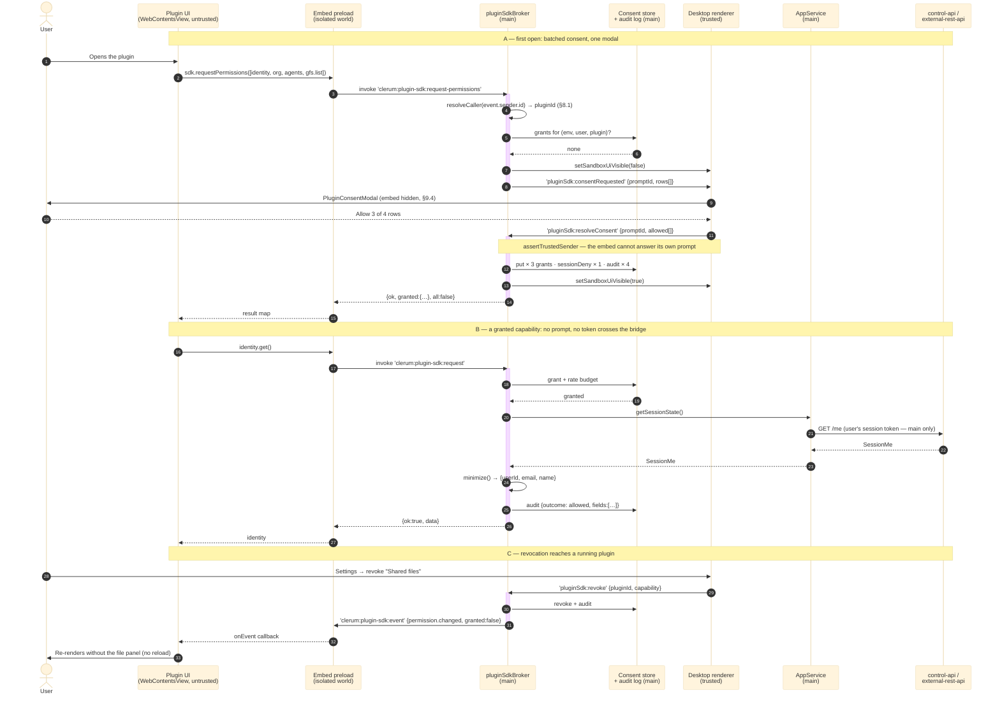

# Plugin UI SDK — typed, consented context bridge for sandbox-UI plugins

Surface: `desktop-app`. Sibling surface: the Side Window, which the broker can
host without a contract change (§14).

This document describes the system as it behaves today. §15 lists the modules,
and the gaps between this description and the code are named in §15.2. Where the
two disagree, the code is authoritative.

Author-facing counterpart: [`plugin-ui-sdk-authoring.md`](./plugin-ui-sdk-authoring.md).

---

## 1. Problem

A plugin (a `WorkflowRecipe` with `spec.ui`, see
[`WORKFLOW_RECIPE_GUIDE`](../agents/CLERUM_WORKFLOW_RECIPE_GUIDE.md) §6) renders
inside a hardened Electron `WebContentsView`: `nodeIntegration:false`,
`contextIsolation:true`, `sandbox:true`, a per-recipe partition, a strict CSP
from rpc-proxy (`rpc-proxy/src/routes/sandboxUi.ts:94`), and a navigation policy
pinning it to its own `view/*` prefix (`desktop-app/src/sandboxUiPartitionPolicies.ts`).

That isolation is correct and it is also the problem: the plugin knows nothing
about the human using it. Today the only ways a plugin learns anything about its
user are:

- `X-Clerum-User`, injected by rpc-proxy into requests reaching the plugin's own
  backend — an opaque id, server-side only, invisible to the embed's JS.
- Whatever the plugin asks the user to re-type into its own forms.
- Whatever a recipe author smuggles through `inputContract` defaults at install
  time.

So every plugin that wants "hello, Andres" or "which of your agents should I
target?" reinvents context passing, and reinvents it insecurely: prompting for
an email it cannot verify, or asking the operator to bake identity into a Secret.

Meanwhile the Desktop App already holds all of it — session identity, the access
catalog of agents/contexts/MCP servers, GFS resources, the notification channel,
the theme. There is no sanctioned, auditable way to hand any of it across the
embed boundary.

**This spec defines that way: a typed IPC SDK, deny-by-default, with per-plugin ×
per-capability consent, user-visible revocation, and an audit log.**

For the user-visible arc all of this machinery is in service of — first open to
revocation, including where it goes wrong — read **§17 (Appendix A)** first. The
sections in between specify how that arc is made true.

## 2. Goals / non-goals

### Goals

1. A **typed request/response + event API** between the plugin UI process and
   the Desktop master process, versioned, with a single audited chokepoint.
2. **Context providers** for identity, org, agents, contexts, MCP servers, GFS
   files, plus a notification sink and theme — extensible by adding a capability
   descriptor, not by adding an IPC channel.
3. A **consent layer**: any capability the user has not already approved for
   _this plugin_ surfaces a permission prompt naming the plugin and the exact
   scope. Approvals persist per (user, environment, plugin, capability).
4. **Revocation** from Desktop settings, taking effect immediately on the
   running embed.
5. An **audit log** of what each plugin requested and what it received.

### Non-goals

- **No new credential path.** The SDK never hands a plugin a session token, RPC
  token, OAuth grant, or any bearer material. It returns _data_, brokered by
  main, fetched with the user's own session. A plugin that wants to act as the
  user still goes through the existing OAuth (§7 of the recipe guide) or
  `backgroundAccess` broker paths.
- **No writes in v1.** Every capability is a read, except `notifications.notify`
  (which writes only to the user's own notification surface). No "create an
  agent", no "write this GFS file", no "trigger that workflow". Those are v2
  candidates and each needs its own consent copy and threat review.
- **No CRD change.** Capabilities are requested at runtime, not declared in
  `spec.ui` (decision D2, §3.3). The recipe YAML is untouched by this feature.
- **No server-side consent store in v1** — but the store is behind an interface
  so v2 can sync it (decision D1, §10.6).
- **No bypass of existing platform boundaries.** If control-api would deny the
  user the data, the SDK denies it too; consent is an _additional_ gate, never a
  substitute for the user's own ACL.

## 3. Decisions

| #   | Decision                                                                                                                                            | Rationale                                                                                                                                                                                                          |
| --- | --------------------------------------------------------------------------------------------------------------------------------------------------- | ------------------------------------------------------------------------------------------------------------------------------------------------------------------------------------------------------------------ |
| D1  | Consent grants + audit persist **locally now, behind a `ConsentStore` interface designed for server sync later**.                                   | Ships without a DB migration; the IPC contract does not change when sync lands (§10.6).                                                                                                                            |
| D2  | Capabilities are **runtime-requested, not declared in the CRD**. Undeclared ≠ denied because there is nothing to declare; the _prompt_ is the gate. | Zero platform work; feature lives entirely in `desktop-app`. Cost: no pre-install disclosure and a prompt-spam surface, mitigated in §9.5 / §12.                                                                   |
| D3  | The permission prompt is an **in-app React modal in the trusted renderer**, not `dialog.showMessageBox`.                                            | Room for real scope copy ("your name and email address"), the plugin's title and icon, and a link into the revocation page. Spoof-resistance comes from hiding the `WebContentsView` while the modal is up (§9.4). |
| D4  | A grant is **always-until-revoked**. No "allow once", no "allow for this session".                                                                  | One state per (plugin, capability): granted or not. A _denial_ is session-sticky only (§9.3) so a user who mis-clicks Deny is not permanently stuck.                                                               |

## 4. Architecture

```
┌──────────────────────────────────────────────────────────────────────────┐
│ Plugin UI  (UNTRUSTED)                                                   │
│   origin: rpc-proxy /api/v1/sandbox-ui/<ns>/<name>/view/                 │
│   WebContentsView · sandbox:true · contextIsolation:true · per-recipe    │
│   partition · CSP: script-src 'self'; connect-src 'self'; img-src        │
│   'self' data:                                                          │
│                                                                          │
│   window.clerum.identity.get()  ──────────────┐                          │
└───────────────────────────────────────────────┼──────────────────────────┘
                                                │ contextBridge
┌───────────────────────────────────────────────▼──────────────────────────┐
│ sandboxUiEmbedPreload.ts  (isolated world, no Node)                      │
│   one invoke channel:  clerum:plugin-sdk:request                         │
│   one event channel:   clerum:plugin-sdk:event                           │
└───────────────────────────────────────────────┬──────────────────────────┘
                                                │ ipcRenderer.invoke
┌───────────────────────────────────────────────▼──────────────────────────┐
│ MAIN PROCESS  (TRUSTED)                                                  │
│                                                                          │
│  pluginSdkBroker.ts        ← THE chokepoint. Every request passes here.  │
│    1. resolveCaller(senderId)      → pluginId, or reject (§8.1)          │
│    2. capabilityRegistry.lookup()  → descriptor or unsupported_capability│
│    3. requireSession()             → unauthenticated                     │
│    4. rateLimiter.take()           → rate_limited                        │
│    5. consentGate.check/prompt()   → permission_denied                   │
│    6. descriptor.provider(ctx)     → data                                │
│    7. descriptor.minimize(data)    → wire payload                        │
│    8. auditLog.append(...)         → always, allow or deny               │
│                                                                          │
│  pluginSurfaceRegistry.ts   webContents.id → { pluginId, surface }       │
│  pluginConsentStore.ts      grants, local impl behind an interface       │
│  pluginAuditLog.ts          append-only JSONL per environment            │
│  pluginSdkCapabilities.ts   the capability catalog (§6)                  │
│                                     │                                    │
│  AppService ────────────────────────┘  (existing: getSessionState,       │
│    listMyAgents, getAccessCatalog, listAccessibleMcpServers,             │
│    listAccessibleGfsResources, downloadGfsUri, listTeams, …)             │
└───────────────────────────────────────────────┬──────────────────────────┘
                                                │ ipcMain → trusted renderer
┌───────────────────────────────────────────────▼──────────────────────────┐
│ Desktop renderer  (TRUSTED, file:// or dev URL)                          │
│   PluginConsentModal          — the prompt (§9)                          │
│   SettingsPage → Plugin permissions — revocation + audit (§11)           │
└──────────────────────────────────────────────────────────────────────────┘
```

### 4.1 Message flow across the processes

The boxes above are the topology; this is the traffic. One diagram covers the
three cases that matter — a first call that must prompt, a later call against an
existing grant, and a revocation pushed back down into a running plugin.



Read the diagram for what is _absent_ as much as what is present: no arrow ever
runs from **P** to **API**, and no credential ever travels leftward past **B**.
The plugin's only edge is to its own preload; every hop beyond that is main
acting on the user's behalf.

Three further properties fall out of this shape and are worth stating explicitly:

- **The plugin never talks to control-api on the user's behalf.** It talks to
  main; main talks to control-api with the user's own session token; only the
  minimized result crosses back. The user's ACL is enforced upstream exactly as
  it is for the Desktop's own pages.
- **One chokepoint.** Adding a capability cannot accidentally skip the consent
  check or the audit write, because there is no second code path.
- **Identity of the caller is not self-asserted.** The plugin does not send its
  own id; main derives it from the sender's `webContents.id` (§8.1).

## 5. Wire protocol

### 5.1 Envelope

One invoke channel carries every capability call:

```ts
// desktop-app/src/pluginSdkProtocol.ts  (shared main ⇄ preload types)

export const PLUGIN_SDK_REQUEST_CHANNEL = 'clerum:plugin-sdk:request'
export const PLUGIN_SDK_PERMISSIONS_CHANNEL = 'clerum:plugin-sdk:request-permissions'
export const PLUGIN_SDK_EVENT_CHANNEL = 'clerum:plugin-sdk:event'
export const PLUGIN_SDK_VERSION = '1.0.0'

export type PluginSdkRequest = {
  /** Protocol version the embed was built against. Major mismatch → error. */
  v: 1
  /** Capability id, e.g. 'identity.read'. See §6. */
  capability: string
  /** Capability-specific params. Validated per descriptor; unknown keys rejected. */
  params?: Record<string, unknown>
}

export type PluginSdkResponse<T = unknown> =
  | { ok: true; data: T }
  | { ok: false; error: PluginSdkError }

export type PluginSdkError = {
  code: PluginSdkErrorCode
  /** Safe for the plugin to display. Never contains upstream internals. */
  message: string
  /** True when a later identical call may succeed without user action. */
  retryable: boolean
}

/**
 * Batched consent. One call, one modal, one decision per capability.
 * This is the intended way a plugin acquires permissions (§9.2).
 */
export type PluginSdkPermissionsRequest = {
  v: 1
  /** 1–8 capability ids. Duplicates and unknown ids are rejected up front. */
  capabilities: string[]
}

export type PluginSdkPermissionsResult = {
  /** capability id → granted. Every requested id is present. */
  granted: Record<string, boolean>
  /** True when the user allowed every requested capability. */
  all: boolean
}
```

The bridge **resolves** with the envelope and never rejects. Electron serializes
a thrown `Error` down to its message string, which loses the error code; an
explicit envelope keeps `code` machine-readable. The optional npm wrapper (§7.3)
re-throws typed errors for authors who prefer `try/catch`.

`requestPermissions` returns a **map, not an error**, even when the user declines
everything — "the user said no to two of these" is a normal outcome the plugin
must render, not an exceptional one. Individual capability calls still return
`permission_denied` per §5.2.

### 5.2 Error codes

| Code                     | Meaning                                                                                                                                | `retryable` |
| ------------------------ | -------------------------------------------------------------------------------------------------------------------------------------- | ----------- |
| `unsupported_capability` | Unknown id, or a capability this host build does not implement.                                                                        | false       |
| `unsupported_version`    | `v` is not a version this host speaks.                                                                                                 | false       |
| `invalid_request`        | Params failed the descriptor's validator (unknown key, wrong type, over a length cap).                                                 | false       |
| `unauthenticated`        | No Desktop session (user logged out, or logged out mid-call).                                                                          | true        |
| `permission_denied`      | The user denied this capability, or the prompt timed out (§9.3).                                                                       | true        |
| `permission_revoked`     | A grant existed and was revoked; distinct from `permission_denied` so a plugin can show "access was removed" rather than re-prompting. | true        |
| `rate_limited`           | Per-plugin or per-capability budget exhausted. Carries a `retryAfterMs` hint in `message`.                                             | true        |
| `not_found`              | The referenced resource (e.g. a `gfs://` URI) does not exist or the user cannot see it. Deliberately conflated — see §12.              | false       |
| `payload_too_large`      | The result exceeds the capability's response cap (§6.8).                                                                               | false       |
| `unavailable`            | Upstream (control-api / external-rest-api / gfsc) failed.                                                                              | true        |
| `internal`               | Anything else. Details go to the desktop log, not to the plugin.                                                                       | true        |

### 5.3 Events

Events are pushed on `clerum:plugin-sdk:event`, only ever to a pinned sender:

```ts
export type PluginSdkEvent =
  | { type: 'theme.changed'; theme: PluginTheme }
  | { type: 'permission.changed'; capability: string; granted: boolean }
  | { type: 'session.changed'; authenticated: boolean }
  // Carries back the opaque `ref` a notification was sent with (§6.8), so a
  // plugin can route a click without keeping its own correlation table.
  | { type: 'notification.clicked'; ref: string | null }
// Pre-existing, kept on its own legacy channel for compatibility (§7.2):
// clerum:sandbox-ui:oauth-completed
```

`permission.changed` is what makes revocation feel immediate: the Settings page
revokes, main invalidates its in-memory grant cache and emits the event, and a
well-written plugin drops back to its unauthenticated rendering without the user
having to reload it.

Events are **not** a capability — subscribing is free. But an event only fires
for a capability whose data the plugin could already have obtained:
`theme.changed` always fires (theme is unscoped, §6.7), `permission.changed`
fires only about that plugin's own grants, `session.changed` carries a boolean
and nothing else.

## 6. Capability catalog

Every capability is one immutable descriptor:

```ts
export type CapabilityDescriptor<P, R> = {
  id: string
  /** Copy shown in the consent prompt. */
  consent: {
    /** "See who you are" */
    title: string
    /** "Your name, email address, and user id." */
    dataDescription: string
    /** Sensitivity drives prompt styling and audit verbosity. */
    tier: 'personal' | 'workspace' | 'ambient'
  }
  /** 'ambient' capabilities skip the prompt entirely (§6.7). */
  requiresConsent: boolean
  validate: (raw: unknown) => P
  provider: (ctx: ProviderContext, params: P) => Promise<R>
  /** Strip everything the plugin does not need before it crosses the bridge. */
  minimize: (raw: R) => unknown
  limits: { perMinute: number; perHour: number; maxResponseBytes: number }
}
```

### 6.1 `identity.read` — who the user is

> **Prompt:** "**{Plugin}** wants to see who you are — your name, email address,
> and user id." Tier: `personal`.

```ts
type IdentityReadResult = {
  userId: string // SessionMe.id
  email: string // SessionMe.email
  name: string | null // SessionMe.name
}
```

Source: `AppService.getSessionState()` → `SessionMe`
(`desktop-app/src/types.ts:31`).

`picture` is **omitted**. It is a remote URL, and the embed's CSP is
`img-src 'self' data:` — the plugin could not render it anyway, so shipping it
would leak an identifier for zero benefit. If avatars are ever wanted, they come
back as a `data:` URI through a separate capability, not as a URL here.

### 6.2 `org.read` — the current workspace

> **Prompt:** "**{Plugin}** wants to see your current team — its name and your
> role in it." Tier: `workspace`.

```ts
type OrgReadResult = {
  teamId: string | null
  teamName: string | null
  role: 'owner' | 'admin' | 'member' | string | null
}
```

Source: `SessionMe.teamId / teamName / role`, with `AppService.listTeams()` as
the fallback when the session payload is stale.

**Team switching:** grants are keyed by `userId`, not by team (§10.2). After
`AppService.switchTeam()`, an already-granted `org.read` returns the _new_ team
without re-prompting. That is intentional — the consent was "see which workspace
I am in", and the answer changed. A `session.changed` event fires so the plugin
can refetch.

### 6.3 `agents.read` — agents the user can reach

> **Prompt:** "**{Plugin}** wants to see the agents you have access to — their
> names and which MCP servers they use." Tier: `workspace`.

```ts
type AgentsReadResult = {
  agents: Array<{
    /** Stable grant-target id when the server supplied one, else `name`. */
    id: string
    name: string
    contextRef: string | null
    provider: string | null
    mcpServers: string[] // names only
  }>
}
```

Source: `AppService.listMyAgents()` → `AgentWithMcpServers[]`
(`desktop-app/src/types.ts:375`), served fresh from `GET /me/agents`.
`id` is `gfsSubject.id` (`1st:<ns>/<name>`) when present, else `name` — which
also satisfies the "agent id and name" requirement without a second capability.

`minimize` flattens `mcpServers: Array<{name}>` to `string[]` and drops
`gfsSubject.type`.

### 6.4 `contexts.read` — contexts the user can reach

> **Prompt:** "**{Plugin}** wants to see the contexts you have access to."
> Tier: `workspace`.

```ts
type ContextsReadResult = {
  contexts: Array<{ id: string; scope: 'user' | 'team' }>
}
```

Source: `AppService.getAccessCatalog()` → `AccessCatalog.userContextIds` /
`teamContextIds` (`desktop-app/src/types.ts:413`). `scope` is derived from which
list the id came from; ids present in both report `'user'`.

### 6.5 `mcp.read` — MCP servers the user can invoke

> **Prompt:** "**{Plugin}** wants to see the MCP servers you have access to."
> Tier: `workspace`.

```ts
type McpReadResult = {
  servers: Array<{ name: string; agents: string[] }>
}
```

Source: `AppService.listAccessibleMcpServers()` → `RpcAllowedServersResult`
(`desktop-app/src/types.ts:457`), joined with `AccessCatalog.mcpServersByAgent`
to fill `agents`.

`minimize` **drops every `url`**. A server's cluster-internal URL is
infrastructure detail the embed has no use for (CSP `connect-src 'self'` means it
cannot call it) and is exactly the kind of thing that turns a read capability
into a lateral-movement hint.

### 6.6 `gfs.list` and `gfs.read` — Global File System

Two capabilities, because listing what exists and reading bytes are different
risks and deserve different prompts.

> **`gfs.list` prompt:** "**{Plugin}** wants to see the shared files you have
> access to — their names, folders, and sizes. It will not be able to open
> them." Tier: `workspace`.

```ts
type GfsListParams = { drive?: string; resourceId?: string; cursor?: string }
type GfsListResult = {
  items: Array<{
    resourceId: string
    gfsUri: string
    name: string
    kind: 'file' | 'directory'
    bytes: number | null
    version: number
  }>
  nextCursor: string | null
}
```

Source: `AppService.listAccessibleGfsResources()` (no `resourceId`) or
`AppService.listGfsChildren()` (with one).

> **`gfs.read` prompt:** "**{Plugin}** wants to open shared files you have access
> to. It will be able to read the contents of any file you can read." Tier:
> `personal` — content is materially more sensitive than a file listing.

```ts
type GfsReadParams = {
  uri: string // gfs://<drive>/<resource>
  as: 'text' | 'dataUrl'
}
type GfsReadResult = {
  gfsUri: string
  name: string
  mimeType: string
  bytes: number
} & ({ as: 'text'; text: string } | { as: 'dataUrl'; dataUrl: string })
```

Source: `AppService.downloadGfsUri()` → `{ resource, bytes }`, which resolves the
URI through the API on every call (no local mirror) so a revoked GFS grant denies
immediately at the server, independent of SDK consent.

**Image rendering (the "render an image from GFS" requirement) is `gfs.read` with
`as: 'dataUrl'`.** The embed's CSP is `img-src 'self' data:` — `blob:` is _not_
in the list, so an object URL would be blocked. The contract is therefore a
`data:` URI the plugin drops straight into ``:

```js
const res = await window.clerum.gfs.read({ uri: 'gfs://main/reports/chart.png', as: 'dataUrl' })
if (res.ok) document.querySelector('#chart').src = res.data.dataUrl
```

Rules for `as: 'dataUrl'`:

- MIME allowlist: `image/png`, `image/jpeg`, `image/gif`, `image/webp`,
  `image/avif`. **`image/svg+xml` is refused** (`invalid_request`) — an SVG in
  `` cannot execute script, but it can reference external resources and it
  is a persistent parser-bug surface; a plugin that wants vector art can ship it
  in its own bundle.
- Size cap: reuse the existing preview ceiling (`ui/src/lib/gfsImagePreview.ts`,
  `assertGfsImagePreviewSize`) so the SDK and the Desktop's own previewer agree.
  Over the cap → `payload_too_large`.
- The MIME type is taken from the resolved resource and re-checked against the
  actual magic bytes before encoding. A file named `.png` whose bytes are not a
  PNG is refused.

`as: 'text'` has its own cap (§6.8) and refuses non-UTF-8 bytes.

### 6.7 `theme.read` — Desktop appearance (unscoped)

> No prompt. Tier: `ambient`, `requiresConsent: false`.

```ts
type ThemeReadResult = { theme: 'light' | 'dark' }
```

This is the one capability that does not prompt, and the exception needs a stated
principle rather than a shrug: **`requiresConsent: false` is permitted only when
the response contains no information about the user, their org, or their data —
only about the Desktop's own presentation.** Theme qualifies. It is still logged
in the audit trail at `debug` verbosity, and it is still listed on the plugin's
Settings row as "Appearance (no permission needed)" so the user is never
surprised to learn a plugin knows their theme.

**Where theme lives.** The renderer owns it: `App.tsx` reads and writes
`localStorage['evenfire.ui.theme']` (`ui/src/constants/theme.ts`) and stamps
`data-theme` on `documentElement`. Main keeps a **mirror** in
`pluginThemeStore.ts` — the renderer pushes the current value on boot and on
every change, and main persists the last value so an embed that asks before the
renderer has reported gets the right answer instead of a default flash. Mirror
changes fan out to mounted embeds as `theme.changed`.

Main is deliberately not the source of truth. The plugin-visible contract is
identical either way, and making main authoritative would mean reconciling
`localStorage` with an on-disk file and constraining boot ordering for no
observable gain. A surface that needs theme with no renderer running (a headless
Side Window) is the case that would change this, and `pluginThemeStore.ts` is
where that change belongs.

### 6.8 `notifications.notify` — get the user's attention

> **Prompt:** "**{Plugin}** wants to send you notifications." Tier: `workspace`.

```ts
type NotifyParams = {
  title: string // ≤ 120 chars, plain text
  body?: string // ≤ 400 chars, plain text
  /** Opaque to the host; echoed back on click so the plugin can route. */
  ref?: string // ≤ 256 chars
}
type NotifyResult = { delivered: boolean; reason?: 'suppressed' | 'unsupported' }
```

Behaviour:

- Routes to the **existing** native notification path (`notifications:show` in
  `desktop-app/src/ipc.ts`), plus an in-app badge on the plugin's entry in the
  app rail so an attention request is not lost when OS notifications are off.
- The notification is **always attributed**: the title is rendered as
  `{Plugin title} — {title}`, so a plugin cannot impersonate Evenfire itself or
  another plugin.
- Plain text only. Title and body are stripped of control characters and never
  interpreted as markup.
- **Suppressed when the plugin's own embed is mounted, visible, and its window
  focused** — the user is already looking at it. Returns
  `{ delivered: false, reason: 'suppressed' }` rather than an error.
- Clicking focuses the Desktop window, navigates to that plugin, and delivers a
  `{ type: 'notification.clicked', ref }` event to the embed if it is mounted.
- Rate limits are deliberately the tightest in the catalog (§6.9). This is the
  only capability that can produce OS-level noise.

### 6.9 Limits

| Capability             | per min | per hour | max response    |
| ---------------------- | ------- | -------- | --------------- |
| `identity.read`        | 10      | 60       | 4 KB            |
| `org.read`             | 10      | 60       | 4 KB            |
| `agents.read`          | 10      | 120      | 256 KB          |
| `contexts.read`        | 10      | 120      | 64 KB           |
| `mcp.read`             | 10      | 120      | 128 KB          |
| `gfs.list`             | 30      | 600      | 512 KB          |
| `gfs.read`             | 20      | 300      | 20 MB envelope¹ |
| `theme.read`           | 60      | 600      | 1 KB            |
| `notifications.notify` | 2       | 20       | —               |

¹ One envelope cap per capability, checked on the serialized response. The
per-mode ceilings — 10 MB image, 2 MB text (§6.6) — are enforced inside the
provider, where the mode is known. The envelope cap is larger than both because
base64 inflates bytes by roughly 4/3.

Plus a **global per-plugin ceiling** of 120 requests/minute across all
capabilities, so a plugin cannot round-robin its way past the per-capability
budgets. Budgets are token buckets keyed by `(pluginId, capability)`, reset on
unmount.

Results are cached in main for a short TTL (identity/org/theme: 60 s; agents,
contexts, mcp: 30 s; gfs: none) so a chatty plugin polling `identity.read` does
not turn into upstream load. A cache hit is still rate-limited and still audited.

## 7. The plugin-facing API

### 7.1 Injected global

The embed preload keeps exposing `window.clerum` and gains namespaces. Every
method returns `Promise<PluginSdkResponse<T>>`:

```ts
window.clerum = {
  // ── existing, unchanged (§7.2) ────────────────────────────────
  requestSessionRefresh(): Promise<void>
  onOauthCompleted(cb: (p: { oauthClientId: string; provider: string }) => void): () => void

  // ── SDK ───────────────────────────────────────────────────────
  sdk: {
    version: '1.0.0'
    /** Capability ids this host build implements. No consent, no user data. */
    capabilities(): Promise<PluginSdkResponse<{ capabilities: string[] }>>
    /** Ask for several capabilities in ONE prompt. The intended entry point (§9.2). */
    requestPermissions(
      capabilities: string[]
    ): Promise<PluginSdkResponse<PluginSdkPermissionsResult>>
    /** Which of these are already granted? No prompt, no user data. */
    permissions(
      capabilities?: string[]
    ): Promise<PluginSdkResponse<{ granted: Record<string, boolean> }>>
    on(cb: (e: PluginSdkEvent) => void): () => void
  }
  identity: { get(): Promise<PluginSdkResponse<IdentityReadResult>> }
  org:      { get(): Promise<PluginSdkResponse<OrgReadResult>> }
  agents:   { list(): Promise<PluginSdkResponse<AgentsReadResult>> }
  contexts: { list(): Promise<PluginSdkResponse<ContextsReadResult>> }
  mcp:      { list(): Promise<PluginSdkResponse<McpReadResult>> }
  gfs: {
    list(p?: GfsListParams): Promise<PluginSdkResponse<GfsListResult>>
    read(p: GfsReadParams): Promise<PluginSdkResponse<GfsReadResult>>
  }
  theme:    { get(): Promise<PluginSdkResponse<ThemeReadResult>> }
  notifications: { notify(p: NotifyParams): Promise<PluginSdkResponse<NotifyResult>> }
}
```

`sdk.capabilities()` exists so a plugin can degrade gracefully on an older
Desktop build instead of hard-failing on `unsupported_capability`.
`sdk.permissions()` lets a plugin check state on every boot without prompting —
after the first run, a returning user should see the plugin's full UI with no
modal at all.

The intended startup shape, for the common plugin that needs several
capabilities to be useful at all:

```js
const need = ['identity.read', 'org.read', 'agents.read', 'gfs.list']

const have = await window.clerum.sdk.permissions(need)
const missing = need.filter(c => !have.data.granted[c])

if (missing.length) {
  const res = await window.clerum.sdk.requestPermissions(missing)   // ONE modal
  if (!res.ok || !res.data.all) return renderSetupNeeded(res.data?.granted)
}
renderDashboard()
```

Everything is `Object.freeze`d at the contextBridge boundary, as today.

### 7.2 Backward compatibility

`requestSessionRefresh` and `onOauthCompleted` keep their current names,
signatures, and IPC channels (`clerum:sandbox-ui:request-refresh`,
`clerum:sandbox-ui:oauth-completed`). Existing plugins keep working with no
change. The OAuth completion event is **not** folded into the new event channel
in v1 — moving it would break every shipped recipe that listens for it.

### 7.3 Optional npm wrapper

`@evenfire/plugin-ui-sdk` — a dependency-free typed wrapper the author bundles
(CSP forbids CDN scripts, so it must be bundled, never `<script src>`-ed):

```ts
import { createClient, PluginPermissionError } from '@evenfire/plugin-ui-sdk'

const evenfire = createClient()          // throws if not running inside Evenfire

// One modal for everything this plugin needs, only for what is still missing.
const { all, granted } = await evenfire.ensurePermissions([
  'identity.read', 'org.read', 'agents.read', 'gfs.list',
])
if (!all) return renderSetupNeeded(granted)

try {
  const me = await evenfire.identity.get()   // unwrapped; throws typed errors
  greet(me.name ?? me.email)
} catch (err) {
  if (err instanceof PluginPermissionError) showConnectPrompt()
}
```

`ensurePermissions()` is the wrapper's one piece of real logic: it calls
`sdk.permissions()` first and only opens a prompt for the ids still missing, so a
returning user never sees a modal. Everything else is convenience — the `.d.ts`,
envelope unwrapping, typed errors, `isAvailable()`. The injected global remains
the actual contract, so a plugin with no build step can use the SDK directly.

## 8. Caller identity and trust

### 8.1 How main knows which plugin is calling

The plugin does **not** identify itself. Main derives it:

```
mountSandboxUiView()  → pluginSurfaceRegistry.pin(webContents.id, {
                          pluginId: `${recipeNs}/${recipeName}`,
                          surface: 'sandbox-ui-embed',
                          title, generation })
teardownActive()      → pluginSurfaceRegistry.unpin(webContents.id)
```

On every request, `resolveCaller(event.sender.id)` looks up the pinning map. An
unpinned sender is rejected with `internal` and logged loudly — it means either a
bug or a sender that should not be reaching this channel at all.

This is the same pattern already proven for the refresh IPC
(`desktop-app/src/sandboxUiSessionRefresh.ts`: `senderToRefreshContext`,
`handleEmbedRefreshRequest`), generalized so it can hold more than one surface
(§14). Note the deliberate asymmetry with the rest of the IPC surface: these
handlers must **not** call `assertTrustedSender` (the embed loads from the
rpc-proxy origin, not `file://`), which is exactly why the pinning map is the
trust check. `desktop-app/src/ipc.ts:1414-1423` documents this today; the new
handler carries the same comment.

Properties:

- A plugin cannot claim to be another plugin: the id comes from the mount, not
  the message.
- A torn-down embed is unpinned before its renderer finishes dying, so late
  in-flight IPC from a closed plugin is rejected.
- The `generation` counter guards the mount race the driver already handles
  (`mountGeneration` in `sandboxUiDriver.ts`): a request from generation N is
  dropped once generation N+1 has mounted.

### 8.2 What never crosses the bridge

Session tokens, RPC tokens, OAuth access/refresh tokens, the broker token,
cookie values, MCP server URLs, cluster-internal FQDNs, other users' data, other
plugins' grants, raw upstream error bodies.

A `minimize()` function is **mandatory** on every descriptor — not optional with
a passthrough default — so adding a capability forces an explicit decision about
what the plugin sees. Reviewers should treat a `minimize` that returns its input
unchanged as a finding.

## 9. Consent

### 9.1 State

One row per `(envKey, userId, pluginId, capability)`:

```ts
type ConsentGrant = {
  envKey: string // partitionFor()'s env scoping, from config.getActiveEnvKey()
  userId: string
  pluginId: string // '<recipeNs>/<recipeName>'
  capability: string
  grantedAt: string // ISO 8601
  lastUsedAt: string | null
  /** Bumped when the descriptor's data shape widens (§9.6). */
  descriptorVersion: number
  revision: number // monotonic, for the v2 sync merge (§10.6)
}
```

Absence of a row = not granted. There is no `denied` row — see §9.3.

### 9.2 Flow — batched consent is the primary path

Most plugins need several capabilities before they can render anything useful; a
CRM dashboard with no identity, no agents, and no files is a blank page. Asking
for those one modal at a time is both worse UX and, under the §9.5 budget,
self-defeating. **The unit of consent is therefore the prompt, not the
capability**: one call, one modal, one decision per row.

```
embed → clerum.sdk.requestPermissions(
          ['identity.read', 'org.read', 'agents.read', 'gfs.list'])
  broker: pinned? → yes, pluginId = sandbox-recipes/leadforge
  broker: every id known + ≤8 + no duplicates      else invalid_request
  broker: session present                          else unauthenticated
  broker: drop ids already granted / already session-denied
  broker: prompt budget ok (§9.5)
  broker: consentGate.promptBatch(...)
      → main: sandboxUi.setVisible(false)                    [embed hidden]
      → main → renderer: 'pluginSdk:consentRequested'
          { promptId, pluginId, pluginTitle, pluginIcon,
            rows: [{ capability, title, dataDescription, tier }, …] }
      → renderer renders PluginConsentModal — every row checked by default,
        each independently uncheckable, one Allow button
      → user unchecks 'gfs.list', clicks Allow
      → renderer → main: 'pluginSdk:resolveConsent'          [assertTrustedSender]
          { promptId, allowed: ['identity.read','org.read','agents.read'] }
      → main: consentStore.put() × 3
              sessionDenials.add('gfs.list')
              auditLog.append() × 4                          [one line per row]
      → main: sandboxUi.setVisible(true)                     [embed restored]
embed ← { ok: true, data: { granted: { 'identity.read': true, 'org.read': true,
          'agents.read': true, 'gfs.list': false }, all: false } }

… later …
embed → clerum.identity.get()
  broker: consentStore.get(...) → hit, no prompt
  broker: provider() → SessionMe ; minimize() → { userId, email, name }
  broker: auditLog.append('allowed', { fields: ['userId','email','name'] })
embed ← { ok: true, data: { … } }
```

**Rows are individually declinable, and the plugin cannot mark any of them
required.** A plugin that genuinely needs all four is free to say so in its own
UI after the fact ("LeadForge needs access to your files to show the pipeline") —
what it must not do is borrow the _host's_ chrome to apply that pressure. A
"Required" badge rendered by Evenfire in Evenfire's modal reads as the platform
vouching for the demand, and once one plugin gets it every plugin marks
everything required. The all-or-nothing conversation belongs in the plugin's own
pixels, where the user can tell who is asking.

Modal anatomy:

```
┌──────────────────────────────────────────────────────────────┐
│  [icon]  LeadForge wants access to your information          │
│                                                              │
│  ☑  See who you are                                          │
│     Your name, email address, and user id.                   │
│  ☑  See your current team                                    │
│     Its name and your role in it.                            │
│  ☑  See the agents you have access to                        │
│     Their names and which MCP servers they use.              │
│  ☐  See the shared files you have access to                  │
│     Their names, folders, and sizes. It will not be able     │
│     to open them.                                            │
│                                                              │
│  You can change this any time in Settings → Plugin           │
│  permissions.                                                │
│                                     [ Deny ]  [ Allow ]      │
└──────────────────────────────────────────────────────────────┘
```

`dataDescription` is rendered verbatim from the descriptor, so the sentence the
user reads here is byte-identical to the one the Settings page shows them later.
Rows are ordered `personal` first, then `workspace`, then `ambient` — the most
sensitive ask should not be the one buried at the bottom of a long modal.
**Deny** clears every row and closes.

A single capability call on an ungranted capability still prompts, for one row.
That path exists for the capability a plugin discovers it needs mid-session
(a `gfs.read` when the user clicks a file), not as the normal way to acquire the
startup set.

### 9.3 Denial semantics

D4 makes _grants_ permanent-until-revoked. Denials are deliberately weaker:

- **Deny** records no row — including a row left unchecked in a batch prompt. It
  adds `(pluginId, capability)` to an in-memory `sessionDenials` set, cleared
  when the embed unmounts or the app quits.
- While denied, the capability returns `permission_denied` **immediately**, with
  no prompt. This is the anti-prompt-spam mechanism (§12, T4): one denial buys
  silence for the rest of the session.
- Reopening the plugin gives it one more chance to ask. That is the escape hatch
  for a mis-click, and the reason no "never ask again" checkbox is needed in v1:
  the user can simply not press Allow.
- A prompt that times out (120 s) or is dismissed with Escape counts as a
  denial.

### 9.4 Spoof resistance

The prompt renders in the trusted renderer, but a `WebContentsView` always paints
above renderer DOM regardless of z-index — a plugin could otherwise paint a fake
modal, or paint over the real one. Mitigations, all required:

1. **Hide the embed for the duration of the prompt** via the existing
   `setSandboxUiVisible(false)` path (`ui/src/pages/SandboxUiPage.tsx:387` already
   does this for overlays). The plugin cannot render anything while the modal is
   up.
2. **Main owns the prompt text.** The renderer receives a `capability` id and
   renders copy from its own catalog; no plugin-supplied string reaches the
   modal except the plugin's own title and icon, both from the recipe's
   installed metadata (never from an SDK call), both truncated and rendered as
   text.
3. **`promptId` is a main-generated nonce.** A resolve for an unknown, stale, or
   already-resolved `promptId` is dropped.
4. **The resolve channel is `assertTrustedSender`-guarded**, so the embed cannot
   answer its own prompt even if it could reach the channel.
5. **One prompt at a time, globally.** Concurrent requests queue. A capability
   already represented as a row in the in-flight prompt joins that prompt rather
   than opening a second one, so a plugin that fires `requestPermissions([…])`
   and an eager `identity.get()` in the same tick gets one modal, not two.
6. **The prompt requires a focused, visible Desktop window.** If the window is
   hidden or unfocused, the request parks (up to the 120 s timeout) rather than
   racing a modal onto a screen the user is not looking at.

### 9.5 Prompt budget

D2 (no CRD declaration) means a hostile plugin can ask for anything. Beyond
session-sticky denial, the gate enforces:

- At most **3 consent prompts (modals) per plugin per mount**, and at most **8
  capability rows** in any one of them. The budget counts _modals_, not
  capabilities — a plugin asking for its whole startup set in one batch spends
  one of three, which is why §9.2's batched path is the sanctioned one and a
  per-capability drip is not. Beyond the budget, ungranted capabilities return
  `permission_denied` until the user reopens the plugin.
- A **10 s cooldown** between modals, so a plugin cannot chain them fast enough
  to train the user into reflexive clicking.
- The modal shows a persistent "This plugin has asked for permissions N times
  this session" line from the second prompt onward.

Batching moves the pressure from _volume_ to _breadth_: instead of four modals a
hostile plugin now writes one modal with eight rows. That is the better failure
mode — a single screen listing everything a plugin wants is exactly the artifact
a user can evaluate, and an eight-row modal from a note-taking plugin looks
wrong in a way that four modals spread over thirty seconds does not.

### 9.6 Descriptor versioning

If a capability's payload later widens (say `identity.read` starts returning a
phone number), the descriptor's `descriptorVersion` increments. Grants at a
lower version **do not** cover the wider payload: the gate re-prompts with copy
that names the new field. Silently widening what an existing grant covers is the
single easiest way to turn a consent system into theatre, so the version check
is a hard requirement, not a nicety.

## 10. Storage

### 10.1 Interface

```ts
export interface ConsentStore {
  list(envKey: string, userId: string): Promise<ConsentGrant[]>
  get(k: GrantKey): Promise<ConsentGrant | null>
  put(g: ConsentGrant): Promise<void>
  revoke(k: GrantKey): Promise<void>
  revokeAllForPlugin(envKey: string, userId: string, pluginId: string): Promise<void>
  /** v2 hook, unused by the local impl. */
  sync?(envKey: string, userId: string): Promise<void>
}
```

### 10.2 Local implementation (v1)

- File: `<userData>/plugin-consent/<envKey>.json`, mode `0600`, written
  atomically (temp file + rename), one file per environment — mirroring how
  `tokenStore.ts` scopes secrets and `partitionFor()` scopes partitions by
  `envKey`. Cluster A's grants never leak into cluster B's.
- Keyed by `userId` inside the file, so a shared machine with two accounts keeps
  grants separate.
- `envKey` is validated with the same `ENV_KEY_SHAPE` guard `tokenStore.ts` uses
  before it is interpolated into a path.
- **Not encrypted.** Grants are not secrets — they are a list of "plugin X may
  read Y". Encrypting them with `safeStorage` would buy nothing against an
  attacker with local file access (who could just edit the plaintext audit log
  or the app bundle) while adding a failure mode on platforms where `safeStorage`
  is unavailable. The file being world-unreadable is the protection.
- Schema carries `{ version: 1, users: { [userId]: ConsentGrant[] } }`. An
  unreadable or version-newer file is treated as **empty** (fail closed: every
  capability re-prompts) and moved aside, never partially parsed.
- In-memory cache in front, invalidated on write and on revocation, so the hot
  path is not a file read.

### 10.3 Audit log

- File: `<userData>/plugin-audit/<envKey>.jsonl`, append-only, mode `0600`.
- One line per decision:

```json
{
  "ts": "2026-08-06T10:14:02.113Z",
  "userId": "u_123",
  "pluginId": "sandbox-recipes/leadforge",
  "capability": "identity.read",
  "outcome": "allowed",
  "consent": "existing_grant",
  "shape": { "fields": ["userId", "email", "name"] },
  "bytes": 142,
  "surface": "sandbox-ui-embed"
}
```

- **Records shape, never content.** `fields` for objects, `count` for lists,
  `bytes` for blobs. The audit log must never become a second copy of the user's
  email, their file contents, or their agent names — a log that reproduces the
  data it is auditing is a liability, not a control.
- `outcome ∈ allowed | denied | revoked_mid_flight | rate_limited | error`.
  `consent ∈ existing_grant | prompt_allowed | prompt_denied | not_required`.
- Rotation at 5 MB or 90 days, whichever first; one `.1` generation kept.
- `ambient` capabilities are recorded at `debug` verbosity and excluded from the
  Settings view by default (a `theme.read` every second would drown the log the
  user actually cares about), but they are still on disk.

### 10.4 What is _not_ stored

Prompt decisions of `deny` (in-memory only, §9.3), request params, response
payloads, and any bearer material.

### 10.5 Logout, uninstall, environment switch

- **Logout:** grants are retained, keyed by `userId`. Logging back in as the same
  user restores them; a different user starts clean. In-flight SDK calls fail
  `unauthenticated` and a `session.changed` event fires.
- **Plugin uninstalled / access revoked (Members tab):** the next launch's
  partition GC pass (`sandboxUiPartitionGc.ts`) already walks partitions the user
  no longer has ACL for. The consent store hooks the same pass and drops grants
  for plugins the user can no longer see. Until then a stale grant is harmless —
  the plugin cannot be mounted.
- **Environment switch:** different `envKey`, different file, no crossover.

### 10.6 Path to server-side sync (v2)

The interface above is the whole v1 obligation; this is the sketch it must not
foreclose.

- control-api gains `GET/PUT/DELETE /api/v1/me/plugin-consent`, rows scoped to
  `(userId, pluginId, capability)` with a monotonic `revision`.
- `RemoteConsentStore` implements the same interface; `SyncingConsentStore`
  composes local + remote with local-first reads (so the SDK works offline) and
  last-writer-wins by `revision`, except that **a revocation always wins over a
  concurrent grant** — the safe direction for a security-relevant merge.
- The audit log gains an optional shipper to the same endpoint so operators can
  see org-wide plugin behaviour.
- **No change to the IPC contract, the descriptors, or the prompt.** That is the
  test of whether this spec's layering is right: v2 should touch
  `pluginConsentStore.ts` and nothing the plugin can observe.

## 11. Revocation UI

New Settings section: **Settings → Plugin permissions**
(`ui/src/pages/SettingsPage.tsx`, following the `.page-card` conventions in
`desktop-app/ui/AGENTS.md` — `da-grid` for the listing, `Common` controls, no new
CSS files).

**Plugin list** — one row per plugin holding ≥1 grant:

| Plugin    | Permissions                      | Last used     |     |
| --------- | -------------------------------- | ------------- | --- |
| LeadForge | Identity · Agents · Shared files | 2 minutes ago | ⋯   |
| Sales CRM | Identity · Notifications         | yesterday     | ⋯   |

Row expands to per-capability detail: the human title, the same
`dataDescription` string the prompt showed (so the user is re-reading exactly
what they agreed to, not a paraphrase), `grantedAt`, `lastUsedAt`, and a
**Revoke** button. Row menu offers **Revoke all for this plugin**.

Empty state: "No plugin has been granted access to your information."

**Activity** — a tab over the audit log, newest first, filterable by plugin and
by outcome, showing timestamp / plugin / capability / outcome / shape summary.
Denials and rate-limits are included: a plugin that repeatedly asks for things
the user refuses is exactly what a user should be able to notice. **Clear
activity log** empties both rotation generations.

Revocation is immediate:

1. `consentStore.revoke(key)`, cache invalidated.
2. `permission.changed { capability, granted: false }` to the plugin if mounted.
3. Any in-flight request for that capability resolves `permission_revoked`.
4. Audit line with `outcome: 'revoked'`.

The plugin is **not** reloaded or unmounted. A plugin should handle losing a
permission the way it handles never having had it; forcing a reload would be a
worse experience for the many well-behaved plugins to marginally inconvenience
the rare misbehaving one.

## 12. Threat model

| #   | Threat                                                            | Mitigation                                                                                                                                                                                                                                                                                                                                                                                                                                                                                             |
| --- | ----------------------------------------------------------------- | ------------------------------------------------------------------------------------------------------------------------------------------------------------------------------------------------------------------------------------------------------------------------------------------------------------------------------------------------------------------------------------------------------------------------------------------------------------------------------------------------------ |
| T1  | Plugin claims to be a different plugin to reuse its grants.       | Caller identity from the pinning map, never from the message (§8.1).                                                                                                                                                                                                                                                                                                                                                                                                                                   |
| T2  | Plugin reads context without consent.                             | Deny by default; the broker is the only path and consent precedes the provider call (§4).                                                                                                                                                                                                                                                                                                                                                                                                              |
| T3  | Plugin paints a fake permission dialog to phish an approval.      | Embed hidden during prompts; main owns prompt copy; nonce'd `promptId`; trusted-sender resolve (§9.4).                                                                                                                                                                                                                                                                                                                                                                                                 |
| T4  | Prompt fatigue — plugin spams modals until the user clicks Allow. | 3 prompts/mount, 10 s cooldown, session-sticky denial, prompt-count line in the modal (§9.5).                                                                                                                                                                                                                                                                                                                                                                                                          |
| T5  | Plugin exfiltrates context to a third party.                      | Not preventable at this layer and the spec should say so plainly: once a plugin legitimately holds the user's email, it can POST it to its own backend (its own origin is allowed by `connect-src 'self'`). The mitigations are _disclosure_ (the prompt states what is shared), _attribution_ (the audit log records who got what), and _revocation_. Users grant to a plugin they chose to install; the SDK makes that grant visible and reversible, it does not make it enforceable after the fact. |
| T6  | Escalation via SDK past the user's own ACL.                       | Every provider calls an `AppService` method with the user's session; upstream authorizes exactly as it does for the Desktop's own pages. The SDK can only ever return a subset.                                                                                                                                                                                                                                                                                                                        |
| T7  | Resource exhaustion (polling, huge GFS reads).                    | Per-capability + global token buckets, response caps, short-TTL caching (§6.9).                                                                                                                                                                                                                                                                                                                                                                                                                        |
| T8  | Data leak through error messages.                                 | Fixed error-code taxonomy; upstream bodies never forwarded; `not_found` deliberately conflates "does not exist" with "you cannot see it" so the SDK is not an existence oracle for GFS resources (§5.2).                                                                                                                                                                                                                                                                                               |
| T9  | Grant tampering on disk.                                          | `0600`, atomic writes, fail-closed on unparseable input. An attacker with write access to `userData` already owns the app; this is hygiene, not a boundary.                                                                                                                                                                                                                                                                                                                                            |
| T10 | Stale grant after ACL removal.                                    | Partition-GC-time cleanup plus the fact that an unreachable plugin cannot mount (§10.5).                                                                                                                                                                                                                                                                                                                                                                                                               |
| T11 | Late IPC from a torn-down or superseded embed.                    | Unpin on teardown; generation check (§8.1).                                                                                                                                                                                                                                                                                                                                                                                                                                                            |
| T12 | Malicious image bytes via `gfs.read`.                             | MIME allowlist, SVG refused, magic-byte re-check, size cap, `data:` only — and the renderer is Chromium's own image decoder in a sandboxed process (§6.6).                                                                                                                                                                                                                                                                                                                                             |
| T13 | Notification spoofing ("Evenfire: enter your password").          | Mandatory plugin-title prefix, plain text only, tight rate limit (§6.8).                                                                                                                                                                                                                                                                                                                                                                                                                               |

## 13. Testing

Time-dependent behaviour — the prompt cooldown, the window-focus wait, rate-limit
refill, audit rotation — is driven by an injectable clock and `sleep`, so each is
asserted rather than waited out.

**Unit (vitest, `desktop-app/src/__tests__/`)** — the broker's decision table is
the highest-value target:

- `pluginSdkBroker`: unpinned sender rejected; stale generation rejected; unknown
  capability; version mismatch; unauthenticated; rate-limit exhaustion and
  refill; grant hit skips prompt; grant miss prompts; denial is session-sticky;
  prompt budget exhaustion; descriptor-version bump forces re-prompt; revocation
  mid-flight yields `permission_revoked`; every outcome writes exactly one audit
  line.
- `requestPermissions` batching: unknown/duplicate/over-8 id lists rejected
  before any modal renders; already-granted and already-denied ids are dropped
  from the prompt but still present in the returned map; a partial allow returns
  the right per-row map with `all: false`; each row writes its own audit line;
  declined rows land in `sessionDenials`; a batch spends exactly one prompt from
  the budget; a concurrent single-capability call for a row already in flight
  joins that modal instead of queueing a second.
- `pluginConsentStore`: round-trip; per-env and per-user isolation; corrupt file
  → empty + moved aside; atomic write leaves no partial file; concurrent
  put/revoke ordering.
- `pluginAuditLog`: shape-only redaction (a test that asserts a known email
  string never appears in the file is worth having explicitly); rotation.
- Each descriptor's `minimize`: given a full upstream payload, assert the wire
  payload has exactly the documented keys — this is the regression net against
  a future field silently widening a capability.
- `gfs.read`: MIME allowlist, SVG refusal, magic-byte mismatch, size cap.

**Renderer (`ui/src/**/**tests**`)\*\* — modal renders host-owned copy for a given
capability id; Allow/Deny/Escape/timeout resolve correctly; embed visibility
toggles around the modal; Settings list renders grants, revoke calls through and
updates optimistically; audit tab filters.

**Integration** — mount a fixture recipe whose UI exercises each capability;
assert: first call prompts, second does not, revoke → `permission_revoked`, and
that a second concurrently-pinned surface cannot read the first's grants.

**Manual / security review checklist** — verify the embed cannot reach
`pluginSdk:resolveConsent`; verify the modal is not clickable-through to the
`WebContentsView`; verify no token appears in any audit line or SDK response.

## 14. Side Window compatibility

The Side Window will host plugin UIs in a different Electron surface with the
same need for context. Nothing in this spec is embed-specific except the pinning
call sites:

- `pluginSurfaceRegistry` already carries `surface: 'sandbox-ui-embed' |
'side-window'`; the Side Window's mount path pins and unpins the same way.
- Grants are keyed by `pluginId`, **not** by surface — a user who granted
  LeadForge their identity in the embed should not be re-prompted when the same
  plugin appears in the Side Window. Same plugin, same user, same decision.
- The audit line records `surface` so the two are distinguishable after the fact.
- The consent modal must render above whichever surface is active; if the Side
  Window is a separate `BrowserWindow`, the prompt targets that window and the
  §9.4 hide-the-embed step becomes hide-the-active-plugin-surface.

The only thing the Side Window must not do is introduce a second broker.

## 15. Source layout

### 15.1 Modules

| File                                                                | Purpose                                                                                                                                                                                                   |
| ------------------------------------------------------------------- | --------------------------------------------------------------------------------------------------------------------------------------------------------------------------------------------------------- |
| `desktop-app/src/pluginSdkProtocol.ts`                              | Wire types, channel names, version, and the view types the trusted renderer consumes. The only SDK module with no Node or Electron imports, so the preload and the Vite project can both type against it. |
| `desktop-app/src/pluginSdkCapabilities.ts`                          | The descriptor catalog (§6): consent copy, validators, providers, limits.                                                                                                                                 |
| `desktop-app/src/pluginSdkBroker.ts`                                | The chokepoint (§4).                                                                                                                                                                                      |
| `desktop-app/src/pluginSurfaceRegistry.ts`                          | `webContents.id → { pluginId, surface, generation }` (§8.1).                                                                                                                                              |
| `desktop-app/src/pluginConsentStore.ts`                             | `ConsentStore` interface + local implementation (§10).                                                                                                                                                    |
| `desktop-app/src/pluginConsentGate.ts`                              | Prompt queue, budget, session denials, timeout (§9).                                                                                                                                                      |
| `desktop-app/src/pluginAuditLog.ts`                                 | Append-only JSONL + rotation (§10.3).                                                                                                                                                                     |
| `desktop-app/src/pluginRateLimiter.ts`                              | Token buckets (§6.9).                                                                                                                                                                                     |
| `desktop-app/src/pluginThemeStore.ts`                               | Theme mirrored into main (§6.7).                                                                                                                                                                          |
| `desktop-app/src/pluginSdkRuntime.ts`                               | Every Electron dependency — BrowserWindow, Notification, the sandbox-ui driver, the settings surface — kept in one module so the rest of the SDK is testable without an Electron runtime.                 |
| `desktop-app/src/sandboxUiEmbedPreload.ts`                          | The injected `window.clerum` surface (§7.1).                                                                                                                                                              |
| `desktop-app/ui/src/components/PluginConsentModal/`                 | The prompt (§9.4).                                                                                                                                                                                        |
| `desktop-app/ui/src/hooks/domain/usePluginPermissionsController.ts` | Query controller for the settings surface.                                                                                                                                                                |
| `desktop-app/ui/src/components/PluginPermissions/`                  | Settings → Plugin permissions (§11).                                                                                                                                                                      |

Two wiring constraints are load-bearing and easy to undo by accident:

- **`ipc.ts` imports the runtime lazily** (`await import()` inside each handler).
  A static import pulls `config.ts` into the graph, and `config.ts` loads stored
  profiles at module scope against a real Electron `app` — which would make
  merely registering IPC handlers depend on an initialized Electron runtime.
- **The embed preload duplicates its channel names as literals.** It runs with
  `sandbox: true`, where Electron's `require` is a polyfill serving only
  `electron` and a few builtins, so a relative `require('./pluginSdkProtocol.js')`
  throws at runtime. Type-only imports are erased and therefore safe.
  `__tests__/pluginSdkSurface.test.ts` asserts the literals still match the
  protocol module and that no relative value import has reappeared.

### 15.2 Not implemented today

- **Grant cleanup for unreachable plugins.** `LocalConsentStore.pruneToPlugins`
  and `PluginSdkRuntime.pruneGrantsToPlugins` exist and are unit-tested, but no
  caller invokes them: the launch-time pass in `sandboxUiPartitionGc.ts` is not
  wired to the consent store. A grant for a plugin the user can no longer reach
  therefore persists, inert — the plugin cannot mount, so nothing can use it —
  until the user revokes it. §10.5 describes the intended behaviour.
- **Renderer tests.** The main-process half is covered; `PluginConsentModal` and
  the Settings panel are not. The modal's Escape-denies and disabled-Allow
  behaviour and the panel's revoke path have no automated coverage.
- **`packages/plugin-ui-sdk/`**, the optional typed npm wrapper (§7.3). The
  injected global is the contract, so nothing depends on the wrapper existing.
- **A sample recipe** under `workflow-recipes/samples/` exercising every
  capability.

## 16. Open questions

1. **Should `gfs.read` be granted per-resource rather than per-capability?**
   Today "open shared files" is one grant covering everything the user can read.
   A per-folder scope is a much better privacy story and a much worse UX (a
   prompt per file). A middle path — grant per top-level drive folder — is
   worth prototyping before the descriptor's shape is depended on.
2. **Does `identity.read` need splitting?** Some plugins want a display name and
   nothing else. `identity.read` (name only) + `identity.email` as separate
   capabilities would be more honest, at the cost of two prompts for the common
   case. Cheap to add later, breaking to remove.
3. **Should the SDK expose the plugin's own recipe metadata** (name, version,
   install time)? No user data, arguably `ambient`, plausibly useful for a plugin
   showing its own version. Deferred.
4. **Audit retention default.** 90 days / 5 MB is a guess. Should the user be
   able to clear it, and does clearing it deserve its own audit line?
5. **First-run disclosure.** With no CRD declaration (D2), the user learns what a
   plugin wants only when it asks. Should the Settings row show "has never
   requested any permission" so a dormant plugin is distinguishable from a
   well-behaved one?
6. **Recovering from a declined row inside a session.** Session-sticky denial
   (§9.3) means a plugin's own "Enable file access" button is inert until the
   user closes and reopens the plugin — which no user will guess. The clean fix
   is to let a _user gesture inside the plugin_ re-open the prompt for a declined
   capability once per session, but the SDK cannot distinguish a real click from
   a synthetic one, so "user gesture" would be plugin-asserted and therefore
   worthless as a gate. The alternative is a "Request again" affordance on the
   Settings row, which is trustworthy but hidden. Unresolved.

---

## 17. Appendix A — End-user walkthrough

The sections above describe mechanism. This one describes the arc a single user
lives through. Scene 2 — a returning user who sees no modal at all — is the
invariant the rest of the design exists to protect; a change that breaks it is a
regression regardless of what else it improves.

Cast: **Andres**, a member of the Acme team. **LeadForge**, a sandbox-UI plugin
that wants identity, org, agents, and shared files.

### Scene 0 — the plugin arrives

An operator installs LeadForge from the registry and grants Andres access on the
recipe's **Members** tab. Nothing SDK-related has happened. LeadForge appears in
the Desktop app rail like any other plugin.

### Scene 1 — first open: exactly one modal

Andres clicks LeadForge. The embed mounts and loads. Its JS calls
`sdk.permissions([...])`, gets four `false`s, and calls `sdk.requestPermissions()`
with all four (§7.1). Its own UI is still a skeleton — no data yet.

The embed then **visibly blanks**, and a modal appears over it:

> **LeadForge wants access to your information**
> ☑ See who you are — _Your name, email address, and user id._
> ☑ See your current team — _Its name and your role in it._
> ☑ See the agents you have access to — _Their names and which MCP servers they use._
> ☑ See the shared files you have access to — _Their names, folders, and sizes. It will not be able to open them._
> _You can change this any time in Settings → Plugin permissions._
> ⟨Deny⟩ ⟨Allow⟩

**The blanking is deliberate and users should read it as "the app is asking, not
the plugin."** A `WebContentsView` paints above renderer DOM regardless of
z-index, so hiding the embed is the only way to guarantee the plugin can neither
draw a convincing fake modal nor paint over the real one (§9.4).

Andres unchecks files, clicks Allow. The modal closes, LeadForge reappears and
paints a real dashboard: his name in the header, his agents in a dropdown, and —
because it asked for four things and got three — an inline "Connect your shared
files to see pipeline documents" card where the file list would have been. That
card is LeadForge's own pixels. The host never renders a plugin's case for why it
needs something (§9.2).

Total cost of first run: **one modal**, covering the plugin's entire startup set.

### Scene 2 — every subsequent open: no modal

Tomorrow, next week, next month: `sdk.permissions()` returns three `true`s, the
plugin skips `requestPermissions` entirely, and the dashboard paints immediately.
This is where users spend virtually all their time, and it is why a no-prompt
state check is part of the contract rather than a convenience.

### Scene 3 — a permission that appears later

A month in, Andres clicks the "Connect your shared files" card. The embed blanks,
a **one-row** modal appears carrying the same file sentence he read the first
time — verbatim, from the same `dataDescription` string (§6). He allows; the card
becomes his file list. Grants accrete as the plugin gets used, one honest ask at
a time, never a re-litigation of the whole set.

### Scene 4 — the plugin wants attention

Andres is mid-conversation with an agent. LeadForge, in the background, calls
`notifications.notify`. He sees an OS notification titled **"LeadForge — 3 new
inbound leads"** — mandatorily prefixed with the plugin's title so nothing can
pose as Evenfire itself or as another plugin (§6.8, T13). Clicking it focuses the
window and lands him in LeadForge.

Had he been _looking_ at LeadForge, nothing would have fired: the plugin gets
`{ delivered: false, reason: 'suppressed' }`, because interrupting someone about
the thing they are currently staring at is noise, not attention.

### Scene 5 — checking up on it

**Settings → Plugin permissions** (§11):

| Plugin    | Permissions                             | Last used     |     |
| --------- | --------------------------------------- | ------------- | --- |
| LeadForge | Identity · Team · Agents · Shared files | 2 minutes ago | ⋯   |
| Sales CRM | Identity · Notifications                | yesterday     | ⋯   |

Expanding LeadForge shows each capability with the same sentence from the prompt,
`grantedAt`, `lastUsedAt`, and **Revoke**. The **Activity** tab shows what
actually happened — including denials and rate-limits, so a plugin that keeps
asking for things Andres keeps refusing becomes visible as a pattern rather than
a series of separately-forgotten annoyances.

### Scene 6 — revocation

Andres revokes "Shared files." Immediately: the grant is gone, and if LeadForge
is open it receives `permission.changed` and drops back to the "Connect your
shared files" card **without a reload** (§11). A request already in flight returns
`permission_revoked` — a different code from `permission_denied` precisely so the
plugin can say "your file access was removed" rather than re-prompting him.

### The unhappy paths

| Situation                                                                                           | What Andres experiences                                                                                                                                                                     | Spec         |
| --------------------------------------------------------------------------------------------------- | ------------------------------------------------------------------------------------------------------------------------------------------------------------------------------------------- | ------------ |
| He clicks **Deny**.                                                                                 | LeadForge gets four `false`s and renders its own "this plugin needs access to work" state. Nothing is recorded as a permanent no; the refusal lasts until he closes and reopens the plugin. | §9.3         |
| He then clicks LeadForge's own "Grant access" button **in the same session** — and nothing happens. | The known gap. Session-sticky denial is what stops a prompt loop, but it also makes the plugin's retry button inert until reopen, which no user will guess.                                 | §16 #6       |
| The plugin asks for a 4th, 5th, 6th thing in one session.                                           | After three modals it stops being able to ask until he reopens the plugin. A well-built plugin never notices this ceiling exists.                                                           | §9.5         |
| He switches teams.                                                                                  | Granted `org.read` starts returning the new team, no re-prompt. He consented to "see which workspace I'm in"; the answer changed.                                                           | §6.2         |
| He logs out and back in.                                                                            | Grants survive, keyed to his user id. A different user on the same machine starts clean.                                                                                                    | §10.5        |
| He opens Evenfire on his laptop instead of his desktop.                                             | He gets the first-run modal again — grants do not travel in v1.                                                                                                                             | §10.2, §10.6 |
| LeadForge updates and now wants a phone number inside `identity.read`.                              | He is re-prompted, with copy naming the new field. Silently widening an existing grant would turn all of the above into theatre.                                                            | §9.6         |

### What he never sees

The theme handoff (no prompt — it says nothing about him, §6.7), the rate
limiting, the response minimization, and the audit log doing its work.

The target shape of the whole experience: **one modal when he installs, one more
the day he uses a new corner of the plugin, and a settings page he visits only
when he gets suspicious.**
