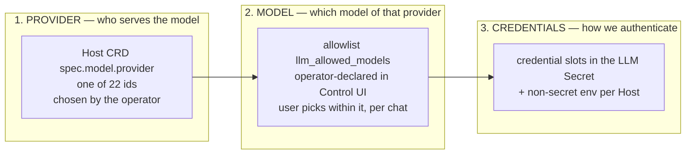
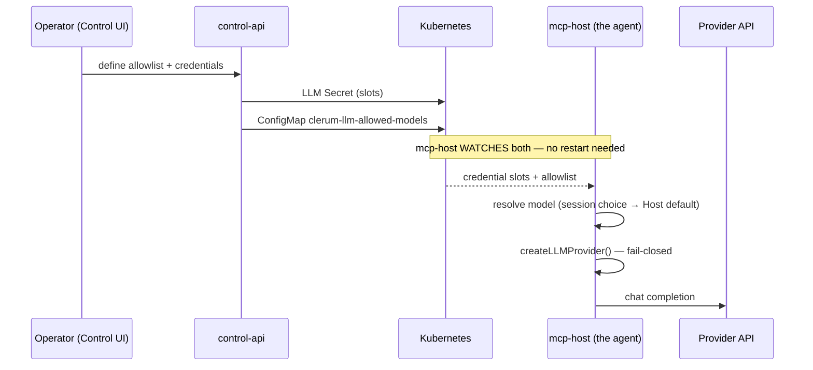

# LLM providers — how they work, which are supported, how to configure them

This is the orientation guide. Read it first, then branch:

| You want to…                               | Go to                                        |
| ------------------------------------------ | -------------------------------------------- |
| Set up credentials and the model allowlist | [Operator guide](../deploy/llm-providers.md) |
| Add a provider that isn't in the list      | [Adding a provider](adding-a-provider.md)    |
| Understand the Control UI surface          | [Control UI](../surfaces/control-ui.md)      |

> Code and API group still use the historical name **clerum** (`clerum.io`,
> `CLERUM_*`, `@clerum/*`). Same project — [code names](../concepts/code-names.md).

---

## 1. The mental model: three independent things

The single most common confusion is treating "provider", "model" and "credential"
as one setting. They are three separate axes, configured in three different places
by (potentially) three different people.



A few rules that follow from this split, and that surprise people:

- **A Host is bound to exactly one provider.** There is no per-message provider
  switching. Changing provider means editing the Host.
- **The credential belongs to the provider, not to the model.** Every model of a
  provider resolves to the same credential. (This was not always true — the old
  `provider__model` mapping is retired.)
- **A model is usable only if the operator allowlisted it.** Fail-closed: a row
  must exist in `llm_allowed_models` for `(provider, model)` with `enabled = true`.
  Installing a provider does _not_ make its models available.
- **A credential can have more than one part.** `bedrock` needs two keys; `vertex`
  needs a whole service-account JSON. The code models this as _slots_, not as "the
  API key".

---

## 2. Which providers are supported

**22 providers**, defined once in
[`packages/llm-providers/index.cjs`](../../packages/llm-providers/index.cjs) —
the single source of truth consumed by mcp-host, control-api, the workflow
runtime, the host controller and the Control UI.

They differ only in _how much code_ the integration needs. That is the axis that
determines everything else (which config they need, where they work, what can go
wrong):

### Group A — OpenAI-compatible, pure data (17)

These speak an OpenAI-compatible `/chat/completions` API. Integrating them is a
`baseURL` + one API key, **no driver code**. They are all handled by one shared
class, `OpenAICompatibleProvider`.

| Provider      | id           | Credential slot      | Default model                                       |
| ------------- | ------------ | -------------------- | --------------------------------------------------- |
| Z.AI          | `zai`        | `zai-api-key`        | `glm-5.1`                                           |
| Bailian       | `bailian`    | `bailian-api-key`    | `qwen3-coder-plus`                                  |
| OpenRouter    | `openrouter` | `openrouter-api-key` | `anthropic/claude-sonnet-latest`                    |
| Google Gemini | `gemini`     | `gemini-api-key`     | `gemini-2.5-flash`                                  |
| DeepSeek      | `deepseek`   | `deepseek-api-key`   | `deepseek-v4-flash`                                 |
| Groq          | `groq`       | `groq-api-key`       | `llama-3.3-70b-versatile`                           |
| Together AI   | `together`   | `together-api-key`   | `meta-llama/Llama-3.3-70B-Instruct-Turbo`           |
| Fireworks AI  | `fireworks`  | `fireworks-api-key`  | `accounts/fireworks/models/llama-v3p3-70b-instruct` |
| Mistral AI    | `mistral`    | `mistral-api-key`    | `mistral-medium-latest`                             |
| xAI (Grok)    | `xai`        | `xai-api-key`        | `grok-4.3`                                          |
| Cerebras      | `cerebras`   | `cerebras-api-key`   | `gpt-oss-120b`                                      |
| DeepInfra     | `deepinfra`  | `deepinfra-api-key`  | `deepseek-ai/DeepSeek-V3.2`                         |
| Perplexity    | `perplexity` | `perplexity-api-key` | `sonar-pro`                                         |
| Moonshot      | `moonshot`   | `moonshot-api-key`   | `kimi-k2.6`                                         |
| Nebius        | `nebius`     | `nebius-api-key`     | `Qwen/Qwen3-235B-A22B-Instruct-2507`                |
| Novita AI     | `novita`     | `novita-api-key`     | `deepseek/deepseek-v3.2`                            |
| MiniMax       | `minimax`    | `minimax-api-key`    | `MiniMax-M2`                                         |

`openai` itself also speaks this protocol but uses the official SDK (Group B).

### Group B — own SDK / bespoke wire protocol (4)

| Provider         | id        | Credential slots                                  | Non-secret env (per Host)                    |
| ---------------- | --------- | ------------------------------------------------- | -------------------------------------------- |
| OpenAI           | `openai`  | `openai-api-key`                                  | —                                            |
| Anthropic        | `claude`  | `claude-api-key`                                  | —                                            |
| Google Vertex AI | `vertex`  | `vertex-service-account-json` _(multi-line JSON)_ | `VERTEX_PROJECT_ID` (req), `VERTEX_LOCATION` |
| Amazon Bedrock   | `bedrock` | `aws-access-key-id` **+** `aws-secret-access-key` | `AWS_REGION` (required)                      |

`claude` is the only provider that ships its own token counter; everything except
`openai`/`azure` uses a fallback counter, so **token counts for Group A and for
Vertex/Bedrock are approximations**, not provider-exact.

### Group C — light driver (1)

| Provider     | id      | Credential slot        | Non-secret env (per Host)                                 |
| ------------ | ------- | ---------------------- | --------------------------------------------------------- |
| Azure OpenAI | `azure` | `azure-openai-api-key` | `AZURE_OPENAI_ENDPOINT` (req), `AZURE_OPENAI_API_VERSION` |

Azure is OpenAI-shaped but has no fixed base URL (per-resource endpoint), it
authenticates with an `api-key` header instead of `Authorization: Bearer`, and
**its "model" is your Azure deployment name**, not a catalog id.

### Important: not every provider works everywhere

| Surface                       | Providers supported                     |
| ----------------------------- | --------------------------------------- |
| Interactive Host (chat agent) | all **22**                              |
| WorkflowRecipe LLM steps      | **20** — `bedrock` and `azure` excluded |

`bedrock` and `azure` are deliberately absent from the WorkflowRecipe CRD enum:
the workflow `configure` transport carries a **single** credential string, so it
cannot deliver Bedrock's key pair nor Azure's required endpoint. Excluding them
makes the recipe fail at admission rather than mid-run.

---

## 3. How a request actually flows



Two properties worth internalising:

1. **Everything is watch-based.** mcp-host holds four watches (`host-secret`,
   `host-cm`, `llm-secret`, `allowlist-cm`) with precedence
   `host-secret > host-cm > llm-secret > process.env`. Rotating a key or editing
   the allowlist propagates in about a second — **no pod restart, no redeploy**.
2. **mcp-host never calls control-api for this.** The allowlist reaches the
   runtime as a ConfigMap watch, never an API call, so a control-api outage
   cannot break a running agent. Direct mcp-host → control-api traffic is denied
   by the NetworkPolicy; the only allowed control-plane lane is the
   workflow-approval gateway.

### Fail-closed at every step

`createLLMProvider()` returns `null` (degraded, never a crash) if the provider id
is unknown, **or if any _required_ credential slot is missing**. This is why
Bedrock with only one of its two AWS keys is rejected up front instead of
surfacing as an opaque `401` on the first message.

---

## 4. Configuring a provider

### 4.1 The general shape

1. **Credentials** → Control UI **Secrets → LLM**. The form renders one group per
   provider, derived from the shared package. It is **write-only**: values are
   never read back, only key names. To rotate, re-enter.
2. **Non-secret config** (region, project, endpoint) → Control UI
   **Host → Environment**. These are _not_ credentials and never belong in the
   Secret.
3. **Allowlist the models** → Control UI **LLM Models** (`/llm-models`). Nothing
   is usable until this exists.
4. **Point the Host at it** → `spec.model.provider` + `spec.model.name`, via the
   Host wizard or the CRD.

### 4.2 A plain API-key provider (Groq, Mistral, DeepSeek, …)

Paste the key into its field under **Secrets → LLM**, allowlist at least one
model, set the Host's provider and model. That's all — no env vars, no code.

### 4.3 Amazon Bedrock

Enter **both** `aws-access-key-id` and `aws-secret-access-key` **in a single
save** — a half-written pair is rejected client-side and by control-api, so a
Host is never left half-configured. Then set `AWS_REGION` under
**Host → Environment**. Bedrock model ids are runtime-qualified, e.g.
`anthropic.claude-sonnet-4-6-v1:0`.

### 4.4 Google Vertex AI

Paste the **entire service-account JSON** into `vertex-service-account-json`.
Its shape is validated (must parse, must contain `client_email` and
`private_key`). Set `VERTEX_PROJECT_ID` (and optionally `VERTEX_LOCATION`) under
**Host → Environment**. The driver builds credentials from the JSON **in memory**
— it never writes a key file and never uses `GOOGLE_APPLICATION_CREDENTIALS`.

### 4.5 Azure OpenAI

Enter the key, then set `AZURE_OPENAI_ENDPOINT` under **Host → Environment**
(this is required — construction fails closed without it). Remember the model
field is your **deployment name**.

### 4.6 Local development (no Kubernetes)

Dev mode bypasses all of the above. Set `CLERUM_DEV_MODE=true` and export the
provider's env var(s) — `OPENAI_API_KEY`, `GROQ_API_KEY`, `AWS_ACCESS_KEY_ID` +
`AWS_SECRET_ACCESS_KEY`, etc. If `CLERUM_MODEL_PROVIDER` is unset, mcp-host
**auto-detects** the first provider (in the canonical id order) whose required
slots are all present and uses that provider's default model;
`CLERUM_MODEL_NAME` applies only when `CLERUM_MODEL_PROVIDER` is also set.

> One gotcha: because Bedrock's slots are the standard AWS variable names, a
> shell that already exports generic AWS credentials (plus `AWS_REGION`) can
> auto-select `bedrock`. Set `CLERUM_MODEL_PROVIDER` explicitly if that's not
> what you want.

---

## 5. The model allowlist

The set of usable models is **operator-declared, not a shipped catalog**. It
lives in the control-api Postgres table `llm_allowed_models`, is managed at
`/llm-models`, is fully audited (`llm_allowed_models_audit`), and is materialized
to the `clerum-llm-allowed-models` ConfigMap for the runtime.

- **Fail-closed**: a row must exist and be `enabled`. A provider with no enabled
  rows is unusable and flagged in the wizard.
- **Discovery review**: `/llm-models` and `/llm-models/discovery` are the
  route-backed Catalog and Discovery Review tabs of one operator surface. A
  models.dev sync still lands rows as **disabled** for the operator to curate —
  it never auto-enables anything. Models missing from the latest live catalog
  remain in Catalog with a **Stale** row indicator and provider-level stale count.
- **Deployed resources are never interrupted.** If a model falls out of the
  allowlist, running Hosts keep working (a `WARN` plus a metric, marked "out of
  allowlist" in the UI). Hard enforcement applies only to _new_ selections: host
  create/edit, the runtime set-model call, and workflow `configure`.
- **If the ConfigMap is missing** (rollout in progress, migration not yet run),
  the runtime degrades explicitly: only the model already configured on the
  Host/step is permitted. Neither open nor bricked.

Beyond the global allowlist there are two narrower scopes:

| Scope         | Where                                       | Purpose                                 |
| ------------- | ------------------------------------------- | --------------------------------------- |
| Global        | `llm_allowed_models`                        | what the cluster may use at all         |
| Per Host      | `spec.allowedModels`                        | narrow one Host to a subset             |
| Per SDK grant | `plugin_workload_sdk_grants.allowed_models` | what one recipe's promptBridge may call |

---

## 6. Choosing a model as a user

The desktop app has a per-chat model selector, Claude-Code style, restricted to
the allowlist:

- The choice is **session state, not process state** — one Host serves many users
  and chats, so your switch never touches anyone else's.
- It applies **from your next message**; in-flight tasks finish on the model they
  started with.
- It survives restarts. If the saved model later leaves the allowlist, the agent
  falls back to the Host default and says so.
- You can change the _model_, not the _provider_ — the provider is the operator's
  decision.

---

## 7. Provider fallback

A Host may declare `spec.llmPolicy` with an ordered `fallbacks[]` list, so that a
primary failure (outage, exhausted credit, banned key) fails over instead of
failing the chat. It is **opt-in** — no policy means no behaviour change.

Failover is sticky with a cooldown (default 300s) and recovers lazily. Each entry
is a fixed `(provider, model)` pair and may pin a `credentialSlot` — an extra key
in the _same_ Secret (e.g. `claude-api-key-fb1`), which is how "same provider,
different key" works. Triggers are a closed catalogue mapped onto the error
classifier: `insufficient_quota` (402), `auth` (401/403), `rate_limited` (429),
`provider_unavailable` (5xx/529 and retryable transport errors). Deliberately
**not** eligible: non-retryable `400`s, validation and content-policy errors —
failing over on those would just mask bugs.

---

## 8. Troubleshooting

| Symptom                                             | Cause                                                                                                         |
| --------------------------------------------------- | ------------------------------------------------------------------------------------------------------------- |
| Agent degraded, log `credential '<slot>' not found` | A required slot is missing. Bedrock needs **both** keys.                                                      |
| Agent degraded, `failed to construct <provider>`    | Missing non-secret env (`AWS_REGION`, `VERTEX_PROJECT_ID`, `AZURE_OPENAI_ENDPOINT`) or malformed Vertex JSON. |
| `403 model_not_allowed`                             | Model isn't allowlisted/enabled for that provider.                                                            |
| `404 No secret mapping found` (workflow step)       | Provider has no entry in `clerum-model-secret-mapping` — see below.                                           |
| `500 ConfigMap not found` (workflow step)           | `clerum-model-secret-mapping` missing from the `mcp-host` namespace.                                          |
| `502 mcp_host configure failed/unreachable`         | WRC resolved the credential but couldn't configure mcp-host.                                                  |
| Model dropdown empty in the wizard                  | No enabled allowlist rows for that provider.                                                                  |
| Context-window indicator looks wrong                | `context_window_tokens` unset on the allowlist row → falls back to `CLERUM_CONTEXT_MAX_TOKENS`.               |
| Cost report shows a model as unpriced               | No row in `llm_model_prices`; only 8 models are seeded. Add one under **Cost → LLM prices**.                  |

### Known sharp edge: workflow steps and the secret mapping

The WorkflowRecipe CRD admits **20** providers, but the shipped
`clerum-model-secret-mapping` ConfigMap
([`deploy/base/mcp-host/model-secret-mapping.yaml`](../../deploy/base/mcp-host/model-secret-mapping.yaml))
maps only **five**: `openai`, `claude`, `zai`, `bailian`, `vertex`.

A recipe pinning any of the other 15 (`groq`, `mistral`, `xai`, `minimax`, …) passes
admission and then fails at runtime with `404 No secret mapping found`. This
ConfigMap is declarative — nothing generates it — so to use those providers in
workflows an operator must add the entry themselves:

```yaml
data:
  groq: 'chatllm-api-keys/groq-api-key'
```

Interactive Hosts are unaffected: they resolve credentials through the
ConfigStore, not this mapping.

---

## 9. Where things live in the code

| Concern                                            | Location                                              |
| -------------------------------------------------- | ----------------------------------------------------- |
| Canonical provider ids, slots, labels, env         | `packages/llm-providers/index.cjs`                    |
| Runtime fields (baseURL, default model, tokenizer) | `mcp-host/src/llm/registryCore.ts`                    |
| Provider construction (`makeProvider`)             | `mcp-host/src/llm/registry.ts`                        |
| Fail-closed entry point                            | `mcp-host/src/llm/index.ts`                           |
| Own-SDK drivers                                    | `mcp-host/src/llm/drivers/`                           |
| Credential watches / exclusion boundary            | `mcp-host/src/config/configStore.ts`                  |
| Allowlist CRUD + ConfigMap materialization         | `control-api/src/routes/admin/llmModels.ts`           |
| Host spec validation (model, policy, subset)       | `control-api/src/routes/admin/hostSpecValidation.ts`  |
| Workflow secret broker                             | `workflow-recipes/src/workflow/modelConfigHandler.ts` |
| UI provider/model metadata                         | `control-ui/lib/llm.ts`                               |
| CRD enums                                          | `charts/clerum-crds/crds/{host,workflowrecipe}.yaml`  |

A note on secrets hygiene: no provider credential — for **any** provider, whether
configured or not — reaches a tool subprocess through the ConfigStore boundary.
The exclusion set is derived from the full slot list of every provider _plus_
whatever the LLM Secret actually delivers, so dynamically-named fallback slots
are covered too. The shell tool additionally strips every non-active provider's
slots from the child env; keep provider key names out of `CLERUM_ENV_ALLOWLIST`
so the active provider's key stays out of subprocesses as well.

Adding a provider is usually a data change, not a code change — see
[Adding a provider](adding-a-provider.md).
