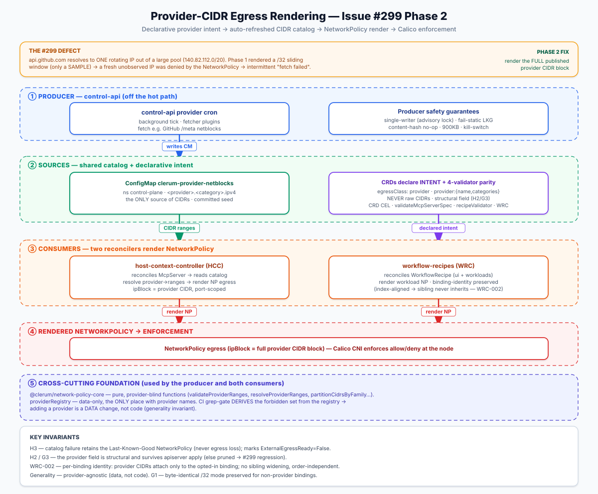

# Provider-CIDR egress (issue #299 Phase 2)

For a large, rotating IP pool behind a DNS host (GitHub, Google GFE, AWS S3/CloudFront,
Microsoft 365), a Phase-1 `/32` sliding window is only a *sample* of the pool — a fresh
connection to an un-observed IP is denied (`fetch failed`). Phase 2 renders the
**authoritative published provider CIDRs** for such hosts, keeping the `/32` window for
small/stable hosts and for residual (out-of-range) IPs.

## Architecture at a glance



Flow: **fetch** (control-api cron → provider netblocks) → **write** the `clerum-provider-netblocks`
ConfigMap → **read** by HCC and WRC → **render** a NetworkPolicy (ipBlock = provider CIDR,
port-scoped) → **enforce** by Calico. Provider intent travels through the CRDs; concrete CIDRs
travel only through the catalog. Provider names live only in the registry/fetchers/seed/tests
(generality invariant, enforced by a CI grep-gate).

## How it works

- **control-api** (the only component with external egress) fetches each provider's
  published netblocks on a background loop, validates them through the pure core, and
  materializes the cluster ConfigMap `clerum-provider-netblocks` (namespace `control-plane`).
- **HCC / WRC** read that ConfigMap on their existing resync — they never fetch. A binding
  declares intent (`egressClass: provider` + `provider: { name, categories }`), never raw
  CIDRs; the controller resolves `name → CIDRs` from the ConfigMap and renders port-scoped
  `ipBlock` rules.
- A vendored **seed** ConfigMap (`deploy/base/control-plane/provider-netblocks-configmap.yaml`,
  regenerate with `make vendor-provider-netblocks`) covers cold start; worst case degrades
  to Phase-1 `/32` behavior, never below.

## Kill switch

`PROVIDER_NETBLOCKS_FETCHER_ENABLED=false` disables the control-api fetcher entirely (the
seed ConfigMap + the `/32` window keep egress working). Other knobs:
`PROVIDER_NETBLOCKS_REFRESH_INTERVAL_MS` (default 6h), `..._FETCH_TIMEOUT_MS` (10s),
`..._MAX_RESPONSE_BYTES` (8MB), `..._CONFIGMAP_NAMESPACE` (`control-plane`).

## Observability & the drift alert (P1)

Provider mode is **availability-first**: a resolved IP outside every declared range still
enters the `/32` window (never denied) **and** raises a loud drift signal. In this milestone
the signal is a **metric + a throttled log** in the controllers; wiring a pager is an
operator decision (the repo ships no alert-rule manifests).

| Signal | Where |
|---|---|
| `clerum_hcc_external_egress_provider_drift_total{server,dns}` | HCC, every reconcile with an uncovered fresh IP |
| `clerum_wrc_external_egress_provider_drift_total{recipe,fqdn}` | WRC ui + workload reconcilers (metric every reconcile; a `[WR-Reconciler] provider-range drift …` log is emitted throttled) |
| `clerum_provider_netblocks_fetch_failures_total{source,reason}` | control-api fetch pipeline |
| `clerum_provider_netblocks_last_success_timestamp_seconds{source}` | control-api (staleness derive) |
| `clerum_provider_netblocks_cidrs{source,category}` | control-api (materialized IPv4 counts) |
| `clerum_provider_netblocks_ticks_total{result}` | control-api (`ok\|skipped_lock\|error`) |

**Drift paging alert contract** (configure in your monitoring stack — Grafana Cloud or GCP
Monitoring — the repo has no `PrometheusRule` manifests):

```promql
# Sustained drift on any host must PAGE — a 100%-residue misclassification (a
# mis-mapped host) is only caught if someone is alerted. Availability is preserved
# regardless; the alert turns a "silent #299" into a loud, one-line remap.
(
  sum by (dns) (increase(clerum_hcc_external_egress_provider_drift_total[30m])) > 0
) or (
  sum by (fqdn) (increase(clerum_wrc_external_egress_provider_drift_total[30m])) > 0
)
# for: 30m (3 consecutive 10m evaluations). Both controllers are covered — the
# WRC surface is where #299 reproduced live, so its twin must page too.
```

**Staleness alert** (the fetcher stopped succeeding): derive
`time() - clerum_provider_netblocks_last_success_timestamp_seconds{source}` →
**warn > 7d, critical > 30d**.

## Cross-environment portability

NetworkPolicy egress is evaluated at the source pod against the *original* destination, so
SNAT (GKE Cloud-NAT, EKS NAT-GW, DOKS SNAT) never breaks provider-CIDR matching. Nothing
reads enforcement state, so the degradation floor is always Phase-1 behavior.

| Env / CNI | NP egress enforced? | Verdict |
|---|---|---|
| minikube · Calico | yes | works (proven) |
| GKE · Calico addon | yes | works |
| GKE · Dataplane-V2 (Cilium) | yes | works (Cilium `ipBlock` matches *world* dsts; pin `except` conformance) |
| EKS · **default VPC CNI** | **no — policies inert** | **no-op-safe**: detect + document, never certify as enforcing |
| EKS · Calico addon / VPC-CNI NP agent (strict) | yes | works |
| DOKS · Cilium | yes | works |

**IPv6 stance:** provider ranges are stored family-keyed but rendered **IPv4-only**. On
dual-stack, v4-only rules are fail-closed for v6 (safe). IPv6-only clusters are unsupported.

## Rollback

Reverse of apply: (1) flip provider bindings back to `/32` mode; (2) revert controllers;
(3) kill-switch/revert the control-api fetcher (seed + `/32` window keep working); (4) leave
the CRD `provider` property in place; (5) revert the core **last**. Never revert controllers
while provider-mode bindings still exist (old code has no `provider` branch → egress loss).

## Duplicate-binding guard: McpServer only (by design)

The duplicate-`(dns, port)` guard (H4) lives on the **McpServer/HCC** surface only —
`mcpserver.yaml` CEL (`egressBindings must not declare the same (dns, port) twice`) plus the
HCC reconciler dup check. It exists because HCC derives a **NetworkPolicy name per (dns, port)**,
so two identical pairs would collide on the same NP name.

It is intentionally **absent** on the **WorkflowRecipe/WRC** surface. WRC renders **one
NetworkPolicy per workload**, with each binding contributing *rules* inside that single policy —
there is no per-binding NP name to collide, so the collision hazard the guard prevents does not
exist there. A duplicate `(dns, port)` declaration on a WRC workload renders redundant-but-identical
egress rules (harmless; the CNI de-duplicates). Adding an authoring-time WRC dup guard for symmetry
is a possible future nicety, not a correctness fix.
