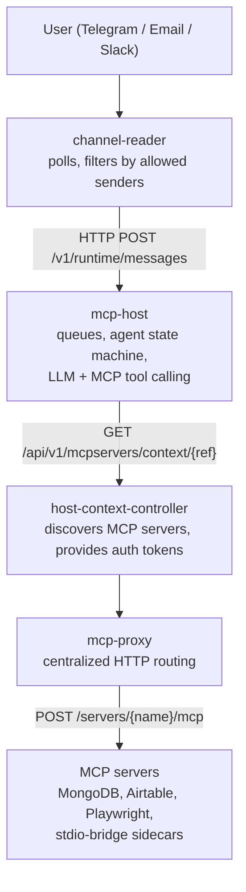

# Service Catalog

The evenfire monorepo is organized as one directory per service. Each service
has its own README with build and deployment details.

## Core services

| Service | Description |
| --- | --- |
| [host-context-controller](../../host-context-controller/README.md) | K8s operator: manages MCP server Deployments/Services/NetworkPolicies, REST API for discovery (port 8081). |
| [mcp-host](../../mcp-host/README.md) | LLM orchestration (OpenAI/Claude/ZAI/Bailian), MCP tool calling, approval system, agent state machine (port 8080). |
| [mcp-proxy](../../mcp-proxy/README.md) | Centralized HTTP proxy for MCP servers. Polls the HCC API for server discovery and routes requests (port 8083). |
| [channel-reader](../../channel-reader/README.md) | Watches CommunicationChannel CRDs and fetches messages from Telegram, Email, and Slack. |
| [workflow-recipes](../../workflow-recipes/README.md) | K8s operator: reconciles WorkflowRecipe CRDs into Deployments/StatefulSets/CronJobs with security overrides. |

## Infrastructure

| Component | Description |
| --- | --- |
| [stdio-bridge](../../stdio-bridge/README.md) | Sidecar container: translates stdio MCP transport to StreamableHTTP (port 3000). Used for stdio-only MCP images (postgres, redis, etc.). |
| [charts/clerum-crds](../../charts/clerum-crds/README.md) | Helm chart to install all CRDs, with [example resources](../../charts/clerum-crds/examples/). |
| [mcp-servers](../../mcp-servers/README.md) | MCP server implementations (MongoDB, Airtable). |
| [monitoring](../../monitoring/README.md) | Grafana dashboards + Loki log aggregation configs. |
| scripts/ | E2E test scripts, cluster bootstrap, test library. |

## Frontend / API

| Component | Description |
| --- | --- |
| [profile-ui](../../profile-ui/README.md) | Next.js frontend for profile and team workflows. |
| [rpc-proxy](../../rpc-proxy/README.md) | External-facing JWT-protected tenant RPC gateway to MCP servers. |
| [control-api](../../control-api/README.md) / [control-ui](../../control-ui/README.md) | Control plane backend/frontend. |
| [external-rest-api](../../external-rest-api/README.md) | User profile/team REST API with Google auth, invitations, password setup, and RPC token brokerage. |
| [desktop-app](../../desktop-app/README.md) | Desktop Electron app for direct evenfire interaction. |

## Message data flow

## Relationships

- **CommunicationChannel** defines allowed users for Telegram, Email, and Slack.
- **Host** uses a **Context** and references channel configurations.
- **Host** and **McpServers** share the same **Context**.
- **WorkflowRecipe** composes multiple workloads (Deployments, StatefulSets,
  CronJobs) and auto-registers MCP servers.
- **mcp-proxy** centralizes HTTP routing to all MCP servers, enabling metrics
  and health monitoring.
