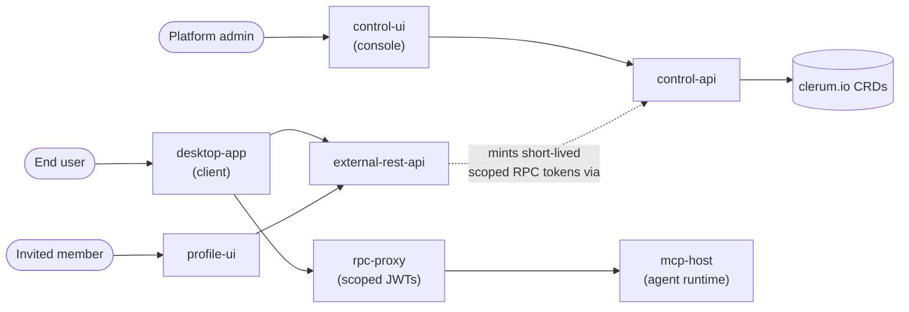

# UI Surfaces

evenfire's control plane is a set of `clerum.io` CRDs and APIs; humans never
touch that plane directly. Three UIs sit in front of it, each built for a
different person and each restricted to a different slice of the backend: the
Control UI governs the fleet, the Desktop App is how end users drive their
agents, and the Profile UI is the invited member's front door.

## Which surface is for me?

| Persona                             | Surface                                | Talks to                                                            | Cannot reach               |
| ------------------------------------ | --------------------------------------- | -------------------------------------------------------------------- | --------------------------- |
| Platform admin                      | [Control UI](control-ui.md)             | `control-api` → CRDs, secrets, usage                                  | `rpc-proxy`, agent runtime   |
| End user                            | [Desktop App](desktop-app.md)           | `external-rest-api` (session, scoped tokens), `rpc-proxy` (agents)   | `control-api`               |
| Invited member                      | [Profile UI](profile-ui.md)             | `external-rest-api`                                                  | `control-api`, `rpc-proxy`  |
| Channel user (Telegram/Slack/Email) | no UI — the chat app they already have | `channel-reader`                                                     | everything else             |

## How the surfaces are wired

## Why this split matters

The Desktop App never holds a `control-api` service token. It authenticates
through `external-rest-api`, which mints a short-lived, scope-narrowed RPC
access token, and the app can only reach `rpc-proxy` with it (source:
`desktop-app/README.md` § Security Model). The Control UI is the inverse: it
reaches `control-api` and nothing else, and every dashboard page sits behind
an admin login — it is not an open dashboard (source: `control-ui/README.md`
§ Authentication). Neither surface can act as the other: an end user's
Desktop App session cannot reach CRDs, secrets, or usage data, and an admin's
Control UI session cannot invoke agents through `rpc-proxy`.

## Where the surfaces are not the answer

Channel users — people talking to an agent over Telegram, Slack, or email —
never touch any of these UIs. Their messages reach the platform through
`channel-reader`, and when a tool call needs a human decision, the approval
arrives as an inline button in the chat app they already have open. See
[Configure approvals](../how-to/configure-approvals.md).

## Next

- [Control UI](control-ui.md) — the admin console
- [Desktop App](desktop-app.md) — the end-user client
- [Profile UI](profile-ui.md) — the invited member's front door
