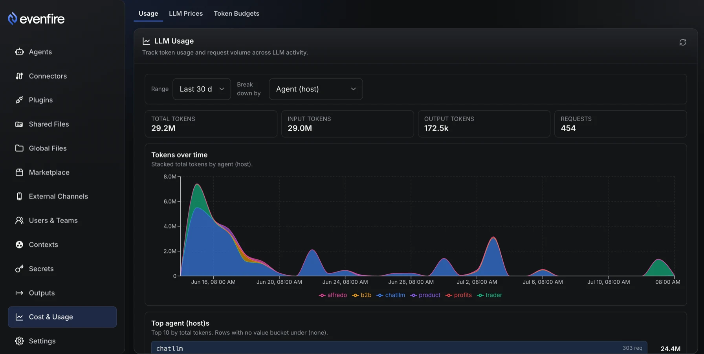
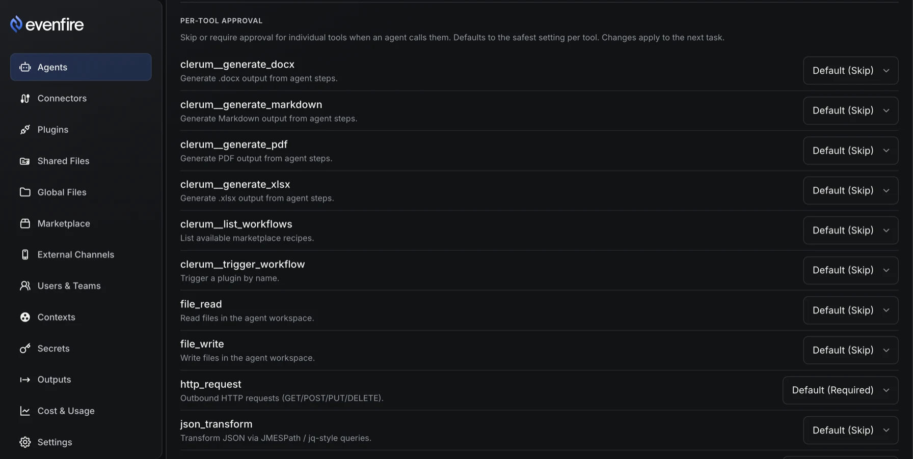
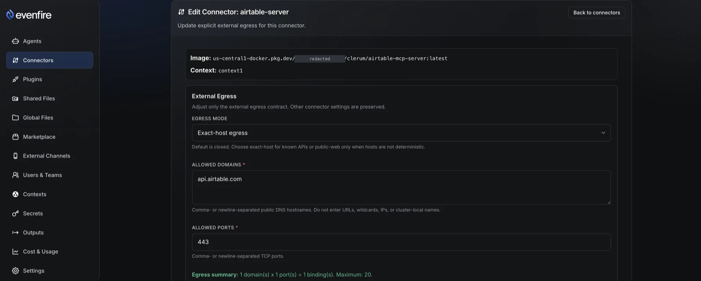
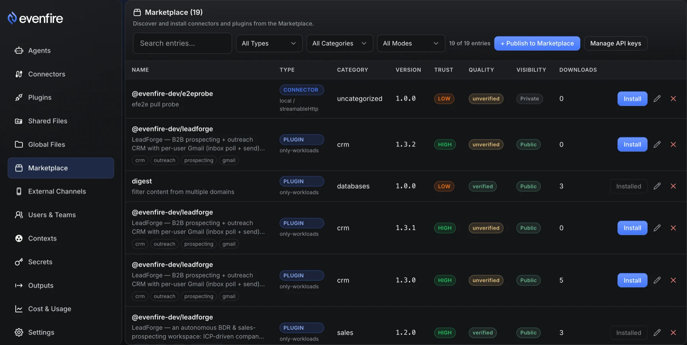
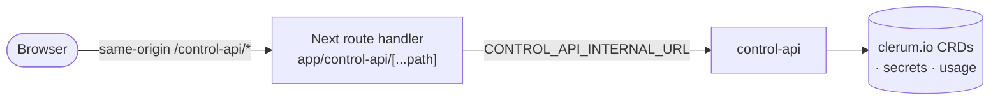

# Control UI

Control UI is a Next.js (App Router) admin console for evenfire's control
plane. It talks to exactly one backend service — `control-api`, reached
through a single same-origin API base (`control-ui/lib/api.ts`) — and never
calls `external-rest-api` or `rpc-proxy` directly. Every screen writes a real
`clerum.io` custom resource or a control-api-owned record; the declarative
substrate is never bypassed, the console is only a front end for it. This is
an **admin** surface behind an admin login, not an open dashboard and not the
end-user surface — that is the [Desktop App](desktop-app.md). See
[UI Surfaces](README.md) for how the three consoles divide the platform.

## The governance loop

One operator can eyeball a handful of agents by hand. Past that, judgment
stops scaling: someone has to see what the fleet is spending, cap what it is
allowed to spend, gate what a tool call can do without asking a human, limit
where an agent's network calls can go, and control what gets installed onto
the fleet in the first place — before any of that becomes an incident.
Control UI is that loop, and it is the only place in the platform where all
five steps live together.

1. **See it** — `UsageDashboard` (`components/UsageDashboard`), at
   `/cost/usage`. A stacked-area chart of input/output tokens over time, with
   **8 group-by dimensions**: team, model, agent (host), desktop user, recipe,
   provider, LLM secret, and source kind
   (`components/UsageDashboard/types.ts`). The desktop-user dimension is what
   makes per-person attribution possible — no other surface in the platform
   can answer "whose usage is this."

   
   _Dev cluster, demo tenant._

2. **Cap it** — `TokenBudgetTable` (`/cost/token-budgets`) and
   `LlmPriceTable` (`/cost/llm-prices`): per-1M-token model prices (input,
   output, cache read/write) and budgets with a scope, a period, and a
   progress bar against the limit. Budgets are cost control and are **not** a
   security boundary. A budget can be set to `warn` (observation only, never
   denies) or `block` (denies new tasks once over the limit). The cross-service
   call is fail-open: if mcp-host cannot reach control-api's budget check — a
   timeout, a transport error, a non-200 — the task is waved through rather
   than stopped (`mcp-host/src/budget/budgetClient.ts`). Inside control-api the
   choice is the opposite and deliberate: a `block` budget whose spend cannot
   be computed denies the task (`budget_eval_error`) rather than silently
   bypass the cap (`control-api/src/services/budgets/check.ts`), while a `warn`
   budget that errors is skipped entirely. For the operator walkthrough —
   enabling budgets, scoping one, and reading a `block` vs `warn` decision — see
   [Track usage & set budgets](../how-to/token-budgets-and-usage.md).

3. **Gate it** — `HostApprovalSection` (`components/HostApprovalSection`), on
   the host detail page. A per-tool approval editor with three settings —
   **Default / Required / Skip** — and a risk hint whenever an override
   loosens a tool whose built-in default is Required (for example, setting
   `shell_exec` or `http_request` to Skip). MCP tools always require approval;
   native tools carry per-tool overrides, and the safe default per native tool
   is baked into `mcp-host`. Of the always-on native tools the
   editor lists, only `http_request` and `shell_exec` default to Required and
   the rest to Skip; conditionally-registered tools carry their own defaults
   (`cron_manage` and the desktop `browser_open` / `browser_navigate` tools
   also default to Required). See
   [Configure approvals](../how-to/configure-approvals.md).

   
   _Dev cluster, demo tenant._

4. **Constrain it** — `EgressEditor` (`components/EgressEditor.tsx`, model in
   `lib/egressModel.ts`): closed-by-default, exact-host, exact-CIDR/IP (where
   enabled — connector creation, connector edit, and registry install expose
   it; recipe and publish flows do not), and public-web modes. Private, metadata,
   link-local, documentation, multicast, and reserved IPv4 ranges are
   rejected outright. This is port/CIDR egress with documented FQDN
   limits — do not read it as per-domain allowlisting for arbitrary SaaS
   APIs; an allowed domain is an exact public DNS hostname, not a wildcard or
   URL.

   
   _Dev cluster, demo tenant._

5. **Govern what gets installed** — `RegistryCatalog`
   (`components/RegistryCatalog.tsx`), at `/registry`: marketplace entries
   (connectors and plugins) with trust levels (high / mid / low) and a
   guided install flow, plus org-scoped publish API keys (create / reveal /
   revoke) at `/registry/keys`. Connector images are checked against an
   allowlist, audit-mode by default, on both the direct `/mcp-servers`
   Create form and registry installs — but that check is a no-op unless an
   operator turns on enforcement, since the shipped default is off. The
   audit signal instead comes later, at reconcile: for a non-allowlisted
   image, `host-context-controller` logs a would-be denial ("audit mode,
   allowing") and still builds the workload when its own enforcement is
   off (the shipped default), or blocks it and logs a denial when
   enforcement is on. sha256 digest pinning is a different mechanism: it
   applies to custom coordinator images in workflow recipes, not to
   connector images, and it is required by default there. A self-hosted
   deployment [connects to the registry](../how-to/connect-to-registry.md) once
   (operator-approved) before it can install or
   [publish](../how-to/publish-plugin-to-registry.md) under its own org.

   
   _Dev cluster, demo tenant._

## Every screen writes a CRD

Sidebar destinations map to canonical App Router routes
(`components/Sidebar/constants.tsx`). Every route either writes a `clerum.io`
custom resource directly or manages a control-api-owned resource that isn't a
CRD (registry entries, publisher credentials, users/teams, secrets, outputs,
cost records, global-file resources and grants, settings). See the
[CRD reference](../crds/README.md) for the full schema of each resource. One
caveat to the heading: the `GlobalFileSystem` CRD itself is applied out of band
(kustomize), and the Global File System screen only manages the brokered gfs
resources and grants inside it — it never writes that CR.

| Sidebar label      | Route                                                                                  | CRD / control-api resource       |
| ------------------ | -------------------------------------------------------------------------------------- | -------------------------------- |
| Agent Files        | `/agent-files`                                                                         | `SharedFileSystem`               |
| Agent Outputs      | `/agent-outputs/recipe-artifacts`                                                      | outputs (non-CRD)                |
| Agents             | `/agents`                                                                              | `Host`                           |
| Connectors         | `/connectors`                                                                          | `McpServer`                      |
| Contexts           | `/contexts`                                                                            | `Context`                        |
| Cost & Usage       | `/cost-and-usage/usage`, `/cost-and-usage/llm-prices`, `/cost-and-usage/token-budgets` | cost (non-CRD)                   |
| External Channels  | `/external-channels`                                                                   | `CommunicationChannel`           |
| Global File System | `/global-file-system`                                                                  | gfs resources & grants (non-CRD) |
| Marketplace        | `/marketplace/connectors`                                                              | registry (non-CRD)               |
| Plugins            | `/plugins`                                                                             | `WorkflowRecipe`                 |
| Publisher          | `/publisher`                                                                           | publisher (non-CRD)              |
| Secrets            | `/secrets/llm`                                                                         | secrets (non-CRD)                |
| Settings           | `/settings/ui`                                                                         | settings (non-CRD)               |
| Users & Teams      | `/users-and-teams/users`                                                               | users/teams (non-CRD)            |

Secret **values are write-only from the UI**: the Secrets screen lets an
admin create or replace a value, but never displays one back.

The **Publisher** entry appears in the sidebar only when publishing is enabled
for the org (`isPublisherEnabled`, `components/Sidebar/index.tsx`); it is hidden
otherwise.

## How it is wired

The browser only ever calls same-origin `/control-api/*`. A Next.js route
handler (`app/control-api/[...path]/route.ts`) proxies those requests
server-side to `CONTROL_API_INTERNAL_URL`, stripping hop-by-hop headers, with
a 30 s upstream timeout. The browser never holds a `control-api` bearer token
and never learns its internal address — the admin session is an HttpOnly
cookie that page JavaScript cannot read, forwarded upstream by the route
handler.



## Auth posture

Admin login is username/password, posted to control-api
`POST /api/v1/admin/auth/login`; the session is a signed admin JWT in an
HttpOnly cookie set by control-api. The bootstrap admin comes from
`CONTROL_API_ADMIN_BOOTSTRAP_USERNAME` / `CONTROL_API_ADMIN_BOOTSTRAP_PASSWORD_HASH`,
and an account locks after repeated failed logins
(`CONTROL_API_ADMIN_AUTH_MAX_FAILURES`, default 5, for
`CONTROL_API_ADMIN_AUTH_LOCK_MINUTES`, default 15). The only unauthenticated
routes are the public token flows: admin invitations, password resets, and
email confirmations. Full detail — including the CSRF protection on the
invitation and password-reset form posts — is in
[`control-ui/README.md` § Authentication](../../control-ui/README.md#authentication).

## Run it

```bash
make install-all && npm --prefix control-ui install
npm run web   # port-forwards control-api to :8090, waits for health, starts Control UI alone
npm run ui    # starts Control UI, Desktop App, and Profile UI together
```

In-cluster, Control UI is a single-replica Deployment on port 3000
(`deploy/base/control-plane/control-ui.yaml`, namespace `control-plane`).

## Limits

- Admin-only: there is no end-user mode, and no anonymous read access to any
  dashboard.
- Budgets are fail-open cost control, never a security boundary — see
  **Cap it** above.
- The connector image allowlist is audit-mode by default; digest pinning for
  custom coordinator images is a separate, default-enforced mechanism — see
  **Govern what gets installed** above.
- For environment variables, ports, and the test suites (Vitest component
  tests and Playwright end-to-end specs), see
  [`control-ui/README.md`](../../control-ui/README.md) — this page does not
  duplicate those tables so the two cannot drift apart.

## Next

- [UI Surfaces](README.md) — the persona matrix across all three consoles
- [Desktop App](desktop-app.md) — the end-user client
- [Profile UI](profile-ui.md) — the invited member's front door
