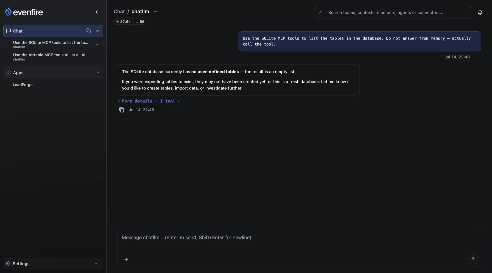
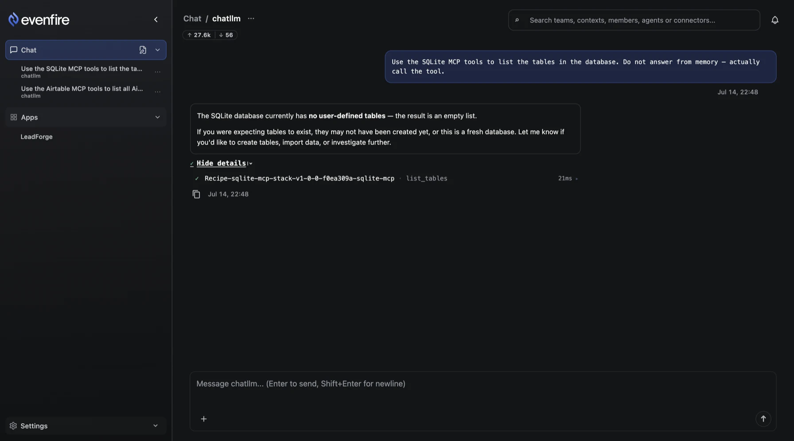
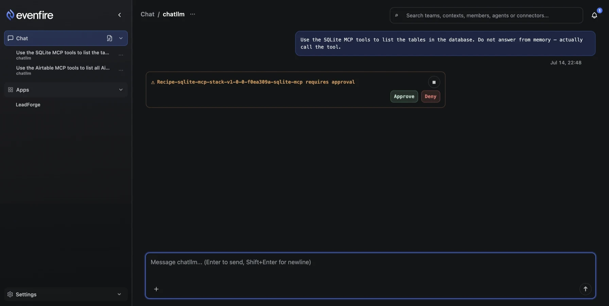
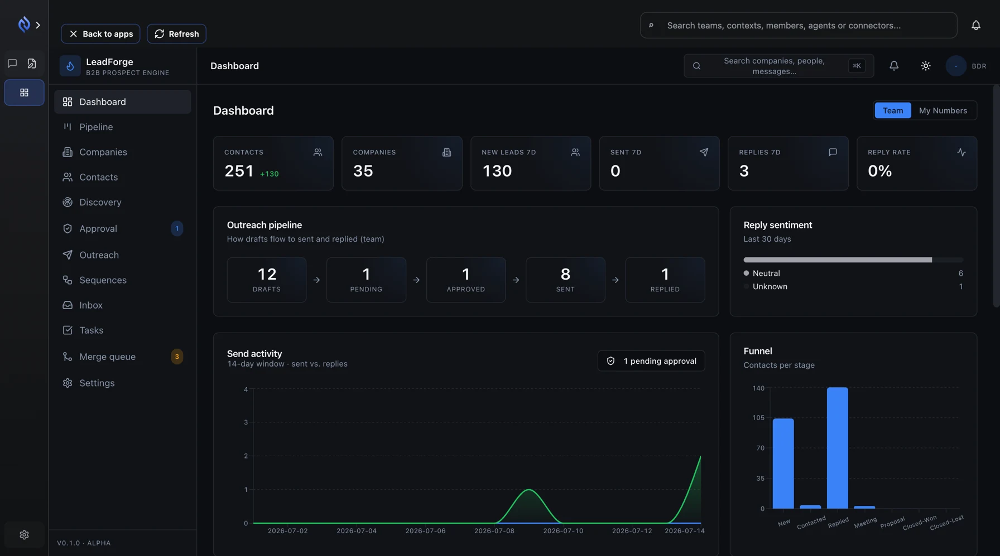
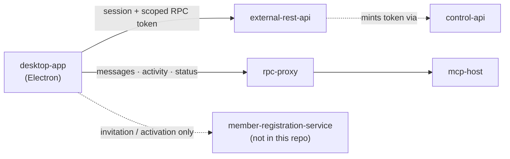

# Desktop App

Desktop App is an Electron client with a React renderer (built with Vite),
packaged with electron-forge as **Evenfire**. It is the end-user surface: how
a person who is not the platform admin actually drives an agent, with no
Telegram bot and no curl in sight. It authenticates through
`external-rest-api`, obtains short-lived scoped RPC tokens, and does
everything else — messages, activity, approvals, sandbox UIs — through
`rpc-proxy`. It **never holds a `control-api` token**: no secrets, no cost
records, no admin control plane, no matter who is signed in. The one
control-plane resource an end user reads is the `WorkflowRecipe` their user or
team is authorized for, and only through `external-rest-api`'s access-checked
passthrough. See [UI Surfaces](README.md) for how the three consoles divide the
platform, and the [Control UI](control-ui.md) for the admin side of that split.

## The daily loop

1. **Log in.** Password login posts to `POST /api/v1/auth/password-login`;
   Google login posts an already-issued `idToken` to
   `POST /api/v1/auth/google` — the token has to already exist, since the
   app does not drive a full OAuth browser redirect yet. Once a session is
   established, it is restored from the OS keychain via `keytar`, with a
   local file fallback when no keychain is available.
2. **Pick a team.** Team listing and switching read the access catalog:
   `GET /api/v1/me/agents` and `GET /api/v1/me/contexts` for the signed-in
   user, `GET /api/v1/team/agents` and `GET /api/v1/team/contexts` for the
   active team.
3. **Pick an agent.** Authorized agents from the access catalog
   auto-populate the RPC token's default `hostRefs` — the app requests a
   token scoped to the agents you can actually see. Manual host refs still
   work as an override.
4. **Chat.** Sending a message is
   `POST /api/v1/rpc/hosts/:hostRef/messages`, through `rpc-proxy`. Each
   answer carries a collapsed summary of the tool calls behind it, plus the
   input and output token counts for the thread.

   
   *Dev cluster, demo tenant.*

5. **Watch it work.** `ProgressStepper` renders the tool calls as they run —
   each step's tool name, how long it took, and the payload it returned.
   The client also subscribes to
   `GET /api/v1/rpc/hosts/:hostRef/activity/stream` (SSE) in
   `desktop-app/src/rpcProxyClient.ts`. Two honest limits, straight from
   `desktop-app/README.md`: that stream does **not** include internal
   reasoning / chain-of-thought content, and it is **read-only** — it is
   never used to submit messages, only to observe what is already running.

   
   *Dev cluster, demo tenant.*

6. **Approve the gated call.** When a tool call needs a human decision, the
   `ProgressStepper` suspends the step in place and shows an in-chat
   Approve / Deny prompt — no separate screen, no context switch. Approving
   or denying is itself an RPC call scoped to `host:approval:write`. See
   [Configure approvals](../how-to/configure-approvals.md) for how the
   Required / Skip / Default policy behind that prompt is set.

   
   *Dev cluster, demo tenant.*

7. **Collect the artifact.** Completed work surfaces through the
   `ArtifactsBadge`, alongside two related file surfaces: shared files
   (`SharedFilesTab`) scoped to a context, and the brokered Global File
   System for cross-context storage.

## Screens

The app's top-level navigation (`NavItem` in
`desktop-app/ui/src/uiTypes.ts`) covers: chat, agents, mcp-servers, contexts,
teams, workflows, sandbox-ui, files, and settings. Outside that authenticated
shell sit two more states: the auth page (login) and `UnavailablePage`, shown
instead of login when a required backend dependency is unreachable.

Two screens worth calling out specifically:

- **`McpServerHealthTable`** — per-connector health inside the agent
  workspace, so a broken MCP server is visible before you try to use it, not
  after.
- **Sandbox UIs** — recipe-supplied custom UIs render directly inside the
  desktop app (a dedicated Electron `WebContentsView`), proxied through
  `rpc-proxy` at `/api/v1/sandbox-ui/<namespace>/<name>/`. This is how a
  workflow recipe can ship its own interactive surface without becoming a
  fourth top-level product.

  Below, the LeadForge recipe's own dashboard runs inside the Desktop App's
  frame — the app's rail and its "Back to apps" bar are still in charge, and
  everything the plugin's UI loads comes through `rpc-proxy`. The plugin gets
  a real interface; it does not get a second client to install.

  
  *Dev cluster, demo tenant.*

## How it is wired



The RPC access token is short-lived and scope-narrowed — `mcp:server:invoke`,
`host:message:invoke`, `host:approval:write`, `sandbox:ui:view`, and others,
one scope set per capability the app is about to use. `external-rest-api`
mints it via `control-api`, but the desktop app itself never talks to
`control-api` and never stores one of its service tokens. The full endpoint
and scope table lives in
[`desktop-app/README.md` § Host Runtime Contract](../../desktop-app/README.md#host-runtime-contract-via-rpc-proxy) —
it is linked here rather than copied so the two cannot drift apart.

## Electron security posture

The renderer runs with `contextIsolation: true`, `sandbox: true`, and
`nodeIntegration: false`. Its only API surface into the privileged main
process is the preload bridge (`window.clerum.*`); there is no direct Node or
Electron API access from React code. IPC senders are validated in the main
process handlers before any privileged call runs.

## Run it

From the repository root:

```bash
make install-all && npm --prefix control-ui install
npm run app   # desktop app only
npm run ui    # Control UI, Desktop App, and Profile UI together
```

Both commands port-forward the same three services — control-api on `:8090`,
external-rest-api on `:8091`, rpc-proxy on `:8094` — via the
`minikube-pf-control-api`, `minikube-pf-external-api`, and
`minikube-pf-rpc-proxy` targets, wait for the ports to become reachable, start
the frontend process, and tear every port-forward down together on exit.
(`make minikube-pf-desktop` starts the same three forwards standalone.)

## Ship it to your users

This is documentation for build tooling that has existed in this repo all
along (`desktop-app/forge.config.js`) without ever being written up.

`electron-forge` is already configured with these makers:

- **zip** — macOS, Windows, and Linux
- **dmg** — macOS
- **squirrel** — Windows
- **deb** and **rpm** — Linux

Six `npm` scripts in `desktop-app/package.json` drive them, each running
`electron-forge make --platform=<platform> --arch=<arch>` (packaging always
runs `npm run build` first, via the forge `prePackage` hook):

| Script              | Platform | Arch  |
| ------------------- | -------- | ----- |
| `make:mac:x64`      | darwin   | x64   |
| `make:mac:arm64`    | darwin   | arm64 |
| `make:windows:x64`  | win32    | x64   |
| `make:windows:arm64`| win32    | arm64 |
| `make:linux:x64`    | linux    | x64   |
| `make:linux:arm64`  | linux    | arm64 |

You ship **one** packaged app, not a build per customer. A packaged build does
**not** read `EXTERNAL_REST_API_BASE_URL` or `RPC_PROXY_BASE_URL` from the
environment — those apply only to unpackaged dev runs, since
`desktop-app/src/config.ts` gates them behind `!app.isPackaged`. Instead, each
user points the installed app at whatever instance they want — your hosted
service, a teammate's, or local `make`-forwarded services — from the app's own
**Environment** screen: name it, paste the External REST API URL, Save. The RPC
proxy address follows from that environment; there is no second URL to enter.
Environments can also be pre-seeded for a fleet through Profile UI's
`evenfire://desktop-environment` deep link or a `CLERUM_DESKTOP_CONFIG_PATH`
config file.

Two variables **do** apply to a packaged build, read from the environment or
the bundled `.env.prod`: `MEMBER_REGISTRATION_SERVICE_BASE_URL` — which has
**no working default**, so left unset it silently falls back to the placeholder
`https://example.com` — and `REQUEST_TIMEOUT_MS`.

Code signing, notarization, and auto-update are **not covered here** — that
work is deferred, and this page does not say whether the produced artifacts
are signed.

## The `member-registration-service` gap

`member-registration-service` is **not in this repository**. It is an
extracted sibling service, expected in-cluster at
`member-registration-service.registration.svc.cluster.local:8092`
(`deploy/base/control-plane/configmaps.yaml`). The desktop app only calls it
for one flow: invitation profile lookup and desktop setup completion during
the invitation/activation flow.

**Without it, you can still log in and drive agents. You cannot complete an
invitation-based signup.** Point `MEMBER_REGISTRATION_SERVICE_BASE_URL` at
your own deployment of it — see [Ship it to your users](#ship-it-to-your-users)
above for why leaving it unset is silently wrong rather than loudly broken.

## Limits

- The Google login path expects an already-issued `idToken`; there is no
  full OAuth browser redirect yet.
- The activity stream never carries internal reasoning / chain-of-thought
  content, and it is read-only — message submission always goes through the
  `/messages` endpoint, never the stream.
- Code signing, notarization, and auto-update are out of scope for this page
  — see **Ship it to your users** above.
- For the complete environment variable reference, the E2E test suites
  (Vitest IPC-harness and Playwright/Electron phases), and the full
  endpoint/scope table, see
  [`desktop-app/README.md`](../../desktop-app/README.md) — this page does
  not duplicate those tables so the two cannot drift apart.

## Next

- [UI Surfaces](README.md) — the persona matrix across all three consoles
- [Control UI](control-ui.md) — the admin console
- [Profile UI](profile-ui.md) — the invited member's front door
