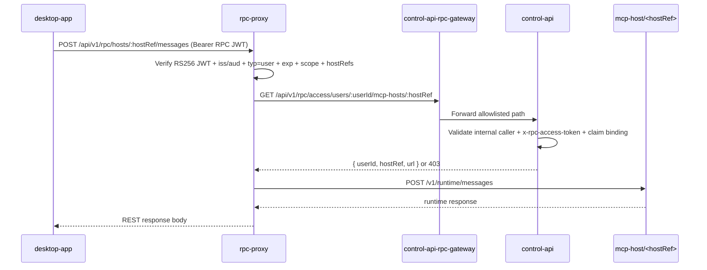

# RPC Proxy

External-facing user-scoped JSON-RPC proxy for MCP servers and MCP hosts.

## Security Model

- Clients authenticate with `external-rest-api` first.
- Clients request RPC access tokens via `external-rest-api` (`POST /api/v1/rpc/token`).
- `control-api` issues/signs the RPC JWTs via internal endpoints.
- `rpc-proxy` validates issuer, audience, signature, scopes, and expiry.
- Access is enforced by:
  - user-to-context mapping from `control-api` (`userId -> contextIds`)
  - allowed MCP servers returned by `control-api` for each user
  - allowed MCP hosts returned by `control-api` for each user
  - scope checks (`mcp:servers:list`, `mcp:server:invoke`, `host:message:invoke`, `host:status:read`, `host:health:read`, `host:activity:read`)
  - upstream server URLs provided by `control-api`

## Control API Discovery

`rpc-proxy` resolves access and MCP connectivity through `control-api`:

- uses JWT `sub` as `userId`
- calls `control-api` for `contextIds` and allowed MCP servers (including URLs)
- caches user access/server lookups in-memory for a short TTL
- treats `teamId` in the token as informational; authorization is user/context based

## Endpoints

- `GET /health`
- `GET /api/v1/rpc/servers` (requires `mcp:servers:list`)
- `POST /api/v1/rpc/:serverName` (requires `mcp:server:invoke`)
- `POST /api/v1/rpc/hosts/:hostRef/messages` (requires `host:message:invoke`)
- `GET /api/v1/rpc/hosts/:hostRef/activity` (requires `host:activity:read`)
- `GET /api/v1/rpc/hosts/:hostRef/activity/stream` (requires `host:activity:read`)
- `GET /api/v1/rpc/hosts/:hostRef/status` (requires `host:status:read`)
- `GET /api/v1/rpc/hosts/:hostRef/status/stream` (requires `host:status:read`)
- `GET /api/v1/rpc/hosts/:hostRef/health` (requires `host:health:read`)

The list above covers the core `/api/v1/rpc/*` surface. `rpc-proxy` also serves
two further route families — the **desktop proxy** (`rpc-proxy/src/routes/desktopProxy.ts`)
and the **sandbox-ui proxy** (`rpc-proxy/src/routes/sandboxUi.ts`, `/api/v1/sandbox-ui/*`).
See `rpc-proxy/src/routes/` for the complete set.

## Host Runtime Contract

Host runtime routes in `rpc-proxy` are REST-oriented and scope-specific. The status stream is a read-only telemetry channel.

| Endpoint | Method | Required Scope | Access Type | Transport |
| --- | --- | --- | --- | --- |
| `/api/v1/rpc/hosts/:hostRef/messages` | `POST` | `host:message:invoke` | Write | REST |
| `/api/v1/rpc/hosts/:hostRef/activity` | `GET` | `host:activity:read` | Read | REST |
| `/api/v1/rpc/hosts/:hostRef/activity/stream` | `GET` | `host:activity:read` | Read-only | SSE |
| `/api/v1/rpc/hosts/:hostRef/status` | `GET` | `host:status:read` | Read | REST |
| `/api/v1/rpc/hosts/:hostRef/health` | `GET` | `host:health:read` | Read | REST |
| `/api/v1/rpc/hosts/:hostRef/status/stream` | `GET` | `host:status:read` | Read-only | SSE |

Notes:
- `status/stream` does not accept request bodies and must not be used for message submission.
- `activity/stream` is read-only telemetry and never accepts message submission payloads.
- `activity` and `activity/stream` never include chain-of-thought/internal reasoning text.
- Message submission is only via `POST /api/v1/rpc/hosts/:hostRef/messages`.

`POST /api/v1/rpc/:serverName` expects a JSON-RPC 2.0 request body:

```json
{
  "jsonrpc": "2.0",
  "id": "1",
  "method": "tools/list",
  "params": {}
}
```

`POST /api/v1/rpc/hosts/:hostRef/messages` expects a REST request body:

```json
{
  "content": "hello from desktop"
}
```

Only `content` is honored. The proxy **ignores** any client-supplied
`channelType`, `sender`, and host fields, stamping its own (`channelType: "rpc"`,
`sender` = the token's `sub`) before forwarding.

## Host Message Authorization Flow



Required JWT claims for host message path:

- `typ=user`
- `sub=<userId>`
- `teamId` — optional; may be `null` (user-scoped tokens without a team are accepted). Treated as informational
- `scopes` includes `host:message:invoke`
- `hostRefs` present and non-empty (wildcard `*` is rejected); on this path the proxy does not check that `:hostRef` is a member of `hostRefs` — host authorization is delegated to `control-api`
- `iss`, `aud`, `iat`, `exp`, `jti` valid

## Troubleshooting

- `401 Unauthorized`: token malformed/expired/wrong issuer-audience/signature.
- `403 Forbidden: missing scope`: token does not include the required route scope.
- `403 Forbidden: user cannot access this host`: host denied by `control-api` RPC-access policy.
- `504 Gateway Timeout`: upstream MCP target unreachable (check network policy and service reachability).

## Environment

See `.env.example`.

Critical variables:

- `RPC_PROXY_JWT_PUBLIC_KEY`
- `RPC_PROXY_JWT_ISSUER`
- `RPC_PROXY_JWT_AUDIENCE`
- `RPC_PROXY_CONTROL_API_BASE_URL`
- `RPC_PROXY_CONTROL_API_CACHE_TTL_MS`

Required in production:
- `RPC_PROXY_CONTROL_API_SERVICE_TOKEN`

`RPC_PROXY_JWT_PUBLIC_KEY` must match the public key for `CONTROL_API_RPC_JWT_PRIVATE_KEY`.

## Local Run

```bash
cd rpc-proxy
npm install
npm run dev
```
